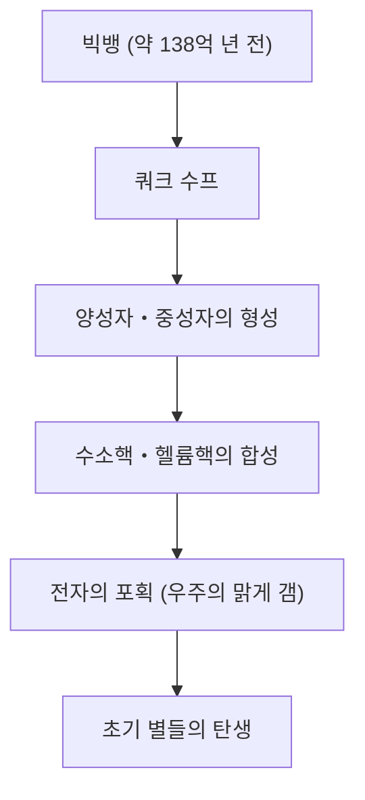

# 원소란 무엇인가: 우주를 구성하는 궁극의 블록

우주는 놀라운 다양성으로 가득 차 있습니다. 타오르는 항성, 차가운 얼음 행성, 미세한 박테리아, 그리고 지금 이 글을 읽고 있는 당신 자신까지. 전혀 달라 보이는 이 모든 것들은 단 하나의 공통된 기초로 이루어져 있습니다. 그것이 바로 '원소'입니다.

본 기사에서는 우주의 시작부터 별들의 죽음, 그리고 현대 과학의 최전선인 초중원소 탐구에 이르기까지 원소라는 존재의 근원적인 수수께끼에 다가갑니다. 화학과 물리학이 교차하는 주기율표의 세계로 오신 것을 환영합니다.

## 1. 우주의 시작과 원소의 탄생

우리 우주를 구성하는 물질은 어디에서 왔을까요? 그 해답을 찾기 위해서는 약 138억 년 전의 빅뱅까지 거슬러 올라가야 합니다.

### 빅뱅 핵합성 (초기 우주의 원소 합성)

빅뱅 직후의 우주는 초고온, 초고밀도 에너지 수프였습니다. 우주가 팽창하고 냉각됨에 따라 쿼크가 결합하여 양성자와 중성자 같은 핵자가 생겨났습니다. 이것이 물질의 시작입니다.

빅뱅으로부터 약 3분 후, 우주의 온도가 약 10억 도까지 떨어지자 양성자와 중성자가 결합하여 최초의 원자핵이 형성되었습니다. 이 과정에서 태어난 것이 우주에서 가장 가볍고 가장 풍부한 두 가지 원소인 수소(H)와 헬륨(He)입니다. 극미량의 리튬(Li)과 베릴륨(Be)도 생성되었지만, 우주 초기 단계에 만들어진 원소는 이것뿐이었습니다. 당시 우주에는 탄소도, 산소도, 철도 존재하지 않았습니다.

## 2. 별들: 우주의 거대한 연금술 용광로

초기 우주에는 가벼운 원소밖에 없었지만, 현재 우리가 아는 풍요로운 세계를 형성하는 무거운 원소는 모두 별의 내부에서 만들어졌습니다. 칼 세이건이 "우리는 별의 먼지로 만들어졌다(We are made of star-stuff)"라고 말한 것은 단순한 시적 표현이 아니라 엄밀한 과학적 사실입니다.

### 항성 내부에서의 핵융합

별의 중심부는 거대한 핵융합로입니다. 우리 태양과 같은 항성은 중심부의 초고압, 초고온 환경에서 수소를 헬륨으로 변환함으로써 에너지를 만들어냅니다.

별이 수소를 다 써버리면 이번에는 헬륨을 태워 탄소(C)나 산소(O)를 만들기 시작합니다. 질량이 태양의 8배 이상인 거대한 별의 경우 온도가 더욱 올라가 네온(Ne), 마그네슘(Mg), 규소(Si)와 같이 더 무거운 원소가 차례로 합성됩니다. 그러나 이 프로세스는 철(Fe)에서 멈춥니다. 철의 원자핵은 가장 안정적이어서, 철을 핵융합시키려고 하면 에너지를 방출하는 것이 아니라 반대로 흡수해 버리기 때문입니다.

### 초신성 폭발과 중성자별의 충돌

별의 중심핵이 철로 가득 차면 핵융합에 의한 바깥을 향하는 압력이 사라지고, 별은 자체 중력에 의해 순식간에 붕괴됩니다(중력 붕괴). 그 반동으로 일어나는 것이 초신성 폭발입니다.

이 폭발적인 환경에서 철보다 무거운 원소(금, 은, 우라늄 등)가 순식간에 생성됩니다. 게다가 최근에는 금이나 백금 등 매우 무거운 원소의 대부분은 두 개의 중성자별이 충돌, 병합할 때 일어나는 '킬로노바'라는 현상에서 생성된다는 것이 중력파 관측을 통해 확인되었습니다.

## 3. 원소의 발견과 인류의 역사

인류는 고대부터 금(Au), 은(Ag), 구리(Cu), 철(Fe), 납(Pb), 수은(Hg) 등 몇 가지 원소를 알고 있었습니다. 그러나 이것들이 '원소(더 이상 나눌 수 없는 기본적인 물질)'라는 현대적인 이해에 도달하기까지는 오랜 시간이 걸렸습니다.

### 연금술에서 근대 화학으로

중세의 연금술사들은 비금속을 금으로 바꾸는 '현자의 돌'을 찾아 헤맸습니다. 그들의 시도는 실패로 끝났지만, 그 과정에서 증류나 추출과 같은 화학적 조작법이 확립되었고 인(P) 등의 새로운 원소가 발견되었습니다.

17세기가 되자 로버트 보일이 저서 '회의적인 화학자'에서 고대 그리스의 4원소설(불, 공기, 물, 흙)을 부정하고 근대적인 원소 개념을 제창했습니다. 그리고 18세기 후반 앙투안 라부아지에가 연소의 본질이 산소와의 결합임을 밝혀내고 당시 알려져 있던 33개 원소의 목록을 작성했습니다.

## 4. 멘델레예프와 주기율표의 마법

19세기에는 수많은 원소가 발견되었고, 과학자들은 그 다양한 성질 속에서 규칙성을 찾아내려고 노력했습니다. 그 정점에 선 것이 러시아의 화학자 드미트리 멘델레예프입니다.

1869년, 멘델레예프는 당시 알려진 63개의 원소를 원자량 순으로 나열하여 성질이 비슷한 원소가 주기적으로 나타나는 것을 발견했습니다. 그의 가장 큰 공로는 규칙성을 유지하기 위해 주기율표에 '빈칸'을 남겨두고, 그곳에 아직 발견되지 않은 원소가 존재한다고 예언한 것입니다.

예를 들어 그는 규소 아래에 있는 빈칸을 '에카규소'라고 이름 짓고, 그 원자량이나 비중 등을 상세히 예측했습니다. 15년 후, 독일의 화학자 클레멘스 빙클러가 저마늄(Ge)을 발견했고, 그 성질이 멘델레예프의 예측과 놀랍도록 일치하면서 주기율표의 정당성이 세계에 증명되었습니다.

## 5. 양자역학이 밝혀내는 "왜 주기성이 있는가"

멘델레예프는 주기율표를 만들었지만 "왜" 그런 주기성이 생기는지는 설명하지 못했습니다. 그 해답은 20세기 초에 탄생한 양자역학에 의해 제시되었습니다.

원자는 중심에 있는 플러스 전하를 띤 '원자핵(양성자와 중성자)'과 그 주위를 도는 마이너스 전하를 띤 '전자'로 구성되어 있습니다. 원소의 종류(원자 번호)를 결정하는 것은 원자핵에 포함된 '양성자의 수'입니다.

### 전자껍질과 파울리의 배타 원리

전자는 원자핵 주위를 무작위로 도는 것이 아니라, 특정 에너지 준위(전자껍질)에만 존재할 수 있습니다. 게다가 볼프강 파울리가 제창한 '파울리의 배타 원리'에 의해 하나의 궤도에는 제한된 수의 전자만 들어갈 수 있습니다.

주기율표의 세로 열(족)이 비슷한 화학적 성질을 가지는 이유는 가장 바깥쪽 전자껍질에 있는 전자(원자가전자)의 수가 같기 때문입니다. 화학 반응이란 본질적으로 원자끼리 가장 바깥쪽 전자를 주고받거나 공유하는 현상입니다. 양자역학은 멘델레예프의 직관적인 표에 확고한 물리학적 기초를 제공한 것입니다.

## 6. 문명을 지탱하는 중요한 원소들

주기율표에 있는 118개 원소 중 지구상에서 자연적으로 발견되는 것은 90여 종입니다. 그중에는 인류 문명이나 생명 자체에 필수불가결한 것들이 있습니다.

- **탄소(C)**: 생명의 기반. 다른 원자와 4개의 결합을 만드는 능력을 통해 DNA나 단백질과 같은 무한히 복잡한 분자의 골격이 됩니다.
- **철(Fe)**: 지구 질량의 약 32%를 차지. 인류의 산업혁명을 뒷받침했으며 지금도 현대 인프라의 기반이 되고 있습니다.
- **규소(Si)**: 반도체의 주역. 컴퓨터에서 스마트폰, AI에 이르기까지 정보화 사회는 규소의 결정(실리콘 웨이퍼) 위에 세워져 있습니다.
- **희토류(희토류 원소)**: 네오디뮴(Nd)이나 디스프로슘(Dy) 등은 강력한 영구자석을 만드는 데 필수적이며 전기 자동차의 모터나 풍력 발전기에 없어서는 안 될 존재입니다.

## 7. 미지의 영역으로: 초중원소와 안정의 섬

자연계에 존재하는 가장 무거운 원소는 우라늄(원자 번호 92)입니다. 그보다 무거운 원소(초우라늄 원소)는 인간이 입자 가속기를 사용하여 인공적으로 만들어낸 것입니다.

현재 주기율표는 원자 번호 118번 오가네손(Og)까지 완성되어 있습니다. 이러한 '초중원소'들은 매우 불안정해서, 만들어져도 순식간에(밀리초 이하) 붕괴하여 다른 가벼운 원소가 되어버립니다.

그러나 원자핵 물리학 이론은 '안정의 섬'이라 불리는 영역이 존재한다고 예언하고 있습니다. 양성자나 중성자의 수가 특정한 '마법의 수'가 되면 원자핵이 구형에 가까운 안정된 상태가 되어 수명이 비약적으로 길어진다는 가설입니다. 만약 안정의 섬에 속하는 원소를 발견할 수 있다면 지금까지 본 적 없는 전혀 새로운 성질을 가진 물질을 얻게 될지도 모릅니다.

## 8. 결론: 우주의 퍼즐 조각

우리 주변에 있는 모든 것들은 100여 가지 '블록'의 조합에 불과합니다. 그 블록은 138억 년 전의 빅뱅이나 아득히 먼 곳에서의 별의 죽음과 같은 장대한 우주의 드라마 속에서 단조되었습니다.

주기율표는 단순한 화학 도구가 아닙니다. 그것은 우주가 스스로를 형성하고 복잡한 생명을 탄생시키기에 이른 '레시피 북'입니다. 다음에 물을 마시거나 깊게 심호흡을 하거나 스마트폰을 집어 들 때 조금만 상상해 보세요. 당신을 구성하고 있는 그 원자들은 과거 우주 어딘가에서, 별의 심장부에서 타오르고 있었다는 것을.
