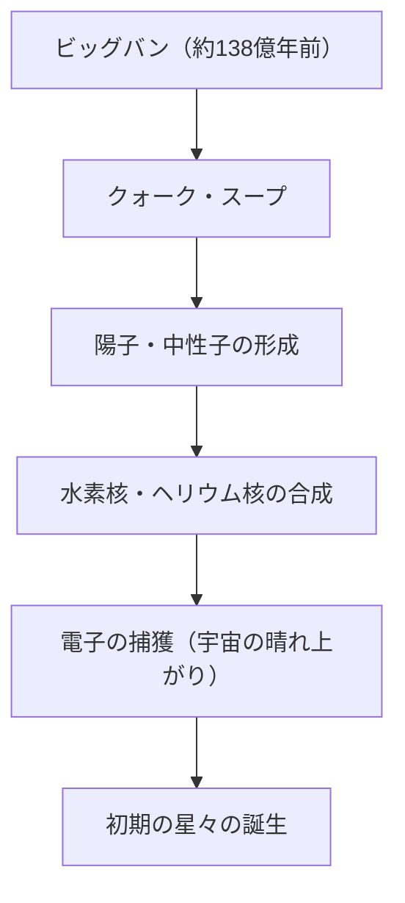
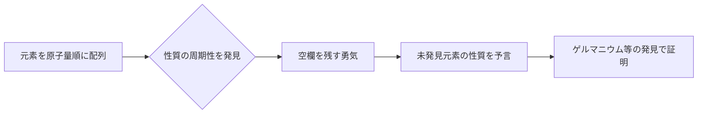

# 元素とは何か：宇宙を構成する究極のブロック

宇宙は驚くべき多様性に満ちています。燃え盛る恒星、冷たい氷の惑星、微小なバクテリア、そして今この記事を読んでいるあなた自身。これらの全く異なるように見えるすべてのものは、たった一つの共通の基礎から成り立っています。それが「元素」です。

本記事では、宇宙の始まりから星々の死、そして現代科学の最先端である超重元素の探求に至るまで、元素という存在の根源的な謎に迫ります。化学と物理学が交差する周期表の世界へようこそ。

## 1. 宇宙の始まりと元素の誕生

私たちの宇宙を構成する物質は、どこから来たのでしょうか？その答えを出すためには、約138億年前のビッグバンまで遡る必要があります。

### ビッグバン・ヌクレオセシンス（初期宇宙の元素合成）

ビッグバン直後の宇宙は、超高温・超高密度のエネルギーのスープでした。宇宙が膨張し冷却するにつれて、クォークが結合して陽子や中性子といった核子が生まれました。これが物質の始まりです。

ビッグバンから約3分後、宇宙の温度が約10億度まで下がると、陽子と中性子が結合して最初の原子核が形成されました。この過程で生まれたのが、宇宙で最も軽く、最も豊富な2つの元素、水素（H）とヘリウム（He）です。ごく微量のリチウム（Li）とベリリウム（Be）も生成されましたが、宇宙の初期段階で作られた元素はこれだけでした。当時の宇宙には、炭素も酸素も鉄も存在していなかったのです。

## 2. 星々：宇宙の巨大な錬金術炉

初期宇宙には軽元素しかありませんでしたが、現在の私たちが知る豊かな世界を形作る重元素は、すべて星の内部で作られました。カール・セーガンが「私たちは星屑でできている（We are made of star-stuff）」と言ったのは、単なる詩的な表現ではなく、厳密な科学的事実なのです。

### 恒星内部での核融合

星の中心部は巨大な核融合炉です。私たちの太陽のような恒星は、中心部の超高圧・超高温環境で水素をヘリウムに変換することでエネルギーを生み出しています。

星が水素を使い果たすと、今度はヘリウムを燃やして炭素（C）や酸素（O）を作り始めます。質量が太陽の8倍以上ある巨大な星の場合、さらに温度が上がり、ネオン（Ne）、マグネシウム（Mg）、ケイ素（Si）といったより重い元素が次々と合成されていきます。しかし、このプロセスは鉄（Fe）で止まります。鉄の原子核は最も安定しており、鉄を核融合させようとするとエネルギーを放出するのではなく、逆に吸収してしまうからです。

### 超新星爆発と中性子星の衝突

星の中心核が鉄で満たされると、核融合による外向きの圧力が失われ、星は自身の重力で一気に潰れます（重力崩壊）。その反動で起きるのが超新星爆発です。

この爆発的な環境において、鉄より重い元素（金、銀、ウランなど）が一瞬にして生成されます。さらに近年、金やプラチナなどの非常に重い元素の大半は、2つの中性子星が衝突・合体する際に起こる「キロノヴァ」という現象で生成されることが重力波観測によって確認されました。

## 3. 元素の発見と人類の歴史

人類は古代から、金（Au）、銀（Ag）、銅（Cu）、鉄（Fe）、鉛（Pb）、水銀（Hg）といったいくつかの元素を知っていました。しかし、これらが「元素（それ以上分割できない基本的な物質）」であるという現代的な理解に達するまでには、長い時間がかかりました。

### 錬金術から近代化学へ

中世の錬金術師たちは、卑金属を金に変える「賢者の石」を探し求めました。彼らの試みは失敗に終わりましたが、その過程で蒸留や抽出といった化学的操作法が確立され、リン（P）などの新しい元素が発見されました。

17世紀になると、ロバート・ボイルが著書『懐疑的化学者』で古代ギリシャの四元素説（火・空気・水・土）を否定し、近代的な元素の概念を提唱しました。そして18世紀後半、アントワーヌ・ラヴォアジエが燃焼の本質が酸素との結合であることを突き止め、当時知られていた33の元素のリストを作成しました。

## 4. メンデレーエフと周期表の魔法

19世紀には多数の元素が発見され、科学者たちはその多様な性質の中に規則性を見出そうと努力しました。その頂点に立ったのが、ロシアの化学者ドミトリ・メンデレーエフです。

1869年、メンデレーエフは当時知られていた63の元素を原子量の順に並べ、性質が似た元素が周期的に現れることを発見しました。彼の最大の功績は、規則性を維持するために周期表に「空欄」を残し、そこに未発見の元素が存在すると予言したことです。

例えば彼は、ケイ素の下にある空欄を「エカケイ素」と名付け、その原子量や比重などを詳細に予測しました。15年後、ドイツの化学者クレメンス・ヴィンクラーがゲルマニウム（Ge）を発見し、その性質がメンデレーエフの予測と驚くほど一致していたことで、周期表の正しさが世界に証明されました。

## 5. 量子力学が解き明かす「なぜ周期性があるのか」

メンデレーエフは周期表を作成しましたが、「なぜ」そのような周期性が生まれるのかは説明できませんでした。その答えは、20世紀初頭に誕生した量子力学によってもたらされました。

原子は、中心にあるプラスの電荷を持つ「原子核（陽子と中性子）」と、その周りを回るマイナスの電荷を持つ「電子」から構成されています。元素の種類（原子番号）を決めるのは、原子核に含まれる「陽子の数」です。

### 電子殻とパウリの排他原理

電子は原子核の周りをデタラメに回っているのではなく、特定のエネルギー準位（電子殻）にのみ存在できます。さらに、ヴォルフガング・パウリが提唱した「パウリの排他原理」により、一つの軌道には限られた数の電子しか入れません。

周期表の縦の列（族）が似た化学的性質を持つ理由は、一番外側の電子殻にある電子（価電子）の数が同じだからです。化学反応とは、本質的に原子同士が一番外側の電子をやり取りしたり共有したりする現象です。量子力学は、メンデレーエフの直感的な表に強固な物理学的基礎を与えたのです。

## 6. 文明を支える重要な元素たち

周期表にある118の元素のうち、地球上で自然に見つかるのは90種類ほどです。その中には、人類の文明や生命そのものに不可欠なものがあります。

- **炭素（C）**: 生命の基盤。他の原子と4つの結合を作る能力により、DNAやタンパク質といった無限に複雑な分子の骨格となります。
- **鉄（Fe）**: 地球の質量の約32%を占める。人類の産業革命を支え、今も現代インフラの基盤であり続けています。
- **ケイ素（Si）**: 半導体の主役。コンピューターからスマートフォン、AIに至るまで、情報化社会はケイ素の結晶（シリコンウェハー）の上に築かれています。
- **レアアース（希土類元素）**: ネオジム（Nd）やジスプロシウム（Dy）などは強力な永久磁石を作るために不可欠であり、電気自動車のモーターや風力発電機に不可欠です。

## 7. 未知の領域へ：超重元素と安定の島

自然界に存在する最も重い元素はウラン（原子番号92）です。それより重い元素（超ウラン元素）は、人間が粒子加速器を使って人工的に作り出したものです。

現在、周期表は原子番号118のオガネソン（Og）まで完成しています。これらの「超重元素」は非常に不安定で、作り出されても一瞬（ミリ秒以下）で崩壊して別の軽い元素になってしまいます。

しかし、原子核物理学の理論は「安定の島」と呼ばれる領域が存在することを予言しています。陽子や中性子の数が特定の「魔法数」になると、原子核が球形に近い安定した状態になり、寿命が飛躍的に長くなるという仮説です。もし安定の島に属する元素を発見できれば、これまで見たこともないような全く新しい性質を持つ物質が手に入るかもしれません。

## 8. 結論：宇宙のパズルピース

私たちの身の回りにあるものはすべて、100種類余りの「ブロック」の組み合わせに過ぎません。そのブロックは、138億年前のビッグバンや、はるか彼方での星の死といった壮大な宇宙のドラマの中で鍛造されました。

周期表は単なる化学のツールではありません。それは、宇宙が自らを形作り、複雑な生命を生み出すに至った「レシピ帳」なのです。次に水を飲んだり、深く深呼吸をしたり、スマートフォンを手に取ったりするときには、少しだけ想像してみてください。あなたを構成しているその原子たちは、かつて宇宙のどこかで、星の心臓部で燃え上がっていたのだということを。
