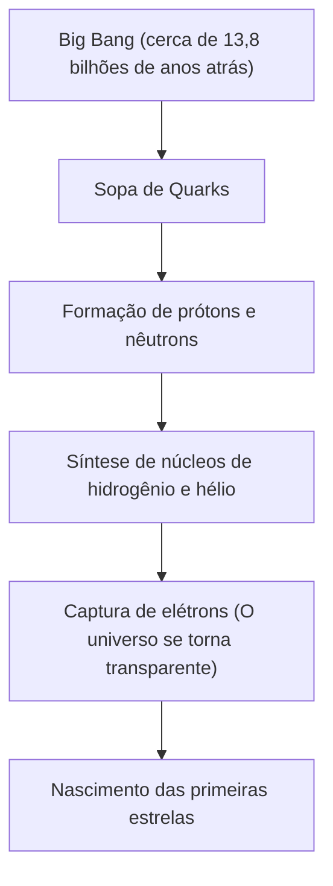

# O que são Elementos: Os Blocos de Construção Finais do Universo

O universo está cheio de uma diversidade surpreendente. Estrelas ardentes, planetas gelados, bactérias minúsculas e você mesmo lendo este artigo agora. Todas essas coisas que parecem completamente diferentes são compostas por uma única base em comum. E são os "elementos".

Neste artigo, exploraremos os mistérios fundamentais da existência dos elementos, desde o início do universo até a morte das estrelas e a vanguarda da ciência moderna, a busca pelos elementos superpesados. Bem-vindo ao mundo da tabela periódica, onde a química e a física se cruzam.

## 1. O Início do Universo e o Nascimento dos Elementos

De onde veio a matéria que compõe o nosso universo? Para responder a isso, precisamos voltar cerca de 13,8 bilhões de anos até o Big Bang.

### Nucleossíntese do Big Bang (Síntese de Elementos no Universo Primordial)

O universo imediatamente após o Big Bang era uma sopa de energia com temperaturas e densidades ultra-altas. À medida que o universo se expandia e esfriava, os quarks se combinavam para formar nucleons como prótons e nêutrons. Este foi o começo da matéria.

Cerca de três minutos após o Big Bang, a temperatura do universo caiu para cerca de 1 bilhão de graus e os prótons e nêutrons se combinaram para formar os primeiros núcleos atômicos. O processo produziu os dois elementos mais leves e abundantes do universo, o hidrogênio (H) e o hélio (He). Quantidades vestigiais de lítio (Li) e berílio (Be) também foram produzidas, mas estes foram os únicos elementos criados nos estágios iniciais do universo. Naquela época, o carbono, o oxigênio e o ferro ainda não existiam no universo.

## 2. Estrelas: Os Fornos Alquímicos Gigantes do Universo

O universo inicial tinha apenas elementos leves, mas os elementos pesados que compõem o mundo rico que conhecemos hoje foram todos criados no interior das estrelas. Quando Carl Sagan disse que "somos feitos de poeira de estrelas", não era apenas uma expressão poética, mas um fato científico estrito.

### Fusão Nuclear no Interior das Estrelas

O núcleo de uma estrela é um forno de fusão nuclear gigante. Uma estrela como o nosso Sol produz energia através da conversão de hidrogênio em hélio no ambiente de temperatura e pressão ultra-altas em seu núcleo.

Quando uma estrela esgota seu hidrogênio, ela começa a queimar hélio para criar carbono (C) e oxigênio (O). No caso de estrelas gigantes com mais de 8 vezes a massa do Sol, a temperatura sobe ainda mais e elementos mais pesados como o néon (Ne), magnésio (Mg) e silício (Si) são sintetizados um após o outro. No entanto, este processo para no ferro (Fe). O núcleo do ferro é o mais estável, e a tentativa de fundir o ferro não apenas absorveria energia em vez de liberá-la, mas faria com que o processo falhasse.

### Explosões de Supernovas e Colisões de Estrelas de Nêutrons

Quando o núcleo de uma estrela está cheio de ferro, a pressão externa da fusão nuclear é perdida e a estrela colapsa subitamente sob a sua própria gravidade (colapso gravitacional). O resultado é uma explosão de supernova.

Neste ambiente explosivo, os elementos mais pesados que o ferro (ouro, prata, urânio, etc.) são produzidos numa fração de segundo. Além disso, observações de ondas gravitacionais nos últimos anos confirmaram que a maioria dos elementos muito pesados como o ouro e a platina são produzidos pelo fenômeno da "kilonova", que ocorre quando duas estrelas de nêutrons colidem e se fundem.

## 3. A Descoberta dos Elementos e a História Humana

Desde a antiguidade, a humanidade conhece vários elementos como ouro (Au), prata (Ag), cobre (Cu), ferro (Fe), chumbo (Pb) e mercúrio (Hg). No entanto, levou muito tempo para que eles alcançassem a compreensão moderna de que são "elementos (substâncias fundamentais que não podem ser mais divididas)".

### Da Alquimia à Química Moderna

Os alquimistas na Idade Média procuraram a "Pedra Filosofal" que transformaria metais básicos em ouro. As suas tentativas fracassaram, mas no processo, operações químicas como destilação e extração foram estabelecidas e novos elementos como o fósforo (P) foram descobertos.

No século 17, Robert Boyle rejeitou a antiga teoria grega dos quatro elementos (fogo, ar, água, terra) em seu livro 'O Químico Cético' e propôs um conceito moderno de elemento. No final do século 18, Antoine Lavoisier descobriu que a essência da combustão era a ligação com o oxigênio e elaborou uma lista dos 33 elementos conhecidos na época.

## 4. Mendeleev e a Magia da Tabela Periódica

No século 19, muitos elementos foram descobertos, e os cientistas tentaram encontrar regularidade em suas propriedades diversas. No topo disto estava o químico russo Dmitri Mendeleev.

Em 1869, Mendeleev organizou os 63 elementos então conhecidos em ordem de peso atômico e descobriu que elementos com propriedades semelhantes apareciam periodicamente. A sua maior conquista foi prever que existiriam elementos não descobertos, deixando espaços "em branco" na tabela periódica para manter a regularidade.

Por exemplo, ele chamou a lacuna abaixo do silício de "eka-silício" e predisse o seu peso atômico, gravidade específica e muito mais com grande detalhe. 15 anos depois, o químico alemão Clemens Winkler descobriu o germânio (Ge), cujas propriedades coincidiam surpreendentemente bem com as previsões de Mendeleev, provando a validade da tabela periódica ao mundo.

## 5. "Por Que Existe Periodicidade?" Revelada pela Mecânica Quântica

Mendeleev criou a tabela periódica, mas não conseguiu explicar "por que" ocorreu essa periodicidade. A resposta foi fornecida pela mecânica quântica, nascida no início do século 20.

Um átomo consiste em um "núcleo" (prótons e nêutrons) com uma carga positiva no centro e "elétrons" com uma carga negativa girando em torno dele. É o "número de prótons" contidos no núcleo atômico que determina o tipo de elemento (número atômico).

### Camadas de Elétrons e o Princípio de Exclusão de Pauli

Os elétrons não giram aleatoriamente em torno do núcleo, mas só podem existir em níveis de energia específicos (camadas de elétrons). Além disso, o "Princípio de Exclusão de Pauli", proposto por Wolfgang Pauli, afirma que apenas um número limitado de elétrons pode entrar numa órbita.

A razão pela qual as colunas verticais (grupos) da tabela periódica têm propriedades químicas semelhantes é que o número de elétrons na camada de elétrons mais externa (elétrons de valência) é o mesmo. As reações químicas são essencialmente o processo de átomos que trocam ou compartilham os elétrons mais externos. A mecânica quântica forneceu uma base física sólida para a tabela intuitiva de Mendeleev.

## 6. Elementos Importantes que Sustentam a Civilização

Dos 118 elementos da tabela periódica, cerca de 90 podem ser encontrados naturalmente na Terra. Entre eles, alguns são essenciais para a civilização humana e a própria vida.

- **Carbono (C)**: A base da vida. A sua capacidade de formar quatro ligações com outros átomos torna-o o esqueleto para um número infinito de moléculas complexas, como o ADN e as proteínas.
- **Ferro (Fe)**: Representa cerca de 32% da massa da Terra. Tem apoiado a Revolução Industrial da humanidade e continua a ser a base da infraestrutura moderna.
- **Silício (Si)**: O papel principal dos semicondutores. Desde os computadores e os smartphones até à inteligência artificial, a sociedade da informação baseia-se em cristais de silício (bolachas de silício).
- **Terras raras (Elementos de terras raras)**: O neodímio (Nd) e o disprósio (Dy) são cruciais para fazer ímãs permanentes fortes, e são essenciais para motores de veículos elétricos e geradores de energia eólica.

## 7. No Desconhecido: Elementos Superpesados e a Ilha de Estabilidade

O elemento mais pesado encontrado na natureza é o urânio (número atômico 92). Os elementos mais pesados do que esse (elementos transurânicos) foram criados artificialmente pelos seres humanos usando aceleradores de partículas.

Atualmente, a tabela periódica foi completada até o Oganesson (Og) com número atômico 118. Esses "elementos superpesados" são altamente instáveis e, mesmo que sejam criados, eles decaem instantaneamente (menos de um milissegundo) para outros elementos mais leves.

No entanto, as teorias da física nuclear prevêem a existência de uma região chamada "ilha de estabilidade". A hipótese é que quando o número de prótons e nêutrons atinge um "número mágico" específico, o núcleo atômico entra num estado quase esférico e estável, e o tempo de vida aumenta dramaticamente. Se conseguirmos descobrir elementos pertencentes à ilha da estabilidade, poderemos ser capazes de obter materiais com propriedades completamente novas que nunca vimos antes.

## 8. Conclusão: As Peças do Quebra-cabeça do Universo

Tudo ao nosso redor é apenas uma combinação de mais de 100 tipos de "blocos". Esses blocos foram forjados no drama grandioso do universo, como o Big Bang há 13,8 bilhões de anos e a morte de estrelas muito distantes.

A tabela periódica não é apenas uma ferramenta química. É um "livro de receitas" de como o universo se moldou e chegou a criar vida complexa. Da próxima vez que você beber água, respirar fundo, ou pegar o seu smartphone, imagine um pouco. Os átomos que o compõem estavam queimando uma vez em algum lugar no universo, no coração de uma estrela.
