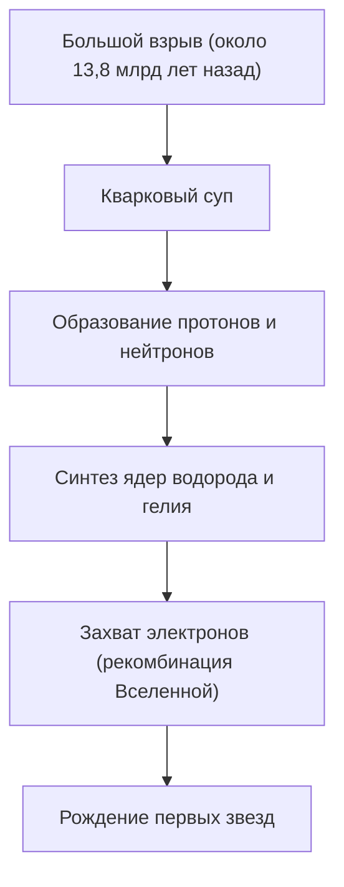
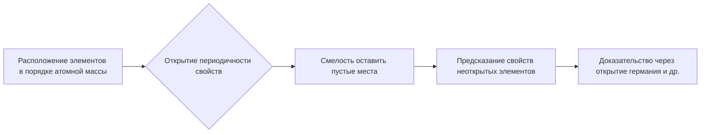

# Что такое химические элементы: фундаментальные строительные блоки Вселенной

Вселенная полна удивительного разнообразия. Пылающие звезды, ледяные планеты, крошечные бактерии и вы сами, читающие сейчас эту статью. Все эти, казалось бы, совершенно разные вещи состоят из одного и того же фундамента. Это 'химические элементы'.

В этой статье мы раскроем фундаментальную загадку существования элементов, от зарождения Вселенной до смерти звезд и исследования сверхтяжелых элементов на переднем крае современной науки. Добро пожаловать в мир периодической таблицы, где пересекаются химия и физика.

## 1. Зарождение Вселенной и рождение элементов

Откуда взялась материя, из которой состоит наша Вселенная? Чтобы ответить на этот вопрос, нам нужно вернуться примерно на 13,8 миллиардов лет назад, к Большому взрыву.

### Нуклеосинтез Большого взрыва (Синтез элементов в ранней Вселенной)

Сразу после Большого взрыва Вселенная представляла собой энергетический суп сверхвысокой температуры и плотности. По мере расширения и охлаждения Вселенной кварки соединялись, образуя нуклоны, такие как протоны и нейтроны. Это было началом материи.

Примерно через 3 минуты после Большого взрыва температура Вселенной упала примерно до 1 миллиарда градусов, и протоны и нейтроны соединились, образовав первые атомные ядра. В ходе этого процесса родились два самых легких и самых распространенных элемента во Вселенной — водород (H) и гелий (He). Также образовались следовые количества лития (Li) и бериллия (Be), но это были единственные элементы, созданные на ранних стадиях развития Вселенной. В то время во Вселенной не было ни углерода, ни кислорода, ни железа.

## 2. Звезды: гигантские алхимические печи Вселенной

В то время как в ранней Вселенной существовали только легкие элементы, тяжелые элементы, которые формируют богатый мир, который мы знаем сегодня, все были созданы внутри звезд. Знаменитое высказывание Карла Сагана 'Мы сделаны из звездного вещества (We are made of star-stuff)' — это не просто поэтическое выражение, а строгий научный факт.

### Ядерный синтез внутри звезд

Ядро звезды — это гигантский термоядерный реактор. Звезды, подобные нашему Солнцу, вырабатывают энергию, превращая водород в гелий в условиях сверхвысокого давления и сверхвысоких температур в своих недрах.

Когда у звезды заканчивается водород, она начинает сжигать гелий, чтобы произвести углерод (C) и кислород (O). Для массивных звезд, масса которых более чем в 8 раз превышает массу Солнца, температура повышается еще больше, и один за другим синтезируются более тяжелые элементы, такие как неон (Ne), магний (Mg) и кремний (Si). Однако этот процесс останавливается на железе (Fe). Ядра железа являются наиболее стабильными, и любая попытка слить железо приведет к поглощению энергии, а не к ее высвобождению.

### Взрывы сверхновых и столкновения нейтронных звезд

Когда ядро звезды заполняется железом, направленное наружу давление ядерного синтеза теряется, и звезда мгновенно коллапсирует под действием собственной гравитации (гравитационный коллапс). Реакцией на это является взрыв сверхновой.

В этой взрывоопасной среде элементы тяжелее железа (такие как золото, серебро, уран и т. д.) создаются в одно мгновение. Более того, в последние годы благодаря наблюдениям за гравитационными волнами было подтверждено, что большинство очень тяжелых элементов, таких как золото и платина, образуются в результате явления, называемого 'килоновой', которое происходит при столкновении и слиянии двух нейтронных звезд.

## 3. Открытие элементов и история человечества

С древних времен человечество знало несколько элементов, таких как золото (Au), серебро (Ag), медь (Cu), железо (Fe), свинец (Pb) и ртуть (Hg). Однако потребовалось много времени, чтобы прийти к современному пониманию того, что это 'элементы (основные вещества, которые невозможно разделить дальше)'.

### От алхимии к современной химии

Алхимики в средние века искали 'философский камень', чтобы превратить недрагоценные металлы в золото. Их попытки провалились, но в процессе были созданы методы химических манипуляций, такие как дистилляция и экстракция, и были открыты новые элементы, такие как фосфор (P).

В 17 веке Роберт Бойль в своей книге 'Химик-скептик' отверг древнегреческую теорию четырех элементов (огонь, воздух, вода, земля) и предложил современную концепцию элементов. Затем, в конце 18 века, Антуан Лавуазье обнаружил, что суть горения заключается в соединении с кислородом, и составил список из 33 известных в то время элементов.

## 4. Менделеев и магия периодической таблицы

В 19 веке было открыто множество элементов, и ученые пытались найти закономерности в их разнообразных свойствах. На вершине этих усилий стоял русский химик Дмитрий Менделеев.

В 1869 году Менделеев расположил 63 известных тогда элемента в порядке их атомных масс и обнаружил, что элементы со сходными свойствами появляются периодически. Его величайшим достижением было то, что он оставил в периодической таблице 'пустые места', чтобы сохранить регулярность, и предсказал, что там существуют неоткрытые элементы.

Например, он назвал пустое место под кремнием 'экакремнием' и подробно предсказал его атомную массу, удельный вес и так далее. 15 лет спустя немецкий химик Клеменс Винклер открыл германий (Ge), и его свойства поразительно совпали с предсказаниями Менделеева, что доказало миру правильность периодической таблицы.

## 5. Квантовая механика раскрывает 'почему существует периодичность'

Менделеев создал периодическую таблицу, но он не мог объяснить 'почему' возникает такая периодичность. Ответ дала квантовая механика, зародившаяся в начале 20 века.

Атомы состоят из 'атомного ядра' (протонов и нейтронов) с положительным зарядом в центре и 'электронов' с отрицательным зарядом, вращающихся вокруг него. Тип элемента (атомный номер) определяется 'количеством протонов', содержащихся в атомном ядре.

### Электронные оболочки и принцип запрета Паули

Электроны не вращаются вокруг атомного ядра случайным образом, а могут существовать только на определенных энергетических уровнях (электронных оболочках). Более того, согласно 'принципу запрета Паули', предложенному Вольфгангом Паули, на одной орбитали может находиться только ограниченное количество электронов.

Причина, по которой вертикальные столбцы (группы) периодической таблицы имеют схожие химические свойства, заключается в том, что они имеют одинаковое количество электронов (валентных электронов) на самой внешней электронной оболочке. Химические реакции — это, по сути, явления, при которых атомы обмениваются своими крайними электронами или делят их друг с другом. Квантовая механика обеспечила прочную физическую основу интуитивной таблице Менделеева.

## 6. Важные элементы, поддерживающие цивилизацию

Из 118 элементов в периодической таблице только около 90 встречаются в природе на Земле. Среди них есть те, которые необходимы для человеческой цивилизации и самой жизни.

- **Углерод (C)**: Основа жизни. Его способность образовывать четыре связи с другими атомами делает его скелетом бесконечно сложных молекул, таких как ДНК и белки.
- **Железо (Fe)**: Составляет около 32% массы Земли. Оно поддержало промышленную революцию человечества и продолжает оставаться основой современной инфраструктуры.
- **Кремний (Si)**: Главный герой полупроводников. От компьютеров до смартфонов и ИИ — информационное общество построено на кристаллах кремния (кремниевых пластинах).
- **Редкоземельные элементы**: Неодим (Nd), диспрозий (Dy) и другие необходимы для создания мощных постоянных магнитов и являются незаменимыми для двигателей электромобилей и ветрогенераторов.

## 7. В неизведанные области: сверхтяжелые элементы и остров стабильности

Самый тяжелый элемент, существующий в природе, — это уран (атомный номер 92). Элементы тяжелее него (трансурановые элементы) были созданы искусственно людьми с помощью ускорителей частиц.

В настоящее время периодическая таблица заполнена до оганесона (Og) с атомным номером 118. Эти 'сверхтяжелые элементы' чрезвычайно нестабильны и, даже если они образуются, они распадаются на другие более легкие элементы за доли секунды (миллисекунды или меньше).

Однако теории ядерной физики предсказывают существование области, называемой 'островом стабильности'. Это гипотеза о том, что когда количество протонов и нейтронов достигает определенного 'магического числа', атомное ядро принимает стабильное состояние, близкое к сферическому, и срок его жизни резко увеличивается. Если мы сможем открыть элементы, принадлежащие к острову стабильности, мы сможем получить материалы с совершенно новыми свойствами, которых никогда раньше не видели.

## 8. Заключение: кусочки космической головоломки

Все вокруг нас — это не более чем комбинация примерно 100 различных 'строительных блоков'. Эти блоки были выкованы в грандиозной космической драме, такой как Большой взрыв 13,8 миллиардов лет назад и смерть звезд далеко-далеко.

Периодическая таблица — это не просто инструмент химии. Это 'книга рецептов' о том, как Вселенная сформировала себя и породила сложную жизнь. В следующий раз, когда вы будете пить воду, сделаете глубокий вдох или возьмете в руки свой смартфон, просто представьте на мгновение. Атомы, из которых вы состоите, когда-то пылали в сердцах звезд где-то во Вселенной.
