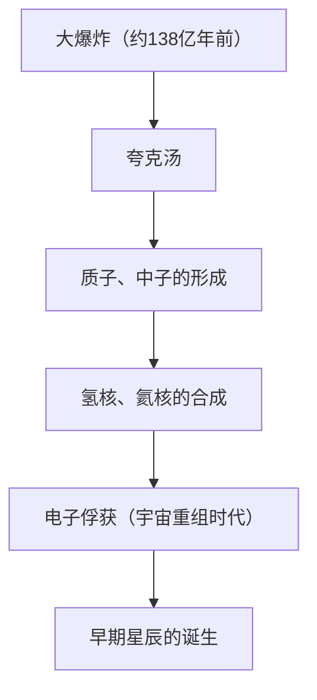
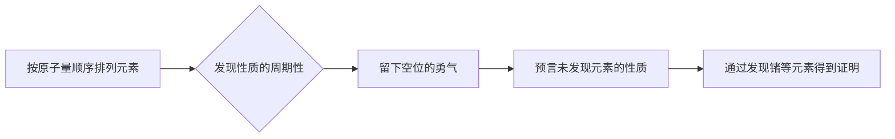

# 什么是元素：构成宇宙的终极积木

宇宙充满了惊人的多样性。燃烧的恒星、冰冷的行星、微小的细菌，以及现在正在阅读这篇文章的你自己。这些看起来完全不同的所有事物，都是由一个共同的基础构成的。那就是“元素”。

在本文中，从宇宙的起源到星辰的死亡，再到现代科学最前沿的超重元素探索，我们将深入探讨元素这一存在的根本谜团。欢迎来到化学与物理学交汇的周期表世界。

## 1. 宇宙的起源与元素的诞生

构成我们宇宙的物质是从哪里来的？为了回答这个问题，我们需要追溯到大约138亿年前的宇宙大爆炸。

### 大爆炸核合成（早期宇宙的元素合成）

大爆炸之后的宇宙，是一个超高温、超高密度的能量汤。随着宇宙的膨胀和冷却，夸克结合产生了质子和中子等核子。这就是物质的开端。

大爆炸后约3分钟，当宇宙温度降至约10亿度时，质子和中子结合形成了最早的原子核。在这个过程中诞生了宇宙中最轻、最丰富的两种元素：氢（H）和氦（He）。虽然也生成了极少量的锂（Li）和铍（Be），但在宇宙初期阶段产生的元素仅此而已。当时的宇宙中，既没有碳，也没有氧，更没有铁。

## 2. 星辰：宇宙的巨大炼金炉

早期宇宙只有轻元素，而如今构成我们所知的丰富世界的重元素，全都是在恒星内部产生的。卡尔·萨根所说的“我们是由星尘构成的（We are made of star-stuff）”，不仅仅是一种充满诗意的表达，更是严谨的科学事实。

### 恒星内部的核聚变

恒星的中心是一个巨大的核聚变炉。像我们太阳这样的恒星，在其中心的超高压、超高温环境中，通过将氢转化为氦来产生能量。

当恒星耗尽氢时，就会开始燃烧氦，生成碳（C）和氧（O）。对于质量是太阳8倍以上的巨大恒星，温度会进一步升高，氖（Ne）、镁（Mg）、硅（Si）等更重的元素会接连不断地合成出来。然而，这个过程在铁（Fe）这里停止了。铁的原子核是最稳定的，如果试图让铁发生核聚变，非但不会释放能量，反而会吸收能量。

### 超新星爆发与中子星碰撞

当恒星的核心被铁填满时，由核聚变产生的向外的压力就会消失，恒星会在自身的重力作用下瞬间坍塌（引力坍缩）。其反作用引发的就是超新星爆发。

在这种爆炸性的环境中，比铁更重的元素（金、银、铀等）在一瞬间生成。此外，近年来通过引力波观测证实，金和铂等极重元素的大部分，是在两颗中子星碰撞、合并时发生的“千新星”（kilonova）现象中生成的。

## 3. 元素的发现与人类历史

人类自古以来就认识了金（Au）、银（Ag）、铜（Cu）、铁（Fe）、铅（Pb）、水银（Hg）等几种元素。然而，要达到现代的理解，即它们是“元素（无法进一步分割的基本物质）”，经历了漫长的岁月。

### 从炼金术到近代化学

中世纪的炼金术士们寻找能将贱金属转化为金的“贤者之石”。虽然他们的尝试以失败告终，但在这一过程中，确立了蒸馏和提取等化学操作方法，并发现了磷（P）等新元素。

到了17世纪，罗伯特·波义耳在其著作《怀疑派化学家》中否定了古希腊的四元素说（火、气、水、土），提出了近代的元素概念。随后在18世纪后半叶，安托万·拉瓦锡查明了燃烧的本质是与氧结合，并编制了当时已知的33种元素的列表。

## 4. 门捷列夫与周期表的魔法

19世纪发现了大量元素，科学家们努力在其多样的性质中寻找规律性。站在这一领域顶峰的是俄罗斯化学家德米特里·门捷列夫。

1869年，门捷列夫将当时已知的63种元素按原子量顺序排列，发现性质相似的元素会周期性地出现。他最大的功绩是，为了保持规律性而在周期表中留下了“空位”，并预言了那里存在着尚未被发现的元素。

例如，他将硅下方的空位命名为“类硅”，并详细预测了它的原子量、比重等。15年后，德国化学家克莱门斯·温克勒发现了锗（Ge），其性质与门捷列夫的预测惊人地一致，从而向世界证明了周期表的正确性。

## 5. 量子力学揭示“为什么存在周期性”

虽然门捷列夫创建了周期表，但他无法解释“为什么”会产生这种周期性。这个答案由20世纪初诞生的量子力学给出。

原子由位于中心的带正电的“原子核（质子和中子）”和围绕它旋转的带负电的“电子”组成。决定元素种类（原子序数）的是原子核中所含的“质子数”。

### 电子壳层与泡利不相容原理

电子并不是在原子核周围胡乱旋转的，而是只能存在于特定的能级（电子壳层）中。此外，根据沃尔夫冈·泡利提出的“泡利不相容原理”，一个轨道中只能容纳有限数量的电子。

周期表纵列（族）具有相似化学性质的原因在于，最外层电子壳层中的电子（价电子）数量相同。化学反应本质上是原子之间交换或共享最外层电子的现象。量子力学为门捷列夫直观的表格提供了坚实的物理学基础。

## 6. 支撑文明的重要元素

在周期表的118种元素中，在地球上自然发现的约有90种。其中一些对人类文明和生命本身是不可或缺的。

- **碳（C）**：生命的基础。凭借与其他原子形成4个键的能力，它成为了DNA和蛋白质等无限复杂分子骨架的核心。
- **铁（Fe）**：约占地球质量的32%。支撑了人类的工业革命，至今依然是现代基础设施的基石。
- **硅（Si）**：半导体的主角。从计算机到智能手机再到人工智能，信息化社会是建立在硅的结晶（硅晶片）之上的。
- **稀土元素**：钕（Nd）和镝（Dy）等是制造强力永久磁铁必不可少的，对电动汽车的电机和风力发电机来说也是不可考核的。

## 7. 迈向未知领域：超重元素与稳定岛

自然界中存在的最重元素是铀（原子序数92）。比这更重的元素（超铀元素），是人类使用粒子加速器人工制造出来的。

目前，周期表已经完成到原子序数为118的鿫（Og）。这些“超重元素”极其不稳定，即使被制造出来，也会在一瞬间（不到毫秒）衰变成其他较轻的元素。

然而，原子核物理学的理论预言了被称为“稳定岛”的区域的存在。这一假说认为，当质子或中子的数量达到特定的“幻数”时，原子核会变成接近球形的稳定状态，寿命将飞跃性地延长。如果能发现属于稳定岛的元素，也许就能获得拥有前所未见的全新性质的物质。

## 8. 结论：宇宙的拼图碎片

我们身边的所有东西，都不过是一百多种“积木”的组合而已。这些积木是在138亿年前的大爆炸，或是遥远的星辰死亡等宏大的宇宙戏剧中锻造而成的。

周期表不仅仅是一个化学工具。它是宇宙塑造自身、孕育出复杂生命的一本“食谱”。下次当你喝水、深呼吸或拿起智能手机时，稍微想象一下吧：构成你的那些原子，曾经在宇宙的某个地方，在恒星的心脏里燃烧着。
