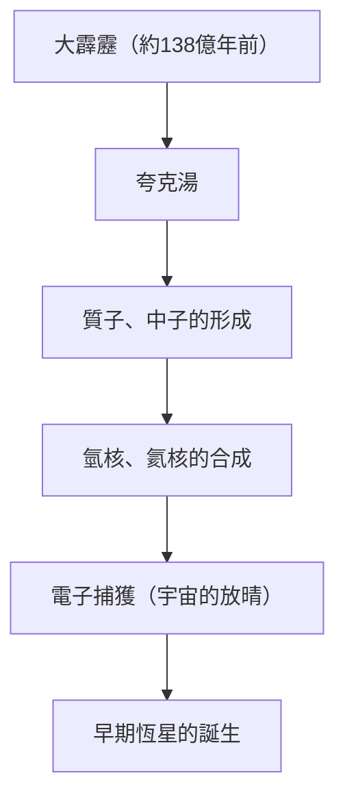
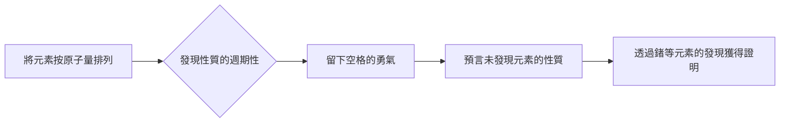

# 元素是什麼：構成宇宙的終極積木

宇宙充滿了令人驚嘆的多樣性。燃燒的恆星、寒冷的冰行星、微小的細菌，以及現在正在閱讀這篇文章的你。所有這些看似完全不同的事物，都是由一個共同的基礎所構成。那就是「元素」。

在這篇文章中，我們將探討從宇宙的起源到恆星的死亡，乃至現代科學最前線的超重元素探索，深入了解元素存在的根本謎團。歡迎來到化學與物理學交會的週期表世界。

## 1. 宇宙的起源與元素的誕生

構成我們宇宙的物質是從哪裡來的呢？為了解答這個問題，我們必須回溯到約138億年前的大霹靂（Big Bang）。

### 大霹靂核合成（早期宇宙的元素合成）

大霹靂剛發生後的宇宙，是一個超高溫、超高密度的能量湯。隨著宇宙膨脹並冷卻，夸克結合產生了質子和中子等核子。這就是物質的開端。

大霹靂後約3分鐘，當宇宙溫度降至約10億度時，質子和中子結合，形成了最初的原子核。在這個過程中誕生的，是宇宙中最輕、最豐富的兩種元素：氫（H）和氦（He）。雖然也產生了極微量的鋰（Li）和鈹（Be），但在宇宙初期階段生成的元素僅此而已。當時的宇宙中，碳、氧、鐵等都不存在。

## 2. 恆星：宇宙巨大的煉金爐

早期宇宙只有輕元素，但構成我們現在所知豐富世界的重元素，全都是在恆星內部製造出來的。卡爾·薩根（Carl Sagan）所說的「我們都是由星塵構成的（We are made of star-stuff）」，不單是充滿詩意的表達，而是嚴謹的科學事實。

### 恆星內部的核融合

恆星的中心是一個巨大的核融合爐。像我們太陽這樣的恆星，是在中心部超高壓、超高溫的環境中，透過將氫轉化為氦來產生能量。

當恆星耗盡氫時，就會開始燃燒氦，並製造出碳（C）和氧（O）。質量為太陽8倍以上的巨大恆星，溫度會進一步上升，接連合成出氖（Ne）、鎂（Mg）、矽（Si）等更重的元素。然而，這個過程會在鐵（Fe）停止。因為鐵的原子核是最穩定的，試圖讓鐵進行核融合不僅不會釋放能量，反而會吸收能量。

### 超新星爆炸與中子星碰撞

當恆星的核心充滿鐵時，就會失去核融合所產生的向外壓力，恆星會因自身的重力而瞬間坍縮（重力塌陷）。其反作用力所引發的就是超新星爆炸。

在這種爆炸性的環境中，比鐵重的元素（金、銀、鈾等）會在一瞬間生成。此外，近年來透過重力波觀測證實，金和鉑等非常重的元素中，絕大部分是在兩顆中子星碰撞合併時發生的「千新星（Kilonova）」現象中所產生的。

## 3. 元素的發現與人類歷史

人類從古代就知道金（Au）、銀（Ag）、銅（Cu）、鐵（Fe）、鉛（Pb）、水銀（Hg）等幾種元素。然而，要達到這些是「元素（無法再分割的基本物質）」的現代理解，卻經歷了漫長的時間。

### 從煉金術到近代化學

中世紀的煉金術士們尋求著能將賤金屬變成黃金的「賢者之石」。他們的嘗試雖然以失敗告終，但在這過程中確立了蒸餾和萃取等化學操作方法，並發現了磷（P）等新元素。

到了17世紀，羅伯特·波以耳（Robert Boyle）在著作《懷疑的化學家》中否定了古希臘的四元素說（火、空氣、水、土），提倡近代的元素概念。到了18世紀後半，安托萬·拉瓦節（Antoine Lavoisier）查明了燃燒的本質是與氧結合，並製作了當時已知的33種元素清單。

## 4. 門得列夫與週期表的魔法

19世紀發現了許多元素，科學家們努力在它們多樣的性質中尋找規律。站上這個頂點的，是俄羅斯化學家德米特里·門得列夫（Dmitri Mendeleev）。

1869年，門得列夫將當時已知的63種元素按原子量順序排列，發現性質相似的元素會週期性地出現。他最大的貢獻是，為了維持規律性而在週期表中留下「空格」，並預言那裡存在著尚未被發現的元素。

例如，他將矽下方的空格命名為「類矽（Eka-silicon）」，並詳細預測了它的原子量和比重等。15年後，德國化學家克萊門斯·溫克勒（Clemens Winkler）發現了鍺（Ge），由於其性質與門得列夫的預測驚人地一致，從而向世界證明了週期表的正確性。

## 5. 量子力學解開「為什麼有週期性」之謎

門得列夫雖然製作了週期表，但他無法解釋「為什麼」會產生這樣的週期性。這個答案是由20世紀初誕生的量子力學所帶來的。

原子是由中心帶正電的「原子核（質子和中子）」，以及繞著它旋轉帶負電的「電子」所構成。決定元素種類（原子序）的，是原子核中包含的「質子數」。

### 電子殼層與包立不相容原理

電子並不是在原子核周圍亂轉，而是只能存在於特定的能階（電子殼層）。此外，根據沃爾夫岡·包立（Wolfgang Pauli）提倡的「包立不相容原理」，一個軌域裡只能容納有限數量的電子。

週期表的縱列（族）之所以具有相似的化學性質，是因為最外層電子殼層的電子（價電子）數量相同。化學反應本質上就是原子之間互相交換或共享最外層電子的現象。量子力學為門得列夫直觀的表格賦予了堅實的物理學基礎。

## 6. 支撐文明的重要元素們

在週期表的118種元素中，在地球上能自然發現的約有90種。其中包含了對人類文明和生命本身不可或缺的元素。

- **碳（C）**: 生命的基礎。憑藉與其他原子形成4個鍵的能力，成為DNA和蛋白質等無限複雜分子骨架的基礎。
- **鐵（Fe）**: 佔地球質量約32%。支撐了人類的工業革命，至今依然是現代基礎設施的根基。
- **矽（Si）**: 半導體的主角。從電腦到智慧型手機、甚至是AI，資訊化社會正是建立在矽的結晶（矽晶圓）之上。
- **稀土（稀土元素）**: 釹（Nd）和鏑（Dy）等是製造強力永久磁鐵不可不可或缺的元素，對電動車的馬達和風力發電機至關重要。

## 7. 邁向未知領域：超重元素與穩定島

自然界中存在最重的元素是鈾（原子序92）。比它更重的元素（超鈾元素），都是人類利用粒子加速器人工製造出來的。

目前，週期表已經完成到原子序118的鿫（Oganesson, Og）。這些「超重元素」非常不穩定，即使被製造出來，也會在一瞬間（毫秒以下）衰變成其他較輕的元素。

然而，原子核物理學的理論預言了「穩定島（Island of stability）」區域的存在。這是一個假說，認為當質子或中子的數量達到特定的「魔數」時，原子核會呈現接近球形的穩定狀態，其壽命將會飛躍性地延長。如果能發現屬於穩定島的元素，我們或許能獲得前所未見、擁有全新性質的物質。

## 8. 結論：宇宙的拼圖

我們身邊的所有事物，都不過是這100多種「積木」的組合。這些積木，是在138億年前的大霹靂、或是遙遠彼方的恆星死亡等壯麗的宇宙戲劇中鍛造出來的。

週期表不單只是化學工具。它是宇宙塑造自身、孕育出複雜生命的「食譜」。下次當你喝水、深呼吸、或是拿起智慧型手機時，不妨稍微想像一下：構成你的那些原子，曾經在宇宙的某個地方、在恆星的心臟裡燃燒過。
