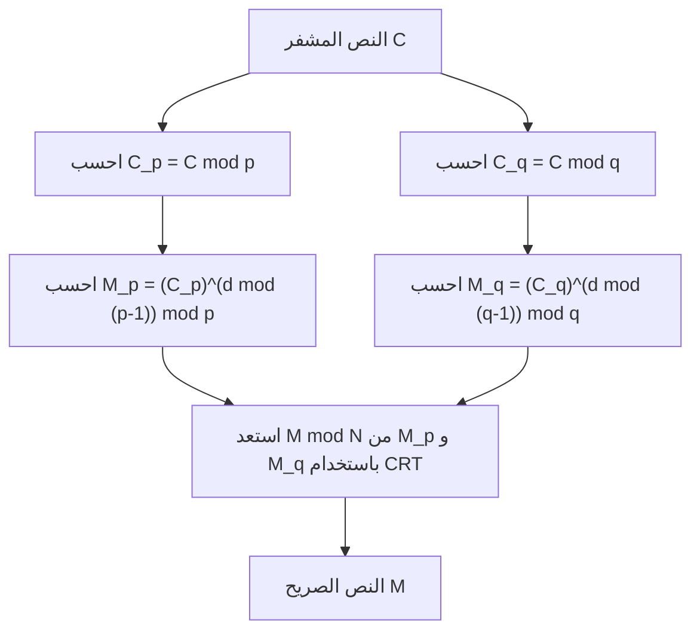

## مقدمة

تعد [نظرية الباقي الصينية](https://kenji.blog/ar/p/chinese-remainder-theorem/) (Chinese Remainder Theorem، واختصارها CRT) واحدة من أهم وأجمل النظريات في نظرية الأعداد. يمكن إرجاع أصولها إلى النص الرياضي الصيني القديم "صون تزي سوان جينغ"، والذي يُعتقد أنه تم تجميعه بين القرنين الثالث والخامس. بدءًا من مسألة حسابية بسيطة في العصور القديمة، امتدت هذه النظرية عبر آلاف السنين لتلعب دورًا أساسيًا اليوم في تقنيات تشفير المفتاح العام مثل **تشفير [RSA](https://kenji.blog/ar/p/modern-cryptography-public-key-hash-signature/)**، الذي يضمن أمان اتصالاتنا اليومية عبر الإنترنت.

في هذا المقال، سنشرح **[نظرية الباقي الصينية](https://kenji.blog/ar/p/chinese-remainder-theorem/)** بالتفصيل، مع الرسوم التوضيحية والأمثلة العملية، ونغطي خلفيتها التاريخية، وتعريفها الرياضي الدقيق، وخطوات الحساب المحددة، وتطبيقاتها في التشفير الحديث.

## الخلفية التاريخية: مسألة صون تزي

تكمن جذور [نظرية الباقي الصينية](https://kenji.blog/ar/p/chinese-remainder-theorem/) في المسألة الشهيرة التالية المسجلة في السؤال 26 من المجلد السفلي لكتاب "صون تزي سوان جينغ".

> "هناك أشياء غير معروف عددها. إذا عددناها ثلاثا ثلاثا، يتبقى اثنان؛ وإذا عددناها خمسا خمسا، يتبقى ثلاثة؛ وإذا عددناها سبعا سبعا، يتبقى اثنان. كم عدد الأشياء؟"

بالتعبير عن ذلك باستخدام نظام رياضي حديث من التطابقات، لعدد صحيح غير معروف $x$، نحصل على:

$$
\begin{cases}
x \equiv 2 \pmod 3 \\
x \equiv 3 \pmod 5 \\
x \equiv 2 \pmod 7
\end{cases}
$$

حل هذه المسألة هو $x = 23$. يقدم "صون تزي سوان جينغ" أيضًا إجراء الحساب المحدد لاستنباط هذا الحل، والذي يُعتبر المثال الأول لطريقة بناءة محددة ل[نظرية الباقي الصينية](https://kenji.blog/ar/p/chinese-remainder-theorem/).

## التعريف الرياضي وبيان النظرية

في الرياضيات الحديثة، تُصاغ **[نظرية الباقي الصينية](https://kenji.blog/ar/p/chinese-remainder-theorem/)** على النحو التالي.

### بيان النظرية

لنفترض وجود $k$ من الأعداد الصحيحة الموجبة الأولية فيما بينها مثنى مثنى $m_1, m_2, \dots, m_k$. بمعنى، لأي $i \neq j$، يتحقق $\gcd(m_i, m_j) = 1$.

عندئذٍ، لأي أعداد صحيحة معطاة $a_1, a_2, \dots, a_k$، يوجد عدد صحيح $x$ يحقق نظام التطابقات التالي، وهو حل وحيد بمقياس $M = m_1 m_2 \dots m_k$.

$$
\begin{cases}
x \equiv a_1 \pmod{m_1} \\
x \equiv a_2 \pmod{m_2} \\
\vdots \\
x \equiv a_k \pmod{m_k}
\end{cases}
$$

بعبارة أخرى، يوجد بالضبط حل واحد $x$ في النطاق $0 \leq x < M$، ويمكن التعبير عن جميع الحلول بالصيغة $x \equiv x_0 \pmod M$.

### الإثبات وطريقة البناء (خوارزمية غاوس)

الجزء الرائع من هذه النظرية هو أنها لا تضمن وجود حل فحسب، بل توفر أيضًا خوارزمية لبناء حل ملموس. طريقة البناء موضحة أدناه.

1. احسب حاصل الضرب الكلي $M = m_1 m_2 \dots m_k$.
2. لكل $i$، احسب $M_i = \frac{M}{m_i}$. ($M_i$ هو حاصل ضرب جميع المقاييس باستثناء $m_i$)
3. بما أن $\gcd(M_i, m_i) = 1$، فإن المعكوس الضربي القياسي $y_i$ لـ $M_i$ بمقياس $m_i$ موجود. أي أوجد $y_i$ الذي يحقق $M_i y_i \equiv 1 \pmod{m_i}$ باستخدام طرق مثل [خوارزمية إقليدس](https://kenji.blog/ar/p/euclidean-algorithm/) الممتدة.
4. يُعطى الحل النهائي $x$ بالصيغة التالية:

$$
x = \sum_{i=1}^{k} a_i M_i y_i \pmod M
$$

يمكن التحقق بسهولة من أن هذا الـ $x$ يحقق نظام التطابقات الأصلي عن طريق تقييم $x$ بمقياس كل $m_j$. عندما يكون $i \neq j$، فإن $M_i$ هو مضاعف لـ $m_j$، لذلك $M_i \equiv 0 \pmod{m_j}$. وبالتالي، يبقى فقط الحد الذي يكون فيه $i = j$ في المجموع، مما يعطي $x \equiv a_j M_j y_j \equiv a_j \cdot 1 \equiv a_j \pmod{m_j}$، وهذا يحقق الشرط.

## الحساب باستخدام مثال ملموس

لنقم بحل "مسألة صون تزي" السابقة باستخدام هذه الخوارزمية.

المسألة:
$x \equiv 2 \pmod 3$  (هنا $a_1=2, m_1=3$)
$x \equiv 3 \pmod 5$  (هنا $a_2=3, m_2=5$)
$x \equiv 2 \pmod 7$  (هنا $a_3=2, m_3=7$)

**الخطوة 1:** حساب $M$
$M = 3 \times 5 \times 7 = 105$

**الخطوة 2:** حساب $M_i$
$M_1 = 105 / 3 = 35$
$M_2 = 105 / 5 = 21$
$M_3 = 105 / 7 = 15$

**الخطوة 3:** حساب المعكوسات $y_i$
- $35 y_1 \equiv 1 \pmod 3 \implies 2 y_1 \equiv 1 \pmod 3 \implies y_1 = 2$
- $21 y_2 \equiv 1 \pmod 5 \implies 1 y_2 \equiv 1 \pmod 5 \implies y_2 = 1$
- $15 y_3 \equiv 1 \pmod 7 \implies 1 y_3 \equiv 1 \pmod 7 \implies y_3 = 1$

**الخطوة 4:** حساب الحل $x$
$x = (2 \times 35 \times 2) + (3 \times 21 \times 1) + (2 \times 15 \times 1)$
$x = 140 + 63 + 30 = 233$

أوجد الباقي عند قسمة ذلك على $M = 105$.
$233 \equiv 23 \pmod{105}$

وبالتالي، أصغر حل موجب هو **23**، وهو يتطابق تمامًا مع حل صون تزي.

## التطبيقات في العصر الحديث: تشفير [RSA](https://kenji.blog/ar/p/modern-cryptography-public-key-hash-signature/) و[نظرية الباقي الصينية](https://kenji.blog/ar/p/chinese-remainder-theorem/)

تتمتع **[نظرية الباقي الصينية](https://kenji.blog/ar/p/chinese-remainder-theorem/)**، التي كانت لغزًا قديمًا، باستخدامات عملية للغاية في مجتمعنا الرقمي الحديث. والمثال الأبرز هو تسريع فك التشفير وتوليد التوقيع في **تشفير [RSA](https://kenji.blog/ar/p/modern-cryptography-public-key-hash-signature/)**.

### نظرة عامة على تشفير RSA

في تشفير RSA، يُستخدم عددان أوليان كبيران $p$ و $q$، ويشكل حاصل ضربهما $N = pq$ جزءًا من المفتاح العام. يُجرى الحساب لفك تشفير النص الصريح $M$ من النص المشفر $C$ باستخدام المفتاح الخاص $d$ على النحو التالي:

$$
M = C^d \pmod N
$$

هنا، $N$ هو رقم ضخم للغاية (على سبيل المثال، 2048 بت)، و $d$ بحجم مماثل، مما يجعل عملية الرفع إلى قوة بمقياس مكلفة حسابيًا.

### التسريع باستخدام [نظرية الباقي الصينية](https://kenji.blog/ar/p/chinese-remainder-theorem/) ([RSA](https://kenji.blog/ar/p/modern-cryptography-public-key-hash-signature/)-CRT)

هنا يأتي دور **[نظرية الباقي الصينية](https://kenji.blog/ar/p/chinese-remainder-theorem/)**. فبدلاً من إجراء حساب ضخم بمقياس $N$، يقوم النهج بتقسيمه إلى حسابين أصغر بمقياس $p$ ومقياس $q$، وهما العاملان الأوليان لـ $N$، وأخيرًا يعيد بناء الحل الأصلي باستخدام [نظرية الباقي الصينية](https://kenji.blog/ar/p/chinese-remainder-theorem/).

على وجه التحديد، يتم اتخاذ الخطوات التالية:



1. بدلاً من $d$، احسب مسبقًا $d_p = d \pmod{p-1}$ و $d_q = d \pmod{q-1}$ كمفاتيح خاصة.
2. قم بفك التشفير بشكل فردي بمقياس $p$ ومقياس $q$.
   $M_p = C^{d_p} \pmod p$
   $M_q = C^{d_q} \pmod q$
3. طبق [نظرية الباقي الصينية](https://kenji.blog/ar/p/chinese-remainder-theorem/) على $M_p$ و $M_q$ للحصول على $M \pmod N$.

عندما ينخفض طول البت للمقياس إلى النصف (على سبيل المثال، 1024 بت)، تصبح تكلفة الرفع إلى القوة حوالي 1/8. حتى عند القيام بذلك مرتين، فإن التكلفة الإجمالية تبلغ حوالي 1/4. وبالتالي، يمكن أن يؤدي استخدام [RSA](https://kenji.blog/ar/p/modern-cryptography-public-key-hash-signature/)-CRT إلى تسريع فك التشفير وتوليد التوقيع بمقدار **4 أضعاف تقريبًا**. في الأجهزة ذات الموارد الحسابية المحدودة مثل الهواتف الذكية والبطاقات الذكية، يعد هذا التسريع أمرًا في غاية الأهمية.

## البرمجة والتنفيذ ل[نظرية الباقي الصينية](https://kenji.blog/ar/p/chinese-remainder-theorem/)

بعيدًا عن النظرية، دعنا نكتب برنامجًا لتنفيذ **[نظرية الباقي الصينية](https://kenji.blog/ar/p/chinese-remainder-theorem/)**. هنا، نقوم بتنفيذ خوارزمية غاوس باستخدام لغة بايثون.

```python
def extended_gcd(a, b):
    """
    خوارزمية إقليدس الممتدة
    ترجع (gcd(a, b), x, y) بحيث يكون a*x + b*y = gcd(a, b)
    """
    if a == 0:
        return b, 0, 1
    else:
        g, y, x = extended_gcd(b % a, a)
        return g, x - (b // a) * y, y

def mod_inverse(a, m):
    """
    تُرجع المعكوس الضربي القياسي لـ a بمقياس m
    """
    g, x, y = extended_gcd(a, m)
    if g != 1:
        raise Exception('المعكوس القياسي غير موجود')
    else:
        return x % m

def chinese_remainder_theorem(a_list, m_list):
    """
    نظرية الباقي الصينية (CRT)
    تُرجع x الذي يحقق x ≡ a_i (mod m_i)
    """
    total_m = 1
    for m in m_list:
        total_m *= m
        
    x = 0
    for a, m in zip(a_list, m_list):
        M_i = total_m // m
        y_i = mod_inverse(M_i, m)
        x += a * M_i * y_i
        
    return x % total_m

# حل مسألة صون تزي
a = [2, 3, 2]
m = [3, 5, 7]
result = chinese_remainder_theorem(a, m)
print(f"حل مسألة صون تزي: {result}") # الإخراج: 23
```

بهذه الطريقة، يمكن إعادة إنتاج **[نظرية الباقي الصينية](https://kenji.blog/ar/p/chinese-remainder-theorem/)** على جهاز كمبيوتر ببضع عشرات من أسطر التعليمات البرمجية. هذا التنفيذ هو خوارزمية أساسية تُستخدم كثيرًا في البرمجة التنافسية والمجالات المماثلة.

## التعميم في الجبر المجرد: الحلقات والمثاليات

تمتد **[نظرية الباقي الصينية](https://kenji.blog/ar/p/chinese-remainder-theorem/)** إلى ما هو أبعد من مجرد خاصية للأعداد الصحيحة إلى شكل أكثر عمومية في **الجبر المجرد**، وهو مجال مهم في الرياضيات الحديثة.

فكر في حلقة إبدالية $R$ ومثالياتها $I_1, I_2, \dots, I_k$. عندما تكون هذه المثاليات أولية فيما بينها مثنى مثنى (أي، يتحقق $I_i + I_j = R$ لأي $i \neq j$)، يمكننا تعريف تشاكل حلقي طبيعي $\phi$ على النحو التالي:

$$
\phi: R \to (R/I_1) \times (R/I_2) \times \dots \times (R/I_k)
$$
$$
\phi(x) = (x \pmod{I_1}, x \pmod{I_2}, \dots, x \pmod{I_k})
$$

تؤكد **[نظرية الباقي الصينية](https://kenji.blog/ar/p/chinese-remainder-theorem/)** في الجبر المجرد أن هذا التشاكل $\phi$ هو غامر، ونواته هي تقاطع المثاليات $\bigcap_{i=1}^k I_i$ (والذي يتطابق مع حاصل ضرب المثاليات $\prod_{i=1}^k I_i$).

لذلك، من خلال نظرية التشاكل الأولى، يتحقق التشاكل الطبيعي التالي:

$$
R / \left( \bigcap_{i=1}^k I_i \right) \cong (R/I_1) \times (R/I_2) \times \dots \times (R/I_k)
$$

### التطبيق على حلقات كثيرات الحدود

يعد تطبيق هذا التعميم للنظرية على حلقة كثيرات الحدود ذات المتغير الواحد $F[x]$ فوق حقل $F$ من أهم التطبيقات لـ **[نظرية الباقي الصينية](https://kenji.blog/ar/p/chinese-remainder-theorem/)**.

تتوافق "الأعداد الصحيحة الأولية فيما بينها" في حالة الأعداد الصحيحة مع "كثيرات الحدود التي لا تحتوي على جذور مشتركة (والتي يكون القاسم المشترك الأكبر لها ثابتًا)" في حلقة كثيرات الحدود. توفر نسخة كثيرات الحدود هذه من [نظرية الباقي الصينية](https://kenji.blog/ar/p/chinese-remainder-theorem/) الدعم النظري لاستيفاء لاغرانج، وتتطابق تمامًا مع الخوارزمية لتحديد كثيرة حدود ذات درجة دنيا تمر عبر مجموعة معطاة من النقاط بشكل فريد. بالإضافة إلى ذلك، يشكل هذا الأساس الرياضي لـ **رموز ريد-سولومون**، وهي نوع من رموز تصحيح الأخطاء.

## الحوسبة المتوازية الكثيفة باستخدام نظام أعداد الباقي (RNS)

كتطبيق هندسي لـ **[نظرية الباقي الصينية](https://kenji.blog/ar/p/chinese-remainder-theorem/)**، يجب أن نذكر أيضًا **نظام أعداد الباقي (Residue Number System, RNS)**.

عادةً، تمثل أجهزة الكمبيوتر الأرقام وتجري الحسابات بالنظام الثنائي. ومع ذلك، عند الجمع أو الضرب، يحدث انتشار الحمل، مما يتسبب في مشكلة زيادة تأخير الدائرة مع زيادة عرض البت.

في RNS، يتم إعداد مجموعة من المقاييس الأولية فيما بينها مثنى مثنى $\{m_1, m_2, \dots, m_k\}$، ويتم تمثيل عدد صحيح كبير $X$ كمجموعة صفية من البواقي $(x_1, x_2, \dots, x_k)$ عند قسمته على كل مقياس.

أكبر ميزة لهذا التمثيل هي أن **لا يحدث انتشار للحمل** أثناء الجمع والضرب.
على سبيل المثال، عند جمع $X$ و $Y$، يمكن إجراء الحساب بشكل مستقل لكل مقياس:

$$
X + Y \leftrightarrow ( (x_1+y_1)\pmod{m_1}, \dots, (x_k+y_k)\pmod{m_k} )
$$
$$
X \times Y \leftrightarrow ( (x_1y_1)\pmod{m_1}, \dots, (x_k y_k)\pmod{m_k} )
$$

نظرًا لأن الحسابات في كل مقياس مستقلة تمامًا، فإن تجميع دوائر متوازية يسمح بعمليات عالية السرعة للغاية. عند تحويل النتيجة النهائية مرة أخرى إلى رقم عادي، يتم استخدام **[نظرية الباقي الصينية](https://kenji.blog/ar/p/chinese-remainder-theorem/)** تحديدًا. لا تزال هذه التقنية قيد البحث وتُستخدم عمليًا في معالجة الإشارات الرقمية (DSP)، حيث يُطلب الأداء في الوقت الفعلي، وفي تصميم دوائر معالجة تشفير محددة.

## الخاتمة

بدأت **[نظرية الباقي الصينية](https://kenji.blog/ar/p/chinese-remainder-theorem/)** كلغز رياضي بسيط، وتم التسامي بها لتصبح نظرية بنية المثاليات في الجبر المجرد، وتطورت إلى تقنية أساسية للتشفير الحديث وعلوم الكمبيوتر.

حقيقة أن حكمة علماء الرياضيات الصينيين القدماء تعيش عبر آلاف السنين كمعالجة تشفير في هواتفنا الذكية هي شهادة على عالمية وقوة تخصص الرياضيات.
