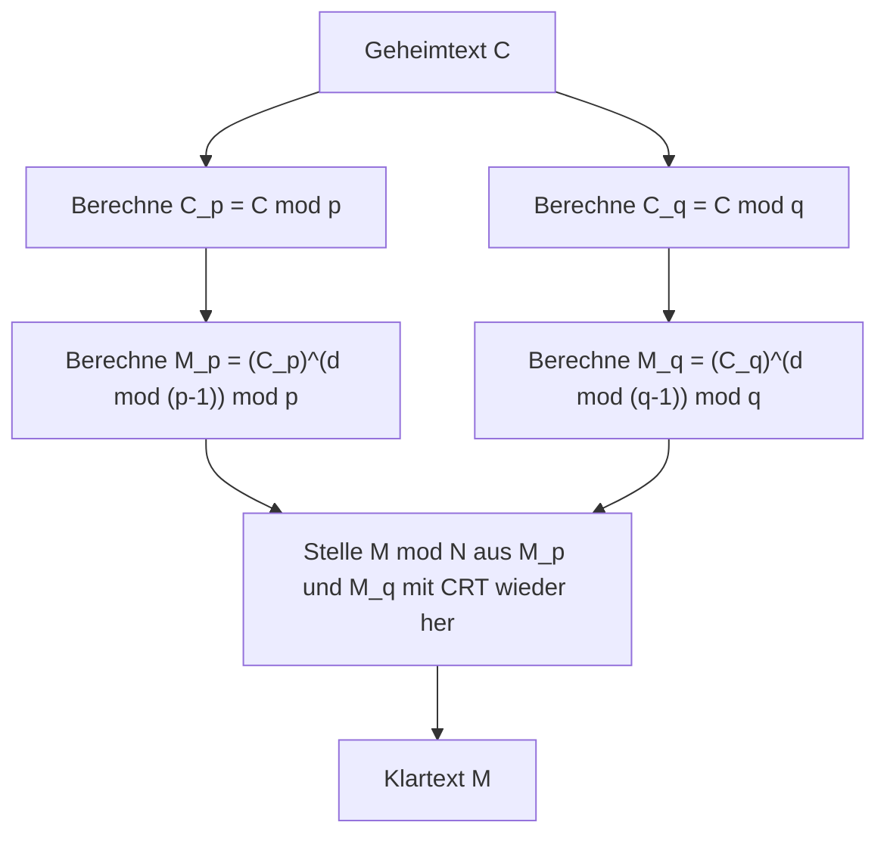

## Einführung

Der Chinesische Restsatz ([Chinese Remainder Theorem](https://kenji.blog/de/p/chinese-remainder-theorem/), kurz CRT) ist einer der wichtigsten und schönsten Sätze in der Zahlentheorie. Sein Ursprung lässt sich auf den antiken chinesischen mathematischen Text „Sunzi Suanjing“ zurückverfolgen, der vermutlich zwischen dem 3. und 5. Jahrhundert zusammengestellt wurde. Angefangen bei einem einfachen Rechenproblem aus der Antike, spielt dieser Satz nach Jahrtausenden heute eine unverzichtbare Rolle in der Public-Key-Kryptographie, wie der **RSA-Kryptographie**, die unsere tägliche sichere Kommunikation im Internet gewährleistet.

In diesem Artikel erklären wir den **Chinesischen Restsatz** im Detail, von seinem historischen Hintergrund über die strenge mathematische Definition und die konkreten Berechnungsschritte bis hin zu seinen Anwendungen in der modernen Kryptographie, ergänzt durch Illustrationen und konkrete Beispiele.

## Historischer Hintergrund: Das Problem von Sunzi

Die Wurzeln des Chinesischen Restsatzes liegen in dem folgenden berühmten Problem, das in der 26. Frage des unteren Bandes des „Sunzi Suanjing“ festgehalten ist.

> „Es gibt Dinge, deren Anzahl unbekannt ist. Zählen wir sie zu dritt, bleiben zwei übrig; zählen wir sie zu fünft, bleiben drei übrig; zählen wir sie zu siebt, bleiben zwei übrig. Wie viele Dinge gibt es?“

Wenn wir dies mit einem modernen mathematischen Kongruenzsystem ausdrücken, ergibt sich für eine unbekannte ganze Zahl $x$:

$$
\begin{cases}
x \equiv 2 \pmod 3 \\
x \equiv 3 \pmod 5 \\
x \equiv 2 \pmod 7
\end{cases}
$$

Die Lösung für dieses Problem ist $x = 23$. Das „Sunzi Suanjing“ bietet auch das konkrete Berechnungsverfahren zur Ableitung dieser Lösung, was als das erste Beispiel für eine konkrete Konstruktionsmethode des Chinesischen Restsatzes gilt.

## Mathematische Definition und Satz

In der modernen Mathematik wird der **Chinesische Restsatz** wie folgt formuliert.

### Aussage des Satzes

Angenommen, es gibt $k$ paarweise teilerfremde positive ganze Zahlen $m_1, m_2, \dots, m_k$. Das heißt, für alle $i \neq j$ gilt $\gcd(m_i, m_j) = 1$.

Dann existiert für beliebige ganze Zahlen $a_1, a_2, \dots, a_k$ eine ganze Zahl $x$, die das folgende System von Kongruenzen erfüllt, und diese Lösung ist eindeutig modulo $M = m_1 m_2 \dots m_k$.

$$
\begin{cases}
x \equiv a_1 \pmod{m_1} \\
x \equiv a_2 \pmod{m_2} \\
\vdots \\
x \equiv a_k \pmod{m_k}
\end{cases}
$$

Das bedeutet, dass es genau eine Lösung $x$ im Bereich $0 \leq x < M$ gibt, und alle Lösungen können in der Form $x \equiv x_0 \pmod M$ ausgedrückt werden.

### Beweis und Konstruktionsmethode (Gaußscher Algorithmus)

Das Brillante an diesem Satz ist, dass er nicht nur die Existenz einer Lösung garantiert, sondern auch einen Algorithmus liefert, um eine konkrete Lösung zu konstruieren. Die Konstruktionsmethode wird unten gezeigt.

1. Berechne das Gesamtprodukt $M = m_1 m_2 \dots m_k$.
2. Berechne für jedes $i$ den Wert $M_i = \frac{M}{m_i}$. ($M_i$ ist das Produkt aller Moduli außer $m_i$)
3. Da $\gcd(M_i, m_i) = 1$, existiert das modulare multiplikative Inverse $y_i$ von $M_i$ modulo $m_i$. Das bedeutet, finde ein $y_i$, das $M_i y_i \equiv 1 \pmod{m_i}$ erfüllt, beispielsweise mithilfe des Erweiterten [Euklid](https://kenji.blog/de/p/euclid/)ischen Algorithmus.
4. Die endgültige Lösung $x$ ist durch die folgende Formel gegeben:

$$
x = \sum_{i=1}^{k} a_i M_i y_i \pmod M
$$

Dass dieses $x$ das ursprüngliche Kongruenzsystem erfüllt, kann leicht überprüft werden, indem man $x$ modulo jedes $m_j$ auswertet. Für $i \neq j$ ist $M_i$ ein Vielfaches von $m_j$, also gilt $M_i \equiv 0 \pmod{m_j}$. Daher bleibt in der Summe nur der Term mit $i = j$ übrig, was $x \equiv a_j M_j y_j \equiv a_j \cdot 1 \equiv a_j \pmod{m_j}$ ergibt und somit die Bedingung erfüllt.

## Berechnung anhand eines konkreten Beispiels

Lösen wir das „Problem von Sunzi“ von vorhin mit diesem Algorithmus.

Problem:
$x \equiv 2 \pmod 3$  (hierbei $a_1=2, m_1=3$)
$x \equiv 3 \pmod 5$  (hierbei $a_2=3, m_2=5$)
$x \equiv 2 \pmod 7$  (hierbei $a_3=2, m_3=7$)

**Schritt 1:** Berechnung von $M$
$M = 3 \times 5 \times 7 = 105$

**Schritt 2:** Berechnung von $M_i$
$M_1 = 105 / 3 = 35$
$M_2 = 105 / 5 = 21$
$M_3 = 105 / 7 = 15$

**Schritt 3:** Berechnung der Inversen $y_i$
- $35 y_1 \equiv 1 \pmod 3 \implies 2 y_1 \equiv 1 \pmod 3 \implies y_1 = 2$
- $21 y_2 \equiv 1 \pmod 5 \implies 1 y_2 \equiv 1 \pmod 5 \implies y_2 = 1$
- $15 y_3 \equiv 1 \pmod 7 \implies 1 y_3 \equiv 1 \pmod 7 \implies y_3 = 1$

**Schritt 4:** Berechnung der Lösung $x$
$x = (2 \times 35 \times 2) + (3 \times 21 \times 1) + (2 \times 15 \times 1)$
$x = 140 + 63 + 30 = 233$

Finde den Rest, wenn dies durch $M = 105$ geteilt wird.
$233 \equiv 23 \pmod{105}$

Daher ist die kleinste positive Lösung **23**, was perfekt mit Sunzis Lösung übereinstimmt.

## Anwendungen in der Moderne: RSA-Kryptographie und CRT

Der **Chinesische Restsatz**, einst ein antikes Rätsel, hat in unserer modernen digitalen Gesellschaft äußerst praktische Anwendungen. Ein Paradebeispiel ist die Beschleunigung der Entschlüsselung und Signaturerstellung in der **RSA-Kryptographie**.

### Übersicht über die RSA-Kryptographie

In der RSA-Kryptographie werden zwei große Primzahlen $p$ und $q$ verwendet, und ihr Produkt $N = pq$ bildet einen Teil des öffentlichen Schlüssels. Die Berechnung zur Entschlüsselung des Klartextes $M$ aus dem Geheimtext $C$ wird mithilfe des privaten Schlüssels $d$ wie folgt durchgeführt:

$$
M = C^d \pmod N
$$

Hierbei ist $N$ eine extrem große Zahl (z. B. 2048 Bit) und $d$ ist von ähnlicher Größe, weshalb diese modulare Potenzierung erhebliche Rechenkosten verursacht.

### Beschleunigung durch CRT (RSA-CRT)

Hier kommt der **Chinesische Restsatz** ins Spiel. Anstatt eine riesige Berechnung modulo $N$ durchzuführen, teilt dieser Ansatz sie in zwei kleinere Berechnungen modulo $p$ und modulo $q$ (den Primfaktoren von $N$) auf und rekonstruiert schließlich die ursprüngliche Lösung mit dem CRT.

Konkret werden die folgenden Schritte ausgeführt:



1. Berechne anstelle von $d$ vorab $d_p = d \pmod{p-1}$ und $d_q = d \pmod{q-1}$ als private Schlüssel.
2. Führe die Entschlüsselung einzeln modulo $p$ und modulo $q$ durch.
   $M_p = C^{d_p} \pmod p$
   $M_q = C^{d_q} \pmod q$
3. Wende den CRT auf $M_p$ und $M_q$ an, um $M \pmod N$ zu erhalten.

Wenn sich die Bitlänge des Moduls halbiert (z. B. 1024 Bit), betragen die Kosten für die Potenzierung nur noch etwa 1/8. Selbst wenn man dies zweimal durchführt, betragen die Gesamtkosten etwa 1/4. Daher kann die Verwendung von RSA-CRT die Entschlüsselung und Signaturerstellung um das **etwa 4-fache beschleunigen**. Bei Geräten mit begrenzten Rechenressourcen wie Smartphones und Chipkarten ist diese Beschleunigung extrem wichtig.

## Programmierimplementierung des Chinesischen Restsatzes

Neben der Theorie wollen wir auch tatsächlich ein Programm schreiben, um den **Chinesischen Restsatz** zu implementieren. Hier implementieren wir den Gaußschen Algorithmus mit Python.

```python
def extended_gcd(a, b):
    """
    Erweiterter Euklidischer Algorithmus
    Gibt (gcd(a, b), x, y) zurück, sodass a*x + b*y = gcd(a, b) gilt
    """
    if a == 0:
        return b, 0, 1
    else:
        g, y, x = extended_gcd(b % a, a)
        return g, x - (b // a) * y, y

def mod_inverse(a, m):
    """
    Gibt das modulare multiplikative Inverse von a modulo m zurück
    """
    g, x, y = extended_gcd(a, m)
    if g != 1:
        raise Exception('Modulares Inverses existiert nicht')
    else:
        return x % m

def chinese_remainder_theorem(a_list, m_list):
    """
    Chinesischer Restsatz (CRT)
    Gibt x zurück, das x ≡ a_i (mod m_i) erfüllt
    """
    total_m = 1
    for m in m_list:
        total_m *= m
        
    x = 0
    for a, m in zip(a_list, m_list):
        M_i = total_m // m
        y_i = mod_inverse(M_i, m)
        x += a * M_i * y_i
        
    return x % total_m

# Lösen des Problems von Sunzi
a = [2, 3, 2]
m = [3, 5, 7]
result = chinese_remainder_theorem(a, m)
print(f"Lösung des Problems von Sunzi: {result}") # Ausgabe: 23
```

Auf diese Weise lässt sich der **Chinesische Restsatz** mit nur wenigen Dutzend Codezeilen auf einem Computer nachbilden. Diese Implementierung ist ein grundlegender Algorithmus, der beim kompetitiven Programmieren und in ähnlichen Bereichen häufig verwendet wird.

## Verallgemeinerung in der abstrakten Algebra: Ringe und Ideale

Der **Chinesische Restsatz** ist nicht nur auf die Eigenschaften ganzer Zahlen beschränkt, sondern lässt sich in der **abstrakten Algebra**, einem wichtigen Teilgebiet der modernen Mathematik, auf eine allgemeinere Form erweitern.

Betrachte einen kommutativen Ring $R$ und seine Ideale $I_1, I_2, \dots, I_k$. Wenn diese Ideale paarweise teilerfremd sind (das heißt, es gilt $I_i + I_j = R$ für alle $i \neq j$), können wir einen natürlichen Ringhomomorphismus $\phi$ wie folgt definieren:

$$
\phi: R \to (R/I_1) \times (R/I_2) \times \dots \times (R/I_k)
$$
$$
\phi(x) = (x \pmod{I_1}, x \pmod{I_2}, \dots, x \pmod{I_k})
$$

Der **Chinesische Restsatz** in der abstrakten Algebra besagt, dass dieser Homomorphismus $\phi$ surjektiv ist und sein Kern der Durchschnitt der Ideale $\bigcap_{i=1}^k I_i$ (was mit dem Produkt der Ideale $\prod_{i=1}^k I_i$ übereinstimmt).

Nach dem ersten Isomorphiesatz gilt daher der folgende natürliche Isomorphismus:

$$
R / \left( \bigcap_{i=1}^k I_i \right) \cong (R/I_1) \times (R/I_2) \times \dots \times (R/I_k)
$$

### Anwendung auf Polynomringe

Eine der wichtigsten Anwendungen dieses verallgemeinerten Satzes ist der **Chinesische Restsatz** im univariaten Polynomring $F[x]$ über einem Körper $F$.

„Teilerfremde ganze Zahlen“ im Fall der ganzen Zahlen entsprechen im Polynomring „Polynomen ohne gemeinsame Nullstellen (deren größter gemeinsamer Teiler eine Konstante ist)“. Diese Polynomversion des CRT liefert die theoretische Untermauerung der [Lagrange](https://kenji.blog/de/p/lagrange/)-Interpolation, was genau dem Algorithmus entspricht, um ein Polynom minimalen Grades eindeutig zu bestimmen, das durch eine gegebene Menge von Punkten verläuft. Darüber hinaus bildet dies die mathematische Grundlage für **Reed-Solomon-Codes**, eine Art von Fehlerkorrekturcodes.

## Massiv paralleles Rechnen mithilfe des Restklassensystems (RNS)

Als technische Anwendung des **Chinesischen Restsatzes** sollte auch das **Restklassensystem (Residue Number System, RNS)** erwähnt werden.

Normalerweise stellen Computer Zahlen im Binärsystem dar und führen Berechnungen damit durch. Bei Additionen oder Multiplikationen tritt jedoch das Problem des Übertrags (Carry) auf, was mit zunehmender Bitbreite die Schaltungsverzögerung erhöht.

Im RNS wird eine Menge paarweise teilerfremder Moduli $\{m_1, m_2, \dots, m_k\}$ vorbereitet, und eine große ganze Zahl $X$ wird als Tupel von Resten $(x_1, x_2, \dots, x_k)$ bei der Division durch die einzelnen Moduli dargestellt.

Der größte Vorteil dieser Darstellung ist, dass bei Addition und Multiplikation **kein Übertrag stattfindet**.
Wenn man beispielsweise $X$ und $Y$ addiert, kann die Berechnung für jeden Modul unabhängig durchgeführt werden:

$$
X + Y \leftrightarrow ( (x_1+y_1)\pmod{m_1}, \dots, (x_k+y_k)\pmod{m_k} )
$$
$$
X \times Y \leftrightarrow ( (x_1y_1)\pmod{m_1}, \dots, (x_k y_k)\pmod{m_k} )
$$

Da die Berechnungen in jedem Modul völlig unabhängig voneinander sind, ermöglicht der Aufbau paralleler Schaltungen extrem schnelle Operationen. Wenn das Endergebnis wieder in eine normale Zahl umgewandelt wird, kommt genau der **Chinesische Restsatz** zum Einsatz. Diese Technologie wird immer noch erforscht und in der Praxis für die digitale Signalverarbeitung (DSP), wo Echtzeitfähigkeit gefragt ist, sowie beim Entwurf bestimmter kryptographischer Verarbeitungsschaltungen eingesetzt.

## Fazit

Der **Chinesische Restsatz** begann als einfaches mathematisches Rätsel, wurde zum Strukturtheorem von Idealen in der abstrakten Algebra erhoben und hat sich zu einer Basistechnologie für die moderne Kryptographie und Informatik entwickelt.

Die Tatsache, dass die Weisheit der antiken chinesischen Mathematiker über Jahrtausende hinweg als kryptographische Verarbeitung in unseren Smartphones weiterlebt, ist ein Beweis für die Universalität und die Kraft der Mathematik als Disziplin.
