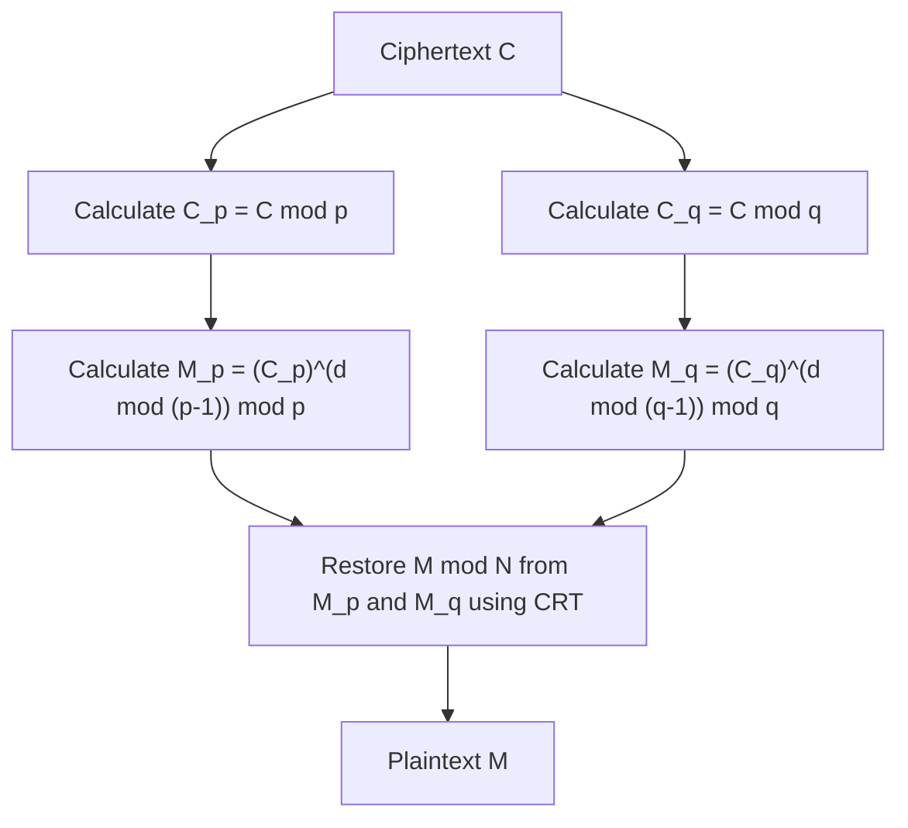

## Introduction

The Chinese Remainder Theorem (CRT) is one of the most important and beautiful theorems in number theory. Its origins can be traced back to the ancient Chinese mathematical text "Sunzi Suanjing", believed to have been compiled between the 3rd and 5th centuries. Starting from a simple arithmetic problem of antiquity, this theorem has spanned millennia to play an essential role today in public-key cryptography technologies like **RSA Cryptography**, which secures our daily internet communications.

In this article, we will explain the **Chinese Remainder Theorem** in detail, with illustrations and concrete examples, covering its historical background, strict mathematical definition, specific calculation steps, and applications in modern cryptography.

## Historical Background: Sunzi's Problem

The roots of the Chinese Remainder Theorem lie in the following famous problem recorded in Question 26 of the lower volume of "Sunzi Suanjing".

> "There are certain things whose number is unknown. If we count them by threes, we have two left over; by fives, we have three left over; and by sevens, two are left over. How many things are there?"

Expressing this using a modern mathematical system of congruences, for an unknown integer $x$, we get:

$$
\begin{cases}
x \equiv 2 \pmod 3 \\
x \equiv 3 \pmod 5 \\
x \equiv 2 \pmod 7
\end{cases}
$$

The solution to this problem is $x = 23$. "Sunzi Suanjing" also provides the specific calculation procedure to derive this solution, which is considered the first example of a concrete constructive method for the Chinese Remainder Theorem.

## Mathematical Definition and Theorem Statement

In modern mathematics, the **Chinese Remainder Theorem** is formulated as follows.

### Theorem Statement

Suppose there are $k$ pairwise coprime positive integers $m_1, m_2, \dots, m_k$. That is, for any $i \neq j$, $\gcd(m_i, m_j) = 1$ holds.

Then, for any given integers $a_1, a_2, \dots, a_k$, there exists an integer $x$ satisfying the following system of congruences, and it is unique modulo $M = m_1 m_2 \dots m_k$.

$$
\begin{cases}
x \equiv a_1 \pmod{m_1} \\
x \equiv a_2 \pmod{m_2} \\
\vdots \\
x \equiv a_k \pmod{m_k}
\end{cases}
$$

In other words, there is exactly one solution $x$ in the range $0 \leq x < M$, and all solutions can be expressed in the form $x \equiv x_0 \pmod M$.

### Proof and Constructive Method (Gauss's Algorithm)

The brilliant part of this theorem is that it not only guarantees the existence of a solution but also provides an algorithm to construct a concrete solution. The constructive method is shown below.

1. Calculate the overall product $M = m_1 m_2 \dots m_k$.
2. For each $i$, calculate $M_i = \frac{M}{m_i}$. ($M_i$ is the product of all moduli except $m_i$)
3. Since $\gcd(M_i, m_i) = 1$, the modular multiplicative inverse $y_i$ of $M_i$ modulo $m_i$ exists. That is, find $y_i$ satisfying $M_i y_i \equiv 1 \pmod{m_i}$ using methods like the Extended Euclidean Algorithm.
4. The final solution $x$ is given by the following formula:

$$
x = \sum_{i=1}^{k} a_i M_i y_i \pmod M
$$

It can be easily verified that this $x$ satisfies the original system of congruences by evaluating $x$ modulo each $m_j$. When $i \neq j$, $M_i$ is a multiple of $m_j$, so $M_i \equiv 0 \pmod{m_j}$. Therefore, only the term where $i = j$ remains in the sum, yielding $x \equiv a_j M_j y_j \equiv a_j \cdot 1 \equiv a_j \pmod{m_j}$, which satisfies the condition.

## Calculation with a Concrete Example

Let's solve "Sunzi's Problem" from earlier using this algorithm.

Problem:
$x \equiv 2 \pmod 3$  (here $a_1=2, m_1=3$)
$x \equiv 3 \pmod 5$  (here $a_2=3, m_2=5$)
$x \equiv 2 \pmod 7$  (here $a_3=2, m_3=7$)

**Step 1:** Calculate $M$
$M = 3 \times 5 \times 7 = 105$

**Step 2:** Calculate $M_i$
$M_1 = 105 / 3 = 35$
$M_2 = 105 / 5 = 21$
$M_3 = 105 / 7 = 15$

**Step 3:** Calculate the inverses $y_i$
- $35 y_1 \equiv 1 \pmod 3 \implies 2 y_1 \equiv 1 \pmod 3 \implies y_1 = 2$
- $21 y_2 \equiv 1 \pmod 5 \implies 1 y_2 \equiv 1 \pmod 5 \implies y_2 = 1$
- $15 y_3 \equiv 1 \pmod 7 \implies 1 y_3 \equiv 1 \pmod 7 \implies y_3 = 1$

**Step 4:** Calculate the solution $x$
$x = (2 \times 35 \times 2) + (3 \times 21 \times 1) + (2 \times 15 \times 1)$
$x = 140 + 63 + 30 = 233$

Find the remainder when this is divided by $M = 105$.
$233 \equiv 23 \pmod{105}$

Thus, the smallest positive solution is **23**, which perfectly matches Sunzi's solution.

## Applications in the Modern Era: RSA Cryptography and CRT

The **Chinese Remainder Theorem**, once an ancient puzzle, has extremely practical uses in our modern digital society. A prime example is the acceleration of decryption and signature generation in **RSA Cryptography**.

### Overview of RSA Cryptography

In RSA cryptography, two large prime numbers $p$ and $q$ are used, and their product $N = pq$ forms part of the public key. The computation to decrypt the plaintext $M$ from the ciphertext $C$ is performed using the private key $d$ as follows:

$$
M = C^d \pmod N
$$

Here, $N$ is an enormously large number (e.g., 2048 bits), and $d$ is of a similar magnitude, making this modular exponentiation computationally expensive.

### Acceleration with CRT (RSA-CRT)

This is where the **Chinese Remainder Theorem** comes into play. Instead of performing a huge calculation modulo $N$, the approach divides it into two smaller calculations modulo $p$ and modulo $q$, which are the prime factors of $N$, and finally reconstructs the original solution using CRT.

Specifically, the following steps are taken:



1. Instead of $d$, compute $d_p = d \pmod{p-1}$ and $d_q = d \pmod{q-1}$ in advance as the private keys.
2. Perform decryption individually modulo $p$ and modulo $q$.
   $M_p = C^{d_p} \pmod p$
   $M_q = C^{d_q} \pmod q$
3. Apply CRT to $M_p$ and $M_q$ to obtain $M \pmod N$.

When the modulus is halved in bit length (e.g., 1024 bits), the cost of exponentiation becomes about 1/8. Even doing this twice, the overall cost is about 1/4. Thus, using RSA-CRT can speed up decryption and signature generation by **approximately 4 times**. In devices with limited computational resources like smartphones and IC cards, this acceleration is extremely important.

## Programming Implementation of the Chinese Remainder Theorem

Beyond theory, let's actually write a program to implement the **Chinese Remainder Theorem**. Here, we implement Gauss's algorithm using Python.

```python
def extended_gcd(a, b):
    """
    Extended Euclidean Algorithm
    Returns (gcd(a, b), x, y) such that a*x + b*y = gcd(a, b)
    """
    if a == 0:
        return b, 0, 1
    else:
        g, y, x = extended_gcd(b % a, a)
        return g, x - (b // a) * y, y

def mod_inverse(a, m):
    """
    Returns the modular multiplicative inverse of a modulo m
    """
    g, x, y = extended_gcd(a, m)
    if g != 1:
        raise Exception('Modular inverse does not exist')
    else:
        return x % m

def chinese_remainder_theorem(a_list, m_list):
    """
    Chinese Remainder Theorem (CRT)
    Returns x satisfying x ≡ a_i (mod m_i)
    """
    total_m = 1
    for m in m_list:
        total_m *= m
        
    x = 0
    for a, m in zip(a_list, m_list):
        M_i = total_m // m
        y_i = mod_inverse(M_i, m)
        x += a * M_i * y_i
        
    return x % total_m

# Solving Sunzi's problem
a = [2, 3, 2]
m = [3, 5, 7]
result = chinese_remainder_theorem(a, m)
print(f"Solution to Sunzi's problem: {result}") # Output: 23
```

In this way, the **Chinese Remainder Theorem** can be replicated on a computer with just a few dozen lines of code. This implementation is a basic algorithm frequently used in competitive programming and similar fields.

## Generalization in Abstract Algebra: Rings and Ideals

The **Chinese Remainder Theorem** extends beyond a mere property of integers to a more general form in **Abstract Algebra**, an important field of modern mathematics.

Consider a commutative ring $R$ and its ideals $I_1, I_2, \dots, I_k$. When these ideals are pairwise coprime (that is, $I_i + I_j = R$ holds for any $i \neq j$), we can define a natural ring homomorphism $\phi$ as follows:

$$
\phi: R \to (R/I_1) \times (R/I_2) \times \dots \times (R/I_k)
$$
$$
\phi(x) = (x \pmod{I_1}, x \pmod{I_2}, \dots, x \pmod{I_k})
$$

The **Chinese Remainder Theorem** in abstract algebra asserts that this homomorphism $\phi$ is surjective, and its kernel is the intersection of the ideals $\bigcap_{i=1}^k I_i$ (which coincides with the product of the ideals $\prod_{i=1}^k I_i$).

Therefore, by the first isomorphism theorem, the following natural isomorphism holds:

$$
R / \left( \bigcap_{i=1}^k I_i \right) \cong (R/I_1) \times (R/I_2) \times \dots \times (R/I_k)
$$

### Application to Polynomial Rings

One of the most important applications of this generalized theorem is the **Chinese Remainder Theorem** in the univariate polynomial ring $F[x]$ over a field $F$.

"Coprime integers" in the integer case correspond to "polynomials without common roots (whose greatest common divisor is a constant)" in the polynomial ring. This polynomial version of CRT provides the theoretical backing for Lagrange interpolation, perfectly matching the algorithm to uniquely determine a polynomial of minimum degree passing through a given set of points. Additionally, this forms the mathematical foundation of **Reed-Solomon codes**, a type of error-correcting code.

## Massively Parallel Computing using Residue Number System (RNS)

As an engineering application of the **Chinese Remainder Theorem**, we should also mention the **Residue Number System (RNS)**.

Normally, computers represent numbers and perform calculations in binary. However, when adding or multiplying, carry propagation occurs, causing the problem of increased circuit delay as the bit width grows.

In RNS, a set of pairwise coprime moduli $\{m_1, m_2, \dots, m_k\}$ is prepared, and a large integer $X$ is represented as a tuple of remainders $(x_1, x_2, \dots, x_k)$ when divided by each modulus.

The greatest advantage of this representation is that **no carry propagation occurs** during addition and multiplication.
For example, when adding $X$ and $Y$, the calculation can be performed independently for each modulus:

$$
X + Y \leftrightarrow ( (x_1+y_1)\pmod{m_1}, \dots, (x_k+y_k)\pmod{m_k} )
$$
$$
X \times Y \leftrightarrow ( (x_1y_1)\pmod{m_1}, \dots, (x_k y_k)\pmod{m_k} )
$$

Since computations in each modulus are completely independent, assembling parallel circuits allows for extremely high-speed operations. When converting the final result back to a normal number, the **Chinese Remainder Theorem** is precisely what is used. This technology is still being researched and put into practical use in digital signal processing (DSP), where real-time performance is demanded, and in the design of specific cryptographic processing circuits.

## Conclusion

The **Chinese Remainder Theorem** began as a simple math puzzle, was sublimated into the structure theorem of ideals in abstract algebra, and has evolved into foundational technology for modern cryptography and computer science.

The fact that the wisdom of ancient Chinese mathematicians lives on across millennia as cryptographic processing in our smartphones is a testament to the universality and power of the discipline of mathematics.
