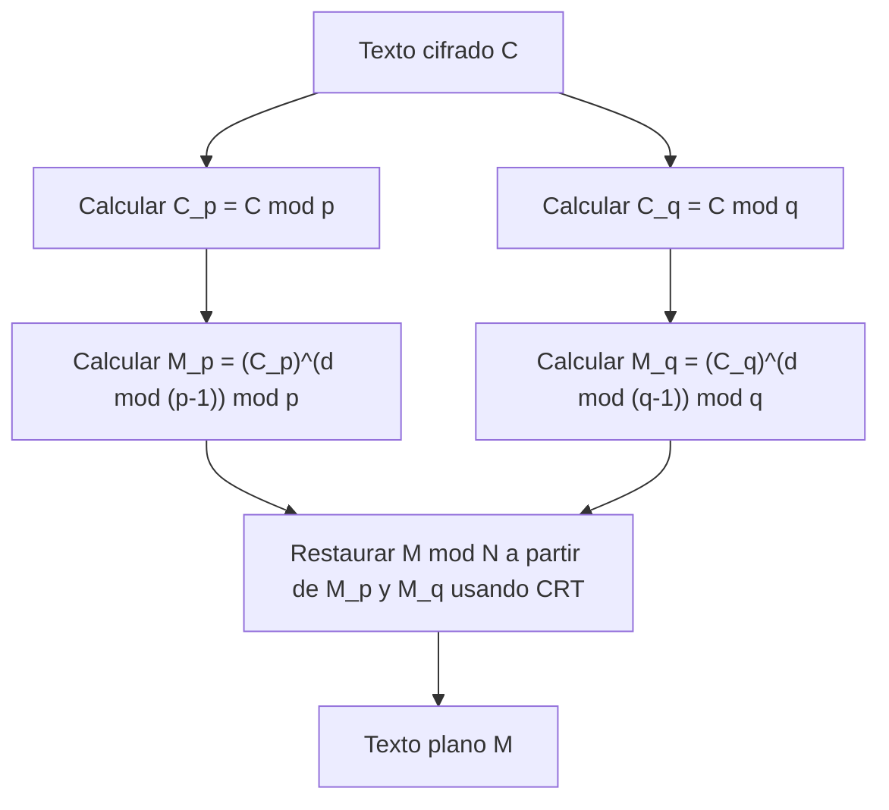

## Introducción

El Teorema Chino del Resto (Chinese Remainder Theorem, abreviado CRT) es uno de los teoremas más importantes y hermosos en la teoría de números. Sus orígenes se remontan al "Sunzi Suanjing", un antiguo libro de matemáticas chino que se cree fue compilado entre los siglos III y V. Este teorema, que comenzó con problemas aritméticos simples en la antigüedad, juega un papel indispensable miles de años después en la actualidad, en tecnologías de criptografía de clave pública como la **criptografía RSA**, que respaldan la comunicación segura en Internet que usamos a diario.

En este artículo, explicaremos en detalle este **Teorema Chino del Resto**, desde sus antecedentes históricos hasta su rigurosa definición matemática, procedimientos de cálculo específicos y aplicaciones en la teoría de la criptografía moderna, acompañados de diagramas y ejemplos concretos.

## Antecedentes históricos: El problema de Sunzi

Las raíces del Teorema Chino del Resto se encuentran en el siguiente famoso problema descrito en el problema 26 del volumen inferior del "Sunzi Suanjing".

> "Hay ciertas cosas cuyo número se desconoce. Si se cuentan de tres en tres, sobran dos; si se cuentan de cinco en cinco, sobran tres; y si se cuentan de siete en siete, sobran dos. ¿Cuántas cosas hay?"

Si expresamos esto utilizando un sistema de congruencias lineales (sistema), que es la notación matemática moderna, sería lo siguiente para un entero desconocido $x$.

$$
\begin{cases}
x \equiv 2 \pmod 3 \\
x \equiv 3 \pmod 5 \\
x \equiv 2 \pmod 7
\end{cases}
$$

La solución a este problema es $x = 23$. El Sunzi Suanjing también muestra el procedimiento de cálculo específico para derivar esta solución, lo cual se considera el primer ejemplo de un método de construcción concreto del Teorema Chino del Resto.

## Definición matemática y el enunciado del teorema

En las matemáticas modernas, el **Teorema Chino del Resto** se formula de la siguiente manera.

### Enunciado del teorema

Supongamos que tenemos $k$ enteros positivos $m_1, m_2, \dots, m_k$ que son coprimos entre sí (su máximo común divisor es 1). Es decir, $\gcd(m_i, m_j) = 1$ para cualquier $i \neq j$.

Entonces, para cualquier entero $a_1, a_2, \dots, a_k$, existe un único entero $x$ módulo $M = m_1 m_2 \dots m_k$ que satisface el siguiente sistema de congruencias lineales.

$$
\begin{cases}
x \equiv a_1 \pmod{m_1} \\
x \equiv a_2 \pmod{m_2} \\
\vdots \\
x \equiv a_k \pmod{m_k}
\end{cases}
$$

En otras palabras, la solución $x$ existe de forma única en el rango de $0 \leq x < M$, y todas las soluciones se expresan en la forma de $x \equiv x_0 \pmod M$.

### Demostración y método de construcción (Algoritmo de Gauss)

Lo maravilloso de este teorema no es solo que garantiza la existencia de una solución, sino que también proporciona un algoritmo para construir la solución específica. El método de construcción se muestra a continuación.

1. Calcular el producto total $M = m_1 m_2 \dots m_k$.
2. Para cada $i$, calcular $M_i = \frac{M}{m_i}$. ($M_i$ es el producto de todos los módulos excepto $m_i$).
3. Dado que $\gcd(M_i, m_i) = 1$, existe un inverso multiplicativo $y_i$ de $M_i$ módulo $m_i$. Es decir, encontrar un $y_i$ que satisfaga $M_i y_i \equiv 1 \pmod{m_i}$ utilizando el algoritmo de Euclides extendido u otro método.
4. La solución final $x$ viene dada por la siguiente fórmula.

$$
x = \sum_{i=1}^{k} a_i M_i y_i \pmod M
$$

Es fácil verificar que esta $x$ satisface el sistema original de congruencias lineales evaluando $x$ módulo cada $m_j$. Cuando $i \neq j$, $M_i$ es un múltiplo de $m_j$, por lo que $M_i \equiv 0 \pmod{m_j}$. Por lo tanto, entre los términos de la suma, solo queda el término donde $i = j$, lo que resulta en $x \equiv a_j M_j y_j \equiv a_j \cdot 1 \equiv a_j \pmod{m_j}$, satisfaciendo así la condición.

## Cálculo con un ejemplo concreto

Resolvamos el anterior "Problema de Sunzi" usando este algoritmo.

Problema:
$x \equiv 2 \pmod 3$  (aquí $a_1=2, m_1=3$)
$x \equiv 3 \pmod 5$  (aquí $a_2=3, m_2=5$)
$x \equiv 2 \pmod 7$  (aquí $a_3=2, m_3=7$)

**Paso 1:** Calcular $M$
$M = 3 \times 5 \times 7 = 105$

**Paso 2:** Calcular $M_i$
$M_1 = 105 / 3 = 35$
$M_2 = 105 / 5 = 21$
$M_3 = 105 / 7 = 15$

**Paso 3:** Calcular los inversos $y_i$
- $35 y_1 \equiv 1 \pmod 3 \implies 2 y_1 \equiv 1 \pmod 3 \implies y_1 = 2$
- $21 y_2 \equiv 1 \pmod 5 \implies 1 y_2 \equiv 1 \pmod 5 \implies y_2 = 1$
- $15 y_3 \equiv 1 \pmod 7 \implies 1 y_3 \equiv 1 \pmod 7 \implies y_3 = 1$

**Paso 4:** Calcular la solución $x$
$x = (2 \times 35 \times 2) + (3 \times 21 \times 1) + (2 \times 15 \times 1)$
$x = 140 + 63 + 30 = 233$

Encontrar el resto al dividir esto por $M = 105$.
$233 \equiv 23 \pmod{105}$

Por lo tanto, la solución positiva más pequeña es **23**, lo cual coincide perfectamente con la solución de Sunzi.

## Aplicación moderna: Criptografía RSA y CRT

El **Teorema Chino del Resto**, que solía ser un antiguo rompecabezas, tiene una aplicación sumamente práctica en la sociedad digital moderna. Un ejemplo representativo de ello es la aceleración del descifrado y la generación de firmas en la **criptografía RSA**.

### Resumen de la criptografía RSA

En la criptografía RSA, se utilizan dos números primos grandes $p$ y $q$, y su producto $N = pq$ forma parte de la clave pública. El cálculo para descifrar el texto cifrado $C$ a texto plano $M$ se realiza utilizando la clave privada $d$ de la siguiente manera.

$$
M = C^d \pmod N
$$

Aquí, dado que $N$ es un número sumamente grande (por ejemplo, 2048 bits) y $d$ también tiene un tamaño similar, este cálculo de exponenciación modular tiene un costo computacional muy alto.

### Aceleración mediante CRT (RSA-CRT)

Aquí es donde entra en juego el **Teorema Chino del Resto**. En lugar de realizar un cálculo enorme módulo $N$, el enfoque consiste en dividirlo en dos cálculos más pequeños módulo los factores primos de $N$, $p$ y $q$, y finalmente usar el CRT para reconstruir la solución original.

Específicamente, se siguen los siguientes pasos.



1. En lugar de $d$, se precalculan $d_p = d \pmod{p-1}$ y $d_q = d \pmod{q-1}$ como claves privadas.
2. Se realiza el descifrado individualmente módulo $p$ y módulo $q$.
   $M_p = C^{d_p} \pmod p$
   $M_q = C^{d_q} \pmod q$
3. Se aplica el CRT a $M_p$ y $M_q$ para obtener $M \pmod N$.

Cuando el módulo tiene la mitad de la longitud en bits (por ejemplo, 1024 bits), el costo de la exponenciación se reduce a aproximadamente 1/8. Incluso realizando esto dos veces, el costo total es de aproximadamente 1/4, por lo que el uso de RSA-CRT permite acelerar el descifrado y la generación de firmas en **aproximadamente 4 veces**. En dispositivos con recursos computacionales limitados como teléfonos inteligentes y tarjetas IC, esta aceleración es extremadamente importante.

## Implementación del Teorema Chino del Resto mediante programación

Además de la teoría, intentemos implementar el **Teorema Chino del Resto** escribiendo código real. Aquí implementaremos el algoritmo de Gauss utilizando Python.

```python
def extended_gcd(a, b):
    """
    Algoritmo de Euclides extendido
    Retorna (gcd(a, b), x, y) de modo que a*x + b*y = gcd(a, b)
    """
    if a == 0:
        return b, 0, 1
    else:
        g, y, x = extended_gcd(b % a, a)
        return g, x - (b // a) * y, y

def mod_inverse(a, m):
    """
    Retorna el inverso multiplicativo de a módulo m
    """
    g, x, y = extended_gcd(a, m)
    if g != 1:
        raise Exception('El inverso modular no existe')
    else:
        return x % m

def chinese_remainder_theorem(a_list, m_list):
    """
    Teorema Chino del Resto (CRT)
    Retorna x que satisface x ≡ a_i (mod m_i)
    """
    total_m = 1
    for m in m_list:
        total_m *= m
        
    x = 0
    for a, m in zip(a_list, m_list):
        M_i = total_m // m
        y_i = mod_inverse(M_i, m)
        x += a * M_i * y_i
        
    return x % total_m

# Resolver el problema de Sunzi
a = [2, 3, 2]
m = [3, 5, 7]
result = chinese_remainder_theorem(a, m)
print(f"Solución del problema de Sunzi: {result}") # Salida: 23
```

De esta manera, se puede replicar el **Teorema Chino del Resto** en una computadora con apenas unas docenas de líneas de código. Esta implementación es un algoritmo básico que se utiliza frecuentemente en la programación competitiva, etc.

## Generalización en álgebra abstracta: Anillos e ideales

El **Teorema Chino del Resto** no se limita a las simples propiedades de los números enteros, sino que se ha extendido a una forma más general en el **álgebra abstracta**, una rama importante de las matemáticas modernas.

Consideremos un anillo conmutativo $R$ y sus ideales $I_1, I_2, \dots, I_k$. Cuando estos ideales son coprimos entre sí (es decir, $I_i + I_j = R$ se cumple para cualquier $i \neq j$), podemos definir el siguiente homomorfismo natural de anillos $\phi$.

$$
\phi: R \to (R/I_1) \times (R/I_2) \times \dots \times (R/I_k)
$$
$$
\phi(x) = (x \pmod{I_1}, x \pmod{I_2}, \dots, x \pmod{I_k})
$$

El **Teorema Chino del Resto** en el álgebra abstracta afirma que este homomorfismo $\phi$ es sobreyectivo, y su núcleo (kernel) es la intersección de los ideales $\bigcap_{i=1}^k I_i$ (que coincide con el producto de los ideales $\prod_{i=1}^k I_i$).

Por lo tanto, por el primer teorema del isomorfismo, se cumple el siguiente isomorfismo natural.

$$
R / \left( \bigcap_{i=1}^k I_i \right) \cong (R/I_1) \times (R/I_2) \times \dots \times (R/I_k)
$$

### Aplicación a los anillos de polinomios

Una de las aplicaciones más importantes de este teorema generalizado es el **Teorema Chino del Resto** en un anillo de polinomios de una variable $F[x]$ sobre un cuerpo $F$.

Los "enteros coprimos" en el caso de los enteros corresponden a "polinomios que no comparten ninguna raíz (su polinomio máximo común divisor es una constante)" en el anillo de polinomios. Esta versión polinómica del CRT proporciona el respaldo teórico para la interpolación de Lagrange (Lagrange interpolation), y coincide completamente con el algoritmo para determinar de forma única el polinomio de grado mínimo que pasa a través de múltiples puntos dados. Además, esta es la base matemática para el **código Reed-Solomon**, un tipo de código de corrección de errores.

## Computación masivamente paralela utilizando Sistemas de Residuos (RNS)

Como una aplicación de ingeniería del **Teorema Chino del Resto**, también mencionaremos el **Sistema de Residuos (Residue Number System, RNS)**.

Normalmente, las computadoras representan números y realizan cálculos en sistema binario. Sin embargo, al realizar sumas o multiplicaciones, se produce la propagación de acarreos (carry), lo cual genera el problema de que el retraso del circuito aumenta a medida que aumenta el ancho de bits.

En RNS, se prepara un conjunto de módulos coprimos entre sí $\{m_1, m_2, \dots, m_k\}$, y un entero enorme $X$ se representa como una tupla de restos $(x_1, x_2, \dots, x_k)$ al dividirlo por cada módulo.

La mayor ventaja de esta representación es que **no se producen acarreos** en la suma y la multiplicación.
Por ejemplo, al sumar $X$ e $Y$, el cálculo se puede realizar de forma independiente para cada módulo.

$$
X + Y \leftrightarrow ( (x_1+y_1)\pmod{m_1}, \dots, (x_k+y_k)\pmod{m_k} )
$$
$$
X \times Y \leftrightarrow ( (x_1y_1)\pmod{m_1}, \dots, (x_k y_k)\pmod{m_k} )
$$

Dado que los cálculos en cada módulo son completamente independientes, es posible un cálculo extremadamente rápido mediante el ensamblaje de circuitos paralelos. Cuando se restaur el resultado final al número normal, se utiliza precisamente el **Teorema Chino del Resto**. Esta tecnología se investiga y se pone en práctica incluso hoy en día para el procesamiento de señales digitales (DSP), que exige operación en tiempo real, y para el diseño de circuitos de procesamiento criptográfico específicos.

## Conclusión

El **Teorema Chino del Resto** comenzó simplemente como un rompecabezas matemático, se sublimó en el teorema de la estructura de ideales en el álgebra abstracta y se ha desarrollado en una tecnología fundacional para la teoría de la criptografía moderna y la informática.

El hecho de que la sabiduría de los matemáticos de la antigua China, a través de miles de años, continúe viva como el procesamiento criptográfico en nuestros teléfonos inteligentes, puede decirse que simboliza la universalidad y el poder de la disciplina de las matemáticas.
