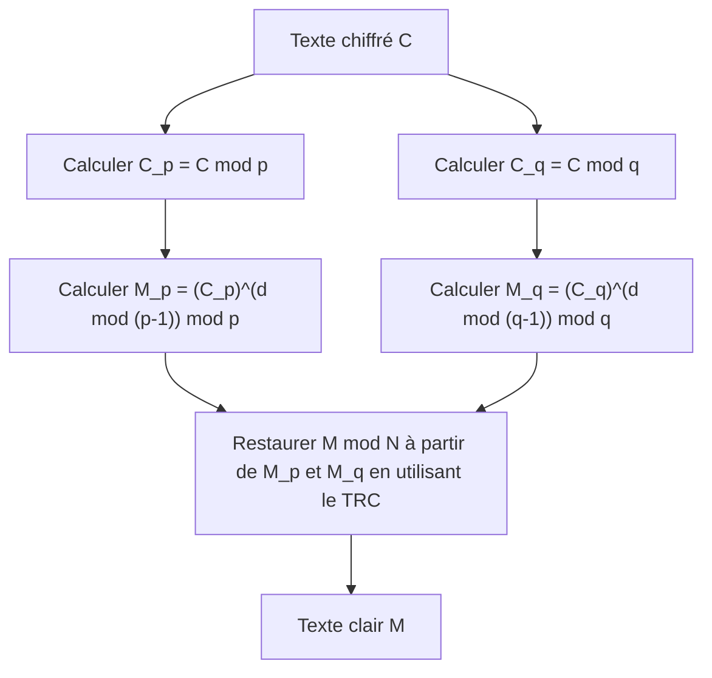

## Introduction

Le théorème des restes chinois ([Chinese Remainder Theorem](https://kenji.blog/fr/p/chinese-remainder-theorem/), en abrégé TRC) est l'un des théorèmes les plus importants et les plus beaux de la théorie des nombres. Son origine remonte au manuel de mathématiques de la Chine antique, le « Sunzi Suanjing » (Classique mathématique de Sunzi), qui aurait été compilé entre le IIIe et le Ve siècle. Ce théorème, qui a commencé par de simples problèmes de calcul dans l'Antiquité, joue un rôle indispensable dans la technologie de la cryptographie à clé publique, telle que la **cryptographie [RSA](https://kenji.blog/fr/p/modern-cryptography-public-key-hash-signature/)**, qui soutient les communications sécurisées sur Internet que nous utilisons quotidiennement aujourd'hui, après des milliers d'années.

Dans cet article, nous expliquerons en détail ce **théorème des restes chinois**, de son contexte historique à sa définition mathématique rigoureuse, en passant par des procédures de calcul spécifiques et ses applications dans la théorie de la cryptographie moderne, le tout accompagné de diagrammes et d'exemples concrets.

## Contexte historique : Le problème de Sunzi

Les racines du théorème des restes chinois se trouvent dans le célèbre problème suivant décrit dans la 26e question du volume inférieur du « Sunzi Suanjing ».

> « Il y a un certain nombre de choses dont on ignore la quantité. Si on les compte par trois, il en reste deux ; si on les compte par cinq, il en reste trois ; si on les compte par sept, il en reste deux. Combien y a-t-il de choses ? »

Si nous exprimons cela en utilisant des équations de congruence simultanées (système), qui est la notation mathématique moderne, pour un entier inconnu $x$, cela devient :

$$
\begin{cases}
x \equiv 2 \pmod 3 \\
x \equiv 3 \pmod 5 \\
x \equiv 2 \pmod 7
\end{cases}
$$

La solution à ce problème est $x = 23$. Le Sunzi Suanjing présente également une procédure de calcul spécifique pour dériver cette solution, ce qui est considéré comme le premier exemple d'une méthode de construction concrète du théorème des restes chinois.

## Définition mathématique et énoncé du théorème

Dans les mathématiques modernes, le **théorème des restes chinois** est formulé comme suit.

### Énoncé du théorème

Supposons qu'il y ait $k$ entiers positifs $m_1, m_2, \dots, m_k$ qui sont premiers entre eux (leur plus grand commun diviseur est 1). Autrement dit, pour tout $i \neq j$, $\gcd(m_i, m_j) = 1$ est vérifié.

Alors, pour tous les entiers arbitraires $a_1, a_2, \dots, a_k$, il existe un entier unique $x$ modulo $M = m_1 m_2 \dots m_k$ qui satisfait le système de congruences suivant.

$$
\begin{cases}
x \equiv a_1 \pmod{m_1} \\
x \equiv a_2 \pmod{m_2} \\
\vdots \\
x \equiv a_k \pmod{m_k}
\end{cases}
$$

En d'autres termes, la solution $x$ existe de manière unique dans la plage de $0 \leq x < M$, et toutes les solutions sont exprimées sous la forme $x \equiv x_0 \pmod M$.

### Preuve et méthode de construction (Algorithme de Gauss)

Ce qui est formidable avec ce théorème, c'est qu'il ne garantit pas seulement l'existence d'une solution, mais fournit également un algorithme pour construire la solution concrète. La méthode de construction est indiquée ci-dessous.

1. Calculez le produit total $M = m_1 m_2 \dots m_k$.
2. Pour chaque $i$, calculez $M_i = \frac{M}{m_i}$. ($M_i$ est le produit de tous les modules sauf $m_i$)
3. Puisque $\gcd(M_i, m_i) = 1$, il existe l'inverse multiplicatif $y_i$ de $M_i$ modulo $m_i$. Autrement dit, trouvez $y_i$ satisfaisant $M_i y_i \equiv 1 \pmod{m_i}$ en utilisant l'algorithme d'[Euclide](https://kenji.blog/fr/p/euclid/) étendu, etc.
4. La solution finale $x$ est donnée par la formule suivante.

$$
x = \sum_{i=1}^{k} a_i M_i y_i \pmod M
$$

Le fait que ce $x$ satisfasse le système de congruences d'origine peut être facilement confirmé en évaluant $x$ modulo chaque $m_j$. Lorsque $i \neq j$, $M_i$ est un multiple de $m_j$, donc $M_i \equiv 0 \pmod{m_j}$. Par conséquent, dans les termes de la somme, seul le terme où $i = j$ reste, ce qui donne $x \equiv a_j M_j y_j \equiv a_j \cdot 1 \equiv a_j \pmod{m_j}$, satisfaisant ainsi la condition.

## Calcul avec un exemple concret

Résolvons le « problème de Sunzi » mentionné plus tôt avec cet algorithme.

Problème :
$x \equiv 2 \pmod 3$  (où $a_1=2, m_1=3$)
$x \equiv 3 \pmod 5$  (où $a_2=3, m_2=5$)
$x \equiv 2 \pmod 7$  (où $a_3=2, m_3=7$)

**Étape 1 :** Calcul de $M$
$M = 3 \times 5 \times 7 = 105$

**Étape 2 :** Calcul de $M_i$
$M_1 = 105 / 3 = 35$
$M_2 = 105 / 5 = 21$
$M_3 = 105 / 7 = 15$

**Étape 3 :** Calcul de l'inverse $y_i$
- $35 y_1 \equiv 1 \pmod 3 \implies 2 y_1 \equiv 1 \pmod 3 \implies y_1 = 2$
- $21 y_2 \equiv 1 \pmod 5 \implies 1 y_2 \equiv 1 \pmod 5 \implies y_2 = 1$
- $15 y_3 \equiv 1 \pmod 7 \implies 1 y_3 \equiv 1 \pmod 7 \implies y_3 = 1$

**Étape 4 :** Calcul de la solution $x$
$x = (2 \times 35 \times 2) + (3 \times 21 \times 1) + (2 \times 15 \times 1)$
$x = 140 + 63 + 30 = 233$

Nous trouvons le reste de ceci divisé par $M = 105$.
$233 \equiv 23 \pmod{105}$

Par conséquent, la plus petite solution positive est **23**, ce qui correspond parfaitement à la solution de Sunzi.

## Application moderne : [Crypto](https://kenji.blog/fr/p/cryptocurrency-and-bitcoin/)graphie [RSA](https://kenji.blog/fr/p/modern-cryptography-public-key-hash-signature/) et TRC

Le **théorème des restes chinois**, qui était une énigme de l'Antiquité, a des applications extrêmement pratiques dans la société numérique moderne. L'exemple typique est l'accélération du déchiffrement et de la génération de signature dans la **cryptographie RSA**.

### Aperçu de la cryptographie RSA

Dans la cryptographie RSA, deux grands nombres premiers $p$ et $q$ sont utilisés, et leur produit $N = pq$ fait partie de la clé publique. Le calcul pour déchiffrer le texte clair $M$ à partir du texte chiffré $C$ est effectué comme suit à l'aide de la clé privée $d$.

$$
M = C^d \pmod N
$$

Ici, $N$ est un très grand nombre (par exemple, 2048 bits), et $d$ est d'une taille similaire, donc ce calcul d'exponentiation modulaire nécessite un coût de calcul important.

### Accélération avec le TRC (RSA-CRT)

C'est ici qu'intervient le **théorème des restes chinois**. Au lieu d'effectuer un calcul énorme modulo $N$, l'approche consiste à le diviser en deux petits calculs modulo $p$ et $q$, qui sont les facteurs premiers de $N$, et enfin de reconstruire la solution d'origine en utilisant le TRC.

Concrètement, les étapes suivantes sont suivies.



1. Comme clés privées, au lieu de $d$, pré-calculez $d_p = d \pmod{p-1}$ et $d_q = d \pmod{q-1}$.
2. Le déchiffrement modulo $p$ et modulo $q$ est effectué séparément.
   $M_p = C^{d_p} \pmod p$
   $M_q = C^{d_q} \pmod q$
3. Appliquez le TRC à $M_p$ et $M_q pour trouver $M \pmod N$.

Lorsque le module a la moitié de la longueur en bits (par exemple, 1024 bits), le coût du calcul de l'exponentiation est d'environ 1/8. Même en le faisant deux fois, le coût global est d'environ 1/4, et l'utilisation de [RSA](https://kenji.blog/fr/p/modern-cryptography-public-key-hash-signature/)-CRT peut accélérer le déchiffrement et la génération de signature d' **environ 4 fois**. Dans les appareils aux ressources de calcul limitées, tels que les smartphones et les cartes à puce, cette accélération est extrêmement importante.

## Implémentation du théorème des restes chinois par la programmation

Au-delà de la théorie, écrivons un programme pour implémenter réellement le **théorème des restes chinois**. Ici, nous utiliserons Python pour implémenter l'algorithme de Gauss.

```python
def extended_gcd(a, b):
    """
    Algorithme d'Euclide étendu
    Renvoie (gcd(a, b), x, y) tel que a*x + b*y = gcd(a, b)
    """
    if a == 0:
        return b, 0, 1
    else:
        g, y, x = extended_gcd(b % a, a)
        return g, x - (b // a) * y, y

def mod_inverse(a, m):
    """
    Renvoie l'inverse multiplicatif de a modulo m
    """
    g, x, y = extended_gcd(a, m)
    if g != 1:
        raise Exception("L'inverse modulaire n'existe pas")
    else:
        return x % m

def chinese_remainder_theorem(a_list, m_list):
    """
    Théorème des restes chinois (TRC)
    Renvoie x qui satisfait x ≡ a_i (mod m_i)
    """
    total_m = 1
    for m in m_list:
        total_m *= m
        
    x = 0
    for a, m in zip(a_list, m_list):
        M_i = total_m // m
        y_i = mod_inverse(M_i, m)
        x += a * M_i * y_i
        
    return x % total_m

# Résolution du problème de Sunzi
a = [2, 3, 2]
m = [3, 5, 7]
result = chinese_remainder_theorem(a, m)
print(f"Solution du problème de Sunzi : {result}") # Sortie : 23
```

De cette façon, vous pouvez reproduire le **théorème des restes chinois** sur un ordinateur avec seulement quelques dizaines de lignes de code. Cette implémentation est un algorithme de base fréquemment utilisé dans la programmation compétitive, etc.

## Généralisation en algèbre abstraite : Anneaux et idéaux

Le **théorème des restes chinois** n'est pas limité aux simples propriétés des entiers, mais a été étendu à une forme plus générale en **algèbre abstraite**, une branche importante des mathématiques modernes.

Considérons un anneau commutatif $R$ et ses idéaux $I_1, I_2, \dots, I_k$. Lorsque ces idéaux sont premiers entre eux (c'est-à-dire que $I_i + I_j = R$ est vérifié pour tout $i \neq j$), l'homomorphisme d'anneau naturel $\phi$ suivant peut être défini.

$$
\phi: R \to (R/I_1) \times (R/I_2) \times \dots \times (R/I_k)
$$
$$
\phi(x) = (x \pmod{I_1}, x \pmod{I_2}, \dots, x \pmod{I_k})
$$

Le **théorème des restes chinois** en algèbre abstraite affirme que cet homomorphisme $\phi$ est surjectif, et que son noyau (kernel) est l'intersection des idéaux $\bigcap_{i=1}^k I_i$ (qui correspond au produit des idéaux $\prod_{i=1}^k I_i$).

Par conséquent, selon le premier théorème d'isomorphisme, l'isomorphisme naturel suivant est vérifié.

$$
R / \left( \bigcap_{i=1}^k I_i \right) \cong (R/I_1) \times (R/I_2) \times \dots \times (R/I_k)
$$

### Application à l'anneau des polynômes

L'une des applications les plus importantes de ce théorème généralisé est le **théorème des restes chinois** dans l'anneau des polynômes à une variable $F[x]$ sur un corps $F$.

Les « entiers premiers entre eux » dans le cas des entiers correspondent aux « polynômes qui n'ont pas de racines communes (le plus grand commun diviseur polynomial est une constante) » dans l'anneau des polynômes. Cette version polynomiale du TRC fournit le fondement théorique de l'interpolation de [Lagrange](https://kenji.blog/fr/p/lagrange/), correspondant parfaitement à l'algorithme qui détermine uniquement le polynôme de degré minimum passant par plusieurs points donnés. C'est également la base mathématique des **codes de Reed-Solomon**, un type de code correcteur d'erreurs.

## Calcul massivement parallèle par le système de numération résiduelle (RNS)

Comme application technique du **théorème des restes chinois**, mentionnons également le **système de numération résiduelle (Residue Number System, RNS)**.

Généralement, un ordinateur représente les nombres en binaire et effectue des calculs. Cependant, lors de l'addition ou de la multiplication, une propagation de retenue (carry) se produit, ce qui entraîne le problème d'une augmentation du délai de circuit à mesure que la largeur en bits augmente.

Dans le RNS, un ensemble de modules premiers entre eux $\{m_1, m_2, \dots, m_k\}$ est préparé, et un grand entier $X$ est exprimé comme un ensemble de restes $(x_1, x_2, \dots, x_k)$ divisé par chaque module.

Le plus grand avantage de cette représentation est qu' **aucune retenue n'est générée** lors de l'addition et de la multiplication.
Par exemple, lors de l'ajout de $X$ et $Y$, des calculs indépendants peuvent être effectués pour chaque module.

$$
X + Y \leftrightarrow ( (x_1+y_1)\pmod{m_1}, \dots, (x_k+y_k)\pmod{m_k} )
$$
$$
X \times Y \leftrightarrow ( (x_1y_1)\pmod{m_1}, \dots, (x_k y_k)\pmod{m_k} )
$$

Comme les calculs dans chaque module sont complètement indépendants, des opérations extrêmement rapides sont possibles en construisant des circuits parallèles. Lors du retour du résultat final à un nombre normal, c'est précisément le **théorème des restes chinois** qui est utilisé. Cette technologie est toujours étudiée et mise en pratique de nos jours dans le traitement numérique du signal (DSP) nécessitant des temps réels, et dans la conception de certains circuits de traitement cryptographique.

## Résumé

Le **théorème des restes chinois** a commencé comme un simple casse-tête mathématique, a été sublimé en un théorème de structure d'idéaux en algèbre abstraite, et s'est développé en une technologie fondamentale pour la théorie de la cryptographie moderne et l'informatique.

Le fait que la sagesse des mathématiciens de la Chine antique continue de vivre après des milliers d'années sous la forme du traitement cryptographique dans nos smartphones symbolise l'universalité et la puissance de la discipline mathématique.
