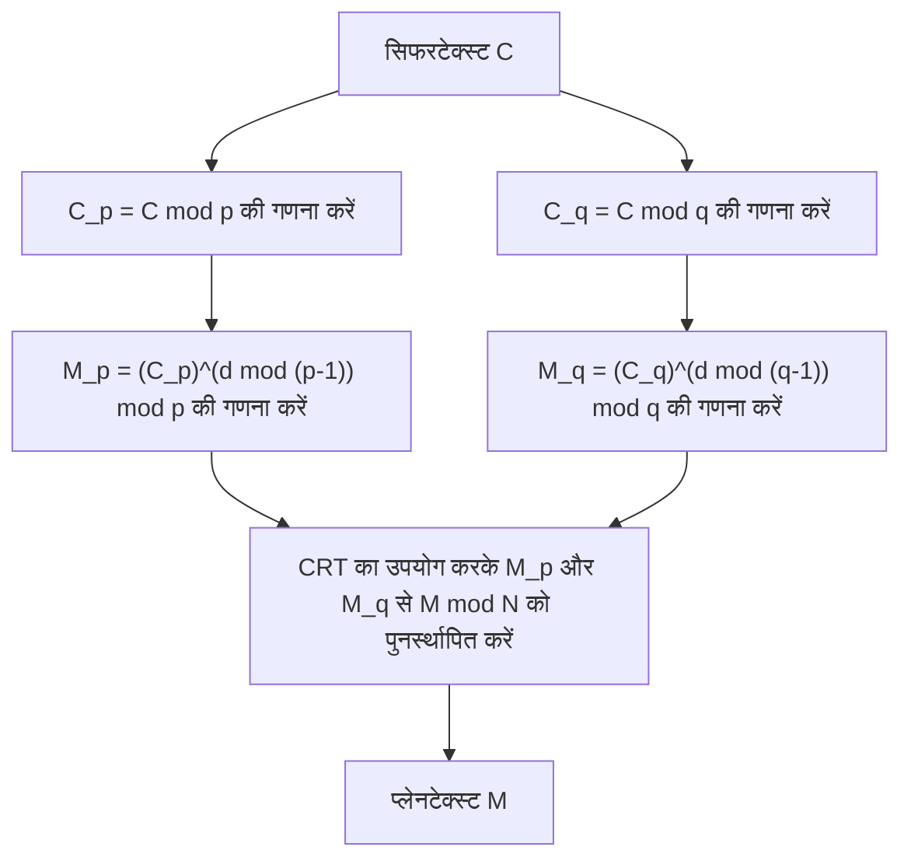

## परिचय

चीनी शेषफल प्रमेय (Chinese Remainder Theorem, संक्षेप में CRT) संख्या सिद्धांत के सबसे महत्वपूर्ण और सुंदर प्रमेयों में से एक है। इसकी उत्पत्ति 3वीं से 5वीं शताब्दी के बीच संकलित प्राचीन चीनी गणितीय पुस्तक 'सुनजी सुआनजिंग' (Sunzi Suanjing) से मानी जाती है। प्राचीन काल के सरल अंकगणितीय समस्याओं से शुरू हुआ यह प्रमेय, हजारों वर्षों के बाद आज के आधुनिक युग में, इंटरनेट पर हमारे दैनिक सुरक्षित संचार का समर्थन करने वाली **RSA एन्क्रिप्शन** जैसी सार्वजनिक-कुंजी एन्क्रिप्शन प्रौद्योगिकियों में अपरिहार्य भूमिका निभाता है।

इस लेख में, हम इस **चीनी शेषफल प्रमेय** के बारे में, इसकी ऐतिहासिक पृष्ठभूमि से लेकर सख्त गणितीय परिभाषा, विशिष्ट गणना प्रक्रियाओं, और आधुनिक क्रिप्टोग्राफी में इसके अनुप्रयोगों तक, चित्रों और विशिष्ट उदाहरणों के साथ विस्तार से चर्चा करेंगे।

## ऐतिहासिक पृष्ठभूमि: सुनजी की समस्या

चीनी शेषफल प्रमेय की जड़ें 'सुनजी सुआनजिंग' के खंड 3, समस्या 26 में दर्ज निम्नलिखित प्रसिद्ध समस्या में हैं।

> 「今有物不知其數、三三數之賸二、五五數之賸三、七七數之賸二。問物幾何？」
> (अभी, ऐसी कुछ वस्तुएं हैं जिनकी संख्या अज्ञात है। यदि उन्हें 3-3 करके गिना जाए तो 2 शेष बचते हैं, 5-5 करके गिना जाए तो 3 शेष बचते हैं, और 7-7 करके गिना जाए तो 2 शेष बचते हैं। वस्तुओं की संख्या कितनी है?)

यदि इसे आधुनिक गणितीय संकेतन, एक साथ सर्वांगसम समीकरण (सिस्टम) का उपयोग करके व्यक्त किया जाए, तो अज्ञात पूर्णांक $x$ के लिए यह इस प्रकार होगा:

$$
\begin{cases}
x \equiv 2 \pmod 3 \\
x \equiv 3 \pmod 5 \\
x \equiv 2 \pmod 7
\end{cases}
$$

इस समस्या का हल $x = 23$ है। सुनजी सुआनजिंग में इस हल को प्राप्त करने के लिए विशिष्ट गणना प्रक्रिया भी दिखाई गई है, जिसे चीनी शेषफल प्रमेय की विशिष्ट निर्माण विधि का पहला उदाहरण माना जाता है।

## गणितीय परिभाषा और प्रमेय का कथन

आधुनिक गणित में, **चीनी शेषफल प्रमेय** को इस प्रकार तैयार किया गया है।

### प्रमेय का कथन

मान लीजिए कि $k$ सकारात्मक पूर्णांक $m_1, m_2, \dots, m_k$ हैं जो सह-अभाज्य (pairwise coprime) हैं (यानी, उनका महत्तम समापवर्तक 1 है)। दूसरे शब्दों में, किसी भी $i \neq j$ के लिए $\gcd(m_i, m_j) = 1$ सत्य है।

इस समय, किन्हीं भी पूर्णांकों $a_1, a_2, \dots, a_k$ के लिए, एक ऐसा पूर्णांक $x$ जो निम्नलिखित एक साथ सर्वांगसम समीकरणों को संतुष्ट करता है, मॉड्यूलो $M = m_1 m_2 \dots m_k$ में विशिष्ट रूप से (uniquely) मौजूद होता है।

$$
\begin{cases}
x \equiv a_1 \pmod{m_1} \\
x \equiv a_2 \pmod{m_2} \\
\vdots \\
x \equiv a_k \pmod{m_k}
\end{cases}
$$

यानी, हल $x$, $0 \leq x < M$ की सीमा में केवल एक ही मौजूद होता है, और सभी हल $x \equiv x_0 \pmod M$ के रूप में व्यक्त किए जाते हैं।

### प्रमाण और निर्माण विधि (गॉस का एल्गोरिदम)

इस प्रमेय की शानदार बात यह है कि यह केवल हल के अस्तित्व की गारंटी नहीं देता है, बल्कि एक विशिष्ट हल बनाने के लिए एक एल्गोरिदम भी प्रदान करता है। नीचे इसकी निर्माण विधि दी गई है।

1. कुल गुणनफल $M = m_1 m_2 \dots m_k$ की गणना करें।
2. प्रत्येक $i$ के लिए, $M_i = \frac{M}{m_i}$ की गणना करें। ( $M_i$, $m_i$ को छोड़कर बाकी सभी मॉड्यूल का गुणनफल है)
3. चूँकि $\gcd(M_i, m_i) = 1$ है, इसलिए मॉड्यूलो $m_i$ में $M_i$ का गुणनात्मक व्युत्क्रम (multiplicative inverse) $y_i$ मौजूद होता है। यानी, विस्तारित यूक्लिडियन एल्गोरिदम आदि का उपयोग करके ऐसा $y_i$ खोजें जो $M_i y_i \equiv 1 \pmod{m_i}$ को संतुष्ट करता हो।
4. अंतिम हल $x$ निम्नलिखित सूत्र द्वारा दिया जाता है।

$$
x = \sum_{i=1}^{k} a_i M_i y_i \pmod M
$$

यह पुष्टि करना आसान है कि यह $x$ मूल एक साथ सर्वांगसम समीकरणों को संतुष्ट करता है, प्रत्येक $m_j$ के सापेक्ष $x$ का मूल्यांकन करके। जब $i \neq j$, $M_i$, $m_j$ का गुणज है, इसलिए $M_i \equiv 0 \pmod{m_j}$ होता है। अतः, योग के पदों में केवल $i = j$ वाला पद ही बचता है, और $x \equiv a_j M_j y_j \equiv a_j \cdot 1 \equiv a_j \pmod{m_j}$ हो जाता है, जो शर्तों को पूरा करता है।

## विशिष्ट उदाहरण के साथ गणना

आइए पहले दी गई "सुनजी की समस्या" को इस एल्गोरिदम से हल करें।

समस्या:
$x \equiv 2 \pmod 3$ (यहाँ $a_1=2, m_1=3$)
$x \equiv 3 \pmod 5$ (यहाँ $a_2=3, m_2=5$)
$x \equiv 2 \pmod 7$ (यहाँ $a_3=2, m_3=7$)

**चरण 1:** $M$ की गणना
$M = 3 \times 5 \times 7 = 105$

**चरण 2:** $M_i$ की गणना
$M_1 = 105 / 3 = 35$
$M_2 = 105 / 5 = 21$
$M_3 = 105 / 7 = 15$

**चरण 3:** व्युत्क्रम $y_i$ की गणना
- $35 y_1 \equiv 1 \pmod 3 \implies 2 y_1 \equiv 1 \pmod 3 \implies y_1 = 2$
- $21 y_2 \equiv 1 \pmod 5 \implies 1 y_2 \equiv 1 \pmod 5 \implies y_2 = 1$
- $15 y_3 \equiv 1 \pmod 7 \implies 1 y_3 \equiv 1 \pmod 7 \implies y_3 = 1$

**चरण 4:** हल $x$ की गणना
$x = (2 \times 35 \times 2) + (3 \times 21 \times 1) + (2 \times 15 \times 1)$
$x = 140 + 63 + 30 = 233$

इसे $M = 105$ से विभाजित करने पर शेषफल ज्ञात करें।
$233 \equiv 23 \pmod{105}$

इसलिए, सबसे छोटा धनात्मक हल **23** है, जो सुनजी के हल से पूरी तरह मेल खाता है।

## आधुनिक काल में अनुप्रयोग: RSA एन्क्रिप्शन और CRT

एक प्राचीन पहेली होने के बावजूद, **चीनी शेषफल प्रमेय** का आधुनिक डिजिटल समाज में अत्यधिक व्यावहारिक उपयोग है। इसका एक प्रमुख उदाहरण **RSA एन्क्रिप्शन** में डिक्रिप्शन और हस्ताक्षर निर्माण को तेज करना है।

### RSA एन्क्रिप्शन का अवलोकन

RSA एन्क्रिप्शन में, दो बड़े अभाज्य संख्याओं $p$ और $q$ का उपयोग किया जाता है, और उनके गुणनफल $N = pq$ को सार्वजनिक कुंजी के हिस्से के रूप में रखा जाता है। सिफरटेक्स्ट $C$ से प्लेनटेक्स्ट $M$ को डिक्रिप्ट करने की गणना निजी कुंजी $d$ का उपयोग करके इस प्रकार की जाती है।

$$
M = C^d \pmod N
$$

यहाँ, $N$ एक बहुत बड़ी संख्या (उदाहरण के लिए 2048 बिट्स) है, और $d$ का आकार भी लगभग समान होता है, इसलिए इस मॉड्यूलर एक्सपोनेंशिएशन गणना में बहुत अधिक कम्प्यूटेशनल लागत लगती है।

### CRT द्वारा गतिवर्धन (RSA-CRT)

यहाँ **चीनी शेषफल प्रमेय** काम आता है। $N$ के मॉड्यूलो में बड़ी गणना करने के बजाय, इसे $N$ के अभाज्य कारकों $p$ और $q$ के मॉड्यूलो में दो छोटी गणनाओं में विभाजित किया जाता है, और अंत में CRT का उपयोग करके मूल हल का पुनर्निर्माण किया जाता है।

विशिष्ट रूप से, निम्नलिखित चरणों का पालन किया जाता है:



1. निजी कुंजी के रूप में $d$ के बजाय, $d_p = d \pmod{p-1}$ और $d_q = d \pmod{q-1}$ की पहले ही गणना कर ली जाती है।
2. मॉड्यूलो $p$ और मॉड्यूलो $q$ के लिए डिक्रिप्शन अलग-अलग किया जाता है।
   $M_p = C^{d_p} \pmod p$
   $M_q = C^{d_q} \pmod q$
3. $M_p$ और $M_q$ पर CRT लागू करके $M \pmod N$ ज्ञात किया जाता है।

जब मॉड्यूलो की बिट लंबाई आधी (जैसे 1024 बिट्स) हो जाती है, तो घातांक गणना की लागत लगभग 1/8 हो जाती है। इसे दो बार करने पर भी कुल लागत लगभग 1/4 रह जाती है, जिससे RSA-CRT का उपयोग करके डिक्रिप्शन और हस्ताक्षर निर्माण को **लगभग 4 गुना तेज** किया जा सकता है। स्मार्टफोन और स्मार्ट कार्ड जैसे सीमित गणना संसाधनों वाले उपकरणों में, यह गतिवर्धन अत्यंत महत्वपूर्ण है।

## चीनी शेषफल प्रमेय का प्रोग्रामिंग कार्यान्वयन

सिद्धांत के अलावा, आइए वास्तव में प्रोग्राम लिखकर **चीनी शेषफल प्रमेय** को लागू करें। यहाँ, हम Python का उपयोग करके गॉस के एल्गोरिदम को लागू करेंगे।

```python
def extended_gcd(a, b):
    """
    विस्तारित यूक्लिडियन एल्गोरिदम
    (gcd(a, b), x, y) लौटाता है ताकि a*x + b*y = gcd(a, b)
    """
    if a == 0:
        return b, 0, 1
    else:
        g, y, x = extended_gcd(b % a, a)
        return g, x - (b // a) * y, y

def mod_inverse(a, m):
    """
    मॉड्यूलो m में a का गुणनात्मक व्युत्क्रम लौटाता है
    """
    g, x, y = extended_gcd(a, m)
    if g != 1:
        raise Exception('मॉड्यूलर व्युत्क्रम मौजूद नहीं है')
    else:
        return x % m

def chinese_remainder_theorem(a_list, m_list):
    """
    चीनी शेषफल प्रमेय (CRT)
    x ≡ a_i (mod m_i) को संतुष्ट करने वाला x लौटाता है
    """
    total_m = 1
    for m in m_list:
        total_m *= m
        
    x = 0
    for a, m in zip(a_list, m_list):
        M_i = total_m // m
        y_i = mod_inverse(M_i, m)
        x += a * M_i * y_i
        
    return x % total_m

# सुनजी की समस्या को हल करना
a = [2, 3, 2]
m = [3, 5, 7]
result = chinese_remainder_theorem(a, m)
print(f"सुनजी की समस्या का हल: {result}") # आउटपुट: 23
```

इस प्रकार, मात्र कुछ दर्जन लाइनों के कोड के साथ, आप कंप्यूटर पर **चीनी शेषफल प्रमेय** को फिर से बना सकते हैं। यह कार्यान्वयन एक बुनियादी एल्गोरिदम है जिसका अक्सर प्रतिस्पर्धी प्रोग्रामिंग आदि में भी उपयोग किया जाता है।

## अमूर्त बीजगणित में सामान्यीकरण: वलय (Rings) और आदर्श (Ideals)

**चीनी शेषफल प्रमेय** केवल पूर्णांकों के गुणों तक सीमित नहीं है, बल्कि आधुनिक गणित के एक महत्वपूर्ण क्षेत्र, **अमूर्त बीजगणित** में इसे अधिक सामान्य रूप में विस्तारित किया गया है।

एक क्रमविनिमेय वलय (commutative ring) $R$ और इसके आदर्शों (ideals) $I_1, I_2, \dots, I_k$ पर विचार करें। जब ये आदर्श सह-अभाज्य (coprime) होते हैं (यानी, किन्हीं भी $i \neq j$ के लिए $I_i + I_j = R$ सत्य होता है), तो हम निम्नलिखित प्राकृतिक वलय समरूपता (ring homomorphism) $\phi$ को परिभाषित कर सकते हैं।

$$
\phi: R \to (R/I_1) \times (R/I_2) \times \dots \times (R/I_k)
$$
$$
\phi(x) = (x \pmod{I_1}, x \pmod{I_2}, \dots, x \pmod{I_k})
$$

अमूर्त बीजगणित में **चीनी शेषफल प्रमेय** यह दावा करता है कि यह समरूपता $\phi$ आच्छादक (surjective) है, और इसका कर्नेल आदर्शों का प्रतिच्छेदन (intersection) $\bigcap_{i=1}^k I_i$ (जो आदर्शों के गुणनफल $\prod_{i=1}^k I_i$ के बराबर होता है)।

इसलिए, पहले आइसोमोर्फिज़्म प्रमेय (First Isomorphism Theorem) के अनुसार, निम्नलिखित प्राकृतिक आइसोमोर्फिज़्म (isomorphism) स्थापित होता है।

$$
R / \left( \bigcap_{i=1}^k I_i \right) \cong (R/I_1) \times (R/I_2) \times \dots \times (R/I_k)
$$

### बहुपद वलयों (Polynomial Rings) में अनुप्रयोग

इस सामान्यीकृत प्रमेय के सबसे महत्वपूर्ण अनुप्रयोगों में से एक एक क्षेत्र $F$ पर एक-चर बहुपद वलय $F[x]$ में **चीनी शेषफल प्रमेय** है।

पूर्णांकों के मामले में "सह-अभाज्य पूर्णांक", बहुपद वलय में "बिना किसी सामान्य मूल के (जिनका महत्तम समापवर्तक बहुपद एक स्थिरांक है) बहुपद" के समतुल्य हैं। CRT का यह बहुपदीय संस्करण लैग्रेंज इंटरपोलेशन (Lagrange interpolation) का सैद्धांतिक आधार है, और दिए गए कई बिंदुओं से गुजरने वाले न्यूनतम डिग्री के बहुपद को विशिष्ट रूप से निर्धारित करने के एल्गोरिदम से पूरी तरह मेल खाता है। इसके अलावा, यह **रीड-सोलोमन कोड (Reed-Solomon code)**, जो एक प्रकार का त्रुटि-सुधार कोड है, का गणितीय आधार भी है।

## अवशेष संख्या प्रणाली (RNS) के माध्यम से अत्यधिक समानांतर गणना

**चीनी शेषफल प्रमेय** के इंजीनियरिंग अनुप्रयोग के रूप में, आइए **अवशेष संख्या प्रणाली (Residue Number System, RNS)** का भी उल्लेख करें।

आमतौर কমপক্ষে, कंप्यूटर संख्याओं को बाइनरी में दर्शाते हैं और गणना करते हैं। हालांकि, जब जोड़ या गुणा किया जाता है, तो कैरी (हासिल) का प्रसार होता है, जिसके कारण बिट चौड़ाई बढ़ने पर सर्किट में देरी (delay) बढ़ जाती है।

RNS में, सह-अभाज्य मॉड्यूलों का एक सेट $\{m_1, m_2, \dots, m_k\}$ तैयार किया जाता है, और एक विशाल पूर्णांक $X$ को प्रत्येक मॉड्यूलो द्वारा विभाजित करने पर शेषफल के एक सेट $(x_1, x_2, \dots, x_k)$ के रूप में दर्शाया जाता है।

इस प्रतिनिधित्व का सबसे बड़ा लाभ यह है कि जोड़ और गुणा में **कैरी (हासिल) उत्पन्न नहीं होता है** ।
उदाहरण के लिए, जब $X$ और $Y$ को जोड़ा जाता है, तो गणना प्रत्येक मॉड्यूलो के लिए स्वतंत्र रूप से की जा सकती है।

$$
X + Y \leftrightarrow ( (x_1+y_1)\pmod{m_1}, \dots, (x_k+y_k)\pmod{m_k} )
$$
$$
X \times Y \leftrightarrow ( (x_1y_1)\pmod{m_1}, \dots, (x_k y_k)\pmod{m_k} )
$$

चूंकि प्रत्येक मॉड्यूलो में गणना पूरी तरह से स्वतंत्र है, समानांतर सर्किट (parallel circuits) बनाकर अत्यंत तीव्र संगणना संभव है। अंतिम परिणाम को वापस सामान्य संख्या में परिवर्तित करते समय, ठीक **चीनी शेषफल प्रमेय** का उपयोग किया जाता है। इस तकनीक पर वर्तमान में भी डिजिटल सिग्नल प्रोसेसिंग (DSP), जिसमें वास्तविक समय (real-time) प्रदर्शन की आवश्यकता होती है, और विशिष्ट क्रिप्टोग्राफ़िक प्रोसेसिंग सर्किट के डिजाइन में शोध और व्यावसायीकरण किया जा रहा है।

## निष्कर्ष

**चीनी शेषफल प्रमेय** मात्र एक गणितीय पहेली के रूप में शुरू हुआ, अमूर्त बीजगणित में आदर्शों के संरचनात्मक प्रमेय में विकसित हुआ, और आधुनिक क्रिप्टोग्राफी और कंप्यूटर विज्ञान के लिए एक मूलभूत तकनीक के रूप में आगे बढ़ा।

हजारों वर्षों के बाद, प्राचीन चीनी गणितज्ञों का ज्ञान हमारे स्मार्टफ़ोन के भीतर क्रिप्टोग्राफ़िक प्रोसेसिंग के रूप में जीवित है, जो निस्संदेह गणित की सार्वभौमिकता और शक्ति का प्रतीक है।
