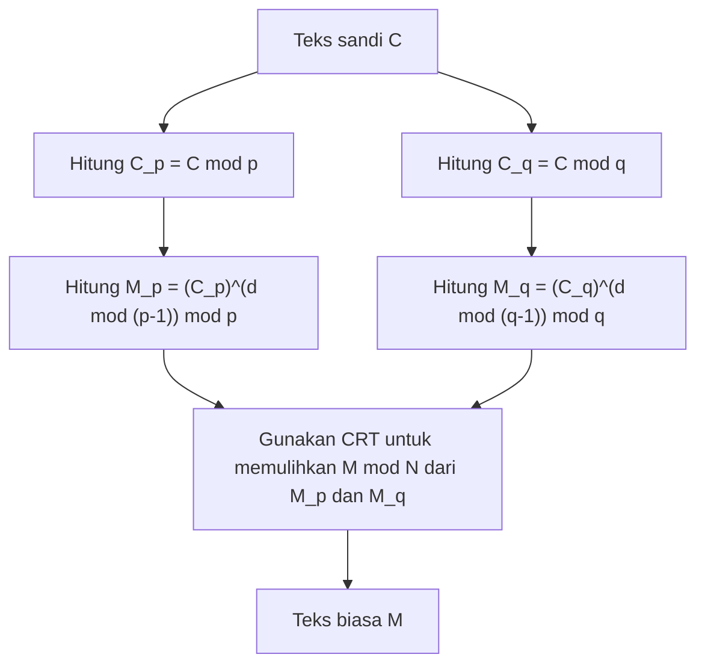

## Pendahuluan

Teorema Sisa Tiongkok ([Chinese Remainder Theorem](https://kenji.blog/p/chinese-remainder-theorem/), disingkat CRT) adalah salah satu teorema yang paling penting dan indah dalam teori bilangan. Asal-usulnya berawal dari naskah matematika Tiongkok kuno "Sunzi Suanjing" yang diyakini disusun antara abad ke-3 hingga ke-5. Berawal dari masalah aritmatika sederhana di zaman kuno, teorema ini kini memainkan peran yang sangat penting dalam teknologi kriptografi kunci publik, seperti **Kriptografi RSA**, yang mengamankan komunikasi internet kita sehari-hari setelah ribuan tahun.

Pada artikel ini, kita akan membahas **Teorema Sisa Tiongkok** secara detail, mulai dari latar belakang sejarahnya, definisi matematis yang ketat, langkah-langkah komputasi konkret, hingga aplikasinya dalam teori kriptografi modern, disertai dengan ilustrasi dan contoh konkret.

## Latar Belakang Sejarah: Masalah Sunzi

Akar Teorema Sisa Tiongkok dapat ditemukan dalam masalah terkenal berikut yang tertulis pada soal ke-26 volume bawah "Sunzi Suanjing".

> "Ada suatu barang yang jumlahnya tidak diketahui. Jika dihitung tiga-tiga bersisa dua, jika dihitung lima-lima bersisa tiga, jika dihitung tujuh-tujuh bersisa dua. Berapakah jumlah barang tersebut?"

Jika ini diekspresikan menggunakan notasi matematika modern yaitu sistem kongruensi linier, maka untuk bilangan bulat $x$ yang tidak diketahui adalah sebagai berikut:

$$
\begin{cases}
x \equiv 2 \pmod 3 \\
x \equiv 3 \pmod 5 \\
x \equiv 2 \pmod 7
\end{cases}
$$

Solusi dari masalah ini adalah $x = 23$. Sunzi Suanjing juga memberikan langkah-langkah perhitungan yang konkret untuk memperoleh solusi ini, yang dianggap sebagai contoh pertama dari metode konstruktif untuk Teorema Sisa Tiongkok.

## Definisi Matematis dan Pernyataan Teorema

Dalam matematika modern, **Teorema Sisa Tiongkok** dirumuskan sebagai berikut.

### Pernyataan Teorema

Misalkan ada $k$ bilangan bulat positif $m_1, m_2, \dots, m_k$ yang saling prima (pembagi persekutuan terbesarnya adalah 1). Artinya, untuk setiap $i \neq j$ berlaku $\gcd(m_i, m_j) = 1$.

Pada kondisi ini, untuk setiap bilangan bulat $a_1, a_2, \dots, a_k$, terdapat sebuah bilangan bulat $x$ yang memenuhi sistem kongruensi berikut, dan $x$ ini unik dalam modulo $M = m_1 m_2 \dots m_k$.

$$
\begin{cases}
x \equiv a_1 \pmod{m_1} \\
x \equiv a_2 \pmod{m_2} \\
\vdots \\
x \equiv a_k \pmod{m_k}
\end{cases}
$$

Dengan kata lain, hanya ada satu solusi $x$ dalam rentang $0 \leq x < M$, dan semua solusi dapat dinyatakan dalam bentuk $x \equiv x_0 \pmod M$.

### Pembuktian dan Metode Konstruksi (Algoritma Gauss)

Hal yang menakjubkan dari teorema ini adalah teorema ini tidak hanya menjamin keberadaan solusi, tetapi juga menyediakan algoritma untuk membangun solusi tersebut secara konkret. Metode konstruksinya ditunjukkan di bawah ini.

1. Hitung hasil kali keseluruhan $M = m_1 m_2 \dots m_k$.
2. Untuk setiap $i$, hitung $M_i = \frac{M}{m_i}$. ($M_i$ adalah hasil kali semua modulus kecuali $m_i$)
3. Karena $\gcd(M_i, m_i) = 1$, maka terdapat invers perkalian $y_i$ dari $M_i$ dalam modulo $m_i$. Yaitu, kita mencari $y_i$ yang memenuhi $M_i y_i \equiv 1 \pmod{m_i}$ menggunakan algoritma [Euclide](https://kenji.blog/p/euclid/)an yang diperluas.
4. Solusi akhir $x$ diberikan oleh rumus berikut.

$$
x = \sum_{i=1}^{k} a_i M_i y_i \pmod M
$$

Bahwa $x$ ini memenuhi sistem kongruensi awal dapat dipastikan dengan mudah dengan mengevaluasi $x$ modulo masing-masing $m_j$. Ketika $i \neq j$, $M_i$ adalah kelipatan dari $m_j$, sehingga $M_i \equiv 0 \pmod{m_j}$. Oleh karena itu, di antara suku-suku dalam penjumlahan, hanya suku $i = j$ yang tersisa, sehingga $x \equiv a_j M_j y_j \equiv a_j \cdot 1 \equiv a_j \pmod{m_j}$, yang memenuhi kondisi.

## Perhitungan dengan Contoh Konkret

Mari kita coba selesaikan "Masalah Sunzi" di atas menggunakan algoritma ini.

Masalah:
$x \equiv 2 \pmod 3$  (di sini $a_1=2, m_1=3$)
$x \equiv 3 \pmod 5$  (di sini $a_2=3, m_2=5$)
$x \equiv 2 \pmod 7$  (di sini $a_3=2, m_3=7$)

**Langkah 1:** Perhitungan $M$
$M = 3 \times 5 \times 7 = 105$

**Langkah 2:** Perhitungan $M_i$
$M_1 = 105 / 3 = 35$
$M_2 = 105 / 5 = 21$
$M_3 = 105 / 7 = 15$

**Langkah 3:** Perhitungan invers $y_i$
- $35 y_1 \equiv 1 \pmod 3 \implies 2 y_1 \equiv 1 \pmod 3 \implies y_1 = 2$
- $21 y_2 \equiv 1 \pmod 5 \implies 1 y_2 \equiv 1 \pmod 5 \implies y_2 = 1$
- $15 y_3 \equiv 1 \pmod 7 \implies 1 y_3 \equiv 1 \pmod 7 \implies y_3 = 1$

**Langkah 4:** Perhitungan solusi $x$
$x = (2 \times 35 \times 2) + (3 \times 21 \times 1) + (2 \times 15 \times 1)$
$x = 140 + 63 + 30 = 233$

Kita cari sisa pembagian bilangan ini dengan $M = 105$.
$233 \equiv 23 \pmod{105}$

Dengan demikian, solusi positif terkecilnya adalah **23**, yang secara sempurna sesuai dengan solusi Sunzi.

## Aplikasi di Era Modern: Kriptografi RSA dan CRT

Teka-teki kuno **Teorema Sisa Tiongkok** ini memiliki aplikasi praktis yang sangat berguna di masyarakat digital modern. Contoh utamanya adalah percepatan dekripsi dan pembuatan tanda tangan pada **Kriptografi RSA**.

### Ringkasan Kriptografi RSA

Dalam kriptografi RSA, dua bilangan prima besar $p$ dan $q$ digunakan, dan hasil kalinya $N = pq$ menjadi bagian dari kunci publik. Komputasi untuk mendekripsi teks sandi $C$ menjadi teks biasa $M$ menggunakan kunci privat $d$ dilakukan sebagai berikut.

$$
M = C^d \pmod N
$$

Di sini, karena $N$ adalah bilangan yang sangat besar (misalnya 2048 bit), dan $d$ juga memiliki ukuran yang sama, perhitungan eksponen modular ini memakan biaya komputasi yang besar.

### Percepatan dengan CRT (RSA-CRT)

Di sinilah **Teorema Sisa Tiongkok** berperan. Daripada melakukan perhitungan besar dengan modulo $N$, pendekatan yang digunakan adalah memecah komputasi menjadi dua komputasi yang lebih kecil dengan modulo dari faktor prima $N$, yaitu $p$ dan $q$, kemudian di akhir menggabungkan solusinya kembali menggunakan CRT.

Secara spesifik, langkah-langkahnya adalah sebagai berikut.



1. Sebagai kunci privat, daripada menggunakan $d$, nilai $d_p = d \pmod{p-1}$ dan $d_q = d \pmod{q-1}$ dihitung terlebih dahulu.
2. Proses dekripsi dilakukan secara terpisah untuk modulo $p$ dan modulo $q$.
   $M_p = C^{d_p} \pmod p$
   $M_q = C^{d_q} \pmod q$
3. CRT diterapkan pada $M_p$ dan $M_q$ untuk mendapatkan $M \pmod N$.

Ketika modulus berukuran setengah (misalnya 1024 bit), biaya perhitungan eksponensial berkurang menjadi sekitar 1/8. Melakukan hal ini dua kali menjadikan total biayanya sekitar 1/4. Sehingga, penggunaan RSA-CRT dapat mempercepat dekripsi dan pembuatan tanda tangan **sekitar 4 kali lipat**. Pada perangkat dengan sumber daya komputasi terbatas seperti ponsel pintar atau kartu pintar, percepatan ini sangatlah penting.

## Implementasi Pemrograman Teorema Sisa Tiongkok

Selain teori, mari kita tulis program untuk mengimplementasikan **Teorema Sisa Tiongkok**. Di sini, kita akan mengimplementasikan algoritma Gauss menggunakan Python.

```python
def extended_gcd(a, b):
    """
    Algoritma Euclidean yang Diperluas
    Mengembalikan (gcd(a, b), x, y) sedemikian rupa sehingga a*x + b*y = gcd(a, b)
    """
    if a == 0:
        return b, 0, 1
    else:
        g, y, x = extended_gcd(b % a, a)
        return g, x - (b // a) * y, y

def mod_inverse(a, m):
    """
    Mengembalikan invers perkalian dari a dalam modulo m
    """
    g, x, y = extended_gcd(a, m)
    if g != 1:
        raise Exception('Invers modular tidak ada')
    else:
        return x % m

def chinese_remainder_theorem(a_list, m_list):
    """
    Teorema Sisa Tiongkok (CRT)
    Mengembalikan x yang memenuhi x ≡ a_i (mod m_i)
    """
    total_m = 1
    for m in m_list:
        total_m *= m
        
    x = 0
    for a, m in zip(a_list, m_list):
        M_i = total_m // m
        y_i = mod_inverse(M_i, m)
        x += a * M_i * y_i
        
    return x % total_m

# Menyelesaikan masalah Sunzi
a = [2, 3, 2]
m = [3, 5, 7]
result = chinese_remainder_theorem(a, m)
print(f"Solusi masalah Sunzi: {result}") # Output: 23
```

Seperti ini, kita dapat mereproduksi **Teorema Sisa Tiongkok** pada komputer hanya dengan beberapa puluh baris kode. Implementasi ini adalah algoritma dasar yang juga sering digunakan dalam kompetisi pemrograman.

## Generalisasi dalam Aljabar Abstrak: Gelanggang dan Ideal

**Teorema Sisa Tiongkok** tidak hanya sebatas sifat-sifat bilangan bulat semata, tetapi juga diperluas dalam bentuk yang lebih umum pada cabang **Aljabar Abstrak** yang penting dalam matematika modern.

Misalkan kita mempertimbangkan gelanggang komutatif $R$ dan idealnya $I_1, I_2, \dots, I_k$. Jika ideal-ideal tersebut saling prima (yakni, untuk setiap $i \neq j$ berlaku $I_i + I_j = R$), maka pemetaan homomorfisma gelanggang natural $\phi$ berikut ini dapat didefinisikan.

$$
\phi: R \to (R/I_1) \times (R/I_2) \times \dots \times (R/I_k)
$$
$$
\phi(x) = (x \pmod{I_1}, x \pmod{I_2}, \dots, x \pmod{I_k})
$$

**Teorema Sisa Tiongkok** dalam aljabar abstrak menyatakan bahwa pemetaan homomorfisma $\phi$ ini bersifat surjektif, dan inti (kernel) dari pemetaan ini adalah irisan ideal $\bigcap_{i=1}^k I_i$ (yang sama dengan hasil kali ideal $\prod_{i=1}^k I_i$).

Oleh karena itu, menurut Teorema Isomorfisma Pertama, isomorfisma natural berikut akan berlaku:

$$
R / \left( \bigcap_{i=1}^k I_i \right) \cong (R/I_1) \times (R/I_2) \times \dots \times (R/I_k)
$$

### Aplikasi pada Gelanggang Polinomial

Salah satu aplikasi paling penting dari teorema yang digeneralisasi ini adalah **Teorema Sisa Tiongkok** pada gelanggang polinomial satu variabel $F[x]$ atas lapangan $F$.

"Bilangan bulat yang saling prima" pada bilangan bulat, ekuivalen dengan "polinomial yang tidak memiliki akar persekutuan (polinomial pembagi persekutuan terbesarnya adalah sebuah konstanta)" dalam gelanggang polinomial. CRT versi polinomial ini adalah dasar teoretis untuk interpolasi Lagrange (Lagrange interpolation), dan sepenuhnya sesuai dengan algoritma yang menentukan polinomial derajat terendah secara unik yang melewati sejumlah titik yang diberikan. Hal ini juga merupakan dasar matematis dari **Kode Reed-Solomon**, sejenis kode koreksi kesalahan.

## Komputasi Paralel Masif dengan Sistem Bilangan Residu (RNS)

Sebagai aplikasi rekayasa dari **Teorema Sisa Tiongkok**, mari kita bahas juga **Sistem Bilangan Residu (Residue Number System, RNS)**.

Biasanya, komputer merepresentasikan dan memproses nilai-nilai menggunakan bilangan biner. Akan tetapi, ketika melakukan penjumlahan atau perkalian, propagasi carry (bawaan) akan terjadi. Oleh karena itu, jika lebar bit membesar, terdapat masalah penundaan sirkuit yang meningkat.

Dalam RNS, satu set modulus yang saling prima $\{m_1, m_2, \dots, m_k\}$ disiapkan, dan suatu bilangan bulat $X$ yang besar dinyatakan sebagai himpunan sisa pembagian $(x_1, x_2, \dots, x_k)$ terhadap setiap modulus tersebut.

Keuntungan terbesar dari representasi ini adalah **tidak adanya bawaan (carry)** yang terjadi saat melakukan penjumlahan dan perkalian.
Misalnya, saat menjumlahkan $X$ dan $Y$, perhitungannya dapat dilakukan secara terpisah dan independen untuk setiap modulus.

$$
X + Y \leftrightarrow ( (x_1+y_1)\pmod{m_1}, \dots, (x_k+y_k)\pmod{m_k} )
$$
$$
X \times Y \leftrightarrow ( (x_1y_1)\pmod{m_1}, \dots, (x_k y_k)\pmod{m_k} )
$$

Karena komputasi pada setiap modulus sepenuhnya independen, kecepatan operasi yang sangat tinggi dimungkinkan dengan merakit sirkuit paralel. Pada saat mengembalikan hasil akhirnya menjadi angka biasa, di sinilah tepatnya **Teorema Sisa Tiongkok** digunakan. Teknologi ini masih diteliti dan digunakan secara praktis saat ini, seperti dalam Pengolahan Sinyal Digital (DSP) yang membutuhkan pemrosesan secara waktu nyata dan desain sirkuit pemrosesan kriptografi tertentu.

## Kesimpulan

**Teorema Sisa Tiongkok** diawali sebagai teka-teki matematika semata, kemudian berevolusi menjadi teorema struktural mengenai ideal dalam aljabar abstrak, dan akhirnya berkembang menjadi teknologi fondasi dalam teori kriptografi dan ilmu komputer masa kini.

Fakta bahwa kearifan para matematikawan Tiongkok kuno masih terus hidup ribuan tahun kemudian dalam pemrosesan kriptografi di ponsel pintar kita seakan melambangkan universalitas dan kekuatan matematika sebagai suatu disiplin ilmu.
