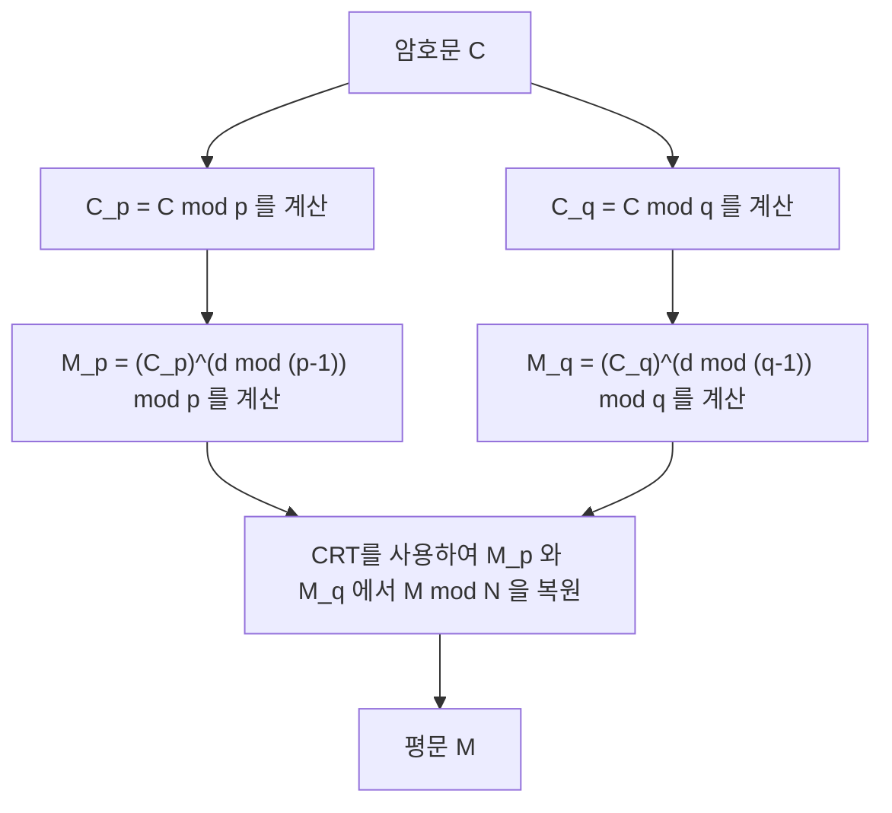

## 처음으로

중국인 나머지 정리([Chinese Remainder Theorem](https://kenji.blog/ko/p/chinese-remainder-theorem/), 줄여서 CRT)는 정수론에서 가장 중요하고 아름다운 정리 중 하나입니다. 그 기원은 3세기에서 5세기경에 편찬된 것으로 알려진 고대 중국의 수학서 '손자산경'으로까지 거슬러 올라갑니다. 고대의 소박한 산술 문제에서 시작된 이 정리는 수천 년이 지난 현대에 이르러서도 우리가 일상적으로 이용하는 인터넷의 안전한 통신을 지탱하는 **RSA 암호** 등의 공개키 암호 기술에서 필수불가결한 역할을 다하고 있습니다.

본 기사에서는 이 **중국인 나머지 정리** 에 대해, 그 역사적 배경부터 수학적인 엄밀한 정의, 구체적인 계산 절차, 그리고 현대 암호 이론에서의 응용까지를 도해와 구체적인 예를 섞어가며 자세히 해설합니다.

## 역사적 배경: 손자의 문제

중국인 나머지 정리의 뿌리는 '손자산경' 하권 제26문에 적혀 있는 다음과 같은 유명한 문제에 있습니다.

> "지금 개수를 모르는 물건이 있다. 3개씩 세면 2개가 남고, 5개씩 세면 3개가 남고, 7개씩 세면 2개가 남는다. 물건의 개수는 몇 개인가?"

이것을 현대 수학의 기표인 연립 합동식(시스템)을 사용하여 표현하면, 미지의 정수 $x$ 에 대해 다음과 같습니다.

$$
\begin{cases}
x \equiv 2 \pmod 3 \\
x \equiv 3 \pmod 5 \\
x \equiv 2 \pmod 7
\end{cases}
$$

이 문제의 해는 $x = 23$ 입니다. 손자산경에는 이 해를 도출하기 위한 구체적인 계산 절차도 제시되어 있으며, 이것이 중국인 나머지 정리의 구체적인 구성법의 첫 번째 예로 여겨집니다.

## 수학적 정의와 정리의 주장

현대 수학에서 **중국인 나머지 정리** 는 다음과 같이 정식화됩니다.

### 정리의 주장

서로소인 (최대공약수가 1인) $k$ 개의 양의 정수 $m_1, m_2, \dots, m_k$ 가 있다고 합시다. 즉, 임의의 $i \neq j$ 에 대해 $\gcd(m_i, m_j) = 1$ 이 성립합니다.

이때 임의의 정수 $a_1, a_2, \dots, a_k$ 에 대해, 다음의 연립 합동식을 만족하는 정수 $x$ 가 법(모듈로) $M = m_1 m_2 \dots m_k$ 에서 유일하게 존재합니다.

$$
\begin{cases}
x \equiv a_1 \pmod{m_1} \\
x \equiv a_2 \pmod{m_2} \\
\vdots \\
x \equiv a_k \pmod{m_k}
\end{cases}
$$

다시 말해 해 $x$ 는 $0 \leq x < M$ 의 범위에 오직 하나만 존재하며, 모든 해는 $x \equiv x_0 \pmod M$ 의 형태로 표현됩니다.

### 증명 및 구성법 (가우스의 알고리즘)

이 정리의 훌륭한 점은 단순히 해의 존재를 보장할 뿐만 아니라, 구체적인 해를 구성하는 알고리즘을 제공하고 있다는 것입니다. 아래에 그 구성법을 나타냅니다.

1. 전체의 곱 $M = m_1 m_2 \dots m_k$ 를 계산합니다.
2. 각 $i$ 에 대해 $M_i = \frac{M}{m_i}$ 를 계산합니다. ($M_i$ 는 $m_i$ 를 제외한 모든 법의 곱입니다)
3. $\gcd(M_i, m_i) = 1$ 이므로, 법 $m_i$ 에서 $M_i$ 의 곱셈 역원 $y_i$ 가 존재합니다. 즉, $M_i y_i \equiv 1 \pmod{m_i}$ 를 만족하는 $y_i$ 를 확장 [유클리드 호제법](https://kenji.blog/ko/p/euclidean-algorithm/) 등으로 구합니다.
4. 최종 해 $x$ 는 다음 식으로 주어집니다.

$$
x = \sum_{i=1}^{k} a_i M_i y_i \pmod M
$$

이 $x$ 가 원래의 연립 합동식을 만족한다는 것은, 각 $m_j$ 를 법으로 하여 $x$ 를 평가함으로써 쉽게 확인할 수 있습니다. $i \neq j$ 일 때 $M_i$ 는 $m_j$ 의 배수이므로 $M_i \equiv 0 \pmod{m_j}$ 가 됩니다. 따라서 합의 항 중에서 $i = j$ 인 항만이 남아 $x \equiv a_j M_j y_j \equiv a_j \cdot 1 \equiv a_j \pmod{m_j}$ 가 되며, 조건을 만족하게 됩니다.

## 구체적 예시를 통한 계산

앞서 언급한 "손자의 문제"를 이 알고리즘으로 풀어봅시다.

문제:
$x \equiv 2 \pmod 3$  (여기서 $a_1=2, m_1=3$)
$x \equiv 3 \pmod 5$  (여기서 $a_2=3, m_2=5$)
$x \equiv 2 \pmod 7$  (여기서 $a_3=2, m_3=7$)

**단계 1:** $M$ 의 계산
$M = 3 \times 5 \times 7 = 105$

**단계 2:** $M_i$ 의 계산
$M_1 = 105 / 3 = 35$
$M_2 = 105 / 5 = 21$
$M_3 = 105 / 7 = 15$

**단계 3:** 역원 $y_i$ 의 계산
- $35 y_1 \equiv 1 \pmod 3 \implies 2 y_1 \equiv 1 \pmod 3 \implies y_1 = 2$
- $21 y_2 \equiv 1 \pmod 5 \implies 1 y_2 \equiv 1 \pmod 5 \implies y_2 = 1$
- $15 y_3 \equiv 1 \pmod 7 \implies 1 y_3 \equiv 1 \pmod 7 \implies y_3 = 1$

**단계 4:** 해 $x$ 의 계산
$x = (2 \times 35 \times 2) + (3 \times 21 \times 1) + (2 \times 15 \times 1)$
$x = 140 + 63 + 30 = 233$

이것을 $M = 105$ 로 나눈 나머지를 구합니다.
$233 \equiv 23 \pmod{105}$

따라서 최소의 양의 해는 **23** 이 되며, 훌륭하게 손자의 해와 일치했습니다.

## 현대의 응용: RSA 암호와 CRT

고대의 퍼즐이었던 **중국인 나머지 정리** 는 현대의 디지털 사회에서 지극히 실용적인 용도를 가지고 있습니다. 그 대표적인 예가 **RSA 암호** 에서의 복호화 및 서명 생성의 고속화입니다.

### RSA 암호 개요

RSA 암호에서는 두 개의 거대한 소수 $p$ 와 $q$ 를 사용하여, 그 곱인 $N = pq$ 를 공개키의 일부로 합니다. 암호문 $C$ 로부터 평문 $M$ 을 복호화하는 계산은 비밀키 $d$ 를 사용하여 다음과 같이 이루어집니다.

$$
M = C^d \pmod N
$$

여기서 $N$ 은 매우 거대한 수(예: 2048비트)이고, $d$ 도 동등한 크기가 되기 때문에, 이 거듭제곱 잉여 계산에는 큰 계산 비용이 듭니다.

### CRT를 통한 고속화 (RSA-CRT)

여기서 **중국인 나머지 정리** 의 차례입니다. $N$ 을 법으로 하는 거대한 계산을 수행하는 대신, $N$ 의 소인수인 $p$ 와 $q$ 를 법으로 하는 두 개의 작은 계산으로 분할하고, 마지막에 CRT를 이용하여 원래의 해를 재구성하는 접근 방식을 취합니다.

구체적으로는 다음과 같은 절차를 거칩니다.



1. 비밀키로서 $d$ 대신, $d_p = d \pmod{p-1}$ 와 $d_q = d \pmod{q-1}$ 을 미리 계산해 둡니다.
2. 법 $p$ 와 법 $q$ 에 대한 복호화를 개별적으로 수행합니다.
   $M_p = C^{d_p} \pmod p$
   $M_q = C^{d_q} \pmod q$
3. $M_p$ 와 $M_q$ 에 대하여 CRT를 적용해, $M \pmod N$ 을 구합니다.

법이 절반의 비트 길이(예: 1024비트)가 되면, 거듭제곱 계산의 비용은 약 1/8이 됩니다. 이것을 2회 수행해도 전체 비용은 약 1/4이 되어, RSA-CRT를 이용함으로써 복호화나 서명 생성을 **약 4배 고속화** 할 수 있습니다. 스마트폰이나 IC 카드 등 계산 자원이 한정된 디바이스에서 이러한 고속화는 극히 중요합니다.

## 중국인 나머지 정리의 프로그래밍 구현

이론뿐만 아니라, 실제로 프로그램을 작성하여 **중국인 나머지 정리** 를 구현해 봅시다. 여기에서는 Python을 사용하여 가우스의 알고리즘을 구현합니다.

```python
def extended_gcd(a, b):
    """
    확장 유클리드 호제법
    a*x + b*y = gcd(a, b) 가 되는 (gcd(a, b), x, y) 를 반환
    """
    if a == 0:
        return b, 0, 1
    else:
        g, y, x = extended_gcd(b % a, a)
        return g, x - (b // a) * y, y

def mod_inverse(a, m):
    """
    법 m 에 대한 a 의 곱셈 역원을 반환
    """
    g, x, y = extended_gcd(a, m)
    if g != 1:
        raise Exception('모듈러 역원이 존재하지 않습니다')
    else:
        return x % m

def chinese_remainder_theorem(a_list, m_list):
    """
    중국인 나머지 정리 (CRT)
    x ≡ a_i (mod m_i) 를 만족하는 x 를 반환
    """
    total_m = 1
    for m in m_list:
        total_m *= m
        
    x = 0
    for a, m in zip(a_list, m_list):
        M_i = total_m // m
        y_i = mod_inverse(M_i, m)
        x += a * M_i * y_i
        
    return x % total_m

# 손자의 문제를 푼다
a = [2, 3, 2]
m = [3, 5, 7]
result = chinese_remainder_theorem(a, m)
print(f"손자의 문제의 해: {result}") # 출력: 23
```

이와 같이 단 몇 십 줄의 코드로 **중국인 나머지 정리** 를 컴퓨터 상에 재현할 수 있습니다. 이 구현은 경기 프로그래밍 등에서도 빈번하게 쓰이는 기본적인 알고리즘입니다.

## 추상 대수학에서의 일반화: 환과 이데알

**중국인 나머지 정리** 는 단순한 정수의 성질에 그치지 않고, 현대 수학의 중요한 분야인 **추상 대수학** 에서 더욱 일반적인 형태로 확장되고 있습니다.

가환환 $R$ 과 그 이데알 $I_1, I_2, \dots, I_k$ 를 생각해 봅시다. 이들 이데알이 서로소일 때(즉, 임의의 $i \neq j$ 에 대해 $I_i + I_j = R$ 이 성립할 때), 다음과 같은 자연스러운 환 준동형 사상 $\phi$ 를 정의할 수 있습니다.

$$
\phi: R \to (R/I_1) \times (R/I_2) \times \dots \times (R/I_k)
$$
$$
\phi(x) = (x \pmod{I_1}, x \pmod{I_2}, \dots, x \pmod{I_k})
$$

추상 대수학에서의 **중국인 나머지 정리** 는, 이 준동형 사상 $\phi$ 가 전사이며, 그 핵(커널)이 이데알의 교집합 $\bigcap_{i=1}^k I_i$ (이것은 이데알의 곱 $\prod_{i=1}^k I_i$ 과 일치합니다)이 됨을 주장하고 있습니다.

따라서 제1 동형 정리에 의해 다음의 자연스러운 동형이 성립합니다.

$$
R / \left( \bigcap_{i=1}^k I_i \right) \cong (R/I_1) \times (R/I_2) \times \dots \times (R/I_k)
$$

### 다항식환으로의 응용

이 일반화된 정리의 가장 중요한 응용 중 하나가, 체 $F$ 위의 1변수 다항식환 $F[x]$ 에서의 **중국인 나머지 정리** 입니다.

정수에서의 '서로소인 정수'는, 다항식환에 있어서는 '공통의 근을 갖지 않는 (최대공약다항식이 상수인) 다항식'에 해당합니다. 이 다항식 버전의 CRT는 라그랑주 보간([Lagrange](https://kenji.blog/ko/p/lagrange/) interpolation)의 이론적 뒷받침이 되며, 주어진 여러 점을 지나는 최소 차수의 다항식을 유일하게 결정하는 알고리즘과 완전히 일치합니다. 또한 이는 오류 정정 부호의 일종인 **리드-솔로몬 부호** 의 수학적 기반이기도 합니다.

## 잉여 수계(RNS)를 통한 초병렬 계산

**중국인 나머지 정리** 의 공학적인 응용으로서 **잉여 수계 (Residue Number System, RNS)** 에 대해서도 언급해 둡시다.

보통 컴퓨터는 수치를 2진수로 표현하고 계산을 수행합니다. 그러나 덧셈이나 곱셈을 할 때, 자리올림(캐리)의 전파가 발생하기 때문에 비트 폭이 커지면 회로의 지연이 증대한다는 문제가 있습니다.

RNS에서는 서로소인 법들의 집합 $\{m_1, m_2, \dots, m_k\}$ 를 준비하고, 거대한 정수 $X$ 를 각각의 법으로 나눈 나머지의 쌍 $(x_1, x_2, \dots, x_k)$ 으로써 표현합니다.

이 표현의 최대의 이점은 가산과 승산에서 **자리올림이 발생하지 않는다** 는 것입니다.
예를 들어 $X$ 와 $Y$ 를 더할 경우, 각 법마다 독립적으로 계산을 수행할 수 있습니다.

$$
X + Y \leftrightarrow ( (x_1+y_1)\pmod{m_1}, \dots, (x_k+y_k)\pmod{m_k} )
$$
$$
X \times Y \leftrightarrow ( (x_1y_1)\pmod{m_1}, \dots, (x_k y_k)\pmod{m_k} )
$$

각 법에서의 계산은 완전히 독립되어 있으므로, 병렬 회로를 구성함으로써 극히 고속의 연산이 가능해집니다. 최종적인 결과를 통상의 수치로 되돌릴 때 바로 **중국인 나머지 정리** 가 사용됩니다. 이 기술은 실시간성이 요구되는 디지털 신호 처리(DSP)나 특정한 암호 처리 회로의 설계에 있어서 현재도 연구되며 실용화되고 있습니다.

## 요약

**중국인 나머지 정리** 는 단순한 수학 퍼즐에서 시작하여 추상 대수학의 이데알 구조 정리로 승화하고, 이어서 현대 암호 이론과 컴퓨터 과학의 기반 기술로 발전해 왔습니다.

수천 년의 시간을 넘어, 고대 중국 수학자들의 지혜가 우리 스마트폰 속 암호 처리로서 계속 살아 숨쉬고 있다는 것은, 수학이라는 학문이 가진 보편성과 강인함을 상징하고 있다고 말할 수 있을 것입니다.
