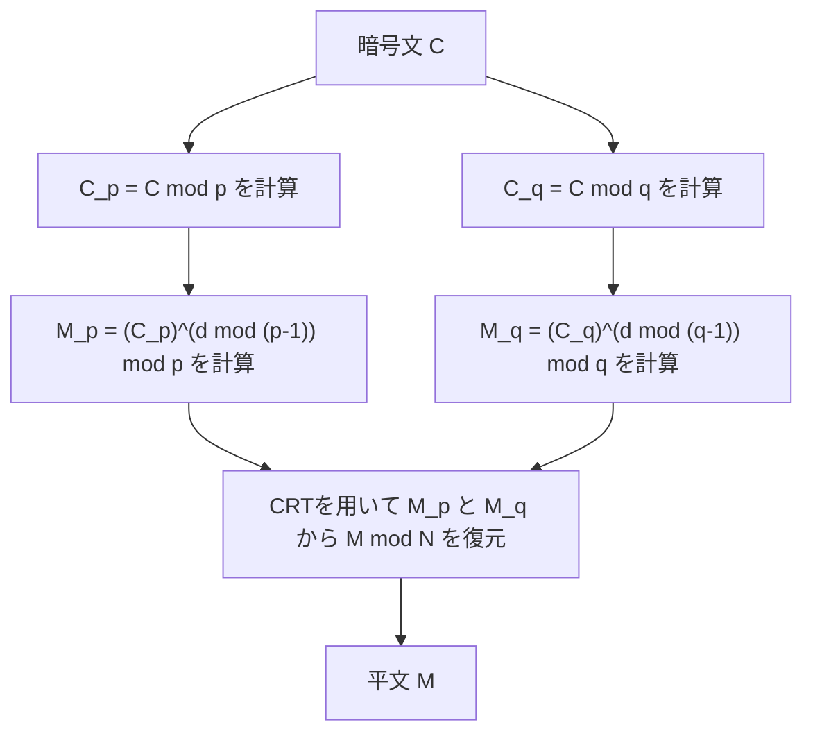

## はじめに

中国剰余定理（Chinese Remainder Theorem、略してCRT）は、整数論における最も重要で美しい定理の一つです。その起源は、3世紀から5世紀頃に編纂されたとされる古代中国の数学書『孫子算経』にまで遡ります。古代の素朴な算術の問題から始まったこの定理は、数千年を経た現代において、私たちが日常的に利用しているインターネットの安全な通信を支える **RSA暗号** などの公開鍵暗号技術において、必要不可欠な役割を果たしています。

本記事では、この **中国剰余定理** について、その歴史的背景から数学的な厳密な定義、具体的な計算手順、そして現代の暗号理論における応用までを、図解や具体例を交えながら詳しく解説します。

## 歴史的背景：孫子の問題

中国剰余定理のルーツは、『孫子算経』の下巻第26問に記されている以下の有名な問題にあります。

> 「今有物不知其數、三三數之賸二、五五數之賸三、七七數之賸二。問物幾何？」
> （今、数がわからない物がある。3つずつ数えると2余り、5つずつ数えると3余り、7つずつ数えると2余る。物の数はいくつか？）

これを現代の数学の記法である連立合同式（システム）を用いて表現すると、未知の整数 $x$ について以下のようになります。

$$
\begin{cases}
x \equiv 2 \pmod 3 \\
x \equiv 3 \pmod 5 \\
x \equiv 2 \pmod 7
\end{cases}
$$

この問題の解は $x = 23$ です。孫子算経には、この解を導き出すための具体的な計算手順も示されており、これが中国剰余定理の具体的な構成法の最初の例とされています。

## 数学的な定義と定理の主張

現代の数学において、 **中国剰余定理** は次のように定式化されます。

### 定理の主張

互いに素な（最大公約数が1である） $k$ 個の正の整数 $m_1, m_2, \dots, m_k$ があるとします。つまり、任意の $i \neq j$ について $\gcd(m_i, m_j) = 1$ が成り立ちます。

このとき、任意の整数 $a_1, a_2, \dots, a_k$ に対して、以下の連立合同式を満たす整数 $x$ が、モジュロ $M = m_1 m_2 \dots m_k$ において一意に存在します。

$$
\begin{cases}
x \equiv a_1 \pmod{m_1} \\
x \equiv a_2 \pmod{m_2} \\
\vdots \\
x \equiv a_k \pmod{m_k}
\end{cases}
$$

つまり、解 $x$ は $0 \leq x < M$ の範囲にただ一つ存在し、すべての解は $x \equiv x_0 \pmod M$ の形で表されます。

### 証明と構成法（ガウスのアルゴリズム）

この定理の素晴らしい点は、単に解の存在を保証するだけでなく、具体的な解を構成するアルゴリズムを提供していることです。以下にその構成法を示します。

1. 全体の積 $M = m_1 m_2 \dots m_k$ を計算します。
2. 各 $i$ について、$M_i = \frac{M}{m_i}$ を計算します。（ $M_i$ は $m_i$ 以外のすべてのモジュラの積です）
3. $\gcd(M_i, m_i) = 1$ であるため、モジュロ $m_i$ における $M_i$ の乗法逆元 $y_i$ が存在します。すなわち、$M_i y_i \equiv 1 \pmod{m_i}$ を満たす $y_i$ を拡張ユークリッドの互除法などで求めます。
4. 最終的な解 $x$ は次の式で与えられます。

$$
x = \sum_{i=1}^{k} a_i M_i y_i \pmod M
$$

この $x$ が元の連立合同式を満たすことは、各 $m_j$ を法として $x$ を評価することで容易に確認できます。$i \neq j$ のとき、$M_i$ は $m_j$ の倍数なので $M_i \equiv 0 \pmod{m_j}$ となります。したがって、和の項の中で $i = j$ の項だけが残り、$x \equiv a_j M_j y_j \equiv a_j \cdot 1 \equiv a_j \pmod{m_j}$ となり、条件を満たします。

## 具体例での計算

先ほどの「孫子の問題」をこのアルゴリズムで解いてみましょう。

問題：
$x \equiv 2 \pmod 3$  (ここで $a_1=2, m_1=3$)
$x \equiv 3 \pmod 5$  (ここで $a_2=3, m_2=5$)
$x \equiv 2 \pmod 7$  (ここで $a_3=2, m_3=7$)

**ステップ1：** $M$ の計算
$M = 3 \times 5 \times 7 = 105$

**ステップ2：** $M_i$ の計算
$M_1 = 105 / 3 = 35$
$M_2 = 105 / 5 = 21$
$M_3 = 105 / 7 = 15$

**ステップ3：** 逆元 $y_i$ の計算
- $35 y_1 \equiv 1 \pmod 3 \implies 2 y_1 \equiv 1 \pmod 3 \implies y_1 = 2$
- $21 y_2 \equiv 1 \pmod 5 \implies 1 y_2 \equiv 1 \pmod 5 \implies y_2 = 1$
- $15 y_3 \equiv 1 \pmod 7 \implies 1 y_3 \equiv 1 \pmod 7 \implies y_3 = 1$

**ステップ4：** 解 $x$ の計算
$x = (2 \times 35 \times 2) + (3 \times 21 \times 1) + (2 \times 15 \times 1)$
$x = 140 + 63 + 30 = 233$

これを $M = 105$ で割った余りを求めます。
$233 \equiv 23 \pmod{105}$

よって、最小の正の解は **23** となり、見事に孫子の解と一致しました。

## 現代における応用：RSA暗号とCRT

古代のパズルであった **中国剰余定理** は、現代のデジタル社会において極めて実用的な用途を持っています。その代表例が **RSA暗号** における復号・署名生成の高速化です。

### RSA暗号の概要

RSA暗号では、2つの大きな素数 $p$ と $q$ を用い、その積 $N = pq$ を公開鍵の一部とします。暗号文 $C$ から平文 $M$ を復号する計算は、秘密鍵 $d$ を用いて次のように行われます。

$$
M = C^d \pmod N
$$

ここで、$N$ は非常に巨大な数（例えば2048ビット）であり、$d$ も同程度の大きさになるため、このべき乗剰余計算には大きな計算コストがかかります。

### CRTによる高速化（RSA-CRT）

ここで **中国剰余定理** の出番です。$N$ を法とする巨大な計算を行う代わりに、$N$ の素因数である $p$ と $q$ を法とする2つの小さな計算に分割し、最後にCRTを用いて元の解を再構成するというアプローチをとります。

具体的には以下の手順を踏みます。



1. 秘密鍵として $d$ の代わりに、$d_p = d \pmod{p-1}$ と $d_q = d \pmod{q-1}$ をあらかじめ計算しておきます。
2. モジュロ $p$ とモジュロ $q$ での復号を個別に行います。
   $M_p = C^{d_p} \pmod p$
   $M_q = C^{d_q} \pmod q$
3. $M_p$ と $M_q$ に対してCRTを適用し、$M \pmod N$ を求めます。

法が半分のビット長（例えば1024ビット）になると、べき乗計算のコストは約1/8になります。これを2回行っても全体のコストは約1/4となり、RSA-CRTを利用することで復号や署名生成を **約4倍高速化** することができます。スマートフォンやICカードなどの計算資源が限られたデバイスにおいて、この高速化は極めて重要です。

## 中国剰余定理のプログラミングによる実装

理論だけでなく、実際にプログラムを書いて **中国剰余定理** を実装してみましょう。ここでは、Pythonを用いてガウスのアルゴリズムを実装します。

```python
def extended_gcd(a, b):
    """
    拡張ユークリッドの互除法
    a*x + b*y = gcd(a, b) となる (gcd(a, b), x, y) を返す
    """
    if a == 0:
        return b, 0, 1
    else:
        g, y, x = extended_gcd(b % a, a)
        return g, x - (b // a) * y, y

def mod_inverse(a, m):
    """
    モジュロ m における a の乗法逆元を返す
    """
    g, x, y = extended_gcd(a, m)
    if g != 1:
        raise Exception('モジュラー逆元が存在しません')
    else:
        return x % m

def chinese_remainder_theorem(a_list, m_list):
    """
    中国剰余定理 (CRT)
    x ≡ a_i (mod m_i) を満たす x を返す
    """
    total_m = 1
    for m in m_list:
        total_m *= m
        
    x = 0
    for a, m in zip(a_list, m_list):
        M_i = total_m // m
        y_i = mod_inverse(M_i, m)
        x += a * M_i * y_i
        
    return x % total_m

# 孫子の問題を解く
a = [2, 3, 2]
m = [3, 5, 7]
result = chinese_remainder_theorem(a, m)
print(f"孫子の問題の解: {result}") # 出力: 23
```

このように、わずか数十行のコードで **中国剰余定理** をコンピュータ上で再現することができます。この実装は、競技プログラミングなどでも頻繁に用いられる基本的なアルゴリズムです。

## 抽象代数学における一般化：環とイデアル

**中国剰余定理** は、単なる整数の性質にとどまらず、現代数学の重要な分野である **抽象代数学** において、より一般的な形で拡張されています。

可換環 $R$ とそのイデアル $I_1, I_2, \dots, I_k$ を考えます。これらのイデアルが互いに素である（すなわち、任意の $i \neq j$ に対して $I_i + I_j = R$ が成り立つ）とき、以下のような自然な環準同型写像 $\phi$ を定義することができます。

$$
\phi: R \to (R/I_1) \times (R/I_2) \times \dots \times (R/I_k)
$$
$$
\phi(x) = (x \pmod{I_1}, x \pmod{I_2}, \dots, x \pmod{I_k})
$$

抽象代数学における **中国剰余定理** は、この準同型写像 $\phi$ が全射であり、その核（カーネル）がイデアルの交わり $\bigcap_{i=1}^k I_i$ （これはイデアルの積 $\prod_{i=1}^k I_i$ と一致します）になることを主張しています。

したがって、第一同型定理により、以下の自然な同型が成り立ちます。

$$
R / \left( \bigcap_{i=1}^k I_i \right) \cong (R/I_1) \times (R/I_2) \times \dots \times (R/I_k)
$$

### 多項式環への応用

この一般化された定理の最も重要な応用の一つが、体 $F$ 上の1変数多項式環 $F[x]$ における **中国剰余定理** です。

整数の場合の「互いに素な整数」は、多項式環においては「共通の根を持たない（最大公約多項式が定数である）多項式」に相当します。この多項式版のCRTは、ラグランジュ補間（Lagrange interpolation）の理論的裏付けとなっており、与えられた複数の点を通る最小次数の多項式を一意に決定するアルゴリズムと完全に一致します。また、これは誤り訂正符号の一種である **リード・ソロモン符号** の数学的基盤でもあります。

## 剰余数系（RNS）による超並列計算

**中国剰余定理** の工学的な応用として、 **剰余数系（Residue Number System, RNS）** についても触れておきましょう。

通常、コンピュータは数値を2進数で表現し、計算を行います。しかし、加算や乗算を行う際、桁上がり（キャリー）の伝播が発生するため、ビット幅が大きくなると回路の遅延が増大するという問題があります。

RNSでは、互いに素なモジュロのセット $\{m_1, m_2, \dots, m_k\}$ を用意し、巨大な整数 $X$ をそれぞれのモジュロで割った余りの組 $(x_1, x_2, \dots, x_k)$ として表現します。

この表現の最大の利点は、加算と乗算において **桁上がりが生じない** ことです。
例えば、$X$ と $Y$ を足す場合、各モジュロごとに独立して計算を行うことができます。

$$
X + Y \leftrightarrow ( (x_1+y_1)\pmod{m_1}, \dots, (x_k+y_k)\pmod{m_k} )
$$
$$
X \times Y \leftrightarrow ( (x_1y_1)\pmod{m_1}, \dots, (x_k y_k)\pmod{m_k} )
$$

各モジュロでの計算は完全に独立しているため、並列回路を組むことで極めて高速な演算が可能になります。最終的な結果を通常の数値に戻す際に、まさに **中国剰余定理** が用いられます。この技術は、リアルタイム性が求められるデジタル信号処理（DSP）や、特定の暗号処理回路の設計において現在でも研究され、実用化されています。

## まとめ

**中国剰余定理** は、単なる数学のパズルから始まり、抽象代数学におけるイデアルの構造定理へと昇華し、そして現代の暗号理論や計算機科学の基盤技術へと発展してきました。

数千年の時を超えて、古代中国の数学者の知恵が私たちのスマートフォンの中の暗号処理として生き続けているというのは、数学という学問の持つ普遍性と力強さを象徴していると言えるでしょう。
