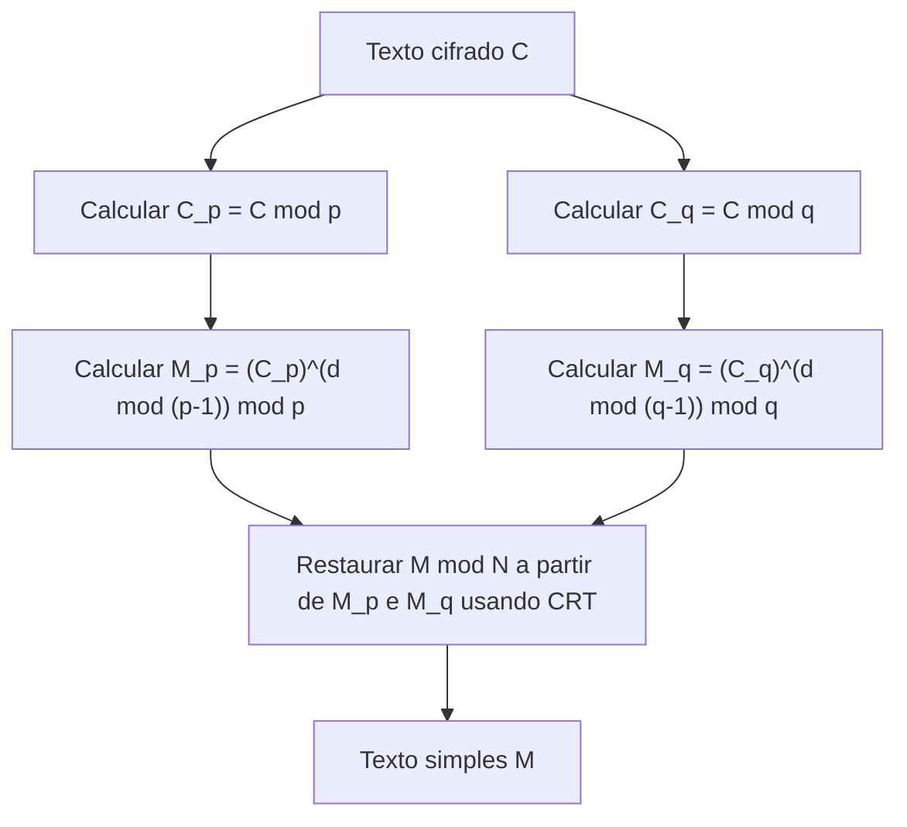

## Introdução

O Teorema Chinês do Resto ([Chinese Remainder Theorem](https://kenji.blog/pt/p/chinese-remainder-theorem/), abreviado CRT) é um dos teoremas mais importantes e belos da teoria dos números. As suas origens remontam ao "Sunzi Suanjing", um antigo livro de matemática chinês compilado entre os séculos III e V. Este teorema, que começou com simples problemas aritméticos na antiguidade, desempenha hoje, milhares de anos depois, um papel essencial nas tecnologias de criptografia de chave pública, como a **Criptografia [RSA](https://kenji.blog/pt/p/modern-cryptography-public-key-hash-signature/)**, que suportam as comunicações seguras na internet que utilizamos diariamente.

Neste artigo, explicaremos detalhadamente este **Teorema Chinês do Resto**, desde o seu contexto histórico, definições matemáticas rigorosas e procedimentos de cálculo específicos, até às suas aplicações na teoria da criptografia moderna, acompanhados de diagramas e exemplos concretos.

## Contexto Histórico: O Problema de Sunzi

As raízes do Teorema Chinês do Resto encontram-se no seguinte famoso problema, registado na 26ª questão do volume inferior de "Sunzi Suanjing".

> "Temos agora algumas coisas de número desconhecido. Se as contarmos de três em três, sobram duas; se de cinco em cinco, sobram três; se de sete em sete, sobram duas. Qual é o número de coisas?"

Expressando isto utilizando o sistema de congruências da notação matemática moderna, para um inteiro desconhecido $x$, temos o seguinte:

$$
\begin{cases}
x \equiv 2 \pmod 3 \\
x \equiv 3 \pmod 5 \\
x \equiv 2 \pmod 7
\end{cases}
$$

A solução deste problema é $x = 23$. "Sunzi Suanjing" também fornece o procedimento de cálculo específico para derivar esta solução, o que é considerado o primeiro exemplo de um método de construção para o Teorema Chinês do Resto.

## Definição Matemática e o Enunciado do Teorema

Na matemática moderna, o **Teorema Chinês do Resto** é formulado da seguinte forma.

### Enunciado do Teorema

Suponhamos que temos $k$ inteiros positivos $m_1, m_2, \dots, m_k$ que são primos entre si (o seu máximo divisor comum é 1). Ou seja, para qualquer $i \neq j$, verifica-se $\gcd(m_i, m_j) = 1$.

Então, para quaisquer inteiros $a_1, a_2, \dots, a_k$, existe um único inteiro $x$, módulo $M = m_1 m_2 \dots m_k$, que satisfaz o seguinte sistema de congruências.

$$
\begin{cases}
x \equiv a_1 \pmod{m_1} \\
x \equiv a_2 \pmod{m_2} \\
\vdots \\
x \equiv a_k \pmod{m_k}
\end{cases}
$$

Por outras palavras, a solução $x$ existe e é única no intervalo $0 \leq x < M$, e todas as soluções podem ser expressas na forma $x \equiv x_0 \pmod M$.

### Prova e Método de Construção (Algoritmo de Gauss)

O ponto brilhante deste teorema é que não só garante a existência da solução, mas também fornece um algoritmo para construir a solução específica. O método de construção é mostrado abaixo.

1. Calcule o produto total $M = m_1 m_2 \dots m_k$.
2. Para cada $i$, calcule $M_i = \frac{M}{m_i}$. ($M_i$ é o produto de todos os módulos exceto $m_i$)
3. Como $\gcd(M_i, m_i) = 1$, existe o inverso multiplicativo $y_i$ de $M_i$ módulo $m_i$. Ou seja, encontramos o $y_i$ que satisfaz $M_i y_i \equiv 1 \pmod{m_i}$ utilizando o algoritmo euclidiano estendido, etc.
4. A solução final $x$ é dada pela seguinte fórmula.

$$
x = \sum_{i=1}^{k} a_i M_i y_i \pmod M
$$

O facto de este $x$ satisfazer o sistema original de congruências pode ser facilmente verificado avaliando $x$ em cada módulo $m_j$. Quando $i \neq j$, $M_i$ é um múltiplo de $m_j$, logo $M_i \equiv 0 \pmod{m_j}$. Portanto, na soma, apenas resta o termo $i = j$, e $x \equiv a_j M_j y_j \equiv a_j \cdot 1 \equiv a_j \pmod{m_j}$, satisfazendo a condição.

## Cálculo com um Exemplo Concreto

Vamos resolver o "Problema de Sunzi" usando este algoritmo.

Problema:
$x \equiv 2 \pmod 3$  (onde $a_1=2, m_1=3$)
$x \equiv 3 \pmod 5$  (onde $a_2=3, m_2=5$)
$x \equiv 2 \pmod 7$  (onde $a_3=2, m_3=7$)

**Passo 1:** Cálculo de $M$
$M = 3 \times 5 \times 7 = 105$

**Passo 2:** Cálculo de $M_i$
$M_1 = 105 / 3 = 35$
$M_2 = 105 / 5 = 21$
$M_3 = 105 / 7 = 15$

**Passo 3:** Cálculo dos inversos $y_i$
- $35 y_1 \equiv 1 \pmod 3 \implies 2 y_1 \equiv 1 \pmod 3 \implies y_1 = 2$
- $21 y_2 \equiv 1 \pmod 5 \implies 1 y_2 \equiv 1 \pmod 5 \implies y_2 = 1$
- $15 y_3 \equiv 1 \pmod 7 \implies 1 y_3 \equiv 1 \pmod 7 \implies y_3 = 1$

**Passo 4:** Cálculo da solução $x$
$x = (2 \times 35 \times 2) + (3 \times 21 \times 1) + (2 \times 15 \times 1)$
$x = 140 + 63 + 30 = 233$

Encontramos o resto disto dividindo por $M = 105$.
$233 \equiv 23 \pmod{105}$

Assim, a menor solução positiva é **23**, coincidindo perfeitamente com a solução de Sunzi.

## Aplicações Modernas: Criptografia RSA e CRT

O que era um antigo quebra-cabeças, o **Teorema Chinês do Resto**, tem usos extremamente práticos na sociedade digital moderna. Um exemplo principal é a aceleração da decifragem e geração de assinaturas na **Criptografia RSA**.

### Resumo da Criptografia RSA

Na Criptografia RSA, utilizam-se dois grandes números primos $p$ e $q$, e o seu produto $N = pq$ faz parte da chave pública. O cálculo para decifrar o texto cifrado $C$ no texto simples $M$ é feito usando a chave privada $d$ da seguinte forma.

$$
M = C^d \pmod N
$$

Aqui, como $N$ é um número enorme (por exemplo, 2048 bits) e $d$ é de dimensão semelhante, esta exponenciação modular envolve um elevado custo computacional.

### Aceleração com CRT (RSA-CRT)

Eis que entra em cena o **Teorema Chinês do Resto**. Em vez de realizar um enorme cálculo de módulo $N$, a abordagem passa por o dividir em dois pequenos cálculos usando os fatores primos $p$ e $q$ de $N$ como módulos e, finalmente, reconstruir a solução original usando o CRT.

Especificamente, seguimos as etapas abaixo.



1. Como chave privada, em vez de $d$, pré-calculamos $d_p = d \pmod{p-1}$ e $d_q = d \pmod{q-1}$.
2. A decifragem no módulo $p$ e módulo $q$ é feita de forma independente.
   $M_p = C^{d_p} \pmod p$
   $M_q = C^{d_q} \pmod q$
3. O CRT é aplicado a $M_p$ e $M_q$ para obter $M \pmod N$.

Quando o módulo fica com metade do tamanho em bits (por exemplo, 1024 bits), o custo do cálculo da exponenciação diminui para cerca de 1/8. Fazer isto duas vezes resulta num custo total de cerca de 1/4; logo, o uso de [RSA](https://kenji.blog/pt/p/modern-cryptography-public-key-hash-signature/)-CRT pode tornar a decifragem e a geração de assinaturas **cerca de 4 vezes mais rápidas**. Em dispositivos com recursos computacionais limitados, como smartphones ou cartões inteligentes, esta aceleração é crucial.

## Implementação em Programação do Teorema Chinês do Resto

Além da teoria, vamos escrever código para implementar o **Teorema Chinês do Resto**. Aqui, implementaremos o algoritmo de Gauss usando Python.

```python
def extended_gcd(a, b):
    """
    Algoritmo Euclidiano Estendido
    Retorna (gcd(a, b), x, y) tal que a*x + b*y = gcd(a, b)
    """
    if a == 0:
        return b, 0, 1
    else:
        g, y, x = extended_gcd(b % a, a)
        return g, x - (b // a) * y, y

def mod_inverse(a, m):
    """
    Retorna o inverso multiplicativo de a módulo m
    """
    g, x, y = extended_gcd(a, m)
    if g != 1:
        raise Exception('O inverso modular não existe')
    else:
        return x % m

def chinese_remainder_theorem(a_list, m_list):
    """
    Teorema Chinês do Resto (CRT)
    Retorna x que satisfaz x ≡ a_i (mod m_i)
    """
    total_m = 1
    for m in m_list:
        total_m *= m
        
    x = 0
    for a, m in zip(a_list, m_list):
        M_i = total_m // m
        y_i = mod_inverse(M_i, m)
        x += a * M_i * y_i
        
    return x % total_m

# Resolvendo o problema de Sunzi
a = [2, 3, 2]
m = [3, 5, 7]
result = chinese_remainder_theorem(a, m)
print(f"Solução para o problema de Sunzi: {result}") # Saída: 23
```

Deste modo, com apenas algumas dezenas de linhas de código, é possível reproduzir o **Teorema Chinês do Resto** num computador. Esta implementação é um algoritmo básico frequentemente utilizado, inclusive, em programação competitiva.

## Generalização em Álgebra Abstrata: Anéis e Ideais

O **Teorema Chinês do Resto** não se limita a simples propriedades de números inteiros, tendo sido expandido para formas mais gerais na **Álgebra Abstrata**, uma área importante da matemática moderna.

Consideremos um anel comutativo $R$ e os seus ideais $I_1, I_2, \dots, I_k$. Quando estes ideais são co-primos (isto é, para qualquer $i \neq j$, $I_i + I_j = R$), podemos definir o seguinte homomorfismo de anel natural $\phi$.

$$
\phi: R \to (R/I_1) \times (R/I_2) \times \dots \times (R/I_k)
$$
$$
\phi(x) = (x \pmod{I_1}, x \pmod{I_2}, \dots, x \pmod{I_k})
$$

O **Teorema Chinês do Resto** na álgebra abstrata afirma que este homomorfismo $\phi$ é sobrejetivo, e o seu núcleo (kernel) é a interseção dos ideais $\bigcap_{i=1}^k I_i$ (que coincide com o produto dos ideais $\prod_{i=1}^k I_i$).

Portanto, de acordo com o Primeiro Teorema do Isomorfismo, o seguinte isomorfismo natural é válido.

$$
R / \left( \bigcap_{i=1}^k I_i \right) \cong (R/I_1) \times (R/I_2) \times \dots \times (R/I_k)
$$

### Aplicação aos Anéis de Polinómios

Uma das aplicações mais importantes deste teorema generalizado é o **Teorema Chinês do Resto** no anel de polinómios de uma variável $F[x]$ sobre o corpo $F$.

"Inteiros coprimos" no caso dos números inteiros correspondem a "polinómios sem raízes comuns (o máximo divisor comum polinomial é constante)" no anel de polinómios. Esta versão polinomial do CRT é o suporte teórico da interpolação de [Lagrange](https://kenji.blog/pt/p/lagrange/), e é completamente equivalente ao algoritmo que determina exclusivamente um polinómio do menor grau possível que passa por múltiplos pontos dados. Sendo também a base matemática para o **Código de Reed-Solomon**, que é um tipo de código corretor de erros.

## Computação Massivamente Paralela Baseada no Sistema de Resíduos Numéricos (RNS)

Como aplicação de engenharia do **Teorema Chinês do Resto**, falemos também do **Sistema de Resíduos Numéricos (Residue Number System, RNS)**.

Tipicamente, os computadores representam números e efetuam cálculos utilizando a base binária (sistema binário). Contudo, ao realizar adições ou multiplicações, ocorre propagação de transporte (carry). Assim, se a largura do bit for grande, o atraso no circuito aumenta, o que é um problema.

No RNS, é preparado um conjunto de módulos mutuamente primos $\{m_1, m_2, \dots, m_k\}$, e um inteiro gigante $X$ é representado como um conjunto de restos $(x_1, x_2, \dots, x_k)$ divididos por cada módulo.

A maior vantagem desta representação é que **não ocorrem transportes (carry)** na adição e multiplicação.
Por exemplo, ao somar $X$ e $Y$, os cálculos podem ser feitos independentemente para cada módulo.

$$
X + Y \leftrightarrow ( (x_1+y_1)\pmod{m_1}, \dots, (x_k+y_k)\pmod{m_k} )
$$
$$
X \times Y \leftrightarrow ( (x_1y_1)\pmod{m_1}, \dots, (x_k y_k)\pmod{m_k} )
$$

Como a computação em cada módulo é completamente independente, a montagem de um circuito paralelo possibilita operações computacionais extremamente rápidas. Ao converter o resultado final de volta a um número normal, utiliza-se precisamente o **Teorema Chinês do Resto**. Atualmente, esta tecnologia ainda é estudada e aplicada em processamentos digitais de sinais (DSP) que exigem processamento em tempo real, ou na conceção de determinados circuitos de processamento criptográfico.

## Resumo

O **Teorema Chinês do Resto** começou por ser um mero quebra-cabeças matemático, elevou-se a um teorema estrutural de ideais na álgebra abstrata, e depois transformou-se numa tecnologia fundacional das modernas teorias da criptografia e ciência da computação.

Milhares de anos mais tarde, a sabedoria dos antigos matemáticos chineses continua a viver como processamento criptográfico nos nossos smartphones, o que pode ser considerado um símbolo da universalidade e força da matemática como disciplina de estudo.
