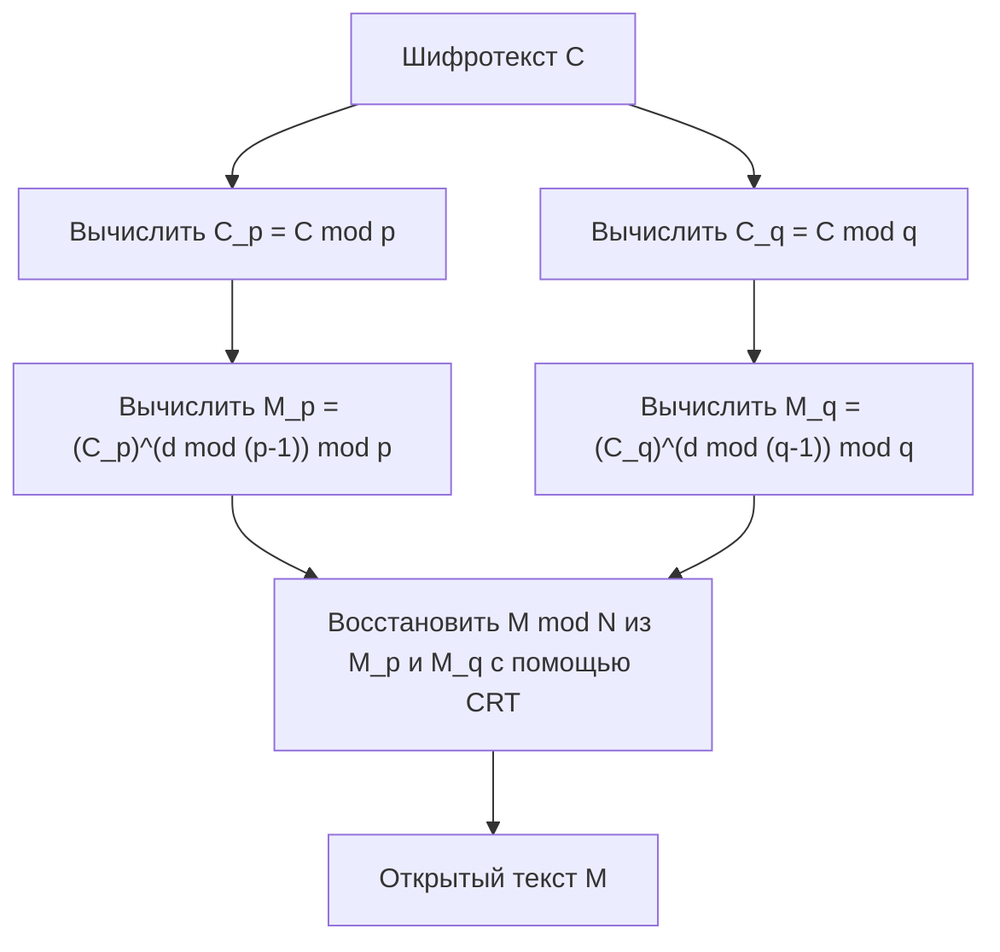

## Введение

Китайская теорема об остатках (Chinese Remainder Theorem, сокращенно CRT) — одна из самых важных и красивых теорем в теории чисел. Её истоки восходят к древнекитайскому математическому трактату «Сунь-цзы суаньцзин», составленному примерно в III-V веках. Эта теорема, начавшаяся с простой древней арифметической задачи, спустя тысячелетия играет незаменимую роль в технологиях криптографии с открытым ключом, таких как **RSA криптография**, обеспечивая безопасность повседневных коммуникаций в интернете.

В этой статье мы подробно рассмотрим **Китайскую теорему об остатках**, начиная с её исторического контекста и строгого математического определения до конкретных алгоритмов вычисления и применений в современной криптографии, с использованием иллюстраций и примеров.

## Исторический контекст: Задача Сунь-цзы

Корни Китайской теоремы об остатках лежат в известной задаче, описанной в 26-м вопросе нижнего тома «Сунь-цзы суаньцзин».

> «Имеются вещи, число которых неизвестно. Если считать тройками, остаётся две. Если считать пятёрками, остаётся три. Если считать семёрками, остаётся две. Спрашивается: сколько всего вещей?»

Если выразить это с помощью современной математической нотации (системы линейных сравнений), то для неизвестного целого числа $x$ мы получим следующее:

$$
\begin{cases}
x \equiv 2 \pmod 3 \\
x \equiv 3 \pmod 5 \\
x \equiv 2 \pmod 7
\end{cases}
$$

Решением этой задачи является $x = 23$. В «Сунь-цзы суаньцзин» также приведен конкретный алгоритм вычисления для нахождения этого решения, что считается первым историческим примером конструктивного метода для Китайской теоремы об остатках.

## Математическое определение и формулировка теоремы

В современной математике **Китайская теорема об остатках** формулируется следующим образом.

### Формулировка теоремы

Предположим, дано $k$ попарно взаимно простых (наибольший общий делитель которых равен 1) положительных целых чисел $m_1, m_2, \dots, m_k$. То есть, для любых $i \neq j$ выполняется $\gcd(m_i, m_j) = 1$.

Тогда для любых целых чисел $a_1, a_2, \dots, a_k$ существует единственное по модулю $M = m_1 m_2 \dots m_k$ целое число $x$, удовлетворяющее следующей системе сравнений:

$$
\begin{cases}
x \equiv a_1 \pmod{m_1} \\
x \equiv a_2 \pmod{m_2} \\
\vdots \\
x \equiv a_k \pmod{m_k}
\end{cases}
$$

Иными словами, решение $x$ единственно в диапазоне $0 \leq x < M$, и все решения имеют вид $x \equiv x_0 \pmod M$.

### Доказательство и конструктивный метод (Алгоритм Гаусса)

Замечательная особенность этой теоремы в том, что она не только гарантирует существование решения, но и предоставляет конкретный алгоритм для его нахождения. Ниже описан этот метод.

1. Вычисляется общее произведение $M = m_1 m_2 \dots m_k$.
2. Для каждого $i$ вычисляется $M_i = \frac{M}{m_i}$. ($M_i$ — это произведение всех модулей, кроме $m_i$).
3. Поскольку $\gcd(M_i, m_i) = 1$, существует мультипликативно обратное значение $y_i$ для $M_i$ по модулю $m_i$. А именно, находится $y_i$, удовлетворяющее $M_i y_i \equiv 1 \pmod{m_i}$, с помощью расширенного алгоритма Евклида.
4. Итоговое решение $x$ задаётся следующей формулой:

$$
x = \sum_{i=1}^{k} a_i M_i y_i \pmod M
$$

То, что это $x$ удовлетворяет исходной системе сравнений, легко проверить, вычислив $x$ по модулю каждого $m_j$. При $i \neq j$, $M_i$ кратно $m_j$, следовательно, $M_i \equiv 0 \pmod{m_j}$. Поэтому в сумме остается только член для $i = j$, что дает $x \equiv a_j M_j y_j \equiv a_j \cdot 1 \equiv a_j \pmod{m_j}$, удовлетворяя условиям.

## Пример вычисления

Давайте решим вышеописанную «Задачу Сунь-цзы» с помощью этого алгоритма.

Задача:
$x \equiv 2 \pmod 3$  (Здесь $a_1=2, m_1=3$)
$x \equiv 3 \pmod 5$  (Здесь $a_2=3, m_2=5$)
$x \equiv 2 \pmod 7$  (Здесь $a_3=2, m_3=7$)

**Шаг 1:** Вычисление $M$
$M = 3 \times 5 \times 7 = 105$

**Шаг 2:** Вычисление $M_i$
$M_1 = 105 / 3 = 35$
$M_2 = 105 / 5 = 21$
$M_3 = 105 / 7 = 15$

**Шаг 3:** Вычисление обратных элементов $y_i$
- $35 y_1 \equiv 1 \pmod 3 \implies 2 y_1 \equiv 1 \pmod 3 \implies y_1 = 2$
- $21 y_2 \equiv 1 \pmod 5 \implies 1 y_2 \equiv 1 \pmod 5 \implies y_2 = 1$
- $15 y_3 \equiv 1 \pmod 7 \implies 1 y_3 \equiv 1 \pmod 7 \implies y_3 = 1$

**Шаг 4:** Вычисление решения $x$
$x = (2 \times 35 \times 2) + (3 \times 21 \times 1) + (2 \times 15 \times 1)$
$x = 140 + 63 + 30 = 233$

Найдем остаток от деления этого числа на $M = 105$.
$233 \equiv 23 \pmod{105}$

Таким образом, наименьшее положительное решение равно **23** , что идеально совпадает с ответом Сунь-цзы.

## Современное применение: RSA криптография и CRT

Древняя головоломка, **Китайская теорема об остатках**, находит чрезвычайно практическое применение в современном цифровом обществе. Главным примером является ускорение расшифровки и создания цифровых подписей в **RSA криптографии**.

### Обзор RSA криптографии

В RSA криптографии используются два больших простых числа $p$ и $q$, а их произведение $N = pq$ становится частью открытого ключа. Расшифровка открытого текста $M$ из шифротекста $C$ с использованием закрытого ключа $d$ происходит следующим образом:

$$
M = C^d \pmod N
$$

Здесь $N$ — очень огромное число (например, 2048 бит), и $d$ имеет сопоставимую величину, поэтому это возведение в степень по модулю требует огромных вычислительных затрат.

### Ускорение с помощью CRT (RSA-CRT)

Здесь на сцену выходит **Китайская теорема об остатках**. Вместо выполнения огромных вычислений по модулю $N$, задача разбивается на две меньшие задачи по модулям $p$ и $q$, являющимся простыми множителями $N$, а затем с помощью CRT восстанавливается исходное решение.

В частности, выполняются следующие шаги:



1. Вместо $d$, в качестве закрытых ключей заранее вычисляются $d_p = d \pmod{p-1}$ и $d_q = d \pmod{q-1}$.
2. Индивидуально выполняется расшифровка по модулям $p$ и $q$.
   $M_p = C^{d_p} \pmod p$
   $M_q = C^{d_q} \pmod q$
3. Применяется CRT к $M_p$ и $M_q$ для нахождения $M \pmod N$.

При уменьшении разрядности модуля вдвое (например, 1024 бит), затраты на возведение в степень уменьшаются примерно до 1/8. Даже при выполнении этого дважды, общие затраты составят около 1/4. Таким образом, использование RSA-CRT позволяет ускорить расшифровку и генерацию подписи **примерно в 4 раза** . Для устройств с ограниченными вычислительными ресурсами, таких как смартфоны и смарт-карты, это ускорение критически важно.

## Программная реализация Китайской теоремы об остатках

Помимо теории, давайте напишем программу для реализации **Китайской теоремы об остатках**. Здесь мы используем язык Python для реализации алгоритма Гаусса.

```python
def extended_gcd(a, b):
    """
    Расширенный алгоритм Евклида
    Возвращает (gcd(a, b), x, y), где a*x + b*y = gcd(a, b)
    """
    if a == 0:
        return b, 0, 1
    else:
        g, y, x = extended_gcd(b % a, a)
        return g, x - (b // a) * y, y

def mod_inverse(a, m):
    """
    Возвращает мультипликативно обратное значение a по модулю m
    """
    g, x, y = extended_gcd(a, m)
    if g != 1:
        raise Exception('Обратное значение по модулю не существует')
    else:
        return x % m

def chinese_remainder_theorem(a_list, m_list):
    """
    Китайская теорема об остатках (CRT)
    Возвращает x, удовлетворяющий x ≡ a_i (mod m_i)
    """
    total_m = 1
    for m in m_list:
        total_m *= m
        
    x = 0
    for a, m in zip(a_list, m_list):
        M_i = total_m // m
        y_i = mod_inverse(M_i, m)
        x += a * M_i * y_i
        
    return x % total_m

# Решение задачи Сунь-цзы
a = [2, 3, 2]
m = [3, 5, 7]
result = chinese_remainder_theorem(a, m)
print(f"Решение задачи Сунь-цзы: {result}") # Вывод: 23
```

С помощью всего нескольких десятков строк кода **Китайская теорема об остатках** может быть воспроизведена на компьютере. Эта реализация является базовым алгоритмом, который часто используется, в том числе, в спортивном программировании.

## Обобщение в абстрактной алгебре: Кольца и Идеалы

**Китайская теорема об остатках** не ограничивается свойствами целых чисел; она была расширена в более общей форме в **абстрактной алгебре**, важной области современной математики.

Рассмотрим коммутативное кольцо $R$ и его идеалы $I_1, I_2, \dots, I_k$. Если эти идеалы попарно взаимно просты (то есть, для любых $i \neq j$ выполняется $I_i + I_j = R$), то мы можем определить следующий естественный гомоморфизм колец $\phi$:

$$
\phi: R \to (R/I_1) \times (R/I_2) \times \dots \times (R/I_k)
$$
$$
\phi(x) = (x \pmod{I_1}, x \pmod{I_2}, \dots, x \pmod{I_k})
$$

В абстрактной алгебре **Китайская теорема об остатках** утверждает, что этот гомоморфизм $\phi$ является сюръективным, а его ядро совпадает с пересечением идеалов $\bigcap_{i=1}^k I_i$ (что также равно их произведению $\prod_{i=1}^k I_i$).

Таким образом, по первой теореме об изоморфизме, выполняется следующий естественный изоморфизм:

$$
R / \left( \bigcap_{i=1}^k I_i \right) \cong (R/I_1) \times (R/I_2) \times \dots \times (R/I_k)
$$

### Применение к кольцам многочленов

Одним из наиболее важных применений этой обобщенной теоремы является её использование в кольце многочленов от одной переменной $F[x]$ над полем $F$.

«Взаимно простые целые числа» в случае целых чисел соответствуют «многочленам без общих корней (наибольший общий делитель которых является константой)» в кольце многочленов. Эта полиномиальная версия CRT служит теоретической основой для интерполяции Лагранжа и полностью совпадает с алгоритмом однозначного определения многочлена наименьшей степени, проходящего через заданные точки. Кроме того, это математический фундамент для кодов с исправлением ошибок, таких как **коды Рида-Соломона**.

## Массивно-параллельные вычисления в Системе Остаточных Классов (RNS)

В качестве инженерного применения **Китайской теоремы об остатках** стоит упомянуть **Систему Остаточных Классов (Residue Number System, RNS)**.

Обычно компьютеры представляют числа в двоичной системе счисления и выполняют вычисления. Однако при сложении или умножении возникает распространение переноса, и с увеличением разрядности растет задержка схемы.

В RNS используется набор попарно взаимно простых модулей $\{m_1, m_2, \dots, m_k\}$, и большое целое число $X$ представляется как набор остатков $(x_1, x_2, \dots, x_k)$ от деления на каждый из этих модулей.

Главное преимущество такого представления в том, что при сложении и умножении **не возникает переносов**.
Например, при сложении $X$ и $Y$ вычисления можно выполнять независимо для каждого модуля:

$$
X + Y \leftrightarrow ( (x_1+y_1)\pmod{m_1}, \dots, (x_k+y_k)\pmod{m_k} )
$$
$$
X \times Y \leftrightarrow ( (x_1y_1)\pmod{m_1}, \dots, (x_k y_k)\pmod{m_k} )
$$

Поскольку вычисления по каждому модулю полностью независимы, использование параллельных схем позволяет достичь чрезвычайно высокой скорости операций. Для перевода окончательного результата обратно в обычное число как раз и применяется **Китайская теорема об остатках**. Эта технология до сих пор исследуется и применяется на практике в цифровой обработке сигналов (DSP), требующей реального времени, и в проектировании специализированных криптографических схем.

## Заключение

**Китайская теорема об остатках**, начавшись как простая математическая головоломка, возвысилась до структурной теоремы об идеалах в абстрактной алгебре и развилась до фундаментальной технологии в современной криптографии и информатике.

Тот факт, что сквозь тысячелетия мудрость древнекитайских математиков продолжает жить в виде криптографических алгоритмов в наших смартфонах, является символом универсальности и мощи математики как науки.
