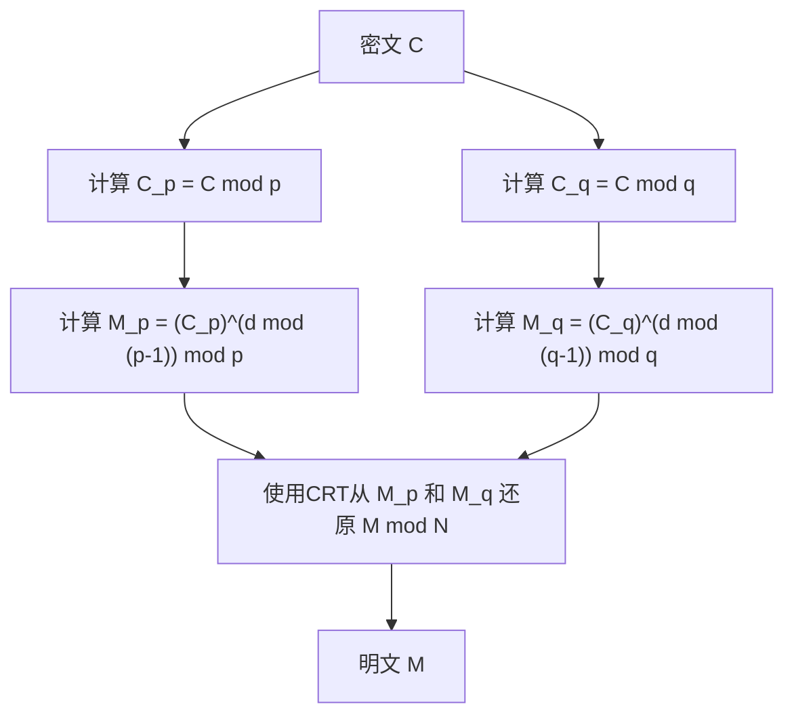

## 引言

中国剩余定理（[Chinese Remainder Theorem](https://kenji.blog/zh-cn/p/chinese-remainder-theorem/)，简称CRT）是数论中最重要且优美的定理之一。其起源可以追溯到3世纪至5世纪左右编纂的古代中国数学著作《孙子算经》。这个从古代朴素的算术问题开始的定理，在经过几千年后的现代，在我们日常使用的互联网安全通信所依赖的 **[RSA](https://kenji.blog/zh-cn/p/modern-cryptography-public-key-hash-signature/)加密** 等公钥加密技术中，发挥着不可或缺的作用。

本文将详细解说 **中国剩余定理** ，从其历史背景到数学上的严格定义、具体的计算步骤，以及在现代密码学理论中的应用，并配以图解和具体例子。

## 历史背景：孙子问题

中国剩余定理的根源在于《孙子算经》下卷第26问中记载的以下著名问题。

> 「今有物不知其数，三三数之剩二，五五数之剩三，七七数之剩二。问物几何？」
> （现在有数量未知的物品。每次数3个剩2个，每次数5个剩3个，每次数7个剩2个。问物品的数量是多少？）

如果我们使用现代数学记法中的线性同余方程组来表示它，对于未知的整数 $x$，可以写作如下形式：

$$
\begin{cases}
x \equiv 2 \pmod 3 \\
x \equiv 3 \pmod 5 \\
x \equiv 2 \pmod 7
\end{cases}
$$

这个问题的解是 $x = 23$。在《孙子算经》中，也给出了得出这个解的具体计算步骤，这被认为是中国剩余定理具体构造方法的最初例子。

## 数学定义与定理表述

在现代数学中， **中国剩余定理** 的公式化如下。

### 定理的表述

假设有 $k$ 个两两互素（最大公约数为1）的正整数 $m_1, m_2, \dots, m_k$。也就是说，对于任意的 $i \neq j$，都有 $\gcd(m_i, m_j) = 1$ 成立。

此时，对于任意整数 $a_1, a_2, \dots, a_k$，在模 $M = m_1 m_2 \dots m_k$ 下，存在唯一的一个整数 $x$，满足以下同余方程组：

$$
\begin{cases}
x \equiv a_1 \pmod{m_1} \\
x \equiv a_2 \pmod{m_2} \\
\vdots \\
x \equiv a_k \pmod{m_k}
\end{cases}
$$

换言之，解 $x$ 在 $0 \leq x < M$ 的范围内仅存在一个，并且所有的解都可以表示为 $x \equiv x_0 \pmod M$ 的形式。

### 证明与构造法（高斯算法）

这个定理的奇妙之处在于，它不仅保证了解的存在性，还提供了一个构造具体解的算法。下面展示其构造方法。

1. 计算总乘积 $M = m_1 m_2 \dots m_k$。
2. 对于每个 $i$，计算 $M_i = \frac{M}{m_i}$。（ $M_i$ 是除了 $m_i$ 以外所有模数的乘积）
3. 由于 $\gcd(M_i, m_i) = 1$，所以在模 $m_i$ 下存在 $M_i$ 的乘法逆元 $y_i$。即，使用扩展[欧几里得算法](https://kenji.blog/zh-cn/p/euclidean-algorithm/)等方法求出满足 $M_i y_i \equiv 1 \pmod{m_i}$ 的 $y_i$。
4. 最终的解 $x$ 由下式给出：

$$
x = \sum_{i=1}^{k} a_i M_i y_i \pmod M
$$

通过在模 $m_j$ 下对 $x$ 进行计算，可以很容易地验证这个 $x$ 满足原来的同余方程组。当 $i \neq j$ 时，$M_i$ 是 $m_j$ 的倍数，因此 $M_i \equiv 0 \pmod{m_j}$。所以，在求和项中只有 $i = j$ 的项留下来，即 $x \equiv a_j M_j y_j \equiv a_j \cdot 1 \equiv a_j \pmod{m_j}$，满足条件。

## 具体计算示例

让我们用这个算法来解答之前的“孙子问题”。

问题：
$x \equiv 2 \pmod 3$  (这里 $a_1=2, m_1=3$)
$x \equiv 3 \pmod 5$  (这里 $a_2=3, m_2=5$)
$x \equiv 2 \pmod 7$  (这里 $a_3=2, m_3=7$)

**步骤1：** 计算 $M$
$M = 3 \times 5 \times 7 = 105$

**步骤2：** 计算 $M_i$
$M_1 = 105 / 3 = 35$
$M_2 = 105 / 5 = 21$
$M_3 = 105 / 7 = 15$

**步骤3：** 计算逆元 $y_i$
- $35 y_1 \equiv 1 \pmod 3 \implies 2 y_1 \equiv 1 \pmod 3 \implies y_1 = 2$
- $21 y_2 \equiv 1 \pmod 5 \implies 1 y_2 \equiv 1 \pmod 5 \implies y_2 = 1$
- $15 y_3 \equiv 1 \pmod 7 \implies 1 y_3 \equiv 1 \pmod 7 \implies y_3 = 1$

**步骤4：** 计算解 $x$
$x = (2 \times 35 \times 2) + (3 \times 21 \times 1) + (2 \times 15 \times 1)$
$x = 140 + 63 + 30 = 233$

求其除以 $M = 105$ 的余数。
$233 \equiv 23 \pmod{105}$

因此，最小的正数解为 **23** ，完美符合孙子问题的解。

## 现代应用：[RSA](https://kenji.blog/zh-cn/p/modern-cryptography-public-key-hash-signature/)加密与CRT

作为古代数学难题的 **中国剩余定理** ，在现代数字社会中拥有着极其重要的实际用途。其代表性例子就是在 **RSA加密** 中加速解密和签名生成。

### RSA加密概述

在RSA加密中，使用两个大素数 $p$ 和 $q$，并将其乘积 $N = pq$ 作为公钥的一部分。利用私钥 $d$ 从密文 $C$ 解密出明文 $M$ 的计算如下进行：

$$
M = C^d \pmod N
$$

在这里，$N$ 是一个非常巨大的数（例如2048位），并且 $d$ 也有相似的大小，因此这种模幂运算的计算成本非常高。

### 使用CRT加速（RSA-CRT）

这时候就轮到 **中国剩余定理** 出场了。与其直接在模 $N$ 下进行巨大的计算，不如将其分割为在 $N$ 的素因子 $p$ 和 $q$ 为模的两个较小计算，最后利用CRT重构出原来的解，这就是我们采取的方法。

具体来说，步骤如下：



1. 作为私钥，预先计算 $d_p = d \pmod{p-1}$ 和 $d_q = d \pmod{q-1}$ 来代替 $d$。
2. 分别进行模 $p$ 和模 $q$ 的解密计算。
   $M_p = C^{d_p} \pmod p$
   $M_q = C^{d_q} \pmod q$
3. 对 $M_p$ 和 $M_q$ 应用CRT，求出 $M \pmod N$。

当模数的位长减半（例如1024位）时，幂运算的成本大约会变为1/8。即使执行两次，总成本也只是大约1/4。利用[RSA](https://kenji.blog/zh-cn/p/modern-cryptography-public-key-hash-signature/)-CRT，能够使解密和签名生成的运算 **提速约4倍** 。对于智能手机和IC卡等计算资源有限的设备，这种加速是至关重要的。

## 中国剩余定理的编程实现

除了理论，我们来实际写段代码实现一下 **中国剩余定理** 。这里使用Python实现高斯算法。

```python
def extended_gcd(a, b):
    """
    扩展欧几里得算法
    返回满足 a*x + b*y = gcd(a, b) 的 (gcd(a, b), x, y)
    """
    if a == 0:
        return b, 0, 1
    else:
        g, y, x = extended_gcd(b % a, a)
        return g, x - (b // a) * y, y

def mod_inverse(a, m):
    """
    返回 a 在模 m 下的乘法逆元
    """
    g, x, y = extended_gcd(a, m)
    if g != 1:
        raise Exception('模逆元不存在')
    else:
        return x % m

def chinese_remainder_theorem(a_list, m_list):
    """
    中国剩余定理 (CRT)
    返回满足 x ≡ a_i (mod m_i) 的 x
    """
    total_m = 1
    for m in m_list:
        total_m *= m
        
    x = 0
    for a, m in zip(a_list, m_list):
        M_i = total_m // m
        y_i = mod_inverse(M_i, m)
        x += a * M_i * y_i
        
    return x % total_m

# 解决孙子问题
a = [2, 3, 2]
m = [3, 5, 7]
result = chinese_remainder_theorem(a, m)
print(f"孙子问题的解: {result}") # 输出: 23
```

就这样，仅仅几十行代码就能在计算机上重现 **中国剩余定理** 。这种实现在竞技编程等领域也是经常被使用的基本算法。

## 抽象代数中的推广：环与理想

**中国剩余定理** 不仅局限于整数的性质，在现代数学的重要分支 **抽象代数** 中，也以更一般的形式得到了推广。

考虑交换环 $R$ 及其理想 $I_1, I_2, \dots, I_k$。当这些理想两两互素（即对于任意 $i \neq j$，都有 $I_i + I_j = R$ 成立）时，可以定义如下自然的环同态映射 $\phi$：

$$
\phi: R \to (R/I_1) \times (R/I_2) \times \dots \times (R/I_k)
$$
$$
\phi(x) = (x \pmod{I_1}, x \pmod{I_2}, \dots, x \pmod{I_k})
$$

抽象代数中的 **中国剩余定理** 断言，此同态映射 $\phi$ 是满射，并且其核（kernel）是这些理想的交集 $\bigcap_{i=1}^k I_i$ （它等于理想的乘积 $\prod_{i=1}^k I_i$ ）。

因此，根据第一同构定理，可以得出如下的自然同构：

$$
R / \left( \bigcap_{i=1}^k I_i \right) \cong (R/I_1) \times (R/I_2) \times \dots \times (R/I_k)
$$

### 在多项式环中的应用

这个广义定理最重要的应用之一，是在域 $F$ 上的单变量多项式环 $F[x]$ 中的 **中国剩余定理** 。

整数情形下的“互素整数”，在多项式环中对应于“没有公共根（最大公约多项式为常数）的多项式”。这种多项式版本的CRT构成了拉格朗日插值法（[Lagrange](https://kenji.blog/zh-cn/p/lagrange/) interpolation）的理论基础，并完全等同于唯一确定穿过给定多点的最低次多项式的算法。此外，这也是一种纠错码—— **里德-所罗门码** 的数学基石。

## 基于剩余数系统（RNS）的超并行计算

作为 **中国剩余定理** 在工程学上的应用，我们也应当提及 **剩余数系统（Residue Number System, RNS）** 。

通常，计算机使用二进制来表示数字并进行计算。但是，在进行加法或乘法时，会发生进位传播，如果位宽增加，电路的延迟也会随之变大。

在RNS中，我们准备一组互素的模数集合 $\{m_1, m_2, \dots, m_k\}$，并将一个巨大的整数 $X$ 表示为分别除以各模数后的余数组 $(x_1, x_2, \dots, x_k)$。

这种表示法最大的优势在于，加法和乘法中 **不会产生进位** 。
例如，当将 $X$ 和 $Y$ 相加时，可以独立地对每个模数进行计算。

$$
X + Y \leftrightarrow ( (x_1+y_1)\pmod{m_1}, \dots, (x_k+y_k)\pmod{m_k} )
$$
$$
X \times Y \leftrightarrow ( (x_1y_1)\pmod{m_1}, \dots, (x_k y_k)\pmod{m_k} )
$$

由于在每个模数下的计算是完全独立的，通过构建并行电路可以实现极高速的运算。在最终将结果转换回普通数值时，正需要用到 **中国剩余定理** 。这种技术目前仍在要求实时性的数字信号处理（DSP）以及特定的密码处理电路设计中被研究和实际应用。

## 结语

**中国剩余定理** 从一个单纯的数学谜题开始，升华为抽象代数中关于理想结构的定理，并发展成为支撑现代密码学和计算机科学的基础技术。

跨越几千年的时光，古代中国数学家的智慧仍然作为我们智能手机中密码处理的一部分而生生不息，这可以说是象征了数学这门学问的普遍性与生命力。
