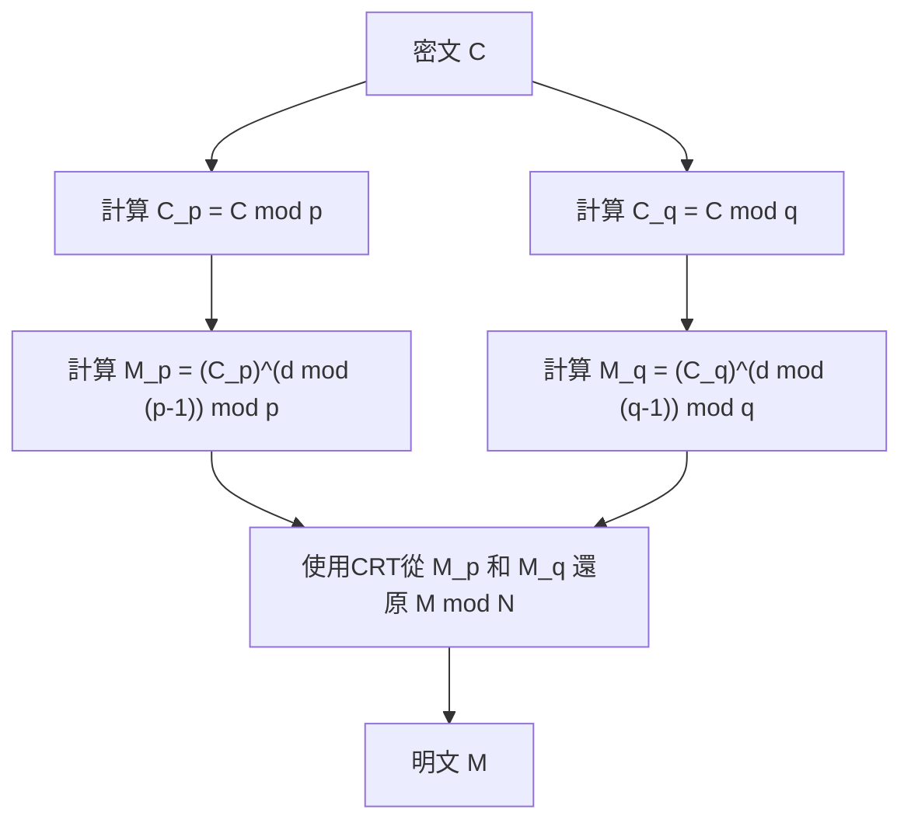

## 引言

中國剩餘定理（Chinese Remainder Theorem，簡稱CRT）是數論中最重要且優美的定理之一。其起源可以追溯到3世紀至5世紀左右編纂的古代中國數學著作《孫子算經》。這個從古代樸素的算術問題開始的定理，在經過幾千年後的現代，在我們日常使用的互聯網安全通訊所依賴的 **RSA加密** 等公鑰加密技術中，發揮著不可或缺的作用。

本文將詳細解說 **中國剩餘定理** ，從其歷史背景到數學上的嚴格定義、具體的計算步驟，以及在現代密碼學理論中的應用，並配以圖解和具體例子。

## 歷史背景：孫子問題

中國剩餘定理的根源在於《孫子算經》下卷第26問中記載的以下著名問題。

> 「今有物不知其數，三三數之剩二，五五數之剩三，七七數之剩二。問物幾何？」
> （現在有數量未知的物品。每次數3個剩2個，每次數5個剩3個，每次數7個剩2個。問物品的數量是多少？）

如果我們使用現代數學記法中的線性同餘方程組來表示它，對於未知的整數 $x$，可以寫作如下形式：

$$
\begin{cases}
x \equiv 2 \pmod 3 \\
x \equiv 3 \pmod 5 \\
x \equiv 2 \pmod 7
\end{cases}
$$

這個問題的解是 $x = 23$。在《孫子算經》中，也給出了得出這個解的具體計算步驟，這被認為是中國剩餘定理具體構造方法的最初例子。

## 數學定義與定理表述

在現代數學中， **中國剩餘定理** 的公式化如下。

### 定理的表述

假設有 $k$ 個兩兩互質（最大公因數為1）的正整數 $m_1, m_2, \dots, m_k$。也就是說，對於任意的 $i \neq j$，都有 $\gcd(m_i, m_j) = 1$ 成立。

此時，對於任意整數 $a_1, a_2, \dots, a_k$，在模 $M = m_1 m_2 \dots m_k$ 下，存在唯一的一個整數 $x$，滿足以下同餘方程組：

$$
\begin{cases}
x \equiv a_1 \pmod{m_1} \\
x \equiv a_2 \pmod{m_2} \\
\vdots \\
x \equiv a_k \pmod{m_k}
\end{cases}
$$

換言之，解 $x$ 在 $0 \leq x < M$ 的範圍內僅存在一個，並且所有的解都可以表示為 $x \equiv x_0 \pmod M$ 的形式。

### 證明與構造法（高斯演算法）

這個定理的奇妙之處在於，它不僅保證了解的存在性，還提供了一個構造具體解的演算法。下面展示其構造方法。

1. 計算總乘積 $M = m_1 m_2 \dots m_k$。
2. 對於每個 $i$，計算 $M_i = \frac{M}{m_i}$。（ $M_i$ 是除了 $m_i$ 以外所有模數的乘積）
3. 由於 $\gcd(M_i, m_i) = 1$，所以在模 $m_i$ 下存在 $M_i$ 的乘法逆元 $y_i$。即，使用擴展歐幾里得演算法等方法求出滿足 $M_i y_i \equiv 1 \pmod{m_i}$ 的 $y_i$。
4. 最終的解 $x$ 由下式給出：

$$
x = \sum_{i=1}^{k} a_i M_i y_i \pmod M
$$

通過在模 $m_j$ 下對 $x$ 進行計算，可以很容易地驗證這個 $x$ 滿足原來的同餘方程組。當 $i \neq j$ 時，$M_i$ 是 $m_j$ 的倍數，因此 $M_i \equiv 0 \pmod{m_j}$。所以，在求和項中只有 $i = j$ 的項留下來，即 $x \equiv a_j M_j y_j \equiv a_j \cdot 1 \equiv a_j \pmod{m_j}$，滿足條件。

## 具體計算範例

讓我們用這個演算法來解答之前的「孫子問題」。

問題：
$x \equiv 2 \pmod 3$  (這裡 $a_1=2, m_1=3$)
$x \equiv 3 \pmod 5$  (這裡 $a_2=3, m_2=5$)
$x \equiv 2 \pmod 7$  (這裡 $a_3=2, m_3=7$)

**步驟1：** 計算 $M$
$M = 3 \times 5 \times 7 = 105$

**步驟2：** 計算 $M_i$
$M_1 = 105 / 3 = 35$
$M_2 = 105 / 5 = 21$
$M_3 = 105 / 7 = 15$

**步驟3：** 計算逆元 $y_i$
- $35 y_1 \equiv 1 \pmod 3 \implies 2 y_1 \equiv 1 \pmod 3 \implies y_1 = 2$
- $21 y_2 \equiv 1 \pmod 5 \implies 1 y_2 \equiv 1 \pmod 5 \implies y_2 = 1$
- $15 y_3 \equiv 1 \pmod 7 \implies 1 y_3 \equiv 1 \pmod 7 \implies y_3 = 1$

**步驟4：** 計算解 $x$
$x = (2 \times 35 \times 2) + (3 \times 21 \times 1) + (2 \times 15 \times 1)$
$x = 140 + 63 + 30 = 233$

求其除以 $M = 105$ 的餘數。
$233 \equiv 23 \pmod{105}$

因此，最小的正數解為 **23** ，完美符合孫子問題的解。

## 現代應用：RSA加密與CRT

作為古代數學難題的 **中國剩餘定理** ，在現代數位社會中擁有著極其重要的實際用途。其代表性例子就是在 **RSA加密** 中加速解密和簽章生成。

### RSA加密概述

在RSA加密中，使用兩個大質數 $p$ 和 $q$，並將其乘積 $N = pq$ 作為公鑰的一部分。利用私鑰 $d$ 從密文 $C$ 解密出明文 $M$ 的計算如下進行：

$$
M = C^d \pmod N
$$

在這裡，$N$ 是一個非常巨大的數（例如2048位元），並且 $d$ 也有相似的大小，因此這種模冪運算的計算成本非常高。

### 使用CRT加速（RSA-CRT）

這時候就輪到 **中國剩餘定理** 出場了。與其直接在模 $N$ 下進行巨大的計算，不如將其分割為在 $N$ 的質因數 $p$ 和 $q$ 為模的兩個較小計算，最後利用CRT重構出原來的解，這就是我們採取的方法。

具體來說，步驟如下：



1. 作為私鑰，預先計算 $d_p = d \pmod{p-1}$ 和 $d_q = d \pmod{q-1}$ 來代替 $d$。
2. 分別進行模 $p$ 和模 $q$ 的解密計算。
   $M_p = C^{d_p} \pmod p$
   $M_q = C^{d_q} \pmod q$
3. 對 $M_p$ 和 $M_q$ 應用CRT，求出 $M \pmod N$。

當模數的位元長度減半（例如1024位元）時，冪運算的成本大約會變為1/8。即使執行兩次，總成本也只是大約1/4。利用RSA-CRT，能夠使解密和簽章生成的運算 **提速約4倍** 。對於智慧型手機和智慧卡等計算資源有限的設備，這種加速是至關重要的。

## 中國剩餘定理的程式實作

除了理論，我們來實際寫段程式碼實作一下 **中國剩餘定理** 。這裡使用Python實作高斯演算法。

```python
def extended_gcd(a, b):
    """
    擴展歐幾里得演算法
    返回滿足 a*x + b*y = gcd(a, b) 的 (gcd(a, b), x, y)
    """
    if a == 0:
        return b, 0, 1
    else:
        g, y, x = extended_gcd(b % a, a)
        return g, x - (b // a) * y, y

def mod_inverse(a, m):
    """
    返回 a 在模 m 下的乘法逆元
    """
    g, x, y = extended_gcd(a, m)
    if g != 1:
        raise Exception('模逆元不存在')
    else:
        return x % m

def chinese_remainder_theorem(a_list, m_list):
    """
    中國剩餘定理 (CRT)
    返回滿足 x ≡ a_i (mod m_i) 的 x
    """
    total_m = 1
    for m in m_list:
        total_m *= m
        
    x = 0
    for a, m in zip(a_list, m_list):
        M_i = total_m // m
        y_i = mod_inverse(M_i, m)
        x += a * M_i * y_i
        
    return x % total_m

# 解決孫子問題
a = [2, 3, 2]
m = [3, 5, 7]
result = chinese_remainder_theorem(a, m)
print(f"孫子問題的解: {result}") # 輸出: 23
```

就這樣，僅僅幾十行程式碼就能在電腦上重現 **中國剩餘定理** 。這種實作在競技程式設計等領域也是經常被使用的基本演算法。

## 抽象代數中的推廣：環與理想

**中國剩餘定理** 不僅侷限於整數的性質，在現代數學的重要分支 **抽象代數** 中，也以更一般的形式得到了推廣。

考慮交換環 $R$ 及其理想 $I_1, I_2, \dots, I_k$。當這些理想兩兩互質（即對於任意 $i \neq j$，都有 $I_i + I_j = R$ 成立）時，可以定義如下自然的環同態映射 $\phi$：

$$
\phi: R \to (R/I_1) \times (R/I_2) \times \dots \times (R/I_k)
$$
$$
\phi(x) = (x \pmod{I_1}, x \pmod{I_2}, \dots, x \pmod{I_k})
$$

抽象代數中的 **中國剩餘定理** 斷言，此同態映射 $\phi$ 是滿射，並且其核（kernel）是這些理想的交集 $\bigcap_{i=1}^k I_i$ （它等於理想的乘積 $\prod_{i=1}^k I_i$ ）。

因此，根據第一同構定理，可以得出如下的自然同構：

$$
R / \left( \bigcap_{i=1}^k I_i \right) \cong (R/I_1) \times (R/I_2) \times \dots \times (R/I_k)
$$

### 在多項式環中的應用

這個廣義定理最重要的應用之一，是在體 $F$ 上的單變數多項式環 $F[x]$ 中的 **中國剩餘定理** 。

整數情形下的「互質整數」，在多項式環中對應於「沒有公共根（最大公因式為常數）的多項式」。這種多項式版本的CRT構成了拉格朗日插值法（Lagrange interpolation）的理論基礎，並完全等同於唯一確定穿過給定多點的最低次多項式的演算法。此外，這也是一種錯誤更正碼—— **里德-所羅門碼** 的數學基石。

## 基於剩餘數系統（RNS）的超平行計算

作為 **中國剩餘定理** 在工程學上的應用，我們也應當提及 **剩餘數系統（Residue Number System, RNS）** 。

通常，電腦使用二進位來表示數字並進行計算。但是，在進行加法或乘法時，會發生進位傳播，如果位元寬度增加，電路的延遲也會隨之變大。

在RNS中，我們準備一組互質的模數集合 $\{m_1, m_2, \dots, m_k\}$，並將一個巨大的整數 $X$ 表示為分別除以各模數後的餘數組 $(x_1, x_2, \dots, x_k)$。

這種表示法最大的優勢在於，加法和乘法中 **不會產生進位** 。
例如，當將 $X$ 和 $Y$ 相加時，可以獨立地對每個模數進行計算。

$$
X + Y \leftrightarrow ( (x_1+y_1)\pmod{m_1}, \dots, (x_k+y_k)\pmod{m_k} )
$$
$$
X \times Y \leftrightarrow ( (x_1y_1)\pmod{m_1}, \dots, (x_k y_k)\pmod{m_k} )
$$

由於在每個模數下的計算是完全獨立的，通過構建平行電路可以實現極高速的運算。在最終將結果轉換回普通數值時，正需要用到 **中國剩餘定理** 。這種技術目前仍在要求即時性的數位訊號處理（DSP）以及特定的密碼處理電路設計中被研究和實際應用。

## 結語

**中國剩餘定理** 從一個單純的數學謎題開始，昇華為抽象代數中關於理想結構的定理，並發展成為支撐現代密碼學和電腦科學的基礎技術。

跨越幾千年的時光，古代中國數學家的智慧仍然作為我們智慧型手機中密碼處理的一部分而生生不息，這可以說是象徵了數學這門學問的普遍性與生命力。
