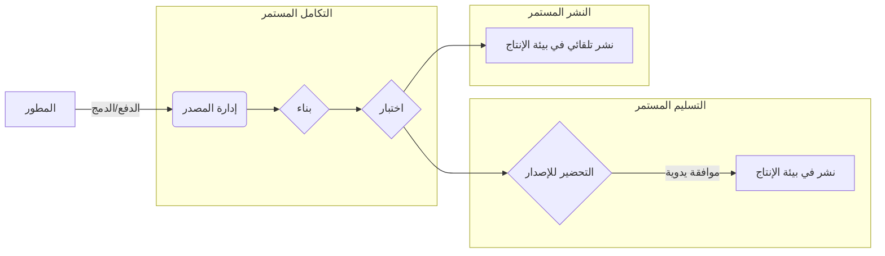
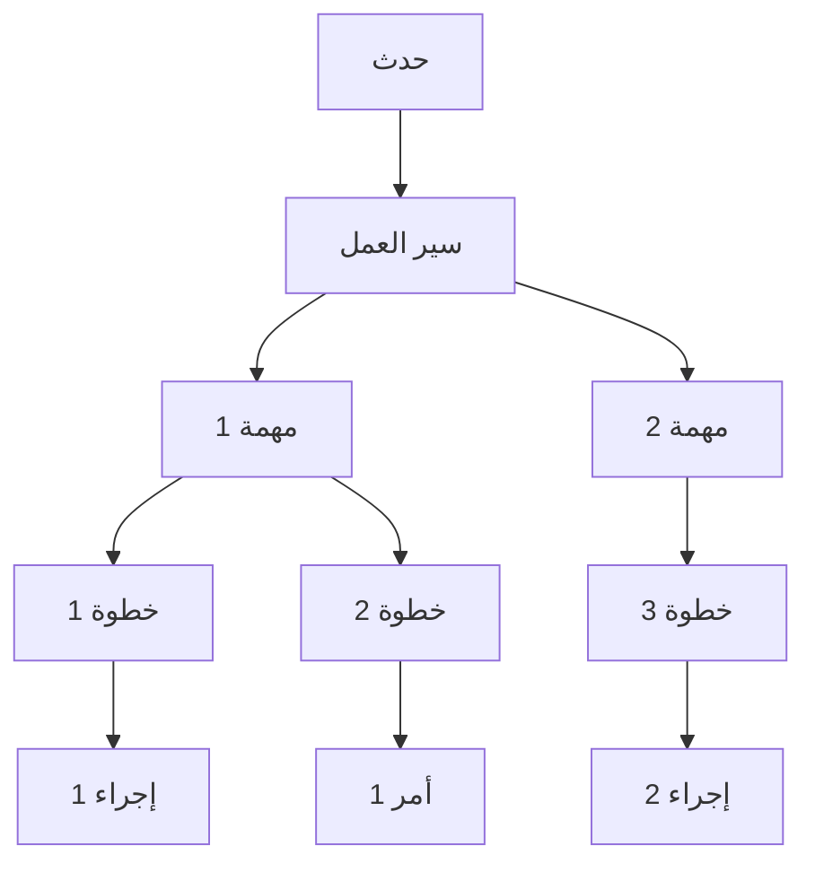
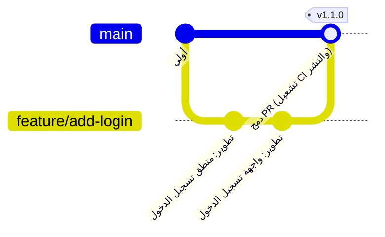

# مقدمة: أهمية CI/CD في تطوير البرمجيات الحديثة

تعد سرعة وجودة تطوير البرمجيات من أهم العوامل التي تحدد القدرة التنافسية في أعمال اليوم. التكنولوجيا الأساسية لتحقيق كليهما هي **CI/CD** (التكامل المستمر / التسليم والنشر المستمر).

في هذه المقالة، سنشرح المفاهيم الأساسية لـ CI/CD، وبناء مسار عملي باستخدام **GitHub Actions**، وهو المعيار الفعلي لمنصات التطوير الحديثة، وأفضل الممارسات المفيدة في العمل العملي، مع أمثلة تعليمات برمجية مفصلة ورسوم توضيحية.

## ما هو CI/CD؟

CI/CD هي ممارسة لاختبار تغييرات البرامج باستمرار وإصدارها بشكل آمن وسريع في بيئة الإنتاج.

### التكامل المستمر (CI: Continuous Integration)

وهي ممارسة يقوم فيها المطورون بدمج التعليمات البرمجية في مستودع مشترك بشكل متكرر (يفضل عدة مرات في اليوم). في كل مرة يتم فيها دمج التعليمات البرمجية، يتم تشغيل عمليات البناء والاختبار الآلية لاكتشاف أخطاء التكامل مبكرا.

*   **الغرض:** الاكتشاف المبكر للأخطاء، والتخفيف من آلام التكامل (جحيم التكامل).
*   **العمليات الرئيسية:** تجميع التعليمات البرمجية، التحليل الثابت (Lint)، اختبار الوحدة (Unit Test).

### التسليم المستمر (CD: Continuous Delivery) والنشر المستمر (CD: Continuous Deployment)

هذا امتداد لـ CI وهو عملية التجهيز التلقائي لبرنامج جاهز للإصدار.

*   **التسليم المستمر:** يحافظ على حالة يكون فيها جاهزا دائما للنشر في بيئة الإنتاج. يتم تشغيل النشر الفعلي يدويا.
*   **النشر المستمر:** ينشر تلقائيا جميع التغييرات التي تجتاز الاختبارات إلى بيئة الإنتاج دون تدخل بشري.



---

# أساسيات GitHub Actions

GitHub Actions هي منصة قوية تتيح لك أتمتة سير عمل تطوير البرمجيات مباشرة داخل مستودع GitHub الخاص بك. لا يمكنك أتمتة CI/CD فحسب، بل يمكنك أيضا أتمتة جميع المهام المتعلقة بالمستودع، مثل التنظيم التلقائي للمشكلات (Issues) والإنشاء التلقائي لملاحظات الإصدار.

## المفاهيم الأساسية

لإتقان GitHub Actions، يجب أن تفهم المفاهيم الأساسية التالية.

1.  **Workflow (سير العمل):** عملية آلية تقوم بتشغيل مهمة واحدة أو أكثر. يتم تعريفه في ملف YAML.
2.  **Event (الحدث):** نشاط محدد يؤدي إلى تنفيذ سير العمل (مثل: `push`، `pull_request`، التنفيذ المجدول `schedule` وما إلى ذلك).
3.  **Job (المهمة):** مجموعة من الخطوات التي يتم تنفيذها على نفس المشغل. يتم تنفيذ المهام بشكل متواز افتراضيا، ولكن من الممكن أيضا تعيين التبعيات.
4.  **Step (الخطوة):** مهمة فردية تنفذ أمرا أو تستدعي إجراء (Action) داخل مهمة.
5.  **Action (الإجراء):** أمر مستقل وقابل لإعادة الاستخدام يؤدي مهام معقدة ومتكررة. (مثل: التحقق من المستودع، إعداد Node.js).
6.  **Runner (المشغل):** خادم يقوم بتشغيل سير العمل. هناك مشغلات مستضافة بواسطة GitHub (Ubuntu، Windows، macOS) ومشغلات ذاتية الاستضافة (self-hosted).



---

# الممارسة العملية لبناء مسار CI/CD باستخدام GitHub Actions

من هنا، سنشرح خطوة بخطوة كيفية بناء مسار CI من خلال النظر في ملفات YAML المحددة. كمثال، سنفترض مشروع Node.js (TypeScript).

## 1. سير عمل CI الأساسي

أولا، سننشئ سير عمل أساسيا يقوم بتثبيت التبعيات وتشغيل الاختبارات عند دفع التعليمات البرمجية أو إنشاء طلب سحب (Pull Request).

قم بإنشاء `.github/workflows/ci.yml` في جذر المشروع واكتب ما يلي:

```yaml
name: Node.js CI

on:
  push:
    branches: [ "main", "develop" ]
  pull_request:
    branches: [ "main", "develop" ]

jobs:
  build:
    runs-on: ubuntu-latest

    steps:
    - name: فحص الكود
      uses: actions/checkout@v4

    - name: إعداد Node.js
      uses: actions/setup-node@v4
      with:
        node-version: '20'

    - name: تثبيت التبعيات
      run: npm ci

    - name: تنفيذ البناء
      run: npm run build

    - name: تنفيذ الاختبارات
      run: npm test
```

### شرح النقاط

*   **`on:`** يتم تشغيله بواسطة `push` و `pull_request` للفروع `main` و `develop`.
*   **`actions/checkout@v4`:** يقوم بتنزيل كود المستودع إلى مساحة العمل. إنه شبه إلزامي كخطوة أولى في CI.
*   **`actions/setup-node@v4`:** يبني بيئة Node.js للإصدار المحدد.
*   **`npm ci`:** هو أسرع من `npm install` ويقوم بتثبيت يعتمد بشكل صارم على `package-lock.json`، مما يجعله مناسبا لبيئات CI.

## 2. تحسين سرعة التنفيذ: استخدام ذاكرة التخزين المؤقت (Cache)

يرتبط وقت تنفيذ CI مباشرة بحلقة ملاحظات المطورين. استخدام ذاكرة التخزين المؤقت لتقليل وقت تنزيل التبعيات هو **أفضل الممارسات**.

يحتوي `actions/setup-node` على ميزة تخزين مؤقت مضمنة.

```yaml
    - name: إعداد Node.js
      uses: actions/setup-node@v4
      with:
        node-version: '20'
        cache: 'npm' # تخزين تبعيات npm مؤقتا
```

من خلال هذا، يتم تخزين الدليل `~/.npm` مؤقتا باستخدام قيمة التجزئة (hash) لـ `package-lock.json` كمفتاح، وسيتم تسريع عمليات التنفيذ اللاحقة بشكل كبير.

## 3. ضمان الجودة: Lint و Format

للحفاظ على جودة الكود بشكل موحد، يجب تضمين التحليل الثابت (Lint) وتنسيق الكود (Format) قبل البناء أو الاختبار.

```yaml
jobs:
  lint-and-test:
    runs-on: ubuntu-latest
    steps:
      - uses: actions/checkout@v4
      - uses: actions/setup-node@v4
        with:
          node-version: '20'
          cache: 'npm'
      
      - run: npm ci

      - name: تنفيذ ESLint
        run: npm run lint

      - name: فحص Prettier
        run: npm run format:check

      - name: تنفيذ الاختبارات
        run: npm test
```

## 4. فحص الأمان (DevSecOps)

في CI/CD الحديث، يعد نهج **DevSecOps** الذي يعمل على أتمتة فحوصات الأمان أمرا ضروريا. باستخدام GitHub Actions، يمكنك بسهولة دمج عمليات فحص الأمان.

### فحص ثغرات التبعيات (npm audit)

```yaml
      - name: فحص الثغرات
        run: npm audit
```

### اختبار أمان التطبيقات الثابت (SAST)

يمكنك استخدام CodeQL وغيرها، وهي ميزة في GitHub Advanced Security، لفحص الكود المصدري نفسه بحثا عن نقاط الضعف. (* قد يكون الترخيص مطلوبا للمستودعات الخاصة)

```yaml
  security-scan:
    runs-on: ubuntu-latest
    steps:
    - uses: actions/checkout@v4
    
    - name: تهيئة CodeQL
      uses: github/codeql-action/init@v3
      with:
        languages: javascript

    - name: إجراء تحليل CodeQL
      uses: github/codeql-action/analyze@v3
```

## 5. اختبار عبر الأنظمة الأساسية (Cross-platform) باستخدام بناء المصفوفة (Matrix Build)

إذا كنت تقوم بتطوير مكتبات، فقد تحتاج إلى الاختبار على أنظمة تشغيل وإصدارات وقت تشغيل متعددة. باستخدام `strategy.matrix`، يمكنك بسهولة بناء بيئات اختبار متوازية.

```yaml
jobs:
  test:
    runs-on: ${{ matrix.os }}
    strategy:
      matrix:
        node-version: [18, 20, 22]
        os: [ubuntu-latest, windows-latest, macos-latest]
        
    steps:
    - uses: actions/checkout@v4
    - name: استخدام Node.js ${{ matrix.node-version }} على ${{ matrix.os }}
      uses: actions/setup-node@v4
      with:
        node-version: ${{ matrix.node-version }}
    - run: npm ci
    - run: npm test
```

من خلال هذا الإعداد، سيتم تنفيذ إجمالي 9 مهام (3 إصدارات Node.js × 3 أنظمة تشغيل) بالتوازي.

---

# استراتيجية الفروع والربط مع CI/CD

لبناء مسار CI/CD فعال، من الضروري ربطه بشكل وثيق بـ **استراتيجية الفروع** لفريق التطوير. سنشرح أمثلة على الربط مع الاستراتيجيات النموذجية.

## الربط مع GitHub Flow

GitHub Flow هي استراتيجية بسيطة تحافظ دائما على فرع `main` في حالة قابلة للنشر، وتتم إضافة الميزات في فروع الميزات (Feature).



*   **فرع Feature:** في كل مرة يتم فيها `push`، يتم تشغيل Lint واختبار الوحدة (CI).
*   **Pull Request:** عند إنشاء PR للفرع `main`، يتم تشغيل CI، ويتم تعيين قواعد الحماية بحيث لا يمكن الدمج ما لم ينجح.
*   **فرع main:** عند الدمج، يتم تشغيل CI، ثم يتم نشره (CD) تلقائيا في بيئة التدريج (Staging) أو بيئة الإنتاج.

## تقسيم مسار CI/CD

في المشاريع المعقدة، من **أفضل الممارسات** تقسيم ملفات سير العمل حسب الغرض بدلا من إنشاء ملف واحد ضخم.

1.  `pr-check.yml`: عند إنشاء PR. Lint، واختبارات وحدة سريعة. (الغرض: ملاحظات سريعة)
2.  `ci-main.yml`: عند الدمج إلى `main`. بناء كامل، واختبارات E2E ثقيلة. (الغرض: ضمان الجودة قبل الإصدار)
3.  `cd-deploy.yml`: عند إنشاء علامة (tag) (مثل: `v1.0.0`). النشر في بيئة الإنتاج. (الغرض: الإصدار)

---

# التقنيات المتقدمة في GitHub Actions

سنقدم ميزات متقدمة لبناء مسار عملي وقابل للصيانة بشكل أكبر.

## Reusable Workflows (سير العمل القابل لإعادة الاستخدام)

إذا كانت مستودعات متعددة لها عملية CI مشابهة، فيمكنك مشاركة سير العمل نفسه. استخدم مشغل `workflow_call`.

**الجانب المستدعى ( `.github/workflows/reusable-ci.yml` ):**

```yaml
on:
  workflow_call:
    inputs:
      node-version:
        required: true
        type: string

jobs:
  build:
    runs-on: ubuntu-latest
    steps:
      - uses: actions/checkout@v4
      - uses: actions/setup-node@v4
        with:
          node-version: ${{ inputs.node-version }}
      - run: npm ci
      - run: npm test
```

**الجانب المستدعي:**

```yaml
on: [push]

jobs:
  call-workflow:
    uses: my-org/my-repo/.github/workflows/reusable-ci.yml@main
    with:
      node-version: '20'
```

## التعاون الآمن مع السحابة باستخدام [OIDC](https://kenji.blog/ar/p/oauth2-oidc-authentication-authorization-difference/) ([OpenID Connect](https://kenji.blog/ar/p/oauth2-oidc-authentication-authorization-difference/))

عند النشر إلى موفري الخدمات السحابية مثل AWS و GCP و Azure، فإن حفظ بيانات الاعتماد طويلة الأجل (مثل المفاتيح السرية) في GitHub يحمل مخاطر أمنية.

باستخدام OIDC، يمكن لمهمة GitHub Actions طلب رمز مميز (token) مؤقت من موفر السحابة والمصادقة بشكل آمن.

على سبيل المثال، عند النشر إلى AWS:

```yaml
permissions:
  id-token: write # مطلوب لإصدار رمز OIDC
  contents: read

jobs:
  deploy:
    runs-on: ubuntu-latest
    steps:
      - uses: actions/checkout@v4
      
      - name: تكوين بيانات اعتماد AWS
        uses: aws-actions/configure-aws-credentials@v4
        with:
          role-to-assume: arn:aws:iam::123456789012:role/my-github-actions-role
          aws-region: ap-northeast-1
          
      - name: النشر إلى S3
        run: aws s3 sync ./dist s3://my-bucket/
```

نظرا لأنه لا يحتوي على كلمة مرور ويحصل على أذونات من خلال تولي دور (Assume Role)، فهو آمن للغاية.

---

# التأثير الرياضي لاعتماد CI/CD

يمكن قياس تأثير إدخال CI/CD من خلال مؤشرات مثل تكرار النشر والمهلة الزمنية.

على سبيل المثال، لنفترض أن تكرار النشر هو $\lambda$ (مرات/يوم)، والوقت المستغرق لكل نشر يدوي هو $T_{manual}$، والوقت الآلي هو $T_{auto}$.

يمكن التعبير عن مقدار تقليل وقت النشر يوميا $S$ على النحو التالي:

$ S = \lambda \times (T_{manual} - T_{auto}) $

كلما تقدمت الأتمتة وازداد $\lambda$ (حالة النشر عدة مرات في اليوم)، سيصبح الوقت المخفض $S$ أكبر بشكل كبير. هذا يعني أنه يمكن للمطورين استثمار المزيد من الوقت في تطوير ميزات جديدة ذات قيمة.

---

# الخاتمة

في هذه المقالة، شرحنا بالتفصيل من أساسيات CI/CD إلى كيفية بناء مسار عملي باستخدام GitHub Actions، بالإضافة إلى أفضل الممارسات المطلوبة في بيئة التطوير.

*   **الدمج بشكل متكرر:** ادمج التغييرات الصغيرة بشكل متكرر لاكتشاف الأخطاء مبكرا.
*   **استخدام ذاكرة التخزين المؤقت:** قلل وقت تنفيذ سير العمل وقم بتحسين تجربة التطوير.
*   **أتمتة الجودة والأمان:** قم بدمج Lint والاختبار وفحص الثغرات في المسار الخاص بك.
*   **استخدام [OIDC](https://kenji.blog/ar/p/oauth2-oidc-authentication-authorization-difference/):** عند التعاون مع موفري السحابة، استخدم رموز OIDC المؤقتة بدلا من المفاتيح السرية.

GitHub Actions هي أداة مرنة وقوية للغاية. نوصي بالبدء بخطوات صغيرة مثل أتمتة Lint، وتوسيع المسار تدريجيا مع نمو المشروع. استفد من قوة الأتمتة لتحقيق تطوير برمجيات أسرع وأعلى جودة.
