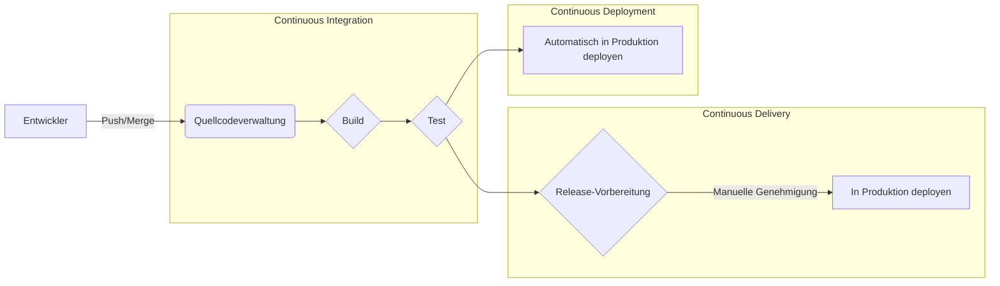
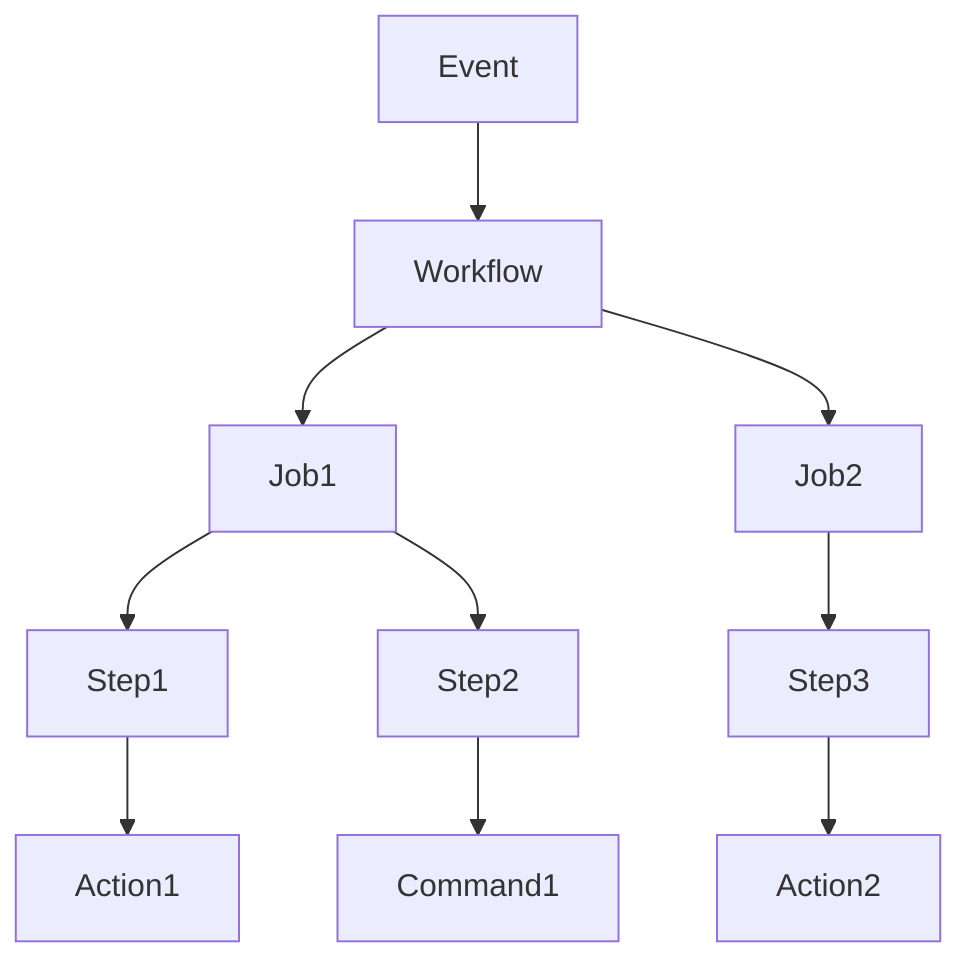
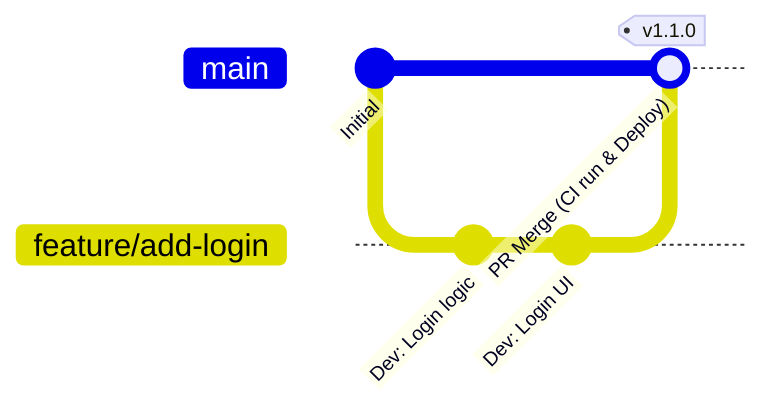

# Einführung: Die Bedeutung von CI/CD in der modernen Softwareentwicklung

Die Geschwindigkeit und Qualität der Softwareentwicklung sind heute eine der wichtigsten Komponenten für die Wettbewerbsfähigkeit von Unternehmen. Die Kerntechnologie, um beides zu erreichen, ist **CI/CD** (Continuous Integration / Continuous Delivery & Deployment).

In diesem Artikel erläutern wir die grundlegenden Konzepte von CI/CD, den praktischen Aufbau von Pipelines mit **GitHub Actions** (dem De-facto-Standard für moderne Entwicklungsplattformen) und nützliche Best Practices für die Praxis anhand detaillierter Codebeispiele und Diagramme.

## Was ist CI/CD?

CI/CD ist eine Praxis, um Softwareänderungen kontinuierlich zu testen und sicher und schnell in die Produktionsumgebung zu veröffentlichen.

### Continuous Integration (CI)

Eine Praxis, bei der Entwickler ihren Code häufig (idealerweise mehrmals täglich) in ein gemeinsames Repository mergen. Jedes Mal, wenn Code gemergt wird, werden automatisierte Builds und Tests ausgeführt, um Integrationsfehler frühzeitig zu erkennen.

*   **Ziel:** Frühzeitige Fehlererkennung, Reduzierung von Integrationsproblemen (Integration Hell).
*   **Hauptprozesse:** Codekompilierung, statische Analyse (Lint), Unit-Tests.

### Continuous Delivery (CD) und Continuous Deployment (CD)

Als Erweiterung der CI ist dies der Prozess der automatischen Vorbereitung von veröffentlichungsfähiger Software.

*   **Continuous Delivery:** Hält die Software jederzeit für ein Deployment in die Produktionsumgebung bereit. Das eigentliche Deployment wird manuell ausgelöst.
*   **Continuous Deployment:** Jede Änderung, die die Tests besteht, wird ohne menschliches Eingreifen automatisch in die Produktionsumgebung deployt.



---

# Grundlagen von GitHub Actions

GitHub Actions ist eine leistungsstarke Plattform, mit der Sie Softwareentwicklungs-Workflows direkt in Ihrem GitHub-Repository automatisieren können. Sie können nicht nur CI/CD automatisieren, sondern auch jede Aufgabe im Zusammenhang mit dem Repository, wie z. B. die automatische Organisation von Issues und die automatische Generierung von Release Notes.

## Kernkonzepte

Um GitHub Actions effektiv zu nutzen, müssen Sie die folgenden grundlegenden Konzepte verstehen:

1.  **Workflow:** Ein automatisierter Prozess, der einen oder mehrere Jobs ausführt. Wird in einer YAML-Datei definiert.
2.  **Event:** Eine bestimmte Aktivität, die die Ausführung eines Workflows auslöst (z. B. `push`, `pull_request`, regelmäßige Ausführung `schedule` usw.).
3.  **Job:** Eine Gruppe von Schritten, die auf demselben Runner ausgeführt werden. Standardmäßig werden Jobs parallel ausgeführt, es ist jedoch auch möglich, Abhängigkeiten festzulegen.
4.  **Step (Schritt):** Eine einzelne Aufgabe innerhalb eines Jobs, die einen Befehl ausführt oder eine Action aufruft.
5.  **Action:** Ein wiederverwendbarer, eigenständiger Befehl, der komplexe und häufig wiederkehrende Aufgaben ausführt. (z. B. Auschecken des Repositorys, Einrichten von Node.js).
6.  **Runner:** Ein Server, der Workflows ausführt. Es gibt von GitHub gehostete Runner (Ubuntu, Windows, macOS) und selbstgehostete Runner.



---

# Praktischer Aufbau einer CI/CD-Pipeline mit GitHub Actions

Im Folgenden erklären wir Schritt für Schritt, wie man eine CI-Pipeline anhand spezifischer YAML-Dateien aufbaut. Als Beispiel gehen wir von einem Node.js (TypeScript)-Projekt aus.

## 1. Grundlegender CI-Workflow

Zunächst erstellen wir einen grundlegenden Workflow, der Abhängigkeiten installiert und Tests ausführt, wenn Code gepusht oder ein Pull Request erstellt wird.

Erstellen Sie `.github/workflows/ci.yml` im Projektstammverzeichnis und schreiben Sie Folgendes:

```yaml
name: Node.js CI

on:
  push:
    branches: [ "main", "develop" ]
  pull_request:
    branches: [ "main", "develop" ]

jobs:
  build:
    runs-on: ubuntu-latest

    steps:
    - name: Code auschecken
      uses: actions/checkout@v4

    - name: Node.js einrichten
      uses: actions/setup-node@v4
      with:
        node-version: '20'

    - name: Abhängigkeiten installieren
      run: npm ci

    - name: Build ausführen
      run: npm run build

    - name: Tests ausführen
      run: npm test
```

### Erklärung der Hauptpunkte

*   **`on:`** Wird durch `push` und `pull_request` in die Branches `main` und `develop` ausgelöst.
*   **`actions/checkout@v4`:** Lädt den Code des Repositorys in den Workspace herunter. Fast obligatorisch als erster Schritt in CI.
*   **`actions/setup-node@v4`:** Baut eine Node.js-Umgebung der angegebenen Version auf.
*   **`npm ci`:** Ist schneller als `npm install` und führt eine strikte Installation basierend auf `package-lock.json` durch, wodurch es für CI-Umgebungen geeignet ist.

## 2. Optimierung der Ausführungsgeschwindigkeit: Nutzung von Caches

Die CI-Ausführungszeit wirkt sich direkt auf die Feedbackschleife der Entwickler aus. Die Nutzung von Caches zur Verkürzung der Downloadzeit von Abhängigkeiten ist ein **Best Practice**.

`actions/setup-node` verfügt über eine integrierte Cache-Funktion.

```yaml
    - name: Node.js einrichten
      uses: actions/setup-node@v4
      with:
        node-version: '20'
        cache: 'npm' # Cache für npm-Abhängigkeiten
```

Dadurch wird das Verzeichnis `~/.npm` unter Verwendung des Hash-Werts von `package-lock.json` als Schlüssel zwischengespeichert, wodurch spätere Ausführungen drastisch beschleunigt werden.

## 3. Qualitätssicherung: Lint und Format

Um eine einheitliche Codequalität aufrechtzuerhalten, sollten vor den Builds und Tests Prüfungen für Lint (statische Analyse) und Format (Codeformatierung) durchgeführt werden.

```yaml
jobs:
  lint-and-test:
    runs-on: ubuntu-latest
    steps:
      - uses: actions/checkout@v4
      - uses: actions/setup-node@v4
        with:
          node-version: '20'
          cache: 'npm'
      
      - run: npm ci

      - name: ESLint ausführen
        run: npm run lint

      - name: Prettier überprüfen
        run: npm run format:check

      - name: Tests ausführen
        run: npm test
```

## 4. Sicherheits-Scans (DevSecOps)

In modernen CI/CD-Systemen ist der **DevSecOps**-Ansatz zur Automatisierung von Sicherheitsprüfungen unerlässlich. Mit GitHub Actions können Sie ganz einfach Sicherheits-Scans integrieren.

### Schwachstellen-Scan von Abhängigkeiten (npm audit)

```yaml
      - name: Schwachstellen scannen
        run: npm audit
```

### Statische Analyse der Anwendungssicherheit (SAST)

Sie können Funktionen wie CodeQL, eine Funktion von GitHub Advanced Security, verwenden, um den Quellcode selbst auf Schwachstellen zu scannen. (※Für private Repositorys ist möglicherweise eine Lizenz erforderlich.)

```yaml
  security-scan:
    runs-on: ubuntu-latest
    steps:
    - uses: actions/checkout@v4
    
    - name: CodeQL initialisieren
      uses: github/codeql-action/init@v3
      with:
        languages: javascript

    - name: CodeQL-Analyse durchführen
      uses: github/codeql-action/analyze@v3
```

## 5. Matrix-Builds für plattformübergreifende Tests

Wenn Sie Bibliotheken entwickeln, müssen Sie auf mehreren Betriebssystemen und Runtime-Versionen testen. Mit `strategy.matrix` können Sie problemlos eine parallele Testumgebung aufbauen.

```yaml
jobs:
  test:
    runs-on: ${{ matrix.os }}
    strategy:
      matrix:
        node-version: [18, 20, 22]
        os: [ubuntu-latest, windows-latest, macos-latest]
        
    steps:
    - uses: actions/checkout@v4
    - name: Node.js ${{ matrix.node-version }} auf ${{ matrix.os }} verwenden
      uses: actions/setup-node@v4
      with:
        node-version: ${{ matrix.node-version }}
    - run: npm ci
    - run: npm test
```

Mit dieser Konfiguration werden 3 Node.js-Versionen × 3 Betriebssysteme = insgesamt 9 Jobs parallel ausgeführt.

---

# Branching-Strategien und CI/CD-Integration

Um eine effektive CI/CD-Pipeline aufzubauen, muss sie eng mit der **Branching-Strategie** des Entwicklungsteams verzahnt sein. Hier ist ein Beispiel für die Integration mit einer typischen Strategie.

## Integration mit GitHub Flow

GitHub Flow ist eine einfache Strategie, bei der der `main`-Branch immer in einem deploybaren [Zustand](https://kenji.blog/de/p/state-management-history-redux-context-recoil-zustand/) gehalten wird und neue Funktionen in Feature-Branches entwickelt werden.



*   **Feature-Branch:** Jedes Mal, wenn gepusht wird, werden Lint und Unit-Tests (CI) ausgeführt.
*   **Pull Request:** Wenn Sie einen PR für `main` erstellen, wird CI ausgeführt und es können Schutzregeln festgelegt werden, damit er nicht gemergt werden kann, wenn er nicht erfolgreich ist.
*   **main-Branch:** Beim Mergen wird CI ausgeführt und dann automatisch in die Staging- oder Produktionsumgebung deployt (CD).

## Aufteilung der CI/CD-Pipeline

In komplexen Projekten ist es ein **Best Practice**, den Workflow nach Zweck aufzuteilen, anstatt eine einzige riesige Workflow-Datei zu erstellen.

1.  `pr-check.yml`: Bei PR-Erstellung. Lint, schnelle Unit-Tests. (Ziel: Schnelles Feedback)
2.  `ci-main.yml`: Beim Mergen in `main`. Gesamter Build, aufwändige E2E-Tests. (Ziel: Qualitätssicherung vor dem Release)
3.  `cd-deploy.yml`: Bei Tag-Erstellung (z. B. `v1.0.0`). Deployment in die Produktionsumgebung. (Ziel: Release)

---

# Fortgeschrittene GitHub Actions-Techniken

Hier stellen wir einige fortgeschrittene Funktionen vor, um eine noch praktischere und wartbarere Pipeline aufzubauen.

## Wiederverwendbare Workflows (Reusable Workflows)

Wenn Sie in mehreren Repositorys ähnliche CI-Prozesse haben, können Sie den Workflow selbst gemeinsam nutzen. Verwenden Sie den Trigger `workflow_call`.

**Die aufgerufene Seite ( `.github/workflows/reusable-ci.yml` ):**

```yaml
on:
  workflow_call:
    inputs:
      node-version:
        required: true
        type: string

jobs:
  build:
    runs-on: ubuntu-latest
    steps:
      - uses: actions/checkout@v4
      - uses: actions/setup-node@v4
        with:
          node-version: ${{ inputs.node-version }}
      - run: npm ci
      - run: npm test
```

**Die aufrufende Seite:**

```yaml
on: [push]

jobs:
  call-workflow:
    uses: my-org/my-repo/.github/workflows/reusable-ci.yml@main
    with:
      node-version: '20'
```

## Sichere Cloud-Integration mit [OIDC](https://kenji.blog/de/p/oauth2-oidc-authentication-authorization-difference/) ([OpenID Connect](https://kenji.blog/de/p/oauth2-oidc-authentication-authorization-difference/))

Beim Deployment in Cloud-Anbieter wie AWS, GCP oder Azure ist die Speicherung langfristiger Anmeldeinformationen (z. B. Secret Keys) in GitHub mit Sicherheitsrisiken verbunden.

Mit OIDC kann der Job von GitHub Actions beim Cloud-Anbieter ein temporäres Token anfordern, um sich sicher zu authentifizieren.

Beispiel für ein Deployment in AWS:

```yaml
permissions:
  id-token: write # Erforderlich für die Ausstellung von OIDC-Token
  contents: read

jobs:
  deploy:
    runs-on: ubuntu-latest
    steps:
      - uses: actions/checkout@v4
      
      - name: AWS Credentials konfigurieren
        uses: aws-actions/configure-aws-credentials@v4
        with:
          role-to-assume: arn:aws:iam::123456789012:role/my-github-actions-role
          aws-region: ap-northeast-1
          
      - name: In S3 deployen
        run: aws s3 sync ./dist s3://my-bucket/
```

Da es sehr sicher ist, erhalten Sie Berechtigungen, indem Sie eine Rolle annehmen (Assume Role), anstatt ein Passwort zu besitzen.

---

# Mathematische Effekte der Einführung von CI/CD

Die Auswirkungen der Einführung von CI/CD lassen sich anhand von Metriken wie Deployment-Häufigkeit und Vorlaufzeit (Lead Time) messen.

Angenommen, die Deployment-Häufigkeit ist $\lambda$ (Male/Tag), die für ein manuelles Deployment benötigte Zeit ist $T_{manual}$ und die automatisierte Zeit ist $T_{auto}$.

Die tägliche Zeitersparnis $S$ durch Deployments kann wie folgt ausgedrückt werden:

$ S = \lambda \times (T_{manual} - T_{auto}) $

Je weiter die Automatisierung voranschreitet und $\lambda$ steigt (mehrmalige Deployments pro Tag), desto drastischer erhöht sich die eingesparte Zeit $S$. Dies bedeutet, dass Entwickler mehr Zeit in die Entwicklung wertvoller neuer Funktionen investieren können.

---

# Zusammenfassung

In diesem Artikel haben wir die Grundlagen von CI/CD, den Aufbau praktischer Pipelines mit GitHub Actions sowie Best Practices für den Entwicklungsalltag im Detail erläutert.

*   **Häufig integrieren:** Mergen Sie kleine Änderungen häufig, um Fehler frühzeitig zu erkennen.
*   **Caches nutzen:** Verkürzen Sie die Ausführungszeit von Workflows und verbessern Sie die Entwicklererfahrung.
*   **Qualität und Sicherheit automatisieren:** Integrieren Sie Lint, Tests und Schwachstellen-Scans in Ihre Pipeline.
*   **[OIDC](https://kenji.blog/de/p/oauth2-oidc-authentication-authorization-difference/) verwenden:** Verwenden Sie für die Integration mit Cloud-Anbietern temporäre Token über OIDC anstelle von Secret Keys.

GitHub Actions ist ein äußerst flexibles und leistungsstarkes Tool. Wir empfehlen, mit kleinen Schritten wie der Lint-Automatisierung zu beginnen und die Pipeline mit dem Wachstum des Projekts schrittweise zu erweitern. Nutzen Sie die Automatisierung, um eine schnellere und qualitativ hochwertigere Softwareentwicklung zu erreichen.
