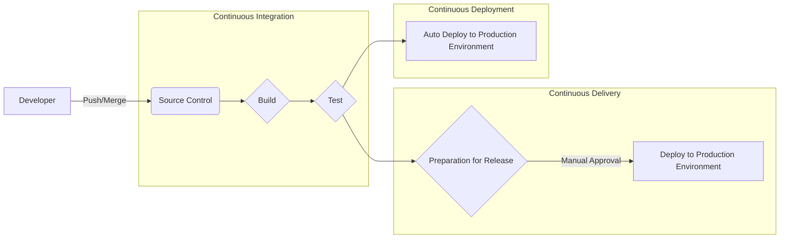
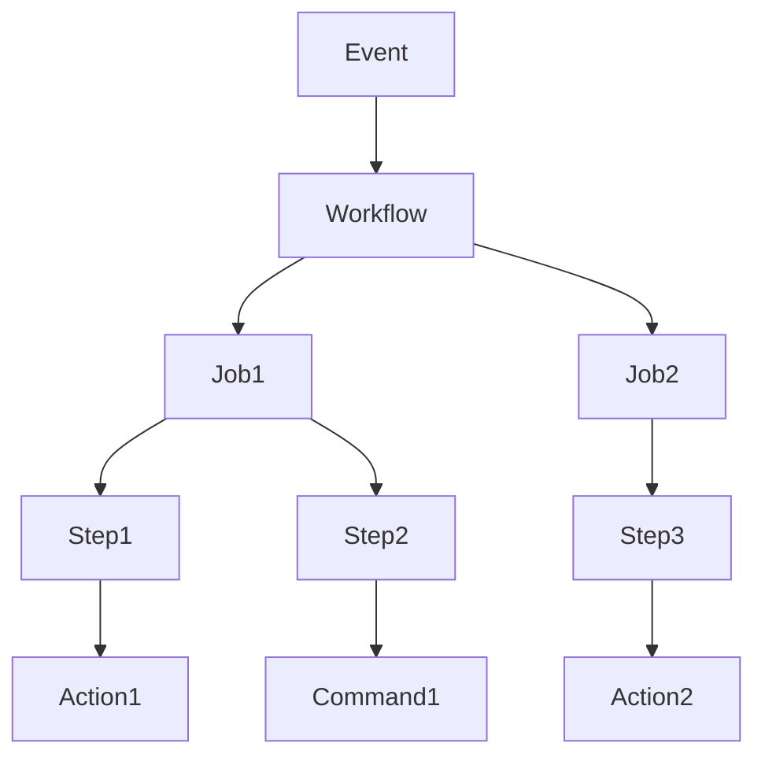
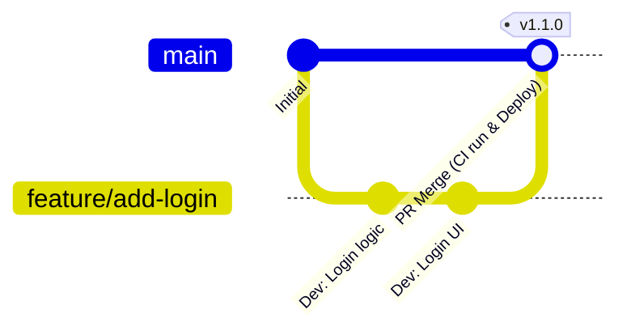

# Introduction: The Importance of CI/CD in Modern Software Development

The speed and quality of software development are among the most critical factors that determine competitiveness in today's business. The core technology to achieve both is **CI/CD** (Continuous Integration / Continuous Delivery and Deployment).

In this article, we will explain everything from the basic concepts of CI/CD to practical pipeline construction using **GitHub Actions**, the de facto standard of modern development platforms, and best practices useful in real-world scenarios, complete with detailed code examples and illustrations.

## What is CI/CD?

CI/CD is a practice for constantly testing software changes and releasing them to the production environment safely and quickly.

### Continuous Integration (CI)

A practice where developers merge their code into a shared repository frequently (ideally multiple times a day). Every time code is merged, automated builds and tests are executed to detect integration errors early.

*   **Goal:** Early bug detection and reduction of integration pain (integration hell).
*   **Main processes:** Code compilation, static analysis (Lint), unit testing.

### Continuous Delivery (CD) and Continuous Deployment (CD)

An extension of CI, this is the process of automatically preparing software in a releasable state.

*   **Continuous Delivery:** Maintains a state where you are always ready to deploy to the production environment. Actual deployments are triggered manually.
*   **Continuous Deployment:** Automatically deploys every change that passes tests to the production environment without human intervention.



---

# Basic Knowledge of GitHub Actions

GitHub Actions is a powerful platform that allows you to automate software development workflows directly within a GitHub repository. Beyond CI/CD, it can automate any repository-related tasks, such as automatically organizing issues or generating release notes.

## Core Concepts

To master GitHub Actions, you need to understand the following basic concepts:

1.  **Workflow:** An automated process that runs one or more jobs. Defined in a YAML file.
2.  **Event:** A specific activity that triggers the execution of a workflow (e.g., `push`, `pull_request`, scheduled execution `schedule`, etc.).
3.  **Job:** A set of steps executed on the same runner. By default, jobs run in parallel, but dependencies can also be configured.
4.  **Step:** Individual tasks that run commands or call actions within a job.
5.  **Action:** Reusable, standalone commands that perform complex, frequently repeated tasks (e.g., checking out a repository, setting up Node.js).
6.  **Runner:** The server that executes workflows. There are runners hosted by GitHub (Ubuntu, Windows, macOS) and self-hosted runners that you host yourself.



---

# Practical Construction of a CI/CD Pipeline using GitHub Actions

From here, we will explain step-by-step how to build a CI pipeline while looking at a concrete YAML file. We will assume a Node.js (TypeScript) project as an example.

## 1. Basic CI Workflow

First, we will create a basic workflow that installs dependencies and runs tests when code is pushed or a Pull Request is created.

Create `.github/workflows/ci.yml` in the project root and write the following:

```yaml
name: Node.js CI

on:
  push:
    branches: [ "main", "develop" ]
  pull_request:
    branches: [ "main", "develop" ]

jobs:
  build:
    runs-on: ubuntu-latest

    steps:
    - name: Checkout code
      uses: actions/checkout@v4

    - name: Setup Node.js
      uses: actions/setup-node@v4
      with:
        node-version: '20'

    - name: Install dependencies
      run: npm ci

    - name: Run build
      run: npm run build

    - name: Run tests
      run: npm test
```

### Explanation of Key Points

*   **`on:`** Triggered by `push` and `pull_request` to the `main` and `develop` branches.
*   **`actions/checkout@v4`:** Downloads the repository code to the workspace. It is almost mandatory as the first step of CI.
*   **`actions/setup-node@v4`:** Sets up the specified version of the Node.js environment.
*   **`npm ci`:** Faster than `npm install` and performs an installation strictly based on `package-lock.json`, making it suitable for CI environments.

## 2. Optimizing Execution Speed: Utilizing Cache

The execution time of CI directly impacts the developer's feedback loop. Utilizing caching to reduce dependency download time is a **best practice**.

`actions/setup-node` has a built-in caching feature.

```yaml
    - name: Setup Node.js
      uses: actions/setup-node@v4
      with:
        node-version: '20'
        cache: 'npm' # Cache npm dependencies
```

This caches the `~/.npm` directory using the hash value of `package-lock.json` as a key, dramatically speeding up subsequent executions.

## 3. Quality Assurance: Lint and Format

To maintain consistent code quality, Lint (static analysis) and Format (code formatting) checks should be included before builds or tests.

```yaml
jobs:
  lint-and-test:
    runs-on: ubuntu-latest
    steps:
      - uses: actions/checkout@v4
      - uses: actions/setup-node@v4
        with:
          node-version: '20'
          cache: 'npm'
      
      - run: npm ci

      - name: Run ESLint
        run: npm run lint

      - name: Check Prettier
        run: npm run format:check

      - name: Run tests
        run: npm test
```

## 4. Security Scanning (DevSecOps)

In modern CI/CD, the **DevSecOps** approach of automating security checks is essential. By using GitHub Actions, you can easily incorporate security scans.

### Dependency Vulnerability Scanning (npm audit)

```yaml
      - name: Scan vulnerabilities
        run: npm audit
```

### Static Application Security Testing (SAST)

You can scan for vulnerabilities in the source code itself using features like CodeQL in GitHub Advanced Security. (*A license may be required for private repositories.)

```yaml
  security-scan:
    runs-on: ubuntu-latest
    steps:
    - uses: actions/checkout@v4
    
    - name: Initialize CodeQL
      uses: github/codeql-action/init@v3
      with:
        languages: javascript

    - name: Perform CodeQL Analysis
      uses: github/codeql-action/analyze@v3
```

## 5. Cross-Platform Testing with Matrix Builds

When developing libraries and the like, you need to test across multiple OSs and runtime versions. Using `strategy.matrix` allows you to easily set up parallel test environments.

```yaml
jobs:
  test:
    runs-on: ${{ matrix.os }}
    strategy:
      matrix:
        node-version: [18, 20, 22]
        os: [ubuntu-latest, windows-latest, macos-latest]
        
    steps:
    - uses: actions/checkout@v4
    - name: Use Node.js ${{ matrix.node-version }} on ${{ matrix.os }}
      uses: actions/setup-node@v4
      with:
        node-version: ${{ matrix.node-version }}
    - run: npm ci
    - run: npm test
```

With this configuration, 3 Node.js versions × 3 OSs = a total of 9 jobs will be executed in parallel.

---

# Branch Strategy and CI/CD Integration

To build an effective CI/CD pipeline, it needs to be tightly integrated with the development team's **branch strategy**. Here are examples of integration with typical strategies.

## Integration with GitHub Flow

GitHub Flow is a simple strategy where the `main` branch is always kept in a deployable state, and feature additions are done in Feature branches.



*   **Feature Branch:** Every time it is `push`ed, Lint and unit tests (CI) run.
*   **Pull Request:** When a PR to `main` is created, CI is executed, and you configure protection rules so it cannot be merged unless it succeeds.
*   **main Branch:** Once merged, CI runs, and then it is automatically deployed (CD) to the staging or production environment.

## Splitting the CI/CD Pipeline

In complex projects, it is a **best practice** to split workflow files by purpose rather than creating one huge file.

1.  `pr-check.yml`: On PR creation. Lint, fast Unit Tests. (Purpose: Quick feedback)
2.  `ci-main.yml`: On `main` merge. Full build, heavy E2E tests. (Purpose: Pre-release quality assurance)
3.  `cd-deploy.yml`: On tag creation (e.g., `v1.0.0`). Deployment to the production environment. (Purpose: Release)

---

# Advanced GitHub Actions Techniques

Here we introduce advanced features to build even more practical and maintainable pipelines.

## Reusable Workflows

If multiple repositories have similar CI processes, the workflow itself can be standardized. The `workflow_call` trigger is used.

**Called side ( `.github/workflows/reusable-ci.yml` ):**

```yaml
on:
  workflow_call:
    inputs:
      node-version:
        required: true
        type: string

jobs:
  build:
    runs-on: ubuntu-latest
    steps:
      - uses: actions/checkout@v4
      - uses: actions/setup-node@v4
        with:
          node-version: ${{ inputs.node-version }}
      - run: npm ci
      - run: npm test
```

**Calling side:**

```yaml
on: [push]

jobs:
  call-workflow:
    uses: my-org/my-repo/.github/workflows/reusable-ci.yml@main
    with:
      node-version: '20'
```

## Secure Cloud Integration using OIDC (OpenID Connect)

When deploying to cloud providers like AWS, GCP, or Azure, saving long-term credentials (such as secret keys) in GitHub entails security risks.

By using OIDC, GitHub Actions jobs can request short-lived tokens from the cloud provider and authenticate securely.

For example, when deploying to AWS:

```yaml
permissions:
  id-token: write # Required for issuing OIDC tokens
  contents: read

jobs:
  deploy:
    runs-on: ubuntu-latest
    steps:
      - uses: actions/checkout@v4
      
      - name: Configure AWS Credentials
        uses: aws-actions/configure-aws-credentials@v4
        with:
          role-to-assume: arn:aws:iam::123456789012:role/my-github-actions-role
          aws-region: ap-northeast-1
          
      - name: Deploy to S3
        run: aws s3 sync ./dist s3://my-bucket/
```

Since you obtain permissions by assuming a Role without holding passwords, it is highly secure.

---

# Mathematical Effects of Adopting CI/CD

The effects of adopting CI/CD can be measured by metrics such as deployment frequency and lead time.

For example, let the deployment frequency be $\lambda$ (times/day), the time taken per manual deployment be $T_{manual}$, and the automated time be $T_{auto}$.

The reduction in deployment operation time per day $S$ can be expressed as follows:

$ S = \lambda \times (T_{manual} - T_{auto}) $

As automation progresses and $\lambda$ increases (a state where deployments occur many times a day), the reduced time $S$ becomes dramatically larger. This means that developers can invest their time in developing more valuable new features.

---

# Conclusion

In this article, we detailed everything from the basics of CI/CD to how to build practical pipelines using GitHub Actions, and the best practices required in development environments.

*   **Integrate frequently:** Merge small changes frequently to discover bugs early.
*   **Utilize cache:** Shorten workflow execution time and improve the developer experience.
*   **Automate quality and security:** Incorporate Lint, testing, and vulnerability scanning into the pipeline.
*   **Use OIDC:** For cloud provider integration, use temporary tokens via OIDC instead of secret keys.

GitHub Actions is a very flexible and powerful tool. We recommend starting with small steps, like automating Lint, and gradually expanding the pipeline as the project grows. Let's leverage the power of automation to achieve faster and higher-quality software development.
