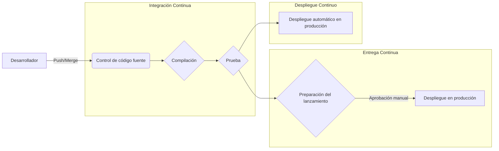
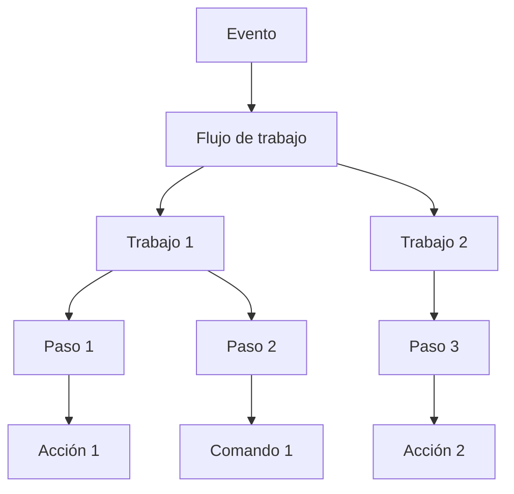
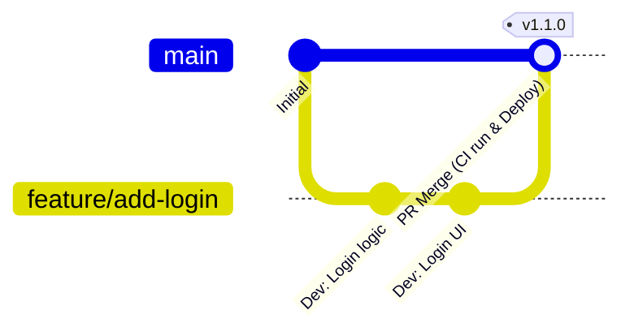

# Introducción: La importancia de CI/CD en el desarrollo de software moderno

La velocidad y la calidad en el desarrollo de software son dos de los factores más importantes que determinan la competitividad en los negocios actuales. La tecnología central para lograr ambos es **CI/CD** (Integración Continua / Entrega y Despliegue Continuos).

En este artículo, explicaremos detalladamente con ejemplos de código y diagramas desde los conceptos básicos de CI/CD, hasta la construcción práctica de pipelines usando **GitHub Actions**, el estándar de facto de las plataformas de desarrollo modernas, y las mejores prácticas útiles en el trabajo real.

## ¿Qué es CI/CD?

CI/CD es una práctica para probar continuamente los cambios de software y lanzarlos de manera segura y rápida al entorno de producción.

### Integración Continua (CI: Continuous Integration)

Es una práctica donde los desarrolladores fusionan frecuentemente (idealmente varias veces al día) su código en un repositorio compartido. Cada vez que se fusiona el código, se ejecutan compilaciones y pruebas automatizadas para detectar errores de integración de manera temprana.

*   **Objetivo:** Detección temprana de errores, mitigación del dolor de la integración (integration hell).
*   **Procesos principales:** Compilación de código, análisis estático (Lint), pruebas unitarias (Unit Test).

### Entrega Continua (CD: Continuous Delivery) y Despliegue Continuo (CD: Continuous Deployment)

Es una extensión de CI y un proceso para preparar automáticamente el software en un estado listo para ser lanzado.

*   **Entrega Continua (Continuous Delivery):** Mantiene el estado en el que siempre está listo para el despliegue en el entorno de producción. El despliegue real se activa manualmente.
*   **Despliegue Continuo (Continuous Deployment):** Despliega automáticamente en el entorno de producción todos los cambios que hayan pasado las pruebas, sin intervención humana.



---

# Conceptos básicos de GitHub Actions

GitHub Actions es una potente plataforma que permite automatizar los flujos de trabajo de desarrollo de software directamente dentro de un repositorio de GitHub. No solo CI/CD, sino que se pueden automatizar todas las tareas relacionadas con el repositorio, como la organización automática de Issues y la generación automática de notas de la versión.

## Conceptos principales

Para dominar GitHub Actions, es necesario entender los siguientes conceptos básicos.

1.  **Workflow (Flujo de trabajo):** Un proceso automatizado que ejecuta uno o más trabajos. Se define en un archivo YAML.
2.  **Event (Evento):** Una actividad específica que desencadena la ejecución de un flujo de trabajo (ej.: `push`, `pull_request`, ejecución periódica `schedule`, etc.).
3.  **Job (Trabajo):** Un conjunto de pasos que se ejecutan en el mismo runner. Por defecto, los trabajos se ejecutan en paralelo, pero también es posible establecer dependencias.
4.  **Step (Paso):** Una tarea individual que ejecuta comandos o llama a una Action dentro de un trabajo.
5.  **Action (Acción):** Un comando independiente y reutilizable que ejecuta tareas complejas y que se repiten con frecuencia (ej.: checkout del repositorio, configuración de Node.js).
6.  **Runner (Corredor):** El servidor que ejecuta el flujo de trabajo. Existen runners alojados por GitHub (Ubuntu, Windows, macOS) y runners alojados por uno mismo (self-hosted runners).



---

# Práctica: Construcción de un pipeline CI/CD con GitHub Actions

A partir de aquí, explicaremos paso a paso cómo construir un pipeline CI, observando archivos YAML específicos. Como ejemplo, supondremos un proyecto Node.js (TypeScript).

## 1. Flujo de trabajo CI básico

Primero, crearemos un flujo de trabajo básico que instale las dependencias y ejecute las pruebas cuando se envíe código (push) o se cree un Pull Request.

Cree `.github/workflows/ci.yml` en la raíz del proyecto y escriba lo siguiente.

```yaml
name: Node.js CI

on:
  push:
    branches: [ "main", "develop" ]
  pull_request:
    branches: [ "main", "develop" ]

jobs:
  build:
    runs-on: ubuntu-latest

    steps:
    - name: Checkout del código
      uses: actions/checkout@v4

    - name: Configuración de Node.js
      uses: actions/setup-node@v4
      with:
        node-version: '20'

    - name: Instalación de dependencias
      run: npm ci

    - name: Ejecución de la compilación
      run: npm run build

    - name: Ejecución de pruebas
      run: npm test
```

### Explicación de los puntos clave

*   **`on:`** Se activa mediante un `push` y un `pull_request` a las ramas `main` y `develop`.
*   **`actions/checkout@v4`:** Descarga el código del repositorio al espacio de trabajo. Es casi obligatorio como primer paso del CI.
*   **`actions/setup-node@v4`:** Construye el entorno Node.js de la versión especificada.
*   **`npm ci`:** Es más rápido que `npm install` y realiza una instalación basada estrictamente en `package-lock.json`, por lo que es adecuado para entornos CI.

## 2. Optimización de la velocidad de ejecución: Uso de caché

El tiempo de ejecución de CI afecta directamente al ciclo de retroalimentación de los desarrolladores. Utilizar la caché para reducir el tiempo de descarga de las dependencias es una **mejor práctica**.

`actions/setup-node` tiene una función de caché incorporada.

```yaml
    - name: Configuración de Node.js
      uses: actions/setup-node@v4
      with:
        node-version: '20'
        cache: 'npm' # Caché de dependencias de npm
```

Con esto, el directorio `~/.npm` se almacena en caché utilizando el valor hash de `package-lock.json` como clave, lo que acelera drásticamente las ejecuciones posteriores.

## 3. Garantía de calidad: Lint y Format

Para mantener una calidad de código uniforme, se deben incluir comprobaciones de Lint (análisis estático) y Format (formateo de código) antes de la compilación y las pruebas.

```yaml
jobs:
  lint-and-test:
    runs-on: ubuntu-latest
    steps:
      - uses: actions/checkout@v4
      - uses: actions/setup-node@v4
        with:
          node-version: '20'
          cache: 'npm'
      
      - run: npm ci

      - name: Ejecución de ESLint
        run: npm run lint

      - name: Comprobación de Prettier
        run: npm run format:check

      - name: Ejecución de pruebas
        run: npm test
```

## 4. Escaneo de seguridad (DevSecOps)

En el CI/CD moderno, el enfoque **DevSecOps** que automatiza las comprobaciones de seguridad es esencial. Utilizando GitHub Actions, se pueden integrar fácilmente escaneos de seguridad.

### Escaneo de vulnerabilidades en dependencias (npm audit)

```yaml
      - name: Escaneo de vulnerabilidades
        run: npm audit
```

### Pruebas de seguridad de aplicaciones estáticas (SAST)

Se pueden utilizar funciones de GitHub Advanced Security, como CodeQL, para escanear vulnerabilidades en el propio código fuente. (*Puede que se necesite una licencia para repositorios privados).

```yaml
  security-scan:
    runs-on: ubuntu-latest
    steps:
    - uses: actions/checkout@v4
    
    - name: Inicializar CodeQL
      uses: github/codeql-action/init@v3
      with:
        languages: javascript

    - name: Ejecutar Análisis CodeQL
      uses: github/codeql-action/analyze@v3
```

## 5. Pruebas multiplataforma mediante matrix build

Si está desarrollando una biblioteca u otra cosa similar, necesitará probarla en varios sistemas operativos y versiones de runtime. Al usar `strategy.matrix`, puede construir fácilmente un entorno de prueba en paralelo.

```yaml
jobs:
  test:
    runs-on: ${{ matrix.os }}
    strategy:
      matrix:
        node-version: [18, 20, 22]
        os: [ubuntu-latest, windows-latest, macos-latest]
        
    steps:
    - uses: actions/checkout@v4
    - name: Usar Node.js ${{ matrix.node-version }} en ${{ matrix.os }}
      uses: actions/setup-node@v4
      with:
        node-version: ${{ matrix.node-version }}
    - run: npm ci
    - run: npm test
```

Con esta configuración, se ejecutan en paralelo 3 versiones de Node.js × 3 sistemas operativos = un total de 9 trabajos.

---

# Estrategia de ramificación y vinculación con CI/CD

Para construir un pipeline CI/CD efectivo, debe estar estrechamente vinculado con la **estrategia de ramificación** del equipo de desarrollo. Explicaremos ejemplos de vinculación con estrategias representativas.

## Vinculación con GitHub Flow

GitHub Flow es una estrategia simple donde la rama `main` siempre se mantiene en un estado desplegable y la adición de funcionalidades se realiza en las ramas de características (Feature branches).



*   **Rama de características:** Cada vez que se hace un `push`, se ejecutan el Lint y las pruebas unitarias (CI).
*   **Pull Request:** Al crear un PR hacia `main`, se ejecuta el CI, y se establecen reglas de protección para que no se pueda fusionar si no tiene éxito.
*   **Rama main:** Cuando se fusiona, se ejecuta el CI y luego se despliega automáticamente (CD) en el entorno de preproducción (staging) o producción.

## División de pipelines CI/CD

En proyectos complejos, es una **mejor práctica** no crear un archivo de flujo de trabajo único y enorme, sino dividirlo por propósito.

1.  `pr-check.yml`: Al crear el PR. Lint, Pruebas unitarias rápidas. (Propósito: retroalimentación rápida)
2.  `ci-main.yml`: Al fusionar en `main`. Compilación completa, pruebas E2E pesadas. (Propósito: garantía de calidad antes del lanzamiento)
3.  `cd-deploy.yml`: Al crear etiquetas (ej.: `v1.0.0`). Despliegue en el entorno de producción. (Propósito: lanzamiento)

---

# Técnicas avanzadas de GitHub Actions

Presentamos funciones más avanzadas para construir pipelines aún más prácticos y fáciles de mantener.

## Reusable Workflows (Flujos de trabajo reutilizables)

Si tiene procesos CI similares en varios repositorios, puede compartir el flujo de trabajo en sí. Use el desencadenador `workflow_call`.

**Lado llamado ( `.github/workflows/reusable-ci.yml` ):**

```yaml
on:
  workflow_call:
    inputs:
      node-version:
        required: true
        type: string

jobs:
  build:
    runs-on: ubuntu-latest
    steps:
      - uses: actions/checkout@v4
      - uses: actions/setup-node@v4
        with:
          node-version: ${{ inputs.node-version }}
      - run: npm ci
      - run: npm test
```

**Lado que llama:**

```yaml
on: [push]

jobs:
  call-workflow:
    uses: my-org/my-repo/.github/workflows/reusable-ci.yml@main
    with:
      node-version: '20'
```

## Vinculación segura a la nube usando [OIDC](https://kenji.blog/es/p/oauth2-oidc-authentication-authorization-difference/) ([OpenID Connect](https://kenji.blog/es/p/oauth2-oidc-authentication-authorization-difference/))

Al desplegar en proveedores de la nube como AWS, GCP, Azure, etc., guardar credenciales a largo plazo (como claves secretas) en GitHub conlleva riesgos de seguridad.

Al usar OIDC, los trabajos de GitHub Actions pueden solicitar tokens temporales al proveedor de la nube para autenticarse de forma segura.

Por ejemplo, al desplegar en AWS:

```yaml
permissions:
  id-token: write # Necesario para emitir tokens OIDC
  contents: read

jobs:
  deploy:
    runs-on: ubuntu-latest
    steps:
      - uses: actions/checkout@v4
      
      - name: Configure AWS Credentials
        uses: aws-actions/configure-aws-credentials@v4
        with:
          role-to-assume: arn:aws:iam::123456789012:role/my-github-actions-role
          aws-region: ap-northeast-1
          
      - name: Deploy to S3
        run: aws s3 sync ./dist s3://my-bucket/
```

Es extremadamente seguro porque no tiene contraseñas y obtiene permisos asumiendo un rol (Assume Role).

---

# Efecto matemático de la introducción de CI/CD

El efecto de introducir CI/CD se puede medir por indicadores como la frecuencia de despliegue y el tiempo de entrega (lead time).

Por ejemplo, sea $\lambda$ la frecuencia de despliegue (veces/día), $T_{manual}$ el tiempo requerido para un despliegue manual, y $T_{auto}$ el tiempo automatizado.

La cantidad de tiempo de trabajo de despliegue ahorrado por día $S$ se puede expresar de la siguiente manera:

$ S = \lambda \times (T_{manual} - T_{auto}) $

A medida que avanza la automatización y aumenta $\lambda$ (estado de despliegue múltiple veces al día), el tiempo ahorrado $S$ aumenta drásticamente. Esto significa que los desarrolladores pueden invertir su tiempo en el desarrollo de nuevas características más valiosas.

---

# Resumen

En este artículo, explicamos detalladamente desde los conceptos básicos de CI/CD, hasta cómo construir un pipeline práctico usando GitHub Actions y las mejores prácticas requeridas en los sitios de desarrollo.

*   **Integrar frecuentemente:** Fusione pequeños cambios con frecuencia para detectar errores tempranamente.
*   **Aprovechar la caché:** Reduzca el tiempo de ejecución de los flujos de trabajo y mejore la experiencia de desarrollo.
*   **Automatizar la calidad y seguridad:** Integre Lint, pruebas y escaneos de vulnerabilidades en su pipeline.
*   **Usar [OIDC](https://kenji.blog/es/p/oauth2-oidc-authentication-authorization-difference/):** Para la vinculación con proveedores de la nube, use tokens temporales a través de OIDC en lugar de claves secretas.

GitHub Actions es una herramienta muy flexible y poderosa. Le recomendamos comenzar con pequeños pasos, como automatizar el Lint, y expandir gradualmente el pipeline a medida que crece el proyecto. ¡Use el poder de la automatización para lograr un desarrollo de software más rápido y de mayor calidad!
