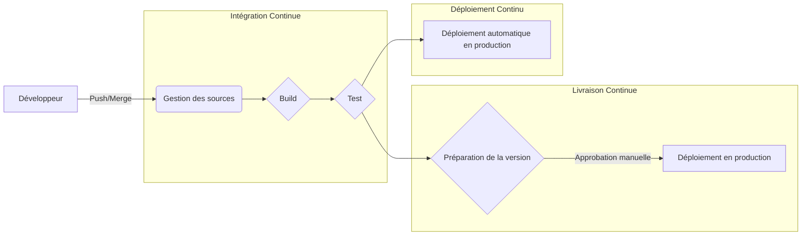
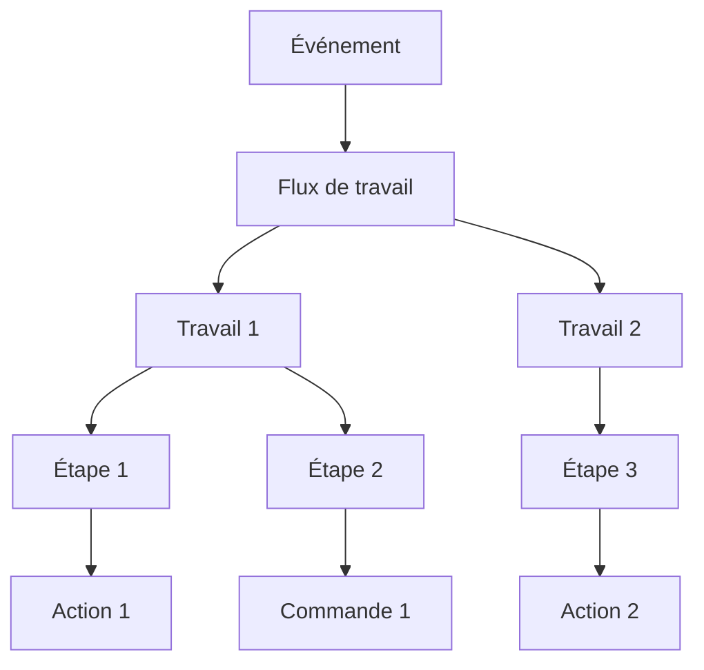
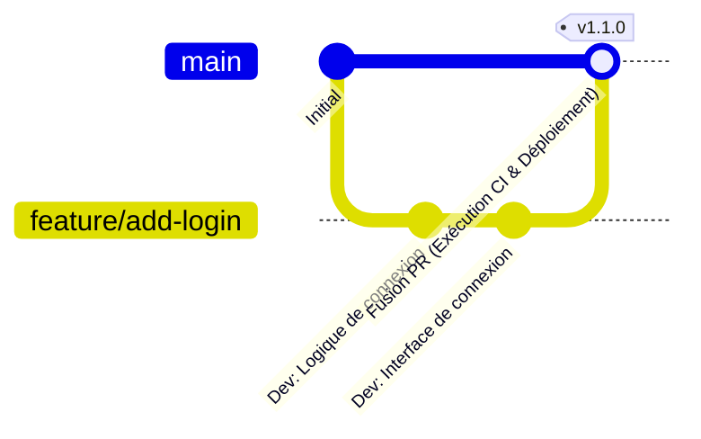

# Introduction : L'importance du CI/CD dans le développement logiciel moderne

La vitesse et la qualité du développement logiciel sont parmi les facteurs les plus importants qui déterminent la compétitivité dans les affaires d'aujourd'hui. La technologie de base pour réaliser les deux est le **CI/CD** (Intégration Continue / Livraison et Déploiement Continus).

Cet article expliquera les concepts de base du CI/CD, la construction pratique de pipelines à l'aide de **GitHub Actions**, qui est le standard de facto pour les plateformes de développement modernes, et les meilleures pratiques utiles dans la pratique, avec des exemples de code détaillés et des illustrations.

## Qu'est-ce que le CI/CD ?

Le CI/CD est une pratique consistant à tester en permanence les modifications logicielles et à les publier de manière sûre et rapide dans un environnement de production.

### Intégration Continue (CI : Continuous Integration)

Une pratique où les développeurs fusionnent fréquemment (idéalement plusieurs fois par jour) du code dans un dépôt partagé. Chaque fois que le code est fusionné, des builds et des tests automatisés sont exécutés pour découvrir tôt les erreurs d'intégration.

*   **Objectif :** Découverte précoce des bugs, réduction des difficultés d'intégration (l'enfer de l'intégration).
*   **Processus principaux :** Compilation du code, analyse statique (Lint), tests unitaires (Unit Test).

### Livraison Continue (CD : Continuous Delivery) et Déploiement Continu (CD : Continuous Deployment)

C'est une extension de l'IC et c'est un processus qui prépare automatiquement un logiciel prêt à être publié.

*   **Livraison Continue :** Maintient l'état de préparation au déploiement vers l'environnement de production en permanence. Le déploiement réel est déclenché manuellement.
*   **Déploiement Continu :** Déploie automatiquement tous les changements qui ont passé les tests vers l'environnement de production sans intervention humaine.



---

# Connaissances de base de GitHub Actions

GitHub Actions est une plateforme puissante qui vous permet d'automatiser vos flux de travail de développement logiciel directement dans votre dépôt GitHub. Vous pouvez automatiser non seulement le CI/CD, mais aussi toutes les tâches liées au dépôt, telles que l'organisation automatique des problèmes (Issues) et la génération automatique des notes de version.

## Concepts fondamentaux

Pour maîtriser GitHub Actions, vous devez comprendre les concepts de base suivants.

1.  **Workflow (Flux de travail) :** Un processus automatisé qui exécute un ou plusieurs travaux (jobs). Il est défini dans un fichier YAML.
2.  **Event (Événement) :** Une activité spécifique qui déclenche l'exécution d'un flux de travail (ex: `push`, `pull_request`, exécution périodique `schedule`, etc.).
3.  **Job (Travail) :** Un ensemble d'étapes exécutées sur le même lanceur (runner). Par défaut, les travaux s'exécutent en parallèle, mais des dépendances peuvent également être définies.
4.  **Step (Étape) :** Tâches individuelles qui exécutent des commandes ou appellent des actions (Actions) au sein d'un travail.
5.  **Action (Action) :** Des commandes autonomes et réutilisables qui effectuent des tâches complexes et fréquemment répétées (ex: extraction d'un dépôt, configuration de Node.js).
6.  **Runner (Lanceur) :** Le serveur qui exécute le flux de travail. Il existe des lanceurs hébergés par GitHub (Ubuntu, Windows, macOS) et des lanceurs auto-hébergés (self-hosted runners).



---

# Pratique de la construction de pipelines CI/CD avec GitHub Actions

À partir d'ici, nous expliquerons étape par étape comment construire un pipeline CI en examinant un fichier YAML concret. En guise d'exemple, nous supposons un projet Node.js (TypeScript).

## 1. Flux de travail CI de base

Tout d'abord, nous créons un flux de travail de base qui installe les dépendances et exécute les tests lorsque du code est poussé (push) ou qu'une Pull Request est créée.

Créez `.github/workflows/ci.yml` à la racine du projet et écrivez ce qui suit.

```yaml
name: Node.js CI

on:
  push:
    branches: [ "main", "develop" ]
  pull_request:
    branches: [ "main", "develop" ]

jobs:
  build:
    runs-on: ubuntu-latest

    steps:
    - name: Récupération du code
      uses: actions/checkout@v4

    - name: Configuration de Node.js
      uses: actions/setup-node@v4
      with:
        node-version: '20'

    - name: Installation des dépendances
      run: npm ci

    - name: Exécution de la compilation
      run: npm run build

    - name: Exécution des tests
      run: npm test
```

### Explication des points clés

*   **`on:`** Déclenché par les `push` et `pull_request` vers les branches `main` et `develop`.
*   **`actions/checkout@v4`:** Télécharge le code du dépôt dans l'espace de travail. Il est presque obligatoire comme première étape du CI.
*   **`actions/setup-node@v4`:** Configure l'environnement Node.js de la version spécifiée.
*   **`npm ci`:** Il est plus rapide que `npm install` et effectue une installation strictement basée sur `package-lock.json`, ce qui le rend adapté aux environnements CI.

## 2. Optimisation de la vitesse d'exécution : Utilisation du cache

Le temps d'exécution du CI est directement lié à la boucle de rétroaction des développeurs. L'utilisation de caches pour réduire le temps de téléchargement des dépendances est une **bonne pratique**.

La fonctionnalité de mise en cache est intégrée à `actions/setup-node`.

```yaml
    - name: Configuration de Node.js
      uses: actions/setup-node@v4
      with:
        node-version: '20'
        cache: 'npm' # Mettre en cache les dépendances npm
```

Ainsi, le répertoire `~/.npm` est mis en cache avec la valeur de hachage de `package-lock.json` comme clé, et les exécutions ultérieures seront considérablement accélérées.

## 3. Assurance qualité : Lint et Format

Pour maintenir une qualité de code uniforme, des vérifications de Lint (analyse statique) et de Format (formatage du code) doivent être incluses avant la compilation et les tests.

```yaml
jobs:
  lint-and-test:
    runs-on: ubuntu-latest
    steps:
      - uses: actions/checkout@v4
      - uses: actions/setup-node@v4
        with:
          node-version: '20'
          cache: 'npm'
      
      - run: npm ci

      - name: Exécution de ESLint
        run: npm run lint

      - name: Vérification de Prettier
        run: npm run format:check

      - name: Exécution des tests
        run: npm test
```

## 4. Analyse de sécurité (DevSecOps)

Dans le CI/CD moderne, une approche **DevSecOps** qui automatise les contrôles de sécurité est essentielle. Vous pouvez facilement intégrer des analyses de sécurité à l'aide de GitHub Actions.

### Analyse des vulnérabilités des dépendances (npm audit)

```yaml
      - name: Analyse des vulnérabilités
        run: npm audit
```

### Test statique de sécurité des applications (SAST)

Vous pouvez analyser les vulnérabilités dans le code source lui-même en utilisant CodeQL, une fonctionnalité de GitHub Advanced Security. (*Une licence peut être requise pour les dépôts privés)

```yaml
  security-scan:
    runs-on: ubuntu-latest
    steps:
    - uses: actions/checkout@v4
    
    - name: Initialisation de CodeQL
      uses: github/codeql-action/init@v3
      with:
        languages: javascript

    - name: Exécution de l'analyse CodeQL
      uses: github/codeql-action/analyze@v3
```

## 5. Tests multiplateformes avec Matrix Build

Si vous développez une bibliothèque ou similaire, vous devez la tester sur plusieurs OS ou versions de runtime. Vous pouvez facilement créer un environnement de test parallèle en utilisant `strategy.matrix`.

```yaml
jobs:
  test:
    runs-on: ${{ matrix.os }}
    strategy:
      matrix:
        node-version: [18, 20, 22]
        os: [ubuntu-latest, windows-latest, macos-latest]
        
    steps:
    - uses: actions/checkout@v4
    - name: Use Node.js ${{ matrix.node-version }} on ${{ matrix.os }}
      uses: actions/setup-node@v4
      with:
        node-version: ${{ matrix.node-version }}
    - run: npm ci
    - run: npm test
```

Avec cette configuration, 3 versions de Node.js × 3 OS = un total de 9 travaux seront exécutés en parallèle.

---

# Stratégie de branche et intégration CI/CD

Pour construire un pipeline CI/CD efficace, il doit être étroitement intégré à la **stratégie de branche** de l'équipe de développement. Nous expliquerons des exemples d'intégration avec des stratégies représentatives.

## Intégration avec GitHub Flow

GitHub Flow est une stratégie simple où la branche `main` est toujours maintenue dans un état déployable, et les ajouts de fonctionnalités sont effectués dans des branches Feature.



*   **Branche Feature :** Chaque fois qu'il y a un `push`, le Lint et les tests unitaires (CI) sont exécutés.
*   **Pull Request :** Lorsqu'une PR vers `main` est créée, le CI s'exécute, et une règle de protection est définie afin qu'elle ne puisse pas être fusionnée à moins de réussir.
*   **Branche main :** Lors de la fusion, le CI est exécuté, suivi d'un déploiement automatique (CD) vers l'environnement de staging ou de production.

## Division du pipeline CI/CD

Dans les projets complexes, il est recommandé comme **bonne pratique** de diviser par objectif plutôt que de créer un seul fichier de flux de travail volumineux.

1.  `pr-check.yml`: Lors de la création d'une PR. Lint, tests unitaires rapides. (Objectif : Rétroaction rapide)
2.  `ci-main.yml`: Lors de la fusion dans `main`. Build global, tests E2E lourds. (Objectif : Assurance qualité avant la version)
3.  `cd-deploy.yml`: Lors de la création d'une balise (ex : `v1.0.0`). Déploiement en production. (Objectif : Publication)

---

# Techniques avancées de GitHub Actions

Voici des fonctionnalités avancées pour créer des pipelines plus pratiques et plus faciles à maintenir.

## Reusable Workflows (Flux de travail réutilisables)

Si vous avez des processus CI similaires sur plusieurs dépôts, vous pouvez standardiser les flux de travail eux-mêmes. Utilisez le déclencheur `workflow_call`.

**Côté appelé ( `.github/workflows/reusable-ci.yml` ) :**

```yaml
on:
  workflow_call:
    inputs:
      node-version:
        required: true
        type: string

jobs:
  build:
    runs-on: ubuntu-latest
    steps:
      - uses: actions/checkout@v4
      - uses: actions/setup-node@v4
        with:
          node-version: ${{ inputs.node-version }}
      - run: npm ci
      - run: npm test
```

**Côté appelant :**

```yaml
on: [push]

jobs:
  call-workflow:
    uses: my-org/my-repo/.github/workflows/reusable-ci.yml@main
    with:
      node-version: '20'
```

## Intégration sécurisée du cloud avec [OIDC](https://kenji.blog/fr/p/oauth2-oidc-authentication-authorization-difference/) ([OpenID Connect](https://kenji.blog/fr/p/oauth2-oidc-authentication-authorization-difference/))

Lors d'un déploiement vers des fournisseurs de cloud comme AWS, GCP ou Azure, la conservation d'informations d'identification à long terme (telles que des clés secrètes) dans GitHub présente des risques de sécurité.

En utilisant OIDC, un travail GitHub Actions peut demander un jeton temporaire au fournisseur de cloud et s'authentifier de manière sécurisée.

Par exemple, lors du déploiement sur AWS :

```yaml
permissions:
  id-token: write # Nécessaire pour émettre un jeton OIDC
  contents: read

jobs:
  deploy:
    runs-on: ubuntu-latest
    steps:
      - uses: actions/checkout@v4
      
      - name: Configurer les identifiants AWS
        uses: aws-actions/configure-aws-credentials@v4
        with:
          role-to-assume: arn:aws:iam::123456789012:role/my-github-actions-role
          aws-region: ap-northeast-1
          
      - name: Déployer sur S3
        run: aws s3 sync ./dist s3://my-bucket/
```

C'est très sécurisé car aucune mot de passe n'est conservé, mais les autorisations sont obtenues en assumant un rôle (Assume Role).

---

# Effets mathématiques de l'adoption du CI/CD

Les effets de l'introduction du CI/CD peuvent être mesurés par des métriques telles que la fréquence de déploiement et le délai d'exécution.

Par exemple, soit $\lambda$ la fréquence de déploiement (fois/jour), $T_{manual}$ le temps requis pour un déploiement manuel et $T_{auto}$ le temps automatisé.

Le montant de réduction du temps de travail de déploiement par jour $S$ peut être exprimé comme suit :

$ S = \lambda \times (T_{manual} - T_{auto}) $

Au fur et à mesure que l'automatisation progresse et que $\lambda$ augmente (se déployant plusieurs fois par jour), le temps économisé $S$ deviendra considérablement plus important. Cela signifie que les développeurs peuvent investir leur temps dans le développement de nouvelles fonctionnalités plus précieuses.

---

# Résumé

Cet article a détaillé les bases du CI/CD, comment créer des pipelines pratiques à l'aide de GitHub Actions et les meilleures pratiques requises dans les environnements de développement.

*   **Intégrer fréquemment :** Fusionnez fréquemment de petits changements pour détecter les bugs tôt.
*   **Utiliser le cache :** Réduisez le temps d'exécution du flux de travail et améliorez l'expérience de développement.
*   **Automatiser la qualité et la sécurité :** Intégrez le Lint, les tests et les analyses de vulnérabilité dans votre pipeline.
*   **Utiliser [OIDC](https://kenji.blog/fr/p/oauth2-oidc-authentication-authorization-difference/) :** Utilisez un jeton temporaire via OIDC au lieu de clés secrètes pour l'intégration avec les fournisseurs de cloud.

GitHub Actions est un outil très flexible et puissant. Nous vous recommandons de commencer par de petites étapes comme l'automatisation du Lint et d'étendre progressivement votre pipeline à mesure que le projet se développe. Utilisons la puissance de l'automatisation pour réaliser un développement logiciel plus rapide et de meilleure qualité.
