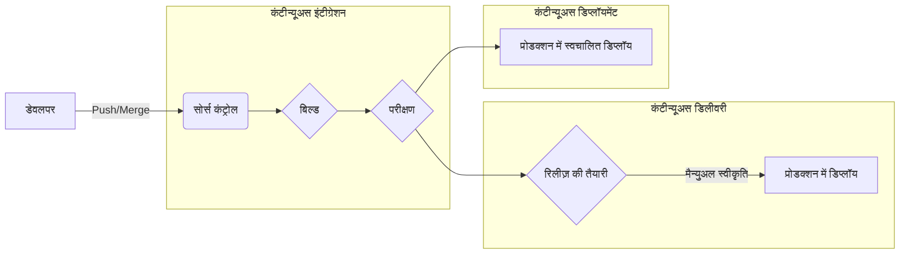
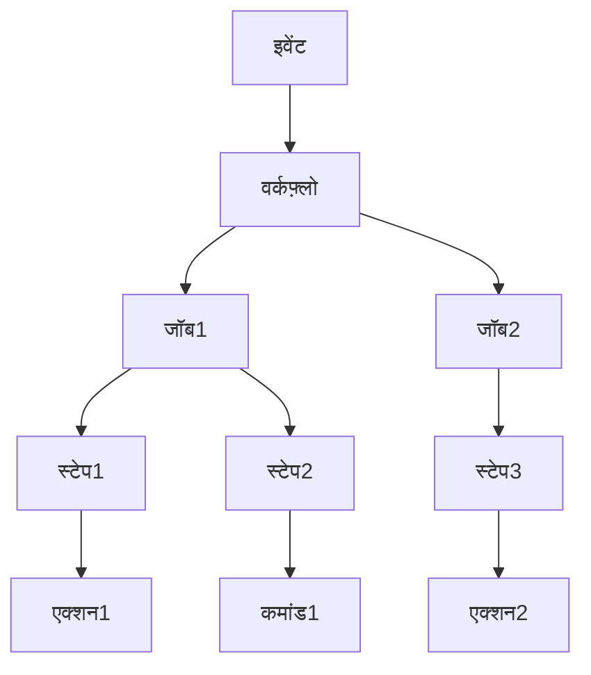
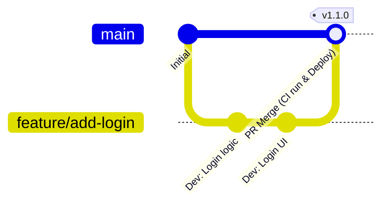

# परिचय: आधुनिक सॉफ़्टवेयर डेवलपमेंट में CI/CD का महत्व

सॉफ़्टवेयर डेवलपमेंट की गति और गुणवत्ता आज के व्यवसाय में प्रतिस्पर्धात्मकता निर्धारित करने वाले सबसे महत्वपूर्ण कारकों में से एक है। इसे प्राप्त करने के लिए मुख्य तकनीक **CI/CD** (कंटीन्यूअस इंटीग्रेशन / कंटीन्यूअस डिलीवरी और डिप्लॉयमेंट) है।

इस लेख में, हम विस्तृत कोड उदाहरणों और चित्रों के साथ CI/CD की बुनियादी अवधारणाओं से लेकर **GitHub Actions** (जो आधुनिक डेवलपमेंट प्लेटफ़ॉर्म का वास्तविक मानक है) का उपयोग करके एक व्यावहारिक पाइपलाइन बनाने और व्यावहारिक सर्वोत्तम प्रथाओं (best practices) तक सब कुछ समझाएंगे।

## CI/CD क्या है?

CI/CD सॉफ़्टवेयर परिवर्तनों का लगातार परीक्षण करने और उन्हें सुरक्षित और तेज़ी से प्रोडक्शन वातावरण में रिलीज़ करने की एक प्रथा है।

### कंटीन्यूअस इंटीग्रेशन (CI: Continuous Integration)

यह एक ऐसी प्रथा है जहाँ डेवलपर्स अपने कोड को साझा रिपॉजिटरी में बार-बार (आदर्श रूप से दिन में कई बार) मर्ज करते हैं। हर बार कोड मर्ज होने पर, स्वचालित बिल्ड और परीक्षण निष्पादित किए जाते हैं ताकि एकीकरण त्रुटियों का जल्दी पता लगाया जा सके।

*   **उद्देश्य:** बग्स का जल्दी पता लगाना, एकीकरण की परेशानी (integration hell) को कम करना।
*   **मुख्य प्रक्रियाएँ:** कोड कंपाइलेशन, स्टैटिक एनालिसिस (Lint), यूनिट टेस्ट (Unit Test)।

### कंटीन्यूअस डिलीवरी (CD: Continuous Delivery) और कंटीन्यूअस डिप्लॉयमेंट (CD: Continuous Deployment)

ये CI का विस्तार हैं, जो स्वचालित रूप से सॉफ़्टवेयर को रिलीज़ करने योग्य स्थिति में तैयार करते हैं।

*   **कंटीन्यूअस डिलीवरी:** यह प्रोडक्शन वातावरण में डिप्लॉयमेंट के लिए हमेशा तैयार स्थिति बनाए रखता है। वास्तविक डिप्लॉयमेंट मैन्युअल रूप से ट्रिगर किया जाता है।
*   **कंटीन्यूअस डिप्लॉयमेंट:** परीक्षण पास करने वाले सभी परिवर्तन मानवीय हस्तक्षेप के बिना स्वचालित रूप से प्रोडक्शन वातावरण में डिप्लॉय हो जाते हैं।



---

# GitHub Actions का बुनियादी ज्ञान

GitHub Actions एक शक्तिशाली प्लेटफ़ॉर्म है जो आपको सीधे अपने GitHub रिपॉजिटरी के भीतर सॉफ़्टवेयर डेवलपमेंट वर्कफ़्लो को स्वचालित करने की अनुमति देता है। आप न केवल CI/CD बल्कि रिपॉजिटरी से संबंधित सभी कार्यों को स्वचालित कर सकते हैं, जैसे स्वचालित रूप से इश्यू (Issue) व्यवस्थित करना और रिलीज़ नोट्स तैयार करना।

## मुख्य अवधारणाएँ

GitHub Actions में महारत हासिल करने के लिए, आपको निम्नलिखित बुनियादी अवधारणाओं को समझने की आवश्यकता है।

1.  **Workflow (वर्कफ़्लो):** एक या अधिक जॉब्स (jobs) निष्पादित करने वाली एक स्वचालित प्रक्रिया। इसे YAML फ़ाइल में परिभाषित किया जाता है।
2.  **Event (इवेंट):** विशिष्ट गतिविधि जो वर्कफ़्लो निष्पादन को ट्रिगर करती है (उदाहरण: `push`, `pull_request`, आवधिक निष्पादन `schedule`, आदि)।
3.  **Job (जॉब):** एक ही रनर (runner) पर निष्पादित होने वाले स्टेप्स का एक समूह। डिफ़ॉल्ट रूप से जॉब्स समानांतर में चलते हैं, लेकिन निर्भरता सेट करना भी संभव है।
4.  **Step (स्टेप):** एक व्यक्तिगत कार्य जो किसी जॉब के भीतर एक कमांड चलाता है या किसी Action को कॉल करता है।
5.  **Action (एक्शन):** एक पुन: प्रयोज्य, स्टैंडअलोन कमांड जो जटिल, अक्सर दोहराए जाने वाले कार्यों को निष्पादित करता है। (उदाहरण: रिपॉजिटरी चेकआउट, Node.js सेटअप)।
6.  **Runner (रनर):** वह सर्वर जो वर्कफ़्लो चलाता है। इसमें GitHub द्वारा होस्ट किए गए रनर (Ubuntu, Windows, macOS) और स्वयं होस्ट किए गए (self-hosted) रनर शामिल हैं।



---

# GitHub Actions का उपयोग करके CI/CD पाइपलाइन बनाने का अभ्यास

यहां से, हम एक विशिष्ट YAML फ़ाइल को देखते हुए चरण-दर-चरण CI पाइपलाइन बनाने का तरीका समझाएंगे। एक उदाहरण के रूप में, हम एक Node.js (TypeScript) प्रोजेक्ट मानेंगे।

## 1. बुनियादी CI वर्कफ़्लो

सबसे पहले, आइए एक बुनियादी वर्कफ़्लो बनाएं जो कोड पुश होने या पुल रिक्वेस्ट बनने पर निर्भरता को स्थापित करता है और परीक्षण करता है।

प्रोजेक्ट रूट में `.github/workflows/ci.yml` बनाएं और इसे इस प्रकार लिखें।

```yaml
name: Node.js CI

on:
  push:
    branches: [ "main", "develop" ]
  pull_request:
    branches: [ "main", "develop" ]

jobs:
  build:
    runs-on: ubuntu-latest

    steps:
    - name: कोड चेकआउट
      uses: actions/checkout@v4

    - name: Node.js का सेटअप
      uses: actions/setup-node@v4
      with:
        node-version: '20'

    - name: निर्भरता इंस्टॉल करें
      run: npm ci

    - name: बिल्ड निष्पादित करें
      run: npm run build

    - name: परीक्षण निष्पादित करें
      run: npm test
```

### महत्वपूर्ण बिंदुओं की व्याख्या

*   **`on:`** यह `main` और `develop` ब्रांचों में `push` और `pull_request` को ट्रिगर के रूप में उपयोग करता है।
*   **`actions/checkout@v4`:** वर्कस्पेस में रिपॉजिटरी का कोड डाउनलोड करता है। CI के पहले स्टेप के रूप में यह लगभग अनिवार्य है।
*   **`actions/setup-node@v4`:** निर्दिष्ट Node.js संस्करण का वातावरण स्थापित करता है।
*   **`npm ci`:** यह `npm install` की तुलना में तेज़ है और `package-lock.json` के आधार पर कड़ाई से इंस्टॉलेशन करता है, जिससे यह CI वातावरण के लिए उपयुक्त हो जाता है।

## 2. निष्पादन की गति को अनुकूलित करना: कैश का उपयोग करना

CI का निष्पादन समय सीधे डेवलपर्स के फीडबैक लूप से जुड़ा होता है। निर्भरता डाउनलोड समय को कम करने के लिए कैश का उपयोग करना एक **सर्वोत्तम प्रथा (best practice)** है।

`actions/setup-node` में अंतर्निहित कैश कार्यक्षमता है।

```yaml
    - name: Node.js का सेटअप
      uses: actions/setup-node@v4
      with:
        node-version: '20'
        cache: 'npm' # npm निर्भरता को कैश करें
```

इसके परिणामस्वरूप, `~/.npm` डायरेक्टरी को `package-lock.json` की हैश वैल्यू को कुंजी के रूप में उपयोग करके कैश किया जाता है, जो बाद के निष्पादन को नाटकीय रूप से गति देता है।

## 3. गुणवत्ता आश्वासन: Lint और Format

कोड की समान गुणवत्ता बनाए रखने के लिए, बिल्ड और परीक्षण से पहले Lint (स्टैटिक एनालिसिस) और Format (कोड फॉर्मेटिंग) जांच शामिल की जानी चाहिए।

```yaml
jobs:
  lint-and-test:
    runs-on: ubuntu-latest
    steps:
      - uses: actions/checkout@v4
      - uses: actions/setup-node@v4
        with:
          node-version: '20'
          cache: 'npm'
      
      - run: npm ci

      - name: ESLint चलाएं
        run: npm run lint

      - name: Prettier जांचें
        run: npm run format:check

      - name: परीक्षण निष्पादित करें
        run: npm test
```

## 4. सुरक्षा स्कैनिंग (DevSecOps)

आधुनिक CI/CD में सुरक्षा जांचों को स्वचालित करने के लिए एक **DevSecOps** दृष्टिकोण आवश्यक है। GitHub Actions का उपयोग करके आप आसानी से सुरक्षा स्कैन को एकीकृत कर सकते हैं।

### निर्भरता भेद्यता स्कैन (npm audit)

```yaml
      - name: भेद्यता स्कैन
        run: npm audit
```

### स्टेटिक एप्लीकेशन सिक्योरिटी टेस्टिंग (SAST)

GitHub Advanced Security की सुविधाओं, जैसे CodeQL, का उपयोग करके, आप स्वयं स्रोत कोड में कमजोरियों को स्कैन कर सकते हैं। (*निजी रिपॉजिटरी के लिए लाइसेंस की आवश्यकता हो सकती है)

```yaml
  security-scan:
    runs-on: ubuntu-latest
    steps:
    - uses: actions/checkout@v4
    
    - name: CodeQL इनिशियलाइज़ करें
      uses: github/codeql-action/init@v3
      with:
        languages: javascript

    - name: CodeQL विश्लेषण करें
      uses: github/codeql-action/analyze@v3
```

## 5. मैट्रिक्स बिल्ड के माध्यम से क्रॉस-प्लेटफ़ॉर्म परीक्षण

यदि आप कोई लाइब्रेरी आदि विकसित कर रहे हैं, तो आपको कई ओएस और रनटाइम संस्करणों पर परीक्षण करने की आवश्यकता है। `strategy.matrix` का उपयोग करके, आप आसानी से एक समानांतर परीक्षण वातावरण बना सकते हैं।

```yaml
jobs:
  test:
    runs-on: ${{ matrix.os }}
    strategy:
      matrix:
        node-version: [18, 20, 22]
        os: [ubuntu-latest, windows-latest, macos-latest]
        
    steps:
    - uses: actions/checkout@v4
    - name: ${{ matrix.os }} पर Node.js ${{ matrix.node-version }} का उपयोग करें
      uses: actions/setup-node@v4
      with:
        node-version: ${{ matrix.node-version }}
    - run: npm ci
    - run: npm test
```

इस सेटिंग के साथ, 3 Node.js संस्करण × 3 OS = कुल 9 जॉब समानांतर रूप से चलेंगे।

---

# ब्रांच रणनीति और CI/CD का एकीकरण

एक प्रभावी CI/CD पाइपलाइन बनाने के लिए, इसे डेवलपमेंट टीम की **ब्रांच रणनीति** के साथ बारीकी से एकीकृत किया जाना चाहिए। यहाँ विशिष्ट रणनीतियों के साथ एकीकरण के उदाहरण दिए गए हैं।

## GitHub Flow के साथ एकीकरण

GitHub Flow एक सरल रणनीति है जो हमेशा `main` ब्रांच को डिप्लॉय करने योग्य स्थिति में रखती है और नई सुविधाओं को Feature ब्रांचों में जोड़ती है।



*   **Feature ब्रांच:** हर बार `push` होने पर Lint और यूनिट टेस्ट (CI) चलते हैं।
*   **Pull Request:** `main` के लिए PR बनाते समय, CI निष्पादित किया जाता है और सुरक्षा नियम सेट किए जाते हैं ताकि जब तक यह सफल न हो, इसे मर्ज न किया जा सके।
*   **main ब्रांच:** जब मर्ज किया जाता है, तो CI चलता है, और फिर स्वचालित रूप से स्टेजिंग या प्रोडक्शन वातावरण में डिप्लॉय (CD) हो जाता है।

## CI/CD पाइपलाइन का विभाजन

जटिल प्रोजेक्ट्स में, एक विशाल वर्कफ़्लो फ़ाइल बनाने के बजाय उन्हें उद्देश्य के अनुसार विभाजित करना एक **सर्वोत्तम प्रथा** है।

1.  `pr-check.yml`: PR बनाते समय। Lint, तेज़ यूनिट टेस्ट। (उद्देश्य: त्वरित प्रतिक्रिया)
2.  `ci-main.yml`: `main` मर्ज करते समय। समग्र बिल्ड, भारी E2E परीक्षण। (उद्देश्य: रिलीज़ से पहले गुणवत्ता आश्वासन)
3.  `cd-deploy.yml`: टैग बनाते समय (उदाहरण: `v1.0.0`)। प्रोडक्शन वातावरण में डिप्लॉयमेंट। (उद्देश्य: रिलीज़)

---

# उन्नत GitHub Actions तकनीकें

अधिक व्यावहारिक और बनाए रखने में आसान पाइपलाइन बनाने के लिए यहाँ कुछ उन्नत सुविधाएँ दी गई हैं।

## पुन: प्रयोज्य वर्कफ़्लो (Reusable Workflows)

यदि कई रिपॉजिटरी में समान CI प्रक्रियाएँ हैं, तो आप वर्कफ़्लो को ही साझा कर सकते हैं। `workflow_call` ट्रिगर का उपयोग करें।

**कॉल किया जाने वाला पक्ष ( `.github/workflows/reusable-ci.yml` ):**

```yaml
on:
  workflow_call:
    inputs:
      node-version:
        required: true
        type: string

jobs:
  build:
    runs-on: ubuntu-latest
    steps:
      - uses: actions/checkout@v4
      - uses: actions/setup-node@v4
        with:
          node-version: ${{ inputs.node-version }}
      - run: npm ci
      - run: npm test
```

**कॉल करने वाला पक्ष:**

```yaml
on: [push]

jobs:
  call-workflow:
    uses: my-org/my-repo/.github/workflows/reusable-ci.yml@main
    with:
      node-version: '20'
```

## [OIDC](https://kenji.blog/hi/p/oauth2-oidc-authentication-authorization-difference/) ([OpenID Connect](https://kenji.blog/hi/p/oauth2-oidc-authentication-authorization-difference/)) का उपयोग करके सुरक्षित क्लाउड एकीकरण

AWS, GCP, या Azure जैसे क्लाउड प्रदाताओं में डिप्लॉय करते समय, GitHub में दीर्घकालिक क्रेडेंशियल्स (जैसे सीक्रेट कुंजियाँ) को सहेजना सुरक्षा जोखिम पैदा करता है।

OIDC का उपयोग करके, GitHub Actions जॉब क्लाउड प्रदाता से अस्थायी टोकन का अनुरोध कर सकते हैं और सुरक्षित रूप से प्रमाणित हो सकते हैं।

उदाहरण के लिए, AWS में डिप्लॉय करते समय:

```yaml
permissions:
  id-token: write # OIDC टोकन जारी करने के लिए आवश्यक
  contents: read

jobs:
  deploy:
    runs-on: ubuntu-latest
    steps:
      - uses: actions/checkout@v4
      
      - name: AWS क्रेडेंशियल्स कॉन्फ़िगर करें
        uses: aws-actions/configure-aws-credentials@v4
        with:
          role-to-assume: arn:aws:iam::123456789012:role/my-github-actions-role
          aws-region: ap-northeast-1
          
      - name: S3 पर डिप्लॉय करें
        run: aws s3 sync ./dist s3://my-bucket/
```

यह बहुत सुरक्षित है क्योंकि यह बिना पासवर्ड के रोल (Role) को मानकर (Assume Role) विशेषाधिकार प्राप्त करता है।

---

# CI/CD कार्यान्वयन के गणितीय प्रभाव

CI/CD को लागू करने के प्रभाव को डिप्लॉयमेंट आवृत्ति और लीड समय जैसे मेट्रिक्स का उपयोग करके मापा जा सकता है।

उदाहरण के लिए, मान लें कि डिप्लॉयमेंट आवृत्ति $\lambda$ (बार/दिन) है, एक मैनुअल डिप्लॉयमेंट के लिए लिया गया समय $T_{manual}$ है, और स्वचालित समय $T_{auto}$ है।

प्रति दिन बचाए गए डिप्लॉयमेंट कार्य समय $S$ को इस प्रकार व्यक्त किया जा सकता है:

$ S = \lambda \times (T_{manual} - T_{auto}) $

जैसे-जैसे स्वचालन बढ़ता है और $\lambda$ बढ़ता है (एक दिन में कई डिप्लॉयमेंट), बचाया गया समय $S$ नाटकीय रूप से बढ़ता है। इसका मतलब यह है कि डेवलपर्स अधिक मूल्यवान नई सुविधाएँ विकसित करने में अपना समय लगा सकते हैं।

---

# निष्कर्ष

इस लेख में, हमने CI/CD की बुनियादी बातों से लेकर GitHub Actions का उपयोग करके एक व्यावहारिक पाइपलाइन बनाने के तरीके और विकास स्थलों पर आवश्यक सर्वोत्तम प्रथाओं तक विस्तार से बताया है।

*   **बार-बार एकीकृत करें:** बग्स का जल्दी पता लगाने के लिए छोटे बदलावों को बार-बार मर्ज करें।
*   **कैश का उपयोग करें:** वर्कफ़्लो निष्पादन के समय को कम करें और विकास के अनुभव को बढ़ाएं।
*   **गुणवत्ता और सुरक्षा को स्वचालित करें:** अपनी पाइपलाइन में Lint, परीक्षण और भेद्यता स्कैन शामिल करें।
*   **[OIDC](https://kenji.blog/hi/p/oauth2-oidc-authentication-authorization-difference/) का उपयोग करें:** क्लाउड प्रदाताओं के साथ एकीकरण के लिए गुप्त कुंजियों के बजाय OIDC के अस्थायी टोकन का उपयोग करें।

GitHub Actions एक बहुत ही लचीला और शक्तिशाली उपकरण है। हम अनुशंसा करते हैं कि आप Lint को स्वचालित करने जैसे छोटे कदम से शुरुआत करें और जैसे-जैसे आपका प्रोजेक्ट बढ़ता है, धीरे-धीरे अपनी पाइपलाइन का विस्तार करें। स्वचालन की शक्ति के साथ तेज़, उच्च-गुणवत्ता वाले सॉफ़्टवेयर विकास को प्राप्त करें।
