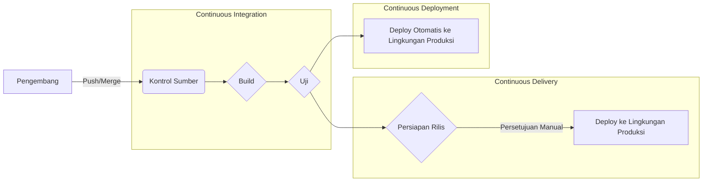
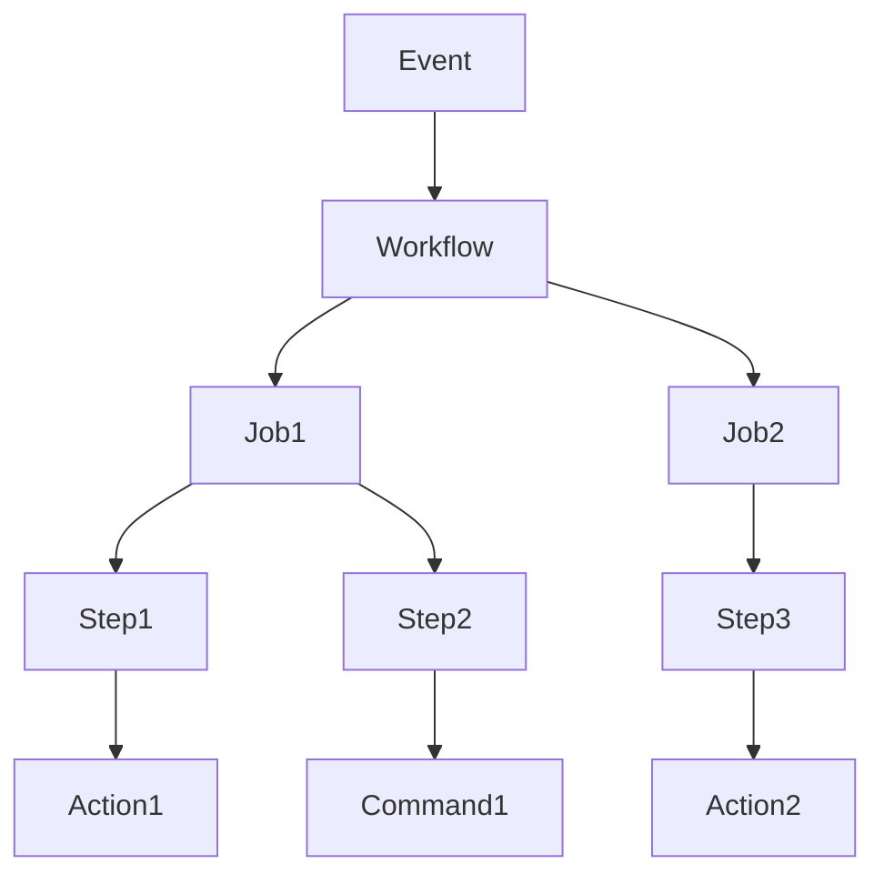
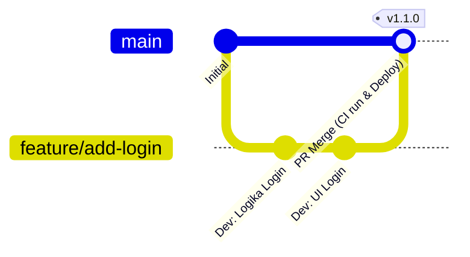

# Pengantar: Pentingnya CI/CD dalam Pengembangan Perangkat Lunak Modern

Kecepatan dan kualitas pengembangan perangkat lunak adalah salah satu faktor terpenting yang menentukan daya saing dalam bisnis saat ini. Teknologi inti untuk mencapai keduanya adalah **CI/CD** (Continuous Integration / Continuous Delivery/Deployment).

Dalam artikel ini, kami akan menjelaskan mulai dari konsep dasar CI/CD, pembangunan pipeline praktis menggunakan **GitHub Actions** yang merupakan standar *de facto* platform pengembangan modern, hingga praktik terbaik yang berguna dalam pekerjaan nyata, disertai dengan contoh kode dan ilustrasi yang detail.

## Apa itu CI/CD?

CI/CD adalah praktik untuk terus-menerus menguji perubahan perangkat lunak dan merilisnya ke lingkungan produksi dengan aman dan cepat.

### Continuous Integration (CI)

Ini adalah praktik di mana pengembang sering menggabungkan kode ke dalam repositori bersama (idealnya beberapa kali sehari). Setiap kali kode digabungkan, proses kompilasi (*build*) dan pengujian otomatis dijalankan untuk mendeteksi kesalahan integrasi sejak dini.

*   **Tujuan:** Deteksi bug sejak dini, mengurangi kesulitan integrasi (*integration hell*).
*   **Proses Utama:** Kompilasi kode, analisis statis (Lint), pengujian unit (Unit Test).

### Continuous Delivery (CD) dan Continuous Deployment (CD)

Keduanya merupakan perpanjangan dari CI, sebuah proses untuk secara otomatis menyiapkan perangkat lunak agar selalu dalam keadaan siap rilis.

*   **Continuous Delivery:** Mempertahankan keadaan agar selalu siap di-*deploy* ke lingkungan produksi. Pen-deploy-an aktual dipicu secara manual.
*   **Continuous Deployment:** Secara otomatis men-*deploy* semua perubahan yang telah lulus pengujian ke lingkungan produksi tanpa campur tangan manusia.



---

# Pengetahuan Dasar GitHub Actions

GitHub Actions adalah platform kuat yang dapat mengotomatiskan alur kerja (*workflow*) pengembangan perangkat lunak secara langsung di dalam repositori GitHub. Anda tidak hanya dapat mengotomatiskan CI/CD, tetapi juga segala hal terkait repositori, seperti pengaturan masalah (Issues) otomatis atau pembuatan catatan rilis secara otomatis.

## Konsep Inti

Untuk menguasai GitHub Actions, Anda perlu memahami konsep-konsep dasar berikut.

1.  **Workflow:** Proses otomatis yang menjalankan satu pekerjaan atau lebih. Didefinisikan dalam file YAML.
2.  **Event:** Aktivitas tertentu yang memicu eksekusi *workflow* (misalnya: `push`, `pull_request`, eksekusi berkala `schedule`, dll.).
3.  **Job:** Kumpulan langkah (*steps*) yang dijalankan pada *runner* yang sama. Secara *default*, *jobs* dijalankan secara paralel, namun memungkinkan juga untuk mengatur dependensi.
4.  **Step:** Tugas individu di dalam sebuah *job*, seperti menjalankan perintah atau memanggil sebuah *Action*.
5.  **Action:** Perintah mandiri dan dapat digunakan kembali yang menjalankan tugas kompleks dan sering berulang (misalnya: *checkout* repositori, pengaturan Node.js).
6.  **Runner:** Server yang menjalankan *workflow*. Ada *runner* yang di-*host* oleh GitHub (Ubuntu, Windows, macOS) dan *self-hosted runner* yang di-*host* sendiri.



---

# Praktik Membangun Pipeline CI/CD Menggunakan GitHub Actions

Mulai dari sini, kami akan menjelaskan langkah demi langkah cara membangun pipeline CI sambil melihat langsung file YAML. Sebagai contoh, kita asumsikan proyek Node.js (TypeScript).

## 1. Workflow CI Dasar

Pertama, kita akan membuat *workflow* dasar yang melakukan instalasi dependensi dan pengujian ketika kode di-*push* atau Pull Request dibuat.

Buat `.github/workflows/ci.yml` di *root* proyek, dan tuliskan seperti berikut.

```yaml
name: Node.js CI

on:
  push:
    branches: [ "main", "develop" ]
  pull_request:
    branches: [ "main", "develop" ]

jobs:
  build:
    runs-on: ubuntu-latest

    steps:
    - name: Checkout Kode
      uses: actions/checkout@v4

    - name: Setup Node.js
      uses: actions/setup-node@v4
      with:
        node-version: '20'

    - name: Instalasi Dependensi
      run: npm ci

    - name: Eksekusi Build
      run: npm run build

    - name: Eksekusi Pengujian
      run: npm test
```

### Penjelasan Poin-poin

*   **`on:`** Memicu *workflow* ketika terjadi `push` atau `pull_request` pada *branch* `main` dan `develop`.
*   **`actions/checkout@v4`:** Mengunduh kode repositori ke dalam *workspace*. Langkah ini hampir wajib sebagai tahap awal CI.
*   **`actions/setup-node@v4`:** Membangun lingkungan Node.js dengan versi yang ditentukan.
*   **`npm ci`:** Cocok untuk lingkungan CI karena lebih cepat daripada `npm install` dan melakukan instalasi yang secara ketat berdasarkan `package-lock.json`.

## 2. Optimasi Kecepatan Eksekusi: Pemanfaatan Cache

Waktu eksekusi CI terhubung langsung dengan *feedback loop* bagi pengembang. Memanfaatkan *cache* untuk mengurangi waktu pengunduhan dependensi adalah sebuah **praktik terbaik**.

Fungsionalitas *cache* telah tersedia (*built-in*) pada `actions/setup-node`.

```yaml
    - name: Setup Node.js
      uses: actions/setup-node@v4
      with:
        node-version: '20'
        cache: 'npm' # Melakukan cache dependensi npm
```

Dengan ini, direktori `~/.npm` akan di-*cache* menggunakan nilai *hash* dari `package-lock.json` sebagai kuncinya, membuat eksekusi selanjutnya menjadi jauh lebih cepat.

## 3. Penjaminan Kualitas: Lint dan Format

Untuk menjaga agar kualitas kode tetap seragam, Anda harus menyertakan pemeriksaan Lint (analisis statis) dan Format (pemformatan kode) sebelum proses *build* atau pengujian.

```yaml
jobs:
  lint-and-test:
    runs-on: ubuntu-latest
    steps:
      - uses: actions/checkout@v4
      - uses: actions/setup-node@v4
        with:
          node-version: '20'
          cache: 'npm'
      
      - run: npm ci

      - name: Eksekusi ESLint
        run: npm run lint

      - name: Pemeriksaan Prettier
        run: npm run format:check

      - name: Eksekusi Pengujian
        run: npm test
```

## 4. Pemindaian Keamanan (DevSecOps)

Dalam CI/CD modern, pendekatan **DevSecOps** yang mengotomatiskan pemeriksaan keamanan menjadi sangat penting. Dengan menggunakan GitHub Actions, Anda dapat memasukkan pemindaian keamanan dengan mudah.

### Pemindaian Kerentanan Dependensi (npm audit)

```yaml
      - name: Pemindaian Kerentanan
        run: npm audit
```

### Pengujian Keamanan Aplikasi Statis (SAST)

Anda dapat memindai kerentanan kode sumber itu sendiri dengan memanfaatkan CodeQL dan fitur lain dari GitHub Advanced Security. (*※Pada repositori privat mungkin memerlukan lisensi)

```yaml
  security-scan:
    runs-on: ubuntu-latest
    steps:
    - uses: actions/checkout@v4
    
    - name: Inisialisasi CodeQL
      uses: github/codeql-action/init@v3
      with:
        languages: javascript

    - name: Eksekusi Analisis CodeQL
      uses: github/codeql-action/analyze@v3
```

## 5. Matrix Build untuk Pengujian Lintas Platform

Jika Anda mengembangkan sebuah pustaka (*library*), Anda mungkin perlu mengujinya pada berbagai OS dan versi *runtime*. Menggunakan `strategy.matrix`, Anda dapat dengan mudah membangun lingkungan pengujian paralel.

```yaml
jobs:
  test:
    runs-on: ${{ matrix.os }}
    strategy:
      matrix:
        node-version: [18, 20, 22]
        os: [ubuntu-latest, windows-latest, macos-latest]
        
    steps:
    - uses: actions/checkout@v4
    - name: Gunakan Node.js ${{ matrix.node-version }} pada ${{ matrix.os }}
      uses: actions/setup-node@v4
      with:
        node-version: ${{ matrix.node-version }}
    - run: npm ci
    - run: npm test
```

Dengan konfigurasi ini, 3 versi Node.js × 3 OS = total 9 *job* akan dijalankan secara bersamaan.

---

# Strategi Cabang dan Integrasi CI/CD

Untuk membangun pipeline CI/CD yang efektif, diperlukan integrasi yang erat dengan **strategi cabang** (*branching strategy*) tim pengembang. Berikut adalah contoh integrasi dengan beberapa strategi umum.

## Integrasi dengan GitHub Flow

GitHub Flow adalah strategi sederhana yang menjaga *branch* `main` selalu siap di-*deploy*, di mana penambahan fitur dilakukan pada *branch* Feature.



*   **Branch Feature:** Lint dan pengujian unit (CI) akan berjalan setiap kali di-`push`.
*   **Pull Request:** Ketika Anda membuat PR ke `main`, CI akan berjalan, dan Anda dapat mengatur aturan perlindungan (*protection rules*) agar PR tidak bisa di-*merge* bila tidak lulus.
*   **Branch main:** Saat kode di-*merge*, CI akan berjalan dan secara otomatis di-*deploy* ke lingkungan *staging* atau produksi (CD).

## Pemisahan Pipeline CI/CD

Pada proyek kompleks, membangun beberapa *workflow* terpisah berdasarkan tujuan merupakan **praktik terbaik**, dibandingkan membuat satu file *workflow* berukuran besar.

1.  `pr-check.yml`: Saat membuat PR. Lint, Unit Test cepat. (Tujuan: umpan balik cepat)
2.  `ci-main.yml`: Saat `main` di-merge. Build keseluruhan, tes E2E berat. (Tujuan: penjaminan kualitas sebelum rilis)
3.  `cd-deploy.yml`: Saat membuat Tag (misalnya: `v1.0.0`). Deploy ke lingkungan produksi. (Tujuan: rilis)

---

# Teknik GitHub Actions Tingkat Lanjut

Berikut adalah beberapa fungsionalitas tingkat lanjut yang berguna untuk membangun *pipeline* yang lebih praktis dan mudah dikelola.

## Reusable Workflows (Workflow yang Dapat Digunakan Kembali)

Jika Anda memiliki proses CI yang mirip di berbagai repositori, Anda dapat berbagi alur kerjanya. Gunakan pemicu `workflow_call`.

**Pihak yang Dipanggil (`.github/workflows/reusable-ci.yml`):**

```yaml
on:
  workflow_call:
    inputs:
      node-version:
        required: true
        type: string

jobs:
  build:
    runs-on: ubuntu-latest
    steps:
      - uses: actions/checkout@v4
      - uses: actions/setup-node@v4
        with:
          node-version: ${{ inputs.node-version }}
      - run: npm ci
      - run: npm test
```

**Pihak yang Memanggil:**

```yaml
on: [push]

jobs:
  call-workflow:
    uses: my-org/my-repo/.github/workflows/reusable-ci.yml@main
    with:
      node-version: '20'
```

## Integrasi Cloud Aman Menggunakan [OIDC](https://kenji.blog/id/p/oauth2-oidc-authentication-authorization-difference/) ([OpenID Connect](https://kenji.blog/id/p/oauth2-oidc-authentication-authorization-difference/))

Menyimpan kredensial berumur panjang (seperti *secret key*) di GitHub ketika men-deploy ke *cloud provider* seperti AWS, GCP, atau Azure membawa risiko keamanan.

Menggunakan OIDC, pekerjaan GitHub Actions Anda dapat meminta token sementara dari penyedia *cloud*, memastikan autentikasi yang jauh lebih aman.

Misalnya, jika Anda men-*deploy* ke AWS:

```yaml
permissions:
  id-token: write # Dibutuhkan untuk menerbitkan token OIDC
  contents: read

jobs:
  deploy:
    runs-on: ubuntu-latest
    steps:
      - uses: actions/checkout@v4
      
      - name: Konfigurasi Kredensial AWS
        uses: aws-actions/configure-aws-credentials@v4
        with:
          role-to-assume: arn:aws:iam::123456789012:role/my-github-actions-role
          aws-region: ap-northeast-1
          
      - name: Deploy ke S3
        run: aws s3 sync ./dist s3://my-bucket/
```

Sistem ini sangat aman karena Anda mendapatkan hak akses dengan menanggung Peran (*Assume Role*) tanpa harus memiliki *password*.

---

# Efek Matematis dari Implementasi CI/CD

Dampak penerapan CI/CD dapat diukur dari metrik seperti frekuensi *deployment* dan *lead time*.

Misalnya, asumsikan frekuensi deployment adalah $\lambda$ (kali/hari), waktu yang diperlukan untuk *deployment* manual per siklus adalah $T_{manual}$, dan waktu otomatisasi adalah $T_{auto}$.

Pengurangan waktu pekerjaan *deployment* harian $S$ dapat direpresentasikan sebagai berikut:

$ S = \lambda \times (T_{manual} - T_{auto}) $

Semakin matang otomatisasinya dan semakin tinggi $\lambda$ (situasi men-*deploy* berulang kali dalam sehari), semakin besar juga penghematan waktu $S$ secara signifikan. Ini berarti pengembang dapat mengalokasikan lebih banyak waktu untuk pengembangan fitur baru yang bernilai tambah tinggi.

---

# Kesimpulan

Artikel ini telah menjelaskan dasar-dasar CI/CD, cara praktis membangun *pipeline* menggunakan GitHub Actions, dan merinci beberapa praktik terbaik yang diharapkan di lingkungan pengembangan nyata.

*   **Sering Mengintegrasikan:** *Merge* perubahan kecil secara sering untuk menemukan bug lebih cepat.
*   **Gunakan Cache:** Kurangi waktu pelaksanaan *workflow* Anda, dan tingkatkan pengalaman pengembangan.
*   **Otomatisasi Kualitas dan Keamanan:** Sertakan pemindaian Lint, tes, dan kerentanan ke dalam *pipeline*.
*   **Gunakan [OIDC](https://kenji.blog/id/p/oauth2-oidc-authentication-authorization-difference/):** Hindari penggunaan *secret key* saat berintegrasi dengan penyedia *cloud*; gunakan token OIDC sementara sebagai gantinya.

GitHub Actions adalah alat yang sangat kuat dan fleksibel. Kami menyarankan untuk memulainya dengan langkah-langkah kecil seperti mengotomatiskan Lint, lalu secara bertahap mengembangkan *pipeline* seiring pertumbuhan proyek Anda. Manfaatkan keajaiban otomatisasi demi mencapai pengembangan perangkat lunak yang lebih efisien dan berkualitas tinggi.
