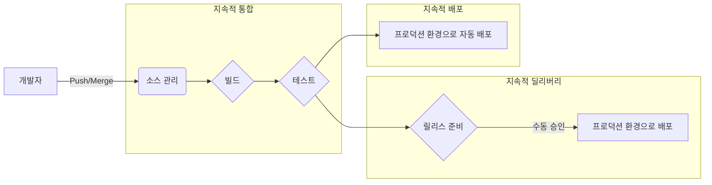
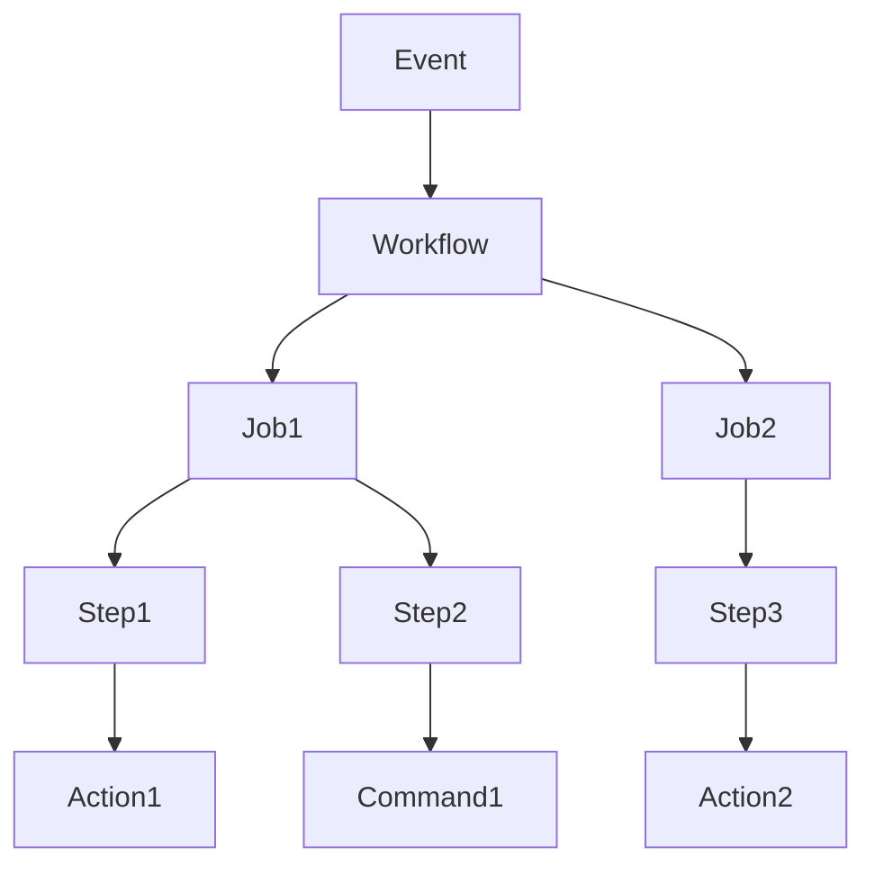
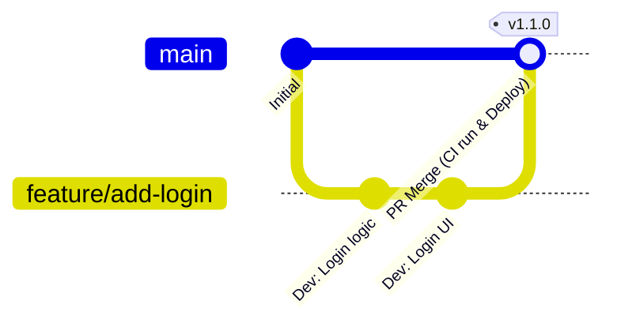

# 시작하며: 현대 소프트웨어 개발에서 CI/CD의 중요성

소프트웨어 개발의 속도와 품질은 오늘날 비즈니스에서 경쟁력을 좌우하는 가장 중요한 요소 중 하나입니다. 그 양립을 실현하기 위한 핵심 기술이 **CI/CD** (지속적 통합 / 지속적 딜리버리·배포)입니다.

본 문서에서는 CI/CD의 기본 개념부터, 현대 개발 플랫폼의 사실상 표준인 **GitHub Actions** 를 활용한 실용적인 파이프라인 구축, 그리고 실무에서 유용한 베스트 프랙티스까지 상세한 코드 예제와 도해를 섞어 해설합니다.

## CI/CD란 무엇인가?

CI/CD는 소프트웨어 변경 사항을 항상 테스트하고 프로덕션 환경에 안전하고 신속하게 릴리스하기 위한 프랙티스입니다.

### 지속적 통합(CI: Continuous Integration)

개발자가 코드를 공유 리포지토리에 자주(이상적으로는 하루에 여러 번) 병합하는 프랙티스입니다. 코드가 병합될 때마다 자동화된 빌드와 테스트가 실행되어 통합 오류를 조기에 발견합니다.

*   **목적:** 버그 조기 발견, 통합의 고통(인테그레이션 헬) 완화.
*   **주요 프로세스:** 코드 컴파일, 정적 분석(Lint), 단위 테스트(Unit Test).

### 지속적 딜리버리(CD: Continuous Delivery) 및 지속적 배포(CD: Continuous Deployment)

CI의 연장선상에 있으며, 릴리스 가능한 상태의 소프트웨어를 자동으로 준비하는 프로세스입니다.

*   **지속적 딜리버리:** 프로덕션 환경에 배포할 준비가 항상 갖춰진 상태를 유지합니다. 실제 배포는 수동으로 트리거됩니다.
*   **지속적 배포:** 테스트를 통과한 모든 변경 사항을 사람의 개입 없이 자동으로 프로덕션 환경에 배포합니다.



---

# GitHub Actions의 기초 지식

GitHub Actions는 GitHub 리포지토리 내에서 직접 소프트웨어 개발 워크플로를 자동화할 수 있는 강력한 플랫폼입니다. CI/CD뿐만 아니라 Issue 자동 정리나 릴리스 노트 자동 생성 등 리포지토리와 관련된 모든 작업을 자동화할 수 있습니다.

## 핵심 개념

GitHub Actions를 능숙하게 다루려면 다음 기본 개념을 이해해야 합니다.

1.  **Workflow (워크플로):** 하나 이상의 작업(Job)을 실행하는 자동화된 프로세스. YAML 파일로 정의됩니다.
2.  **Event (이벤트):** 워크플로 실행을 트리거하는 특정 활동(예: `push`, `pull_request`, 정기 실행 `schedule` 등).
3.  **Job (작업):** 동일한 러너(Runner)에서 실행되는 일련의 단계(Step) 집합. 기본적으로 작업은 병렬로 실행되지만 의존 관계를 설정할 수도 있습니다.
4.  **Step (단계):** 작업 내에서 명령을 실행하거나 Action을 호출하는 개별 태스크.
5.  **Action (액션):** 복잡하고 자주 반복되는 태스크를 실행하는 재사용 가능한 독립 실행형 명령. (예: 리포지토리 체크아웃, Node.js 설정).
6.  **Runner (러너):** 워크플로를 실행하는 서버. GitHub가 호스팅하는 러너(Ubuntu, Windows, macOS)와 직접 호스팅하는 셀프 호스티드 러너가 있습니다.



---

# GitHub Actions를 사용한 CI/CD 파이프라인 구축 실전

지금부터 구체적인 YAML 파일을 보면서 CI 파이프라인 구축 방법을 단계별로 설명합니다. 예제로 Node.js(TypeScript) 프로젝트를 가정합니다.

## 1. 기본적인 CI 워크플로

먼저 코드가 푸시되거나 Pull Request가 생성될 때 의존성을 설치하고 테스트를 수행하는 기본적인 워크플로를 작성합니다.

프로젝트 루트에 `.github/workflows/ci.yml` 을 생성하고 다음과 같이 작성합니다.

```yaml
name: Node.js CI

on:
  push:
    branches: [ "main", "develop" ]
  pull_request:
    branches: [ "main", "develop" ]

jobs:
  build:
    runs-on: ubuntu-latest

    steps:
    - name: 코드 체크아웃
      uses: actions/checkout@v4

    - name: Node.js 설정
      uses: actions/setup-node@v4
      with:
        node-version: '20'

    - name: 의존성 설치
      run: npm ci

    - name: 빌드 실행
      run: npm run build

    - name: 테스트 실행
      run: npm test
```

### 요점 해설

*   **`on:`** 브랜치 `main` 및 `develop` 에 대한 `push` 와 `pull_request` 를 트리거로 삼고 있습니다.
*   **`actions/checkout@v4`:** 워크스페이스에 리포지토리의 코드를 다운로드합니다. CI의 첫 번째 단계로서 거의 필수입니다.
*   **`actions/setup-node@v4`:** 지정한 버전의 Node.js 환경을 구축합니다.
*   **`npm ci`:** `npm install` 보다 빠르고 `package-lock.json` 에 엄격하게 기반하여 설치를 수행하므로 CI 환경에 적합합니다.

## 2. 실행 속도 최적화: 캐시 활용

CI 실행 시간은 개발자의 피드백 루프에 직결됩니다. 의존성 다운로드 시간을 단축하기 위해 캐시를 활용하는 것은 **베스트 프랙티스** 입니다.

`actions/setup-node` 에는 캐시 기능이 내장되어 있습니다.

```yaml
    - name: Node.js 설정
      uses: actions/setup-node@v4
      with:
        node-version: '20'
        cache: 'npm' # npm 의존성 캐시
```

이를 통해 `package-lock.json` 의 해시값을 키로 삼아 `~/.npm` 디렉터리가 캐시되며, 다음 실행부터 비약적으로 속도가 향상됩니다.

## 3. 품질 보증: Lint와 Format

코드 품질을 균일하게 유지하기 위해 빌드 및 테스트 전에 Lint(정적 분석)와 Format(코드 정렬) 체크를 포함해야 합니다.

```yaml
jobs:
  lint-and-test:
    runs-on: ubuntu-latest
    steps:
      - uses: actions/checkout@v4
      - uses: actions/setup-node@v4
        with:
          node-version: '20'
          cache: 'npm'
      
      - run: npm ci

      - name: ESLint 실행
        run: npm run lint

      - name: Prettier 체크
        run: npm run format:check

      - name: 테스트 실행
        run: npm test
```

## 4. 보안 스캔 (DevSecOps)

현대 CI/CD에서는 보안 체크를 자동화하는 **DevSecOps** 접근법이 필수적입니다. GitHub Actions를 이용하면 보안 스캔을 쉽게 연동할 수 있습니다.

### 의존성 취약점 스캔 (npm audit)

```yaml
      - name: 취약점 스캔
        run: npm audit
```

### 정적 애플리케이션 보안 테스트 (SAST)

GitHub Advanced Security의 기능인 CodeQL 등을 이용해 소스 코드 자체의 취약점을 스캔할 수 있습니다. (※비공개 리포지토리에서는 라이선스가 필요할 수 있습니다.)

```yaml
  security-scan:
    runs-on: ubuntu-latest
    steps:
    - uses: actions/checkout@v4
    
    - name: Initialize CodeQL
      uses: github/codeql-action/init@v3
      with:
        languages: javascript

    - name: Perform CodeQL Analysis
      uses: github/codeql-action/analyze@v3
```

## 5. 매트릭스 빌드를 통한 크로스 플랫폼 테스트

라이브러리 등을 개발하고 있다면 여러 OS나 런타임 버전에서 테스트해야 합니다. `strategy.matrix` 를 사용하면 병렬 테스트 환경을 쉽게 구축할 수 있습니다.

```yaml
jobs:
  test:
    runs-on: ${{ matrix.os }}
    strategy:
      matrix:
        node-version: [18, 20, 22]
        os: [ubuntu-latest, windows-latest, macos-latest]
        
    steps:
    - uses: actions/checkout@v4
    - name: Use Node.js ${{ matrix.node-version }} on ${{ matrix.os }}
      uses: actions/setup-node@v4
      with:
        node-version: ${{ matrix.node-version }}
    - run: npm ci
    - run: npm test
```

이 설정으로 인해 3개의 Node.js 버전 × 3개의 OS = 총 9개의 작업(Job)이 병렬로 실행됩니다.

---

# 브랜치 전략과 CI/CD 연동

효과적인 CI/CD 파이프라인을 구축하려면 개발 팀의 **브랜치 전략** 과 밀접하게 연동시켜야 합니다. 대표적인 전략과의 연동 예를 설명합니다.

## GitHub Flow와 연동

GitHub Flow는 `main` 브랜치를 항상 배포 가능한 상태로 유지하고, 기능 추가는 Feature 브랜치에서 수행하는 단순한 전략입니다.



*   **Feature 브랜치:** `push` 될 때마다 Lint와 단위 테스트(CI)가 실행됩니다.
*   **Pull Request:** `main` 으로 향하는 PR을 생성하면 CI가 실행되고, 성공하지 않으면 병합할 수 없도록 보호 규칙을 설정합니다.
*   **main 브랜치:** 병합되면 CI가 실행되고, 그 후 스테이징 환경 또는 프로덕션 환경으로 자동 배포(CD)됩니다.

## CI/CD 파이프라인 분할

복잡한 프로젝트에서는 하나의 거대한 워크플로 파일을 만드는 대신 목적별로 분할하는 것이 **베스트 프랙티스** 입니다.

1.  `pr-check.yml`: PR 생성 시. Lint, 빠른 Unit Test. (목적: 빠른 피드백)
2.  `ci-main.yml`: `main` 병합 시. 전체 빌드, 무거운 E2E 테스트. (목적: 릴리스 전 품질 보증)
3.  `cd-deploy.yml`: 태그 생성 시(예: `v1.0.0`). 프로덕션 환경으로 배포. (목적: 릴리스)

---

# 고급 GitHub Actions 테크닉

더욱 실용적이고 유지보수성이 높은 파이프라인을 구축하기 위한 고급 기능을 소개합니다.

## Reusable Workflows (재사용 가능한 워크플로)

여러 리포지토리에 비슷한 CI 프로세스가 있는 경우 워크플로 자체를 공통화할 수 있습니다. `workflow_call` 트리거를 사용합니다.

**호출되는 측 ( `.github/workflows/reusable-ci.yml` ):**

```yaml
on:
  workflow_call:
    inputs:
      node-version:
        required: true
        type: string

jobs:
  build:
    runs-on: ubuntu-latest
    steps:
      - uses: actions/checkout@v4
      - uses: actions/setup-node@v4
        with:
          node-version: ${{ inputs.node-version }}
      - run: npm ci
      - run: npm test
```

**호출하는 측:**

```yaml
on: [push]

jobs:
  call-workflow:
    uses: my-org/my-repo/.github/workflows/reusable-ci.yml@main
    with:
      node-version: '20'
```

## [OIDC](https://kenji.blog/ko/p/oauth2-oidc-authentication-authorization-difference/) ([OpenID Connect](https://kenji.blog/ko/p/oauth2-oidc-authentication-authorization-difference/)) 를 이용한 안전한 클라우드 연동

AWS, GCP, Azure 등의 클라우드 프로바이더로 배포할 때, 장기적인 자격 증명(시크릿 키 등)을 GitHub에 저장하는 것은 보안 리스크가 따릅니다.

OIDC를 사용하면 GitHub Actions 작업이 클라우드 프로바이더에 임시 토큰을 요청하여 안전하게 인증을 수행할 수 있습니다.

예를 들어 AWS에 배포하는 경우:

```yaml
permissions:
  id-token: write # OIDC 토큰 발급에 필요
  contents: read

jobs:
  deploy:
    runs-on: ubuntu-latest
    steps:
      - uses: actions/checkout@v4
      
      - name: Configure AWS Credentials
        uses: aws-actions/configure-aws-credentials@v4
        with:
          role-to-assume: arn:aws:iam::123456789012:role/my-github-actions-role
          aws-region: ap-northeast-1
          
      - name: Deploy to S3
        run: aws s3 sync ./dist s3://my-bucket/
```

비밀번호를 갖지 않고 Role을 맡는(Assume Role) 형태로 권한을 얻기 때문에 매우 안전합니다.

---

# CI/CD 도입의 수리적 효과

CI/CD 도입에 따른 효과는 배포 빈도나 리드 타임 같은 지표로 측정할 수 있습니다.

예를 들어, 배포 빈도를 $\lambda$ (회/일), 1회당 수동 배포에 걸리는 시간을 $T_{manual}$ , 자동화된 시간을 $T_{auto}$ 라고 합시다.

하루당 배포 작업 시간의 단축량 $S$ 는 다음과 같이 나타낼 수 있습니다.

$ S = \lambda \times (T_{manual} - T_{auto}) $

자동화가 진행되어 $\lambda$ 가 증가(하루에 여러 번 배포하는 상태)할수록 단축되는 시간 $S$ 는 비약적으로 커집니다. 이는 개발자가 더 가치 있는 새로운 기능 개발에 시간을 투자할 수 있음을 의미합니다.

---

# 요약

본 문서에서는 CI/CD의 기본부터 GitHub Actions를 사용한 실용적인 파이프라인 구축 방법, 그리고 개발 현장에서 요구되는 베스트 프랙티스에 대해 상세히 설명했습니다.

*   **자주 통합하기:** 버그를 조기에 발견하기 위해 작은 변경 사항을 자주 병합합시다.
*   **캐시 활용하기:** 워크플로 실행 시간을 단축하고 개발 경험을 향상합시다.
*   **품질과 보안 자동화하기:** Lint, 테스트, 취약점 스캔을 파이프라인에 편입합시다.
*   **[OIDC](https://kenji.blog/ko/p/oauth2-oidc-authentication-authorization-difference/) 이용하기:** 클라우드 프로바이더와의 연동은 시크릿 키 대신 OIDC를 통한 임시 토큰을 이용합시다.

GitHub Actions는 매우 유연하고 강력한 도구입니다. 먼저 Lint 자동화와 같은 작은 첫걸음부터 시작하여 프로젝트 성장에 맞춰 점진적으로 파이프라인을 확장해 나가는 것을 권장합니다. 자동화의 힘을 빌려 더욱 빠르고 고품질의 소프트웨어 개발을 실현합시다.
