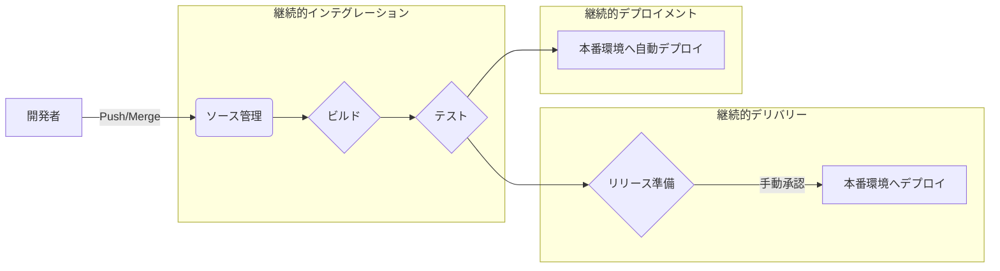
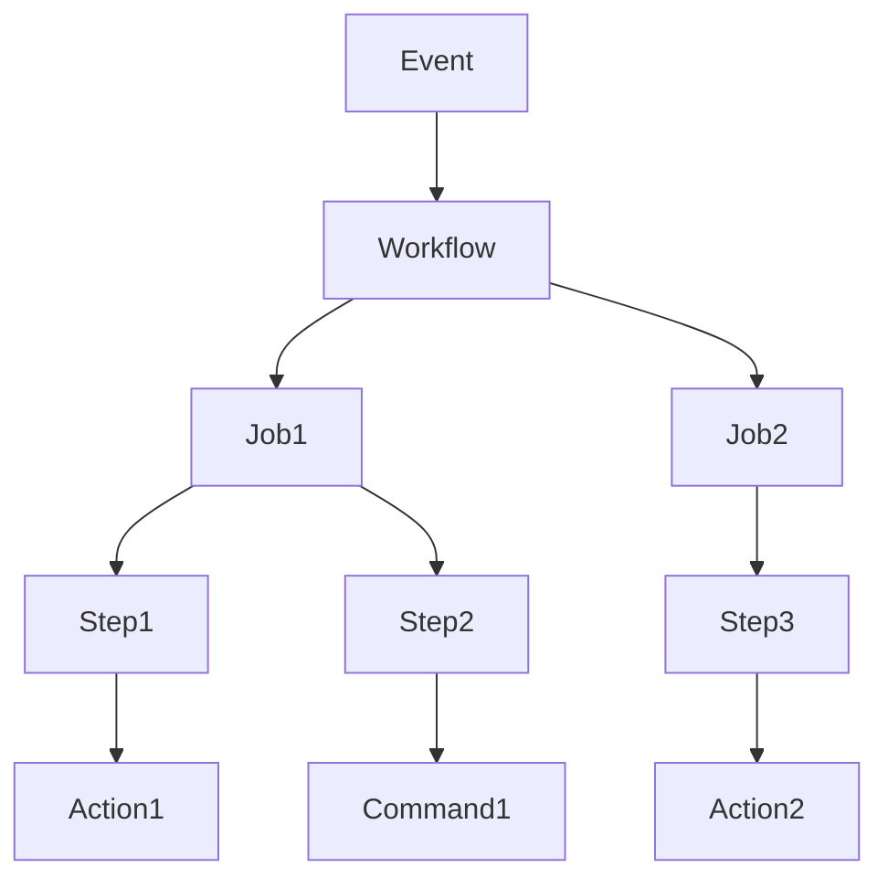
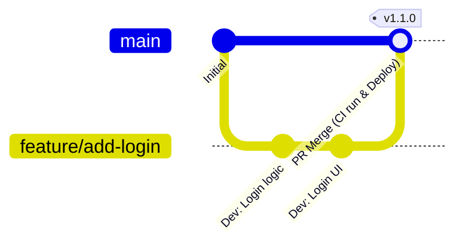

# はじめに：現代のソフトウェア開発におけるCI/CDの重要性

ソフトウェア開発のスピードと品質は、今日のビジネスにおいて競争力を左右する最も重要な要素の一つです。その両立を実現するためのコアテクノロジーが **CI/CD** （継続的インテグレーション / 継続的デリバリー・デプロイメント）です。

本記事では、CI/CDの基本概念から、現代の開発プラットフォームのデファクトスタンダードである **GitHub Actions** を用いた実践的なパイプライン構築、そして実務で役立つベストプラクティスまでを、詳細なコード例と図解を交えて解説します。

## CI/CDとは何か？

CI/CDは、ソフトウェアの変更を常にテストし、本番環境へ安全かつ迅速にリリースするためのプラクティスです。

### 継続的インテグレーション（CI: Continuous Integration）

開発者がコードを共有リポジトリに頻繁に（理想的には1日に複数回）マージするプラクティスです。コードがマージされるたびに、自動化されたビルドとテストが実行され、統合エラーを早期に発見します。

*   **目的:** バグの早期発見、統合の苦痛（インテグレーション・ヘル）の軽減。
*   **主なプロセス:** コードのコンパイル、静的解析（Lint）、単体テスト（Unit Test）。

### 継続的デリバリー（CD: Continuous Delivery）と継続的デプロイメント（CD: Continuous Deployment）

CIの延長線上にあり、リリース可能な状態のソフトウェアを自動的に準備するプロセスです。

*   **継続的デリバリー:** 本番環境へのデプロイ準備が常に整っている状態を維持します。実際のデプロイは手動でトリガーされます。
*   **継続的デプロイメント:** テストを通過したすべての変更を、人間の介入なしに自動的に本番環境へデプロイします。



---

# GitHub Actionsの基礎知識

GitHub Actionsは、GitHubのリポジトリ内で直接ソフトウェア開発ワークフローを自動化できる強力なプラットフォームです。CI/CDだけでなく、Issueの自動整理やリリースノートの自動生成など、リポジトリにまつわるあらゆる作業を自動化できます。

## コアコンセプト

GitHub Actionsを使いこなすには、以下の基本的な概念を理解する必要があります。

1.  **Workflow (ワークフロー):** 1つ以上のジョブを実行する自動化されたプロセス。YAMLファイルで定義されます。
2.  **Event (イベント):** ワークフローの実行をトリガーする特定の活動（例： `push`, `pull_request`, 定期実行 `schedule` など）。
3.  **Job (ジョブ):** 同じランナーで実行される一連のステップの集まり。デフォルトではジョブは並列に実行されますが、依存関係を設定することも可能です。
4.  **Step (ステップ):** ジョブ内でコマンドを実行したり、Actionを呼び出したりする個々のタスク。
5.  **Action (アクション):** 複雑で頻繁に繰り返されるタスクを実行する、再利用可能なスタンドアロンのコマンド。（例：リポジトリのチェックアウト、Node.jsのセットアップ）。
6.  **Runner (ランナー):** ワークフローを実行するサーバー。GitHubがホストするランナー（Ubuntu, Windows, macOS）と、自前でホストするセルフホステッドランナーがあります。



---

# GitHub Actionsを用いたCI/CDパイプライン構築の実践

ここからは、具体的なYAMLファイルを見ながら、CIパイプラインの構築方法をステップバイステップで解説します。例として、Node.js（TypeScript）プロジェクトを想定します。

## 1. 基本的なCIワークフロー

まずは、コードがプッシュされたりPull Requestが作成されたときに、依存関係のインストールとテストを行う基本的なワークフローを作成します。

プロジェクトルートに `.github/workflows/ci.yml` を作成し、以下のように記述します。

```yaml
name: Node.js CI

on:
  push:
    branches: [ "main", "develop" ]
  pull_request:
    branches: [ "main", "develop" ]

jobs:
  build:
    runs-on: ubuntu-latest

    steps:
    - name: コードのチェックアウト
      uses: actions/checkout@v4

    - name: Node.jsのセットアップ
      uses: actions/setup-node@v4
      with:
        node-version: '20'

    - name: 依存関係のインストール
      run: npm ci

    - name: ビルドの実行
      run: npm run build

    - name: テストの実行
      run: npm test
```

### ポイントの解説

*   **`on:`** ブランチ `main` および `develop` への `push` と `pull_request` をトリガーとしています。
*   **`actions/checkout@v4`:** ワークスペースにリポジトリのコードをダウンロードします。CIの最初のステップとしてほぼ必須です。
*   **`actions/setup-node@v4`:** 指定したバージョンのNode.js環境を構築します。
*   **`npm ci`:** `npm install` よりも高速で、 `package-lock.json` に厳密に基づいたインストールを行うため、CI環境に適しています。

## 2. 実行速度の最適化：キャッシュの活用

CIの実行時間は、開発者のフィードバックループに直結します。依存関係のダウンロード時間を短縮するために、キャッシュを活用することは **ベストプラクティス** です。

`actions/setup-node` にはキャッシュ機能が内蔵されています。

```yaml
    - name: Node.jsのセットアップ
      uses: actions/setup-node@v4
      with:
        node-version: '20'
        cache: 'npm' # npmの依存関係をキャッシュ
```

これにより、 `package-lock.json` のハッシュ値をキーとして `~/.npm` ディレクトリがキャッシュされ、次回以降の実行が劇的に高速化されます。

## 3. 品質担保：LintとFormat

コードの品質を均一に保つため、ビルドやテストの前にLint（静的解析）とFormat（コード整形）のチェックを含めるべきです。

```yaml
jobs:
  lint-and-test:
    runs-on: ubuntu-latest
    steps:
      - uses: actions/checkout@v4
      - uses: actions/setup-node@v4
        with:
          node-version: '20'
          cache: 'npm'
      
      - run: npm ci

      - name: ESLintの実行
        run: npm run lint

      - name: Prettierのチェック
        run: npm run format:check

      - name: テストの実行
        run: npm test
```

## 4. セキュリティスキャン（DevSecOps）

現代のCI/CDでは、セキュリティチェックを自動化する **DevSecOps** のアプローチが不可欠です。GitHub Actionsを利用すれば、簡単にセキュリティスキャンを組み込めます。

### 依存関係の[脆弱性](https://kenji.blog/p/web-application-vulnerability-owasp-top-10/)スキャン (npm audit)

```yaml
      - name: 脆弱性のスキャン
        run: npm audit
```

### 静的アプリケーションセキュリティテスト (SAST)

GitHub Advanced Securityの機能であるCodeQLなどを利用して、ソースコード自体の[脆弱性](https://kenji.blog/p/web-application-vulnerability-owasp-top-10/)をスキャンできます。（※プライベートリポジトリではライセンスが必要な場合があります）

```yaml
  security-scan:
    runs-on: ubuntu-latest
    steps:
    - uses: actions/checkout@v4
    
    - name: Initialize CodeQL
      uses: github/codeql-action/init@v3
      with:
        languages: javascript

    - name: Perform CodeQL Analysis
      uses: github/codeql-action/analyze@v3
```

## 5. マトリックスビルドによるクロスプラットフォームテスト

ライブラリなどを開発している場合、複数のOSやランタイムのバージョンでテストする必要があります。 `strategy.matrix` を使うと、簡単に並列テスト環境を構築できます。

```yaml
jobs:
  test:
    runs-on: ${{ matrix.os }}
    strategy:
      matrix:
        node-version: [18, 20, 22]
        os: [ubuntu-latest, windows-latest, macos-latest]
        
    steps:
    - uses: actions/checkout@v4
    - name: Use Node.js ${{ matrix.node-version }} on ${{ matrix.os }}
      uses: actions/setup-node@v4
      with:
        node-version: ${{ matrix.node-version }}
    - run: npm ci
    - run: npm test
```

この設定により、3つのNode.jsバージョン × 3つのOS = 合計9つのジョブが並列で実行されます。

---

# ブランチ戦略とCI/CDの連携

効果的なCI/CDパイプラインを構築するには、開発チームの **ブランチ戦略** と密接に連携させる必要があります。代表的な戦略との連携例を解説します。

## GitHub Flowとの連携

GitHub Flowは、 `main` ブランチを常にデプロイ可能な状態に保ち、機能追加はFeatureブランチで行うシンプルな戦略です。



*   **Featureブランチ:** `push` されるたびに、Lintと単体テスト（CI）が走ります。
*   **Pull Request:** `main` へのPRを作成すると、CIが実行され、成功しないとマージできないよう保護ルールを設定します。
*   **mainブランチ:** マージされると、CIが走り、その後自動的にステージング環境または本番環境へデプロイ（CD）されます。

## CI/CDパイプラインの分割

複雑なプロジェクトでは、1つの巨大なワークフローファイルを作るのではなく、目的別に分割するのが **ベストプラクティス** です。

1.  `pr-check.yml`: PR作成時。Lint、高速なUnit Test。（目的：素早いフィードバック）
2.  `ci-main.yml`: `main` マージ時。全体のビルド、重いE2Eテスト。（目的：リリース前品質保証）
3.  `cd-deploy.yml`: タグ作成時（例： `v1.0.0`）。本番環境へのデプロイ。（目的：リリース）

---

# 高度なGitHub Actionsのテクニック

さらに実践的で保守性の高いパイプラインを構築するための高度な機能を紹介します。

## Reusable Workflows (再利用可能なワークフロー)

複数のリポジトリで似たようなCIプロセスがある場合、ワークフロー自体を共通化できます。 `workflow_call` トリガーを使用します。

**呼び出される側 ( `.github/workflows/reusable-ci.yml` ):**

```yaml
on:
  workflow_call:
    inputs:
      node-version:
        required: true
        type: string

jobs:
  build:
    runs-on: ubuntu-latest
    steps:
      - uses: actions/checkout@v4
      - uses: actions/setup-node@v4
        with:
          node-version: ${{ inputs.node-version }}
      - run: npm ci
      - run: npm test
```

**呼び出す側:**

```yaml
on: [push]

jobs:
  call-workflow:
    uses: my-org/my-repo/.github/workflows/reusable-ci.yml@main
    with:
      node-version: '20'
```

## [OIDC](https://kenji.blog/p/oauth2-oidc-authentication-authorization-difference/) ([OpenID Connect](https://kenji.blog/p/oauth2-oidc-authentication-authorization-difference/)) を利用した安全なクラウド連携

AWS、GCP、Azureなどのクラウドプロバイダへデプロイする際、長期的なクレデンシャル（シークレットキーなど）をGitHubに保存するのはセキュリティリスクが伴います。

OIDCを使用すると、GitHub Actionsのジョブがクラウドプロバイダに対して一時的なトークンを要求し、安全に[認証](https://kenji.blog/p/oauth2-oidc-authentication-authorization-difference/)を行うことができます。

例えば、AWSにデプロイする場合：

```yaml
permissions:
  id-token: write # OIDCトークンの発行に必要
  contents: read

jobs:
  deploy:
    runs-on: ubuntu-latest
    steps:
      - uses: actions/checkout@v4
      
      - name: Configure AWS Credentials
        uses: aws-actions/configure-aws-credentials@v4
        with:
          role-to-assume: arn:aws:iam::123456789012:role/my-github-actions-role
          aws-region: ap-northeast-1
          
      - name: Deploy to S3
        run: aws s3 sync ./dist s3://my-bucket/
```

パスワードを持たず、Roleを引き受ける（Assume Role）形で権限を得るため、非常にセキュアです。

---

# CI/CD導入の数理的効果

CI/CDの導入による効果は、デプロイ頻度やリードタイムといった指標で測定できます。

例えば、デプロイ頻度を $\lambda$ （回/日）、1回あたりの手動デプロイにかかる時間を $T_{manual}$ 、自動化された時間を $T_{auto}$ とします。

1日あたりのデプロイ作業時間の削減量 $S$ は次のように表せます。

$$ S = \lambda \times (T_{manual} - T_{auto}) $$

自動化が進み、 $\lambda$ が増加（1日に何度もデプロイする状態）すればするほど、削減される時間 $S$ は劇的に大きくなります。これは、開発者がより価値のある新機能開発に時間を投資できることを意味します。

---

# まとめ

本記事では、CI/CDの基本から、GitHub Actionsを用いた実践的なパイプラインの構築方法、そして開発現場で求められるベストプラクティスについて詳細に解説しました。

*   **頻繁に統合する:** バグを早期に発見するため、小さな変更を頻繁にマージしましょう。
*   **キャッシュを活用する:** ワークフローの実行時間を短縮し、開発体験を向上させましょう。
*   **品質とセキュリティを自動化する:** Lint、テスト、[脆弱性](https://kenji.blog/p/web-application-vulnerability-owasp-top-10/)スキャンをパイプラインに組み込みましょう。
*   **[OIDC](https://kenji.blog/p/oauth2-oidc-authentication-authorization-difference/)を利用する:** クラウドプロバイダとの連携は、シークレットキーではなくOIDCによる一時トークンを利用しましょう。

GitHub Actionsは非常に柔軟で強力なツールです。まずはLintの自動化といった小さな一歩から始め、プロジェクトの成長に合わせて徐々にパイプラインを拡張していくことをお勧めします。自動化の力を借りて、より高速で高品質なソフトウェア開発を実現しましょう。
