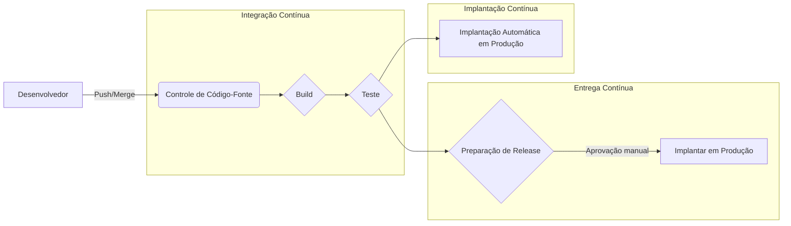
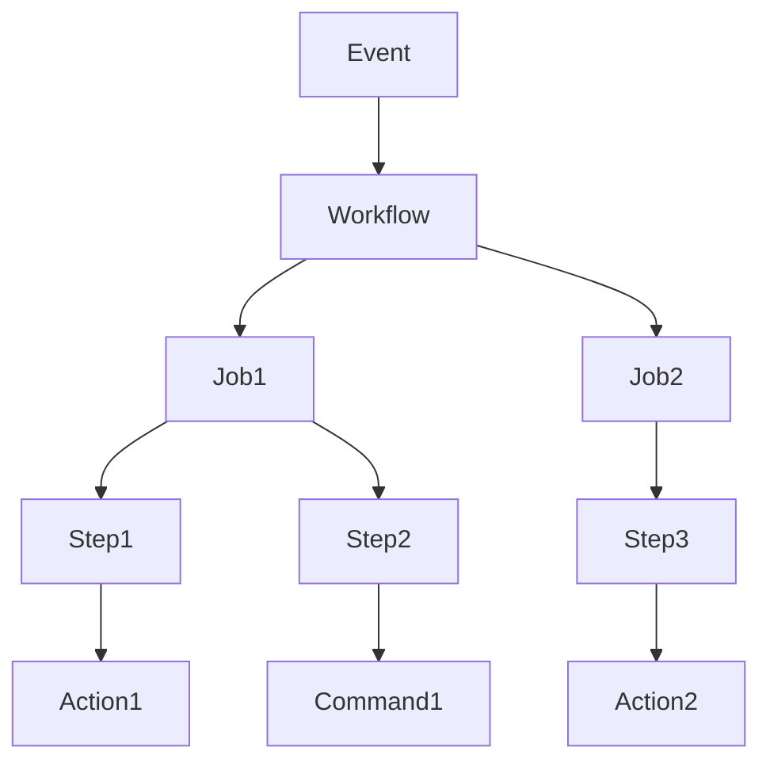
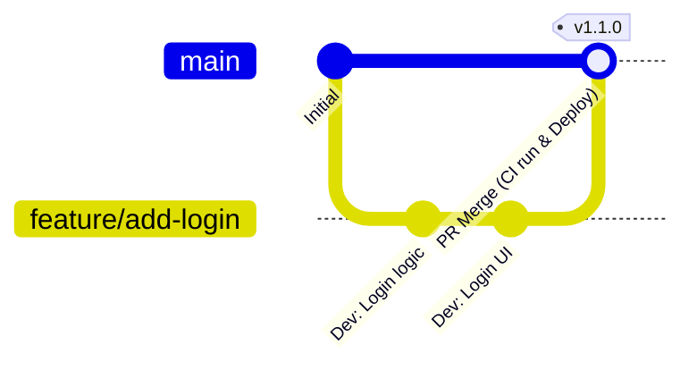

# Introdução: A Importância do CI/CD no Desenvolvimento de Software Moderno

A velocidade e a qualidade do desenvolvimento de software são alguns dos fatores mais cruciais que determinam a competitividade nos negócios de hoje. A tecnologia central para alcançar ambos é o **CI/CD** (Integração Contínua / Entrega e Implantação Contínuas).

Neste artigo, explicaremos desde os conceitos básicos de CI/CD até a construção de um pipeline prático usando o **GitHub Actions** , o padrão de fato para plataformas de desenvolvimento modernas, juntamente com as melhores práticas úteis no trabalho real, acompanhadas de exemplos de código e ilustrações detalhadas.

## O que é CI/CD?

CI/CD é uma prática para testar continuamente alterações de software e liberá-las de forma segura e rápida para o ambiente de produção.

### Integração Contínua (CI: Continuous Integration)

É uma prática em que os desenvolvedores fazem merge de seus códigos em um repositório compartilhado frequentemente (idealmente, várias vezes ao dia). Cada vez que o código sofre um merge, processos automatizados de build e teste são executados para detectar erros de integração o mais cedo possível.

*   **Objetivo:** Detecção precoce de bugs e redução da dor da integração (Integration Hell).
*   **Processos principais:** Compilação de código, análise estática (Lint), testes unitários (Unit Test).

### Entrega Contínua (CD: Continuous Delivery) e Implantação Contínua (CD: Continuous Deployment)

Como extensão da CI, é o processo de preparação automática do software em um estado pronto para ser lançado.

*   **Entrega Contínua:** Mantém o software sempre pronto para ser implantado no ambiente de produção. A implantação real é acionada manualmente.
*   **Implantação Contínua:** Implanta automaticamente todas as alterações que passaram nos testes para o ambiente de produção, sem intervenção humana.



---

# Conhecimentos Básicos do GitHub Actions

O GitHub Actions é uma plataforma poderosa que permite automatizar fluxos de trabalho de desenvolvimento de software diretamente dentro dos repositórios do GitHub. Ele pode automatizar não apenas CI/CD, mas todas as tarefas relacionadas a repositórios, como organização automática de Issues e geração automática de notas de lançamento (release notes).

## Conceitos Fundamentais

Para dominar o GitHub Actions, é necessário entender os seguintes conceitos básicos.

1.  **Workflow (Fluxo de Trabalho):** Um processo automatizado que executa um ou mais jobs. É definido por um arquivo YAML.
2.  **Event (Evento):** Uma atividade específica que aciona a execução do fluxo de trabalho (por exemplo, `push`, `pull_request`, execução periódica `schedule`, etc.).
3.  **Job (Trabalho):** Um conjunto de passos executados no mesmo runner. Por padrão, os jobs são executados em paralelo, mas também é possível configurar dependências.
4.  **Step (Passo):** Uma tarefa individual que executa um comando ou chama uma Action dentro de um job.
5.  **Action (Ação):** Um comando autônomo e reutilizável que executa tarefas complexas e frequentemente repetidas. (Exemplo: checkout de repositório, configuração do Node.js).
6.  **Runner (Corredor/Agente):** Um servidor que executa os fluxos de trabalho. Existem runners hospedados pelo GitHub (Ubuntu, Windows, macOS) e self-hosted runners hospedados por você mesmo.



---

# Prática de Construção de Pipeline CI/CD com GitHub Actions

A partir daqui, explicaremos passo a passo como construir um pipeline de CI observando arquivos YAML específicos. Como exemplo, vamos assumir um projeto Node.js (TypeScript).

## 1. Fluxo de Trabalho Básico de CI

Primeiro, criaremos um fluxo de trabalho básico que instala dependências e realiza testes quando um código recebe push ou um Pull Request é criado.

Crie o arquivo `.github/workflows/ci.yml` na raiz do projeto e escreva o seguinte.

```yaml
name: Node.js CI

on:
  push:
    branches: [ "main", "develop" ]
  pull_request:
    branches: [ "main", "develop" ]

jobs:
  build:
    runs-on: ubuntu-latest

    steps:
    - name: Checkout de código
      uses: actions/checkout@v4

    - name: Configuração do Node.js
      uses: actions/setup-node@v4
      with:
        node-version: '20'

    - name: Instalação de dependências
      run: npm ci

    - name: Execução do build
      run: npm run build

    - name: Execução de testes
      run: npm test
```

### Explicação dos Pontos

*   **`on:`** Acionado por `push` e `pull_request` nas branches `main` e `develop`.
*   **`actions/checkout@v4`:** Faz o download do código do repositório para o workspace. É quase essencial como o primeiro passo da CI.
*   **`actions/setup-node@v4`:** Constrói um ambiente Node.js na versão especificada.
*   **`npm ci`:** É mais rápido do que `npm install` e realiza uma instalação baseada estritamente no `package-lock.json`, o que o torna adequado para ambientes de CI.

## 2. Otimização da Velocidade de Execução: Uso de Cache

O tempo de execução da CI afeta diretamente o ciclo de feedback do desenvolvedor. Utilizar cache para reduzir o tempo de download de dependências é uma **melhor prática** .

A action `actions/setup-node` possui uma funcionalidade de cache integrada.

```yaml
    - name: Configuração do Node.js
      uses: actions/setup-node@v4
      with:
        node-version: '20'
        cache: 'npm' # Fazer cache das dependências do npm
```

Isso armazena em cache o diretório `~/.npm` usando o valor de hash do `package-lock.json` como chave, o que acelera dramaticamente as execuções subsequentes.

## 3. Garantia de Qualidade: Lint e Format

Para manter a qualidade do código uniforme, você deve incluir verificações de Lint (análise estática) e Format (formatação de código) antes dos builds e testes.

```yaml
jobs:
  lint-and-test:
    runs-on: ubuntu-latest
    steps:
      - uses: actions/checkout@v4
      - uses: actions/setup-node@v4
        with:
          node-version: '20'
          cache: 'npm'
      
      - run: npm ci

      - name: Execução do ESLint
        run: npm run lint

      - name: Verificação do Prettier
        run: npm run format:check

      - name: Execução de testes
        run: npm test
```

## 4. Verificação de Segurança (DevSecOps)

Na CI/CD moderna, uma abordagem de **DevSecOps** que automatiza verificações de segurança é essencial. Utilizando o GitHub Actions, você pode incorporar facilmente verificações de segurança.

### Verificação de Vulnerabilidades nas Dependências (npm audit)

```yaml
      - name: Verificação de vulnerabilidades
        run: npm audit
```

### Teste de Segurança de Aplicação Estático (SAST)

Você pode verificar vulnerabilidades no próprio código-fonte utilizando ferramentas como o CodeQL, que é um recurso do GitHub Advanced Security. (※ Pode ser necessária uma licença para repositórios privados)

```yaml
  security-scan:
    runs-on: ubuntu-latest
    steps:
    - uses: actions/checkout@v4
    
    - name: Initialize CodeQL
      uses: github/codeql-action/init@v3
      with:
        languages: javascript

    - name: Perform CodeQL Analysis
      uses: github/codeql-action/analyze@v3
```

## 5. Build em Matriz para Testes Multiplataforma

Se você está desenvolvendo bibliotecas, precisa testá-las em vários SOs e versões de runtime. Usando `strategy.matrix`, é possível construir facilmente ambientes de teste paralelos.

```yaml
jobs:
  test:
    runs-on: ${{ matrix.os }}
    strategy:
      matrix:
        node-version: [18, 20, 22]
        os: [ubuntu-latest, windows-latest, macos-latest]
        
    steps:
    - uses: actions/checkout@v4
    - name: Use Node.js ${{ matrix.node-version }} on ${{ matrix.os }}
      uses: actions/setup-node@v4
      with:
        node-version: ${{ matrix.node-version }}
    - run: npm ci
    - run: npm test
```

Com essa configuração, 3 versões do Node.js × 3 sistemas operacionais = um total de 9 jobs são executados em paralelo.

---

# Integração da Estratégia de Branches com CI/CD

Para construir um pipeline de CI/CD eficaz, ele precisa estar estreitamente integrado à **estratégia de branches** da equipe de desenvolvimento. Aqui está um exemplo de integração com estratégias típicas.

## Integração com GitHub Flow

O GitHub Flow é uma estratégia simples em que a branch `main` é sempre mantida em um estado implantável e a adição de recursos é feita na branch Feature.



*   **Branch Feature:** Cada vez que recebe um `push`, o Lint e os testes unitários (CI) são executados.
*   **Pull Request:** Ao criar um PR para a `main`, a CI é executada e as regras de proteção são configuradas para que não possa ser feito o merge a menos que seja bem-sucedido.
*   **Branch main:** Quando o merge é feito, a CI é executada e, em seguida, é feita a implantação automática (CD) para o ambiente de staging ou de produção.

## Separação do Pipeline CI/CD

Em projetos complexos, em vez de criar um arquivo de fluxo de trabalho gigante, é uma **melhor prática** dividi-lo por objetivo.

1.  `pr-check.yml`: Na criação do PR. Lint, testes unitários rápidos. (Objetivo: Feedback rápido)
2.  `ci-main.yml`: No merge para a `main`. Build completo, testes E2E pesados. (Objetivo: Garantia de qualidade antes do release)
3.  `cd-deploy.yml`: Na criação de tags (Ex: `v1.0.0`). Implantação no ambiente de produção. (Objetivo: Release)

---

# Técnicas Avançadas de GitHub Actions

Apresentamos recursos avançados para construir pipelines ainda mais práticos e sustentáveis.

## Reusable Workflows (Fluxos de Trabalho Reutilizáveis)

Se houver processos de CI semelhantes em vários repositórios, o próprio fluxo de trabalho pode ser compartilhado. Use o gatilho `workflow_call`.

**Lado a ser chamado ( `.github/workflows/reusable-ci.yml` ):**

```yaml
on:
  workflow_call:
    inputs:
      node-version:
        required: true
        type: string

jobs:
  build:
    runs-on: ubuntu-latest
    steps:
      - uses: actions/checkout@v4
      - uses: actions/setup-node@v4
        with:
          node-version: ${{ inputs.node-version }}
      - run: npm ci
      - run: npm test
```

**Lado que chama:**

```yaml
on: [push]

jobs:
  call-workflow:
    uses: my-org/my-repo/.github/workflows/reusable-ci.yml@main
    with:
      node-version: '20'
```

## Integração de Nuvem Segura usando [OIDC](https://kenji.blog/pt/p/oauth2-oidc-authentication-authorization-difference/) ([OpenID Connect](https://kenji.blog/pt/p/oauth2-oidc-authentication-authorization-difference/))

Ao implantar em provedores de nuvem como AWS, GCP e Azure, salvar credenciais de longo prazo (como chaves secretas) no GitHub acarreta riscos de segurança.

Usando OIDC, o job do GitHub Actions pode solicitar um token temporário ao provedor de nuvem para autenticar com segurança.

Por exemplo, ao implantar na AWS:

```yaml
permissions:
  id-token: write # Necessário para a emissão do token OIDC
  contents: read

jobs:
  deploy:
    runs-on: ubuntu-latest
    steps:
      - uses: actions/checkout@v4
      
      - name: Configure AWS Credentials
        uses: aws-actions/configure-aws-credentials@v4
        with:
          role-to-assume: arn:aws:iam::123456789012:role/my-github-actions-role
          aws-region: ap-northeast-1
          
      - name: Deploy to S3
        run: aws s3 sync ./dist s3://my-bucket/
```

É altamente seguro porque não tem uma senha e obtém permissões assumindo uma Função (Assume Role).

---

# Efeito Matemático da Introdução de CI/CD

O efeito de introduzir o CI/CD pode ser medido por métricas como a frequência de implantação e o tempo de ciclo (lead time).

Por exemplo, se a frequência de implantação for $\lambda$ (vezes/dia), o tempo necessário para uma implantação manual for $T_{manual}$ e o tempo automatizado for $T_{auto}$ .

O tempo economizado em implantações por dia, $S$ , pode ser expresso como:

$ S = \lambda \times (T_{manual} - T_{auto}) $

À medida que a automação avança e $\lambda$ aumenta (estado de várias implantações por dia), o tempo economizado $S$ torna-se dramaticamente maior. Isso significa que os desenvolvedores podem investir seu tempo no desenvolvimento de novos recursos mais valiosos.

---

# Conclusão

Neste artigo, explicamos em detalhes os fundamentos do CI/CD, como construir um pipeline prático usando o GitHub Actions e as melhores práticas exigidas no campo de desenvolvimento.

*   **Integre com frequência:** Faça o merge de pequenas alterações com frequência para detectar bugs com antecedência.
*   **Utilize cache:** Reduza o tempo de execução dos fluxos de trabalho e melhore a experiência de desenvolvimento.
*   **Automatize a qualidade e segurança:** Incorpore Lint, testes e verificações de vulnerabilidade no pipeline.
*   **Use [OIDC](https://kenji.blog/pt/p/oauth2-oidc-authentication-authorization-difference/):** Utilize tokens temporários OIDC em vez de chaves secretas para a integração com provedores de nuvem.

O GitHub Actions é uma ferramenta extremamente flexível e poderosa. Recomendamos que você comece com pequenos passos, como automatizar o Lint, e expanda o pipeline gradualmente à medida que o projeto crescer. Com o poder da automação, você pode obter um desenvolvimento de software mais rápido e de maior qualidade.
