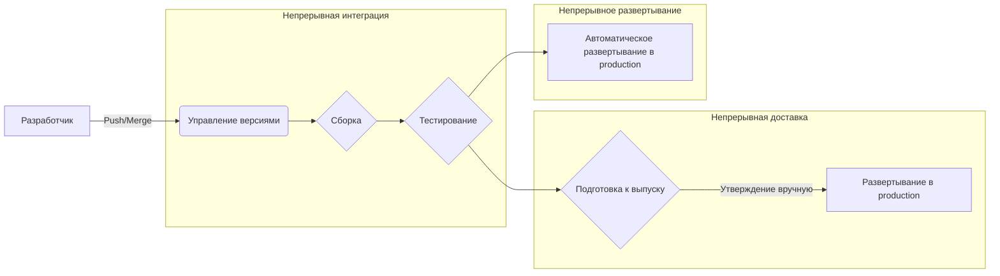
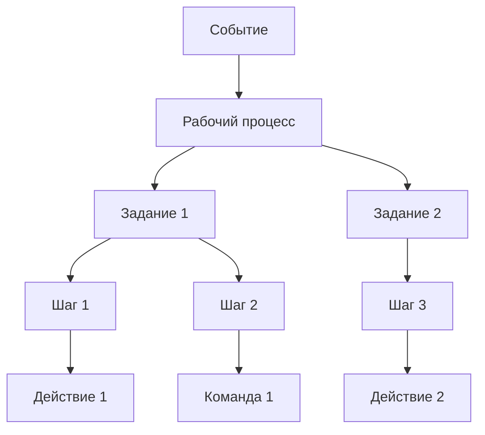
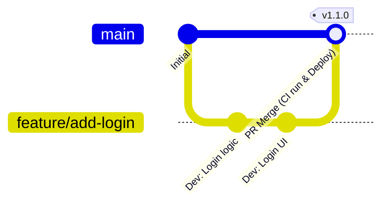

# Введение: важность CI/CD в современной разработке программного обеспечения

Скорость и качество разработки программного обеспечения — одни из важнейших факторов конкурентоспособности в современном бизнесе. Основной технологией для достижения обеих этих целей является **CI/CD** (непрерывная интеграция / непрерывная доставка и развертывание).

В этой статье мы подробно, с примерами кода и схемами, рассмотрим все аспекты: от базовых концепций CI/CD до практического создания конвейеров с использованием **GitHub Actions** — фактического стандарта современных платформ разработки, а также полезных на практике передовых методов.

## Что такое CI/CD?

CI/CD — это практика, направленная на постоянное тестирование изменений в программном обеспечении и их безопасный и быстрый выпуск в производственную среду.

### Непрерывная интеграция (CI: Continuous Integration)

Практика, при которой разработчики часто (в идеале — несколько раз в день) объединяют свой код в общий репозиторий. При каждом слиянии кода автоматически выполняются сборка и тестирование, что позволяет на ранних стадиях выявлять ошибки интеграции.

*   **Цель:** раннее обнаружение ошибок, снижение сложности интеграции ("ад интеграции").
*   **Основные процессы:** компиляция кода, статический анализ (Lint), модульное тестирование (Unit Test).

### Непрерывная доставка (CD: Continuous Delivery) и непрерывное развертывание (CD: Continuous Deployment)

Это продолжение CI — процесс автоматической подготовки программного обеспечения в состояние, готовое к выпуску.

*   **Непрерывная доставка:** поддерживает состояние, в котором всегда все готово к развертыванию в производственной среде. Фактическое развертывание запускается вручную.
*   **Непрерывное развертывание:** автоматически развертывает все изменения, прошедшие тестирование, в производственной среде без участия человека.



---

# Основы GitHub Actions

GitHub Actions — это мощная платформа, позволяющая автоматизировать рабочие процессы разработки программного обеспечения непосредственно в репозиториях GitHub. Она позволяет автоматизировать не только CI/CD, но и любые задачи, связанные с репозиторием, такие как автоматическая сортировка Issue и автоматическое создание примечаний к выпуску (release notes).

## Ключевые концепции

Чтобы в полной мере использовать возможности GitHub Actions, необходимо понимать следующие базовые концепции.

1.  **Workflow (Рабочий процесс):** автоматизированный процесс, выполняющий одно или несколько заданий. Определяется в YAML-файле.
2.  **Event (Событие):** конкретное действие, запускающее выполнение рабочего процесса (например, `push`, `pull_request`, регулярное выполнение `schedule` и т.д.).
3.  **Job (Задание):** набор шагов, выполняемых на одном и том же runner-е. По умолчанию задания выполняются параллельно, но также можно настроить зависимости.
4.  **Step (Шаг):** отдельная задача в рамках задания, которая выполняет команды или вызывает Action.
5.  **Action (Действие):** независимая команда для повторного использования, выполняющая сложные и часто повторяющиеся задачи (например, клонирование репозитория, настройка Node.js).
6.  **Runner (Исполнитель):** сервер, на котором выполняется рабочий процесс. Существуют исполнители, размещенные на GitHub (Ubuntu, Windows, macOS), и собственные исполнители (self-hosted).



---

# Практика создания конвейера CI/CD с использованием GitHub Actions

Далее мы пошагово рассмотрим процесс создания конвейера CI на примере конкретного YAML-файла. В качестве примера используется проект на Node.js (TypeScript).

## 1. Базовый рабочий процесс CI

Сначала мы создадим базовый рабочий процесс, который устанавливает зависимости и выполняет тесты при отправке кода (push) или создании Pull Request.

Создайте файл `.github/workflows/ci.yml` в корне проекта и добавьте в него следующее содержимое.

```yaml
name: Node.js CI

on:
  push:
    branches: [ "main", "develop" ]
  pull_request:
    branches: [ "main", "develop" ]

jobs:
  build:
    runs-on: ubuntu-latest

    steps:
    - name: Клонирование кода
      uses: actions/checkout@v4

    - name: Настройка Node.js
      uses: actions/setup-node@v4
      with:
        node-version: '20'

    - name: Установка зависимостей
      run: npm ci

    - name: Запуск сборки
      run: npm run build

    - name: Запуск тестов
      run: npm test
```

### Пояснение ключевых моментов

*   **`on:`** В качестве триггеров используются `push` и `pull_request` в ветки `main` и `develop`.
*   **`actions/checkout@v4`:** Загружает код репозитория в рабочую область. Практически обязательный первый шаг в CI.
*   **`actions/setup-node@v4`:** Настраивает среду Node.js указанной версии.
*   **`npm ci`:** Выполняется быстрее, чем `npm install`, и производит установку строго на основе `package-lock.json`, что делает его подходящим для сред CI.

## 2. Оптимизация скорости выполнения: использование кэша

Время выполнения CI напрямую влияет на цикл обратной связи разработчиков. Использование кэша для сокращения времени загрузки зависимостей является **лучшей практикой**.

Функция кэширования встроена в `actions/setup-node`.

```yaml
    - name: Настройка Node.js
      uses: actions/setup-node@v4
      with:
        node-version: '20'
        cache: 'npm' # Кэширование зависимостей npm
```

В результате этого каталог `~/.npm` будет кэшироваться с использованием хэша файла `package-lock.json` в качестве ключа, что значительно ускорит последующие выполнения.

## 3. Обеспечение качества: Lint и формат

Для поддержания единообразного качества кода перед сборкой и тестированием следует включить проверки Lint (статический анализ) и Format (форматирование кода).

```yaml
jobs:
  lint-and-test:
    runs-on: ubuntu-latest
    steps:
      - uses: actions/checkout@v4
      - uses: actions/setup-node@v4
        with:
          node-version: '20'
          cache: 'npm'
      
      - run: npm ci

      - name: Запуск ESLint
        run: npm run lint

      - name: Проверка Prettier
        run: npm run format:check

      - name: Запуск тестов
        run: npm test
```

## 4. Сканирование безопасности (DevSecOps)

В современных CI/CD подход **DevSecOps**, автоматизирующий проверки безопасности, является обязательным. Используя GitHub Actions, вы можете легко внедрить сканирование безопасности.

### Сканирование уязвимостей зависимостей (npm audit)

```yaml
      - name: Сканирование уязвимостей
        run: npm audit
```

### Статическое тестирование безопасности приложений (SAST)

Вы можете сканировать уязвимости в самом исходном коде, используя такие функции GitHub Advanced Security, как CodeQL. (* Для приватных репозиториев может потребоваться лицензия)

```yaml
  security-scan:
    runs-on: ubuntu-latest
    steps:
    - uses: actions/checkout@v4
    
    - name: Initialize CodeQL
      uses: github/codeql-action/init@v3
      with:
        languages: javascript

    - name: Perform CodeQL Analysis
      uses: github/codeql-action/analyze@v3
```

## 5. Кроссплатформенное тестирование с помощью матричных сборок

При разработке библиотек и т.д. необходимо проводить тестирование на различных ОС и версиях сред выполнения. Используя `strategy.matrix`, вы можете легко создать среду для параллельного тестирования.

```yaml
jobs:
  test:
    runs-on: ${{ matrix.os }}
    strategy:
      matrix:
        node-version: [18, 20, 22]
        os: [ubuntu-latest, windows-latest, macos-latest]
        
    steps:
    - uses: actions/checkout@v4
    - name: Use Node.js ${{ matrix.node-version }} on ${{ matrix.os }}
      uses: actions/setup-node@v4
      with:
        node-version: ${{ matrix.node-version }}
    - run: npm ci
    - run: npm test
```

Благодаря этой настройке параллельно будут выполняться 3 версии Node.js × 3 ОС = 9 заданий.

---

# Взаимодействие стратегий ветвления и CI/CD

Для создания эффективного конвейера CI/CD необходимо тесно связать его со **стратегией ветвления** команды разработчиков. Давайте рассмотрим примеры интеграции с типичными стратегиями.

## Интеграция с GitHub Flow

GitHub Flow — это простая стратегия, при которой ветка `main` всегда поддерживается в состоянии, готовом к развертыванию, а добавление новых функций происходит в ветках Feature.



*   **Ветка Feature:** при каждом `push` запускаются Lint и модульные тесты (CI).
*   **Pull Request:** при создании PR в ветку `main` выполняется CI, и настраиваются правила защиты, не позволяющие выполнить слияние в случае неудачи.
*   **Ветка main:** после слияния выполняется CI, а затем происходит автоматическое развертывание в промежуточную (staging) или производственную среду (CD).

## Разделение конвейера CI/CD

В сложных проектах **лучшей практикой** является не создание одного огромного файла рабочего процесса, а разделение его по целям.

1.  `pr-check.yml`: При создании PR. Lint, быстрые модульные тесты (Unit Test). (Цель: быстрая обратная связь)
2.  `ci-main.yml`: При слиянии с `main`. Полная сборка, тяжелые E2E тесты. (Цель: обеспечение качества перед выпуском)
3.  `cd-deploy.yml`: При создании тега (например, `v1.0.0`). Развертывание в производственной среде. (Цель: релиз)

---

# Продвинутые техники GitHub Actions

Здесь представлены продвинутые функции для создания еще более практичных и легко поддерживаемых конвейеров.

## Reusable Workflows (Повторно используемые рабочие процессы)

Если в нескольких репозиториях есть похожие процессы CI, сами рабочие процессы можно сделать общими. Для этого используется триггер `workflow_call`.

**Вызываемая сторона (`.github/workflows/reusable-ci.yml`):**

```yaml
on:
  workflow_call:
    inputs:
      node-version:
        required: true
        type: string

jobs:
  build:
    runs-on: ubuntu-latest
    steps:
      - uses: actions/checkout@v4
      - uses: actions/setup-node@v4
        with:
          node-version: ${{ inputs.node-version }}
      - run: npm ci
      - run: npm test
```

**Вызывающая сторона:**

```yaml
on: [push]

jobs:
  call-workflow:
    uses: my-org/my-repo/.github/workflows/reusable-ci.yml@main
    with:
      node-version: '20'
```

## Безопасная интеграция с облаком с использованием [OIDC](https://kenji.blog/ru/p/oauth2-oidc-authentication-authorization-difference/) ([OpenID Connect](https://kenji.blog/ru/p/oauth2-oidc-authentication-authorization-difference/))

При развертывании у облачных провайдеров, таких как AWS, GCP или Azure, хранение долгосрочных учетных данных (например, секретных ключей) на GitHub связано с рисками безопасности.

Использование OIDC позволяет заданиям GitHub Actions запрашивать у облачного провайдера временный токен, обеспечивая безопасную аутентификацию.

Например, при развертывании в AWS:

```yaml
permissions:
  id-token: write # Требуется для выдачи токена OIDC
  contents: read

jobs:
  deploy:
    runs-on: ubuntu-latest
    steps:
      - uses: actions/checkout@v4
      
      - name: Configure AWS Credentials
        uses: aws-actions/configure-aws-credentials@v4
        with:
          role-to-assume: arn:aws:iam::123456789012:role/my-github-actions-role
          aws-region: ap-northeast-1
          
      - name: Deploy to S3
        run: aws s3 sync ./dist s3://my-bucket/
```

Это очень безопасно, так как права доступа предоставляются путем принятия роли (Assume Role) без использования паролей.

---

# Математический эффект от внедрения CI/CD

Эффект от внедрения CI/CD можно измерить с помощью таких показателей, как частота развертываний и время выполнения заказа (lead time).

Например, пусть частота развертываний будет $\lambda$ (раз/день), время, затрачиваемое на одно ручное развертывание, — $T_{manual}$, а время автоматизированного — $T_{auto}$.

Объем сэкономленного времени на развертывание за один день $S$ можно выразить следующим образом:

$ S = \lambda \times (T_{manual} - T_{auto}) $

По мере развития автоматизации и увеличения $\lambda$ (до состояния, когда развертывания происходят несколько раз в день), сэкономленное время $S$ будет стремительно расти. Это означает, что разработчики смогут инвестировать время в более ценную разработку новых функций.

---

# Заключение

В этой статье мы подробно обсудили все аспекты: от основ CI/CD до практического создания конвейеров с использованием GitHub Actions, а также передовые методы, востребованные в сфере разработки.

*   **Часто интегрируйте:** часто объединяйте небольшие изменения, чтобы выявлять ошибки на ранних стадиях.
*   **Используйте кэш:** сокращайте время выполнения рабочих процессов и улучшайте опыт разработки.
*   **Автоматизируйте качество и безопасность:** включите Lint, тестирование и сканирование уязвимостей в свой конвейер.
*   **Используйте [OIDC](https://kenji.blog/ru/p/oauth2-oidc-authentication-authorization-difference/):** для интеграции с облачными провайдерами используйте временные токены OIDC вместо секретных ключей.

GitHub Actions — это чрезвычайно гибкий и мощный инструмент. Мы рекомендуем начать с малого, например с автоматизации Lint, и постепенно расширять конвейер по мере роста проекта. Воспользуйтесь преимуществами автоматизации для достижения более быстрой и качественной разработки программного обеспечения.
