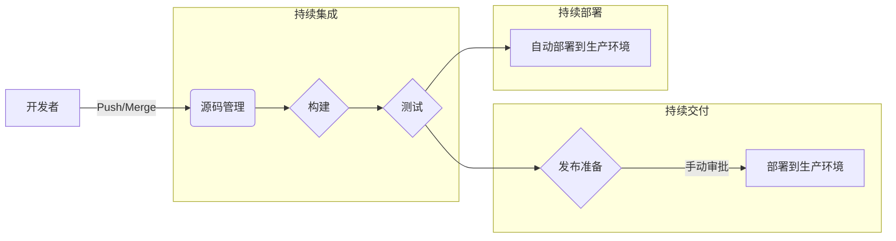
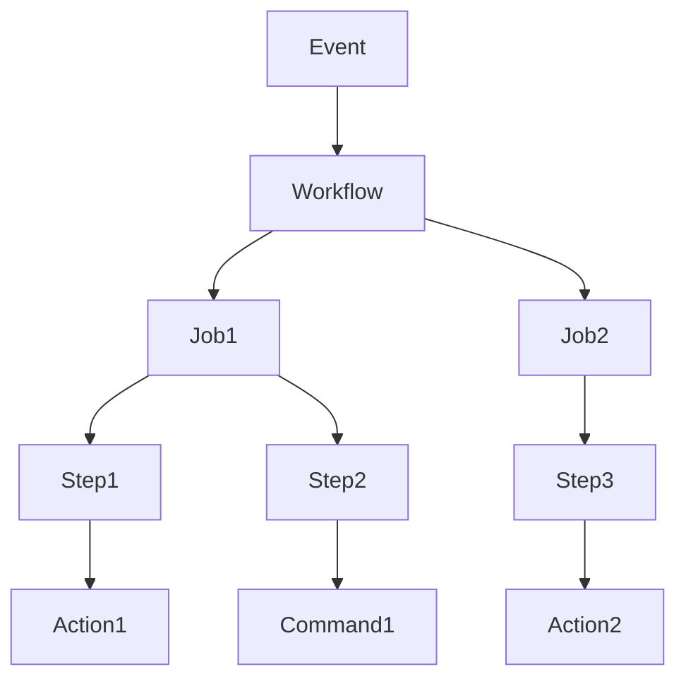
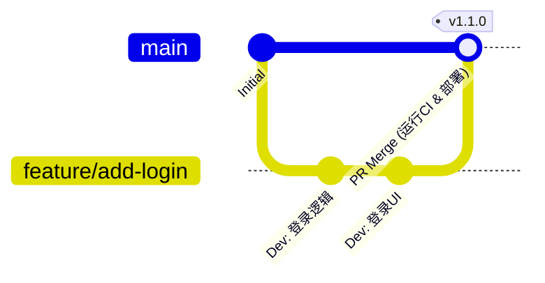

# 引言：现代软件开发中CI/CD的重要性

软件开发的速度和质量是决定当今商业竞争力的最重要因素之一。实现这两者的核心技术是 **CI/CD** （持续集成 / 持续交付・部署）。

本文将从CI/CD的基本概念出发，结合详细的代码示例和图解，为您讲解如何使用现代开发平台的行业标准 **GitHub Actions** 构建实用的流水线，以及实务中非常有用的最佳实践。

## 什么是CI/CD？

CI/CD是一种实践，旨在持续测试软件更改并将其安全快速地发布到生产环境中。

### 持续集成（CI: Continuous Integration）

这是开发人员频繁（理想情况下每天多次）将代码合并到共享仓库的实践。每次合并代码时，都会运行自动化的构建和测试，以及早发现集成错误。

*   **目的:** 尽早发现错误，减轻集成的痛苦（集成地狱）。
*   **主要流程:** 代码编译、静态分析（Lint）、单元测试（Unit Test）。

### 持续交付（CD: Continuous Delivery）与持续部署（CD: Continuous Deployment）

它们是CI的延伸，是自动准备可发布状态的软件的过程。

*   **持续交付:** 始终保持准备好部署到生产环境的状态。实际部署需手动触发。
*   **持续部署:** 将通过测试的所有更改自动部署到生产环境，无需人工干预。



---

# GitHub Actions的基础知识

GitHub Actions是一个强大的平台，可以直接在GitHub仓库中自动化软件开发工作流。除了CI/CD，还可以自动化与仓库相关的所有任务，例如自动整理Issue和自动生成发布说明。

## 核心概念

要熟练使用GitHub Actions，必须了解以下基本概念。

1.  **Workflow (工作流):** 执行一个或多个作业的自动化过程。在YAML文件中定义。
2.  **Event (事件):** 触发工作流执行的特定活动（例如： `push`, `pull_request`, 定时执行 `schedule` 等）。
3.  **Job (作业):** 在同一个运行器上执行的一系列步骤。默认情况下作业并行运行，但也可以设置依赖关系。
4.  **Step (步骤):** 在作业内执行命令或调用Action的各个任务。
5.  **Action (动作):** 执行复杂且频繁重复的任务的、可重用的独立命令。（例如：检出仓库、设置Node.js）。
6.  **Runner (运行器):** 运行工作流的服务器。有GitHub托管的运行器（Ubuntu, Windows, macOS）和自托管的运行器。



---

# 使用GitHub Actions构建CI/CD流水线的实践

从这里开始，我们将通过查看具体的YAML文件，一步步讲解如何构建CI流水线。以Node.js（TypeScript）项目为例。

## 1. 基本的CI工作流

首先，我们将创建一个基本的工作流，在推送代码或创建Pull Request时进行依赖项安装和测试。

在项目根目录下创建 `.github/workflows/ci.yml` ，并写入以下内容。

```yaml
name: Node.js CI

on:
  push:
    branches: [ "main", "develop" ]
  pull_request:
    branches: [ "main", "develop" ]

jobs:
  build:
    runs-on: ubuntu-latest

    steps:
    - name: 检出代码
      uses: actions/checkout@v4

    - name: 设置Node.js
      uses: actions/setup-node@v4
      with:
        node-version: '20'

    - name: 安装依赖项
      run: npm ci

    - name: 运行构建
      run: npm run build

    - name: 运行测试
      run: npm test
```

### 重点解析

*   **`on:`** 以向 `main` 和 `develop` 分支的 `push` 和 `pull_request` 作为触发器。
*   **`actions/checkout@v4`:** 将仓库的代码下载到工作区。这几乎是CI的第一步所必需的。
*   **`actions/setup-node@v4`:** 构建指定版本的Node.js环境。
*   **`npm ci`:** 比 `npm install` 更快，并且基于 `package-lock.json` 进行严格的安装，因此适合CI环境。

## 2. 优化执行速度：利用缓存

CI的执行时间直接影响开发人员的反馈循环。利用缓存来缩短依赖项下载时间是 **最佳实践** 。

`actions/setup-node` 内置了缓存功能。

```yaml
    - name: 设置Node.js
      uses: actions/setup-node@v4
      with:
        node-version: '20'
        cache: 'npm' # 缓存npm依赖项
```

这样，将以 `package-lock.json` 的哈希值作为键缓存 `~/.npm` 目录，随后的执行将大幅加快。

## 3. 质量保证：Lint与Format

为了保持代码质量统一，在构建和测试之前，应该包含Lint（静态分析）和Format（代码格式化）检查。

```yaml
jobs:
  lint-and-test:
    runs-on: ubuntu-latest
    steps:
      - uses: actions/checkout@v4
      - uses: actions/setup-node@v4
        with:
          node-version: '20'
          cache: 'npm'
      
      - run: npm ci

      - name: 运行ESLint
        run: npm run lint

      - name: 检查Prettier
        run: npm run format:check

      - name: 运行测试
        run: npm test
```

## 4. 安全扫描（DevSecOps）

在现代的CI/CD中，自动化安全检查的 **DevSecOps** 方法是不可或缺的。使用GitHub Actions可以轻松集成安全扫描。

### 依赖项漏洞扫描 (npm audit)

```yaml
      - name: 漏洞扫描
        run: npm audit
```

### 静态应用程序安全测试 (SAST)

可以使用GitHub Advanced Security的功能（如CodeQL等）扫描源代码本身的漏洞。（※在私有仓库中可能需要许可证）

```yaml
  security-scan:
    runs-on: ubuntu-latest
    steps:
    - uses: actions/checkout@v4
    
    - name: 初始化CodeQL
      uses: github/codeql-action/init@v3
      with:
        languages: javascript

    - name: 执行CodeQL分析
      uses: github/codeql-action/analyze@v3
```

## 5. 使用矩阵构建进行跨平台测试

如果是开发库等，需要在多个OS和运行时版本上进行测试。使用 `strategy.matrix` 可以轻松构建并行测试环境。

```yaml
jobs:
  test:
    runs-on: ${{ matrix.os }}
    strategy:
      matrix:
        node-version: [18, 20, 22]
        os: [ubuntu-latest, windows-latest, macos-latest]
        
    steps:
    - uses: actions/checkout@v4
    - name: 在 ${{ matrix.os }} 上使用 Node.js ${{ matrix.node-version }}
      uses: actions/setup-node@v4
      with:
        node-version: ${{ matrix.node-version }}
    - run: npm ci
    - run: npm test
```

通过此配置，将并行执行3个Node.js版本 × 3个OS = 共计9个作业。

---

# 分支策略与CI/CD的联动

要构建高效的CI/CD流水线，必须与开发团队的 **分支策略** 紧密结合。下面讲解与典型策略的联动示例。

## 与GitHub Flow的联动

GitHub Flow是一种简单的策略，它始终保持 `main` 分支处于可部署状态，而在Feature分支上进行功能添加。



*   **Feature分支:** 每次 `push` 时，都会运行Lint和单元测试（CI）。
*   **Pull Request:** 创建向 `main` 的PR时，会执行CI，并设置分支保护规则，如果CI不成功则无法合并。
*   **main分支:** 合并后，将运行CI，然后自动部署到预发布环境或生产环境（CD）。

## 分割CI/CD流水线

在复杂的项目中， **最佳实践** 是按目的分割工作流文件，而不是创建一个巨大的文件。

1.  `pr-check.yml`: 创建PR时。Lint、快速的单元测试（Unit Test）。（目的：快速反馈）
2.  `ci-main.yml`: 合并到 `main` 时。完整的构建、繁重的E2E测试。（目的：发布前的质量保证）
3.  `cd-deploy.yml`: 创建标签时（例： `v1.0.0`）。部署到生产环境。（目的：发布）

---

# 高级GitHub Actions技巧

介绍用于构建更实用、可维护性更高的流水线的高级功能。

## Reusable Workflows (可重用工作流)

如果在多个仓库中有类似的CI过程，可以将工作流本身通用化。使用 `workflow_call` 触发器。

**被调用方 ( `.github/workflows/reusable-ci.yml` ):**

```yaml
on:
  workflow_call:
    inputs:
      node-version:
        required: true
        type: string

jobs:
  build:
    runs-on: ubuntu-latest
    steps:
      - uses: actions/checkout@v4
      - uses: actions/setup-node@v4
        with:
          node-version: ${{ inputs.node-version }}
      - run: npm ci
      - run: npm test
```

**调用方:**

```yaml
on: [push]

jobs:
  call-workflow:
    uses: my-org/my-repo/.github/workflows/reusable-ci.yml@main
    with:
      node-version: '20'
```

## 利用 [OIDC](https://kenji.blog/zh-cn/p/oauth2-oidc-authentication-authorization-difference/) ([OpenID Connect](https://kenji.blog/zh-cn/p/oauth2-oidc-authentication-authorization-difference/)) 进行安全的云集成

在部署到AWS、GCP、Azure等云提供商时，将长期凭证（如密钥）保存在GitHub中会带来安全风险。

使用OIDC，GitHub Actions作业可以向云提供商请求临时令牌，从而安全地进行身份验证。

例如，在部署到AWS时：

```yaml
permissions:
  id-token: write # 签发OIDC令牌所需
  contents: read

jobs:
  deploy:
    runs-on: ubuntu-latest
    steps:
      - uses: actions/checkout@v4
      
      - name: 配置AWS凭证
        uses: aws-actions/configure-aws-credentials@v4
        with:
          role-to-assume: arn:aws:iam::123456789012:role/my-github-actions-role
          aws-region: ap-northeast-1
          
      - name: 部署到S3
        run: aws s3 sync ./dist s3://my-bucket/
```

不持有密码，而是以承担角色（Assume Role）的形式获取权限，因此非常安全。

---

# 引入CI/CD的数理效应

引入CI/CD的效果可以通过部署频率、交货时间等指标来衡量。

例如，设部署频率为 $\lambda$ （次/日），一次手动部署所需时间为 $T_{manual}$ ，自动化所需时间为 $T_{auto}$ 。

每天节省的部署操作时间 $S$ 可表示如下：

$ S = \lambda \times (T_{manual} - T_{auto}) $

自动化程度越高， $\lambda$ 越大（一天内多次部署的状态），节省的时间 $S$ 就急剧增加。这意味着开发人员可以投入更多时间开发更有价值的新功能。

---

# 总结

本文从CI/CD的基础出发，详细讲解了如何使用GitHub Actions构建实用的流水线，以及开发一线所需的最佳实践。

*   **频繁集成:** 为了尽早发现错误，请频繁合并小的更改。
*   **利用缓存:** 缩短工作流的执行时间，提升开发体验。
*   **自动化质量和安全:** 将Lint、测试、漏洞扫描集成到流水线中。
*   **利用[OIDC](https://kenji.blog/zh-cn/p/oauth2-oidc-authentication-authorization-difference/):** 与云提供商的集成，请使用基于OIDC的临时令牌而非密钥。

GitHub Actions是一个非常灵活和强大的工具。建议从自动化Lint等小步骤开始，随着项目的成长，逐步扩展流水线。借助自动化的力量，实现更快、更高质量的软件开发吧。
