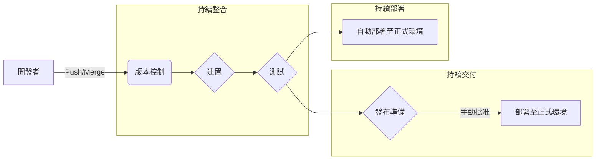
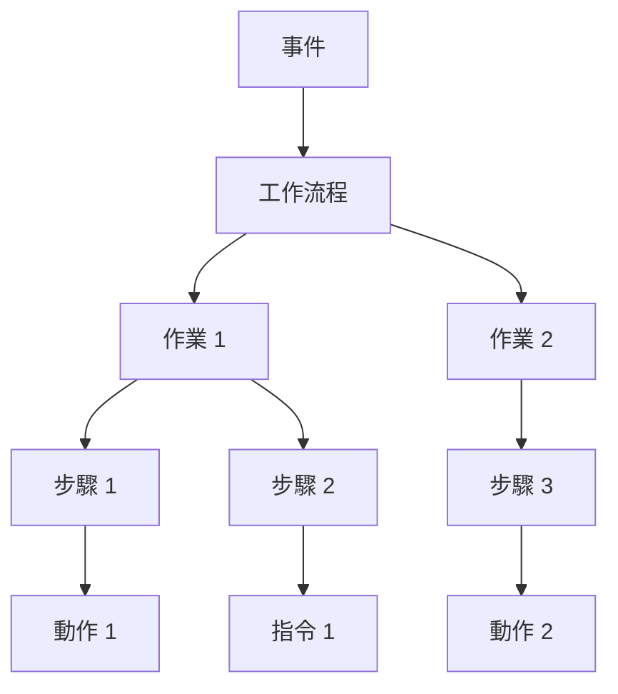
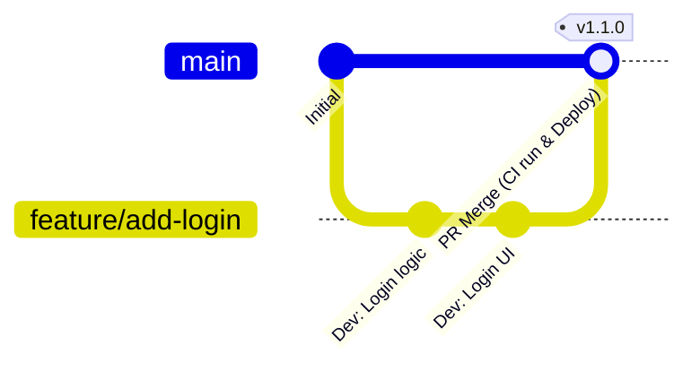

# 前言：現代軟體開發中 CI/CD 的重要性

軟體開發的速度與品質，是當今商業環境中決定競爭力的最重要因素之一。實現這兩者兼顧的核心技術即是 **CI/CD** （持續整合 / 持續交付與部署）。

本文將從 CI/CD 的基本概念出發，結合現代開發平台的業界標準 **GitHub Actions** ，並搭配詳細的程式碼範例與圖解，為您解說實用的管線建置方法以及實務上的最佳實務。

## 何謂 CI/CD？

CI/CD 是一種持續測試軟體變更，並將其安全且快速地發布到正式環境的實務做法。

### 持續整合（CI: Continuous Integration）

這是一種開發人員頻繁地（理想情況是一天多次）將程式碼合併到共用儲存庫的實務做法。每次合併程式碼時，都會執行自動化的建置與測試，以便及早發現整合錯誤。

*   **目的：** 早期發現 Bug，減輕整合的痛苦（整合地獄）。
*   **主要流程：** 程式碼編譯、靜態分析（Lint）、單元測試（Unit Test）。

### 持續交付（CD: Continuous Delivery）與持續部署（CD: Continuous Deployment）

這是 CI 的延伸，也是一種自動準備可發布狀態軟體的流程。

*   **持續交付：** 隨時保持準備好部署至正式環境的狀態。實際的部署則由手動觸發。
*   **持續部署：** 將所有通過測試的變更，在無需人工介入的情況下自動部署至正式環境。



---

# GitHub Actions 基礎知識

GitHub Actions 是一個強大的平台，能讓您直接在 GitHub 儲存庫內自動化軟體開發工作流程。不僅是 CI/CD，包含 Issue 的自動整理、發行說明的自動產生等，所有與儲存庫相關的作業都能夠自動化。

## 核心概念

要熟練使用 GitHub Actions，必須了解以下的基本概念。

1.  **Workflow (工作流程)：** 執行一個或多個作業的自動化流程。以 YAML 檔案定義。
2.  **Event (事件)：** 觸發工作流程執行的特定活動（例如： `push`、`pull_request`、定期執行 `schedule` 等）。
3.  **Job (作業)：** 在同一個執行器上執行的一系列步驟。預設情況下作業會平行執行，但也可以設定相依關係。
4.  **Step (步驟)：** 在作業內執行指令，或是呼叫 Action 的個別任務。
5.  **Action (動作)：** 執行複雜且頻繁重複任務的、可重複使用的獨立指令。（例如：檢出儲存庫、設定 Node.js）。
6.  **Runner (執行器)：** 執行工作流程的伺服器。分為 GitHub 託管的執行器（Ubuntu, Windows, macOS）與自行託管的執行器。



---

# 使用 GitHub Actions 建置 CI/CD 管線實務

接下來，我們將一邊檢視具體的 YAML 檔案，一邊逐步解說 CI 管線的建置方法。在此以 Node.js（TypeScript）專案為例。

## 1. 基本的 CI 工作流程

首先，建立一個當程式碼被推送或建立 Pull Request 時，能安裝依賴項目並進行測試的基本工作流程。

在專案根目錄建立 `.github/workflows/ci.yml` ，並撰寫如下內容。

```yaml
name: Node.js CI

on:
  push:
    branches: [ "main", "develop" ]
  pull_request:
    branches: [ "main", "develop" ]

jobs:
  build:
    runs-on: ubuntu-latest

    steps:
    - name: 檢出程式碼
      uses: actions/checkout@v4

    - name: 設定 Node.js
      uses: actions/setup-node@v4
      with:
        node-version: '20'

    - name: 安裝依賴項目
      run: npm ci

    - name: 執行建置
      run: npm run build

    - name: 執行測試
      run: npm test
```

### 重點解說

*   **`on:`** 以對分支 `main` 及 `develop` 的 `push` 和 `pull_request` 作為觸發條件。
*   **`actions/checkout@v4`:** 將儲存庫的程式碼下載至工作區。這幾乎是 CI 的必備首要步驟。
*   **`actions/setup-node@v4`:** 建構指定版本的 Node.js 環境。
*   **`npm ci`:** 比 `npm install` 更快速，且會嚴格依照 `package-lock.json` 進行安裝，非常適合 CI 環境。

## 2. 最佳化執行速度：活用快取

CI 的執行時間直接關係到開發者的回饋循環。為了縮短下載依賴項目的時間，活用快取是 **最佳實務** 。

`actions/setup-node` 內建了快取功能。

```yaml
    - name: 設定 Node.js
      uses: actions/setup-node@v4
      with:
        node-version: '20'
        cache: 'npm' # 快取 npm 的依賴項目
```

如此一來，將會以 `package-lock.json` 的雜湊值為鍵值快取 `~/.npm` 目錄，使後續的執行速度大幅提升。

## 3. 確保品質：Lint 與 Format

為了維持統一的程式碼品質，在建置與測試前應該加入 Lint（靜態分析）與 Format（程式碼排版）的檢查。

```yaml
jobs:
  lint-and-test:
    runs-on: ubuntu-latest
    steps:
      - uses: actions/checkout@v4
      - uses: actions/setup-node@v4
        with:
          node-version: '20'
          cache: 'npm'
      
      - run: npm ci

      - name: 執行 ESLint
        run: npm run lint

      - name: 檢查 Prettier
        run: npm run format:check

      - name: 執行測試
        run: npm test
```

## 4. 安全性掃描（DevSecOps）

在現代的 CI/CD 中，自動化安全性檢查的 **DevSecOps** 做法不可或缺。透過 GitHub Actions 即可輕鬆整合安全性掃描。

### 依賴項目的漏洞掃描 (npm audit)

```yaml
      - name: 掃描漏洞
        run: npm audit
```

### 靜態應用程式安全測試 (SAST)

可以利用 GitHub Advanced Security 的功能（例如 CodeQL）來掃描原始碼本身的漏洞。（※私人儲存庫可能需要授權）

```yaml
  security-scan:
    runs-on: ubuntu-latest
    steps:
    - uses: actions/checkout@v4
    
    - name: Initialize CodeQL
      uses: github/codeql-action/init@v3
      with:
        languages: javascript

    - name: Perform CodeQL Analysis
      uses: github/codeql-action/analyze@v3
```

## 5. 透過矩陣建置進行跨平台測試

如果您正在開發函式庫等，可能需要在多個作業系統或執行環境版本上進行測試。使用 `strategy.matrix` 即可輕鬆建構平行測試環境。

```yaml
jobs:
  test:
    runs-on: ${{ matrix.os }}
    strategy:
      matrix:
        node-version: [18, 20, 22]
        os: [ubuntu-latest, windows-latest, macos-latest]
        
    steps:
    - uses: actions/checkout@v4
    - name: Use Node.js ${{ matrix.node-version }} on ${{ matrix.os }}
      uses: actions/setup-node@v4
      with:
        node-version: ${{ matrix.node-version }}
    - run: npm ci
    - run: npm test
```

透過這項設定，將會平行執行 3 個 Node.js 版本 × 3 個 OS = 共 9 個作業。

---

# 分支策略與 CI/CD 的整合

要建置有效的 CI/CD 管線，必須與開發團隊的 **分支策略** 緊密結合。以下解說與代表性策略的整合範例。

## 與 GitHub Flow 的整合

GitHub Flow 是一種簡單的策略：始終保持 `main` 分支處於可部署狀態，並在 Feature 分支上進行功能擴充。



*   **Feature 分支：** 每次 `push` 時，都會執行 Lint 和單元測試（CI）。
*   **Pull Request：** 建立合併至 `main` 的 PR 時，會執行 CI，並可設定保護規則以確保成功後才能合併。
*   **main 分支：** 合併後會執行 CI，接著自動部署（CD）至預備環境或正式環境。

## CI/CD 管線的分割

在複雜的專案中，與其建立一個巨大的工作流程檔案，不如依目的將其分割，這是 **最佳實務** 。

1.  `pr-check.yml`: PR 建立時。Lint、快速的 Unit Test。（目的：迅速取得回饋）
2.  `ci-main.yml`: 合併至 `main` 時。完整的建置、耗時的 E2E 測試。（目的：發布前的品質保證）
3.  `cd-deploy.yml`: 建立標籤時（例如： `v1.0.0`）。部署至正式環境。（目的：發布）

---

# 進階的 GitHub Actions 技巧

接著介紹一些進階功能，幫助您建置更實用且易於維護的管線。

## Reusable Workflows (可重複使用的工作流程)

如果在多個儲存庫中有相似的 CI 流程，您可以將工作流程本身共用化。請使用 `workflow_call` 觸發條件。

**被呼叫端 ( `.github/workflows/reusable-ci.yml` )：**

```yaml
on:
  workflow_call:
    inputs:
      node-version:
        required: true
        type: string

jobs:
  build:
    runs-on: ubuntu-latest
    steps:
      - uses: actions/checkout@v4
      - uses: actions/setup-node@v4
        with:
          node-version: ${{ inputs.node-version }}
      - run: npm ci
      - run: npm test
```

**呼叫端：**

```yaml
on: [push]

jobs:
  call-workflow:
    uses: my-org/my-repo/.github/workflows/reusable-ci.yml@main
    with:
      node-version: '20'
```

## 利用 [OIDC](https://kenji.blog/zh-tw/p/oauth2-oidc-authentication-authorization-difference/) ([OpenID Connect](https://kenji.blog/zh-tw/p/oauth2-oidc-authentication-authorization-difference/)) 進行安全的雲端整合

部署至 AWS、GCP、Azure 等雲端供應商時，若將長期的憑證（如密鑰）儲存在 GitHub 會有安全上的風險。

使用 OIDC 時，GitHub Actions 的作業會向雲端供應商要求暫時性的權杖，以便安全地進行驗證。

例如，部署至 AWS 時：

```yaml
permissions:
  id-token: write # 核發 OIDC 權杖所需
  contents: read

jobs:
  deploy:
    runs-on: ubuntu-latest
    steps:
      - uses: actions/checkout@v4
      
      - name: Configure AWS Credentials
        uses: aws-actions/configure-aws-credentials@v4
        with:
          role-to-assume: arn:aws:iam::123456789012:role/my-github-actions-role
          aws-region: ap-northeast-1
          
      - name: Deploy to S3
        run: aws s3 sync ./dist s3://my-bucket/
```

由於不持有密碼，而是透過擔任角色（Assume Role）的方式取得權限，因此非常安全。

---

# 導入 CI/CD 的數學效益

導入 CI/CD 所帶來的效益，可以透過部署頻率及前置時間（Lead Time）等指標來衡量。

舉例來說，假設部署頻率為 $\lambda$ （次/日），單次手動部署所需時間為 $T_{manual}$ ，自動化所需時間為 $T_{auto}$ 。

則每日部署作業所減少的時間 $S$ 可表示如下：

$ S = \lambda \times (T_{manual} - T_{auto}) $

隨著自動化程度提高， $\lambda$ 增加（達成一天內多次部署的狀態）時，所節省下來的時間 $S$ 將會大幅增加。這意味著開發人員能將時間投資在開發更具價值的新功能上。

---

# 總結

本文從 CI/CD 的基礎談起，詳細解說了如何使用 GitHub Actions 建置實用的管線，以及開發現場所需的最佳實務。

*   **頻繁整合：** 為了及早發現 Bug，請頻繁地合併微小的變更。
*   **活用快取：** 縮短工作流程的執行時間，提升開發體驗。
*   **自動化品質與安全性：** 將 Lint、測試、漏洞掃描整合至管線中。
*   **利用 [OIDC](https://kenji.blog/zh-tw/p/oauth2-oidc-authentication-authorization-difference/)：** 與雲端供應商整合時，請使用 OIDC 發行的暫時性權杖取代密鑰。

GitHub Actions 是一套極具彈性且強大的工具。建議您先從自動化 Lint 等一小步開始，再隨著專案成長逐步擴充管線。讓我們藉助自動化的力量，實現更快速、更高品質的軟體開發吧。
