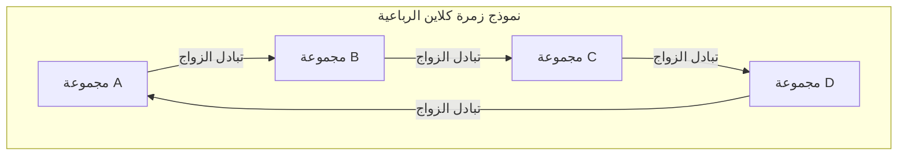

# كلود ليفي ستروس وثورة البنيوية: تفكيك المركزية الغربية وهندسة "الفكر البري"

## الفصل الأول: شفق الوجودية والتغيرات التكتونية الفكرية في باريس

في منتصف القرن العشرين، كان عالم الفكر الفرنسي يقع ضمن المجال المغناطيسي القوي للوجودية التي كان محورها جان بول سارتر. فلسفة سارتر التي رفعت شعار "الوجود يسبق الماهية"، مؤكدة على الذاتية الحرة للإنسان والمشاركة الاجتماعية (الالتزام)، قدمت أخلاقيات جديدة وشعاع أمل للمثقفين الأوروبيين الذين نجوا من الكارثة غير المسبوقة للحرب العالمية الثانية. ومع ذلك، كان كلود ليفي ستروس يمهد بهدوء لتغير تكتوني حاسم ضد هذا النموذج المتمحور حول الإنسان والذي يفترض تقدم التاريخ بشكل لاواعٍ.

في نقطة البداية الفكرية لليفي ستروس، كان هناك "شعور بعدم الارتياح" العميق. أليس تفاؤل الوجودية القائل بأن الوعي الذاتي يمكنه تحديد كل شيء مجرد غطرسة حديثة ومحلية غربية بحتة، إذا ما نظرنا إليها من منظور حيوات السكان الأصليين التي شهدها في ماتو غروسو بالبرازيل، أو من منظور المقياس العظيم لتاريخ البشرية؟ هذا الحدس تحول إلى يقين نظري عندما هرب من الاضطهاد كيهودي خلال الحرب العالمية الثانية ولجأ إلى نيويورك في الولايات المتحدة. هناك التقى بشكل مصيري باللغوي رومان ياكوبسون الذي ينتمي إلى مدرسة الشكلانية الروسية.

ما جلبه ياكوبسون إليه كان المنهجية الدقيقة لـ "علم اللغة البنيوي" و"الفونولوجيا" (علم الأصوات) التي نشأت مع فرديناند دي سوسير وتم صقلها من قبل مدرسة براغ (نيكولاي تروبيتزكوي وآخرين). أثبتت الفونولوجيا أن الفونيمات (الصوتيات) الفردية بحد ذاتها لا تحمل معنى، بل إن "نظام الاختلافات (العلاقات)" بين فونيم وآخر هو ما يولد المعنى. أدرك ليفي ستروس بحدسه أن نموذج "نظام العلاقات الذي يعمل على مستوى اللاوعي" سيكون المفتاح العالمي لفك شفرة الثقافة البشرية بأكملها، ليس فقط في اللغة، بل في أنظمة القرابة، والأساطير، والطقوس. كانت هذه هي اللحظة التاريخية لإدخال البنيوية في مجال الأنثروبولوجيا الثقافية، وبداية "الثورة البنيوية" التي فككت امتياز الذات والوعي.

في حين اعتبرت الوجودية السارترية "الوعي" و"الاختيار الحر" للفرد كقوى دافعة لتشكيل التاريخ، جادل ليفي ستروس بأنه وراء الاختيارات الذاتية للإنسان، توجد "بنية" صلبة تعمل في اللاوعي. الذات يتم التحدث بها من قبل البنية، وليست الذات هي من تتحكم في البنية. هذا التحول النموذجي زعزع من الجذور تفوق "الكوجيتو" (أنا أفكر) منذ ديكارت.

## الفصل الثاني: الصدمة الرياضية لـ "البنى الأولية للقرابة" (1949)

الكتاب المنشور في عام 1949، "البنى الأولية للقرابة"، أصبح عملاً أثرياً غيّر المشهد الأنثروبولوجي تماماً. هنا، أعاد ليفي ستروس صياغة ظاهرة "محرمات سفاح القربى"، التي تُرى في مختلف المجتمعات حول العالم، كآلية عالمية تربط بين الطبيعة والثقافة. حتى ذلك الحين، غالباً ما كانت تُفسر محرمات سفاح القربى على أنها غريزية لمنع التدهور البيولوجي، أو ناتجة عن الاشمئزاز النفسي. لكنه أدرك أن جوهر محرمات سفاح القربى لا يكمن في الحظر السلبي "بمن لا ينبغي الزواج"، بل في قاعدة "التبادل" الإيجابية المتمثلة في "التنازل عن نساء مجموعة الذات لمجموعة أخرى، وتلقي نساء من مجموعة أخرى في المقابل".

في بناء هذه النظرية، اعتمد على "مقال في الهبة" لمارسيل موس. أوضح موس أنه في المجتمعات القديمة، الهدايا هي آلية لتشكيل والحفاظ على الروابط الاجتماعية (التحالفات) من خلال ثلاثة التزامات: "الالتزام بالعطاء، والالتزام بالتلقي، والالتزام بالرد". طبق ليفي ستروس منطق العطاء هذا على أنظمة القرابة (الزواج). بعبارة أخرى، الزواج هو نظام تبادل بين المجموعات يعتمد على نموذج المرأة كأثمن "هدية"، وبهذا قفزت البشرية من قانون الطبيعة (الانغلاق بناءً على صلة الدم البيولوجية فقط) إلى قانون الثقافة (علاقات التحالف المفتوحة مع الآخرين).

والأمر الأكثر إبداعاً هو أن ليفي ستروس أدخل "نظرية الزمر" في الرياضيات الحديثة لتحليل هيكل القرابة هذا. بالتعاون مع عبقري الرياضيات من مجموعة بورباكي، أندريه فايل، الذي صادقه في سنوات نيويورك، أثبت أن قواعد الزواج المعقدة للغاية لدى السكان الأصليين الأستراليين (مثل نظام قبيلتي مورنغين وكاريرا) تتطابق تماماً مع بنية الزمر في الجبر (وخاصة "زمرة كلاين الرباعية").

زمرة كلاين الرباعية (Klein four-group) هي زمرة أبيلية تتكون من 4 عناصر، ولديها خاصية (الالتفاف) بأن تطبيق أي عنصر مرتين يعيده إلى حالته الأصلية. أظهر ليفي ستروس وفايل أن قواعد الزواج في أنظمة القرابة منظمة بشكل منهجي وفقاً للخصائص الرياضية لهذه الزمرة. يوضح المخطط الأساسي أدناه باستخدام Mermaid.

(*آليات التبادل المتماثل وغير المتماثل، والتبادل المقيد والتبادل المعمم في أنظمة القرابة الفعلية، تم فهمها بشكل موحد لأول مرة من خلال هذا النموذج الرياضي. على وجه الخصوص، أصبح من الواضح أن التبادل المعمم (نظام دائري حيث يعطي A لـ B، ويعطي B لـ C، ويعطي C لـ A) هو آلية قوية تدمج المجتمع بأسره.*)

هذا الإدخال للصيغة الجبرية من قبل فايل أظهر للعالم أن أنظمة القرابة للأشخاص الذين كانوا يُعتبرون "بدائيين" هي هندسة دقيقة مصممة بذكاء رياضي متقدم (وهم يستخدمونها دون وعي). بنية القرابة التي كان العلماء الغربيون يعتبرونها "معقدة للغاية بحيث لا يمكن فهمها"، ظهرت كبلورة ذات تناسق يخطف الأنفاس وتماسك منطقي من خلال عدسة نظرية الزمر.

## الفصل الثالث: "المداريات الحزينة" (1955) وشفق الحضارة الغربية

"المداريات الحزينة" المنشور عام 1955 هو إثنوغرافيا أكاديمية، وفي نفس الوقت تحفة أدبية نادرة، وكتاب للتأمل الفلسفي. هذا العمل، الذي يبدأ بالعبارة الاستفزازية "أنا أكره السفر والمستكشفين"، يتكشف حول ذكريات عمله الميداني في ثلاثينيات القرن العشرين في ولاية ماتو غروسو البرازيلية الداخلية. ما واجهه ليفي ستروس هناك كان السكان الأصليين من قبائل كاديوفيو، وبورورو، ونامبيكوارا، وتوبي كافاهيب.

الوشوم المعقدة ذات الزخارف العربية التي ترسمها نساء الكاديوفيو على وجوههن. وجد ليفي ستروس في هذا النمط الهندسي غير المتماثل ولكن المحسوب بدقة، محاولة لاواعية لحل رمزي للتناقضات والتوترات في نظام الطبقات الذي يعاني منه مجتمعهم. الوشم على الوجه لم يكن مجرد زخرفة، بل فنانة ذات "وظيفة سوسيولوجية" للتوسط في التصدعات الهيكلية للمجتمع على الجلد.

كان الهيكل القروي لقبيلة البورورو أكثر درامية. صُممت قراهم بشكل دائري، مع ساحة مركزية ومبنى تجمع للرجال في المنتصف، مع توزيع مكاني صارم للعشائر وأنصاف العشائر (Moieties). فك ليفي ستروس شفرة أن هذا التوزيع المادي للقرية في حد ذاته هو "نموذج هيكلي حي" يصور نظرتهم للكون وعلاقات القربى والنظام الأسطوري. حقيقة أن أول ما فعله المبشرون المسيحيون لتحويلهم كان "إعادة بناء القرية في خط مستقيم" تحكي بوضوح كيف أن تدمير الهيكل المكاني يرتبط بشكل مباشر بتدمير كونهم الروحي.

وفي تفاعله مع قبيلة النامبيكوارا التي حافظت على نمط الحياة الأكثر بدائية، توصل ليفي ستروس إلى بصيرة صادمة حول "أصل الكتابة". هذه هي القصة الشهيرة المعروفة باسم "درس في الكتابة". تظاهر رئيس النامبيكوارا، على الرغم من أنه لا يملك كتابة، بتقليد عالم الأنثروبولوجيا بتدوين ملاحظات عن طريق رسم خطوط متموجة على ورقة والتظاهر بقراءتها، لإظهار سلطته أمام أفراد القبيلة. من هنا، يطرح ليفي ستروس فرضية جذرية مفادها أن الكتابة لم تُخترع في الأصل من أجل حفظ المعرفة أو تطور الحضارة، بل لتسهيل "سيطرة الإنسان على الإنسان واستغلاله". الكتابة تثبت القوانين والعقود، وتجعل فرض الضرائب ممكناً، وتجمد المجتمع الطبقي. هذه الإشارة إلى أن "الكتابة" التي اعتبرها الغرب أساساً لتفوقه كانت في الواقع تكنولوجيا للقمع، كان لها تأثير حاسم لاحقاً على نقد المركزية الصوتية لجاك دريدا.

"المداريات الحزينة" مليء بالحداد العميق (نوستالجيا روسوية) على التنوع المفقود. شبه عملية قيام "الحضارة" الغربية بتوحيد الثقافات غير المتجانسة في جميع أنحاء العالم، واستغلالها، وتدميرها بـ "زيادة الإنتروبيا" (العشوائية). يتحدث بتصميم حزين على أن الأنثروبولوجيا يجب أن تكون "علم الإنتروبيا" (entropology) الذي يقاوم هذه الزيادة التي لا رجعة فيها في الإنتروبيا (المسيرة الحتمية نحو التجانس) وينقذ بلورات الهياكل المتنوعة المحفورة في لاوعي البشرية.

## الفصل الرابع: "الفكر البري" (1962) والبريكولاج

كان كتاب "الفكر البري (La Pensée sauvage)" لعام 1962 هو البيان الأقوى للبنيوية، وشكل ضربة قاضية للتاريخانية والتقدمية التي مثلها سارتر. هنا، يفكك ليفي ستروس تماماً التسلسل الهرمي للتفوق الذي سيطر طويلاً على الغرب بين فكر "البدائي" (البري) وفكر "الحضارة" (العلم).

لقد أثبت أن فكر السكان الأصليين (الفكر البري) ليس بأي حال من الأحوال تفكيراً غير منطقي أو ما قبل منطقي، بل هو ذكاء صارم يعادل تماماً التفكير العلمي الحديث. الاختلاف لا يكمن في تفوق أو دونية القدرة الفكرية، بل ببساطة في "الاختلاف في نهج موضوع المعرفة". لا يعتمد الفكر البري على فكر "المهندس" الذي يستخرج المفاهيم المجردة والقوانين العالمية، بل يعتمد على منطق "البريكولاج" (الترقيع / العمل اليدوي) الذي يجمع ويعيد بناء المواد الملموسة المحدودة المتاحة (أجزاء من الأساطير، وتصنيف النباتات والحيوانات، وعناصر الطقوس، وما إلى ذلك) لبناء نظام معاني جديد.

"البريكولور" (المرقع) لا يمتلك أدوات أو مواد متخصصة لغرض معين. فهم يستخدمون "الأدوات المتوفرة" لتركيب نظام العالم بشكل ارتجالي. ذكاء البريكولاج هذا هو المصدر الذي أنتج الثراء المذهل والاتساق المنطقي لأساطير العالم والسحر والطوطمية.

وخاصة في تحليل الطوطمية، رفض ليفي ستروس ببراعة التفسير النفعي لعلماء الأنثروبولوجيا الوظيفية (مالينوفسكي وآخرون) بأن "اختيار حيوان معين كطوطم يرجع إلى فائدته كطعام (أنه جيد للأكل)". يقول: "الحيوانات لا تُختار لأنها جيدة للأكل، بل تُختار لأنها جيدة للتفكير (bon à penser)". تُستخدم الاختلافات بين نباتات وحيوانات معينة (على سبيل المثال "النسر والدب"، "حيوانات السماء وحيوانات الأرض") كـ "أدوات مفاهيمية" للتعبير عن الاختلافات بين المجموعات الاجتماعية البشرية (العلاقة بين العشيرة A والعشيرة B). هذا النظام الذي تعمل فيه الثنائيات في العالم الطبيعي كاستعارات للثنائيات في العالم الثقافي، كان بمثابة التطبيق العملي المثالي لـ "توليد المعنى من خلال الاختلاف" في اللغويات البنيوية.

في الفصل الأخير من هذا الكتاب "التاريخ والديالكتيك"، يوجه ليفي ستروس نصل نقده بلا رحمة نحو تحفة سارتر "نقد العقل الجدلي". جعل سارتر التاريخ بمثابة عملية كشف للحقيقة المطلقة، وميّز المجتمع الحديث الغربي (المجتمع الذي له تاريخ). لكن بالنسبة لليفي ستروس، فإن "تاريخ" سارتر ليس سوى أسطورة حديثة اختلقها المثقفون الغربيون لتبرير هويتهم الخاصة. لا يوجد تفوق جوهري بين "المجتمعات الباردة" التي لا تمتلك كتابة أو تاريخاً (المجتمعات التي تحاول الحفاظ على بنيتها دون تغيير) و"المجتمعات الساخنة" (الغرب الحديث) التي تسعى وراء التغيير والتقدم المستمرين. هذا النقد اللاذع لسارتر كان إعلاناً تاريخياً بأن هيمنة العالم الفكري الفرنسي قد انتقلت تماماً من الوجودية إلى البنيوية.

## الفصل الخامس: "ميثولوجيك" (الأسطوريات - 4 مجلدات) ورسم الخرائط الأسطورية: هندسة الأساطير والمعادلة القانونية

تتمثل قمة الاستكشاف الأكاديمي لليفي ستروس في عمله الضخم "ميثولوجيك (Mythologiques)" المكون من 4 مجلدات نُشرت بين عامي 1964 و 1971. هذا العمل الملحمي المكون من المجلد الأول "النيئ والمطبوخ"، والمجلد الثاني "من العسل إلى الرماد"، والمجلد الثالث "أصل آداب المائدة"، والمجلد الرابع "الإنسان العاري"، جمع أكثر من 800 أسطورة للسكان الأصليين متناثرة في القارتين الأمريكيتين الشمالية والجنوبية، وأثبت أنها ليست مجرد تراكم عشوائي للقصص، بل تشكل "نظام تحويل" ضخماً واحداً.

تبدو الأساطير للوهلة الأولى سخيفة وغير منطقية، وكأنها نتاج الخيال. ومع ذلك، أدرك ليفي ستروس أن بنية جبرية دقيقة تكمن في أعماق الأساطير. الأساطير الفردية لا توجد في عزلة، بل يتم إنشاؤها عن طريق عكس أساطير أخرى أو استبدال عناصرها. أسطورة تروى على أنها صراع بين "الشمس" و"الماء" في قبيلة ما، يتم استبدالها بصراع بين "اليغور" و"الإنسان" في قبيلة مجاورة، وتتحول إلى صراع بين "اللحم النيئ (الطبيعة)" و"اللحم المطبوخ (الثقافة)" في قبيلة أبعد. كل هذه الاختلافات يمكن تفسيرها على أنها "تحويلات (transformation)" لبنية لاواعية مشتركة.

تمت صياغة آلية التحويل الأسطورية هذه في "المعادلة القانونية (Canonical Formula)" الشهيرة. عبر ليفي ستروس عن بنية الأسطورة من خلال النموذج الرياضي التالي:

$F_x(A) : F_y(B) \simeq F_x(B) : F_{a^{-1}}(y)$

هذه المعادلة ليست مجرد استعارة، بل هي نموذج جبري يصف التحول المنطقي للأساطير بدقة بالغة.
هنا، A و B هما "حدود (termes)"، و x و y يمثلان "وظائف (fonctions)" أو خصائص هذه الحدود.
الجانب الأيسر من المعادلة $F_x(A) : F_y(B)$ يوضح العلاقة بين "الحد A الذي يحمل الوظيفة x" و"الحد B الذي يحمل الوظيفة y".
وهذا يتحول إلى الجانب الأيمن $F_x(B) : F_{a^{-1}}(y)$. في الجانب الأيمن، يتولى الحد B الوظيفة x، بينما يحدث تغيير دراماتيكي. يعكس الحد الأصلي A قطبيته ($a^{-1}$)، وتنتقل y التي كانت وظيفة إلى موقع الحد. يُطلق على هذا اسم "الالتواء المزدوج (double twist)".

كمثال ملموس، دعونا ننظر في التحول الهيكلي للأسطورة التي أشار إليها ليفي ستروس في "صانعة الفخار الغيورة" وما شابه.
في أسطورة ما (الجانب الأيسر)، لنفترض أن هناك صراعاً بين "النسر (A) التابع للسماء (x)" و"الدب (B) التابع للأرض (y)". عندما يتم تحويل هذا إلى أسطورة أخرى (الجانب الأيمن)، لا يتم ببساطة تبديل الشخصيات. يظهر "الدب (B) التابع للسماء (x)"، ويظهر "إله يجسد الأرض نفسها (y)" كعنصر مضاد، وينخفض "النسر (A)" الأصلي إلى "روح العالم السفلي ($a^{-1}$، عكس السماء)"، وهكذا ينشأ التواء هيكلي. هذا التحول الطوبولوجي الشبيه بشريط موبيوس، حيث تتحول الوظيفة إلى حد، والحد ينعكس ليتحول إلى وظيفة، يتكرر بلا نهاية في سلسلة الأساطير في القارتين الأمريكيتين.

من خلال هذا التحليل، أثبت ليفي ستروس أنه لا يوجد "أصل" أو "مؤلف أصلي" محدد للأسطورة. الإنسان لا يروي الأساطير. بل "الأسطورة تروي نفسها من خلال لاوعي الإنسان". يعمل دماغ الإنسان (الذكاء) كجهاز عملاق لمعالجة المعلومات (كمبيوتر) يأخذ البيانات الحسية من العالم الطبيعي (النيئ، المطبوخ، الفاسد، إلخ) كمدخلات، ويستخدم خوارزمية التحويل مثل هذه المعادلة القانونية لإخراج نظام ثقافي (قواعد القرابة، والطبخ، والطقوس).

وعلاوة على ذلك، فإن النقطة الجديرة بالملاحظة في "ميثولوجيك" هي أن هيكله العام يعتمد بشكل كبير على "بنية الموسيقى". في مقدمة المجلد الأول، أشاد ليفي ستروس بريتشارد فاغنر باعتباره "الرائد منقطع النظير للتحليل البنيوي"، وقام بتكوين عمله الخاص بتشبيهات بالسيمفونية، وشكل السوناتا، والفيوجا. تمتلك كل من الأساطير والموسيقى هيكلًا زمنيًا "غير قابل للترجمة" بخلاف اللغة. تمامًا كما يتم عزف الفكرة المهيمنة (اللايتموتيف) في الموسيقى بتنويعات، وتنعكس، وتتداخل ضمن الانسجام والطباق، فإن عناصر الأسطورة (ميثيم: الوحدات الأسطورية) تتجاوب مثل الأوركسترا ضمن التقدم الزمني للقصة (اللحن) والتداخل المتزامن للبنية (الانسجام).

وقد أشار إلى هياكل فيوجا باخ وبوليرو رافيل، وقام بتحليل دقيق لكيفية تشكيل الثنائيات الأسطورية للأوتار وحل التنافر الموسيقي. الفضاء الأسطوري هو عبارة عن "كانينغرافي (Canyon/Music/Myth)" عملاقة، أي فضاء متعدد الأبعاد تتقاطع فيه بوليفونية الموسيقى مع الوحدات الأسطورية المتداخلة مثل طبقات الوادي. الاكتشاف بأن المعادلات الرياضية والبوليفونية الموسيقية، التي كانت تعتبر قمة العقل الغربي، كانت في الواقع تعمل بشكل مثالي في أعماق "الفكر البري"، حطم تمامًا غطرسة المركزية الغربية من جذورها.

## ملحق: معلمان ضخمان في التحليل البنيوي للأسطورة (دراسات حالة عملية)

كيف قام منهج ليفي ستروس بتشريح النصوص الأسطورية الملموسة واستخراج الهياكل الجبرية الكامنة فيها؟ من أجل فهم القيمة العملية الحقيقية لهذا، سنتتبع هنا دراستي حالة تمثيليتين له بالتفصيل. هذا التحليل يظهر بوضوح أن البنيوية ليست مجرد فلسفة مجردة، بل هي "عملية جراحية" دقيقة للغاية على النصوص.

### دراسة الحالة 1: التحليل البنيوي لأسطورة أوديب

غيّر تحليل "أسطورة أوديب" الذي قدمه ليفي ستروس في "الأنثروبولوجيا البنيوية" (1958) نموذج تحليل الأساطير بشكل حاسم. بالمقارنة مع هذه الأسطورة اليونانية التي بدا وكأن فرويد قد استنفد تفسيرها في الإطار النفسي لـ "رغبة سفاح القربى (عقدة أوديب)"، فقد اتخذ نهجاً مختلفاً تماماً. لم يقرأ الأسطورة كـ "قصة (تقدم زمني)" على طول المحور الزمني، بل قرأها كـ "حزمة متزامنة (انسجام)" مثل النوتة الموسيقية للأوركسترا.

قام باستخراج جميع أجزاء أسطورة أوديب (ميثيم: الوحدات الأسطورية) وتصنيفها إلى 4 أعمدة رأسية (فئات).
العمود الأول يمثل العناصر التي تشير إلى "المبالغة في تقدير صلات القربى". مثل بحث قدموس عن أخته أوروبا، وزواج أوديب من أمه جوكاستا، وانتهاك أنتيجون للحظر لدفن شقيقها بولينيس.
العمود الثاني، على العكس، يمثل العناصر التي تشير إلى "التقليل من تقدير صلات القربى (العداء)". قتل أوديب لأبيه لايوس، وتقاتل الشقيقين إتيوكليس وبولينيس حتى الموت.
العمود الثالث يمثل العناصر التي تشير إلى "قهر الوحوش (الكائنات الأصلية المولودة من الأرض)". قضاء قدموس على التنين، وقضاء أوديب على أبو الهول.
العمود الرابع يمثل العناصر التي تشير إلى "صعوبة المشي (العيوب الجسدية)". أسماء وخصائص جسدية مثل لايوس (الأعسر/الأخرق)، ولابداكوس (الأعرج)، وأوديب (القدم المتورمة).

المنطق الذي استنتجه ليفي ستروس من هذا مذهل. العلاقة بين العمود الأول والعمود الثاني (المبالغة في صلة القرابة : التقليل منها) متوازية تماماً مع العلاقة بين العمود الثالث والعمود الرابع (إنكار الأصل الذاتي : إثبات الأصل الذاتي). قتل "الوحش المولود من الأرض (رمز للأصل المحلي للإنسان)" يعني إنكار الإيمان بأن الإنسان ولد من الأرض (الانفصال عن الطبيعة). ومع ذلك، فإن صعوبة المشي (جر الأقدام على الأرض) لا تزال تعني أن الإنسان مقيد بالأرض (الأصل المحلي).
بمعنى آخر، كانت أسطورة أوديب آلة حاسبة ضخمة تحاول التوسط منطقياً في التناقض الجذري (أبوريا) الذي كان يعاني منه المجتمع اليوناني القديم: "هل يولد الإنسان من تزاوج رجل وامرأة (الواقع الثقافي والبيولوجي)، أم يولد من الأرض عن طريق التوالد العذري (الطبيعة والإيمان الأسطوري)؟". حتى التفسير النفسي لفرويد، من وجهة نظر ليفي ستروس، ليس سوى أحد "أحدث التنوعات (أشكال التحويل)" لأسطورة أوديب.

### دراسة الحالة 2: البنية المكانية متعددة الطبقات لـ "قصة أسديوال"

تحليل آخر بالغ الأهمية هو التحليل البنيوي لـ "قصة أسديوال (La Geste d'Asdiwal)" (1958) التي تتوارثها قبيلة تسيمشيان في شمال غرب ساحل المحيط الهادئ بأمريكا الشمالية. يُعتبر هذا البحث واحداً من أكمل التبلورات في تحليل ليفي ستروس للأساطير.

في هذه الأسطورة الطويلة التي تدور حول تجوال وزواج البطل أسديوال، قام ليفي ستروس بفك شفرة دقيقة بأن القصة تتكشف في نفس الوقت على 4 مستويات مختلفة: جغرافية، واقتصادية، واجتماعية، وكونية.
على المستوى الجغرافي، ينتقل أسديوال من الشرق إلى الغرب، ومن الجنوب إلى الشمال. على المستوى الاقتصادي، تنتقل الفصول من شتاء المجاعة إلى ربيع هجرة سمك السلمون ثم إلى صيف الصيد. على المستوى الاجتماعي، يتأرجح بين الإقامة مع أسرة الزوجة والإقامة مع أسرة الزوج. على المستوى الكوني، يُمزق بين زوجته من عالم السماء (شعب النجوم) وزوجته من العالم السفلي (شعب البحر).

النهاية المأساوية لأسديوال (حيث تحول إلى حجر وحوصر على قمة جبل) تعكس التناقض الهيكلي غير القابل للحل لـ "الإقامة مع أهل الزوج في مجتمع أمومي" الذي كان يعاني منه مجتمع تسيمشيان بالفعل. من خلال دفع التناقضات التي لا يمكن حلها في المجتمع الواقعي إلى أقصى حدودها على المستوى الخيالي للأسطورة وتصوير انهيارها الذاتي، فإنها تضمن للمفارقة شرعية النظام الاجتماعي الواقعي.
هنا، الأسطورة لم تعد مجرد "انعكاس" أو "نسخة" من الواقع. تعمل الأسطورة كـ "مختبر للواقع الافتراضي (VR)" لاختبار ومحاكاة التصدعات والتشوهات التي يعاني منها الهيكل الاجتماعي الواقعي على المستوى الرمزي. عندما يتم توسيع الثنائيات في الأسطورة إلى أقصى حد وتفشل لأنها لا يمكن حلها، يترسخ في قلوب الناس ارتياح لاواعٍ بأن "النظام الاجتماعي الواقعي (ناتج عن تسوية) يظل أفضل في النهاية".

كما هو واضح من هذه التحليلات، فإن علم الأساطير البنيوي ليس اختزالاً إلى عناصر، بل هو عمل لاستعادة "شبكة العلاقات (network)" بين العناصر. لم تكن هذه محاولة للهندسة التحليلية الديكارتية التي تقسم الهدف إلى أجزاء دقيقة، بل كانت محاولة للطوبولوجيا (الهندسة الوضعية) التي تستكشف الخصائص التي يتم الحفاظ عليها حتى لو تغير الشكل. قدم أوديب المتورمة وجسد أسديوال المتحجر لم يكونا مجرد زخارف للقصة، بل كانا دوال رياضية دقيقة للغاية (معلمات) لوصف العلاقة بين المجتمع البشري والكون.

(*انتقلت طريقة التحليل متعددة الطبقات هذه لاحقاً إلى نظرية الأدب (علم السرد) من قبل رولان بارت وألجيرداس جوليان غريماس، وأصبحت لغة أساسية لا غنى عنها لتحليل النصوص. هذه "الهندسة البرية" التي اكتشفها ليفي ستروس في الأساطير غيرت بشكل حاسم ولا رجعة فيه المشهد المعرفي في النصف الثاني من القرن العشرين.*)

## الفصل السادس: الاتصال بما بعد البنيوية والتراث للزمن المعاصر: اللاوعي البنيوي ومستقبل الذكاء الاصطناعي

النموذج البنيوي الذي وضعه ليفي ستروس في "البنى الأولية للقرابة" و"الفكر البري" أثار عاصفة حاسمة في الفكر المعاصر الفرنسي منذ الستينيات. منهجه الذي جرد "الذات" و"الوعي" و"التاريخ" من امتيازاتها، وسلط الضوء على "بنية اللاوعي" التي تعمل سراً وراءها، انتشر على الفور إلى مجالات أكاديمية أخرى.

أدخل جاك لاكان نظرية التبادل لهيكل القرابة لليفي ستروس ولغويات سوسير في التحليل النفسي، وأرسى الأطروحة الشهيرة القائلة بأن "اللاوعي مبني كاللغة". محاولة لاكان، التي انتقدت بشدة علم نفس الأنا الأمريكي المتمحور حول الأنا (الإيجو)، وأعادت تعريف لاوعي فرويد كشبكة للنظام الرمزي (النظام اللغوي)، لم تكن لتحدث لولا النهج الجبري لليفي ستروس.
في كتابه "الكلمات والأشياء"، استخرج ميشيل فوكو بشكل أثري إطار اللاوعي الذي يحدد المعرفة (الإبستيمي) لكل عصر، وأعلن "نهاية الإنسان" (زوال مفهوم "الذات" الحديث كما يُمحى الوجه المرسوم على شاطئ البحر بواسطة الأمواج). وهذا أيضاً تنويع فكري لتعريف ليفي ستروس للأنثروبولوجيا على أنها "علم الإنتروبيا" (entropology) في نهاية "المداريات الحزينة"، ودعوته لعجز النوايا الواعية للإنسان.
علاوة على ذلك، فكك جاك دريدا وجود "المركز" و"الأصل المطلق" اللذين افترضتهما البنيوية، وفتح الباب لما بعد البنيوية. ومع ذلك، يجب أن نتذكر أن نقد دريدا للمركزية الصوتية ينطلق من القراءة النقدية الحادة لـ "درس في الكتابة" لليفي ستروس عند قبيلة نامبيكوارا. كانت بنيوية ليفي ستروس حجر عثرة ضخماً لا يمكن تجنبه، حتى لمفكري ما بعد البنيوية الذين حاولوا تجاوزها.

واصل ليفي ستروس في سنواته الأخيرة دق ناقوس الخطر بشدة بشأن فقدان التنوع الثقافي وسط العولمة المتسارعة. كان يعتقد أن الثقافة البشرية لا يمكنها الحفاظ على ثرائها إلا من خلال وجود اختلافات مع الآخرين (المسافة المناسبة والعزلة). التواصل المفرط والتجانس يسلبان الثقافة حيويتها الإبداعية، ويؤديان في النهاية إلى الموت الإنتروبي (الموت الحراري) للبشرية جمعاء. كانت هذه الفكرة رؤية إيكولوجية بحتة سبقت عدم قابلية التجزئة بين "التنوع البيولوجي" و"التنوع الثقافي" في عصرنا الحديث. التوجه الأنطولوجي اليوم (مثل التعددية الطبيعية لإدواردو فيفيروس دي كاسترو) الذي يتجاوز الثنائية الديكارتية التي تعتبر الطبيعة (البيئة) والثقافة (الإنسان) نقيضين، ويعيد تقييم "الذكاء المتأصل في العالم الطبيعي" من منظور الأرواحية والطوطمية، هو أيضاً خليفة شرعي لنظريته.

بالإضافة إلى ذلك، فإن التطور السريع لعلوم الكمبيوتر الحديثة، وخاصة الذكاء الاصطناعي (AI)، يلقي ضوءاً جديداً على بنيوية ليفي ستروس. إن الآلية التي تقوم بها النماذج اللغوية الكبيرة (LLMs) والتعلم العميق بحساب "أنماط العلاقات (الاختلافات والمسافات في الفضاء المتجهي)" الكامنة داخل شبكات بيانات النصوص الضخمة، وتوليد المعاني والمنطق منها، هي بالضبط "خوارزمية التحويل الأسطورية" التي تنبأ بها ليفي ستروس. الذكاء الاصطناعي لا "يفهم" المعنى، بل هو مجرد حساب احتمالي وجبري لمصفوفة هيكلية ضخمة من العلامات اللغوية (سلسلة من النماذج والمركبات في فضاء متعدد الأبعاد). ومع ذلك، فإن ما يُخرج منها يبدو للعين البشرية كـ "ذكاء" متقدم أو "قصة".
هذا ليس سوى تنفيذ مادي على رقائق السيليكون والشبكات العصبية لأطروحة ليفي ستروس بأن "الأسطورة تروي نفسها من خلال لاوعي الإنسان". من المفارقات أن المبدأ الأساسي للبنيوية، والذي يفيد بأن الشبكة العلائقية التفاضلية (البنية) للعلامات تنسج نظام المعنى بشكل مستقل دون تدخل وعي الذات أو نيتها، يتم إثباته بأنقى أشكاله من خلال تكنولوجيا الذكاء الاصطناعي الحديثة.

### الخاتمة: بريق الكريستال البارد

كانت النصوص الهائلة التي تركها كلود ليفي ستروس بمثابة كريستالة باردة أُلقيت في عصر الوجودية المتحمس. لقد أثبت ببرود أنه بغض النظر عن مدى صراخ الإنسان من أجل الحرية، فإن تفكيرنا يخضع دائمًا لقيود الهياكل القبلية مثل اللغة، وقواعد القرابة، والأساطير. ومع ذلك، هذه ليست بأي حال من الأحوال فلسفة يأس. ما اكتشفه في أعماق غابات الأمازون وفي التنويعات اللانهائية لأساطير السكان الأصليين، هو بريق لذكاء دقيق وعالمي وهب بالتساوي لجميع البشر، وليس ملكًا حصريًا لنخبة معينة أو "للمجتمع المتحضر".

إن إنجازه العظيم في تفكيك النزعة الإنسانية الغربية الحديثة المتعجرفة وتقديم الجمال الهندسي لـ "الفكر البري" للعالم، ينضح بواقعية يجب إعادة قراءتها بأكبر قدر من الجدية في القرن الحادي والعشرين اليوم، حيث تهتز المركزية البشرية من جذورها بسبب الأزمات البيئية وصعود الذكاء الاصطناعي. "لقد بدأ العالم بدون إنسان وسينتهي بدون إنسان" ــــ هذه النبوءة الحزينة من "المداريات الحزينة" تحمل رنيناً أخلاقياً عميقاً يعلمنا الحجم الحقيقي للإنسان داخل البنية العظيمة للكون، وليس اليأس.
