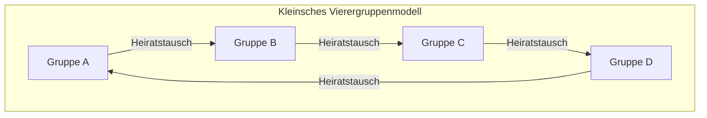

# Claude Lévi-Strauss und die Revolution des Strukturalismus: Die Dekonstruktion des Eurozentrismus und die Geometrie des "wilden Denkens"

## Kapitel 1: Die Dämmerung des Existenzialismus und die intellektuelle tektonische Verschiebung in Paris

In der Mitte des 20. Jahrhunderts befand sich die französische Ideenwelt im starken Magnetfeld des Existenzialismus, dessen Zentrum Jean-Paul Sartre bildete. Sartres Philosophie, die unter der These "Die Existenz geht der Essenz voraus" stand und die freie Subjektivität sowie das gesellschaftliche Engagement des Menschen betonte, bot den Intellektuellen Europas, die die beispiellose Katastrophe des Zweiten Weltkriegs überlebt hatten, eine neue Ethik und ein Licht der Hoffnung. Doch gegen dieses anthropozentrische Paradigma, das unbewusst den Fortschritt der Geschichte voraussetzte, bereitete Claude Lévi-Strauss leise, aber bestimmt eine entscheidende tektonische Verschiebung vor.

Am intellektuellen Ausgangspunkt von Lévi-Strauss stand ein tiefes "Unbehagen". Der Optimismus des Existenzialismus, dass das subjektive Bewusstsein alles bestimmen könne, erschien ihm angesichts des Lebens der Indigenen, das er in Mato Grosso in Brasilien beobachtete, und angesichts des grandiosen Maßstabs der Menschheitsgeschichte als eine äußerst westeuropäisch-moderne, lokal begrenzte Anmaßung. Diese Intuition verwandelte sich in eine theoretische Gewissheit, als er während des Zweiten Weltkriegs der Verfolgung als Jude entging und nach New York ins Exil ging. Dort hatte er eine schicksalhafte Begegnung mit dem Linguisten Roman Jakobson, der in der Tradition des russischen Formalismus stand.

Was Jakobson ihm brachte, war die strenge Methodologie der "Strukturellen Linguistik" und der "Phonologie", die von Ferdinand de Saussure ausging und von der Prager Schule (Nikolai Trubezkoy u.a.) verfeinert worden war. Die Phonologie hatte bewiesen, dass nicht die einzelnen Phoneme an sich eine Bedeutung haben, sondern dass das "System der Differenzen (Beziehungen)" zwischen den Phonemen die Bedeutung generiert. Lévi-Strauss ahnte intuitiv, dass dieses Modell des "auf unbewusster Ebene funktionierenden Beziehungssystems" ein universeller Schlüssel zur Entschlüsselung nicht nur der Sprache, sondern der gesamten menschlichen Kultur sein würde, wie etwa der Verwandtschaftsbeziehungen, Mythen und Rituale. Dies war der historische Moment, in dem der Strukturalismus in den Bereich der Kulturanthropologie eingeführt wurde, und der Beginn der "strukturalistischen Revolution", die das Privileg des Subjekts und des Bewusstseins dekonstruierte.

Während Sartres Existenzialismus das "Bewusstsein" und die "freie Wahl" des Individuums als treibende Kraft der Geschichtsbildung ansah, behauptete Lévi-Strauss, dass hinter den subjektiven Entscheidungen des Menschen eine starke "Struktur" existiert, die unbewusst wirkt. Das Subjekt wird von der Struktur gesprochen, und nicht das Subjekt kontrolliert die Struktur. Dieser Paradigmenwechsel erschütterte die Vorherrschaft des Cogito (Ich denke) seit Descartes in ihren Grundfesten.

## Kapitel 2: Der mathematische Schock von "Die elementaren Strukturen der Verwandtschaft" (1949)

Das 1949 veröffentlichte Werk "Die elementaren Strukturen der Verwandtschaft" wurde zu einem monumentalen Werk, das die Landschaft der Anthropologie völlig veränderte. Lévi-Strauss betrachtete hier das Phänomen des "Inzesttabus", das in verschiedenen Gesellschaften weltweit zu finden ist, neu als einen universellen Mechanismus, der eine Brücke zwischen Natur und Kultur schlägt. Bis dahin wurde das Inzesttabu oft als ein instinktiver Schutz vor biologischer Degeneration oder als Folge einer psychologischen Abneigung erklärt. Doch er erkannte, dass das Wesen des Inzesttabus nicht in einem passiven Verbot besteht ("Wen man nicht heiraten darf"), sondern in einer aktiven Regel des "Tauschs": "Die Frauen der eigenen Gruppe an eine andere Gruppe abzugeben und im Gegenzug Frauen von einer anderen Gruppe zu empfangen".

Bei der Konstruktion dieser Theorie stützte er sich auf Marcel Mauss' "Die Gabe". Mauss hatte gezeigt, dass das Geschenk in archaischen Gesellschaften ein Mechanismus ist, der durch drei Pflichten – "die Pflicht zu geben, die Pflicht zu empfangen und die Pflicht, etwas zurückzugeben" – soziale Bindungen (Allianzen) bildet und aufrechterhält. Lévi-Strauss wendete diese Logik der Gabe auf Verwandtschaftsbeziehungen (Heirat) an. Das heißt, die Heirat ist ein Austauschsystem zwischen Gruppen, bei dem die Frau als das wertvollste "Geschenk" das Paradigma bildet. Dadurch hat die Menschheit den Sprung von den Gesetzen der Natur (biologisch geschlossene Blutsverwandtschaft) zu den Gesetzen der Kultur (offene Allianzen mit anderen) geschafft.

Noch bahnbrechender war, dass Lévi-Strauss bei dieser Analyse der Verwandtschaftsstrukturen die "Gruppentheorie" der modernen Mathematik einführte. Mit Hilfe des genialen Mathematikers André Weil aus der Bourbaki-Gruppe, mit dem er in seiner New Yorker Zeit Freundschaft geschlossen hatte, bewies er, dass die äußerst komplexen Heiratsregeln der australischen Ureinwohner (wie das System der Murngin oder Kariera) völlig isomorph zur Struktur von Gruppen in der Algebra (insbesondere der "Kleinschen Vierergruppe") sind.

Die Kleinsche Vierergruppe (Klein four-group) ist eine kommutative Gruppe, die aus vier Elementen besteht und die Eigenschaft (Involution) hat, dass die zweimalige Anwendung eines beliebigen Elements wieder zum Ursprung zurückführt. Lévi-Strauss und Weil zeigten, dass die Heiratsregeln in den Verwandtschaftssystemen nach den mathematischen Eigenschaften dieser Gruppe systematisch organisiert sind. Die Grundstruktur wird im Folgenden durch ein Diagramm mit Mermaid dargestellt.

（※Die Mechanismen des symmetrischen und asymmetrischen Tauschs, des eingeschränkten und des generalisierten Tauschs in realen Verwandtschaftssystemen wurden durch dieses mathematische Modell zum ersten Mal einheitlich verstanden. Insbesondere wurde deutlich, dass der generalisierte Tausch (ein zirkuläres System, bei dem A an B gibt, B an C gibt und C an A gibt) ein starker Mechanismus zur Integration der gesamten Gesellschaft ist.）

Die Einführung dieser algebraischen Formulierung durch Weil zeigte der Welt, dass die Verwandtschaftssysteme von Völkern, die als "primitiv" galten, eine präzise Geometrie sind, die von einer hochgradigen mathematischen Intelligenz (die sie selbst unbewusst anwenden) entworfen wurde. Die Verwandtschaftsstrukturen, die westliche Gelehrte als "zu komplex und unverständlich" abgetan hatten, offenbarten sich durch die Linse der Gruppentheorie als Kristalle von atemberaubender Symmetrie und logischer Kohärenz.
## Kapitel 3: "Traurige Tropen" (1955) und die Dämmerung der westlichen Zivilisation

Das 1955 veröffentlichte Werk "Traurige Tropen" ist sowohl eine akademische Ethnografie als auch ein außergewöhnliches literarisches Meisterwerk und ein Buch philosophischer Reflexion. Dieses Werk, das mit dem provokanten Satz "Ich hasse Reisen und Entdecker" beginnt, entfaltet sich um die Erinnerungen an seine Feldforschung in den 1930er Jahren im Inneren Brasiliens, im Bundesstaat Mato Grosso. Dort begegnete Lévi-Strauss indigenen Völkern wie den Caduveo, Bororo, Nambikwara und Tupi-Kawahib.

Die komplexen arabesken Tätowierungen, die sich die Frauen der Caduveo auf das Gesicht zeichnen. Lévi-Strauss entdeckte in diesen asymmetrischen und doch hochgradig kalkulierten geometrischen Mustern den unbewussten Versuch ihrer Gesellschaft, die Widersprüche und Spannungen ihres Status-Systems symbolisch zu lösen. Die Gesichtstätowierung war nicht nur eine Dekoration, sondern eine Kunst mit einer "soziologischen Funktion", um strukturelle Risse der Gesellschaft auf der Haut zu vermitteln.

Die Dorfstruktur der Bororo war noch dramatischer. Ihr Dorf war kreisförmig angelegt, mit einem zentralen Platz und einem Männerhaus in der Mitte, und die räumliche Anordnung der komplexen Clans und Moieties (Hälften) war streng festgelegt. Lévi-Strauss entschlüsselte, dass die physische Anordnung dieses Dorfes selbst ein "lebendiges Strukturmodell" war, das ihr kosmologisches Weltbild, ihre Verwandtschaftsbeziehungen und ihre mythische Ordnung visualisierte. Die Tatsache, dass die christlichen Missionare als Erstes "das Dorf in eine gerade Linie umbauten", um sie zu bekehren, zeigt anschaulich, dass die Zerstörung der Raumstruktur direkt zur Zerstörung ihres spirituellen Universums führte.

Und im Austausch mit den Nambikwara, die die primitivste Lebensweise bewahrt hatten, gelangte Lévi-Strauss zu einer schockierenden Einsicht über den "Ursprung der Schrift". Es handelt sich um eine berühmte Episode namens "Die Lektion des Schreibens". Obwohl er keine Schrift besaß, ahmte der Häuptling der Nambikwara den Anthropologen nach, indem er Wellenlinien auf Papier zeichnete und so tat, als würde er sie vorlesen, um seine Autorität gegenüber seinem Stamm zu demonstrieren. Lévi-Strauss präsentierte daraus die radikale Hypothese, dass die Schrift ursprünglich nicht zur Bewahrung von Wissen oder zur Entwicklung der Zivilisation erfunden wurde, sondern um "die Herrschaft und Ausbeutung von Menschen durch Menschen" zu erleichtern. Die Schrift fixiert Gesetze und Verträge, ermöglicht die Steuereintreibung und zementiert eine Klassengesellschaft. Diese Feststellung, dass die "Schrift" (écriture), die der Westen als Grundlage seiner Überlegenheit betrachtet hatte, eigentlich eine Technologie der Unterdrückung war, hatte später entscheidenden Einfluss auf Jacques Derridas Kritik des Phonozentrismus.

"Traurige Tropen" ist voll von einer tiefen Trauer (einer rousseauistischen Nostalgie) um die verlorene Vielfalt. Den Prozess, in dem die westliche "Zivilisation" heterogene Kulturen auf der ganzen Welt vereinheitlicht, ausbeutet und zerstört, verglich er mit einer "Zunahme der Entropie". Er drückt mit schmerzhafter Entschlossenheit aus, dass die Anthropologie eine "Entropologie" (entropology: Entropielehre) sein sollte, die sich dieser irreversiblen Zunahme der Entropie (dem unvermeidlichen Weg zur Homogenisierung) widersetzt und die vielfältigen Strukturkristalle rettet, die im Unbewussten der Menschheit eingraviert sind.

## Kapitel 4: "Das wilde Denken" (1962) und Bricolage

Das 1962 erschienene "Das wilde Denken" (La Pensée sauvage) ist das stärkste Manifest des Strukturalismus und versetzte dem von Sartre repräsentierten Historismus und Fortschrittsglauben einen entscheidenden Schlag. Hier dekonstruiert Lévi-Strauss vollständig die Hierarchie der Über- und Unterordnung zwischen dem Denken der "Primitiven" (dem wilden Denken) und dem Denken der "Zivilisation" (der Wissenschaft), die den Westen lange Zeit dominiert hatte.

Er bewies, dass das Denken der Indigenen (das wilde Denken) keineswegs unlogisch oder prä-logisch ist, sondern eine exakte Intelligenz darstellt, die dem modernen wissenschaftlichen Denken völlig gleichwertig ist. Der Unterschied liegt nicht in der Über- oder Unterlegenheit der intellektuellen Fähigkeiten, sondern lediglich in "der unterschiedlichen Herangehensweise an den Gegenstand des Wissens". Das wilde Denken ist nicht das Denken des "Ingenieurs", der abstrakte Konzepte und universelle Gesetze extrahiert, sondern wird von der Logik der "Bricolage" (der Bastelei) angetrieben, bei der begrenzte, zur Hand befindliche konkrete Materialien (Mythenfragmente, Klassifizierungen von Tieren und Pflanzen, Rituale usw.) zusammengetragen, neu geordnet und zu einem neuen Bedeutungssystem aufgebaut werden.

Der Bricoleur (Bastler) besitzt keine spezialisierten Werkzeuge oder Materialien für einen bestimmten Zweck. Er setzt die Ordnung der Welt improvisiert mit "vorhandenen Werkzeugen" zusammen. Genau diese Intelligenz der Bricolage ist die Quelle, die den erstaunlichen Reichtum und die logische Kohärenz von Mythen, Magie und Totemismus auf der ganzen Welt hervorgebracht hat.

Besonders bei der Analyse des Totemismus wies Lévi-Strauss die utilitaristische Interpretation der funktionalistischen Anthropologen (wie Malinowski) brillant zurück, die besagte: "Ein Tier wird als Totem ausgewählt, weil es als Nahrung nützlich ist (weil es gut zu essen ist)". Er sagt: "Tiere werden nicht ausgewählt, weil sie gut zu essen sind, sondern weil sie gut zu denken sind (bon à penser)". Die Unterschiede zwischen bestimmten Tieren oder Pflanzen (z. B. "Adler und Bär", "Tiere des Himmels und Tiere der Erde") werden als "begriffliche Werkzeuge" verwendet, um die Unterschiede zwischen menschlichen sozialen Gruppen (die Beziehung zwischen Clan A und Clan B) auszudrücken. Dieses System, bei dem binäre Oppositionen in der Natur als Metaphern für binäre Oppositionen in der Kultur fungieren, war genau die perfekte Umsetzung der "Bedeutungsgenerierung durch Differenz" der strukturalistischen Linguistik.

Im letzten Kapitel dieses Buches, "Geschichte und Dialektik", richtet Lévi-Strauss die unerbittliche Klinge seiner Kritik gegen Sartres Hauptwerk "Kritik der dialektischen Vernunft". Sartre betrachtete die Geschichte als einen Entfaltungsprozess der absoluten Wahrheit und privilegierte die westeuropäische moderne Gesellschaft (die Gesellschaft mit Geschichte). Aber laut Lévi-Strauss ist Sartres "Geschichte" nichts anderes als ein moderner Mythos, den westliche Intellektuelle erfunden haben, um ihre eigene Identität zu rechtfertigen. Zwischen "kalten Gesellschaften" (die ihre Struktur unverändert beibehalten wollen), die keine Schrift und Geschichte haben, und "heißen Gesellschaften" (der westlichen Moderne), die ständigen Wandel und Fortschritt anstreben, gibt es keine essenzielle Über- oder Unterlegenheit. Diese vernichtende Sartre-Kritik wurde zu einer historischen Erklärung, die verkündete, dass die Hegemonie der französischen Ideenwelt endgültig vom Existenzialismus auf den Strukturalismus übergegangen war.
## Kapitel 5: Die "Mythologica" (4 Bände) und die Canigraphie: Die Geometrie des Mythos und die kanonische Formel

Den Höhepunkt von Lévi-Strauss' akademischer Forschung bildet das gewaltige Werk "Mythologica" (Mythologiques), das zwischen 1964 und 1971 in vier Bänden veröffentlicht wurde. Dieses monumentale Werk, bestehend aus dem ersten Band "Das Rohe und das Gekochte", dem zweiten Band "Vom Honig zur Asche", dem dritten Band "Der Ursprung der Tischsitten" und dem vierten Band "Der nackte Mensch", sammelte mehr als 800 Mythen der Ureinwohner, die über den nord- und südamerikanischen Kontinent verstreut sind, und bewies, dass sie nicht nur eine zufällige Ansammlung von Geschichten sind, sondern ein gigantisches "Transformationssystem" bilden.

Auf den ersten Blick erscheinen Mythen absurd, unlogisch und wie Produkte der Fantasie. Lévi-Strauss erkannte jedoch, dass sich in der Tiefe der Mythen eine strenge algebraische Struktur verbirgt. Einzelne Mythen existieren nicht isoliert, sondern werden generiert, indem andere Mythen invertiert oder Elemente substituiert werden. Ein Mythos, der in einem Stamm als Opposition zwischen "Sonne" und "Wasser" erzählt wird, wird in einem benachbarten Stamm durch die Opposition zwischen "Jaguar" und "Mensch" ersetzt, und in einem weiter entfernten Stamm verwandelt er sich in die Opposition zwischen "rohem Fleisch (Natur)" und "gekochtem Fleisch (Kultur)". All diese Variationen können als "Transformationen" (transformation) einer gemeinsamen unbewussten Struktur erklärt werden.

Der Mechanismus, der diese mythischen Transformationen formalisiert, ist die berühmte "kanonische Formel" (Canonical Formula). Lévi-Strauss drückte die Struktur von Mythen durch folgendes mathematisches Modell aus:

$F_x(A) : F_y(B) \simeq F_x(B) : F_{a^{-1}}(y)$

Diese Gleichung ist keine bloße Metapher, sondern ein algebraisches Modell, das die logischen Transformationen von Mythen äußerst präzise beschreibt.
Hierbei sind A und B "Terme" (termes), und x und y repräsentieren die "Funktionen" (fonctions) oder Attribute, die diese Terme haben.
Die linke Seite der Gleichung $F_x(A) : F_y(B)$ zeigt die Beziehung zwischen "Term A mit der Funktion x" und "Term B mit der Funktion y".
Dies wird in die rechte Seite $F_x(B) : F_{a^{-1}}(y)$ transformiert. Auf der rechten Seite übernimmt Term B die Funktion x, während gleichzeitig eine dramatische Veränderung eintritt. Der ursprüngliche Term A kehrt seine Polarität um ($a^{-1}$) und das, was eine Funktion y gewesen sein sollte, rückt in die Position eines Terms auf. Dies wird als "doppelte Verdrehung" (double twist) bezeichnet.

Betrachten wir als konkretes Beispiel die strukturelle Transformation von Mythen, die Lévi-Strauss u. a. in "Die Töpferin ist eifersüchtig" erwähnt.
In einem Mythos (linke Seite) stehen sich "der Adler, der zum Himmel gehört (x, A)" und "der Bär, der zur Erde gehört (y, B)" gegenüber. Wenn dies in einen anderen Mythos (rechte Seite) transformiert wird, werden nicht einfach die Charaktere vertauscht. Es tritt "der Bär, der zum Himmel gehört (x, B)" auf, und als gegensätzliches Element erscheint "ein Gott, der die Erde selbst personifiziert (y als Term)", während der ursprüngliche "Adler (A)" zu "einem Geist der Unterwelt ($a^{-1}$, Umkehrung des Himmels)" herabgestuft wird; so entsteht eine strukturelle Verdrehung. Diese topologische Transformation, wie ein Möbiusband, bei der eine Funktion in einen Term und ein Term umgekehrt in eine Funktion verwandelt wird, wiederholt sich endlos in der Kette der Mythen des amerikanischen Doppelkontinents.

Lévi-Strauss bewies durch diese Analyse, dass Mythen keinen bestimmten "Ursprung" oder "ursprünglichen Autor" haben. Nicht der Mensch spricht den Mythos. "Die Mythen sprechen sich im Menschen, ohne dass dieser sich dessen bewusst wird." Das menschliche Gehirn (der Intellekt) fungiert als eine gigantische Informationsverarbeitungsanlage (ein Computer), die sensorische Daten aus der Natur (roh, gekocht, verfault usw.) als Input erhält und unter Verwendung von Transformationsalgorithmen wie dieser kanonischen Formel kulturelle Ordnungen (Regeln für Verwandtschaft, Kochen, Rituale) als Output liefert.

Ein weiteres bemerkenswertes Merkmal der "Mythologica" ist, dass ihre Gesamtstruktur stark auf der "Struktur der Musik" beruht. Im Vorwort des ersten Bandes preist Lévi-Strauss Richard Wagner als den "unvergleichlichen Pionier der Strukturanalyse" und komponiert sein eigenes Werk in der Analogie zu Sinfonien, Sonatenformen und Fugen. Mythos und Musik besitzen beide, im Gegensatz zur Sprache, eine "unübersetzbare" zeitliche Struktur. So wie das Leitmotiv der Musik in der Harmonik und im Kontrapunkt variiert, umgekehrt und überlagert wird, so erklingen auch die verschiedenen Elemente des Mythos (Mytheme) wie in einem Orchester im Zusammenklang zwischen dem diachronen Fortschreiten der Erzählung (Melodie) und der synchronen Überlagerung der Struktur (Harmonie).

Er zog die Struktur der Fugen von Bach oder Ravel's Bolero heran und analysierte akribisch, wie die binären Oppositionen des Mythos Akkorde bilden und Dissonanzen auflösen. Der mythische Raum ist eine riesige "Canigraphie (Canyon/Music/Myth)", d. h. ein großartiger multidimensionaler Raum, in dem sich wie geologische Schichten in einem Canyon überlagernde Mytheme und die Polyphonie der Musik kreuzen. Die Entdeckung, dass mathematische Gleichungen und musikalische Polyphonie – die als höchster Gipfel der westlichen Vernunft galten – in Wahrheit in der Tiefe des "wilden Denkens" bereits in vollendeter Form am Werk waren, zerschmetterte die Arroganz des Eurozentrismus von Grund auf.
## Anhang: Zwei gigantische Meilensteine in der strukturellen Mythenanalyse (Praktische Fallstudien)

Wie hat die Theorie von Lévi-Strauss konkrete mythische Texte anatomiert und die darin verborgenen algebraischen Strukturen aufgedeckt? Um sein praktisches Meisterstück zu verstehen, verfolgen wir hier detailliert zwei seiner repräsentativsten Fallstudien. Diese Analyse zeigt deutlich, dass der Strukturalismus keine bloß abstrakte Philosophie ist, sondern ein höchst präziser "chirurgischer Eingriff" am Text.

### Fallstudie 1: Die Strukturanalyse des Ödipus-Mythos

Lévi-Strauss' Analyse des "Ödipus-Mythos", die er in "Strukturale Anthropologie" (1958) entwickelte, hat das Paradigma der Mythenanalyse entscheidend verändert. Gegenüber diesem griechischen Mythos, der durch Freud durch den psychologischen Rahmen des "Inzestwunsches (Ödipuskomplex)" vermeintlich bis zum Letzten interpretiert war, wählte er einen völlig anderen Ansatz. Er las den Mythos nicht als eine "Erzählung (diachroner Verlauf)" entlang einer Zeitachse, sondern als ein "synchrones Bündel (Harmonie)" wie die Partitur eines Orchesters.

Er extrahierte alle Fragmente (Mytheme) des Ödipus-Mythos und ordnete sie in vier vertikalen Spalten (Kategorien) an.
Die erste Spalte enthält Elemente, die auf eine "Überbewertung der Blutsverwandtschaft" hinweisen. Dazu gehören Kadmos, der seine Schwester Europa sucht, Ödipus, der seine Mutter Iokaste heiratet, und Antigone, die das Verbot bricht und ihren Bruder Polyneikes begräbt.
Die zweite Spalte zeigt umgekehrt Elemente der "Unterbewertung (Feindseligkeit) der Blutsverwandtschaft". Ödipus, der seinen Vater Laios tötet, und die Brüder Eteokles und Polyneikes, die einander töten.
Die dritte Spalte betrifft die "Vernichtung von Monstern (autochthonen Wesen, die aus der Erde geboren sind)". Kadmos tötet den Drachen, Ödipus besiegt die Sphinx.
Die vierte Spalte bezieht sich auf "Schwierigkeiten beim Gehen (körperliche Defekte)". Namen und körperliche Merkmale wie Laios (Linkshänder, ungeschickt), Labdakos (hinkend) und Ödipus (Schwellfuß).

Die Logik, die Lévi-Strauss daraus ableitete, ist erstaunlich. Die Beziehung zwischen der ersten und zweiten Spalte (Überbewertung der Blutsverwandtschaft vs. Unterbewertung) ist völlig parallel zur Beziehung zwischen der dritten und und vierten Spalte (Verneinung der Autochthonie vs. Bejahung der Autochthonie). Ein "aus der Erde geborenes Monster (Symbol für die Autochthonie des Menschen)" zu töten, bedeutet, den Glauben zu verneinen, dass der Mensch aus der Erde geboren wurde (Trennung von der Natur). Das erschwerte Gehen (dass die Füße auf dem Boden schleifen) bedeutet jedoch, dass der Mensch immer noch an die Erde gebunden ist (Autochthonie).
Das heißt, der Ödipus-Mythos war eine gigantische Rechenmaschine, die versuchte, einen grundlegenden Widerspruch (Aporie) der antiken griechischen Gesellschaft logisch zu schlichten: "Wird der Mensch aus der Vereinigung von Mann und Frau geboren (kulturell-biologische Realität), oder wird er parthenogenetisch aus der Erde geboren (natürlich-mythischer Glaube)?". Selbst Freuds psychologische Interpretation ist nach Lévi-Strauss nur eine der "neuesten Variationen (Transformationsformen)" des Ödipus-Mythos.

### Fallstudie 2: Die vielschichtige Raumstruktur der "Geste d'Asdiwal"

Eine weitere äußerst wichtige Analyse ist die Strukturanalyse der "Geste d'Asdiwal", eines Mythos der Tsimshian-Indianer an der Nordwestküste Nordamerikas (1958). Dieser Aufsatz gilt als eine der vollendetsten Kristallisationen der mythischen Analyse von Lévi-Strauss.

In diesem ausgedehnten Mythos über die Wanderungen und Heiraten des Helden Asdiwal entschlüsselt Lévi-Strauss detailliert, wie sich die Erzählung gleichzeitig auf vier verschiedenen Ebenen entfaltet: geografisch, wirtschaftlich, soziologisch und kosmologisch.
Auf der geografischen Ebene bewegt sich Asdiwal von Osten nach Westen und von Süden nach Norden. Auf der wirtschaftlichen Ebene gehen die Jahreszeiten vom winterlichen Hunger in den Frühling der aufsteigenden Lachse und den Sommer der Jagd über. Auf der soziologischen Ebene schwankt er zwischen matrilokaler und patrilokaler Ehe. Auf der kosmologischen Ebene wird er zerrissen zwischen seiner Ehefrau aus der himmlischen Welt (Sternenvolk) und seiner Ehefrau aus der Unterwelt (Meeresvolk).

Das tragische Ende von Asdiwal (er wird in Stein verwandelt und auf einem Berggipfel eingeschlossen) spiegelt den unlösbaren strukturellen Widerspruch der "Patrilokalität in einer matrilinearen Gesellschaft" wider, unter dem die Gesellschaft der Tsimshian in der Realität litt. Indem der Mythos darstellt, wie ein in der Realität unlösbarer Widerspruch auf einer imaginären Ebene bis zum Extrem getrieben wird und sich selbst zerstört, garantiert er paradoxerweise die Legitimität der realen sozialen Institutionen.
Hierbei ist der Mythos nicht mehr bloß ein "Spiegelbild" oder "Abbild" der Realität. Der Mythos funktioniert als "virtuelles Realitätslabor (VR-Labor)", um die Risse und Verzerrungen in der realen sozialen Struktur auf symbolischer Ebene experimentell zu simulieren. Wenn die binären Oppositionen im Mythos bis zum Extrem ausgeweitet werden, unlösbar werden und zusammenbrechen, entsteht in den Köpfen der Menschen unbewusst eine Erleichterung: "Das reale Gesellschaftssystem (als Produkt von Kompromissen) ist doch besser".

Wie aus diesen Analysen ersichtlich wird, besteht die strukturalistische Mythologie nicht in der Reduktion auf Elemente, sondern in der Wiederherstellung des "Netzwerks der Beziehungen" zwischen den Elementen. Es handelte sich nicht um die cartesianische analytische Geometrie, die den Gegenstand fein zerteilt, sondern um den Versuch einer Topologie, die Eigenschaften untersucht, die bei Formveränderungen erhalten bleiben. Auch Ödipus' geschwollene Füße oder Asdiwals versteinerter Körper waren keine bloßen narrativen Verzierungen, sondern äußerst präzise mathematische Funktionen (Parameter) zur Beschreibung der Beziehung zwischen der menschlichen Gesellschaft und dem Kosmos.

（※Diese vielschichtige Analysemethode wurde später in der Literaturtheorie (Narratologie) von Roland Barthes, Algirdas Julien Greimas und anderen übernommen und wurde zu einer unverzichtbaren Grundsprache der Textanalyse. Diese "wilde Geometrie", die Lévi-Strauss in den Mythen entdeckte, veränderte die intellektuelle Landschaft der zweiten Hälfte des 20. Jahrhunderts entscheidend und irreversibel.）
## Kapitel 6: Die Anbindung an den Poststrukturalismus und das Erbe für die Gegenwart: Das strukturelle Unbewusste und die Zukunft der KI

Das Paradigma des Strukturalismus, das Lévi-Strauss mit "Die elementaren Strukturen der Verwandtschaft" und "Das wilde Denken" etablierte, löste ab den 1960er Jahren einen entscheidenden Sturm im modernen französischen Denken aus. Seine Methode, die die Privilegien von "Subjekt", "Bewusstsein" und "Geschichte" beraubte und die "Struktur des Unbewussten", die im Hintergrund heimlich operiert, in den Vordergrund rückte, breitete sich rasch in anderen wissenschaftlichen Disziplinen aus.

Jacques Lacan führte Lévi-Strauss' Tauschtheorie der Verwandtschaftsstrukturen und Saussures Linguistik in die Psychoanalyse ein und stellte die berühmte These auf: "Das Unbewusste ist strukturiert wie eine Sprache". Lacans Versuch, die auf das Ich (Ego) zentrierte amerikanische Ich-Psychologie scharf zu kritisieren und Freuds Unbewusstes als Netzwerk des Symbolischen (der sprachlichen Ordnung) neu zu definieren, wäre ohne den algebraischen Ansatz von Lévi-Strauss nicht möglich gewesen.
Michel Foucault grub in "Die Ordnung der Dinge" die unbewussten Rahmenbedingungen archäologisch aus, die das Wissen jeder Epoche (Episteme) bestimmen, und verkündete das "Ende des Menschen" (das Verschwinden des modernen Konzepts des "Subjekts", so wie ein in den Sand gezeichnetes Gesicht von den Wellen weggespült wird). Auch dies ist eine gedankliche Variation von Lévi-Strauss, der am Ende von "Traurige Tropen" die Anthropologie als "Entropologie" definierte und die Ohnmacht bewusster menschlicher Projekte darlegte.
Darüber hinaus dekonstruierte Jacques Derrida die Existenz eines "Zentrums" oder eines "absoluten Ursprungs", die der Strukturalismus voraussetzte, und öffnete die Tür zum Poststrukturalismus. Es sollte jedoch in Erinnerung bleiben, dass Derridas Kritik am Phonozentrismus von einer scharfsinnigen kritischen Lektüre von Lévi-Strauss' "Die Lektion des Schreibens" der Nambikwara ausging. Der Strukturalismus von Lévi-Strauss war auch für die Denker des Poststrukturalismus, die versuchten, ihn zu überwinden, ein unvermeidbarer, gigantischer Trittstein.

In seinen späten Jahren warnte Lévi-Strauss kontinuierlich vor dem Verlust der kulturellen Vielfalt in einer sich rasch beschleunigenden Globalisierung. Er war der Ansicht, dass die menschliche Kultur ihren Reichtum nur durch die Existenz von Differenzen zum Anderen (angemessene Distanz und Isolation) bewahren kann. Übermäßige Kommunikation und Homogenisierung rauben der Kultur ihre kreative Vitalität und führen letztlich zum entropischen Tod (Wärmetod) der gesamten Menschheit. Dieses Denken war eine zutiefst ökologische Vision, die die untrennbare Verbundenheit von "biologischer Vielfalt" und "kultureller Vielfalt" in der heutigen Zeit vorwegnahm. Die Überwindung des cartesianischen Dualismus, der Natur (Umwelt) und Kultur (Mensch) als Gegensätze betrachtet, und die ontologische Wende von heute (wie Eduardo Viveiros de Castros Multinaturalismus), die die "der Natur innewohnende Intelligenz" aus der Perspektive des Animismus und Totemismus neu bewertet, sind legitime Nachfolger seiner Theorie.

Zudem wirft die rasante Entwicklung der modernen Informatik, insbesondere der künstlichen Intelligenz (KI), ein neues Licht auf Lévi-Strauss' Strukturalismus. Der Mechanismus, mit dem Large Language Models (LLM) und Deep Learning die "Beziehungsmuster (Differenzen und Entfernungen im Vektorraum)", die in einem gigantischen Netzwerk von Textdaten verborgen sind, berechnen und daraus Bedeutung und Logik generieren, ist genau der von Lévi-Strauss vorhergesehene "mythische Transformationsalgorithmus". KI "versteht" Bedeutung nicht, sondern berechnet lediglich probabilistisch und algebraisch eine gigantische strukturelle Matrix von Sprachzeichen (eine Kette von Paradigmen und Syntagmen in einem multidimensionalen Raum). Das, was jedoch als Output entsteht, erscheint dem menschlichen Auge als hochgradige "Intelligenz" und "Erzählung".
Dies ist nichts anderes als der Umstand, dass die These von Lévi-Strauss, dass "der Mythos sich durch das Unbewusste des Menschen selbst spricht", physisch auf Siliziumchips und neuronalen Netzwerken implementiert wurde. Das Grundprinzip des Strukturalismus, wonach das differenzielle Beziehungsnetzwerk (die Struktur) der Zeichen autonom ein Bedeutungssystem spinnt, ohne dass das Bewusstsein oder die Absicht des Subjekts interveniert, wird ironischerweise durch die moderne KI-Technologie in reinster Form bewiesen.

### Fazit: Der Glanz eines kalten Kristalls

Die enormen Texte, die Claude Lévi-Strauss hinterlassen hat, waren ein kalter Kristall, der in die Ära des enthusiastischen Existenzialismus geworfen wurde. Er hat kühl und sachlich bewiesen, dass unser Denken immer den Einschränkungen a priorischer Strukturen wie Sprache, Verwandtschaftsregeln und Mythen unterliegt, ganz gleich, wie laut der Mensch nach Freiheit schreit. Dies ist jedoch keineswegs eine Philosophie der Verzweiflung. Was er tief in den Wäldern des Amazonas oder in den endlosen Variationen indigener Mythen entdeckte, war der Glanz einer universellen, präzisen Intelligenz, die jedem Menschen gleichermaßen innewohnt und kein exklusiver Besitz bestimmter Eliten oder der "zivilisierten Gesellschaft" ist.

Seine große Leistung, den arroganten Humanismus der westlichen Moderne zu dekonstruieren und der Welt die geometrische Schönheit des "wilden Denkens" zu präsentieren, strahlt im 21. Jahrhundert, wo der Anthropozentrismus durch Umweltkrisen und den Aufstieg der KI in seinen Grundfesten erschüttert wird, eine Aktualität aus, die mit größtem Ernst neu gelesen werden sollte. "Die Welt hat ohne den Menschen begonnen, und sie wird ohne ihn enden" – diese wehmütige Prophezeiung aus "Traurige Tropen" birgt für uns keinen Klang der Verzweiflung, sondern den einer tiefgründigen Ethik, die uns unsere wahre Statur innerhalb der grandiosen Struktur des Kosmos lehrt.
