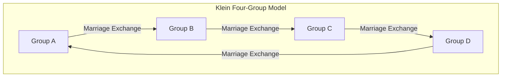

# Claude Lévi-Strauss and the Structuralist Revolution: The Dismantling of Eurocentrism and the Geometry of 'The Savage Mind'

## Chapter 1: The Twilight of Existentialism and the Intellectual Tectonic Shift in Paris

In the mid-20th century, the French intellectual world was caught in the powerful magnetic field of existentialism centered around Jean-Paul Sartre. Sartre's philosophy, championing the thesis that "existence precedes essence" and emphasizing human free subjectivity and social participation (engagement), offered a new ethic and a ray of hope to European intellectuals who had survived the unprecedented disaster of World War II. However, Claude Lévi-Strauss was quietly but decisively preparing a tectonic shift against this anthropocentric paradigm that unconsciously presupposed historical progress.

At the ideological starting point of Lévi-Strauss was a profound "sense of discomfort." The optimism of existentialism, which held that subjective consciousness could determine everything, might simply be an extremely modern Western, localized conceit when viewed from the scale of the magnificent history of humanity or the lives of the indigenous people he witnessed in Mato Grosso, Brazil. This intuition transformed into theoretical conviction when he fled persecution as a Jew during World War II and went into exile in New York, USA. There, he had a fateful encounter with Roman Jakobson, a linguist in the lineage of Russian Formalism.

What Jakobson brought to him was the rigorous methodology of "structural linguistics" and "phonology," which originated with Ferdinand de Saussure and was refined by the Prague School (including Nikolai Trubetzkoy). Phonology had proven that meaning is not generated by individual phonemes themselves, but by the "system of differences (relationships)" between phonemes. Lévi-Strauss intuited that this model of a "relational system functioning at the level of the unconscious" would be a universal key to decoding not only language but also human culture in general, including kinship relations, myths, and rituals. This was the historical moment when structuralism was introduced to the field of cultural anthropology, and the curtain rose on the "structuralist revolution" that dismantled the privilege of the subject and consciousness.

While Sartrean existentialism regarded individual "consciousness" and "free choice" as the driving forces of history formation, Lévi-Strauss argued that behind human subjective choices, there exists a robust "structure" operating unconsciously. The subject is spoken by the structure; the subject does not control the structure. This paradigm shift shook the primacy of the cogito (I think) since Descartes to its very foundations.

## Chapter 2: The Mathematical Impact of *The Elementary Structures of Kinship* (1949)

Published in 1949, *The Elementary Structures of Kinship* became a monumental work that completely transformed the landscape of anthropology. Here, Lévi-Strauss reconsidered the phenomenon of the "incest taboo," found in various societies around the world, as a universal mechanism bridging nature and culture. Until then, the incest taboo was often explained as an instinctive thing to prevent biological degeneration or due to psychological aversion. However, he saw through to the fact that the essence of the incest taboo lies not in the negative prohibition of "whom one must not marry," but in the positive rule of "exchange": "transferring women of one's own group to another group, and receiving women from another group in return."

In constructing this theory, he relied on Marcel Mauss's "The Gift." Mauss had shown that in archaic societies, a gift is a mechanism that forms and maintains social bonds (alliances) through three obligations: "the obligation to give, the obligation to receive, and the obligation to reciprocate." Lévi-Strauss applied this logic of the gift to kinship relations (marriage). That is, marriage is a system of exchange between groups using women as the most valuable "gifts" as a paradigm, and through this, humanity leaped from the law of nature (closure based solely on biological blood ties) to the law of culture (open alliances with others).

What was even more groundbreaking was that Lévi-Strauss introduced "group theory" from modern mathematics into the analysis of this kinship structure. With the cooperation of André Weil, a genius mathematician of the Bourbaki group whom he befriended during his New York years, he proved that the extremely complex marriage rules of Australian Aboriginals (such as the systems of the Murngin and Kariera tribes) are perfectly isomorphic to the structure of groups (especially the "Klein four-group") in algebra.

The Klein four-group (Klein four-group) is an abelian group consisting of four elements, characterized by the property (involution) that applying any element twice returns it to the original state. Lévi-Strauss and Weil showed that the rules of marriage in kinship systems are systematically organized according to the mathematical properties of this group. The basic structure is shown in the diagram below using Mermaid.

(*The mechanisms of symmetrical and asymmetrical exchange, restricted and generalized exchange in actual kinship systems were unifiedly understood for the first time by this mathematical model. In particular, it became clear that generalized exchange (a circular system where A gives to B, B gives to C, and C gives to A) is a powerful mechanism that integrates the entire society.*)

The introduction of this algebraic formulation by Weil thrust before the world the fact that the kinship systems of peoples considered "primitive" were exquisite geometries designed by highly advanced mathematical intelligence (which they themselves operated unconsciously). The kinship structures that Western scholars had deemed "too complex to understand" revealed themselves, through the lens of group theory, as crystals with breathtakingly beautiful symmetry and logical consistency.

## Chapter 3: *Tristes Tropiques* (1955) and the Twilight of Western Civilization

Published in 1955, *Tristes Tropiques* is an academic ethnography, an unparalleled literary masterpiece, and a book of philosophical reflection. Beginning with the provocative opening, "I hate traveling and explorers," this work unfolds around his recollections of fieldwork in the inland state of Mato Grosso, Brazil, in the 1930s. There, Lévi-Strauss encountered indigenous peoples such as the Caduveo, Bororo, Nambikwara, and Tupi-Kawahib tribes.

The intricate arabesque tattoos applied to the faces of Caduveo women. In these asymmetrical yet highly calculated geometric patterns, Lévi-Strauss discovered an unconscious attempt to symbolically resolve the contradictions and tensions of the status system inherent in their society. Facial tattoos were not merely decorative; they were art with a "sociological function" aimed at mediating the society's structural rifts on the skin.

The village structure of the Bororo was even more dramatic. Their village was arranged in a circle, with a central plaza and a men's meeting house at its core, around which the spatial layout of complex clans and moieties was strictly determined. Lévi-Strauss deciphered that this physical arrangement of the village itself was a "living structural model" that visualized their cosmology, kinship relations, and mythical order. The fact that the first thing Christian missionaries did to convert them was to "rebuild the village in a straight line" vividly demonstrates that the destruction of spatial structure is directly linked to the destruction of their spiritual universe.

And during his interactions with the Nambikwara tribe, who maintained the most primitive lifestyle, Lévi-Strauss arrived at a shocking insight regarding the "origin of writing." It is a famous episode known as the "Writing Lesson." Despite having no writing system, the Nambikwara chief pretended to take notes like an anthropologist, drawing wavy lines on paper and pretending to read them aloud, thereby flaunting his authority to his tribespeople. From this, Lévi-Strauss presented the fundamental hypothesis that writing was originally invented not for the preservation of knowledge or the advancement of civilization, but to facilitate the "domination and exploitation of human beings by human beings." Writing fixes laws and contracts, makes taxation possible, and rigidifies hierarchical societies. This point, that "writing (écriture)," which the West had used as the basis for its superiority, was actually a technology of oppression, later had a decisive influence on Jacques Derrida's critique of phonocentrism.

*Tristes Tropiques* is filled with profound mourning (a Rousseau-esque nostalgia) for vanishing diversity. He likened the process by which Western "civilization" standardizes, exploits, and destroys heterogeneous cultures worldwide to the "increase of entropy." He poignantly argued that anthropology should be "entropology," a study resisting this irreversible increase in entropy (the inevitable march toward homogenization) and rescuing the crystals of diverse structures inscribed in humanity's unconscious.

## Chapter 4: *The Savage Mind* (1962) and Bricolage

The 1962 *The Savage Mind* (*La Pensée sauvage*) was structuralism's most powerful manifesto, delivering a decisive blow against the historicism and progressivism represented by Sartre. Here, Lévi-Strauss completely dismantles the hierarchy of superiority and inferiority that had long dominated the West: the thought of the "primitive (savage)" versus the thought of "civilization (science)."

He proved that the thought of indigenous peoples (the savage mind) is by no means illogical or pre-logical, but a rigorous intellect completely equivalent to modern scientific thought. The difference lies not in the superiority or inferiority of intellectual capacity, but merely in the "difference of approach to the object of knowledge." The savage mind is driven not by the thought of the "engineer," who extracts abstract concepts and universal laws, but by the logic of "bricolage" (tinkering), which gathers available concrete materials at hand (fragments of myths, classifications of flora and fauna, elements of rituals, etc.), rearranges them, and constructs new systems of meaning.

The bricoleur (tinkerer) does not possess specialized tools or materials for a specific purpose. They use "whatever is at hand" to improvise and assemble the order of the world. This intelligence of bricolage is the very source that has generated the astonishing richness and logical consistency of myths, magic, and totemism around the world.

Particularly in his analysis of totemism, Lévi-Strauss brilliantly rejected the utilitarian interpretation of functionalist anthropologists (like Malinowski) that "an animal is chosen as a totem because it is useful for food (good to eat)." He stated, "Animals are chosen not because they are good to eat, but because they are good to think (bon à penser)." The differences between specific animals or plants (for example, "eagle and bear," "animals of the sky and animals of the earth") are used as "conceptual tools" to express the differences between human social groups (the relationship between clan A and clan B). This system, where binary oppositions in the natural world function as metaphors for binary oppositions in the cultural world, was precisely a perfect application of structural linguistics' "meaning generation through difference."

In the final chapter of the book, "History and Dialectic," Lévi-Strauss directs merciless critical blades at Sartre's massive *Critique of Dialectical Reason*. Sartre treated history as the unfolding process of absolute truth, privileging Western modern society (societies with history). However, according to Lévi-Strauss, Sartre's "history" is merely a modern myth fabricated by Western intellectuals to justify their own identity. There is no essential superiority or inferiority between "cold societies" (societies without writing and history, which try to maintain their structures without change) and "hot societies" (the modern West, which relentlessly pursues change and progress). This scathing critique of Sartre served as a historic declaration that the hegemony of the French intellectual world had completely shifted from existentialism to structuralism.

## Chapter 5: *Mythologiques* (4 Volumes) and Canyongraphy: The Geometry and Canonical Formula of Myths

The pinnacle of Lévi-Strauss's scholarly inquiry is the massive four-volume work *Mythologiques*, published between 1964 and 1971. Consisting of Volume I *The Raw and the Cooked*, Volume II *From Honey to Ashes*, Volume III *The Origin of Table Manners*, and Volume IV *The Naked Man*, this monumental opus collected over 800 indigenous myths scattered across the Americas and demonstrated that they are not merely a random accumulation of stories, but constitute a single gigantic "system of transformation."

At first glance, myths appear absurd, illogical, and seemingly products of fantasy. However, Lévi-Strauss saw through to the rigorous algebraic structures lurking in the depths of myths. Individual myths do not exist in isolation, but are generated by inverting or substituting elements of other myths. A myth told in one tribe as an opposition between "the sun" and "water" might be replaced in a neighboring tribe by an opposition between "a jaguar" and "a human," and transformed in a more distant tribe into an opposition between "raw meat (nature)" and "cooked meat (culture)." All these variations can be explained as "transformations" of a common unconscious structure.

What formalized this mythological transformation mechanism is the famous "Canonical Formula." Lévi-Strauss represented the structure of myths with the following mathematical model:

$F_x(A) : F_y(B) \simeq F_x(B) : F_{a^{-1}}(y)$

This formula is not a mere metaphor; it is an algebraic model that describes the logical transformations of myths with extreme precision.
Here, A and B are "terms (termes)," and x and y represent the "functions (fonctions)" or attributes that those terms possess.
The left side of the formula, $F_x(A) : F_y(B)$, indicates the relationship between "term A bearing function x" and "term B bearing function y."
This is transformed into the right side, $F_x(B) : F_{a^{-1}}(y)$. On the right side, term B takes over function x, while a dramatic change occurs. The original term A has its polarity reversed ($a^{-1}$), and what was supposed to be the function y is elevated to the position of a term. This is called a "double twist."

As a concrete example, consider the structural transformation of myths Lévi-Strauss mentioned in works like *The Jealous Potter*.
Suppose in one myth (the left side), there is an opposition between "an eagle belonging to the sky (x) (A)" and "a bear belonging to the earth (y) (B)." When this is transformed into another myth (the right side), the characters do not merely swap. A structural twist occurs, such as "a bear belonging to the sky (x) (B)" appearing, the opposing element emerging as "the earth (y) itself personified as a god," and the original "eagle (A)" being demoted to "a spirit of the underworld ($a^{-1}$, the inversion of the sky)." This Möbius strip-like topological transformation—where a function becomes a term, and a term inverts to become a function—is repeated endlessly within the chain of myths across the Americas.

Through this analysis, Lévi-Strauss proved that myths have no specific "origins" or "original authors." Humans do not narrate myths. "Myths narrate themselves through human unconsciousness." The human brain (intellect) functions as a giant information processing device (computer) that takes sensory data from the natural world (raw, cooked, rotten, etc.) as input and uses transformation algorithms like this canonical formula to output cultural order (rules for kinship, cooking, and rituals).

Furthermore, a remarkable aspect of *Mythologiques* is that its overall structure relies heavily on the "structure of music." In the preface to the first volume, Lévi-Strauss praised Richard Wagner as an "unparalleled pioneer of structural analysis" and structured his own work using analogies to symphonies, sonata forms, and fugues. Both myths and music, unlike language, possess temporal structures that are "untranslatable." Just as musical leitmotifs are varied, inverted, and layered within harmony and counterpoint, so too do the elements of myths (mythemes) resonate like an orchestra amidst the diachronic progression of the narrative (melody) and the synchronic layering of structures (harmony).

While drawing on the structures of Bach's fugues and Ravel's Boléro, he meticulously analyzed how the binary oppositions of myths form chords and resolve dissonances. The mythological space is a massive "canyongraphy (Canyon/Music/Myth)," a magnificent multidimensional space where layers of mythemes overlapping like canyon strata intersect with musical polyphony. The discovery that mathematical formulas and musical polyphony, considered the pinnacles of Western rationality, were actually operating perfectly in the depths of the "savage mind" fundamentally shattered the arrogance of Eurocentrism.

## Addendum: Two Gigantic Landmarks in the Structural Analysis of Myth (Practical Case Studies)

How did Lévi-Strauss's theory dissect concrete mythological texts and expose the algebraic structures hidden within them? To understand his practical brilliance, we trace here in detail two of his representative case studies. This analysis vividly demonstrates that structuralism is not merely abstract philosophy, but highly precise "surgery" on texts.

### Case Study 1: Structural Analysis of the Oedipus Myth

The analysis of the "Oedipus myth," which Lévi-Strauss developed in *Structural Anthropology* (1958), decisively changed the paradigm of myth analysis. Against this Greek myth, which seemed to have been completely interpreted by Freud through the psychological framework of "incestuous desire (Oedipus complex)," he took an entirely different approach. He read the myth not as a "narrative (diachronic progression)" along a timeline, but as a "synchronic bundle (harmony)," like an orchestral score.

He extracted all the fragments (mythemes) of the Oedipus myth and classified them into four vertical columns (categories).
The first column contains elements showing an "overrating of blood relations." Cadmus seeking his sister Europa, Oedipus marrying his mother Jocasta, Antigone burying her brother Polynices in violation of the ban, and so on.
The second column contains elements conversely showing an "underrating of blood relations (hostility)." Oedipus killing his father Laius, the brothers Eteocles and Polynices killing each other.
The third column contains elements showing the "slaying of monsters (autochthonous beings born from the earth)." Cadmus killing the dragon, Oedipus defeating the Sphinx.
The fourth column contains elements showing "difficulties in walking (physical defects)." Names or physical traits like Laius (left-sided/clumsy), Labdacus (lame), and Oedipus (swollen foot).

The logic Lévi-Strauss derived from this is astonishing. The relationship between the first and second columns (overrating vs. underrating of blood relations) is completely parallel to the relationship between the third and fourth columns (denial of autochthony vs. affirmation of autochthony). Slaying "monsters born from the earth (symbols of human autochthony)" signifies denying the belief that humans were born from the earth (breaking away from nature). However, difficulty in walking (feet dragging on the ground) implies that humans are still bound to the earth (autochthony).
In other words, the Oedipus myth was a massive calculating device trying to logically mediate a fundamental contradiction (aporia) harbored by ancient Greek society: "Are humans born from the union of men and women (cultural/biological reality), or are they born parthenogenetically from the earth (nature/mythological belief)?" Even Freud's psychological interpretation, according to Lévi-Strauss, is nothing more than one of the "latest variations (transformation forms)" of the Oedipus myth.

### Case Study 2: The Multilayered Spatial Structure of "The Story of Asdiwal"

Another extremely important analysis is the structural analysis of "The Story of Asdiwal" (*La Geste d'Asdiwal*), a myth passed down among the Tsimshian people of the Pacific Northwest coast of North America (1958). This paper is considered one of the most perfected crystallizations of Lévi-Strauss's myth analysis.

In this lengthy myth concerning the wanderings and marriages of the hero Asdiwal, Lévi-Strauss meticulously deciphered that the narrative unfolds simultaneously on four different levels: geographical, economic, sociological, and cosmological.
On the geographical level, Asdiwal moves from east to west, and from south to north. On the economic level, the seasons transition from the famine of winter to the spring of salmon runs, and to the summer of hunting. On the sociological level, he oscillates between matrilocal and patrilocal residence. On the cosmological level, he is torn between a wife from the heavenly realm (the Star People) and a wife from the underworld (the Sea People).

Asdiwal's tragic end (being turned to stone and trapped on a mountain peak) reflects the unsolvable structural contradiction actually harbored by Tsimshian society: "patrilocal residence in a matrilineal society." Contradictions that cannot be resolved in real society are pushed to the limit on the imaginary level of myth. By depicting the resulting self-destruction, the myth paradoxically guarantees the legitimacy of real social institutions.
Here, myth is no longer merely a "reflection" or "copy" of reality. Myth functions as a "virtual reality (VR) laboratory" to experimentally simulate on a symbolic level the rifts and distortions inherent in real social structures. When binary oppositions are expanded to the limit in a myth and break down becoming unresolvable, it brings an unconscious relief to people's minds: "Real social institutions (the products of compromise) are better after all."

As is clear from these analyses, structuralist mythology is not a reduction to elements, but a task of restoring the "web of relationships (network)" between elements. It was not a Cartesian analytical geometry that finely divides objects, but an attempt at topology, which explores properties that are preserved even when shapes change. Neither Oedipus's swollen foot nor Asdiwal's petrified body were mere narrative decorations; they were extremely rigorous mathematical functions (parameters) used to describe the relationship between human society and the universe.

(*This multilayered analytical method was later taken up in literary theory (narratology) by Roland Barthes, Algirdas Julien Greimas, and others, becoming an indispensable foundational language for text analysis. This "geometry of the savage mind" that Lévi-Strauss discovered in myths decisively and irreversibly repainted the intellectual landscape of the late 20th century.*)

## Chapter 6: Connection to Post-Structuralism and the Legacy for Today: The Structuralist Unconscious and the Future of AI

The structuralist paradigm that Lévi-Strauss established in *The Elementary Structures of Kinship* and *The Savage Mind* unleashed a decisive storm in French contemporary thought from the 1960s onwards. His method of stripping away the privilege of the "subject," "consciousness," and "history," and foregrounding the "unconscious structure" operating secretly behind them, immediately propagated to other academic disciplines.

Jacques Lacan introduced Lévi-Strauss's exchange theory of kinship structures and Saussure's linguistics into psychoanalysis, establishing the famous thesis that "the unconscious is structured like a language." Lacan's attempt to severely criticize American ego psychology centered on the ego, and to redefine Freud's unconscious as a network of the symbolic order (linguistic order), would have been impossible without Lévi-Strauss's algebraic approach.
Michel Foucault, in *The Order of Things*, archaeologically unearthed the unconscious frameworks regulating the knowledge of each era (episteme) and declared "the end of man" (the disappearance of the modern concept of the "subject," like a face drawn in the sand washed away by the waves). This, too, is an ideological variation of Lévi-Strauss defining anthropology as "entropology" at the end of *Tristes Tropiques* and preaching the powerlessness of human conscious projects.
Furthermore, Jacques Derrida deconstructed the existence of a "center" or "absolute origin" presupposed by structuralism, opening the door to post-structuralism. However, it must be remembered that Derrida's critique of phonocentrism began with a sharp critical reading of Lévi-Strauss's "Writing Lesson" among the Nambikwara tribe. Lévi-Strauss's structuralism was an unavoidable, massive stepping stone even for the post-structuralist thinkers who sought to overcome it.

In his later years, amidst rapidly advancing globalization, Lévi-Strauss continually sounded a strong warning against the loss of cultural diversity. He believed that human culture can only maintain its richness through the existence of differences with others (appropriate distance and isolation). Excessive communication and homogenization deprive culture of its creative vitality and ultimately bring about the entropic death (heat death) of humanity as a whole. This thought was an extremely ecological vision that anticipated the inseparability of "biodiversity" and "cultural diversity" in the modern era. The contemporary ontological turn (such as the multinaturalism of Eduardo Viveiros de Castro), which overcomes the Cartesian dualism viewing nature (environment) and culture (humanity) in opposition, and re-evaluates the "intelligence inherent in the natural world" from the perspectives of animism and totemism, is also a legitimate successor to his theory.

Moreover, the rapid development of modern computer science, especially artificial intelligence (AI), sheds new light on Lévi-Strauss's structuralism. The mechanisms by which large language models (LLMs) and deep learning computationally process "patterns of relationships (differences and distances in vector spaces)" hidden within massive networks of text data, and generate meaning and logic from them, are precisely the "mythological transformation algorithms" that Lévi-Strauss foresaw. AI does not "understand" meaning; it merely performs probabilistic and algebraic calculations on massive structural matrices of linguistic signs (chains of paradigms and syntagms in multidimensional space). Yet, what is output from this appears to human eyes as highly advanced "intelligence" and "narrative."
This is nothing other than the physical implementation, on silicon chips and neural networks, of Lévi-Strauss's thesis that "myths narrate themselves through human unconsciousness." The fundamental principle of structuralism—that a differential network of signs (structure) autonomously weaves a system of meaning without the mediation of the subject's consciousness or intention—is ironically being proven in its purest form by modern AI technology.

### Conclusion: The Glow of Cold Crystal

The vast texts left behind by Claude Lévi-Strauss were cold crystals cast into an era of feverish existentialism. He coolly proved that no matter how much humans cry out for freedom, our thoughts are always under the constraints of a priori structures such as language, kinship rules, and myths. However, this is by no means a philosophy of despair. What he discovered deep in the Amazonian forests and within the infinite variations of indigenous myths was the glow of a universal, exquisite intellect equally possessed by all of humanity, not the exclusive property of a specific elite or "civilized society."

His monumental achievement of dismantling the arrogant humanism of the modern West and presenting the geometric beauty of "the savage mind" to the world exudes its most profound actuality to be reread sincerely today in the 21st century, when anthropocentrism is being shaken to its core by environmental crises and the rise of AI. "The world began without man and will end without him"—this mournful prophecy in *Tristes Tropiques* holds the resonance of a profound ethic that teaches us, not despair, but the true measure of humanity within the magnificent structure of the universe.
