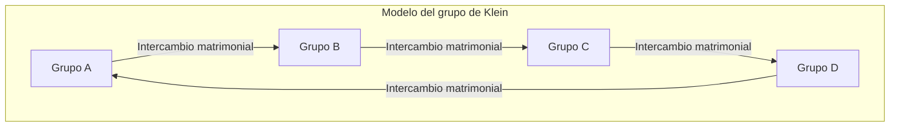

# Claude Lévi-Strauss y la revolución del estructuralismo: la deconstrucción del etnocentrismo occidental y la geometría del "pensamiento salvaje"

## Capítulo 1: El crepúsculo del existencialismo y el terremoto intelectual en París

El pensamiento francés de mediados del siglo XX se encontraba bajo el poderoso campo magnético del existencialismo, centrado en Jean-Paul Sartre. Con su tesis "la existencia precede a la esencia", la filosofía de Sartre, que enfatizaba la agencia libre humana y el compromiso social (engagement), ofrecía una nueva ética y un rayo de esperanza a los intelectuales europeos que habían sobrevivido a la catástrofe sin precedentes de la Segunda Guerra Mundial. Sin embargo, frente a este paradigma antropocéntrico que presuponía inconscientemente el progreso de la historia, Claude Lévi-Strauss preparaba en silencio un movimiento tectónico decisivo.

El punto de partida intelectual de Lévi-Strauss surgió de una profunda "sensación de incongruencia". El optimismo del existencialismo, que postulaba que la conciencia subjetiva podía determinarlo todo, parecía no ser más que una arrogancia occidental, moderna y local, cuando se la contrastaba con la vida de los pueblos indígenas que había presenciado en el Mato Grosso brasileño, o con la gran escala de la historia de la humanidad. Esta intuición se transformó en una convicción teórica tras su exilio a Nueva York durante la Segunda Guerra Mundial, escapando de la persecución por su origen judío. Allí tuvo un encuentro fatídico con el lingüista Roman Jakobson, heredero del formalismo ruso.

Lo que Jakobson le aportó fue la rigurosa metodología de la "lingüística estructural" y la "fonología", originada en Ferdinand de Saussure y refinada por la Escuela de Praga (Nikolai Trubetzkoy y otros). La fonología había demostrado que el significado no reside en los fonemas individuales en sí, sino que es el "sistema de diferencias (relaciones)" entre ellos lo que genera el significado. Lévi-Strauss intuyó que este modelo de "un sistema relacional que opera a nivel inconsciente" podría convertirse en una clave universal para descifrar no solo el lenguaje, sino toda la cultura humana, incluyendo las relaciones de parentesco, los mitos y los rituales. Este fue el momento histórico en el que el estructuralismo se introdujo en la antropología cultural, y marcó el inicio de la "revolución estructuralista" que deconstruyó el privilegio del sujeto y la conciencia.

Mientras que el existencialismo sartreano consideraba la "conciencia" del individuo y su "libre elección" como la fuerza motriz que forjaba la historia, Lévi-Strauss argumentaba que, detrás de las elecciones subjetivas humanas, existe una sólida "estructura" que opera inconscientemente. El sujeto es hablado por la estructura; no es el sujeto quien controla la estructura. Este cambio de paradigma sacudió hasta sus cimientos la supremacía del *cogito* (pienso) desde Descartes.

## Capítulo 2: El impacto matemático de "Las estructuras elementales del parentesco" (1949)

Publicado en 1949, *Las estructuras elementales del parentesco* se convirtió en una obra monumental que transformó el panorama de la antropología. Aquí, Lévi-Strauss replanteó el fenómeno del "tabú del incesto", presente en diversas sociedades alrededor del mundo, como un mecanismo universal que sirve de puente entre la naturaleza y la cultura. Hasta entonces, el tabú del incesto solía explicarse como un instinto biológico para evitar la degeneración, o como resultado de una aversión psicológica. Sin embargo, él discernió que la esencia del tabú del incesto no reside en la prohibición negativa de "con quién no uno se debe casar", sino en la regla positiva de "intercambio": ceder las mujeres del propio grupo a otros grupos y recibir mujeres de otros grupos a cambio.

Al construir esta teoría, se basó en el "Ensayo sobre el don" de Marcel Mauss. Mauss había demostrado que en las sociedades arcaicas, los regalos son un mecanismo que forma y mantiene lazos sociales (alianzas) a través de tres obligaciones: "la obligación de dar, la obligación de recibir y la obligación de devolver". Lévi-Strauss aplicó esta lógica del don a las relaciones de parentesco (matrimonio). Es decir, el matrimonio es un sistema de intercambio entre grupos utilizando a la mujer como el "regalo" supremo (paradigma), lo que permitió a la humanidad dar el salto desde la ley de la naturaleza (la cerrazón basada únicamente en los lazos de sangre biológicos) hacia la ley de la cultura (alianzas abiertas con el otro).

Aún más revolucionaria fue la introducción que hizo Lévi-Strauss de la "teoría de grupos" de las matemáticas modernas para analizar esta estructura de parentesco. Con la colaboración de André Weil, un brillante matemático del grupo Bourbaki a quien conoció durante sus años en Nueva York, demostró que las reglas matrimoniales extremadamente complejas de pueblos como los aborígenes australianos (los sistemas Murngin y Kariera, entre otros) eran completamente isomorfas a la estructura de un grupo algebraico (específicamente, el "grupo de Klein" de cuatro elementos).

El grupo de cuatro de Klein (Klein four-group) es un grupo conmutativo de cuatro elementos, con la propiedad de que aplicar cualquier elemento dos veces lo devuelve a su estado original (involución). Lévi-Strauss y Weil demostraron que las reglas de matrimonio en los sistemas de parentesco están organizadas sistemáticamente de acuerdo con las propiedades matemáticas de este grupo. La estructura básica se ilustra a continuación mediante un diagrama de Mermaid.

(Nota: Los mecanismos de intercambio simétrico y asimétrico, así como el intercambio restringido y el intercambio generalizado en los sistemas de parentesco reales, se comprendieron de manera unificada por primera vez gracias a este modelo matemático. En particular, quedó claro que el intercambio generalizado (un sistema circular donde A da a B, B da a C, y C da a A) es un poderoso mecanismo que integra a toda la sociedad.)

La introducción de esta formulación algebraica por parte de Weil demostró al mundo que los sistemas de parentesco de pueblos considerados "primitivos" eran en realidad geometrías exquisitas diseñadas por una inteligencia matemática avanzada (operada inconscientemente por ellos mismos). Las estructuras de parentesco que los académicos occidentales consideraban "demasiado complejas para ser comprendidas" se revelaron, a través de la lente de la teoría de grupos, como cristales dotados de una simetría y coherencia lógica asombrosamente hermosas.

## Capítulo 3: "Tristes Trópicos" (1955) y el ocaso de la civilización occidental

Publicado en 1955, *Tristes Trópicos* es una monografía etnográfica erudita, y al mismo tiempo, una obra maestra literaria incomparable y un libro de reflexiones filosóficas. Esta obra, que comienza con la provocativa frase "Odio los viajes y a los exploradores", se articula en torno a sus recuerdos del trabajo de campo en el interior de Brasil, en el estado de Mato Grosso, durante la década de 1930. Allí, Lévi-Strauss se encontró con pueblos indígenas como los caduveo, los bororo, los nambikwara y los tupí-kawahib.

Los complejos tatuajes de arabescos que las mujeres caduveo se aplicaban en el rostro. Lévi-Strauss descubrió en estos patrones geométricos asimétricos, pero altamente calculados, un intento inconsciente de resolver simbólicamente las contradicciones y tensiones del sistema jerárquico de su sociedad. Los tatuajes faciales no eran mera decoración, sino arte con una "función sociológica" destinada a mediar en la piel las grietas estructurales de la sociedad.

La estructura de las aldeas bororo era aún más dramática. Sus aldeas estaban dispuestas en círculo, con una estricta distribución espacial de clanes y mitades (moieties) centrada alrededor de una plaza central y una casa de hombres. Lévi-Strauss descifró que la disposición física de la aldea en sí misma era un "modelo estructural vivo" que visualizaba su cosmología, sus relaciones de parentesco y su orden mítico. El hecho de que lo primero que hicieran los misioneros cristianos para convertirlos fuera "reconstruir la aldea en líneas rectas", demuestra elocuentemente que la destrucción de la estructura espacial conducía directamente a la destrucción de su universo espiritual.

Y durante sus interacciones con los nambikwara, que conservaban el modo de vida más primitivo, Lévi-Strauss llegó a una intuición impactante sobre "el origen de la escritura". Este es el famoso episodio conocido como "La lección de escritura". El jefe nambikwara, a pesar de no poseer escritura, imitó al antropólogo tomando notas trazando líneas onduladas en un papel y simulando leerlas en voz alta para alardear de su autoridad ante los miembros de la tribu. A partir de esto, Lévi-Strauss planteó la hipótesis radical de que la escritura no se inventó originalmente para preservar el conocimiento o promover el desarrollo de la civilización, sino para facilitar "la dominación y explotación del hombre por el hombre". La escritura fija leyes y contratos, posibilita la recaudación de impuestos y consolida las sociedades jerárquicas. Esta observación de que la "escritura" (écriture), que Occidente ha utilizado como fundamento de su superioridad, era en realidad una tecnología de opresión, tuvo una influencia decisiva en la posterior crítica del fonocentrismo por Jacques Derrida.

*Tristes Trópicos* está impregnado de un profundo duelo (nostalgia rousseauniana) por la diversidad que se desvanece. Comparó el proceso mediante el cual la "civilización" occidental homogeneiza, explota y destruye diversas culturas en todo el mundo con el "aumento de la entropía". Habla con trágica determinación de que la antropología debería ser una "entropología" (entropology: la ciencia de la entropía) que se resista a este irreversible aumento entrópico (el avance inevitable hacia la homogeneización) y rescate las cristalizaciones de las diversas estructuras grabadas en el inconsciente humano.

## Capítulo 4: "El pensamiento salvaje" (1962) y el bricolaje

Publicado en 1962, *El pensamiento salvaje* (La Pensée sauvage) es el manifiesto más contundente del estructuralismo y representó un golpe decisivo contra el historicismo y el progresismo tipificados por Sartre. En él, Lévi-Strauss desmantela por completo la jerarquía de superioridad e inferioridad que durante mucho tiempo había dominado en Occidente, aquella que oponía el pensamiento de los "primitivos" (salvajes) al pensamiento de la "civilización" (ciencia).

Demostró que el pensamiento de los pueblos indígenas (el pensamiento salvaje) no es en absoluto ilógico o prelógico, sino un intelecto riguroso equivalente al pensamiento científico moderno. La diferencia no radica en la superioridad o inferioridad de la capacidad intelectual, sino simplemente en un "enfoque diferente del objeto de conocimiento". El pensamiento salvaje no está impulsado por la lógica del "ingeniero" que extrae conceptos abstractos o leyes universales, sino por la lógica del "bricolaje" (el artesano aficionado), que reúne, reorganiza y construye nuevos sistemas de significado a partir de los materiales concretos y limitados que tiene a mano (fragmentos de mitos, clasificaciones de flora y fauna, elementos rituales, etc.).

El *bricoleur* (artesano) no posee herramientas ni materiales especializados para un propósito específico. Utiliza "las herramientas disponibles" para ensamblar improvisadamente el orden del mundo. Esta inteligencia del bricolaje es precisamente la fuente que ha generado la asombrosa riqueza y coherencia lógica de los mitos, la magia y el totemismo en todo el mundo.

Especialmente en su análisis del totemismo, Lévi-Strauss rechazó brillantemente la interpretación utilitarista de los antropólogos funcionalistas (como Malinowski) que afirmaban que "un animal se elige como tótem porque es útil como alimento (es bueno para comer)". Él afirmó: "Los animales no se eligen porque son buenos para comer, sino porque son buenos para pensar (bon à penser)". Las diferencias entre flora y fauna específicas (por ejemplo, "águila y oso", "animales del cielo y animales de la tierra") se utilizan como "herramientas conceptuales" para expresar las diferencias entre grupos sociales humanos (la relación entre el clan A y el clan B). Este sistema, donde las oposiciones binarias en el mundo natural funcionan como metáforas para las oposiciones binarias en el mundo cultural, fue la puesta en práctica perfecta de la "generación de significado a través de la diferencia" de la lingüística estructural.

En el último capítulo del libro, "Historia y dialéctica", Lévi-Strauss dirige una despiadada crítica hacia la magna obra de Sartre, *Crítica de la razón dialéctica*. Sartre consideraba la historia como el proceso de despliegue de una verdad absoluta, privilegiando a la sociedad moderna occidental (la sociedad con historia). Sin embargo, según Lévi-Strauss, la "historia" de Sartre no es más que un mito moderno inventado por los intelectuales occidentales para justificar su propia identidad. No existe una superioridad esencial entre las "sociedades frías" (sociedades que carecen de escritura e historia, y que intentan mantener su estructura sin cambios) y las "sociedades calientes" (el Occidente moderno), que persiguen el cambio y el progreso continuos. Esta contundente crítica a Sartre se convirtió en un veredicto histórico que anunció la transición definitiva de la hegemonía del pensamiento francés, del existencialismo al estructuralismo.

## Capítulo 5: "Mitológicas" (4 volúmenes) y la canigrafía: La geometría y la fórmula canónica del mito

La culminación de la investigación académica de Lévi-Strauss es la colosal obra *Mitológicas* (Mythologiques), publicada en cuatro volúmenes entre 1964 y 1971. Esta obra monumental, compuesta por el Volumen I (*Lo crudo y lo cocido*), Volumen II (*De la miel a las cenizas*), Volumen III (*El origen de las maneras de mesa*) y Volumen IV (*El hombre desnudo*), recopiló más de 800 conjuntos de mitos indígenas dispersos por el continente americano y demostró que no son una mera acumulación aleatoria de historias, sino que constituyen un gigantesco "sistema de transformaciones".

A simple vista, los mitos parecen ser absurdos, ilógicos y producto de la fantasía. Sin embargo, Lévi-Strauss discernió que en las profundidades de los mitos subyace una rigurosa estructura algebraica. Los mitos individuales no existen de forma aislada, sino que se generan invirtiendo o sustituyendo elementos de otros mitos. Un mito narrado en una tribu como la oposición entre el "sol" y el "agua" se sustituye en una tribu vecina por la oposición entre el "jaguar" y el "humano", y se transforma más lejos en la oposición entre la "carne cruda (naturaleza)" y la "carne cocida (cultura)". Todas estas variaciones pueden explicarse como "transformaciones" (transformations) de una estructura inconsciente común.

El mecanismo de transformación de los mitos fue formalizado en la famosa "Fórmula Canónica" (Canonical Formula). Lévi-Strauss representó la estructura de los mitos mediante el siguiente modelo matemático:

$F_x(A) : F_y(B) \simeq F_x(B) : F_{a^{-1}}(y)$

Esta ecuación no es una simple metáfora, sino un modelo algebraico que describe con extrema precisión las transformaciones lógicas de los mitos.
Aquí, A y B son "términos" (termes), y x e y representan las "funciones" (fonctions) o atributos que poseen esos términos.
El lado izquierdo de la ecuación, $F_x(A) : F_y(B)$, muestra la relación entre "el término A con la función x" y "el término B con la función y".
Esto se transforma en el lado derecho, $F_x(B) : F_{a^{-1}}(y)$. En el lado derecho, el término B asume la función x, mientras que ocurre un cambio dramático. El término original A invierte su polaridad ($a^{-1}$) y la y, que debía ser una función, asciende a la posición de un término. A esto se le llama "doble torsión" (double twist).

Como ejemplo concreto, consideremos la transformación estructural del mito mencionado por Lévi-Strauss en obras como *La alfarera celosa*.
Supongamos que en un mito (lado izquierdo), el "águila perteneciente al cielo (x) (A)" y el "oso perteneciente a la tierra (y) (B)" se oponen. Cuando esto se transforma en otro mito (lado derecho), los personajes no se intercambian simplemente. Aparece un "oso perteneciente al cielo (x) (B)", y como elemento oponente surge un "dios que personifica a la tierra misma (y)", degradando al "águila (A)" original a un "espíritu del inframundo ($a^{-1}$, la inversión del cielo)", creando así una torsión estructural. Las transformaciones topológicas en forma de banda de Möbius, donde la función se convierte en término y el término se invierte para convertirse en función, se repiten infinitamente en la cadena de mitos del continente americano.

A través de este análisis, Lévi-Strauss demostró que los mitos no tienen un "origen" o "autor original" específico. Los seres humanos no cuentan los mitos. "Los mitos se cuentan a sí mismos a través del inconsciente humano". El cerebro humano (intelecto) funciona como una gigantesca máquina de procesamiento de información (computadora) que recibe datos sensoriales del mundo natural (crudo, cocido, podrido, etc.) como entrada y emite un orden cultural (reglas de parentesco, cocina, rituales) utilizando algoritmos de transformación como esta fórmula canónica.

Además, una característica notable de *Mitológicas* es que su estructura general se basa profundamente en la "estructura musical". En el prefacio del primer volumen, Lévi-Strauss elogió a Richard Wagner como "un pionero incomparable del análisis estructural" y estructuró su propia obra utilizando analogías con la sinfonía, la forma sonata y la fuga. Tanto el mito como la música poseen una estructura temporal "intraducible", a diferencia del lenguaje. Así como los motivos guía (leitmotivs) de la música se varían, invierten y superponen dentro de la armonía y el contrapunto, los diversos elementos del mito (mitemas) también resuenan como una orquesta en la progresión narrativa diacrónica (melodía) y la superposición estructural sincrónica (armonía).

Citando la estructura de las fugas de Bach y el Bolero de Ravel, analizó meticulosamente cómo las oposiciones binarias en el mito forman acordes y resuelven disonancias. El espacio mítico es un inmenso "Cañon-grafía" (Canyon/Music/Myth), es decir, un espacio multidimensional grandioso donde los mitemas, que se superponen como estratos de un cañón, y la polifonía musical se cruzan. El descubrimiento de que la ecuación matemática y la polifonía musical, consideradas las cumbres de la razón occidental, ya operaban de manera perfecta en las profundidades del "pensamiento salvaje", demolió fundamentalmente la arrogancia del etnocentrismo occidental.

## Apéndice: Dos grandes hitos en el análisis estructural de los mitos (Estudios de caso prácticos)

¿Cómo la teoría de Lévi-Strauss diseccionó textos míticos concretos y expuso la estructura algebraica oculta en ellos? Para comprender la verdadera esencia de esta práctica, trazaremos en detalle dos de sus estudios de caso representativos. Este análisis demuestra claramente que el estructuralismo no es solo una filosofía abstracta, sino una "operación quirúrgica" sumamente precisa sobre el texto.

### Estudio de caso 1: El análisis estructural del mito de Edipo

El análisis del "mito de Edipo" que Lévi-Strauss desarrolló en *Antropología Estructural* (1958) cambió decisivamente el paradigma del análisis mitológico. Adoptó un enfoque completamente diferente hacia este mito griego, que parecía haber sido interpretado exhaustivamente por Freud a través del marco psicológico del "deseo incestuoso (complejo de Edipo)". En lugar de leer el mito como una "narración (progresión diacrónica)" a lo largo del eje del tiempo, lo descifró como un "haz sincrónico (armonía)", a modo de una partitura orquestal completa (score).

Extrajo todos los fragmentos (mitemas) del mito de Edipo y los clasificó en cuatro columnas verticales (categorías).
La primera columna consta de elementos que muestran la "sobrerrepresentación del parentesco". Por ejemplo, Cadmo buscando a su hermana Europa, Edipo casándose con su madre Yocasta, y Antígona violando la prohibición para enterrar a su hermano Polinices.
La segunda columna, por el contrario, contiene elementos que muestran la "subrepresentación (hostilidad) del parentesco". Por ejemplo, Edipo matando a su padre Layo, y los hermanos Eteocles y Polinices matándose entre sí.
La tercera columna representa la "derrota de monstruos (seres autóctonos nacidos de la tierra)". Cadmo matando al dragón, y Edipo derrotando a la Esfinge.
La cuarta columna contiene elementos que indican "dificultades para caminar (defectos físicos)". Nombres y características físicas como Layo (zurdo, torpe), Lábdaco (cojo) y Edipo (de pies hinchados).

La lógica que Lévi-Strauss extrajo de aquí es asombrosa. La relación entre la primera y la segunda columna (sobrerrepresentación del parentesco : subrepresentación del parentesco) es completamente paralela a la relación entre la tercera y la cuarta columna (negación de la autoctonía : afirmación de la autoctonía). Matar a "monstruos nacidos de la tierra (símbolo de la autoctonía humana)" significa negar la creencia de que los humanos nacieron de la tierra (separación de la naturaleza). Sin embargo, las dificultades para caminar (tener los pies arrastrados por la tierra) todavía indican que los humanos están ligados a la tierra (autoctonía).
En otras palabras, el mito de Edipo era un gigantesco dispositivo de cálculo que intentaba mediar lógicamente en la aporía (contradicción fundamental) que padecía la antigua sociedad griega: "¿Nacen los humanos de la cópula entre un hombre y una mujer (realidad cultural/biológica), o nacen partenogenéticamente de la tierra (creencia natural/mítica)?". Incluso la interpretación psicológica de Freud, para Lévi-Strauss, es simplemente otra "última variación (forma de transformación)" del mito de Edipo.

### Estudio de caso 2: La estructura espacial multicapa de "La gesta de Asdiwal"

Otro análisis sumamente importante es el análisis estructural de "La gesta de Asdiwal" (La Geste d'Asdiwal), un mito transmitido entre los Tsimshian de la costa noroeste del Pacífico en América del Norte (1958). Este ensayo es aclamado como una de las cristalizaciones más logradas de Lévi-Strauss en el análisis de los mitos.

En este largo mito en torno a los vagabundeos y el matrimonio del héroe Asdiwal, Lévi-Strauss descifró meticulosamente que la narración se desarrolla simultáneamente en cuatro niveles diferentes: geográfico, económico, sociológico y cosmológico.
En el nivel geográfico, Asdiwal se mueve de este a oeste, y de sur a norte. En el nivel económico, las estaciones pasan de un invierno de hambruna a una primavera de remonte del salmón y luego a un verano de caza. En el nivel sociológico, él oscila entre el matrimonio matrilocal y patrilocal. En el nivel cosmológico, se debate entre su esposa del mundo celestial (el pueblo de las estrellas) y su esposa del inframundo (el pueblo del mar).

El trágico final de Asdiwal (convertido en piedra y atrapado en la cima de una montaña) refleja la irresoluble contradicción estructural de "residencia patrilocal en una sociedad matrilineal" que la sociedad Tsimshian enfrentaba en la realidad. Las contradicciones que no se pueden resolver en la sociedad real se llevan al límite a un nivel imaginario en el mito; al describir cómo esto conduce a la autodestrucción, paradójicamente asegura la legitimidad de las instituciones sociales reales.
En este contexto, el mito ya no es un mero "reflejo" o "copia" de la realidad. El mito funciona como un "laboratorio de realidad virtual (VR)" para experimentar y simular, a nivel simbólico, las fisuras y distorsiones presentes en la estructura social real. Cuando las oposiciones binarias se amplifican al límite en el mito y se desmoronan por volverse irresolubles, una tranquilidad inconsciente visita los corazones de las personas: "Después de todo, las instituciones sociales reales (producto del compromiso) son mejores".

Como se desprende de estos análisis, la mitología estructural no es la reducción a elementos, sino la tarea de restaurar la "red de relaciones" entre ellos. No fue un intento de geometría analítica cartesiana que divide el objeto en porciones minúsculas, sino un intento de topología que explora las propiedades que se conservan incluso cuando la forma cambia. Los pies hinchados de Edipo y el cuerpo petrificado de Asdiwal no eran simples adornos narrativos, sino parámetros matemáticos sumamente precisos (funciones) para describir la relación del ser humano con la sociedad y el cosmos.

(Nota: Esta técnica de análisis multicapa fue adoptada posteriormente por Roland Barthes, Algirdas Julien Greimas y otros en la teoría literaria (narratología), convirtiéndose en un lenguaje básico indispensable para el análisis textual. Esta "geometría salvaje" que Lévi-Strauss descubrió en el mito transformó de manera decisiva e irreversible el panorama intelectual de la segunda mitad del siglo XX.)

## Capítulo 6: Conexión con el postestructuralismo y el legado para el mundo contemporáneo: el inconsciente estructural y el futuro de la IA

El paradigma del estructuralismo que Lévi-Strauss estableció con *Las estructuras elementales del parentesco* y *El pensamiento salvaje* desató una tormenta decisiva en el pensamiento contemporáneo francés a partir de la década de 1960. Su método de despojar de sus privilegios al "sujeto", la "conciencia" y la "historia", y de poner en primer plano la "estructura inconsciente" que opera secretamente detrás de ellos, se propagó rápidamente a otras disciplinas académicas.

Jacques Lacan introdujo la teoría del intercambio de estructuras de parentesco de Lévi-Strauss y la lingüística de Saussure en el psicoanálisis, estableciendo su famosa tesis: "el inconsciente está estructurado como un lenguaje". El intento de Lacan de criticar duramente a la psicología del yo estadounidense centrada en el ego, y de redefinir el inconsciente freudiano como una red del orden simbólico (orden del lenguaje), habría sido imposible sin el enfoque algebraico de Lévi-Strauss.
Michel Foucault, en *Las palabras y las cosas*, excavó arqueológicamente los marcos inconscientes que dictan el conocimiento de cada era (episteme), y declaró "la muerte del hombre" (la desaparición del concepto de "sujeto" moderno, como un rostro dibujado en la arena al borde del mar que es borrado por las olas). Esta también es una variación filosófica del postulado de Lévi-Strauss al final de *Tristes Trópicos*, donde definía la antropología como "entropología" y exponía la impotencia de los proyectos conscientes humanos.
Además, Jacques Derrida deconstruyó la existencia del "centro" o "el origen absoluto" que presupone el estructuralismo, abriendo así las puertas al postestructuralismo. Sin embargo, debe recordarse que la crítica al fonocentrismo de Derrida parte de su aguda lectura crítica de la "lección de escritura" de los nambikwara de Lévi-Strauss. El estructuralismo de Lévi-Strauss fue también un colosal trampolín ineludible para los pensadores postestructuralistas que intentaban superarlo.

En sus últimos años, Lévi-Strauss continuó haciendo sonar una fuerte alarma por la pérdida de diversidad cultural en medio de una rápida globalización. Sostenía que la cultura humana solo puede mantener su riqueza a través de la existencia de diferencias con el otro (una distancia moderada y aislamiento). La comunicación excesiva y la homogeneización privan a la cultura de su vitalidad creativa y, en última instancia, provocan la muerte entrópica (muerte térmica) de toda la humanidad. Este pensamiento fue una visión extremadamente ecológica que anticipó la inseparabilidad de la "diversidad biológica" y la "diversidad cultural" en el mundo moderno. El giro ontológico actual (como el multinaturalismo de Eduardo Viveiros de Castro), que supera el dualismo cartesiano que concibe a la naturaleza (medio ambiente) y a la cultura (seres humanos) como opuestos, y que revalúa la "inteligencia inmanente en el mundo natural" desde la perspectiva del animismo y el totemismo, es también un legítimo sucesor de su teoría.

Además, el rápido desarrollo de la informática moderna, particularmente la Inteligencia Artificial (IA), ha arrojado una nueva luz sobre el estructuralismo de Lévi-Strauss. El mecanismo por el cual los grandes modelos de lenguaje (LLM) y el aprendizaje profundo procesan computacionalmente "patrones relacionales (diferencias y distancias en el espacio vectorial)" latentes en enormes redes de datos textuales para generar significado y lógica, es precisamente el "algoritmo de transformación mítica" que Lévi-Strauss previó. La IA no está "comprendiendo" el significado, sino que simplemente está calculando probabilística y algebraicamente una matriz estructural gigantesca de signos lingüísticos (una cadena de paradigmas y sintagmas en un espacio multidimensional). Y, sin embargo, lo que se emite a partir de esto se refleja ante los ojos humanos como una "narrativa" o "inteligencia" avanzada.
Esto no es más que la situación en la que la tesis de Lévi-Strauss de que "el mito se cuenta a sí mismo a través del inconsciente humano" ha sido implementada físicamente sobre chips de silicio y redes neuronales. Irónicamente, el principio fundamental del estructuralismo, en el cual las redes de relaciones diferenciales de signos (estructura) tejen autónomamente sistemas de significado sin la mediación de la conciencia o la intención del sujeto, está siendo probado en su forma más pura por la tecnología de IA contemporánea.

### Conclusión: El brillo del frío cristal

Los voluminosos textos que dejó Claude Lévi-Strauss fueron un frío cristal arrojado en una era de frenesí existencialista. Demostró con fría objetividad que, sin importar cuánto clame el ser humano por la libertad, nuestro pensamiento está siempre bajo la restricción de estructuras a priori, tales como el lenguaje, las reglas de parentesco y los mitos. Sin embargo, esto no es de ninguna manera una filosofía de la desesperación. Lo que descubrió en las profundidades de la selva amazónica y en las infinitas variaciones de los mitos indígenas no fue propiedad exclusiva de una élite o de la "sociedad civilizada", sino el brillo de un intelecto universal y refinado con el que toda la humanidad ha sido dotada por igual.

Su gran logro de deconstruir el arrogante humanismo de la modernidad occidental y presentar al mundo la belleza geométrica del "pensamiento salvaje" emana hoy una actualidad que debe ser releída con la mayor sinceridad en este siglo XXI, cuando el antropocentrismo se ve sacudido desde sus cimientos por la crisis ambiental y el auge de la IA. "El mundo comenzó sin el hombre y terminará sin él": esta desgarradora profecía de *Tristes Trópicos* posee la profunda resonancia ética que nos enseña, no la desesperación, sino la verdadera medida del ser humano dentro de la vasta estructura del universo.
