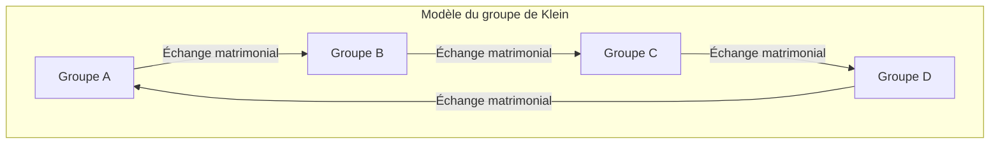

# Claude Lévi-Strauss et la révolution structuraliste : Déconstruction de l'eurocentrisme et géométrie de la « pensée sauvage »

## Chapitre 1 : Le crépuscule de l'existentialisme et le bouleversement tectonique intellectuel parisien

Au milieu du XXe siècle, le monde de la pensée française se trouvait sous le puissant champ magnétique de l'existentialisme centré autour de Jean-Paul Sartre. Érigeant la thèse selon laquelle « l'existence précède l'essence » et soulignant la subjectivité libre et l'engagement de l'homme, la philosophie de Sartre offrait une nouvelle éthique et une lueur d'espoir aux intellectuels européens qui avaient traversé la catastrophe sans précédent de la Seconde Guerre mondiale. Cependant, face à ce paradigme anthropocentrique qui présupposait inconsciemment le progrès de l'histoire, c'est Claude Lévi-Strauss qui préparait, silencieusement mais sûrement, un bouleversement tectonique décisif.

Le point de départ idéologique de Lévi-Strauss résidait dans un profond sentiment de « dissonance ». L'optimisme de l'existentialisme, selon lequel la conscience subjective pouvait tout déterminer, ne serait-il pas, à la lumière de la vie des peuples autochtones qu'il avait observés dans le Mato Grosso au Brésil et de l'échelle grandiose de l'histoire humaine, qu'une présomption extrêmement locale et propre à l'Occident moderne ? Cette intuition se transforma en certitude théorique lorsqu'il s'exila à New York aux États-Unis pour fuir les persécutions en tant que Juif pendant la Seconde Guerre mondiale. C'est là qu'il fit la rencontre fatidique du linguiste Roman Jakobson, héritier du formalisme russe.

Ce que Jakobson lui apporta fut la méthodologie rigoureuse de la « linguistique structurale » et de la « phonologie », initiée par Ferdinand de Saussure et raffinée par l'École de Prague (Nikolaï Troubetzkoy et d'autres). La phonologie avait démontré que les phonèmes individuels n'avaient pas de sens en eux-mêmes, mais que c'était plutôt le « système de différences (relations) » entre les phonèmes qui générait le sens. Lévi-Strauss eut l'intuition que ce modèle de « système relationnel fonctionnant au niveau de l'inconscient » deviendrait la clé universelle pour déchiffrer non seulement le langage, mais aussi l'ensemble de la culture humaine, comme les relations de parenté, les mythes et les rituels. Ce fut le moment historique où le structuralisme fut introduit dans le domaine de l'anthropologie culturelle, marquant le début de la « révolution structuraliste » qui déconstruisait le privilège du sujet et de la conscience.

Alors que l'existentialisme sartrien considérait la « conscience » individuelle et le « choix libre » comme les moteurs de la formation historique, Lévi-Strauss soutenait que derrière les choix subjectifs humains, il existait de puissantes « structures » opérant inconsciemment. Le sujet est parlé par la structure, et ce n'est pas le sujet qui contrôle la structure. Ce changement de paradigme a ébranlé fondamentalement la suprématie du cogito (je pense) depuis Descartes.

## Chapitre 2 : Le choc mathématique des *Structures élémentaires de la parenté* (1949)

Publié en 1949, *Les Structures élémentaires de la parenté* devint une œuvre monumentale qui transforma le paysage de l'anthropologie. Lévi-Strauss y a repensé le phénomène du « tabou de l'inceste », observé dans diverses sociétés à travers le monde, comme un mécanisme universel reliant la nature et la culture. Jusqu'alors, le tabou de l'inceste était souvent expliqué comme un instinct visant à prévenir la dégénérescence biologique, ou dû à une aversion psychologique. Cependant, il a perçu que l'essence du tabou de l'inceste ne résidait pas dans l'interdiction négative de « avec qui on ne doit pas se marier », mais dans la règle positive de l'« échange », consistant à « céder les femmes de son propre groupe à un autre groupe, et recevoir en retour des femmes de cet autre groupe ».

Pour construire cette théorie, il s'est appuyé sur l'« Essai sur le don » de Marcel Mauss. Mauss avait montré que dans les sociétés archaïques, le don était un mécanisme formant et maintenant les liens sociaux (alliances) par trois obligations : « l'obligation de donner, l'obligation de recevoir et l'obligation de rendre ». Lévi-Strauss a appliqué cette logique du don aux relations de parenté (le mariage). En d'autres termes, le mariage est un système d'échange intergroupes dont le paradigme est la femme en tant que « don » suprême, permettant ainsi à l'humanité de passer de la loi de la nature (fermeture basée uniquement sur la consanguinité biologique) à la loi de la culture (alliances ouvertes avec l'Autre).

Ce qui était encore plus révolutionnaire fut l'introduction par Lévi-Strauss de la « théorie des groupes » des mathématiques modernes dans cette analyse des structures de parenté. Avec la collaboration d'André Weil, un mathématicien de génie du groupe Bourbaki avec lequel il s'était lié d'amitié durant sa période new-yorkaise, il démontra que les règles matrimoniales extrêmement complexes des peuples autochtones d'Australie (comme les systèmes des Murngin ou des Kariera) étaient parfaitement isomorphes à la structure des groupes en algèbre (et particulièrement au « groupe de Klein »).

Le groupe de Klein (Klein four-group) est un groupe commutatif composé de quatre éléments, possédant la propriété (involution) de revenir à l'élément neutre lorsqu'un élément quelconque agit deux fois sur lui-même. Lévi-Strauss et Weil ont montré que les règles matrimoniales dans les systèmes de parenté étaient systématiquement organisées selon les propriétés mathématiques de ce groupe. Sa structure de base est illustrée ci-dessous par un schéma utilisant Mermaid.

(*Les mécanismes de l'échange symétrique et asymétrique, de l'échange restreint et de l'échange généralisé dans les systèmes de parenté réels ont été compris de manière unifiée pour la première fois grâce à ce modèle mathématique. Il est apparu clairement que l'échange généralisé (un système circulaire où A donne à B, B donne à C, et C donne à A) était particulièrement un mécanisme puissant d'intégration de l'ensemble de la société.*)

L'introduction de cette formulation algébrique par Weil a prouvé au monde que les systèmes de parenté de ceux considérés comme « primitifs » étaient en réalité des géométries sophistiquées conçues par une intelligence mathématique de haut niveau (bien qu'ils l'appliquassent eux-mêmes de manière inconsciente). Les structures de parenté que les chercheurs occidentaux jugeaient « trop complexes et incompréhensibles » se sont révélées, à travers le prisme de la théorie des groupes, comme des cristaux d'une symétrie et d'une cohérence logique époustouflantes.

## Chapitre 3 : *Tristes Tropiques* (1955) et le crépuscule de la civilisation occidentale

Publié en 1955, *Tristes Tropiques* est à la fois une ethnographie académique, un chef-d'œuvre littéraire d'exception et un livre de réflexions philosophiques. L'ouvrage, qui commence par la phrase provocatrice « Je hais les voyages et les explorateurs », s'articule autour des souvenirs de son travail de terrain mené dans les années 1930 dans l'État du Mato Grosso, à l'intérieur du Brésil. Lévi-Strauss y a rencontré des peuples autochtones tels que les Caduveo, les Bororo, les Nambikwara et les Tupi-Kawahib.

Les tatouages d'arabesques complexes que les femmes Caduveo arboraient sur leur visage. Lévi-Strauss vit dans ces motifs géométriques asymétriques mais hautement calculés, une tentative inconsciente de résoudre symboliquement les contradictions et les tensions du système de castes inhérentes à leur société. Les tatouages faciaux n'étaient pas de simples décorations, mais un art doté d'une « fonction sociologique » servant à médiatiser les fractures structurelles de la société sur la peau.

La structure villageoise des Bororo était encore plus dramatique. Leurs villages étaient disposés en cercle, avec une disposition spatiale stricte de clans et de moitiés (moieties) complexes, centrée autour de la place centrale et de la maison des hommes. Lévi-Strauss a déchiffré que la disposition physique du village elle-même était un « modèle structurel vivant » visualisant leur cosmologie, leurs relations de parenté et leur ordre mythique. Le fait que la première chose que les missionnaires chrétiens aient faite pour les convertir ait été de « reconstruire le village en ligne droite » démontre clairement que la destruction de la structure spatiale était directement liée à la destruction de leur univers spirituel.

Et lors de ses interactions avec les Nambikwara, qui avaient conservé le mode de vie le plus primitif, Lévi-Strauss est parvenu à une intuition bouleversante sur l'« origine de l'écriture ». C'est le célèbre épisode de la « Leçon d'écriture ». Bien qu'il ne possédât pas l'écriture, le chef des Nambikwara fit semblant d'imiter l'anthropologue en train de prendre des notes en traçant des lignes ondulées sur du papier et de les lire pour afficher son autorité devant sa tribu. Lévi-Strauss en a tiré l'hypothèse radicale que l'écriture, à l'origine, n'avait pas été inventée pour la conservation des connaissances ou le développement de la civilisation, mais pour faciliter « l'asservissement et l'exploitation de l'homme par l'homme ». L'écriture fixe les lois et les contrats, rend possible la perception des impôts et consolide la société hiérarchique. Cette observation que « l'écriture (l'écriture en soi) », fondement sur lequel l'Occident justifiait sa supériorité, était en réalité une technologie de l'oppression, a eu plus tard une influence décisive sur la critique du phonocentrisme de Jacques Derrida.

*Tristes Tropiques* est imprégné d'un deuil profond (une nostalgie rousseauiste) face à la disparition de la diversité. Il a comparé le processus par lequel la « civilisation » occidentale uniformise, exploite et détruit les cultures hétérogènes à travers le monde à l'« augmentation de l'entropie ». Il affirme avec une détermination poignante que l'anthropologie devrait être une « entropologie » (entropology : science de l'entropie), s'opposant à cette augmentation irréversible de l'entropie (la marche inévitable vers l'homogénéisation) en s'efforçant de sauver les cristaux de diverses structures gravées dans l'inconscient humain.

## Chapitre 4 : *La Pensée sauvage* (1962) et le bricolage

*La Pensée sauvage* (1962) constitue le manifeste le plus puissant du structuralisme, portant un coup décisif à l'historicisme et au progressisme incarnés par Sartre. Lévi-Strauss y déconstruit complètement la hiérarchie de supériorité et d'infériorité qui dominait l'Occident depuis longtemps : celle entre la pensée des « primitifs (sauvage) » et la pensée de la « civilisation (science) ».

Il a démontré que la pensée des autochtones (la pensée sauvage) n'était en aucun cas illogique ou prélogique, mais qu'elle était une intelligence d'une rigueur tout à fait égale à la pensée scientifique moderne. La différence n'est pas une question de capacité intellectuelle, mais simplement une « différence d'approche envers l'objet de la connaissance ». La pensée sauvage n'est pas celle de l'« ingénieur » qui extrait des concepts abstraits et des lois universelles, mais elle est animée par la logique du « bricolage », qui rassemble et réorganise les matériaux concrets limités à disposition (fragments de mythes, classification de la faune et de la flore, éléments rituels, etc.) pour construire de nouveaux systèmes de signification.

Le bricoleur ne possède pas d'outils ou de matériaux spécialisés pour un but spécifique. Il utilise « les moyens du bord » pour assembler l'ordre du monde de manière improvisée. Cette intelligence du bricolage est précisément la source qui a produit la richesse étonnante et la cohérence logique des mythes, de la magie et du totémisme à travers le monde.

Dans son analyse du totémisme en particulier, Lévi-Strauss a brillamment rejeté l'interprétation utilitariste des anthropologues fonctionnalistes (comme Malinowski) selon laquelle « un animal est choisi comme totem parce qu'il est utile sur le plan alimentaire (bon à manger) ». Il déclare : « Les animaux ne sont pas choisis parce qu'ils sont bons à manger, mais parce qu'ils sont bons à penser ». Les différences entre des plantes ou des animaux spécifiques (par exemple, « l'aigle et l'ours », « les animaux du ciel et les animaux de la terre ») sont utilisées comme « outils conceptuels » pour exprimer les différences entre les groupes sociaux humains (la relation entre le clan A et le clan B). Ce système, où les oppositions binaires de la nature fonctionnent comme des métaphores des oppositions binaires de la culture, était exactement la mise en pratique parfaite de la « création de sens par la différence » de la linguistique structurale.

Dans le dernier chapitre du livre, intitulé « Histoire et Dialectique », Lévi-Strauss tourne la lame de sa critique impitoyable contre l'ouvrage majeur de Sartre, la *Critique de la raison dialectique*. Sartre considérait l'histoire comme le processus de déploiement de la vérité absolue, privilégiant la société moderne occidentale (la société avec histoire). Cependant, pour Lévi-Strauss, l'« histoire » sartrienne n'est qu'un mythe moderne fabriqué par les intellectuels occidentaux pour légitimer leur propre identité. Il n'existe aucune supériorité essentielle entre les « sociétés froides (qui cherchent à se maintenir sans modifier leur structure) » dénuées d'écriture et d'histoire, et les « sociétés chaudes (l'Occident moderne) » qui recherchent un changement et un progrès incessants. Cette critique cinglante de Sartre est devenue une déclaration historique marquant la transition totale de l'hégémonie de la pensée française de l'existentialisme vers le structuralisme.

## Chapitre 5 : *Mythologiques* (en 4 tomes) et le canyon graphique : Géométrie du mythe et formule canonique

Le point culminant des recherches académiques de Lévi-Strauss est la vaste œuvre en quatre tomes intitulée *Mythologiques*, publiée de 1964 à 1971. Composée du Tome 1 *Le Cru et le Cuit*, du Tome 2 *Du Miel aux cendres*, du Tome 3 *L'Origine des manières de table* et du Tome 4 *L'Homme nu*, cette œuvre monumentale rassemble plus de 800 mythes autochtones dispersés à travers les Amériques, démontrant qu'ils ne constituent pas un simple amas d'histoires aléatoires, mais forment un immense « système de transformations ».

À première vue, les mythes semblent absurdes, illogiques et nés de l'imagination. Pourtant, Lévi-Strauss a perçu qu'une structure algébrique rigoureuse se cachait dans les profondeurs du mythe. Chaque mythe n'existe pas de manière isolée, mais est généré en inversant d'autres mythes ou en substituant leurs éléments. Un mythe raconté comme l'opposition entre le « soleil » et l'« eau » dans une tribu, est substitué par l'opposition entre le « jaguar » et l'« homme » dans une tribu voisine, et se transforme encore en une opposition entre la « viande crue (nature) » et la « viande cuite (culture) » dans une tribu plus lointaine. Toutes ces variations peuvent s'expliquer comme des « transformations » d'une structure inconsciente commune.

La célèbre « formule canonique » formalise ce mécanisme de transformation des mythes. Lévi-Strauss a exprimé la structure du mythe à l'aide du modèle mathématique suivant.

$F_x(A) : F_y(B) \simeq F_x(B) : F_{a^{-1}}(y)$

Cette équation n'est pas une simple métaphore, mais un modèle algébrique décrivant extrêmement rigoureusement la transformation logique des mythes.
Ici, A et B sont des « termes », tandis que x et y représentent les « fonctions » ou attributs de ces termes.
Le côté gauche de l'équation, $F_x(A) : F_y(B)$, indique la relation entre le « terme A doté de la fonction x » et le « terme B doté de la fonction y ».
Cela est transformé dans le côté droit de l'équation, $F_x(B) : F_{a^{-1}}(y)$. Dans le côté droit, tandis que le terme B reprend la fonction x, un changement dramatique se produit. Le terme A d'origine voit sa polarité s'inverser ($a^{-1}$), et y, qui était censé être une fonction, est promu à la position de terme. C'est ce qu'on appelle la « double torsion ».

Prenons l'exemple d'une transformation structurelle mythique mentionnée par Lévi-Strauss dans *La Potière jalouse*.
Supposons que dans un mythe (côté gauche), un « aigle (A) appartenant au ciel (x) » s'oppose à un « ours (B) appartenant à la terre (y) ». Lorsqu'il se transforme en un autre mythe (côté droit), il ne s'agit pas d'un simple échange de personnages. Apparaît alors un « ours (B) appartenant au ciel (x) », avec pour élément opposant « la terre (y) elle-même personnifiée en divinité », tandis que l'« aigle (A) » d'origine est dégradé en « esprit du monde souterrain ($a^{-1}$, inversion du ciel) », créant ainsi une telle torsion structurelle. Cette transformation topologique, telle la bande de Möbius où la fonction se transforme en terme et le terme s'inverse en fonction, se répète à l'infini dans la chaîne des mythes du continent américain.

À travers cette analyse, Lévi-Strauss a prouvé que les mythes n'ont ni « origine » spécifique ni « auteur original ». Ce ne sont pas les hommes qui racontent les mythes. « Ce sont les mythes qui se pensent dans les hommes, et à leur insu ». Le cerveau (l'intellect) humain fonctionne comme un immense dispositif de traitement de l'information (un ordinateur) qui prend en entrée des données sensorielles de la nature (le cru, le cuit, le pourri, etc.) et utilise des algorithmes de transformation comme cette formule canonique pour produire en sortie un ordre culturel (règles de parenté, de cuisine, de rituels).

De plus, un aspect remarquable des *Mythologiques* est que sa structure globale repose profondément sur la « structure musicale ». Dans la préface du premier tome, Lévi-Strauss fait l'éloge de Richard Wagner en tant que « précurseur inégalé de l'analyse structurale » et structure sa propre œuvre en utilisant l'analogie avec la symphonie, la forme sonate et la fugue. Les mythes et la musique partagent une structure temporelle « intraduisible », contrairement au langage. Tout comme le leitmotiv (motif conducteur) musical varie, s'inverse et se superpose dans l'harmonie ou le contrepoint, les éléments du mythe (les mythèmes) résonnent également comme un orchestre, dans le développement diachronique du récit (mélodie) et la superposition synchronique des structures (harmonie).

En s'appuyant sur les structures de la fugue de Bach ou du Boléro de Ravel, il a minutieusement analysé comment les oppositions binaires des mythes formaient des accords et résolvaient les dissonances. L'espace mythique est un immense « canyon graphique (Canyon/Music/Myth) », c'est-à-dire un espace multidimensionnel grandiose où se croisent les mythèmes superposés comme des strates géologiques dans un canyon et la polyphonie musicale. La découverte que les formes considérées comme les plus hauts sommets de la rationalité occidentale, à savoir les équations mathématiques et la polyphonie musicale, opéraient en fait déjà de manière parfaite dans les profondeurs de la « pensée sauvage », a fondamentalement brisé l'arrogance de l'eurocentrisme.

## Appendice : Deux repères colossaux dans l'analyse structurale des mythes (Études de cas pratiques)

Comment la théorie de Lévi-Strauss a-t-elle disséqué des textes mythiques concrets pour révéler les structures algébriques qui s'y cachaient ? Afin de comprendre la véritable quintessence pratique de cela, nous retracerons en détail ici deux de ses études de cas représentatives. Cette analyse démontre de manière éclatante que le structuralisme n'est pas simplement une philosophie abstraite, mais une véritable « intervention chirurgicale » extrêmement précise appliquée aux textes.

### Étude de cas 1 : L'analyse structurale du mythe d'Œdipe

L'analyse du « mythe d'Œdipe » développée par Lévi-Strauss dans *Anthropologie structurale* (1958) a radicalement changé le paradigme de l'analyse mythologique. Face à ce mythe grec que Freud semblait avoir entièrement épuisé avec son interprétation psychologique du « désir incestueux (complexe d'Œdipe) », il a adopté une approche complètement différente. Il n'a pas lu le mythe comme un « récit (développement diachronique) » le long d'un axe temporel, mais l'a déchiffré comme un « faisceau synchronique (harmonie) », à l'instar d'une partition d'orchestre.

Il a extrait tous les fragments (mythèmes) du mythe d'Œdipe et les a classés en quatre colonnes (catégories) verticales.
La première colonne regroupe les éléments montrant la « surévaluation des rapports de parenté ». Le fait que Cadmos recherche sa sœur Europe, qu'Œdipe épouse sa mère Jocaste, qu'Antigone enterre son frère Polynice au mépris de l'interdiction, etc.
La deuxième colonne, au contraire, regroupe les éléments montrant la « sous-évaluation (hostilité) des rapports de parenté ». Œdipe tuant son père Laïos, les frères Étéocle et Polynice s'entretuant.
La troisième colonne concerne les éléments illustrant la « destruction des monstres (créatures chthoniennes nées de la terre) ». Cadmos tuant le dragon, Œdipe détruisant le Sphinx.
La quatrième colonne regroupe les éléments soulignant la « difficulté à marcher (défaut physique) ». Les noms et caractéristiques physiques de Laïos (le gaucher, maladroit), de Labdacos (le boiteux), d'Œdipe (aux pieds enflés).

La logique que Lévi-Strauss a tirée de cela est stupéfiante. La relation entre la colonne 1 et la colonne 2 (surévaluation de la parenté : sous-évaluation) est totalement parallèle à la relation entre la colonne 3 et la colonne 4 (négation de l'autochtonie : affirmation de l'autochtonie). Tuer les « monstres nés de la terre (symboles de l'autochtonie humaine) » signifie nier la croyance selon laquelle les humains seraient nés de la terre (séparation d'avec la nature). Cependant, la difficulté à marcher (le fait que les pieds soient traînés au sol) signifie que l'humain reste attaché à la terre (autochtonie).
En somme, le mythe d'Œdipe était une gigantesque machine à calculer visant à médiatiser logiquement la contradiction fondamentale (l'aporie) de la société de la Grèce antique : « L'homme naît-il de l'union entre un homme et une femme (réalité culturelle et biologique) ou naît-il de la terre par parthénogenèse (nature et croyance mythique) ? ». Pour Lévi-Strauss, même l'interprétation psychologique de Freud n'est que l'une des « variantes les plus récentes (formes de transformation) » du mythe d'Œdipe.

### Étude de cas 2 : La structure spatiale multicouche de « La Geste d'Asdiwal »

Une autre analyse extrêmement importante est celle de la structure de « La Geste d'Asdiwal », un mythe de la tribu amérindienne Tsimshian du nord-ouest de la côte du Pacifique (1958). Cet essai est considéré comme l'un des joyaux les plus achevés de l'analyse mythologique de Lévi-Strauss.

Dans ce long mythe relatant les pérégrinations et les mariages du héros Asdiwal, Lévi-Strauss a minutieusement déchiffré que l'histoire se déroulait simultanément à quatre niveaux différents : géographique, économique, sociologique et cosmologique.
Sur le plan géographique, Asdiwal se déplace d'est en ouest et du sud au nord. Sur le plan économique, les saisons passent de l'hiver de famine au printemps de la remontée des saumons, puis à l'été de la chasse. Sur le plan sociologique, il oscille entre la résidence matrilocale et la résidence patrilocale. Sur le plan cosmologique, il est déchiré entre une épouse du monde céleste (le peuple des étoiles) et une épouse du monde souterrain (le peuple de la mer).

La fin tragique d'Asdiwal (transformé en pierre et emprisonné au sommet d'une montagne) reflète une contradiction structurelle insoluble que la société Tsimshian rencontrait réellement : « la résidence patrilocale dans une société matrilinéaire ». En poussant à l'extrême cette contradiction insoluble dans la réalité jusqu'à l'effondrement sur le plan imaginaire du mythe, cela garantissait paradoxalement la légitimité des institutions sociales réelles.
Ici, le mythe n'est plus un simple « reflet » ou une « copie » de la réalité. Le mythe fonctionne comme un « laboratoire de réalité virtuelle (VR) » pour expérimenter et simuler symboliquement les fractures et les distorsions inhérentes à la structure sociale réelle. Lorsque les oppositions binaires sont poussées à l'extrême dans le mythe et échouent parce qu'elles sont insolubles, un soulagement inconscient naît dans l'esprit des gens : « après tout, l'institution sociale réelle (fruit d'un compromis) est préférable ».

Comme il ressort de ces analyses, la mythologie structurale n'est pas une réduction aux éléments, mais un travail de restauration du « réseau de relations » entre ces éléments. Ce n'était pas une géométrie analytique cartésienne qui divise finement l'objet, mais une démarche topologique (géométrie de situation) explorant les propriétés préservées malgré les changements de forme. Les pieds enflés d'Œdipe ou le corps pétrifié d'Asdiwal n'étaient pas de simples ornements narratifs, mais des fonctions mathématiques (paramètres) extrêmement rigoureuses servant à décrire la relation entre la société humaine et l'univers.

(*Cette méthode d'analyse multicouche a ensuite été reprise par Roland Barthes, Algirdas Julien Greimas et d'autres en théorie littéraire (narratologie), devenant un langage fondamental incontournable pour l'analyse des textes. Cette « géométrie sauvage » découverte par Lévi-Strauss dans les mythes a définitivement et irréversiblement redessiné le paysage intellectuel de la fin du XXe siècle.*)

## Chapitre 6 : Connexion au post-structuralisme et héritage contemporain : Inconscient structural et futur de l'IA

Le paradigme du structuralisme établi par Lévi-Strauss avec *Les Structures élémentaires de la parenté* et *La Pensée sauvage* a provoqué une tempête décisive dans la pensée contemporaine française à partir des années 1960. Sa méthode, qui a dépouillé les privilèges du « sujet », de la « conscience » et de l'« histoire » pour mettre au premier plan les « structures inconscientes » opérant secrètement en arrière-plan, s'est immédiatement propagée à d'autres disciplines académiques.

Jacques Lacan a introduit la théorie de l'échange des structures de parenté de Lévi-Strauss et la linguistique de Saussure dans la psychanalyse, forgeant la célèbre thèse selon laquelle « l'inconscient est structuré comme un langage ». La tentative de Lacan de critiquer sévèrement la psychologie du moi (ego-psychology) américaine centrée sur l'ego, et de redéfinir l'inconscient de Freud comme le réseau de l'ordre symbolique (l'ordre linguistique), n'aurait pas été possible sans l'approche algébrique de Lévi-Strauss.
Dans *Les Mots et les Choses*, Michel Foucault a fouillé de manière archéologique le cadre inconscient déterminant le savoir de chaque époque (l'épistémè), proclamant « la fin de l'homme » (la disparition du concept de « sujet » moderne, comme un visage dessiné sur le sable effacé par les vagues). Il s'agissait également d'une variation idéologique du concept d'« entropologie » par lequel Lévi-Strauss définissait l'anthropologie à la fin de *Tristes Tropiques*, prônant l'impuissance des projets conscients de l'homme.
De plus, Jacques Derrida a ouvert les portes du post-structuralisme en déconstruisant l'existence d'un « centre » ou d'une « origine absolue » présupposés par le structuralisme. Cependant, il convient de se rappeler que la critique du phonocentrisme par Derrida tire son point de départ de la lecture critique acerbe de Lévi-Strauss sur la « leçon d'écriture » des Nambikwara. Le structuralisme de Lévi-Strauss fut un énorme tremplin incontournable même pour les penseurs post-structuralistes qui cherchaient à le dépasser.

Dans ses dernières années, face à une mondialisation accélérée, Lévi-Strauss n'a cessé de lancer un cri d'alarme retentissant sur la perte de la diversité culturelle. Il estimait que la culture humaine ne pouvait conserver sa richesse que grâce à l'existence de la différence avec l'autre (une distance et une séparation appropriées). Une communication excessive et l'homogénéisation drainent la vitalité créative des cultures, entraînant finalement la mort entropique (la mort thermique) de l'humanité entière. Cette pensée était une vision profondément écologique, anticipant l'indissociabilité de la « biodiversité » et de la « diversité culturelle » d'aujourd'hui. Surmontant le dualisme cartésien qui opposait la nature (environnement) à la culture (homme), le tournant ontologique actuel (comme le multinaturalisme d'Eduardo Viveiros de Castro), qui réévalue « l'intelligence inhérente au monde naturel » sous l'angle de l'animisme et du totémisme, est également l'héritier légitime de sa théorie.

En outre, les développements rapides de l'informatique moderne, en particulier de l'intelligence artificielle (IA), jettent une nouvelle lumière sur le structuralisme de Lévi-Strauss. Les mécanismes par lesquels les grands modèles de langage (LLM) et l'apprentissage profond (Deep Learning) calculent les « schémas relationnels (différences et distances dans un espace vectoriel) » dissimulés dans de gigantesques réseaux de données textuelles pour générer du sens et de la logique, incarnent très exactement l'« algorithme de transformation des mythes » prévu par Lévi-Strauss. L'IA ne « comprend » pas le sens ; elle se contente de calculer de manière probabiliste et algébrique la matrice structurelle colossale des signes linguistiques (la chaîne des paradigmes et syntagmes dans un espace multidimensionnel). Toutefois, ce qui en ressort apparaît aux yeux humains comme une « intelligence » sophistiquée ou une « narration ».
Cela signifie que la thèse de Lévi-Strauss selon laquelle « les mythes se racontent d'eux-mêmes par l'intermédiaire de l'inconscient humain » a été matériellement implémentée sur des puces de silicium et des réseaux de neurones. Sans l'intervention de la conscience ou de l'intention d'un sujet, le principe fondamental du structuralisme, à savoir que le réseau relationnel différentiel des signes (la structure) tisse de manière autonome un système de sens, est ironiquement en passe d'être prouvé sous sa forme la plus pure par les technologies d'IA actuelles.

### Conclusion : L'éclat d'un cristal froid

Les textes colossaux laissés par Claude Lévi-Strauss furent un cristal froid jeté à la face de l'époque d'un existentialisme effervescent. Il a prouvé froidement que peu importe avec quelle ardeur l'homme revendique sa liberté, nos pensées sont constamment assujetties aux contraintes de structures transcendantales telles que le langage, les règles de parenté et les mythes. Néanmoins, ce n'est en aucun cas une philosophie du désespoir. Ce qu'il a découvert dans les profondeurs de la forêt amazonienne et dans les variations infinies des mythes autochtones n'était pas l'apanage d'une élite particulière ou d'une « société civilisée », mais l'éclat d'une intelligence universelle et raffinée partagée de manière égale par toute l'humanité.

Son exploit colossal, qui a déconstruit l'humanisme arrogant de l'Occident moderne et a offert au monde la beauté géométrique de la « pensée sauvage », rayonne de l'actualité qui mérite d'être relue le plus sérieusement aujourd'hui, au XXIe siècle, où l'anthropocentrisme est fondamentalement ébranlé par la crise environnementale et l'avènement de l'IA. « Le monde a commencé sans l'homme et il s'achèvera sans lui » —— cette prophétie poignante de *Tristes Tropiques* résonne d'une éthique profonde, nous enseignant, non pas le désespoir, mais la véritable mesure de l'homme au sein de la grandiose structure de l'univers.
