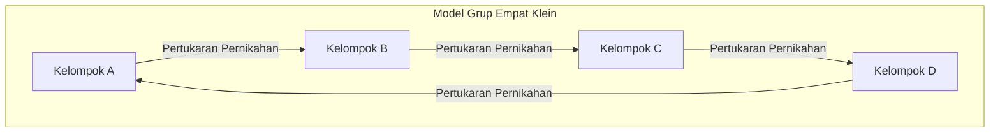

# Revolusi Strukturalisme Claude Lévi-Strauss: Dekonstruksi Etnosentrisme Barat dan Geometri "Pemikiran Liar"

## Bab 1: Senja Eksistensialisme dan Pergeseran Tektonik Intelektual Paris

Dunia pemikiran Prancis pada pertengahan abad ke-20 berada dalam medan magnet eksistensialisme yang kuat, yang berpusat pada Jean-Paul Sartre. Dengan mengusung tesis "eksistensi mendahului esensi", filsafat Sartre yang menekankan pada subjektivitas bebas manusia dan partisipasi sosial (engagement) memberikan secercah cahaya etika dan harapan baru bagi para intelektual Eropa yang telah melewati bencana Perang Dunia Kedua yang belum pernah terjadi sebelumnya. Namun, terhadap paradigma antroposentris ini yang secara tidak sadar mengasumsikan kemajuan sejarah, Claude Lévi-Strauss diam-diam namun pasti sedang mempersiapkan pergeseran tektonik yang menentukan.

Pada titik awal pemikiran Lévi-Strauss terdapat sebuah "ketidaknyamanan" yang mendalam. Optimisme eksistensialisme yang menganggap kesadaran subjektif dapat menentukan segalanya, jika dilihat dari kehidupan masyarakat adat yang disaksikannya di Mato Grosso, Brasil, atau dari skala sejarah umat manusia yang agung, mungkin hanyalah kesombongan lokal yang sangat modern dan kebarat-baratan. Intuisi ini berubah menjadi keyakinan teoretis ketika ia melarikan diri dari penganiayaan sebagai seorang Yahudi selama Perang Dunia II dan mengasingkan diri ke New York, Amerika Serikat. Di sanalah, ia mengalami pertemuan yang menentukan nasib dengan ahli bahasa Roman Jakobson, yang mengambil garis keturunan dari Formalisme Rusia.

Apa yang dibawa Jakobson kepadanya adalah metodologi yang ketat dari "linguistik struktural" dan "fonologi" yang bermula dari Ferdinand de Saussure dan disempurnakan oleh Mazhab Praha (seperti Nikolai Trubetzkoy). Fonologi telah membuktikan bahwa bukan fonem individual itu sendiri yang memiliki makna, melainkan "sistem perbedaan (hubungan)" antar fonemlah yang menghasilkan makna. Lévi-Strauss berintuisi bahwa model "sistem relasional yang berfungsi pada tingkat ketidaksadaran" ini akan menjadi kunci universal untuk memecahkan tidak hanya bahasa, tetapi juga kekerabatan, mitos, ritual, dan seluruh budaya manusia. Inilah momen bersejarah ketika strukturalisme diperkenalkan ke dalam bidang antropologi budaya, dan awal dari "revolusi strukturalisme" yang mendekonstruksi hak istimewa subjek dan kesadaran.

Sementara eksistensialisme Sartre menganggap "kesadaran" dan "pilihan bebas" individu sebagai kekuatan pendorong pembentukan sejarah, Lévi-Strauss berpendapat bahwa di balik pilihan subjektif manusia, terdapat "struktur" yang kuat yang beroperasi tanpa disadari. Subjek dibicarakan oleh struktur, bukan subjek yang mengendalikan struktur. Pergeseran paradigma ini mengguncang keunggulan cogito (aku berpikir) sejak Descartes dari akar-akarnya.

## Bab 2: Kejutan Matematis dalam "Struktur Dasar Kekerabatan" (1949)

Diterbitkan pada tahun 1949, *The Elementary Structures of Kinship* (Struktur Dasar Kekerabatan) menjadi karya monumental yang mengubah lanskap antropologi. Di sini, Lévi-Strauss menafsirkan kembali fenomena "tabu inses", yang ditemukan di berbagai masyarakat di seluruh dunia, sebagai mekanisme universal yang menjembatani alam dan budaya. Sebelumnya, tabu inses sering dijelaskan sebagai sesuatu yang naluriah untuk mencegah kemunduran biologis, atau disebabkan oleh rasa jijik secara psikologis. Namun ia melihat bahwa esensi dari tabu inses tidak terletak pada larangan negatif "dengan siapa kita tidak boleh menikah", melainkan pada aturan "pertukaran" positif "menyerahkan perempuan dari kelompok sendiri ke kelompok lain, dan sebagai gantinya menerima perempuan dari kelompok lain".

Dalam membangun teori ini, ia mengandalkan *The Gift* (Esai tentang Hadiah) karya Marcel Mauss. Mauss menunjukkan bahwa dalam masyarakat kuno (arkais), hadiah adalah sebuah mekanisme untuk membentuk dan memelihara ikatan sosial (aliansi) melalui tiga kewajiban: "kewajiban untuk memberi, kewajiban untuk menerima, dan kewajiban untuk membalas". Lévi-Strauss menerapkan logika pemberian ini pada hubungan kekerabatan (pernikahan). Dengan kata lain, pernikahan adalah sistem pertukaran antar kelompok yang menggunakan perempuan sebagai "hadiah" yang paling berharga sebagai paradigmanya, dan dengan ini umat manusia melompat dari hukum alam (ketertutupan semata-mata berdasarkan ikatan darah biologis) ke hukum budaya (hubungan aliansi terbuka dengan yang liyan).

Hal yang lebih inovatif adalah pengenalan "teori grup" (group theory) dari matematika modern oleh Lévi-Strauss ke dalam analisis struktur kekerabatan ini. Dengan bantuan André Weil, seorang ahli matematika jenius dari kelompok Bourbaki yang berteman dengannya selama berada di New York, ia membuktikan bahwa aturan pernikahan yang sangat kompleks dari masyarakat adat seperti penduduk asli Australia (misalnya, sistem suku Murngin dan Kariera) sepenuhnya isomorfik dengan struktur grup dalam aljabar (khususnya "grup empat Klein").

Grup empat Klein (Klein four-group) adalah grup abelian yang terdiri dari empat elemen, dengan sifat (involusi) bahwa jika sembarang elemen dioperasikan dua kali, ia akan kembali ke elemen asalnya. Lévi-Strauss dan Weil menunjukkan bahwa aturan pernikahan dalam sistem kekerabatan diorganisasikan secara sistematis menurut sifat matematis dari grup ini. Struktur dasarnya diilustrasikan dengan diagram Mermaid di bawah ini.

(*Mekanisme pertukaran simetris dan asimetris, pertukaran terbatas dan pertukaran umum dalam sistem kekerabatan yang sebenarnya, untuk pertama kalinya dipahami secara terpadu melalui model matematis ini. Secara khusus, terungkap bahwa pertukaran umum (sistem sirkuler di mana A memberi ke B, B memberi ke C, dan C memberi ke A) adalah mekanisme kuat yang mengintegrasikan seluruh masyarakat.*)

Pengenalan formulasi aljabar oleh Weil ini menghadapkan pada dunia bahwa sistem kekerabatan orang-orang yang dianggap "primitif" adalah geometri rumit yang dirancang oleh kecerdasan matematis tingkat tinggi (meskipun mereka sendiri mengoperasikannya tanpa sadar). Struktur kekerabatan yang oleh para sarjana Barat dianggap "terlalu rumit untuk dipahami", ketika dilihat melalui lensa teori grup, muncul sebagai kristal dengan simetri dan konsistensi logis yang sangat indah.

## Bab 3: "Tristes Tropiques" (1955) dan Senja Peradaban Barat

Diterbitkan pada tahun 1955, *Tristes Tropiques* (Daerah Tropis yang Sedih) bukan hanya sebuah etnografi akademis, melainkan juga sebuah karya sastra yang luar biasa dan buku refleksi filosofis. Karya ini, yang diawali dengan pernyataan provokatif "Saya benci perjalanan dan penjelajah", berpusat pada kenangan kerja lapangan (fieldwork) di pedalaman Brasil, negara bagian Mato Grosso, pada tahun 1930-an. Di sanalah Lévi-Strauss bertemu dengan masyarakat adat seperti suku Caduveo, Bororo, Nambikwara, dan Tupi-Kawahib.

Tato pola arabesque rumit yang diaplikasikan perempuan suku Caduveo pada wajah mereka. Di dalam pola geometris yang asimetris namun sangat diperhitungkan ini, Lévi-Strauss menemukan sebuah upaya bawah sadar masyarakat mereka untuk secara simbolis menyelesaikan kontradiksi dan ketegangan sistem kelas sosial yang mereka hadapi. Tato wajah bukanlah sekadar hiasan, melainkan seni dengan "fungsi sosiologis" untuk menengahi retakan struktural masyarakat di atas permukaan kulit.

Struktur desa suku Bororo bahkan lebih dramatis. Desa mereka diatur dalam bentuk lingkaran, dengan kotak (plaza) pusat dan balai pertemuan laki-laki di tengahnya, serta penempatan ruang yang ketat untuk klan dan paruhan (moiety) yang kompleks. Lévi-Strauss memecahkan bahwa tata letak fisik desa ini sendiri merupakan "model struktur hidup" yang memvisualisasikan pandangan kosmologis, hubungan kekerabatan, dan tatanan mitologis mereka. Fakta bahwa hal pertama yang dilakukan oleh misionaris Kristen untuk mengkristenkan mereka adalah "mengubah desa menjadi bentuk garis lurus", dengan jelas menceritakan bahwa penghancuran struktur spasial terkait langsung dengan penghancuran alam semesta spiritual mereka.

Dan melalui interaksinya dengan suku Nambikwara yang masih mempertahankan gaya hidup paling primitif, Lévi-Strauss sampai pada wawasan yang mengejutkan tentang "asal mula tulisan". Ini adalah sebuah episode terkenal yang disebut "Pelajaran Menulis". Kepala suku Nambikwara, meskipun tidak memiliki sistem tulisan, memamerkan otoritasnya kepada anggota sukunya dengan berpura-pura meniru antropolog yang sedang membuat catatan, yaitu dengan menggambar garis bergelombang di atas kertas dan berpura-pura membacakannya. Dari sinilah Lévi-Strauss mengajukan hipotesis radikal bahwa tulisan pada dasarnya diciptakan bukan untuk pelestarian pengetahuan atau perkembangan peradaban, melainkan untuk memfasilitasi "dominasi dan eksploitasi manusia atas manusia". Tulisan mengikat hukum dan kontrak, memungkinkan pemungutan pajak, dan mengukuhkan masyarakat hierarkis. Sindiran bahwa "tulisan (écriture)", yang dijadikan dasar superioritas oleh Barat, pada kenyataannya adalah teknologi penindasan, kelak memberikan pengaruh yang menentukan pada kritik Jacques Derrida terhadap logosentrisme.

*Tristes Tropiques* dipenuhi dengan ratapan mendalam (nostalgia ala Rousseau) atas keragaman yang memudar. Ia mengibaratkan proses "peradaban" Barat, yang menyeragamkan, mengeksploitasi, dan menghancurkan berbagai budaya heterogen di seluruh dunia, dengan "peningkatan entropi". Ia dengan tekad yang pilu menyatakan bahwa antropologi seharusnya menjadi sebuah "entropologi (entropology: ilmu entropi)" yang menentang peningkatan entropi yang tidak dapat diubah (langkah yang tak terhindarkan menuju homogenisasi) dan menyelamatkan kristal berbagai struktur yang terukir dalam ketidaksadaran umat manusia.

## Bab 4: "Pemikiran Liar" (1962) dan Bricolage

*The Savage Mind* (*La Pensée sauvage*, 1962) adalah manifesto strukturalisme yang paling kuat dan merupakan pukulan telak terhadap historisisme dan progresivisme yang diwakili oleh Sartre. Di sini, Lévi-Strauss sepenuhnya membongkar hierarki superioritas dan inferioritas antara pemikiran "primitif (liar)" dan pemikiran "beradab (ilmiah)" yang telah lama mendominasi Barat.

Ia membuktikan bahwa pemikiran penduduk asli (pemikiran liar) sama sekali bukan tidak logis atau pra-logis, melainkan kecerdasan presisi yang sepenuhnya setara dengan pemikiran ilmiah modern. Perbedaannya bukanlah letak dari keunggulan atau kelemahan kemampuan intelektual, tetapi hanya "perbedaan pendekatan terhadap objek pengetahuan". Pemikiran liar tidak didorong oleh pemikiran "insinyur" (teknisi) yang mengekstrak konsep abstrak dan hukum universal, melainkan oleh logika "bricolage" (pekerjaan perajin/tukang tadah) yang mengumpulkan bahan-bahan konkret yang terbatas (pecahan mitos, klasifikasi flora dan fauna, elemen ritual, dll.), merekonstruksinya, dan membangun sistem makna baru.

Bricoleur (perajin/tukang tadah) tidak memiliki alat atau bahan yang dikhususkan untuk tujuan tertentu. Mereka merakit tatanan dunia secara improvisasi dengan menggunakan "alat-alat yang ada". Kecerdasan bricolage inilah yang menjadi sumber lahirnya kekayaan yang menakjubkan dan konsistensi logis dari mitos, sihir, dan totemisme di seluruh dunia.

Khususnya dalam analisis totemisme, Lévi-Strauss dengan cerdas menolak interpretasi utilitarian dari para antropolog fungsionalis (seperti Malinowski) yang menyatakan "suatu hewan dipilih sebagai totem karena ia berguna sebagai makanan (baik untuk dimakan)". Ia berkata, "Hewan tidak dipilih karena mereka baik untuk dimakan (bon à manger), tetapi karena mereka baik untuk dipikirkan (bon à penser)". Perbedaan tumbuhan dan hewan tertentu (misalnya, "elang dan beruang", "hewan langit dan hewan bumi") digunakan sebagai "alat konseptual" untuk mengekspresikan perbedaan antar kelompok sosial manusia (hubungan klan A dan klan B). Sistem ini, di mana oposisi biner di alam semesta berfungsi sebagai metafora untuk oposisi biner di dunia budaya, adalah benar-benar praktik yang sempurna dari "pembentukan makna melalui perbedaan" dalam linguistik struktural.

Dalam bab terakhir buku ini, "Sejarah dan Dialektika", Lévi-Strauss mengarahkan pedang kritiknya tanpa ampun pada karya besar Sartre, *Critique of Dialectical Reason*. Sartre memandang sejarah sebagai proses pengungkapan kebenaran mutlak, dan mengistimewakan masyarakat modern Eropa Barat (masyarakat yang memiliki sejarah). Namun, menurut Lévi-Strauss, "sejarah" versi Sartre hanyalah sebuah mitos modern yang dibuat-buat oleh para intelektual Eropa Barat untuk membenarkan identitas mereka sendiri. Tidak ada superioritas esensial antara "masyarakat dingin (masyarakat yang berusaha mempertahankan strukturnya tanpa perubahan)" yang tidak memiliki tulisan maupun sejarah, dan "masyarakat panas (Eropa Barat modern)" yang terus-menerus mengejar perubahan dan kemajuan. Kritik yang tajam terhadap Sartre ini menjadi proklamasi historis yang menandakan bahwa hegemoni pemikiran Prancis telah beralih sepenuhnya dari eksistensialisme ke strukturalisme.

## Bab 5: "Mitologika" (4 Jilid) dan Kaniografi: Geometri Mitos dan Rumus Kanonik

Puncak dari eksplorasi akademis Lévi-Strauss adalah karya kolosalnya yang terdiri dari empat jilid, *Mythologiques*, yang diterbitkan antara tahun 1964 dan 1971. Karya epik ini, yang terdiri dari Jilid I: *Yang Mentah dan Yang Matang*, Jilid II: *Dari Madu ke Abu*, Jilid III: *Asal Usul Tata Krama Makan*, dan Jilid IV: *Manusia Telanjang*, mengumpulkan lebih dari 800 kelompok mitos masyarakat adat yang tersebar di benua Amerika Utara dan Selatan, dan membuktikan bahwa mereka bukanlah sekadar kumpulan cerita acak, melainkan membentuk sistem "transformasi" yang sangat besar.

Pada pandangan pertama, mitos tampaknya tidak masuk akal, tidak logis, dan merupakan produk fantasi. Namun, Lévi-Strauss melihat bahwa di kedalaman mitos tersembunyi struktur aljabar yang ketat. Mitos individual tidak berdiri sendiri, melainkan dihasilkan dengan membalikkan atau mengganti elemen dari mitos lain. Sebuah mitos yang diceritakan sebagai oposisi antara "matahari" dan "air" dalam suatu suku, digantikan dengan oposisi antara "jaguar" dan "manusia" pada suku tetangganya, dan kemudian berubah menjadi oposisi antara "daging mentah (alam)" dan "daging matang (budaya)" pada suku yang lebih jauh. Semua variasi ini dapat dijelaskan sebagai "transformasi (transformation)" dari struktur bawah sadar yang sama.

Mekanisme transformasi mitos ini diformulasikan ke dalam apa yang dikenal sebagai "Rumus Kanonik (Canonical Formula)". Lévi-Strauss merepresentasikan struktur mitos menggunakan model matematika berikut:

$F_x(A) : F_y(B) \simeq F_x(B) : F_{a^{-1}}(y)$

Persamaan ini bukanlah sekadar metafora, melainkan sebuah model aljabar yang secara akurat mendeskripsikan transformasi logis mitos.
Di sini, A dan B adalah "term (termes)", sedangkan x dan y mewakili "fungsi (fonctions)" atau atribut yang dimiliki term tersebut.
Sisi kiri persamaan $F_x(A) : F_y(B)$ menunjukkan hubungan antara "term A yang membawa fungsi x" dan "term B yang membawa fungsi y".
Ini diubah menjadi sisi kanan $F_x(B) : F_{a^{-1}}(y)$. Di sisi kanan, term B mengambil alih fungsi x, namun pada saat yang sama terjadi perubahan yang dramatis. Term asli A membalikkan polaritasnya ($a^{-1}$), dan y yang tadinya merupakan sebuah fungsi berpindah ke posisi term. Hal ini disebut "pelintiran ganda (double twist)".

Sebagai contoh konkret, mari kita perhatikan transformasi struktural dari mitos yang dibahas Lévi-Strauss dalam *The Jealous Potter* (Pembuat Tembikar yang Cemburu).
Misalkan dalam sebuah mitos (sisi kiri), ada oposisi antara "elang yang termasuk ke dalam langit (x) (A)" dan "beruang yang termasuk ke dalam bumi (y) (B)". Ketika ini diubah ke mitos lain (sisi kanan), karakternya tidak sekadar ditukar. Terjadi sebuah pelintiran struktural: "beruang yang termasuk ke dalam langit (x) (B)" muncul, dan sebagai elemen lawan muncullah "dewa yang mempersonifikasikan bumi itu sendiri (y)", sementara "elang (A)" yang asli diturunkan tingkatannya menjadi "roh dunia bawah ($a^{-1}$, pembalikan langit)". Transformasi topologis layaknya pita Möbius, di mana fungsi berubah menjadi term dan term berbalik menjadi fungsi, berulang tanpa batas dalam rangkaian mitos di benua Amerika.

Melalui analisis ini, Lévi-Strauss membuktikan bahwa mitos tidak memiliki "asal" atau "penulis asli" tertentu. Mitos tidak diceritakan oleh manusia. Sebaliknya, "mitoslah yang berbicara tentang dirinya sendiri melalui ketidaksadaran manusia". Otak (intelek) manusia berfungsi seperti perangkat pemrosesan informasi raksasa (komputer) yang mengambil data sensoris dari alam (mentah, matang, busuk, dll.) sebagai masukan, dan menggunakan algoritma transformasi seperti rumus kanonik ini untuk menghasilkan aturan budaya (aturan kekerabatan, masakan, dan ritual) sebagai keluaran.

Selain itu, hal yang patut diperhatikan dari *Mythologiques* adalah struktur keseluruhannya yang sangat bergantung pada "struktur musik". Dalam kata pengantar jilid pertama, Lévi-Strauss memuji Richard Wagner sebagai "pelopor analisis struktural yang tak tertandingi", dan menyusun karyanya sendiri dengan analogi simfoni, bentuk sonata, dan fugue. Mitos dan musik, tidak seperti bahasa, keduanya memiliki struktur waktu yang "tidak dapat diterjemahkan". Sama seperti motif utama (leitmotif) dalam musik yang divariasikan, dibalik, dan ditumpuk dalam harmoni dan polifoni, elemen-elemen mitos (mytheme: unit mitos dasar) juga beresonansi layaknya sebuah orkestra di antara jalannya narasi secara diakronis (melodi) dan tumpang tindih struktural secara sinkronis (harmoni).

Sambil merujuk pada struktur fugue karya Bach dan Boléro karya Ravel, ia menganalisis dengan cermat bagaimana oposisi biner mitos membentuk akord dan menyelesaikan disonansi. Ruang mitos adalah sebuah "canyongraphy (Canyon/Music/Myth)" raksasa, yaitu ruang multidimensional epik tempat bertemunya elemen-elemen mitos (mytheme) yang berlapis seperti strata lembah dengan polifoni musik. Penemuan bahwa persamaan matematis dan polifoni musikal, bentuk-bentuk yang dianggap sebagai puncak nalar Barat, sebenarnya telah beroperasi secara sempurna di lapisan bawah sadar dari "pemikiran liar", secara mendasar menghancurkan kesombongan etnosentrisme Barat.

## Suplemen: Dua Tonggak Penting dalam Analisis Struktural Mitos (Studi Kasus Praktis)

Bagaimana teori Lévi-Strauss membedah teks mitos yang konkret dan mengungkap struktur aljabar yang tersembunyi di dalamnya? Untuk memahami esensi praktisnya, di sini kita akan menelusuri secara rinci dua studi kasus yang representatif. Analisis ini dengan jelas menunjukkan bahwa strukturalisme bukanlah filsafat abstrak semata, melainkan "pembedahan bedah" presisi tinggi terhadap teks.

### Studi Kasus 1: Analisis Struktural Mitos Oedipus

Analisis Lévi-Strauss mengenai "Mitos Oedipus" yang dipaparkan dalam *Structural Anthropology* (1958) telah mengubah secara drastis paradigma analisis mitos. Mitos Yunani ini, yang tampaknya telah sepenuhnya diinterpretasikan oleh Freud melalui kerangka psikologis "hasrat inses (Oedipus Complex)", didekati dari perspektif yang sama sekali berbeda olehnya. Ia membaca mitos ini bukan sebagai "narasi (progresi diakronis)" di sepanjang garis waktu, melainkan sebagai "ikatan sinkronis (harmoni)" layaknya sebuah partitur (score) orkestra.

Ia mengekstrak semua fragmen (mytheme: elemen mitos) dari Mitos Oedipus dan mengklasifikasikannya ke dalam empat kolom vertikal (kategori).
Kolom pertama adalah elemen yang menunjukkan "penilaian berlebihan atas ikatan darah". Contohnya: Cadmus yang mencari adik perempuannya, Eropa; Oedipus yang menikahi ibunya, Jocasta; dan Antigone yang melanggar hukum untuk menguburkan kakaknya, Polynices.
Kolom kedua, sebaliknya, menunjukkan "penilaian yang terlalu rendah atas ikatan darah (permusuhan)". Oedipus membunuh ayahnya, Laius; serta Eteocles dan Polynices yang saling membunuh bersaudara.
Kolom ketiga menunjukkan "pembunuhan monster (makhluk pribumi yang lahir dari bumi)". Cadmus membunuh naga; Oedipus mengalahkan Sphinx.
Kolom keempat menunjukkan "kesulitan berjalan (cacat fisik)". Nama-nama dan ciri-ciri fisik seperti Laius (kidal/canggung), Labdacus (pincang), dan Oedipus (kaki bengkak).

Logika yang ditarik oleh Lévi-Strauss dari sini sangat mencengangkan. Hubungan antara kolom pertama dan kedua (penilaian lebih ikatan darah : penilaian kurang) benar-benar sejajar dengan hubungan antara kolom ketiga dan keempat (penyangkalan sifat pribumi : penegasan sifat pribumi). Membunuh "monster yang lahir dari bumi (simbol akar manusia pada tanah)" berarti menyangkal keyakinan bahwa manusia lahir dari bumi (memisahkan diri dari alam). Namun, kesulitan berjalan (kaki yang terseret di tanah) masih melambangkan bahwa manusia terikat ke bumi (memiliki akar ke tanah).
Dengan kata lain, mitos Oedipus merupakan perangkat komputasi raksasa yang mencoba mendamaikan secara logis kontradiksi mendasar (aporia) yang dihadapi oleh masyarakat Yunani kuno: "Apakah manusia dilahirkan dari hubungan pria dan wanita (budaya/realitas biologis), atau apakah manusia lahir secara aseksual dari bumi (alam/kepercayaan mitos)?". Bahkan interpretasi psikologis Freud pun, menurut Lévi-Strauss, hanyalah salah satu dari "variasi (bentuk transformasi) terbaru" dari mitos Oedipus.

### Studi Kasus 2: Struktur Spasial Multilapis dari "Kisah Asdiwal"

Analisis penting lainnya adalah analisis struktural dari "Kisah Asdiwal" (*La Geste d'Asdiwal*, 1958), sebuah mitos yang diturunkan oleh suku Tsimshian di pantai Pasifik barat laut Amerika Utara. Makalah ini dinilai sebagai salah satu puncak kesempurnaan analisis mitos Lévi-Strauss.

Dalam mitos panjang mengenai pengembaraan dan pernikahan pahlawan bernama Asdiwal ini, Lévi-Strauss membaca dengan teliti bahwa cerita tersebut terungkap secara bersamaan dalam empat tingkatan yang berbeda: geografis, ekonomi, sosiologis, dan kosmologis.
Pada tingkat geografis, Asdiwal berpindah dari timur ke barat, dari selatan ke utara. Pada tingkat ekonomi, musim berganti dari musim dingin yang penuh kelaparan, musim semi saat salmon bermigrasi, hingga musim panas berburu. Pada tingkat sosiologis, ia terombang-ambing antara pernikahan matrilokal (tinggal di keluarga ibu) dan patrilokal (tinggal di keluarga ayah). Pada tingkat kosmologis, ia terbagi antara istri dari dunia atas (manusia bintang) dan dunia bawah (manusia laut).

Akhir yang tragis dari Asdiwal (diubah menjadi batu dan terjebak di puncak gunung) mencerminkan kontradiksi struktural tak terpecahkan yang benar-benar dihadapi oleh masyarakat suku Tsimshian, yaitu "tempat tinggal di keluarga ayah dalam sistem matrilineal". Kontradiksi yang tidak dapat diselesaikan dalam masyarakat nyata, didorong ke batas ekstrem pada tingkat imajinasi berupa mitos, lalu menggambarkan keruntuhan diri, yang secara paradoks menjamin validitas sistem masyarakat yang nyata.
Di sini, mitos tidak lagi sekadar "cerminan" atau "salinan" realitas. Mitos berfungsi sebagai "laboratorium realitas virtual (VR)" untuk bereksperimen dan menyimulasikan retakan dan distorsi struktur masyarakat yang nyata di tingkat simbolis. Ketika oposisi biner dalam mitos diperbesar secara ekstrem dan gagal karena tidak dapat diselesaikan, hal itu secara tidak sadar membawa kelegaan di hati masyarakat bahwa "sistem sosial (hasil kompromi) yang sebenarnya di dunia nyata lebih baik".

Sebagaimana jelas dari analisis ini, mitologi strukturalisme bukanlah pereduksian menjadi elemen-elemennya, melainkan upaya memulihkan "jaringan relasi" antar-elemen. Ini bukanlah geometri analitik ala Descartes yang membagi objek secara mendetail, melainkan upaya topologi yang mengeksplorasi sifat-sifat yang tetap bertahan meskipun bentuknya berubah. Kaki Oedipus yang bengkak maupun tubuh Asdiwal yang membatu bukanlah sekadar ornamen narasi, melainkan parameter (fungsi matematika) yang ketat untuk mendeskripsikan hubungan antara masyarakat manusia dan alam semesta.

(*Pendekatan analisis multilapis ini kelak dilanjutkan dalam teori sastra (naratologi) oleh Roland Barthes dan Algirdas Julien Greimas, dan menjadi bahasa dasar yang sangat penting untuk analisis teks. Penemuan "geometri liar" di dalam mitos oleh Lévi-Strauss ini secara definitif dan permanen telah melukis kembali lanskap intelektual pada paruh kedua abad ke-20.*)

## Bab 6: Hubungan dengan Post-Strukturalisme dan Warisan di Era Modern: Ketidaksadaran Struktural dan Masa Depan AI

Paradigma strukturalisme yang dibangun Lévi-Strauss lewat *The Elementary Structures of Kinship* dan *The Savage Mind* memicu badai hebat dalam pemikiran modern Prancis sejak tahun 1960-an dan seterusnya. Metode beliau yang melucuti hak istimewa "subjek", "kesadaran", dan "sejarah", dan sebagai gantinya menonjolkan "struktur bawah sadar" yang beroperasi diam-diam di baliknya, segera merambat ke berbagai disiplin ilmu lain.

Jacques Lacan memasukkan teori pertukaran struktur kekerabatan Lévi-Strauss dan linguistik Saussure ke dalam psikoanalisis, mengusung tesis terkenal bahwa "ketidaksadaran terstruktur layaknya bahasa". Upaya Lacan, yang mengkritik tajam psikologi ego di Amerika (yang berpusat pada ego) serta mendefinisikan kembali ketidaksadaran Freud sebagai jaringan tatanan simbolik (tatanan linguistik), tidak akan pernah terjadi tanpa pendekatan aljabar Lévi-Strauss.
Michel Foucault, dalam bukunya *The Order of Things* (*Les Mots et les Choses*), menggali secara arkeologis kerangka ketidaksadaran yang mengatur pengetahuan tiap era (episteme) dan mendeklarasikan "kematian manusia" (memudarnya konsep "subjek" modern layaknya wajah di pasir yang tersapu ombak). Ini juga merupakan variasi filosofis dari pernyataan Lévi-Strauss di akhir buku *Tristes Tropiques* yang mendefinisikan antropologi sebagai "entropologi" dan menunjukkan ketidakberdayaan niat sadar manusia.
Kemudian Jacques Derrida mendekonstruksi keberadaan "pusat" dan "asal usul absolut" yang diasumsikan oleh strukturalisme, membuka pintu menuju post-strukturalisme. Namun, harus diingat bahwa kritik fonosentrisme Derrida juga bertolak dari pembacaan kritis yang tajam atas "Pelajaran Menulis" Suku Nambikwara dari Lévi-Strauss. Strukturalisme Lévi-Strauss merupakan batu pijakan kolosal yang tak bisa dihindari bahkan bagi para pemikir post-strukturalisme yang mencoba melampauinya.

Di tahun-tahun terakhir hidupnya, Lévi-Strauss terus membunyikan alarm keras tentang hilangnya keragaman budaya di tengah globalisasi yang cepat. Ia meyakini bahwa budaya umat manusia hanya dapat mempertahankan kekayaannya bila terdapat perbedaan dengan yang lain (jarak dan isolasi yang memadai). Komunikasi berlebihan dan homogenisasi merampas vitalitas kreatif budaya, dan pada akhirnya membawa kematian entropik (kematian termal) bagi umat manusia secara keseluruhan. Pemikiran ini adalah visi sangat ekologis yang memprediksi kesatuan antara "keanekaragaman hayati" dan "keanekaragaman budaya" di masa kini. Mengatasi dualisme Descartes yang memisahkan alam (lingkungan) dan budaya (manusia) menjadi hal yang saling bertentangan, "belokan ontologis" saat ini (seperti multinaturalisme dari Eduardo Viveiros de Castro) yang kembali mengevaluasi "kecerdasan yang inheren di alam" dari sudut pandang animisme dan totemisme, adalah pewaris sah teori beliau.

Lebih lanjut, pesatnya perkembangan ilmu komputer saat ini, khususnya kecerdasan buatan (AI), telah memberikan cahaya baru pada strukturalisme Lévi-Strauss. Mekanisme Large Language Models (LLM) dan deep learning, yang menghitung dan memproses "pola relasional (perbedaan dan jarak dalam ruang vektor)" yang tersembunyi di dalam jaringan raksasa data teks untuk menghasilkan makna dan logika, sungguh merupakan "algoritma transformasi mitos" seperti yang telah diperkirakan Lévi-Strauss. AI tidak "memahami" makna; sistem tersebut sekadar mengoperasikan komputasi probabilitas dan aljabar pada matriks struktural tanda bahasa yang luar biasa besar (rantai paradigma dan sintagma dalam ruang multidimensi). Namun, apa yang dihasilkan AI, di mata manusia, tampak seperti sebuah "kecerdasan" tingkat tinggi dan "narasi".
Ini tidak lain merupakan perwujudan fisik atas tesis Lévi-Strauss, bahwa "mitos berbicara tentang dirinya sendiri melalui ketidaksadaran manusia", di atas chip silikon dan jaringan saraf (neural networks). Ironisnya, prinsip fundamental strukturalisme, bahwa struktur relasi diferensial tanda secara otonom merangkai sistem makna tanpa perantara kesadaran maupun niat subjek, saat ini justru dibuktikan dengan cara paling murni melalui teknologi AI modern.

### Kesimpulan: Kilau Kristal Dingin

Teks-teks masif yang ditinggalkan Claude Lévi-Strauss merupakan kristal dingin yang dilemparkan ke dalam era eksistensialisme yang meledak-ledak. Ia dengan tenang dan kejam membuktikan bahwa sekeras apa pun manusia menyuarakan kebebasan, pemikiran kita selalu berada di bawah batasan struktur apriori seperti bahasa, aturan kekerabatan, dan mitos. Namun, itu sama sekali bukanlah filosofi keputusasaan. Apa yang ia temukan di kedalaman hutan Amazon dan dalam variasi mitos penduduk asli yang tak terbatas adalah kilau kecerdasan universal nan presisi yang dianugerahkan secara setara kepada seluruh umat manusia, bukan sekadar milik segelintir elit atau "masyarakat beradab".

Pencapaian luar biasanya yang mendekonstruksi humanisme modern Barat yang arogan dan menyajikan keindahan geometris "pemikiran liar" kepada dunia, justru pada abad ke-21 inilah—ketika antroposentrisme sedang diguncang hingga ke akarnya oleh krisis lingkungan dan kemunculan AI—harus dibaca ulang dengan sebaik-baiknya. "Dunia ini berawal tanpa manusia, dan akan berakhir pula tanpa manusia"—ramalan pilu dalam *Tristes Tropiques* ini bergema layaknya etika mendalam bagi kita, bukan sebagai keputusasaan, melainkan untuk mengajarkan proporsi sejati manusia di dalam struktur agung alam semesta.
