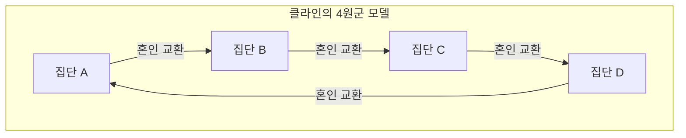

# 클로드 레비스트로스와 구조주의의 혁명: 서구 중심주의의 해체와 '야생의 사고'의 기하학

## 제1장: 실존주의의 황혼과 파리의 지적 지각변동

20세기 중반 프랑스 사상계는 장폴 사르트르를 중심으로 하는 실존주의의 강력한 자장 안에 있었다. "실존은 본질에 앞선다"는 테제를 내걸고 인간의 자유로운 주체성과 사회 참여(앙가주망)를 강조하는 사르트르의 철학은, 제2차 세계대전이라는 전대미문의 재난을 겪은 유럽의 지식인들에게 새로운 윤리와 희망의 빛을 제공하고 있었다. 그러나 이 인간 중심주의적이고 역사의 진보를 무의식적으로 전제하는 패러다임에 대해 조용히, 그러나 결정적인 지각변동을 준비하고 있던 이가 바로 클로드 레비스트로스였다.

레비스트로스의 사상적 기점에는 심각한 "위화감"이 있었다. 주체적인 의식이 모든 것을 결정할 수 있다고 하는 실존주의의 낙관성은, 그가 브라질의 마투그로수에서 목격한 원주민들의 삶이나 인류의 장대한 역사 규모에서 보면, 지극히 서구 근대적이고 국지적인 오만에 불과한 것이 아닐까. 이 직관은 그가 제2차 세계대전 중 유대계로서 박해를 피해 미국 뉴욕으로 망명하면서 이론적인 확신으로 변모하게 된다. 그곳에서 그는 러시아 형식주의의 계보를 잇는 언어학자 로만 야콥슨과 운명적인 만남을 갖는다.

야콥슨이 그에게 가져다준 것은, 페르디낭 드 소쉬르에서 비롯되어 프라하 학파(니콜라이 트루베츠코이 등)가 세련되게 발전시킨 "구조 언어학"과 "음운론"의 엄밀한 방법론이었다. 음운론은 개별 음소 자체에 의미가 있는 것이 아니라, 음소와 음소의 "차이의 체계(관계성)"야말로 의미를 생성한다는 것을 증명하고 있었다. 레비스트로스는 이 "무의식의 차원에서 기능하는 관계성의 시스템"이라는 모델이 언어뿐만 아니라 친족 관계, 신화, 의례 등 인간의 문화 전반을 해독하는 보편적인 열쇠가 될 것이라고 직감했다. 이것이 문화인류학의 영역에 구조주의가 도입된 역사적 순간이며, 주체나 의식의 특권성을 해체하는 "구조주의 혁명"의 서막이었다.

사르트르적 실존주의가 개인의 "의식"과 "자유로운 선택"을 역사 형성의 원동력으로 간주한 반면, 레비스트로스는 인간의 주체적인 선택의 이면에는 무의식 중에 작동하고 있는 확고한 "구조"가 존재한다고 주장했다. 주체는 구조에 의해 말해지고 있는 것이며, 주체가 구조를 통제하고 있는 것이 아니다. 이 패러다임의 전환은 데카르트 이후 코기토(나는 생각한다)의 우위성을 근본부터 뒤흔드는 것이었다.

## 제2장: 『친족의 기본 구조』(1949년)의 수학적 충격

1949년에 출판된 『친족의 기본 구조』는 인류학의 풍경을 일변시킨 기념비적 저작이 되었다. 레비스트로스는 여기서 전 세계의 다양한 사회에서 볼 수 있는 "인세스트(근친상간) 금기"라는 현상을, 자연과 문화를 연결하는 보편적인 메커니즘으로 재파악했다. 그때까지 인세스트 금기는 생물학적인 퇴화를 막기 위한 본능적인 것, 혹은 심리적인 혐오감에 의한 것으로 설명되는 경우가 많았다. 그러나 그는 인세스트 금기의 본질이 "누구와 결혼해서는 안 되는가"라는 소극적인 금지에 있는 것이 아니라, "자기 집단의 여성을 타 집단에 양도하고, 대신 타 집단으로부터 여성을 받아들인다"는 적극적인 "교환"의 규칙에 있음을 간파했다.

이 이론을 구축함에 있어 그가 의지한 것이 마르셀 모스의 "증여론"이다. 모스는 고대(archaic) 사회에서 선물이 "주는 의무, 받는 의무, 답례하는 의무"라는 세 가지 의무에 의해 사회적인 유대(동맹)를 형성하고 유지하는 메커니즘임을 보여주었다. 레비스트로스는 이 증여의 논리를 친족 관계(혼인)에 응용했다. 즉, 혼인이란 여성이라는 가장 가치 있는 "선물"을 패러다임으로 한 집단 간의 교환 체계이며, 이를 통해 인류는 자연의 법칙(생물학적인 혈연에만 의한 폐쇄성)에서 문화의 법칙(타자와의 열린 동맹 관계)으로 도약한 것이다.

더욱 획기적이었던 것은 레비스트로스가 이 친족 구조 분석에 현대 수학의 "군론(Group Theory)"을 도입했다는 점이다. 뉴욕 시절에 교분을 맺은 부르바키 학파의 천재 수학자 앙드레 베유의 협력을 얻어, 그는 호주 원주민 등의 지극히 복잡한 혼인 규칙(무른긴 족이나 카리에라 족의 시스템 등)이 대수학의 군(특히 "클라인의 4원군")의 구조와 완전히 동형임을 증명했다.

클라인의 4원군(Klein four-group)은 4개의 요소로 이루어지며, 임의의 요소를 두 번 작용시키면 원래대로 돌아가는 성질(대합)을 가진 가환군이다. 레비스트로스와 베유는 친족 체계에서의 혼인 규칙이 이 군의 수학적 성질에 따라 체계적으로 조직되어 있음을 보여주었다. 아래에 그 기본 구조를 Mermaid를 이용한 도식으로 나타낸다.

(※ 실제 친족 체계에서의 대칭적·비대칭적 교환, 제한 교환과 일반 교환의 메커니즘은 이 수학적 모델을 통해 비로소 통일적으로 이해되게 되었다. 특히, 일반 교환(A가 B에게 주고, B가 C에게 주고, C가 A에게 주는 순환적 시스템)이 사회 전체를 통합하는 강력한 메커니즘임이 밝혀졌다.)

베유에 의한 이 대수적 공식화의 도입은, "미개"하다고 여겨졌던 사람들의 친족 체계가 고도의 수학적 지성(그들 자신은 무의식적으로 그것을 운용하고 있다)에 의해 설계된 정교한 기하학이라는 것을 세계에 들이밀었다. 서구 학자들이 "너무 복잡해서 이해 불가능"하다고 여겼던 친족 구조는 군론이라는 렌즈를 통해 숨을 죽일 만큼 아름다운 대칭성과 논리적 정합성을 갖춘 크리스털로 그 모습을 드러낸 것이다.

## 제3장: 『슬픈 열대』(1955년)와 서구 문명의 황혼

1955년에 간행된 『슬픈 열대』는 학술적인 민족지인 동시에, 유례없는 문학적 걸작이며 철학적 성찰을 담은 책이기도 하다. "나는 여행이나 탐험가를 싫어한다"는 도발적인 첫 문장으로 시작하는 이 저작은 1930년대 브라질 내륙, 마투그로수 주에서의 필드워크 회상을 축으로 전개된다. 레비스트로스가 그곳에서 만난 이들은 카두베오 족, 보로로 족, 남비콰라 족, 투피카와이브 족 등 원주민들이었다.

카두베오 족 여성들이 얼굴에 그리는 복잡한 아라베스크 문양의 문신. 레비스트로스는 이 비대칭적이면서도 고도로 계산된 기하학적 문양 속에서 그들 사회가 안고 있는 신분 제도의 모순이나 긴장을 상징적으로 해결하려는 무의식적인 시도를 발견했다. 얼굴의 문신은 단순한 장식이 아니라 사회의 구조적 균열을 피부 위에서 조정하기 위한 "사회학적 기능"을 가진 예술이었다.

보로로 족의 촌락 구조는 더욱 극적이었다. 그들의 마을은 원형으로 배치되어 중앙의 광장과 남성 집회소를 중심으로 복잡한 씨족과 반족(모이어티)의 공간적 배치가 엄격하게 정해져 있었다. 레비스트로스는 이 마을의 물리적인 배치 자체가 그들의 우주관, 친족 관계, 신화적 질서를 시각화한 "살아있는 구조 모형"임을 해독했다. 기독교 선교사가 그들을 개종시키기 위해 가장 먼저 한 일이 "마을을 직선 형태로 다시 짓는 것"이었다는 사실은, 공간 구조의 파괴가 그들의 정신적 우주의 파괴와 직결되어 있음을 여실히 보여준다.

그리고 가장 원시적인 생활 양식을 유지하고 있던 남비콰라 족과의 교류 속에서, 레비스트로스는 "문자의 기원"에 대한 충격적인 통찰에 이른다. "문자의 교훈"이라고 불리는 유명한 일화이다. 남비콰라의 족장은 문자가 없음에도 불구하고 인류학자가 메모를 하는 흉내를 내며 종이에 물결선을 그리고 그것을 읽어주는 척함으로써 부족민들에게 자신의 권위를 과시했다. 레비스트로스는 여기서 문자는 본래 지식의 보존이나 문명의 발전을 위해서가 아니라, "인간의 인간에 대한 지배와 착취"를 용이하게 하기 위해 발명된 것이 아닐까 하는 근원적인 가설을 제시한다. 문자는 법이나 계약을 고정하고, 징세를 가능하게 하며, 계층 사회를 고착화한다. 서구가 스스로의 우위성에 대한 근거로 삼아온 "문자(에크리튀르)"가 실은 억압의 테크놀로지였다는 이 지적은 훗날 자크 데리다의 음성 중심주의 비판에도 결정적인 영향을 미쳤다.

『슬픈 열대』는 사라져 가는 다양성에 대한 깊은 애도(루소적인 향수)로 가득 차 있다. 서구의 "문명"이 전 세계의 이질적인 문화를 획일화하고, 착취하고, 파괴해 가는 과정을 그는 "엔트로피의 증가"에 비유했다. 인류학이란 이 비가역적인 엔트로피의 증가(동질화로 향하는 불가피한 발걸음)에 저항하며, 인류의 무의식에 새겨진 다양한 구조의 결정을 구출해 내는 "엔트로폴로지(entropology: 엔트로피학)"가 되어야 한다고 그는 비통한 결의를 담아 말하는 것이다.

## 제4장: 『야생의 사고』(1962년)와 브리콜라주

1962년의 『야생의 사고(La Pensée sauvage)』는 구조주의의 가장 강력한 매니페스토이며, 사르트르로 대표되는 역사주의·진보주의에 대한 결정적인 일격이 되었다. 여기서 레비스트로스는 "미개(야생)"의 사고와 "문명(과학)"의 사고라는, 오랫동안 서구를 지배해 온 우열의 위계질서를 완전히 해체한다.

그는 원주민들의 사고(야생의 사고)가 결코 비논리적이거나 전(前)논리적인 것이 아니라, 현대의 과학적 사고와 완전히 동등하고 엄밀한 지성임을 증명했다. 그 차이는 지적 능력의 우열이 아니라, "지식의 대상에 접근하는 방식의 차이"에 불과하다. 야생의 사고는 추상적인 개념이나 보편적인 법칙을 추출해 내는 "엔지니어(기술자)"의 사고가 아니라, 수중에 있는 제한된 구체적 소재(신화의 단편, 동식물의 분류, 의례의 요소 등)를 긁어모으고, 재구성하여, 새로운 의미 체계를 구축하는 "브리콜라주(일요 목수, 손재주)"의 논리에 의해 구동된다.

브리콜뢰르(손재주꾼)는 특정 목적을 위해 특화된 도구나 소재를 갖지 않는다. 그들은 "수중에 있는 도구"를 이용하여 즉흥적으로 세계의 질서를 조립한다. 이 브리콜라주의 지성이야말로 전 세계의 신화나 주술, 그리고 토테미즘의 놀라운 풍요로움과 논리적 정합성을 낳아 온 원천이다.

특히 토테미즘 분석에 있어서 레비스트로스는 기능주의 인류학자(말리노프스키 등)의 "어떤 동물이 토템으로 선택되는 것은 그것이 식용으로 유용하기 때문이다(먹기 좋기 때문이다)"라는 공리주의적 해석을 통쾌하게 물리쳤다. 그는 말한다, "동물은 먹기에 좋아서 선택되는 것이 아니다, 생각하기에 좋기(bon à penser) 때문에 선택되는 것이다." 특정 동식물의 차이(예를 들어 "독수리와 곰", "하늘의 동물과 땅의 동물")가 인간 사회집단 간의 차이(씨족 A와 씨족 B의 관계)를 표현하기 위한 "개념의 도구"로 쓰이고 있는 것이다. 자연계의 이항 대립이 문화계의 이항 대립의 메타포로 기능하는 이 시스템은 그야말로 구조주의 언어학의 "차이에 의한 의미 생성"의 완벽한 실천이었다.

이 책의 마지막 장 "역사와 변증법"에서 레비스트로스는 사르트르의 대저 『변증법적 이성 비판』에 가차 없는 비판의 칼날을 겨눈다. 사르트르는 역사를 절대적인 진리의 전개 과정으로 삼고 서구 근대 사회(역사를 가진 사회)를 특권화했다. 그러나 레비스트로스에게 사르트르의 "역사"란 서구 지식인이 자신의 정체성을 정당화하기 위해 날조한 현대의 신화에 불과하다. 문자와 역사를 가지지 않은 "차가운 사회(자신의 구조를 변화시키지 않고 유지하려는 사회)"와 끊임없는 변화와 진보를 추구하는 "뜨거운 사회(서구 근대)" 사이에는 본질적인 우열 따위는 존재하지 않는다. 이 통렬한 사르트르 비판은 프랑스 사상계의 패권이 실존주의에서 구조주의로 완전히 이행했음을 알리는 역사적 선고가 되었다.

## 제5장: 『신화학』(총 4권)과 캐니그래피: 신화의 기하학과 정준 방정식

레비스트로스의 학문적 탐구의 정점을 이루는 것은 1964년부터 1971년에 걸쳐 간행된 총 4권으로 이루어진 거대한 저작 『신화학(Mythologiques)』이다. 제1권 『날것과 익힌 것』, 제2권 『꿀에서 재로』, 제3권 『식사 예절의 기원』, 제4권 『벌거벗은 인간』으로 이루어진 이 초대작은 남북 아메리카 대륙에 산재하는 800개 이상의 원주민 신화군을 수집하여, 그것들이 단순한 무작위적 이야기의 집적이 아니라 하나의 거대한 "변환의 시스템"을 구성하고 있음을 실증했다.

신화는 언뜻 보기에는 황당무계하고 비논리적이며 환상의 산물인 것처럼 보인다. 그러나 레비스트로스는 신화의 심층에는 엄밀한 대수적 구조가 잠재해 있음을 간파했다. 개별 신화는 고립되어 존재하는 것이 아니라 다른 신화를 반전시키거나 요소를 치환함으로써 생성된다. 어떤 부족에서 "태양"과 "물"의 대립으로 전해진 신화가 이웃 부족에서는 "재규어"와 "인간"의 대립으로 치환되고, 더 멀리 떨어진 부족에서는 "날고기(자연)"와 "익힌 고기(문화)"의 대립으로 변용된다. 이러한 변주들은 모두 공통의 무의식적 구조의 "변환(transformation)"으로 설명 가능한 것이다.

이 신화의 변환 메커니즘을 공식화한 것이 유명한 "정준 방정식(Canonical Formula)"이다. 레비스트로스는 신화의 구조를 다음의 수식 모델을 통해 표현했다.

$F_x(A) : F_y(B) \simeq F_x(B) : F_{a^{-1}}(y)$

이 방정식은 단순한 비유가 아니라 신화의 논리적 변환을 지극히 엄밀하게 기술하는 대수 모델이다.
여기서 A와 B는 "항(termes)"이며, x와 y는 그러한 항이 가지는 "기능(fonctions)" 혹은 속성을 나타낸다.
식의 좌변 $F_x(A) : F_y(B)$ 는 "기능 x를 띤 항 A"와 "기능 y를 띤 항 B"의 관계를 보여준다.
이것이 우변 $F_x(B) : F_{a^{-1}}(y)$ 로 변환된다. 우변에서는 항 B가 기능 x를 이어받는 한편, 극적인 변화가 일어난다. 원래의 항 A가 그 극성을 반전시키며($a^{-1}$), 기능이었을 y가 항의 위치로 올라서는 것이다. 이를 "이중의 비틀림(double twist)"이라 부른다.

구체적인 예로, 레비스트로스가 『질투하는 토기장이』 등에서 언급한 신화의 구조적 변환을 생각해 보자.
어떤 신화(좌변)에서는 "하늘(x)에 속한 독수리(A)"와 "대지(y)에 속한 곰(B)"이 대립하고 있다고 치자. 이것이 다른 신화(우변)로 변환될 때 단순히 캐릭터가 교체되는 것이 아니다. "하늘(x)에 속한 곰(B)"이 등장하고, 대항하는 요소로 "대지(y) 자체가 의인화된 신"이 나타나며, 원래의 "독수리(A)"는 "지하 세계의 영($a^{-1}$, 하늘의 반전)"으로 격하되는 식의 구조적인 비틀림이 발생한다. 기능이 항으로, 항이 반전하여 기능으로 전화하는 뫼비우스의 띠 같은 위상 기하학적 변환이 남북 아메리카 대륙의 신화 연쇄 속에서 무한히 반복되고 있는 것이다.

레비스트로스는 이 분석을 통해 신화에는 특정한 "기원"이나 "원저자"가 존재하지 않음을 증명했다. 신화는 인간이 말하는 것이 아니다. "신화가 인간의 무의식을 통해 신화 스스로를 말하는" 것이다. 인간의 뇌(지성)는 자연계의 감각적 데이터(날 것, 익힌 것, 썩은 것 등)를 입력값으로 받아 이 정준 방정식과 같은 변환 알고리즘을 이용해 문화적인 질서(친족, 요리, 의례의 규칙)를 출력하는 거대한 정보처리장치(계산기)로서 기능하고 있다.

더욱이 『신화학』의 특기할 만한 점은 그 전체 구성이 "음악의 구조"에 깊이 의존하고 있다는 것이다. 제1권의 서문에서 레비스트로스는 리하르트 바그너를 "구조 분석의 비할 데 없는 선구자"로 칭송하며, 자신의 저작을 교향곡이나 소나타 형식, 푸가의 유추로 구성했다. 신화와 음악은 모두 언어와 달리 "번역 불가능"한 시간적 구조를 가진다. 음악의 라이트모티프(시도동기)가 화성이나 대위법 속에서 변주되고 반전하며 겹쳐지듯, 신화의 제 요소들(뮈템: 신화소) 역시 통시적인 이야기의 진행(멜로디)과 공시적인 구조의 겹침(하모니) 속에서 오케스트라처럼 울려 퍼진다.

그는 바흐의 푸가나 라벨의 볼레로 구조를 예로 들면서, 신화의 이항 대립이 어떻게 화음을 형성하고 불협화음을 해결해 가는가를 치밀하게 분석했다. 신화 공간이란 거대한 "캐니그래피(Canyon/Music/Myth)", 즉 계곡의 지층처럼 겹겹이 쌓인 신화소와 음악의 폴리포니가 교차하는 장대한 다차원 공간인 것이다. 수학적 방정식과 음악적 폴리포니라는 서구 이성의 최고봉으로 여겨지던 형식이 실은 "야생의 사고"의 심층에서 이미 완벽한 형태로 구동되고 있었다는 발견은 서구 중심주의의 오만을 근본부터 분쇄하는 것이었다.

## 보유(補遺): 신화의 구조 분석에서의 두 가지 거대한 랜드마크 (실천적 케이스 스터디)

레비스트로스의 이론이 어떻게 구체적인 신화 텍스트를 해부하고 그 속에 잠재된 대수적 구조를 드러냈는가. 그 실천적 진면목을 이해하기 위해 그의 대표적인 두 가지 케이스 스터디를 여기서 상세히 추적해 본다. 이 분석은 구조주의가 단순한 추상적인 철학이 아니라 텍스트에 대한 지극히 정밀한 "외과 수술"임을 여실히 보여준다.

### 케이스 스터디 1: 오이디푸스 신화의 구조 분석

레비스트로스가 『구조인류학』(1958년) 속에서 전개한 "오이디푸스 신화"의 분석은 신화 분석의 패러다임을 결정적으로 바꾸어 놓았다. 프로이트에 의해 "근친상간의 욕망(오이디푸스 콤플렉스)"이라는 심리학적 틀로 남김없이 해석된 것처럼 보였던 이 그리스 신화에 대해, 그는 완전히 다른 접근법을 취했다. 그는 신화를 시간 축을 따른 "이야기(통시적 진행)"로 읽는 것이 아니라, 오케스트라의 총보(스코어)처럼 "공시적인 묶음(하모니)"으로 해독한 것이다.

그는 오이디푸스 신화의 모든 파편(뮈템: 신화소)을 추출하고, 그것들을 4개의 수직 기둥(카테고리)으로 분류했다.
제1기둥은 "혈연 관계의 과대평가"를 보여주는 요소이다. 카드모스가 여동생 에우로페를 찾아 헤매는 것, 오이디푸스가 어머니 이오카스테와 결혼하는 것, 안티고네가 금기를 깨고 오빠 폴리네이케스를 매장하는 것 등이다.
제2기둥은 반대로 "혈연 관계의 과소평가(적대)"를 보여주는 요소이다. 오이디푸스가 아버지 라이오스를 죽이는 것, 형제인 에테오클레스와 폴리네이케스가 서로 죽이는 것이다.
제3기둥은 "괴물(대지에서 태어난 토착의 존재)의 퇴치"를 보여주는 요소이다. 카드모스가 용을 물리치는 것, 오이디푸스가 스핑크스를 물리치는 것.
제4기둥은 "보행의 어려움(신체적 결함)"을 보여주는 요소이다. 라이오스(왼손잡이·서투름), 랍다코스(절름발이), 오이디푸스(부은 발)와 같은 이름이나 신체적 특징이다.

여기서 레비스트로스가 이끌어낸 논리는 놀라운 것이다. 제1기둥과 제2기둥의 관계(혈연의 과대평가:과소평가)는 제3기둥과 제4기둥의 관계(자생성의 부정:자생성의 긍정)와 완전히 평행을 이루고 있다. "대지에서 태어난 괴물(인간의 토착성의 상징)"을 죽이는 것은 인간이 대지에서 태어났다는 신앙을 부정하는 것(자연으로부터의 이탈)을 의미한다. 그러나 보행의 어려움(땅에 발이 끌리는 것)은 여전히 인간이 대지에 얽매여 있다는 것(토착성)을 의미하고 있다.
즉, 오이디푸스 신화는 "인간은 남녀의 결합에서 태어나는가(문화·생물학적 현실), 아니면 대지에서 단성생식적으로 태어나는가(자연·신화적 신앙)"라는 고대 그리스 사회가 안고 있던 근원적인 모순(아포리아)을 논리적으로 조정하려는 거대한 연산 장치였던 것이다. 프로이트의 심리학적 해석조차도 레비스트로스에게는 오이디푸스 신화의 "최신 변주(변환 형태)" 중 하나에 불과하다.

### 케이스 스터디 2: "아스디왈 행전"의 다층적 공간 구조

또 하나의 지극히 중요한 분석이 북미 태평양 연안 북서부의 침시안(Tsimshian) 족에게 전해지는 "아스디왈 행전(La Geste d'Asdiwal)"의 구조 분석이다(1958년). 이 논문은 레비스트로스의 신화 분석에 있어 가장 완성된 결정체 중 하나로 평가받는다.

아스디왈이라는 영웅의 방랑과 결혼을 둘러싼 이 장대한 신화에서, 레비스트로스는 이야기가 지리적, 경제적, 사회학적, 우주론적이라는 4가지의 상이한 차원에서 동시에 전개되고 있음을 치밀하게 해독했다.
지리적 차원에서 아스디왈은 동에서 서로, 남에서 북으로 이동한다. 경제적 차원에서는 기근의 겨울에서 시작하여 연어가 거슬러 올라오는 봄, 그리고 수렵의 여름으로 계절이 이행한다. 사회학적 차원에서 그는 모거제(母居制) 혼인과 부거제(父居制) 혼인 사이를 오간다. 우주론적 차원에서는 천상계(별의 백성)의 아내와 지하 세계(바다의 백성)의 아내 사이에서 찢겨진다.

아스디왈의 비극적인 결말(돌이 되어 산꼭대기에 갇힌다)은 침시안 족의 사회가 실제로 안고 있던 "모계제 사회에서의 부거제"라는 해결 불가능한 구조적 모순을 반영하고 있다. 현실의 사회에서 해결할 수 없는 모순이 신화라는 상상적 차원에서 극한까지 밀어붙여져 자기 붕괴해 가는 모습을 그림으로써, 역설적으로 현실의 사회 제도의 정당성을 담보하고 있는 것이다.
이로써 신화는 더 이상 현실의 단순한 "반영"이나 "모사"가 아니다. 신화는 현실의 사회 구조가 품은 균열이나 왜곡을 상징적인 차원에서 실험하고 시뮬레이션하기 위한 "가상 현실(VR)의 실험실"로서 기능하고 있다. 신화 속에서 이항 대립이 극한까지 확대되어 해결 불가능해져서 파탄에 이를 때, 사람들의 마음속에는 "역시 현실의 사회 제도(타협의 산물) 쪽이 나은 것이다"라는 무의식적인 안도감이 초래된다.

이러한 분석에서 분명해지듯이 구조주의의 신화학이란 요소로의 환원이 아니라 요소 간의 "관계성의 그물망(네트워크)"을 복원하는 작업이다. 그것은 대상을 미세하게 분할하는 데카르트적인 해석기하학이 아니라, 형태가 변화해도 보존되는 성질을 탐구하는 토폴로지(위상수학)의 시도였다. 오이디푸스의 부은 발도, 아스디왈의 석화된 신체도 단순한 이야기의 장식이 아니라 인간의 사회와 우주의 관계를 기술하기 위한 지극히 엄밀한 수학적 함수(파라미터)였던 것이다.

(※ 이 중층적인 분석 수법은 훗날 문학 이론(서사학·나라톨로지)에서 롤랑 바르트나 알지다스 쥘리앵 그레마스 등에게 이어져 텍스트 분석의 불가결한 기초 언어가 되었다. 레비스트로스가 신화 속에서 발견한 이 "야생의 기하학"은 20세기 후반의 지식의 풍경을 결정적으로, 그리고 비가역적으로 바꾸어 놓은 것이다.)

## 제6장: 포스트 구조주의로의 접속과 현대로의 유산: 구조론적 무의식과 AI의 미래

레비스트로스가 『친족의 기본 구조』나 『야생의 사고』에서 확립한 구조주의의 패러다임은 1960년대 이후 프랑스 현대 사상에 결정적인 폭풍을 불러일으켰다. "주체", "의식", "역사"의 특권성을 박탈하고, 그 이면에서 은밀히 작동하는 "무의식의 구조"를 전경화시킨 그의 수법은 즉각 다른 학문 영역으로 전파되어 갔다.

자크 라캉은 레비스트로스의 친족 구조 교환 이론과 소쉬르의 언어학을 정신분석에 도입하여, "무의식은 언어처럼 구조화되어 있다"는 유명한 테제를 세웠다. 자아(에고)를 중심으로 하는 미국의 자아심리학을 통렬히 비판하고 프로이트의 무의식을 상징계(언어 질서)의 네트워크로 재정의한 라캉의 시도는 레비스트로스의 대수학적 접근 없이는 불가능했다.
미셸 푸코는 『말과 사물』에서 각 시대(에피스테메)의 앎을 규정하는 무의식의 틀을 고고학적으로 발굴하여 "인간의 종언"(모래사장에 그려진 얼굴이 파도에 씻겨 지워지듯이 근대적인 '주체'라는 개념이 소멸해 가는 것)을 선언했다. 이것 또한 레비스트로스가 『슬픈 열대』의 말미에서 인류학을 "엔트로폴로지"로 정의하며 인간의 의식적 기도의 무력함을 설파한 것에 대한 사상적 변주이다.
더욱이 자크 데리다는 구조주의가 전제로 하는 "중심"이나 "절대적인 기원"의 존재를 해체하여 포스트 구조주의의 문을 열었다. 그러나 데리다의 음성 중심주의 비판이 레비스트로스의 남비콰라 족의 "문자의 교훈"에 대한 예리한 비판적 독해에서 출발하고 있다는 점은 기억되어야 한다. 레비스트로스의 구조주의는 스스로를 넘어서려는 포스트 구조주의 사상가들에게 있어서도 회피할 수 없는 거대한 디딤돌이었다.

말년의 레비스트로스는 급속히 진행되는 세계화 속에서 문화 다양성의 상실에 대해 강한 경종을 계속 울렸다. 그는 인류의 문화라는 것은 타자와의 차이가 존재하는 것(적당한 거리와 격리)을 통해서만 풍요로움을 유지할 수 있다고 생각했다. 과도한 커뮤니케이션과 동질화는 문화의 창조적 활력을 빼앗고 궁극적으로는 인류 전체의 엔트로피적 죽음(열적 죽음)을 초래한다. 이 사상은 현대에서의 "생물 다양성"과 "문화 다양성"의 불가분성을 선취한 지극히 생태학적인 비전이었다. 자연(환경)과 문화(인간)를 대립하는 것으로 간주하는 데카르트적 이원론을 극복하고, 애니미즘이나 토테미즘의 시좌에서 "자연계에 내재하는 지성"을 재평가하는 오늘날의 존재론적 전회(에두아르두 비베이루스 디 카스트루의 다자연주의 등)도 그의 이론의 정통 후계자이다.

나아가 현대의 컴퓨터 과학, 특히 인공지능(AI)의 급속한 발전은 레비스트로스의 구조주의에 새로운 빛을 비추고 있다. 대규모 언어 모델(LLM)이나 딥러닝이 거대한 텍스트 데이터의 네트워크 속에 잠재된 "관계성의 패턴(벡터 공간 상의 차이와 거리)"을 연산 처리하여 거기서부터 의미나 논리를 생성해 내는 메커니즘은, 바로 레비스트로스가 예견한 "신화의 변환 알고리즘" 그 자체이다. AI는 의미를 "이해"하고 있는 것이 아니라 언어 기호의 거대한 구조적 매트릭스(다차원 공간에서의 계열체와 통합체의 연쇄)를 확률론적·대수학적으로 연산하고 있을 뿐이다. 그러나 거기서 출력되는 것이 인간의 눈에는 고도의 "지능"이나 "이야기"로 비친다.
이것은 "신화가 인간의 무의식을 통해 스스로를 말한다"는 레비스트로스의 테제가 실리콘 칩과 신경망 위에서 물리적으로 구현된 사태에 다름 아니다. 주체의 의식이나 의도를 개입시키지 않고도 기호의 차이적 관계망(구조)이 자율적으로 의미 체계를 엮어간다는 구조주의의 근본 원리는, 역설적이게도 현대의 AI 기술에 의해 가장 순수한 형태로 증명되어 가고 있는 것이다.

### 결론: 차가운 수정의 광채

클로드 레비스트로스가 남긴 방대한 텍스트는 열광적인 실존주의의 시대에 던져진 차가운 수정이었다. 그는 인간이 아무리 자유를 부르짖더라도 우리의 사고는 항상 언어나 친족 규칙, 신화라는 선험적인 구조의 제약 아래 있음을 냉철하게 증명했다. 그러나 그것은 결코 절망의 철학이 아니다. 그가 아마존 숲속 깊은 곳이나 원주민 신화의 무한한 변주 속에서 발견한 것은, 특정 엘리트나 "문명사회"의 전유물이 아닌 전 인류에게 평등하게 갖춰진 보편적이고 정교한 지성의 광채였다.

서구 근대의 오만한 휴머니즘을 해체하고 "야생의 사고"의 기하학적인 아름다움을 세계에 제시한 그의 위업은, 인간 중심주의가 환경 위기나 AI의 대두로 인해 근저에서부터 흔들리고 있는 21세기 오늘날에 이르러서야 가장 진지하게 다시 읽혀야 할 현실성(액추얼리티)을 발하고 있다. "세계는 인간 없이 시작되었고, 인간 없이 끝날 것이다" —— 『슬픈 열대』의 이 애절한 예언은 우리에게 절망이 아니라 우주의 장대한 구조 속에서 인간의 진정한 분수를 가르쳐 주는 심오한 윤리의 울림을 가지고 있는 것이다.
