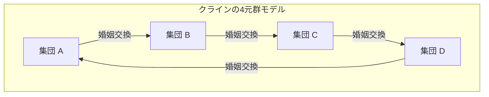

# クロード・レヴィ＝ストロースと構造主義の革命：西洋中心主義の解体と「野生の思考」の幾何学

## 第1章：実存主義の黄昏とパリの知的地殻変動

20世紀中葉のフランス思想界は、ジャン＝ポール・サルトルを中心とする実存主義の強力な磁場の中にあった。「実存は本質に先立つ」というテーゼを掲げ、人間の自由な主体性と社会参加（アンガージュマン）を強調するサルトルの哲学は、第二次世界大戦という未曾有の災禍をくぐり抜けたヨーロッパの知識人たちに、新たな倫理と希望の光を提供していた。しかし、この人間中心主義的で歴史の進歩を無意識に前提とするパラダイムに対し、静かに、しかし決定的な地殻変動をもたらす準備を進めていたのがクロード・レヴィ＝ストロースであった。

レヴィ＝ストロースの思想的起点には、深刻な「違和感」があった。主体的な意識が全てを決定できるとする実存主義の楽観性は、彼がブラジルのマトグロッソで目撃した先住民たちの生や、人類の壮大な歴史のスケールから見れば、極めて西欧近代的で局所的な思い上がりに過ぎないのではないか。この直感は、彼が第二次世界大戦中にユダヤ系として迫害を逃れ、アメリカ・ニューヨークに亡命したことで理論的な確信へと変貌を遂げる。そこで彼は、ロシア・フォルマリズムの系譜を引く言語学者ロマン・ヤコブソンと運命的な出会いを果たす。

ヤコブソンが彼にもたらしたのは、フェルディナン・ド・ソシュールに端を発し、プラハ学派（ニコライ・トルベツコイら）が洗練させた「構造言語学」および「音韻論」の厳密な方法論であった。音韻論は、個々の音素そのものに意味があるのではなく、音素と音素の「差異の体系（関係性）」こそが意味を生成することを証明していた。レヴィ＝ストロースは、この「無意識のレベルで機能する関係性のシステム」というモデルが、言語のみならず、親族関係、神話、儀礼など、人間の文化全般を解読する普遍的な鍵になると直感した。これが、文化人類学の領域に構造主義が導入された歴史的瞬間であり、主体や意識の特権性を解体する「構造主義革命」の幕開けであった。

サルトル的実存主義が個人の「意識」と「自由な選択」を歴史形成の原動力と見なしたのに対し、レヴィ＝ストロースは、人間の主体的な選択の背後には、無意識のうちに作動している強固な「構造」が存在すると主張した。主体は構造によって語られているのであり、主体が構造をコントロールしているわけではない。このパラダイムシフトは、デカルト以来のコギト（我思う）の優位性を根底から揺るがすものであった。

## 第2章：『親族の基本構造』（1949年）の数学的衝撃

1949年に出版された『親族の基本構造』は、人類学の風景を一変させる記念碑的著作となった。レヴィ＝ストロースはここで、世界中の様々な社会に見られる「インセスト（近親相姦）禁忌」という現象を、自然と文化を架橋する普遍的なメカニズムとして捉え直した。それまで、インセスト禁忌は生物学的な退化を防ぐための本能的なもの、あるいは心理的な嫌悪感によるものと説明されることが多かった。しかし彼は、インセスト禁忌の本質は「誰と結婚してはならないか」という消極的な禁止にあるのではなく、「自己の集団の女性を他集団に譲渡し、代わりに他集団から女性を受け取る」という積極的な「交換」のルールにあると看破した。

この理論の構築にあたり、彼が依拠したのがマルセル・モースの「贈与論」である。モースは、アルカイックな社会において、贈り物は「贈る義務、受け取る義務、お返しをする義務」という三つの義務によって社会的な絆（アライアンス）を形成・維持するメカニズムであることを示していた。レヴィ＝ストロースは、この贈与の論理を親族関係（婚姻）に応用した。すなわち、婚姻とは女性という最も価値のある「贈り物」をパラダイムとした集団間の交換体系であり、これによって人類は自然の掟（生物学的な血縁のみによる閉鎖性）から文化の掟（他者との開かれた同盟関係）へと飛躍したのである。

さらに画期的だったのは、レヴィ＝ストロースがこの親族構造の分析に現代数学の「群論」を導入したことである。ニューヨーク時代に親交を結んだブルバキ派の天才数学者アンドレ・ヴェイユの協力を得て、彼はオーストラリア先住民などの極めて複雑な婚姻規則（ムルンギン族やカリエラ族のシステムなど）が、代数学における群（とりわけ「クラインの4元群」）の構造と完全に同型であることを証明した。

クラインの4元群（Klein four-group）は、4つの要素からなり、任意の要素を2回作用させると元に戻るという性質（対合）を持つ可換群である。レヴィ＝ストロースとヴェイユは、親族体系における婚姻の規則が、この群の数学的性質に従って体系的に組織されていることを示した。以下にその基本構造をMermaidを用いた図式で示す。

（※実際の親族体系における対称的・非対称的交換、限定交換と一般交換のメカニズムは、この数学的モデルによって初めて統一的に理解されることとなった。特に、一般交換（AがBに与え、BがCに与え、CがAに与えるという循環的システム）が、社会全体を統合する強力なメカニズムであることが明らかになった。）

このヴェイユによる代数的定式化の導入は、「未開」と見なされていた人々の親族体系が、高度な数学的知性（彼ら自身は無意識的にそれを運用している）によって設計された精緻な幾何学であることを世界に突きつけた。西洋の学者たちが「複雑すぎて理解不能」としていた親族構造は、群論というレンズを通すことで、息を呑むほど美しい対称性と論理的整合性を備えたクリスタルとして姿を現したのである。
## 第3章：『悲しき熱帯』（1955年）と西洋文明の黄昏

1955年に刊行された『悲しき熱帯』は、学術的な民族誌であると同時に、類い稀なる文学的傑作であり、哲学的省察の書でもある。「私は旅や探検家が嫌いだ」という挑発的な書き出しで始まるこの著作は、1930年代のブラジル内陸部、マトグロッソ州でのフィールドワークの回想を軸に展開される。レヴィ＝ストロースがそこで出会ったのは、カデュヴェオ族、ボロロ族、ナンビクワラ族、トゥピ＝カヴァヒブ族といった先住民たちであった。

カデュヴェオ族の女性たちが顔に施す複雑なアラベスク模様のタトゥー。レヴィ＝ストロースは、この非対称でありながら高度に計算された幾何学的文様の中に、彼らの社会が抱える身分制度の矛盾や緊張を象徴的に解決しようとする無意識の試みを見出した。顔のタトゥーは単なる装飾ではなく、社会の構造的亀裂を皮膚の上で調停するための「社会学的機能」を持った芸術であった。

ボロロ族の村落構造はさらに劇的であった。彼らの村は円形に配置され、中央の広場と男性集会所を中心に、複雑な氏族と半族（モエティ）の空間的配置が厳密に定められていた。レヴィ＝ストロースは、この村の物理的な配置そのものが、彼らの宇宙観、親族関係、神話的秩序を可視化した「生きた構造模型」であることを解読した。キリスト教の宣教師が彼らを改宗させるために最初に行ったのが「村を直線状に作り変えること」であったという事実は、空間構造の破壊が彼らの精神宇宙の破壊に直結していることを如実に物語っている。

そして最もプリミティブな生活様式を保っていたナンビクワラ族との交流の中で、レヴィ＝ストロースは「文字の起源」について衝撃的な洞察に至る。「文字の教訓」と呼ばれる有名な挿話である。ナンビクワラの首長は、文字を持たないにもかかわらず、人類学者がメモを取る真似をして紙に波線を書き、それを読み上げるふりをすることで、部族民に対して自らの権威を誇示した。レヴィ＝ストロースはここから、文字というものが本来、知識の保存や文明の発展のためではなく、「人間の人間に対する支配と搾取」を容易にするために発明されたのではないかという根源的な仮説を提示する。文字は法や契約を固定し、徴税を可能にし、階層社会を固定化する。西洋が自らの優位性の根拠としてきた「文字（エクリチュール）」が、実は抑圧のテクノロジーであったというこの指摘は、後にジャック・デリダの音声中心主義批判にも決定的な影響を与えた。

『悲しき熱帯』は、失われゆく多様性への深い哀悼（ルソー的なノスタルジア）に満ちている。西洋の「文明」が、世界中の異質な文化を画一化し、搾取し、破壊していく過程を、彼は「エントロピーの増大」になぞらえた。人類学とは、この不可逆的なエントロピーの増大（均質化への不可避の歩み）に抗い、人類の無意識に刻まれた多様な構造の結晶を救い出す「エントロポロジー（entropology：エントロピー学）」であるべきだと彼は悲痛な決意を込めて語るのである。

## 第4章：『野生の思考』（1962年）とブリコラージュ

1962年の『野生の思考（La Pensée sauvage）』は、構造主義の最も強力なマニフェストであり、サルトルに代表される歴史主義・進歩主義に対する決定的な一撃となった。ここでレヴィ＝ストロースは、「未開（野生）」の思考と「文明（科学）」の思考という、長らく西洋を支配してきた優劣のヒエラルキーを完全に解体する。

彼は、先住民たちの思考（野生の思考）が決して非論理的や前論理的なものではなく、現代の科学的思考と全く同等の厳密な知性であることを証明した。その差異は知的能力の優劣ではなく、「知の対象へのアプローチの違い」に過ぎない。野生の思考は、抽象的な概念や普遍的な法則を抽出する「エンジニア（技術者）」の思考ではなく、手元にある限られた具体的素材（神話の断片、動植物の分類、儀礼の要素など）を寄せ集め、再構成し、新たな意味体系を構築する「ブリコラージュ（日曜大工・器用仕事）」の論理によって駆動している。

ブリコルール（器用人）は、特定の目的のために特化された道具や素材を持たない。彼らは「ありあわせの道具」を用いて、即興的に世界の秩序を組み立てる。このブリコラージュの知性こそが、世界中の神話や呪術、そしてトーテミズムの驚くべき豊穣さと論理的整合性を生み出してきた源泉である。

とりわけトーテミズムの分析において、レヴィ＝ストロースは機能主義人類学者（マリノフスキーら）の「ある動物がトーテムに選ばれるのは、それが食用として有用だからだ（食べるのに良いからだ）」という功利主義的解釈を鮮やかに退けた。彼は言う、「動物は食べるのに良いから選ばれるのではない、考えるのに良い（bon à penser）から選ばれるのだ」。特定の動植物の差異（例えば「鷲と熊」「空の動物と地の動物」）が、人間の社会集団間の差異（氏族Aと氏族Bの関係）を表現するための「概念の道具」として用いられているのである。自然界の二項対立が、文化界の二項対立のメタファーとして機能するこのシステムは、まさに構造主義言語学の「差異による意味生成」の完璧な実践であった。

本書の最終章「歴史と弁証法」において、レヴィ＝ストロースはサルトルの大著『弁証法的理性批判』に容赦ない批判の刃を向ける。サルトルは歴史を絶対的な真理の展開プロセスとし、西欧の近代社会（歴史を持つ社会）を特権化した。しかしレヴィ＝ストロースに言わせれば、サルトルの「歴史」とは、西欧の知識人が自らのアイデンティティを正当化するために捏造した現代の神話に過ぎない。文字と歴史を持たない「冷たい社会（自己の構造を変化させずに維持しようとする社会）」と、絶え間ない変化と進歩を追求する「熱い社会（西欧近代）」の間には、本質的な優劣など存在しない。この痛烈なサルトル批判は、フランス思想界の覇権が実存主義から構造主義へと完全に移行したことを告げる歴史的宣告となった。
## 第5章：『神話論理』（全4巻）とカニグラフィ：神話の幾何学と正準方程式

レヴィ＝ストロースの学問的探求の頂点をなすのが、1964年から1971年にかけて刊行された全4巻からなる巨大な著作『神話論理（Mythologiques）』である。第一巻『生のものと火を通したもの』、第二巻『蜜から灰へ』、第三巻『食卓作法への起源』、第四巻『裸の人』からなるこの超大作は、南北アメリカ大陸に散在する800以上の先住民神話群を収集し、それらが単なる無作為の物語の集積ではなく、一つの巨大な「変換のシステム」を構成していることを実証した。

神話は一見すると荒唐無稽で非論理的、幻想の産物であるかのように見える。しかしレヴィ＝ストロースは、神話の深層には厳密な代数的構造が潜んでいることを看破した。個々の神話は孤立して存在するのではなく、他の神話を反転させたり、要素を置換したりすることで生成される。ある部族で「太陽」と「水」の対立として語られた神話が、隣の部族では「ジャガー」と「人間」の対立に置換され、さらに遠く離れた部族では「生肉（自然）」と「火を通した肉（文化）」の対立へと変容する。これらのバリエーションはすべて、共通の無意識的構造の「変換（transformation）」として説明可能なのである。

この神話の変換メカニズムを定式化したのが、有名な「正準方程式（Canonical Formula）」である。レヴィ＝ストロースは、神話の構造を以下の数式モデルによって表現した。

$F_x(A) : F_y(B) \simeq F_x(B) : F_{a^{-1}}(y)$

この方程式は、単なる比喩ではなく、神話の論理的変換を極めて厳密に記述する代数モデルである。
ここで、AとBは「項（termes）」であり、xとyはそれらの項が持つ「機能（fonctions）」あるいは属性を表す。
式の左辺 $F_x(A) : F_y(B)$ は、「機能xを帯びた項A」と「機能yを帯びた項B」の関係を示す。
これが右辺 $F_x(B) : F_{a^{-1}}(y)$ へと変換される。右辺では、項Bが機能xを引き継ぐ一方で、劇的な変化が起きる。元々の項Aがその極性を反転させ（$a^{-1}$）、機能であったはずのyが項の位置に繰り上がるのである。これを「二重の捩れ（double twist）」と呼ぶ。

具体例として、レヴィ＝ストロースが『嫉妬深い土器作り』などで言及した神話の構造的変換を考えてみよう。
ある神話（左辺）では、「天空（x）に属する鷲（A）」と「大地（y）に属する熊（B）」が対立しているとする。これが別の神話（右辺）に変換される際、単にキャラクターが入れ替わるのではない。「天空（x）に属する熊（B）」が登場し、対抗する要素として「大地（y）そのものが擬人化された神」が現れ、元の「鷲（A）」は「地下世界の霊（$a^{-1}$、天空の反転）」に格下げされる、といった構造的な捻れが生じる。機能が項に、項が反転して機能に転化するというメビウスの帯のような位相幾何学的変換が、南北アメリカ大陸の神話の連鎖の中で無限に繰り返されているのである。

レヴィ＝ストロースはこの分析を通じて、神話には特定の「起源」や「原著作者」が存在しないことを証明した。神話は人間が語るのではない。「神話が、人間の無意識を通じて、神話自身を語る」のである。人間の脳（知性）は、自然界の感覚的データ（生、火を通した、腐敗した、など）を入力とし、この正準方程式のような変換アルゴリズムを用いて、文化的な秩序（親族、料理、儀礼のルール）を出力する巨大な情報処理装置（計算機）として機能している。

さらに『神話論理』の特筆すべき点は、その全体構成が「音楽の構造」に深く依拠していることである。第一巻の序文でレヴィ＝ストロースは、リヒャルト・ワーグナーを「構造分析の比類なき先駆者」として讃え、自らの著作を交響曲やソナタ形式、フーガのアナロジーで構成した。神話と音楽はともに、言語と異なり「翻訳不可能」な時間的構造を持つ。音楽のライトモティーフ（示導動機）が、和声や対位法の中で変奏され、反転し、重なり合うように、神話の諸要素（ミュテーマ：神話素）もまた、通時的な物語の進行（メロディ）と共時的な構造の重なり（ハーモニー）の中でオーケストラのように響き合う。

彼はバッハのフーガやラヴェルのボレロの構造を引き合いに出しつつ、神話の二項対立がどのように和音を形成し、不協和音を解決していくかを緻密に分析した。神話空間とは、巨大な「キャニオングラフィ（Canyon/Music/Myth）」、すなわち渓谷の地層のように重なり合う神話素と、音楽のポリフォニーが交差する壮大な多次元空間なのである。数学的方程式と音楽的ポリフォニーという、西欧理性の最高峰と見なされていた形式が、実は「野生の思考」の深層ですでに完璧な形で駆動していたという発見は、西欧中心主義の傲慢を根本から粉砕するものであった。
## 補遺：神話の構造分析における二つの巨大なランドマーク（実践的ケーススタディ）

レヴィ＝ストロースの理論がいかにして具体的な神話テクストを解剖し、そこに潜む代数的構造を炙り出したのか。その実践的真骨頂を理解するために、彼の代表的な二つのケーススタディをここで詳細にトレースする。この分析は、構造主義が単なる抽象的な哲学ではなく、テクストに対する極めて精密な「外科手術」であることを如実に示している。

### ケーススタディ1：オイディプス神話の構造分析

レヴィ＝ストロースが『構造人類学』（1958年）のなかで展開した「オイディプス神話」の分析は、神話分析のパラダイムを決定的に変えた。フロイトによって「近親相姦の欲望（エディプス・コンプレックス）」という心理学的枠組みで解釈され尽くしたかに見えたこのギリシャ神話に対し、彼は全く異なるアプローチをとった。彼は神話を時間軸に沿った「物語（通時的進行）」として読むのではなく、オーケストラの総譜（スコア）のように「共時的な束（ハーモニー）」として読み解いたのである。

彼はオイディプス神話のあらゆる断片（ミュテーマ：神話素）を抽出し、それらを4つの垂直な列（カテゴリー）に分類した。
第1列は「血縁関係の過大評価」を示す要素である。カドモスが妹エウロペを探し求めること、オイディプスが母イオカステと結婚すること、アンティゴネが禁を破って兄ポリュネイケスを埋葬することなどである。
第2列は逆に「血縁関係の過小評価（敵対）」を示す要素である。オイディプスが父ライオスを殺すこと、兄弟のエテオクレスとポリュネイケスが殺し合うことである。
第3列は「怪物（大地から生まれた土着の存在）の退治」を示す要素である。カドモスが竜を倒すこと、オイディプスがスフィンクスを倒すこと。
第4列は「歩行の困難（身体的欠陥）」を示す要素である。ライオス（左利き・不器用）、ラプダコス（びっこ）、オイディプス（腫れ足）といった名前や身体的特徴である。

ここからレヴィ＝ストロースが導き出した論理は驚くべきものである。第1列と第2列の関係（血縁の過大評価：過小評価）は、第3列と第4列の関係（自生性の否定：自生性の肯定）と完全にパラレルになっている。「大地から生まれた怪物（人間の土着性の象徴）」を殺すことは、人間が大地から生まれたという信仰を否定すること（自然からの離脱）を意味する。しかし、歩行の困難（地に足が引きずられること）は、依然として人間が大地に縛り付けられていること（土着性）を意味している。
つまり、オイディプス神話は「人間は男女の交わりから生まれるのか（文化・生物学的現実）、それとも大地から単性生殖的に生まれるのか（自然・神話的信仰）」という、古代ギリシャ社会が抱えていた根源的な矛盾（アポリア）を、論理的に調停しようとする巨大な演算装置だったのである。フロイトの心理学的解釈すらも、レヴィ＝ストロースに言わせれば、オイディプス神話の「最新のバリエーション（変換形態）」の一つに過ぎない。

### ケーススタディ2：「アスディワル行伝」の多層的空間構造

もう一つの極めて重要な分析が、北米太平洋岸北西部のツィムシアン族に伝わる「アスディワル行伝（La Geste d'Asdiwal）」の構造分析である（1958年）。この論文は、レヴィ＝ストロースの神話分析における最も完成された結晶の一つと評される。

アスディワルという英雄の放浪と結婚を巡るこの長大な神話において、レヴィ＝ストロースは、物語が地理的、経済的、社会学的、宇宙論的という4つの異なるレベルで同時に展開していることを緻密に解読した。
地理的レベルにおいて、アスディワルは東から西へ、南から北へと移動する。経済的レベルにおいては、飢饉の冬から始まり、シャケの遡上する春、そして狩猟の夏へと季節が移行する。社会学的レベルにおいては、彼は母方居住婚と父方居住婚の間を揺れ動く。宇宙論的レベルにおいては、彼は天上界（星の民）の妻と、地下世界（海の民）の妻との間で引き裂かれる。

アスディワルの悲劇的な結末（石にされて山頂に閉じ込められる）は、ツィムシアン族の社会が実際に抱えていた「母系制社会における父方居住」という解決不能な構造的矛盾を反映している。現実の社会で解決できない矛盾が、神話という想像的レベルで極限まで推し進められ、自己崩壊していく様を描くことで、逆説的に現実の社会制度の正当性を担保しているのである。
ここにおいて、神話はもはや現実の単なる「反映」や「写し」ではない。神話は、現実の社会構造が抱える亀裂や歪みを、象徴的なレベルで実験し、シミュレーションするための「仮想現実（VR）のラボラトリー」として機能している。神話の中で二項対立が極限まで拡大され、解決不可能となって破綻するとき、人々の心には「やはり現実の社会制度（妥協の産物）のほうがマシなのだ」という無意識の安堵がもたらされる。

これらの分析から明らかなように、構造主義の神話学とは、要素への還元ではなく、要素間の「関係性の網の目（ネットワーク）」を復元する作業である。それは、対象を微細に分割するデカルト的な分析幾何学ではなく、形が変化しても保たれる性質を探求するトポロジー（位相幾何学）の試みであった。オイディプスの腫れた足も、アスディワルの石化した身体も、単なる物語の装飾ではなく、人間の社会と宇宙の関わりを記述するための、極めて厳密な数学的関数（パラメータ）だったのである。

（※この重層的な分析手法は、後に文学理論（物語論・ナラトロジー）においてロラン・バルトやアルジダス・ジュリアン・グレマスらに引き継がれ、テクスト分析の不可欠な基礎言語となった。レヴィ＝ストロースが神話の中に発見したこの「野生の幾何学」は、20世紀後半の知の風景を決定的に、そして不可逆的に塗り替えたのである。）
## 第6章：ポスト構造主義への接続と現代への遺産：構造論的無意識とAIの未来

レヴィ＝ストロースが『親族の基本構造』や『野生の思考』で打ち立てた構造主義のパラダイムは、1960年代以降のフランス現代思想に決定的な嵐を巻き起こした。「主体」「意識」「歴史」の特権性を剥奪し、その背後で密かに作動する「無意識の構造」を前景化させた彼の手法は、直ちに他の学問領域へと伝播していった。

ジャック・ラカンは、レヴィ＝ストロースの親族構造の交換理論とソシュールの言語学を精神分析に導入し、「無意識は言語のように構造化されている」という有名なテーゼを打ち立てた。自我（エゴ）を中心とするアメリカの自我心理学を痛烈に批判し、フロイトの無意識を象徴界（言語秩序）のネットワークとして再定義したラカンの試みは、レヴィ＝ストロースの代数学的アプローチなしにはあり得なかった。
ミシェル・フーコーは、『言葉と物』において、各時代（エピステーメー）の知を規定する無意識の枠組みを考古学的に発掘し、「人間の終焉」（砂浜に描かれた顔が波に消い去るように、近代的な「主体」という概念が消滅していくこと）を宣言した。これもまた、レヴィ＝ストロースが『悲しき熱帯』の末尾で人類学を「エントロポロジー」と定義し、人間の意識的企図の無力さを説いたことの思想的変奏である。
さらにジャック・デリダは、構造主義が前提とする「中心」や「絶対的な起源」の存在を脱構築し、ポスト構造主義の扉を開いた。しかし、デリダの音声中心主義批判が、レヴィ＝ストロースのナンビクワラ族の「文字の教訓」に対する鋭い批判的読解から出発していることは記憶されるべきである。レヴィ＝ストロースの構造主義は、自らを乗り越えようとするポスト構造主義の思想家たちにとっても、回避不可能な巨大な踏み石であった。

晩年のレヴィ＝ストロースは、急速に進むグローバリゼーションの中で、文化多様性の喪失に強い警鐘を鳴らし続けた。彼は、人類の文化というものは、他者との差異が存在すること（適度な距離と隔離）によってのみ豊かさを保つことができると考えた。過度なコミュニケーションと均質化は、文化の創造的活力を奪い、最終的には人類全体のエントロピー的死（熱的死）をもたらす。この思想は、現代における「生物多様性」と「文化多様性」の不可分性を先取りした極めてエコロジカルなヴィジョンであった。自然（環境）と文化（人間）を対立するものと見なすデカルト的二元論を乗り越え、アニミズムやトーテミズムの視座から「自然界に内在する知性」を再評価する今日の存在論的転回（エドゥアルド・ヴィヴェイロス・デ・カストロの多自然主義など）も、彼の理論の正統な後継である。

さらに、現代の計算機科学、とりわけ人工知能（AI）の急速な発展は、レヴィ＝ストロースの構造主義に新たな光を当てている。大規模言語モデル（LLM）やディープラーニングが、巨大なテキストデータのネットワークの中に潜む「関係性のパターン（ベクトル空間上の差異と距離）」を計算処理し、そこから意味や論理を生成するメカニズムは、まさにレヴィ＝ストロースが予見した「神話の変換アルゴリズム」そのものである。AIは意味を「理解」しているのではなく、言語記号の巨大な構造的マトリックス（多次元空間におけるパラダイムとシンタグマの連鎖）を確率論的・代数学的に演算しているに過ぎない。しかし、そこから出力されるものが、人間の目には高度な「知能」や「物語」として映る。
これは、「神話が人間の無意識を通じて自らを語る」というレヴィ＝ストロースのテーゼが、シリコンチップとニューラルネットワークの上で物理的に実装された事態に他ならない。主体の意識や意図を介在させずとも、記号の差異的関係網（構造）が自律的に意味の体系を織り上げていくという構造主義の根本原理は、皮肉にも現代のAI技術によって最も純粋な形で証明されつつあるのである。

### 結論：冷たい水晶の輝き

クロード・レヴィ＝ストロースの残した膨大なテクストは、熱狂的な実存主義の時代に投じられた冷たい水晶であった。彼は、人間がいかに自由を叫ぼうとも、我々の思考は常に言語や親族規則、神話といった先験的な構造の制約下にあることを冷徹に証明した。しかし、それは決して絶望の哲学ではない。彼がアマゾンの森の奥深くや、先住民の神話の無限の変奏の中に発見したのは、特定のエリートや「文明社会」の専有物ではない、全人類に平等に備わった普遍的で精緻な知性の輝きであった。

西洋近代の傲慢なヒューマニズムを解体し、「野生の思考」の幾何学的な美しさを世界に提示した彼の偉業は、人間中心主義が環境危機やAIの台頭によって根底から揺さぶられている21世紀の今日においてこそ、最も真摯に読み直されるべきアクチュアリティを放っている。「世界は人間なしに始まったし、人間なしに終わるだろう」——『悲しき熱帯』のこの哀切な予言は、我々に、絶望ではなく、宇宙の壮大な構造の中における人間の真の身の丈を教える、深遠な倫理の響きを持っているのである。
