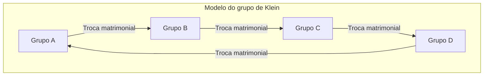

# Claude Lévi-Strauss e a Revolução do Estruturalismo: A Desconstrução do Eurocentrismo e a Geometria do "Pensamento Selvagem"

## Capítulo 1: O Crepúsculo do Existencialismo e a Agitação Intelectual em Paris

Na metade do século XX, o mundo intelectual francês estava sob o forte campo magnético do existencialismo, centrado em Jean-Paul Sartre. A filosofia de Sartre, que defendia a tese de que "a existência precede a essência" e enfatizava a livre subjetividade humana e o engajamento social (engagement), oferecia uma nova ética e uma luz de esperança aos intelectuais europeus que haviam sobrevivido ao desastre sem precedentes da Segunda Guerra Mundial. No entanto, contra esse paradigma antropocêntrico que assumia inconscientemente o progresso histórico, Claude Lévi-Strauss preparava-se silenciosamente, porém de forma decisiva, para provocar uma mudança geológica intelectual.

O ponto de partida ideológico de Lévi-Strauss continha um profundo "desconforto". O otimismo do existencialismo, de que a consciência subjetiva poderia determinar tudo, não seria apenas uma presunção local e moderna ocidental quando vista da perspectiva da vida dos povos indígenas que ele testemunhou em Mato Grosso, no Brasil, ou da grandiosa escala histórica da humanidade? Essa intuição se transformou em convicção teórica quando ele fugiu da perseguição como judeu durante a Segunda Guerra Mundial e se exilou em Nova York, nos Estados Unidos. Lá, ele teve um encontro fatídico com o linguista Roman Jakobson, herdeiro da genealogia do formalismo russo.

O que Jakobson lhe trouxe foi a rigorosa metodologia da "linguística estrutural" e da "fonologia", originada com Ferdinand de Saussure e refinada pela Escola de Praga (Nikolai Trubetzkoy e outros). A fonologia provou que os fonemas individuais não possuem significado em si mesmos, mas que é o "sistema de diferenças (relações)" entre fonemas que gera o significado. Lévi-Strauss intuiu que esse modelo de um "sistema de relações que funciona num nível inconsciente" se tornaria a chave universal para decifrar não apenas a linguagem, mas toda a cultura humana, como as relações de parentesco, os mitos e os rituais. Esse foi o momento histórico em que o estruturalismo foi introduzido no campo da antropologia cultural, e o início da "revolução estruturalista" que desconstruiria os privilégios do sujeito e da consciência.

Enquanto o existencialismo sartriano considerava a "consciência" e a "livre escolha" do indivíduo como a força motriz da formação histórica, Lévi-Strauss argumentou que, por trás da escolha subjetiva humana, existe uma forte "estrutura" operando de forma inconsciente. O sujeito é falado pela estrutura; não é o sujeito que controla a estrutura. Essa mudança de paradigma abalou fundamentalmente a primazia do cogito (eu penso) de Descartes em diante.

## Capítulo 2: O Impacto Matemático de "As Estruturas Elementares do Parentesco" (1949)

Publicado em 1949, "As Estruturas Elementares do Parentesco" tornou-se uma obra monumental que transformou a paisagem da antropologia. Aqui, Lévi-Strauss reconsiderou o fenômeno do "tabu do incesto", visto em várias sociedades ao redor do mundo, como um mecanismo universal que faz a ponte entre a natureza e a cultura. Até então, o tabu do incesto era frequentemente explicado como um instinto para prevenir a degeneração biológica, ou devido a uma aversão psicológica. No entanto, ele percebeu que a essência do tabu do incesto não está na proibição negativa de "com quem não se deve casar", mas na regra de "troca" positiva de "ceder mulheres do próprio grupo a outro grupo e, em troca, receber mulheres de outro grupo".

Para a construção dessa teoria, ele se baseou no "Ensaio sobre a Dádiva" de Marcel Mauss. Mauss demonstrou que, nas sociedades arcaicas, as dádivas são um mecanismo que forma e mantém os laços sociais (alianças) através de três obrigações: "a obrigação de dar, a obrigação de receber e a obrigação de retribuir". Lévi-Strauss aplicou essa lógica da dádiva às relações de parentesco (casamento). Em outras palavras, o casamento é um sistema de troca entre grupos em que as mulheres são o paradigma da "dádiva" mais valiosa, através do qual a humanidade deu um salto das leis da natureza (fechamento apenas pelo parentesco consanguíneo biológico) para as leis da cultura (alianças abertas com os outros).

Ainda mais inovador foi o fato de Lévi-Strauss ter introduzido a "teoria dos grupos" da matemática moderna na análise dessa estrutura de parentesco. Com a colaboração do genial matemático André Weil, do grupo Bourbaki, com quem fez amizade em sua época de Nova York, ele provou que regras matrimoniais extremamente complexas de povos como os aborígenes australianos (os sistemas dos Murngin ou Kariera) são completamente isomórficas com a estrutura de grupos (especialmente o "grupo de Klein") na álgebra.

O grupo de Klein (Klein four-group) é um grupo comutativo que consiste em 4 elementos, com a propriedade de que a aplicação de qualquer elemento duas vezes retorna ao elemento original (involução). Lévi-Strauss e Weil mostraram que as regras matrimoniais no sistema de parentesco estão sistematicamente organizadas de acordo com as propriedades matemáticas deste grupo. A estrutura básica é ilustrada pelo diagrama Mermaid abaixo.

（※ Os mecanismos de trocas simétricas e assimétricas, trocas restritas e generalizadas nos sistemas reais de parentesco passaram a ser compreendidos pela primeira vez de forma unificada através deste modelo matemático. Especialmente a troca generalizada (um sistema circular onde A dá para B, B dá para C, e C dá para A) revelou-se um mecanismo poderoso para integrar a sociedade como um todo.）

A introdução desta formulação algébrica por Weil colocou diante do mundo o fato de que os sistemas de parentesco dos povos considerados "primitivos" eram geometrias elaboradas projetadas por uma inteligência matemática avançada (a qual eles próprios operam inconscientemente). As estruturas de parentesco que os estudiosos ocidentais consideravam "complexas demais para serem compreendidas" surgiram através das lentes da teoria dos grupos como cristais dotados de uma simetria e consistência lógica de tirar o fôlego.
## Capítulo 3: "Tristes Trópicos" (1955) e o Crepúsculo da Civilização Ocidental

"Tristes Trópicos", publicado em 1955, é ao mesmo tempo uma etnografia acadêmica, uma obra-prima literária excepcional e um livro de reflexões filosóficas. Esta obra, que começa com a provocativa frase "Odeio as viagens e os exploradores", desenrola-se em torno das memórias de seu trabalho de campo nos anos 1930 no interior do Brasil, no estado de Mato Grosso. Lévi-Strauss lá encontrou povos indígenas como os Kadiwéu, Bororo, Nambikwara e Tupi-Kawahib.

As tatuagens em arabescos complexos aplicadas nos rostos das mulheres Kadiwéu. Lévi-Strauss encontrou nestes padrões geométricos, que são assimétricos mas altamente calculados, uma tentativa inconsciente de resolver simbolicamente as contradições e tensões do sistema de classes da sua sociedade. As tatuagens faciais não eram meras decorações, mas sim uma arte com uma "função sociológica" para mediar sobre a pele as fissuras estruturais da sociedade.

A estrutura das aldeias dos Bororos era ainda mais dramática. Suas aldeias eram dispostas em um círculo, com a disposição espacial de clãs e metades (moieties) rigorosamente definida em torno da praça central e da casa dos homens. Lévi-Strauss decifrou que a própria disposição física dessa aldeia era um "modelo estrutural vivo" que tornava visíveis a sua cosmologia, relações de parentesco e ordem mítica. O fato de que a primeira coisa que os missionários cristãos fizeram para convertê-los foi "reconstruir a aldeia em linha reta" demonstra claramente que a destruição da estrutura espacial estava diretamente ligada à destruição do seu universo espiritual.

E em suas interações com os Nambikwaras, que mantinham o estilo de vida mais primitivo, Lévi-Strauss chegou a uma visão chocante sobre a "origem da escrita". Trata-se do famoso episódio chamado de "A Lição de Escrita". Embora não tivesse o domínio da escrita, o chefe Nambikwara imitou o antropólogo a tomar notas, desenhando linhas onduladas no papel e fingindo lê-las, para demonstrar sua própria autoridade perante a tribo. Lévi-Strauss apresentou, a partir disso, a hipótese fundamental de que a escrita foi originalmente inventada não para a preservação do conhecimento ou o desenvolvimento da civilização, mas para facilitar "a dominação e a exploração do homem pelo homem". A escrita fixa leis e contratos, possibilita a cobrança de impostos e consolida sociedades hierárquicas. Esta observação de que a "escrita (écriture)", que o Ocidente tomou como base de sua superioridade, era na verdade uma tecnologia de opressão, teve depois uma influência decisiva na crítica do fonocentrismo feita por Jacques Derrida.

"Tristes Trópicos" está repleto de um luto profundo (uma nostalgia rousseauísta) pela perda da diversidade. Ele comparou o processo pelo qual a "civilização" ocidental padroniza, explora e destrói culturas heterogêneas ao redor do mundo a um "aumento da entropia". Ele afirma, com trágica determinação, que a antropologia deve ser uma "entropologia" (entropology: o estudo da entropia), uma disciplina que resiste a esse irreversível aumento de entropia (a inevitável marcha rumo à homogeneização) e salva os cristais de diversas estruturas gravadas no inconsciente da humanidade.

## Capítulo 4: "O Pensamento Selvagem" (1962) e a Bricolagem

A obra de 1962, "O Pensamento Selvagem (La Pensée sauvage)", é o mais poderoso manifesto do estruturalismo e constituiu um golpe decisivo no historicismo e progressismo representados por Sartre. Aqui, Lévi-Strauss desmantela completamente a hierarquia de superioridade e inferioridade que há muito dominava o Ocidente, entre o pensamento dos "primitivos (selvagens)" e o pensamento da "civilização (ciência)".

Ele provou que o pensamento dos indígenas (o pensamento selvagem) não é de forma alguma ilógico ou pré-lógico, mas sim uma inteligência rigorosa totalmente equivalente ao pensamento científico moderno. A diferença não reside na superioridade da capacidade intelectual, mas apenas na "diferença de abordagem aos objetos de conhecimento". O pensamento selvagem não é o pensamento do "engenheiro" que extrai conceitos abstratos e leis universais, mas sim impulsionado pela lógica da "bricolagem", que junta materiais concretos limitados disponíveis (fragmentos de mitos, classificação de animais e plantas, elementos rituais, etc.), os rearranja e constrói um novo sistema de significados.

O bricoleur (aquele que pratica bricolagem) não dispõe de ferramentas ou materiais especializados para um fim específico. Eles utilizam "ferramentas que têm à mão" para montar de improviso a ordem do mundo. Esta inteligência de bricolagem é a própria fonte que gerou a surpreendente riqueza e consistência lógica dos mitos, da magia e do totemismo em todo o mundo.

Especialmente na análise do totemismo, Lévi-Strauss rejeitou brilhantemente a interpretação utilitária dos antropólogos funcionalistas (como Malinowski) de que "um determinado animal é escolhido como totem porque é útil como alimento (é bom para comer)". Ele diz: "os animais não são escolhidos porque são bons para comer, mas porque são bons para pensar (bon à penser)". A diferença entre animais e plantas específicos (por exemplo, "águia e urso", "animais do céu e animais da terra") é usada como "ferramenta conceitual" para expressar a diferença entre os grupos sociais humanos (a relação entre o clã A e o clã B). Este sistema, no qual as oposições binárias no mundo natural funcionam como metáforas para oposições binárias no mundo cultural, foi exatamente a aplicação perfeita da "produção de sentido através da diferença" da linguística estrutural.

No último capítulo do livro, "A História e a Dialética", Lévi-Strauss aponta a lâmina da sua crítica impiedosa para a volumosa obra de Sartre, "Crítica da Razão Dialética". Sartre fez da história um processo absoluto de desdobramento da verdade e privilegiou as sociedades modernas ocidentais (sociedades com história). Mas, segundo Lévi-Strauss, a "história" de Sartre não passava de um mito moderno fabricado por intelectuais ocidentais para justificar a própria identidade. Não existe superioridade ou inferioridade inerente entre as "sociedades frias" (sociedades sem escrita e história que buscam manter a sua estrutura sem alterá-la) e as "sociedades quentes" (a modernidade ocidental) que buscam constante mudança e progresso. Esta contundente crítica a Sartre tornou-se um pronunciamento histórico de que a hegemonia do mundo intelectual francês se deslocou completamente do existencialismo para o estruturalismo.
## Capítulo 5: "Mitológicas" (4 Volumes) e a Canigrafia: A Geometria dos Mitos e a Fórmula Canônica

O ápice da busca acadêmica de Lévi-Strauss é "Mitológicas (Mythologiques)", uma obra monumental composta de quatro volumes e publicada entre 1964 e 1971. Esta obra colossal, composta pelo primeiro volume "O Cru e o Cozido", o segundo volume "Do Mel às Cinzas", o terceiro volume "A Origem dos Modos à Mesa" e o quarto volume "O Homem Nu", compilou mais de 800 conjuntos de mitos indígenas espalhados pelas Américas do Norte e do Sul, demonstrando que eles não eram apenas um acúmulo aleatório de histórias, mas constituíam um gigantesco "sistema de transformações".

A princípio, os mitos podem parecer absurdos, ilógicos e meros produtos da fantasia. Mas Lévi-Strauss percebeu que estruturas algébricas rigorosas estão ocultas na profundidade dos mitos. Os mitos individuais não existem isoladamente; eles são gerados invertendo outros mitos ou substituindo seus elementos. Um mito contado em uma tribo como oposição entre o "sol" e a "água" é substituído na tribo vizinha por uma oposição entre a "onça" e o "humano", e é mais tarde transformado numa tribo distante na oposição entre "carne crua (natureza)" e "carne cozida (cultura)". Todas essas variações podem ser explicadas como "transformações (transformations)" de uma estrutura inconsciente comum.

O mecanismo de transformação desses mitos foi formulado na famosa "Fórmula Canônica (Canonical Formula)". Lévi-Strauss representou a estrutura do mito pelo modelo matemático abaixo:

$F_x(A) : F_y(B) \simeq F_x(B) : F_{a^{-1}}(y)$

Esta equação não é apenas uma metáfora, mas um modelo algébrico que descreve com extremo rigor a transformação lógica dos mitos.
Aqui, A e B são "termos (termes)", e x e y representam "funções (fonctions)" ou atributos que esses termos possuem.
O lado esquerdo da fórmula $F_x(A) : F_y(B)$ indica a relação entre o "termo A com função x" e o "termo B com função y".
Isto é transformado para o lado direito $F_x(B) : F_{a^{-1}}(y)$. No lado direito, enquanto o termo B herda a função x, ocorre uma mudança dramática. O termo original A inverte sua polaridade ($a^{-1}$) e y, que era suposto ser uma função, é movido para a posição de um termo. Isso é chamado de "dupla torção (double twist)".

Como exemplo concreto, consideremos a transformação estrutural dos mitos mencionados por Lévi-Strauss em obras como "A Oleira Ciumenta".
Num determinado mito (lado esquerdo), uma "águia pertencente ao céu (x)" (A) e um "urso pertencente à terra (y)" (B) estão em oposição. Quando isto se transforma em outro mito (lado direito), os personagens não trocam simplesmente de lugar. Um "urso pertencente ao céu (x)" (B) aparece, e como um elemento oposto surge um "deus personificando a própria terra (y)", enquanto a "águia original (A)" é rebaixada para o "espírito do mundo subterrâneo ($a^{-1}$, a inversão do céu)", criando uma torção estrutural. Esta transformação topológica semelhante à fita de Möbius, onde funções se tornam termos e termos se invertem tornando-se funções, repete-se infinitamente na cadeia dos mitos das Américas do Norte e do Sul.

Através desta análise, Lévi-Strauss provou que os mitos não têm uma "origem" ou "autor original" específico. Os humanos não falam os mitos; "os mitos se falam, pelo inconsciente dos homens". O cérebro humano (inteligência) funciona como um enorme dispositivo de processamento de informação (computador) que, utilizando os dados sensoriais do mundo natural (cru, cozido, podre, etc.) como entrada, usa algoritmos de transformação como esta fórmula canônica para emitir uma ordem cultural (regras de parentesco, culinária e rituais).

Ademais, um ponto marcante em "Mitológicas" é que a sua estrutura geral se baseia profundamente na "estrutura da música". No prefácio do primeiro volume, Lévi-Strauss enaltece Richard Wagner como um "pioneiro sem paralelo da análise estrutural" e estrutura as suas próprias obras na analogia de sinfonias, sonatas e fugas. Os mitos e a música têm ambos estruturas temporais que, diferentemente da linguagem, são "intraduzíveis". Assim como o leitmotif (motivo condutor) na música é variado, invertido e sobreposto dentro da harmonia e contraponto, os vários elementos dos mitos (mitemas) ressoam juntos como numa orquestra dentro da progressão diacrônica da narrativa (melodia) e da sobreposição sincrônica de estruturas (harmonia).

Invocando as estruturas das fugas de Bach e do Bolero de Ravel, ele analisou meticulosamente como as oposições binárias no mito formam acordes e resolvem dissonâncias. O espaço do mito é uma imensa "cânion-grafia (Canyon/Music/Myth)", um grandioso espaço multidimensional no qual os mitemas se sobrepõem como estratos num cânion e se cruzam com a polifonia musical. A descoberta de que equações matemáticas e polifonias musicais, que eram consideradas as mais altas expressões da razão ocidental, já funcionavam em forma perfeita no fundo do "pensamento selvagem", destruiu fundamentalmente a arrogância do eurocentrismo.
## Apêndice: Dois Grandes Marcos na Análise Estrutural dos Mitos (Estudos de Caso Práticos)

Como a teoria de Lévi-Strauss dissecou textos míticos específicos e expôs as estruturas algébricas neles ocultas? Para compreender o seu verdadeiro valor prático, traçaremos em detalhes dois dos seus principais estudos de caso aqui. Esta análise demonstra claramente que o estruturalismo não era apenas uma filosofia abstrata, mas uma "operação cirúrgica" extremamente precisa aos textos.

### Estudo de Caso 1: A Análise Estrutural do Mito de Édipo

A análise do "mito de Édipo" desenvolvida por Lévi-Strauss em "Antropologia Estrutural" (1958) alterou decisivamente o paradigma de análise dos mitos. Contra o mito grego que parecia ter sido completamente interpretado por Freud sob o arcabouço psicológico do "desejo incestuoso (Complexo de Édipo)", ele adotou uma abordagem totalmente diferente. Ele leu os mitos não como "narrativas (progressão diacrônica)" ao longo de um eixo de tempo, mas decifrou-os como um "feixe sincrônico (harmonia)" semelhante a uma partitura orquestral (score).

Ele extraiu todos os fragmentos do mito de Édipo (mitemas) e os agrupou em quatro colunas verticais (categorias).
A 1ª coluna consiste em elementos que mostram a "supervalorização das relações de parentesco". A busca de Cadmo por sua irmã Europa, o casamento de Édipo com sua mãe Jocasta, e Antígona desobedecendo à proibição para enterrar seu irmão Polinices.
A 2ª coluna, pelo contrário, mostra a "subvalorização das relações de parentesco (hostilidade)". O assassinato do pai, Laio, por Édipo, e o fratricídio entre os irmãos Etéocles e Polinices.
A 3ª coluna consiste na "destruição de monstros (seres autóctones nascidos da terra)". Cadmo matando o dragão e Édipo derrotando a Esfinge.
A 4ª coluna lista "dificuldades de locomoção (defeitos físicos)". Nomes e características físicas como Laio (canhoto/desajeitado), Lábdaco (coxo) e Édipo (pé inchado).

A lógica que Lévi-Strauss extraiu disto é espantosa. A relação entre as colunas 1 e 2 (supervalorização : subvalorização do parentesco) é perfeitamente paralela à relação entre as colunas 3 e 4 (negação da autoctonia : afirmação da autoctonia). Matar um "monstro nascido da terra (símbolo da autoctonia humana)" significa negar a crença de que os humanos nasceram da terra (separação da natureza). Contudo, a dificuldade de caminhar (ser puxado pela terra) significa que o ser humano ainda está preso à terra (autoctonia).
Em outras palavras, o mito de Édipo era um vasto dispositivo de cálculo lógico tentando reconciliar a contradição fundamental (aporia) com que a antiga sociedade grega se debatia: "O homem nasce da cópula de homens e mulheres (cultura/realidade biológica) ou nasce partenogeneticamente da terra (natureza/crença mítica)?". A própria interpretação psicológica de Freud é apenas, na visão de Lévi-Strauss, uma das "mais recentes variações (formas transformadas)" do mito de Édipo.

### Estudo de Caso 2: A Estrutura Espacial Multicamadas da "Gesta de Asdiwal"

Outra análise crucial é a do mito indígena Tsimshian, da costa noroeste do Pacífico na América do Norte, conhecido como a "Gesta de Asdiwal (La Geste d'Asdiwal)" (1958). Este ensaio é considerado um dos cristais mais perfeitamente formados nas análises míticas de Lévi-Strauss.

Neste longo mito sobre as andanças e os casamentos do herói Asdiwal, Lévi-Strauss decifrou meticulosamente como a narrativa se desenrola simultaneamente em quatro níveis diferentes: geográfico, econômico, sociológico e cosmológico.
No nível geográfico, Asdiwal se move de Leste a Oeste, de Sul a Norte. No nível econômico, transita do inverno de fome, à primavera do salmão, até ao verão da caça. No nível sociológico, ele oscila entre o casamento matrilocal e patrilocal. E no nível cosmológico, ele se divide entre uma esposa celestial (o povo das estrelas) e uma esposa do submundo (o povo do mar).

O fim trágico de Asdiwal (que é transformado em pedra e preso no cume da montanha) reflete a insustentável contradição estrutural de "residência patrilocal em uma sociedade matrilinear" que a sociedade Tsimshian realmente enfrentava. Contradições que não podem ser resolvidas na sociedade real são levadas ao extremo no nível imaginário do mito, ao descrever o seu autocolapso, garantindo, paradoxalmente, a legitimidade das instituições sociais reais.
Aqui, os mitos já não são meros "reflexos" ou "cópias" da realidade. Os mitos funcionam como "laboratórios de realidade virtual (RV)" concebidos para experimentar e simular as fendas e distorções da estrutura social ao nível simbólico. Quando a oposição binária se expande a um extremo e desmorona sem solução, surge um alívio inconsciente na mente das pessoas de que "depois de tudo, a instituição social real (um produto de compromisso) é muito melhor".

Como se evidencia por estas análises, a mitologia do estruturalismo não é um trabalho de redução aos elementos, mas de restabelecimento da "teia de relações (rede)" entre eles. Trata-se de uma tentativa de topologia, e não da geometria analítica cartesiana, subdividindo objetos mas sim de encontrar as propriedades que são mantidas mesmo quando a forma é alterada. Nem o pé inchado de Édipo, nem o corpo petrificado de Asdiwal são mero adorno narrativo; pelo contrário, são funções matemáticas (parâmetros) extremamente precisas para descrever a relação entre a sociedade humana e o cosmos.

（※ Este método de análise multicamadas seria mais tarde assimilado na teoria literária (narratologia) por autores como Roland Barthes e Algirdas Julien Greimas, e tornou-se a língua de base essencial da análise textual. Esta "geometria selvagem" descoberta por Lévi-Strauss dentro do mito repintou de forma decisiva e irreversível a paisagem intelectual da segunda metade do século XX.）
## Capítulo 6: Conexões para o Pós-Estruturalismo e o Legado Atual: O Inconsciente Estrutural e o Futuro da IA

O paradigma do estruturalismo, estabelecido por Lévi-Strauss com obras como "As Estruturas Elementares do Parentesco" e "O Pensamento Selvagem", causou uma tempestade decisiva no pensamento contemporâneo francês a partir da década de 1960. O seu método, que despojava o privilégio do "sujeito", da "consciência" e da "história" em favor da "estrutura do inconsciente" que trabalhava silenciosamente em seu fundo, propagou-se de imediato para outras disciplinas.

Jacques Lacan adotou a teoria da troca da estrutura de parentesco de Lévi-Strauss e a linguística de Saussure para a psicanálise e forjou a famosa tese: "o inconsciente é estruturado como uma linguagem". A tentativa de Lacan, que teceu fortes críticas sobre a psicologia do ego americana e redefiniu o inconsciente freudiano como a rede do simbólico (ordem linguística), não teria sido possível sem a aproximação algébrica de Lévi-Strauss.
Michel Foucault, no livro "As Palavras e as Coisas", escavou arqueologicamente os moldes do inconsciente que definiam o conhecimento de cada época (episteme) e declarou "o fim do homem" (como um rosto desenhado na areia que é apagado pelas ondas, o conceito moderno de "sujeito" irá desaparecer). Esta é mais uma variação ideológica na linha da declaração de Lévi-Strauss ao fechar "Tristes Trópicos", em que definiu a antropologia como uma "entropologia" e pregou a impotência dos projetos conscientes da humanidade.
Além disso, Jacques Derrida abriu a porta ao pós-estruturalismo através da sua desconstrução sobre as certezas tais como "centro" e "origem absoluta" pressupostos pelo estruturalismo. Contudo, deve ser lembrado que a crítica do fonocentrismo de Derrida partiu da leitura crítica afiada da "Lição de Escrita" dos Nambikwara de Lévi-Strauss. O estruturalismo de Lévi-Strauss foi, mesmo para pensadores pós-estruturalistas que procuravam superá-lo, um enorme e inevitável degrau.

Em seus anos finais, Lévi-Strauss continuou soando fortes alertas sobre a perda da diversidade cultural em meio à rápida globalização. Ele acreditava que a cultura da humanidade só pode manter sua riqueza através da existência de diferenças com os outros (uma distância e isolamento apropriados). Comunicação e homogeneização excessivas privam a cultura de sua vitalidade criativa e, em última análise, trazem a morte entrópica (morte térmica) da humanidade como um todo. Este pensamento foi uma visão intensamente ecológica que antecipou a inseparabilidade atual entre "diversidade biológica" e "diversidade cultural". Superando o dualismo cartesiano que opõe a natureza (ambiente) à cultura (ser humano), e reavaliando a "inteligência imanente no mundo natural" da perspectiva do animismo e totemismo, as recentes viradas ontológicas de hoje (como o multinaturalismo de Eduardo Viveiros de Castro) também são os herdeiros legítimos de sua teoria.

Além disso, o rápido desenvolvimento da ciência da computação moderna, especialmente a inteligência artificial (IA), lança uma nova luz sobre o estruturalismo de Lévi-Strauss. O mecanismo pelo qual modelos de linguagem de grande escala (LLM) e aprendizado profundo processam matematicamente os "padrões de relacionamento (diferenças e distâncias no espaço vetorial)" escondidos em enormes redes de dados de texto e, a partir daí, geram significado e lógica, é exatamente o "algoritmo de transformação de mitos" que Lévi-Strauss previu. A IA não "entende" o significado, ela está simplesmente calculando probabilística e algebricamente a enorme matriz estrutural dos signos linguísticos (a cadeia de paradigmas e sintagmas num espaço multidimensional). Contudo, o que é produzido dali reflete, aos olhos humanos, um alto grau de "inteligência" e "narrativa".
Isso nada mais é do que a situação na qual a tese de Lévi-Strauss de que "os mitos se falam pelo inconsciente dos homens" foi implementada fisicamente em chips de silício e redes neurais. Ironicamente, o princípio fundamental do estruturalismo, no qual a rede (estrutura) de relações diferenciais dos signos tece autonomamente um sistema de significados, sem qualquer intervenção da consciência ou intenção do sujeito, está sendo provado da forma mais pura pela tecnologia moderna de IA.

### Conclusão: O Esplendor do Frio Cristal

O enorme corpo textual deixado por Claude Lévi-Strauss foi um frio cristal atirado no auge de uma era existencialista fervorosa. Ele provou friamente que não importa o quão alto o homem grite por liberdade, o nosso pensamento está sempre sob a restrição de estruturas a priori como a linguagem, regras de parentesco e os mitos. Contudo, isso não é de modo algum uma filosofia de desespero. O que ele descobriu, nas profundezas da floresta amazônica e nas infinitas variações dos mitos indígenas, foi o esplendor de uma inteligência universal e meticulosa de que toda a humanidade é dotada, e que não é monopólio de qualquer elite ou da "sociedade civilizada".

O seu grande feito de desmantelar o humanismo arrogante da modernidade ocidental e de apresentar ao mundo a beleza geométrica do "pensamento selvagem" irradia a sua mais genuína atualidade para ser relida, particularmente hoje no século XXI, onde o antropocentrismo tem sido abalado desde os seus alicerces pelas crises ambientais e pela ascensão da IA. "O mundo começou sem o homem e terminará sem ele" — esta profecia triste em "Tristes Trópicos" possui uma profunda ressonância ética que nos ensina, não o desespero, mas a verdadeira estatura da humanidade no âmbito das estruturas grandiosas do universo.
