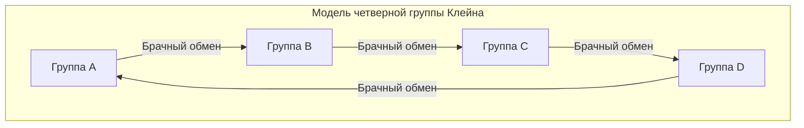

# Клод Леви-Стросс и революция структурализма: деконструкция западного центризма и геометрия «неприрученной мысли»

## Глава 1: Сумерки экзистенциализма и интеллектуальный тектонический сдвиг в Париже

В середине XX века французская интеллектуальная мысль находилась в мощном магнитном поле экзистенциализма, в центре которого был Жан-Поль Сартр. Философия Сартра, выдвигавшая тезис «существование предшествует сущности» и подчеркивавшая свободную субъектность человека и его социальную вовлеченность (ангажированность), давала новую этику и луч надежды европейским интеллектуалам, пережившим беспрецедентную катастрофу Второй мировой войны. Однако именно Клод Леви-Стросс тихо, но решительно готовил тектонический сдвиг, направленный против этой антропоцентричной парадигмы, которая бессознательно предполагала исторический прогресс.

В идеологической отправной точке Леви-Стросса лежал глубокий «диссонанс». Оптимизм экзистенциализма, утверждавший, что субъективное сознание способно определять все, казался ему — с точки зрения жизни коренных народов, которую он наблюдал в бразильском Мату-Гросу, и в масштабах грандиозной истории человечества — не более чем крайне западно-модернистским и локальным самомнением. Эта интуиция превратилась в теоретическую уверенность, когда во время Второй мировой войны, спасаясь от преследований как еврей, он эмигрировал в Нью-Йорк, США. Там у него произошла судьбоносная встреча с лингвистом Романом Якобсоном, продолжателем традиций русского формализма.

Якобсон познакомил его со строгой методологией «структурной лингвистики» и «фонологии», бравшей начало от Фердинанда де Соссюра и усовершенствованной Пражской школой (в частности, Николаем Трубецким). Фонология доказывала, что отдельные фонемы сами по себе не имеют смысла; именно «система различий (отношений)» между фонемами порождает смысл. Леви-Стросс интуитивно понял, что эта модель «системы отношений, функционирующей на бессознательном уровне», станет универсальным ключом к расшифровке не только языка, но и человеческой культуры в целом, включая системы родства, мифы и ритуалы. Это был исторический момент внедрения структурализма в область культурной антропологии и начало «структуралистской революции», демонтирующей привилегированность субъекта и сознания.

В то время как сартровский экзистенциализм рассматривал индивидуальное «сознание» и «свободный выбор» как движущие силы формирования истории, Леви-Стросс утверждал, что за субъективным выбором человека скрывается мощная «структура», действующая бессознательно. Субъект высказывается через структуру, а не контролирует ее. Этот парадигмальный сдвиг в корне подорвал превосходство картезианского cogito (мыслю).

## Глава 2: Математический шок «Элементарных структур родства» (1949)

Опубликованные в 1949 году «Элементарные структуры родства» стали монументальным трудом, изменившим ландшафт антропологии. Здесь Леви-Стросс переосмыслил феномен «табу на инцест (кровосмешение)», наблюдаемый в различных обществах по всему миру, как универсальный механизм, связывающий природу и культуру. До этого табу на инцест часто объясняли инстинктивным стремлением предотвратить биологическую деградацию или психологическим отвращением. Однако он проницательно заметил, что сущность табу на инцест заключается не в негативном запрете «с кем нельзя вступать в брак», а в позитивном правиле «обмена»: «передаче женщин своей группы другой группе и получении взамен женщин из другой группы».

При построении этой теории он опирался на «Эссе о даре» Марселя Мосса. Мосс показал, что в архаических обществах дар — это механизм формирования и поддержания социальных связей (альянсов) посредством трех обязанностей: «обязанности давать, обязанности принимать и обязанности возмещать». Леви-Стросс применил эту логику дара к родственным связям (браку). Иными словами, брак — это система межгруппового обмена, в которой парадигмой выступает самый ценный «дар» — женщина, и благодаря этому человечество совершило скачок от законов природы (закрытости, основанной исключительно на биологическом кровном родстве) к законам культуры (открытым союзническим отношениям с другими).

Еще более революционным стало то, что Леви-Стросс ввел в анализ структур родства «теорию групп» из современной математики. При содействии Андре Вейля, гениального математика из группы Бурбаки, с которым он подружился в нью-йоркский период, он доказал, что чрезвычайно сложные правила брака австралийских аборигенов (например, системы племен мурнгин и кариера) полностью изоморфны структурам групп в алгебре (в частности, «четверной группе Клейна»).

Четверная группа Клейна (Klein four-group) — это абелева группа, состоящая из 4 элементов, обладающая свойством (инволюции), при котором двукратное применение любого элемента возвращает его в исходное состояние. Леви-Стросс и Вейль показали, что правила брака в системах родства систематически организованы в соответствии с математическими свойствами этой группы. Ниже ее базовая структура показана в виде диаграммы с использованием Mermaid.

（※Механизмы симметричного и асимметричного, ограниченного и обобщенного обмена в реальных системах родства впервые получили единое понимание благодаря этой математической модели. В частности, стало ясно, что обобщенный обмен (круговая система, в которой A дает B, B дает C, а C дает A) является мощным механизмом, интегрирующим общество в целом.）

Внедрение алгебраической формулировки Вейля продемонстрировало миру, что системы родства народов, считавшихся «первобытными», представляют собой изысканную геометрию, спроектированную с помощью высокоразвитого математического интеллекта (который они сами применяют бессознательно). Структуры родства, которые западные ученые считали «слишком сложными и непостижимыми», сквозь призму теории групп предстали как кристалл захватывающей дух красоты, симметрии и логической последовательности.

## Глава 3: «Печальные тропики» (1955) и сумерки западной цивилизации

Опубликованные в 1955 году «Печальные тропики» являются одновременно академической этнографией, редким литературным шедевром и книгой философских размышлений. Этот труд, начинающийся с провокационной фразы: «Я ненавижу путешествия и исследователей», разворачивается вокруг воспоминаний о полевых исследованиях в глубинке Бразилии, в штате Мату-Гросу в 1930-х годах. Леви-Стросс встретил там коренные народы, такие как кадувео, бороро, намбиквара и тупи-кавахиб.

Сложные арабески татуировок на лицах женщин кадувео. В этих асимметричных, но точно рассчитанных геометрических узорах Леви-Стросс увидел бессознательную попытку символически разрешить противоречия и напряжения сословной системы их общества. Татуировка на лице была не просто украшением, а искусством с «социологической функцией», призванным примирить структурные трещины общества на коже.

Структура деревень бороро была еще более драматичной. Их деревни были расположены по кругу, а вокруг центральной площади и мужского дома собраний было строго определено сложное пространственное расположение кланов и фратрий. Леви-Стросс расшифровал, что сама физическая планировка этой деревни была «живой структурной моделью», визуализирующей их космологию, родственные связи и мифологический порядок. Тот факт, что первое, что сделали христианские миссионеры для их обращения, было «перестройка деревни в прямую линию», ясно свидетельствует о том, что разрушение пространственной структуры напрямую связано с разрушением их духовной вселенной.

И во время общения с намбиквара, которые сохраняли самый примитивный образ жизни, Леви-Стросс пришел к шокирующему прозрению о «происхождении письменности». Это знаменитый эпизод, названный «Урок письма». Вождь намбиквара, несмотря на отсутствие у них письменности, имитировал антрополога, делающего заметки, рисуя волнистые линии на бумаге и делая вид, что читает их, тем самым демонстрируя свой авторитет перед соплеменниками. Исходя из этого, Леви-Стросс выдвинул фундаментальную гипотезу о том, что письменность изначально была изобретена не для сохранения знаний или развития цивилизации, а для облегчения «господства и эксплуатации человека человеком». Письменность фиксирует законы и контракты, делает возможным сбор налогов и закрепляет иерархическое общество. Это утверждение о том, что «письменность (écriture)», на которой Запад основывал свое превосходство, на самом деле была технологией угнетения, позже оказало решающее влияние на критику фоноцентризма Жаком Деррида.

«Печальные тропики» полны глубокой скорби (руссоистской ностальгии) по утрачиваемому многообразию. Он сравнил процесс, посредством которого западная «цивилизация» стандартизирует, эксплуатирует и разрушает различные культуры по всему миру, с «возрастанием энтропии». Он с горькой решимостью заявляет, что антропология должна быть «энтропологией» (entropology: наукой об энтропии), противостоящей этому необратимому возрастанию энтропии (неизбежному движению к гомогенизации) и спасающей кристаллы разнообразных структур, запечатленных в бессознательном человечества.

## Глава 4: «Неприрученная мысль» (1962) и бриколаж

«Неприрученная мысль» (La Pensée sauvage) 1962 года стала самым мощным манифестом структурализма и нанесла решающий удар по историзму и прогрессивизму, представленным Сартром. Здесь Леви-Стросс полностью разрушает долгое время господствовавшую на Западе иерархию превосходства между мыслью «первобытной (неприрученной)» и мыслью «цивилизованной (научной)».

Он доказал, что мышление коренных народов (неприрученная мысль) ни в коем случае не является алогичным или дологичным, а представляет собой такой же строгий интеллект, как и современное научное мышление. Разница заключается не в превосходстве или неполноценности интеллектуальных способностей, а лишь в «различии подходов к объекту познания». Неприрученная мысль движима не мышлением «инженера», извлекающего абстрактные концепции и универсальные законы, а логикой «бриколажа» (рукоделия, создания из подручных средств) — собирания, перекомпоновки и построения новой системы смыслов из ограниченного набора конкретных материалов, оказавшихся под рукой (фрагментов мифов, классификации животных и растений, элементов ритуалов и т.д.).

Бриколер (мастер-самоделкин) не имеет специализированных инструментов и материалов для конкретной цели. Он собирает порядок мира спонтанно, используя «инструменты, которые есть под рукой». Именно этот интеллект бриколажа стал источником поразительного богатства и логической последовательности мифов, магии и тотемизма по всему миру.

В частности, в анализе тотемизма Леви-Стросс блестяще отверг утилитарную интерпретацию функционалистских антропологов (Малиновского и др.), утверждавшую, что «животное выбирается в качестве тотема, потому что оно полезно для еды (хорошо для еды)». Он сказал: «Животные выбираются не потому, что они хороши для еды, а потому, что они хороши для мысли (bon à penser)». Различия между определенными растениями и животными (например, «орел и медведь», «животные неба и животные земли») используются как «концептуальные инструменты» для выражения различий между человеческими социальными группами (отношения между кланом А и кланом Б). Эта система, в которой бинарные оппозиции в мире природы функционируют как метафоры бинарных оппозиций в мире культуры, стала идеальной реализацией «порождения смысла через различие» структуралистской лингвистики.

В последней главе этой книги, «История и диалектика», Леви-Стросс направляет острие беспощадной критики на фундаментальный труд Сартра «Критика диалектического разума». Сартр рассматривал историю как процесс развертывания абсолютной истины и наделял привилегиями современное западное общество (общество, имеющее историю). Однако, по словам Леви-Стросса, сартровская «история» — это не более чем современный миф, сфабрикованный западными интеллектуалами для оправдания своей собственной идентичности. Между «холодными обществами» (обществами, стремящимися поддерживать свою структуру без изменений), не имеющими письменности и истории, и «горячими обществами» (западный модерн), стремящимися к постоянным изменениям и прогрессу, не существует принципиального превосходства или неполноценности. Эта резкая критика Сартра стала историческим приговором, возвестившим о полном переходе гегемонии во французской мысли от экзистенциализма к структурализму.

## Глава 5: «Мифологики» (в 4-х томах) и каниграфия: геометрия мифа и каноническая формула

Вершиной научных исследований Леви-Стросса стал колоссальный четырехтомный труд «Мифологики» (Mythologiques), изданный в период с 1964 по 1971 год. Этот монументальный труд, состоящий из первого тома «Сырое и приготовленное», второго тома «От меда к пеплу», третьего тома «Происхождение застольных обычаев» и четвертого тома «Голый человек», собрал более 800 мифов коренных народов, разбросанных по Северной и Южной Америке, и доказал, что они представляют собой не просто случайное нагромождение историй, а единую гигантскую «систему трансформаций».

На первый взгляд, мифы кажутся абсурдными, алогичными и плодами фантазии. Однако Леви-Стросс разглядел, что в глубине мифов скрыта строгая алгебраическая структура. Отдельные мифы не существуют изолированно; они порождаются путем инверсии других мифов или замены их элементов. Миф, рассказываемый в одном племени как конфликт между «солнцем» и «водой», в соседнем племени заменяется конфликтом между «ягуаром» и «человеком», а в еще более отдаленном племени трансформируется в конфликт между «сырым мясом (природой)» и «приготовленным мясом (культурой)». Все эти вариации можно объяснить как «трансформации» (transformation) общей бессознательной структуры.

Формулировкой этого механизма трансформации мифов стала знаменитая «Каноническая формула» (Canonical Formula). Леви-Стросс выразил структуру мифа с помощью следующей математической модели:

$F_x(A) : F_y(B) \simeq F_x(B) : F_{a^{-1}}(y)$

Эта формула — не просто метафора, а алгебраическая модель, которая предельно строго описывает логическую трансформацию мифа.

Здесь A и B — это «термы» (termes), а x и y представляют собой «функции» (fonctions) или атрибуты, которыми обладают эти термы.

Левая часть уравнения $F_x(A) : F_y(B)$ показывает отношение между «термом A с функцией x» и «термом B с функцией y».

Она трансформируется в правую часть $F_x(B) : F_{a^{-1}}(y)$. В правой части терм B перенимает функцию x, но в то же время происходит драматическое изменение. Исходный терм A инвертирует свою полярность ($a^{-1}$), а y, которое должно было быть функцией, поднимается на позицию терма. Это называется «двойным скручиванием» (double twist).

В качестве конкретного примера рассмотрим структурную трансформацию мифа, упомянутую Леви-Строссом в таких работах, как «Ревнивая горшечница».

Предположим, в одном мифе (левая часть) противостоят «орел (A), принадлежащий небу (x)» и «медведь (B), принадлежащий земле (y)». Когда это трансформируется в другой миф (правая часть), персонажи не просто меняются местами. Появляется «медведь (B), принадлежащий небу (x)», в качестве противостоящего элемента выступает «сама земля (y), персонифицированная как божество», а первоначальный «орел (A)» понижается до «духа подземного мира ($a^{-1}$, инверсия неба)» — происходит структурное скручивание. Топологические трансформации, подобные ленте Мебиуса, где функция превращается в терм, а терм инвертируется в функцию, бесконечно повторяются в цепи мифов Северной и Южной Америки.

С помощью этого анализа Леви-Стросс доказал, что мифы не имеют конкретного «происхождения» или «первоначального автора». Мифы рассказывает не человек; «мифы рассказывают сами себя через человеческое бессознательное». Человеческий мозг (интеллект) функционирует как гигантское устройство обработки информации (компьютер), которое принимает сенсорные данные из мира природы (сырое, приготовленное, гнилое и т. д.) в качестве входных данных и, используя алгоритм трансформации, подобный этой канонической формуле, выдает культурный порядок (правила родства, кулинарии, ритуалов) в качестве выходных данных.

Кроме того, отличительной чертой «Мифологик» является то, что их общая структура глубоко опирается на «структуру музыки». В предисловии к первому тому Леви-Стросс восхваляет Рихарда Вагнера как «непревзойденного предшественника структурного анализа» и выстраивает свое произведение по аналогии с симфонией, сонатной формой и фугой. И миф, и музыка, в отличие от языка, обладают «непереводимой» временной структурой. Подобно тому как лейтмотив в музыке варьируется, инвертируется и накладывается друг на друга в гармонии и контрапункте, так и элементы мифа (мифемы) звучат как оркестр в ходе диахронического развития повествования (мелодии) и наложении синхронических структур (гармонии).

Ссылаясь на структуры фуг Баха и «Болеро» Равеля, он тщательно проанализировал, как бинарные оппозиции мифа формируют аккорды и разрешают диссонансы. Мифологическое пространство — это гигантская «каниография (Canyon/Music/Myth)», грандиозное многомерное пространство, где пересекаются мифемы, накладывающиеся друг на друга подобно геологическим слоям в каньоне, и музыкальная полифония. Открытие того, что математические уравнения и музыкальная полифония, считавшиеся вершиной западного разума, на самом деле уже функционировали в совершенной форме в глубинах «неприрученной мысли», в корне разрушило высокомерие западоцентризма.

## Приложение: Два великих ориентира в структурном анализе мифов (практические тематические исследования)

Как теория Леви-Стросса препарировала конкретные мифологические тексты и выявляла скрывающиеся в них алгебраические структуры? Чтобы понять ее истинную практическую ценность, мы подробно проследим здесь два из его самых известных тематических исследований (кейс-стади). Этот анализ ясно показывает, что структурализм — не просто абстрактная философия, а предельно точная «хирургическая операция» на тексте.

### Тематическое исследование 1: Структурный анализ мифа об Эдипе

Анализ «мифа об Эдипе», разработанный Леви-Строссом в «Структурной антропологии» (1958), решительно изменил парадигму анализа мифов. К этому греческому мифу, который, казалось бы, был полностью истолкован Фрейдом в психологических рамках «кровосмесительного желания (эдипова комплекса)», он применил совершенно иной подход. Он читал миф не как «повествование (диахроническое развитие)» вдоль временной оси, а как «синхронический пучок (гармонию)», подобно партитуре оркестра.

Он извлек все фрагменты мифа об Эдипе (мифемы) и сгруппировал их в четыре вертикальные колонки (категории).
Первая колонка — это элементы, указывающие на «переоценку кровного родства». Это поиски Кадмом своей сестры Европы, женитьба Эдипа на своей матери Иокасте, захоронение Антигоной своего брата Полиника в нарушение запрета и так далее.
Вторая колонка, наоборот, содержит элементы, указывающие на «недооценку кровного родства (враждебность)». Это убийство Эдипом своего отца Лая и братоубийственная война между Этеоклом и Полиником.
Третья колонка — элементы, указывающие на «убийство чудовищ (автохтонных существ, рожденных из земли)». Убийство дракона Кадмом и победа Эдипа над Сфинксом.
Четвертая колонка — элементы, указывающие на «затрудненность при ходьбе (физические недостатки)». Это имена и физические особенности, такие как Лай (левша/неуклюжий), Лабдак (хромой) и Эдип (с распухшими ногами).

Логика, которую из этого вывел Леви-Стросс, поразительна. Отношение между первой и второй колонками (переоценка кровного родства : недооценка кровного родства) полностью параллельно отношению между третьей и четвертой колонками (отрицание автохтонности : утверждение автохтонности). Убийство «чудовища, рожденного из земли (символа автохтонности человека)», означает отрицание веры в то, что человек рожден из земли (отрыв от природы). Однако затруднения при ходьбе (ноги, волочащиеся по земле) означают, что человек все еще привязан к земле (автохтонность).

Иными словами, миф об Эдипе был гигантским вычислительным устройством, пытавшимся логически примирить фундаментальное противоречие (апорию), с которым сталкивалось древнегреческое общество: «Рождаются ли люди от союза мужчины и женщины (культура, биологическая реальность) или они рождаются автохтонно из земли (природа, мифологическая вера)?». Даже психологическая интерпретация Фрейда, по словам Леви-Стросса, является лишь одной из «последних вариаций (форм трансформации)» мифа об Эдипе.

### Тематическое исследование 2: Многослойная пространственная структура «Деяний Асдивала»

Другим чрезвычайно важным анализом является структурный анализ «Деяний Асдивала» (La Geste d'Asdiwal) — мифа индейцев цимшиан с северо-западного побережья Тихого океана в Северной Америке (1958 г.). Эта статья считается одним из самых совершенных кристаллов мифологического анализа Леви-Стросса.

В этом длинном мифе о странствиях и браках героя по имени Асдивал Леви-Стросс тщательно расшифровал, что повествование разворачивается одновременно на четырех разных уровнях: географическом, экономическом, социологическом и космологическом.
На географическом уровне Асдивал перемещается с востока на запад, с юга на север. На экономическом уровне происходит смена сезонов: от голодной зимы к весне, когда лосось идет на нерест, и к лету, сезону охоты. На социологическом уровне он колеблется между матрилокальным и патрилокальным браком. На космологическом уровне он разрывается между женой из небесного мира (звездного народа) и женой из подземного мира (морского народа).

Трагический конец Асдивала (он превращается в камень и оказывается в ловушке на вершине горы) отражает неразрешимое структурное противоречие, с которым реально сталкивалось общество цимшиан: «патрилокальное проживание в матрилинейном обществе». Изображая, как противоречия, которые невозможно разрешить в реальном обществе, доводятся до предела на воображаемом уровне мифа и приводят к саморазрушению, миф парадоксальным образом гарантирует легитимность реальных социальных институтов.

Здесь миф больше не является просто «отражением» или «копией» реальности. Миф функционирует как «лаборатория виртуальной реальности (VR)» для экспериментирования и симуляции трещин и искажений в реальной социальной структуре на символическом уровне. Когда бинарные оппозиции в мифе разрастаются до предела, становятся неразрешимыми и терпят крах, в умы людей приходит бессознательное облегчение: «В конце концов, реальные социальные институты (продукт компромисса) лучше».

Как видно из этих анализов, структуралистская мифология — это не редукция к элементам, а работа по восстановлению «паутины отношений (сети)» между элементами. Это была не картезианская аналитическая геометрия, разделяющая объект на мельчайшие части, а попытка топологии исследовать свойства, которые сохраняются даже при изменении формы. И распухшие ноги Эдипа, и окаменевшее тело Асдивала были не просто украшениями повествования, а предельно строгими математическими функциями (параметрами) для описания отношений между человеческим обществом и космосом.

（※Этот многоуровневый метод анализа впоследствии был перенят Роланом Бартом, Альгирдасом Жюльеном Греймасом и другими в теории литературы (нарратологии) и стал незаменимым базовым языком для анализа текста. Эта «неприрученная геометрия», которую Леви-Стросс обнаружил в мифе, решительно и необратимо изменила интеллектуальный ландшафт второй половины 20-го века.）

## Глава 6: Связь с постструктурализмом и наследие для современности: структуралистское бессознательное и будущее ИИ

Парадигма структурализма, установленная Леви-Строссом в «Элементарных структурах родства» и «Неприрученной мысли», вызвала решающую бурю во французской современной мысли начиная с 1960-х годов. Его метод, лишивший «субъект», «сознание» и «историю» их привилегий и выдвинувший на первый план тайно действующие за ними «бессознательные структуры», быстро распространился и на другие академические дисциплины.

Жак Лакан внедрил теорию обмена в структурах родства Леви-Стросса и лингвистику Соссюра в психоанализ, выдвинув знаменитый тезис: «Бессознательное структурировано как язык». Попытка Лакана, резко критиковавшего американскую эго-психологию, ориентированную на эго, и переопределившего фрейдовское бессознательное как сеть символического порядка (языка), была бы невозможна без алгебраического подхода Леви-Стросса.
Мишель Фуко в «Словах и вещах» археологически раскопал бессознательные рамки, определяющие знания каждой эпохи (эпистемы), и провозгласил «конец человека» (исчезновение концепции современного «субъекта», подобно лицу, начертанному на песке у кромки моря, которое стирают волны). Это также идеологическая вариация того, что Леви-Стросс определил антропологию как «энтропологию» в конце «Печальных тропиков» и говорил о бессилии сознательных планов человека.
Кроме того, Жак Деррида деконструировал существование «центра» и «абсолютного начала», предполагаемых структурализмом, открыв двери постструктурализму. Однако следует помнить, что критика фоноцентризма Деррида берет начало из его острого критического прочтения «Урока письма» племени намбиквара у Леви-Стросса. Структурализм Леви-Стросса стал гигантской, неизбежной ступенью и для мыслителей-постструктуралистов, стремившихся превзойти его.

В свои поздние годы Леви-Стросс продолжал бить тревогу по поводу утраты культурного разнообразия в условиях стремительной глобализации. Он считал, что человеческая культура может сохранять свое богатство только благодаря существованию различий с другими (надлежащей дистанции и изоляции). Чрезмерная коммуникация и гомогенизация лишают культуру ее творческой жизненной силы и в конечном итоге приводят к энтропийной смерти (тепловой смерти) человечества в целом. Эта мысль была в высшей степени экологическим видением, предвосхитившим неразделимость «биологического разнообразия» и «культурного разнообразия» в современную эпоху. Преодолевая картезианский дуализм, рассматривающий природу (среду) и культуру (человека) как противоположности, сегодняшний онтологический поворот (такой как мультинатурализм Эдуарду Вивейруша де Кастру), который переоценивает «интеллект, присущий миру природы» с позиций анимизма и тотемизма, также является законным наследником его теории.

Кроме того, стремительное развитие современной информатики, особенно искусственного интеллекта (ИИ), проливает новый свет на структурализм Леви-Стросса. Механизм, с помощью которого большие языковые модели (LLM) и глубокое обучение вычисляют «паттерны отношений (различия и расстояния в векторном пространстве)», скрытые в гигантских сетях текстовых данных, и генерируют из них смысл и логику, — это именно тот самый «алгоритм трансформации мифа», который предвидел Леви-Стросс. ИИ не «понимает» смысл, а лишь вероятностно и алгебраически оперирует гигантской структурной матрицей языковых знаков (цепями парадигм и синтагм в многомерном пространстве). Однако то, что он выдает в результате, выглядит в глазах человека как высокоразвитый «интеллект» и «повествование».

Это не что иное, как физическая реализация тезиса Леви-Стросса «мифы рассказывают сами себя через человеческое бессознательное» на кремниевых чипах и нейронных сетях. Фундаментальный принцип структурализма, согласно которому сеть дифференциальных отношений (структура) знаков автономно сплетает систему смыслов без вмешательства сознания или намерения субъекта, по иронии судьбы, доказывается в самом чистом виде современными технологиями ИИ.

### Заключение: Блеск холодного кристалла

Огромный массив текстов, оставленных Клодом Леви-Строссом, стал холодным кристаллом, брошенным в эпоху восторженного экзистенциализма. Он хладнокровно доказал, что как бы громко человек ни кричал о свободе, наше мышление всегда находится под ограничением априорных структур, таких как язык, правила родства и мифы. Однако это ни в коем случае не философия отчаяния. То, что он обнаружил в глубине лесов Амазонки и в бесконечных вариациях мифов коренных народов, было блеском универсального, утонченного интеллекта, которым в равной мере наделено все человечество и который не является исключительной собственностью какой-то конкретной элиты или «цивилизованного общества».

Его великое достижение — разрушение высокомерного гуманизма западного модерна и демонстрация миру геометрической красоты «неприрученной мысли» — излучает актуальность, требующую самого серьезного перепрочтения именно сегодня, в XXI веке, когда антропоцентризм фундаментально пошатнулся из-за экологического кризиса и подъема ИИ. «Мир начался без человека и закончится без него», — это скорбное пророчество из «Печальных тропиков» несет в себе звучание глубокой этики, которая учит нас не отчаянию, а истинному месту человека в грандиозной структуре космоса.
