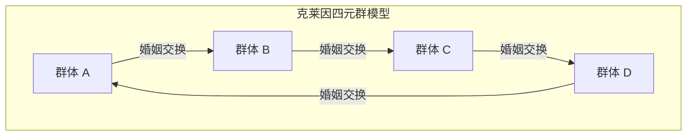

# 克洛德·列维-斯特劳斯与结构主义革命：西方中心主义的解体与“野性思维”的几何学

## 第1章：存在主义的黄昏与巴黎知识界的地震

20世纪中叶的法国思想界，处于以让-保罗·萨特为核心的存在主义强大磁场之中。萨特提出“存在先于本质”的命题，强调人类自由的主体性与社会参与（介入），为经历了第二次世界大战这一前所未有灾难的欧洲知识分子提供了新的伦理与希望之光。然而，针对这种以人类为中心、无意识地将历史进步作为前提的范式，克洛德·列维-斯特劳斯正在悄然且决定性地酝酿一场知识界的地震。

列维-斯特劳斯的思想起点，源于一种深深的“违和感”。如果从他在巴西马托格罗索州目睹的原住民生活，或者从人类宏大历史的尺度来看，存在主义那种认为主体意识可以决定一切的乐观主义，难道不只是一种极其西欧近代的、局部的自大吗？这一直觉，随着他在二战期间作为犹太裔逃避迫害、流亡美国纽约，逐渐转变为理论上的确信。在那里，他与师承俄罗斯形式主义的语言学家罗曼·雅各布森实现了命运般的相遇。

雅各布森带给他的，是发端于费尔迪南·德·索绪尔、由布拉格学派（尼古拉·特鲁别茨柯伊等人）完善的“结构语言学”及“音韵学”的严密方法论。音韵学证明了，单个音素本身并没有意义，真正生成意义的是音素与音素之间的“差异体系（关系性）”。列维-斯特劳斯直觉到，这种“在无意识层面发挥作用的关系系统”模型，不仅是解读语言，也是解读亲属关系、神话、仪式等人类所有文化的普遍钥匙。这是将结构主义引入文化人类学领域的历史性瞬间，也是解体主体和意识特权的“结构主义革命”的开端。

萨特式的存在主义将个人的“意识”与“自由选择”视为塑造历史的动力，而列维-斯特劳斯则主张，在人类主体选择的背后，存在着在无意识中运作的强大“结构”。是结构在通过主体言说，而非主体在控制结构。这种范式转移，从根本上动摇了自笛卡尔以来“我思”的优先地位。

## 第2章：《亲属关系的基本结构》（1949年）的数学冲击

1949年出版的《亲属关系的基本结构》，成为彻底改变人类学面貌的丰碑式著作。列维-斯特劳斯在此将世界各地不同社会中普遍存在的“乱伦禁忌”现象，重新定义为连接自然与文化的普遍机制。在此之前，乱伦禁忌通常被解释为防止生物学退化的本能，或是出于心理上的厌恶。但他看破了乱伦禁忌的本质并不在于“不能与谁结婚”这一消极的禁止，而在于“将自己群体的女性让渡给其他群体，并作为交换从其他群体接收女性”这一积极的“交换”规则。

在构建这一理论时，他依据的是马塞尔·莫斯的“赠礼论”。莫斯曾指出，在古风社会中，礼物是一种通过“赠予的义务、接受的义务、回礼的义务”这三种义务来形成和维持社会纽带（同盟）的机制。列维-斯特劳斯将这种赠礼逻辑应用到了亲属关系（婚姻）上。也就是说，婚姻是以女性这一最有价值的“礼物”为范式的群体间交换体系，人类借此实现了从自然法则（仅凭生物学血缘形成的封闭性）向文化法则（与他者建立开放的同盟关系）的飞跃。

更具划时代意义的是，列维-斯特劳斯在分析这种亲属结构时引入了现代数学的“群论”。在纽约时期结识的布尔巴基学派天才数学家安德烈·韦伊的帮助下，他证明了澳大利亚原住民等群体极其复杂的婚姻规则（如穆伦金人和卡里埃拉人的系统），与代数学中群（尤其是“克莱因四元群”）的结构完全同构。

克莱因四元群（Klein four-group）由4个元素组成，具有对任意元素作用两次即可还原的性质（对合），是一个交换群。列维-斯特劳斯和韦伊表明，亲属体系中的婚姻规则正是按照该群的数学性质系统地组织起来的。下面使用Mermaid图表展示其基本结构。

（※实际亲属体系中的对称与非对称交换、限定交换与一般交换的机制，通过这一数学模型首次得到了统一的理解。特别是，一般交换（A给B，B给C，C给A的循环系统）被证明是整合整个社会的强大机制。）

韦伊引入的这一代数公式化，向世界揭示了被视为“未开化”人群的亲属体系，实际上是由高度数学智慧（他们自身无意识地运用它）设计的精密几何学。西方学者曾认为“过于复杂无法理解”的亲属结构，透过群论的镜头，展现为一座具备令人惊叹的对称性与逻辑一致性的水晶。

## 第3章：《忧郁的热带》（1955年）与西方文明的黄昏

1955年出版的《忧郁的热带》，既是一部学术民族志，又是一部罕见的文学杰作和哲学反思录。这本以“我讨厌旅行和探险家”这样挑衅性的开篇起笔的著作，围绕20世纪30年代在巴西内陆马托格罗索州的田野调查回忆展开。列维-斯特劳斯在那里遇到的是卡杜韦奥人、波罗罗人、南比克瓦拉人和图皮-卡瓦希布人等原住民。

卡杜韦奥女性在脸上刺上的复杂阿拉伯式几何纹身。列维-斯特劳斯在这些不对称却经过高度计算的几何图案中，发现了他们试图象征性地解决其社会中身份制度的矛盾与紧张的无意识尝试。面部纹身并非单纯的装饰，而是为了在皮肤上调停社会结构性裂痕而具有“社会学功能”的艺术。

波罗罗人的村落结构则更具戏剧性。他们的村庄呈圆形布局，以中央广场和男性集会所为中心，严格规定了复杂的氏族与半族（胞族）的空间配置。列维-斯特劳斯解读出，这个村庄的物理布局本身，就是将他们的宇宙观、亲属关系和神话秩序可视化的“活的结构模型”。基督教传教士为了让他们改宗，最初采取的行动就是“将村庄改造成直线状”，这一事实如实地说明了空间结构的破坏直接导致了他们精神宇宙的崩塌。

而在与保留了最原始生活方式的南比克瓦拉人的交流中，列维-斯特劳斯对“文字的起源”产生了震撼性的洞察。这便是被称为“文字的教训”的著名插曲。南比克瓦拉人的首领虽然没有文字，却模仿人类学家做笔记的样子在纸上画波浪线，并假装大声朗读，以此向部落成员炫耀自己的权威。列维-斯特劳斯由此提出了一个根本性的假说：文字的发明本来或许并非为了保存知识或发展文明，而是为了便于“人对人的统治与剥削”。文字固定了法律和契约，使征税成为可能，并固化了阶层社会。西方一直将其优势的根源归结为“文字（书写）”，而这一关于文字实为压迫技术的指出，后来也对雅克·德里达对语音中心主义的批判产生了决定性的影响。

《忧郁的热带》充满了对即将消失的多样性的深深哀悼（卢梭式的乡愁）。他将西方“文明”在世界范围内将异质文化单一化、剥削和破坏的过程，比作“熵的增加”。人类学应该是一门反抗这种不可逆的熵增（不可避免地走向均质化）、并拯救刻印在人类无意识中多样结构结晶的“熵学（entropology）”，他带着悲痛的决心如此述说。

## 第4章：《野性的思维》（1962年）与修补术

1962年的《野性的思维（La Pensée sauvage）》，是结构主义最强有力的宣言，也是对以萨特为代表的历史主义与进步主义的致命一击。在这里，列维-斯特劳斯彻底解体了长期统治西方的“未开化（野性）”思维与“文明（科学）”思维之间优劣分级的等级制度。

他证明了，原住民们的思维（野性的思维）绝非不合逻辑或前逻辑的，而是与现代科学思维具有完全同等严密性的智慧。其差异并非智力上的优劣，而仅仅是“对认知对象的路径不同”。野性的思维不是提取抽象概念和普遍法则的“工程师”思维，而是受“修补术（bricolage，意即利用手头现有的东西进行拼凑、制作）”逻辑驱动的，即将手头有限的具体素材（神话的片段、动植物的分类、仪式的元素等）收集起来、重新组合并构建新的意义体系。

修补匠（bricoleur）没有为特定目的而专门定制的工具或素材。他们利用“现成的工具”，即兴地拼凑出世界的秩序。正是这种修补术的智慧，成为了孕育出世界各地神话、巫术以及图腾崇拜令人惊叹的丰富性与逻辑一致性的源泉。

特别是在对图腾崇拜的分析中，列维-斯特劳斯漂亮地驳斥了功能主义人类学家（如马林诺夫斯基）那种认为“某种动物被选为图腾是因为它具有食用价值（因为它好吃）”的功利主义解释。他说：“动物被选中不是因为它们‘好吃（bon à manger）’，而是因为它们‘好思考（bon à penser）’”。特定的动植物差异（例如“鹰与熊”、“空中的动物与地上的动物”）被用作表达人类社会群体间差异（氏族A与氏族B的关系）的“概念工具”。自然界的二元对立作为文化界二元对立的隐喻发挥作用的这个系统，正是结构主义语言学“通过差异生成意义”的完美实践。

在本书的最后一章“历史与辩证法”中，列维-斯特劳斯将无情的批判之刃指向了萨特的巨著《辩证理性批判》。萨特将历史视为绝对真理的展开过程，赋予了西欧近代社会（有历史的社会）以特权。但在列维-斯特劳斯看来，萨特的“历史”只不过是西欧知识分子为了正当化自身身份认同而捏造出来的现代神话。在没有文字和历史的“冷社会（试图维持自身结构不发生改变的社会）”与追求不断变化和进步的“热社会（西欧近代）”之间，不存在本质上的优劣。这种对萨特的强烈批判，成为宣告法国思想界霸权从存在主义完全过渡到结构主义的历史性判决。

## 第5章：《神话学》（全4卷）与卡尼格拉菲：神话的几何学与正规方程

列维-斯特劳斯学术探索的顶峰，是1964年至1971年间出版的全4卷巨著《神话学（Mythologiques）》。这部由第一卷《生食与熟食》、第二卷《从蜂蜜到烟灰》、第三卷《餐桌礼仪的起源》、第四卷《裸人》组成的超大部头著作，收集了散布在南北美洲大陆的800多个原住民神话群，并证实它们绝非毫无规律的故事堆砌，而是构成了一个巨大的“转换系统”。

神话乍看之下似乎荒诞不经、不合逻辑，是幻想的产物。然而列维-斯特劳斯看破了神话深层潜藏着严密的代数结构。个别神话并不是孤立存在的，而是通过反转其他神话、或置换其中的元素而生成的。在某个部落中被讲述为“太阳”与“水”对立的神话，在邻近部落中被置换为“美洲豹”与“人”的对立，而在更远的部落中则变形为“生肉（自然）”与“熟肉（文化）”的对立。所有这些变体，都可以被解释为共通的无意识结构的“转换（transformation）”。

将这种神话转换机制公式化的，就是著名的“正规方程（Canonical Formula）”。列维-斯特劳斯用以下数学模型表达了神话的结构：

$F_x(A) : F_y(B) \simeq F_x(B) : F_{a^{-1}}(y)$

这个方程式不仅仅是一个比喻，而是一个极其严密地描述神话逻辑转换的代数模型。
在这里，A和B是“项（termes）”，x和y代表这些项所具有的“功能（fonctions）”或属性。
公式的左边 $F_x(A) : F_y(B)$ 表示“带有功能x的项A”与“带有功能y的项B”之间的关系。
这被转换到了右边的 $F_x(B) : F_{a^{-1}}(y)$。在右边，项B继承了功能x，但同时发生了戏剧性的变化。原本的项A极性反转（$a^{-1}$），而原本作为功能的y被提升到了项的位置。这被称为“双重扭曲（double twist）”。

作为一个具体的例子，让我们考虑列维-斯特劳斯在《嫉妒的制陶女》等著作中提及的神话结构转换。
假设在某个神话（左边）中，“属于天空（x）的鹰（A）”与“属于大地（y）的熊（B）”处于对立状态。当它被转换为另一个神话（右边）时，并非只是角色的互换。会出现“属于天空（x）的熊（B）”，而作为抗衡元素的则是“大地（y）本身被拟人化为神”，原本的“鹰（A）”则被降格为“地下世界的精灵（$a^{-1}$，天空的反转）”，产生了这样的结构性扭曲。功能转化为项，项反转并转化为功能，这种如同莫比乌斯环般的拓扑学转换，在南北美洲大陆的神话链条中被无限地重复。

列维-斯特劳斯通过这种分析证明了，神话并不存在特定的“起源”或“原作者”。不是人类在讲述神话，而是“神话通过人类的无意识，在讲述自身”。人类的大脑（智力）作为一个巨大的信息处理装置（计算机）发挥着作用，它将自然界的感觉数据（生的、熟的、腐烂的等等）作为输入，利用像这正规方程一样的转换算法，输出文化秩序（亲属关系、烹饪、仪式的规则）。

此外，《神话学》特别值得一提的一点是，其整体结构深刻地依赖于“音乐的结构”。在第一卷的序言中，列维-斯特劳斯将理查德·瓦格纳赞誉为“结构分析无与伦比的先驱”，并将自己的著作按照交响曲、奏鸣曲式、赋格曲的类比进行编排。神话和音乐都有着与语言不同、“不可翻译”的时间结构。正如音乐的指导动机（Leitmotif）在和声与对位法中变奏、反转、重叠一样，神话的各元素（神话素：mytheme）也在历时性的故事推进（旋律）与共时性的结构重叠（和声）中如交响乐团般交响。

他一边引用巴赫的赋格和拉威尔的波莱罗舞曲的结构，一边精细地分析了神话的二元对立是如何形成和弦并解决不协和音的。神话空间就是一个巨大的“峡谷绘图（Canyon/Music/Myth）”，即像峡谷地层般重叠的神话素与音乐复调交织的宏大多维空间。数学方程与音乐复调——被视为西方理性最高峰的这两种形式，实际上在“野性的思维”深处早以完美的形态在运转，这一发现从根本上粉碎了西方中心主义的傲慢。

## 补遗：神话结构分析中的两座巨大里程碑（实践性案例研究）

列维-斯特劳斯的理论究竟是如何解剖具体的神话文本，并暴露潜藏其中的代数结构的？为了理解其实践的精髓，我们在此详细追踪他最具代表性的两个案例研究。这一分析如实地表明，结构主义绝不仅仅是抽象的哲学，而是对文本极其精密的外科手术。

### 案例研究1：俄狄浦斯神话的结构分析

列维-斯特劳斯在《结构人类学》（1958年）中展开的对“俄狄浦斯神话”的分析，决定性地改变了神话分析的范式。对于这个似乎已被弗洛伊德用“乱伦欲望（俄狄浦斯情结）”的心理学框架解释得淋漓尽致的希腊神话，他采取了完全不同的路径。他没有将神话作为沿时间轴的“故事（历时性推进）”来阅读，而是像管弦乐团的乐谱一样，将其作为“共时性的束（和声）”来解读。

他提取了俄狄浦斯神话的所有片段（神话素：mytheme），并将它们分类到4个垂直的列（范畴）中。
第1列是表示“过分强调血缘关系”的元素。例如卡德摩斯寻找妹妹欧罗巴，俄狄浦斯与母亲伊俄卡斯忒结婚，安提戈涅违背禁令埋葬哥哥波吕尼刻斯等。
第2列则是相反的，表示“过分贬低血缘关系（敌对）”的元素。例如俄狄浦斯杀父拉伊俄斯，兄弟厄忒俄克勒斯与波吕尼刻斯自相残杀。
第3列是表示“消灭怪物（诞生于大地的土著存在）”的元素。卡德摩斯杀死巨龙，俄狄浦斯击败斯芬克斯。
第4列是表示“步行困难（身体缺陷）”的元素。例如拉伊俄斯（左撇子、笨拙）、拉布达科斯（瘸子）、俄狄浦斯（肿胀的脚）等名字和身体特征。

由此，列维-斯特劳斯推导出的逻辑是惊人的。第1列与第2列的关系（血缘的过分强调：过分贬低），与第3列与第4列的关系（否定土生性：肯定土生性）完全平行。杀死“大地诞生的怪物（人类土著性的象征）”，意味着否定人类诞生于大地的信仰（脱离自然）。然而，步行的困难（双脚被拖在地上），则意味着人类依然被束缚在大地上（土著性）。
也就是说，俄狄浦斯神话是一个庞大的运算装置，试图在逻辑上调停古希腊社会所面临的一个根本性矛盾（疑难）：“人类究竟是男女交媾而生的（文化・生物学现实），还是从大地单性繁殖而生的（自然・神话信仰）？”。即便是弗洛伊德的心理学解释，在列维-斯特劳斯看来，也只不过是俄狄浦斯神话“最新变体（转换形态）”的其中之一而已。

### 案例研究2：“阿斯迪瓦尔传”的多层空间结构

另一个极其重要的分析，是对流传于北美太平洋西北岸钦西安人的“阿斯迪瓦尔传（La Geste d'Asdiwal）”的结构分析（1958年）。这篇论文被评价为列维-斯特劳斯神话分析中最完美结晶之一。

围绕英雄阿斯迪瓦尔的流浪与婚姻的这部长篇神话中，列维-斯特劳斯细致入微地解读出，故事在地理、经济、社会学和宇宙论4个不同层面上同时展开。
在地理层面上，阿斯迪瓦尔从东向西、从南向北移动。在经济层面上，季节从饥荒的冬天开始，过渡到鲑鱼洄游的春天，再到狩猎的夏天。在社会学层面上，他在从妻居和从夫居之间摇摆不定。在宇宙论层面上，他被撕裂在天上界（星之民）的妻子和地下世界（海之民）的妻子之间。

阿斯迪瓦尔的悲剧结局（被变成石头困在山顶），反映了钦西安社会在现实中面临的“母系社会中的从夫居”这一无法解决的结构性矛盾。在现实社会中无法解决的矛盾，在神话这一想象层面上被推至极限并走向自我崩溃，正是通过描绘这种景象，悖论般地保证了现实社会制度的合法性。
在这里，神话不再只是现实的单纯“反映”或“倒影”。神话作为一个“虚拟现实（VR）实验室”发挥作用，为了在象征层面上实验并模拟现实社会结构中所包含的裂痕与扭曲。当神话中的二元对立被扩大至极限、变得无法解决而破裂时，人们心中便会产生一种无意识的释然：“果然还是现实的社会制度（妥协的产物）比较好。”

由这些分析可以明确，结构主义神话学不是还原为元素，而是恢复元素之间“关系网络”的作业。它不是将对象细微分割的笛卡尔式解析几何，而是探求在形态变化后仍能保持的性质的拓扑学（位相几何学）尝试。俄狄浦斯肿胀的脚，或是阿斯迪瓦尔石化的身体，都不是单纯的故事装饰，而是为了描述人类社会与宇宙之间关联的、极其严密的数学函数（参数）。

（※这种多重分析手法，后来在文学理论（叙事学）中被罗兰·巴特、阿尔吉达斯·朱利安·格雷马斯等人继承，成为了文本分析不可或缺的基础语言。列维-斯特劳斯在神话中发现的这种“野性的几何学”，决定性且不可逆地改写了20世纪后半叶的知识版图。）

## 第6章：向后结构主义的连接与对现代的遗产：结构论的无意识与AI的未来

列维-斯特劳斯在《亲属关系的基本结构》和《野性的思维》中确立的结构主义范式，在1960年代之后的法国现代思想界掀起了一场决定性的风暴。剥夺“主体”、“意识”、“历史”的特权，将它们背后暗中运作的“无意识结构”推向前台，他的这种方法立刻传播到了其他学术领域。

雅克·拉康将列维-斯特劳斯关于亲属结构的交换理论与索绪尔的语言学引入精神分析学，提出了“无意识像语言一样结构化”这一著名命题。拉康痛批以自我（Ego）为中心的美国自我心理学，并将弗洛伊德的无意识重新定义为象征界（语言秩序）的网络，如果没有列维-斯特劳斯的代数学路径，拉康的尝试是不可能的。
米歇尔·福柯在《词与物》中，考古学式地发掘了规定各时代（认识型，episteme）知识的无意识框架，并宣告了“人的终结”（近代意义上“主体”的概念正如沙滩上画出的面孔被海浪抹去一般消亡）。这也是列维-斯特劳斯在《忧郁的热带》结尾将人类学定义为“熵学”、阐述人类意识企图的无力性的思想变奏。
进而，雅克·德里达解构了结构主义所前提的“中心”和“绝对起源”的存在，开启了后结构主义的大门。然而，应当被铭记的是，德里达对语音中心主义的批判，正是从对列维-斯特劳斯关于南比克瓦拉人“文字的教训”的敏锐批判性解读出发的。列维-斯特劳斯的结构主义，对于试图超越它的后结构主义思想家们来说，也是一块无法回避的巨大垫脚石。

晚年的列维-斯特劳斯在快速发展的全球化进程中，持续对文化多样性的丧失发出强烈警报。他认为，人类文化只有在存在与他者的差异（适度的距离与隔离）时，才能保持其丰富性。过度的交流和均质化，将剥夺文化的创造活力，并最终带来全人类的熵寂（热寂）。这一思想，极具预见性地包含了现代“生物多样性”与“文化多样性”不可分割的生态学愿景。跨越将自然（环境）与文化（人类）对立起来的笛卡尔二元论，从泛灵论和图腾崇拜的视角重新评估“内在自然界的智能”的今日本体论转向（例如爱德华多·维韦罗斯·德·卡斯特罗的多自然主义），也是他理论的正统继承。

此外，现代计算机科学，特别是人工智能（AI）的快速发展，为列维-斯特劳斯的结构主义带来了新的启示。大语言模型（LLM）和深度学习，在庞大的文本数据网络中计算出潜藏的“关系模式（向量空间上的差异与距离）”，并从中生成意义和逻辑的机制，正是列维-斯特劳斯所预见到的“神话的转换算法”本身。AI并未“理解”意义，而仅仅是在概率论和代数学上运算着语言符号的庞大结构矩阵（多维空间中的聚合轴与组合轴的链条）。然而，它输出的东西，在人类眼中却呈现为高度的“智能”与“故事”。
这无外乎是列维-斯特劳斯“神话通过人类的无意识讲述自身”的命题，在硅芯片与神经网络上被物理地实现。尽管没有主体意识和意图的介入，符号的差异性关系网（结构）也会自律地编织出意义的体系，结构主义的这一根本原理，讽刺的是，正借助现代AI技术以最纯粹的形式被证明。

### 结论：冰冷水晶的光芒

克洛德·列维-斯特劳斯留下的海量文本，是投射在狂热存在主义时代里的一块冰冷的水晶。他冷酷地证明了，无论人类如何呼唤自由，我们的思考始终处于语言、亲属规则、神话等先验结构的制约之下。然而，这绝非一种绝望的哲学。他在亚马逊森林深处，在原住民神话无限变奏中所发现的，绝非特定精英或“文明社会”的专利，而是全人类平等具备的普遍而精密的智慧之光。

解构西方近代傲慢的人文主义，向世界展示“野性思维”几何学之美的这一伟业，在人类中心主义因环境危机和AI崛起而遭到根本动摇的21世纪今天，恰恰散发着最应被真诚重读的现实意义。“世界开始于没有人类，也将结束于没有人类”——《忧郁的热带》中这句哀婉的预言，带给我们的不是绝望，而是在宇宙宏大结构中教导人类真正尺度的一声深邃的伦理回响。
