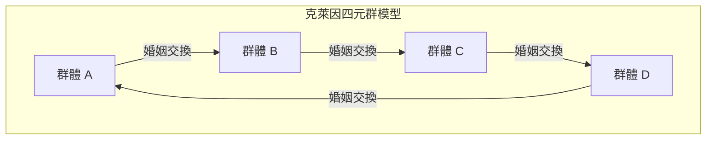

# 克勞德·李維史陀與結構主義革命：解構西方中心主義與「野性的思維」的幾何學

## 第1章：存在主義的黃昏與巴黎知識界的板塊變動

20世紀中葉的法國思想界，處於以讓-保羅·沙特為中心的存在主義強大磁場之中。沙特的哲學高舉「存在先於本質」的命題，強調人類自由的主體性與社會參與（engagement），為經歷了第二次世界大戰這場史無前例災難的歐洲知識分子，提供了新的倫理與希望之光。然而，面對這種以人類為中心、無意識地將歷史進步作為前提的典範，克勞德·李維史陀正在悄悄地、卻決定性地準備引發一場板塊變動。

李維史陀思想的出發點，源於一種深刻的「違和感」。存在主義認為主體意識能夠決定一切的樂觀態度，在他於巴西馬托格羅索州（Mato Grosso）所目睹的原住民生活，以及人類宏大歷史尺度的對照下，難道不只是一種極其近代西歐式、局部的狂妄自大嗎？這種直覺，在他於二戰期間因猶太裔身分逃避迫害、流亡美國紐約後，轉變成了理論上的確信。在那裡，他與繼承俄羅斯形式主義傳統的語言學家羅曼·雅各布森（Roman Jakobson）發生了命運般的相遇。

雅各布森帶給他的是，發端於斐迪南·德·索緒爾（Ferdinand de Saussure），並由布拉格學派（如尼古拉·特魯別茨柯伊 Nikolai Trubetzkoy 等人）所發展完善的「結構語言學」與「音韻學」的嚴密方法論。音韻學證明了，個別的音素本身並不具有意義，而是音素與音素之間的「差異體系（關係性）」才生成了意義。李維史陀直覺到，這個「在無意識層面運作的關係性系統」模型，不僅能應用於語言，更將成為解碼親屬關係、神話、儀式等所有人類文化的普遍鑰匙。這就是結構主義被引入文化人類學領域的歷史性瞬間，也是解構主體與意識特權性的「結構主義革命」的開端。

相對於沙特式存在主義將個人的「意識」與「自由選擇」視為形塑歷史的原動力，李維史陀主張，在人類主體性選擇的背後，存在著一種在無意識中運作的堅固「結構」。主體是被結構所訴說的，而不是主體在控制結構。這種典範轉移，從根本上動搖了自笛卡兒以來「我思」（Cogito）的優越性。

## 第2章：《親屬的基本結構》（1949年）的數學衝擊

1949年出版的《親屬的基本結構》，成為了徹底改變人類學面貌的紀念碑式著作。李維史陀在此將世界各地各種社會中可見的「亂倫禁忌」現象，重新理解為一座橋接自然與文化的普遍機制。在此之前，亂倫禁忌通常被解釋為防止生物學退化的本能，或是基於心理上的厭惡感。但他洞察到，亂倫禁忌的本質並不在於「不能與誰結婚」這種消極的禁止，而在於「將自己群體的女性讓渡給其他群體，作為交換從其他群體接收女性」這種積極的「交換」規則。

在建構這個理論時，他所依據的是馬塞爾·莫斯（Marcel Mauss）的「贈與論」。莫斯指出，在古老社會中，禮物是透過「贈與的義務、接受的義務、回報的義務」這三種義務，來形成與維持社會連結（同盟）的機制。李維史陀將這種贈與的邏輯應用於親屬關係（婚姻）。也就是說，婚姻是以女性這項最有價值的「禮物」為範式的群體間交換體系，人類藉此從自然的法則（僅由生物學血緣構成的封閉性）飛躍至文化的法則（與他者建立開放的同盟關係）。

更具劃時代意義的是，李維史陀在親屬結構的分析中引入了現代數學的「群論」。在紐約時期結交的布爾巴基學派（Bourbaki）天才數學家安德烈·韋伊（André Weil）的協助下，他證明了澳洲原住民等極度複雜的婚姻規則（如姆倫金族 Murngin 或卡里埃拉族 Kariera 的系統），與代數學中的群（特別是「克萊因四元群」）的結構完全同構。

克萊因四元群（Klein four-group）由四個元素組成，具有讓任意元素作用兩次即回復原狀（對合）性質的交換群。李維史陀與韋伊展示了親屬體系中的婚姻規則，是如何遵循這個群的數學性質被系統性地組織起來的。以下使用 Mermaid 的圖解來呈現其基本結構。

（※實際親屬體系中的對稱與非對稱交換、限定交換與一般交換的機制，藉由這個數學模型才首度獲得了統一的理解。特別是，一般交換（A給B，B給C，C給A的循環系統）被證明是整合整個社會的強大機制。）

韋伊這項代數公式化的引入，向世界揭示了被視為「未開化」的人們的親屬體系，其實是由高度的數學智力（他們自己是在無意識中運用它）所設計的精緻幾何學。被西方學者認為「過於複雜而無法理解」的親屬結構，透過群論的鏡頭，展現為一座具備令人屏息的對稱性與邏輯一致性的水晶。

## 第3章：《憂鬱的熱帶》（1955年）與西方文明的黃昏

1955年出版的《憂鬱的熱帶》，既是一部學術性的民族誌，也是一部罕見的文學傑作，更是一本哲學反思之書。這部著作以「我討厭旅行與探險家」這樣充滿挑釁的開場白展開，圍繞著1930年代在巴西內陸馬托格羅索州的田野調查回憶進行。李維史陀在那裡相遇的，是卡都衛歐族（Caduveo）、波洛洛族（Bororo）、南比克瓦拉族（Nambikwara）以及圖皮-卡瓦希布族（Tupi-Kawahib）等原住民。

卡都衛歐族女性在臉上施以複雜的阿拉伯式花紋刺青。李維史陀在這種不對稱卻經過高度計算的幾何紋樣中，看出了他們試圖以象徵手法解決社會中階級制度矛盾與緊張的無意識嘗試。臉部刺青並非單純的裝飾，而是一種具有「社會學功能」的藝術，用於在皮膚上調停社會結構的裂痕。

波洛洛族的村落結構則更具戲劇性。他們的村落呈圓形配置，以中央廣場和男性集會所為中心，嚴格規定了複雜的氏族與半族（Moiety）的空間配置。李維史陀解讀出，這個村落的實體配置本身，就是將他們的宇宙觀、親屬關係、神話秩序視覺化的「活生生的結構模型」。基督教傳教士為了讓他們改宗，最初採取的行動就是「將村落改建為直線狀」，這個事實生動地說明了，空間結構的破壞直接導致了他們精神宇宙的毀滅。

而在與保留著最原始生活方式的南比克瓦拉族的交流中，李維史陀對「文字的起源」產生了震撼性的洞察。這就是被稱為「文字的教訓」的著名插曲。南比克瓦拉族的酋長雖然沒有文字，卻模仿人類學家做筆記的樣子，在紙上畫波浪線，並假裝朗讀出來，藉此向族人誇耀自己的權威。李維史陀由此提出了一個根本性的假說：文字的發明原本可能不是為了保存知識或發展文明，而是為了使「人對人的統治與剝削」變得更容易。文字固定了法律與契約，使徵稅成為可能，並固化了階層社會。西方一直將「文字（écriture）」作為自身優越性的依據，但他指出這其實是一種壓迫的技術，這個觀點後來對雅克·德希達（Jacques Derrida）的語音中心主義批判也產生了決定性的影響。

《憂鬱的熱帶》充滿了對正在消逝的多樣性的深切哀悼（盧梭式的鄉愁）。他將西方「文明」將世界各地異質文化加以單一化、剝削與破壞的過程，比喻為「熵的增加」。他帶著悲痛的決心說道，人類學應該是一門對抗這種不可逆的熵增（走向同質化的不可避免的步伐），拯救銘刻在人類無意識中多樣結構結晶的「熵學（entropology）」。

## 第4章：《野性的思維》（1962年）與拼湊（Bricolage）

1962年的《野性的思維》（La Pensée sauvage），是結構主義最強而有力的宣言，也是對以沙特為代表的歷史主義與進步主義的致命一擊。在這裡，李維史陀徹底解構了長期統治西方的「未開化（野性）」思維與「文明（科學）」思維之間優劣的等級制度。

他證明了原住民的思維（野性的思維）絕非不合邏輯或前邏輯的，而是與現代科學思維完全同等嚴密的智力。其差異並不在於智力能力的優劣，而僅僅是「對知識對象的切入方式不同」。野性的思維不是萃取抽象概念或普遍法則的「工程師」思維，而是由一種「拼湊（bricolage，即修補匠的工作）」邏輯所驅動，它收集手邊有限的具體素材（神話的片段、動植物的分類、儀式的元素等），將其重新組合並建構出新的意義體系。

拼湊者（bricoleur）沒有為了特定目的而特化的工具或素材。他們使用「手邊現有的工具」，即興地組裝出世界的秩序。正是這種拼湊的智力，成為了孕育出世界各地神話、巫術以及圖騰信仰（Totemism）驚人豐富性與邏輯一致性的源泉。

特別是在對圖騰信仰的分析中，李維史陀漂亮地駁斥了功能主義人類學家（如馬林諾夫斯基 Malinowski 等）所主張的「某種動物被選為圖騰，是因為它作為食物很有用（因為它好吃）」的功利主義解釋。他說：「動物被選中不是因為好吃，而是因為好思考（bon à penser）。」特定的動植物差異（例如「老鷹與熊」、「天空的動物與地上的動物」），被用作表現人類社會群體間差異（氏族A與氏族B的關係）的「概念工具」。自然界的二元對立，作為文化界二元對立的隱喻而發揮作用，這個系統正是結構主義語言學中「因差異生成意義」的完美實踐。

在本書的最終章〈歷史與辯證法〉中，李維史陀對沙特的鉅著《辯證理性批判》拔出了無情的批判之刃。沙特將歷史視為絕對真理的展開過程，並賦予西歐近代社會（擁有歷史的社會）特權。但在李維史陀看來，沙特的「歷史」，不過是西歐知識分子為了正當化自身認同而捏造的現代神話。在沒有文字與歷史的「冷社會」（試圖在不改變自身結構的情況下維持下去的社會），與追求不斷變化與進步的「熱社會」（西歐近代）之間，本質上並不存在優劣之分。這種對沙特的痛烈批判，成為了宣告法國思想界的霸權已從存在主義完全轉移至結構主義的歷史性判決。

## 第5章：《神話學》（全4卷）與峽谷地理學（Canyongraphy）：神話的幾何學與正則方程式

李維史陀學術探索的頂峰，是從1964年到1971年間出版的、由四卷組成的巨著《神話學》（Mythologiques）。這部包含第一卷《生食與熟食》、第二卷《從蜂蜜到煙灰》、第三卷《餐桌禮儀的起源》與第四卷《裸人》的超大作，收集了散佈在南北美洲大陸上的800多個原住民神話群，並證實了這些神話並非單純隨機的故事堆疊，而是構成了一個巨大的「轉換系統」。

神話乍看之下似乎是荒誕無稽、不合邏輯的幻想產物。但李維史陀洞察到，神話的深層潛藏著嚴密的代數結構。個別的神話並非孤立存在，而是透過反轉其他神話或置換元素而生成的。在某個部落中被講述為「太陽」與「水」之對立的神話，在相鄰部落中被置換為「美洲豹」與「人」的對立，而在更遙遠的部落中，則變形為「生肉（自然）」與「熟肉（文化）」的對立。這些變奏全都可以被解釋為共同無意識結構的「轉換（transformation）」。

將這種神話轉換機制公式化的，就是著名的「正則方程式（Canonical Formula）」。李維史陀用以下的數學模型來表現神話的結構：

$F_x(A) : F_y(B) \simeq F_x(B) : F_{a^{-1}}(y)$

這個方程式並非單純的比喻，而是極度嚴密地描述神話邏輯轉換的代數模型。
在這裡，A與B是「項（termes）」，x與y則代表這些項所具有的「功能（fonctions）」或屬性。
方程式左邊 $F_x(A) : F_y(B)$ 表示「帶有功能x的項A」與「帶有功能y的項B」的關係。
這轉換成了右邊 $F_x(B) : F_{a^{-1}}(y)$。在右邊，項B繼承了功能x，但同時發生了戲劇性的變化。原本的項A反轉了其極性（$a^{-1}$），而原本應該是功能的y則被提升到項的位置。這被稱為「雙重扭轉（double twist）」。

作為具體的例子，讓我們思考李維史陀在《嫉妒的製陶女》等著作中提及的神話結構轉換。
假設在某個神話（左邊）中，「屬於天空（x）的老鷹（A）」與「屬於大地（y）的熊（B）」處於對立。當這轉換為另一個神話（右邊）時，並非單純地互換角色。而是出現了「屬於天空（x）的熊（B）」，而作為對抗元素的則是「大地（y）本身被擬人化後的神」，原本的「老鷹（A）」則被降格為「地下世界的靈（$a^{-1}$，天空的反轉）」，產生了這種結構性的扭曲。功能轉化為項，項反轉後轉化為功能，這種猶如莫比烏斯環般的拓樸學轉換，在南北美洲大陸的神話鎖鏈中無限地重複著。

李維史陀透過這種分析證明了，神話並不存在特定的「起源」或「原作者」。不是人類在訴說神話，而是「神話透過人類的無意識，訴說著神話自身」。人類的大腦（智力）將自然界的感官數據（生的、熟的、腐敗的等）作為輸入，並使用如這個正則方程式般的轉換演算法，輸出文化秩序（親屬、烹飪、儀式的規則），發揮著如同巨大資訊處理裝置（計算機）般的功能。

此外，《神話學》特別值得一提的是，其整體結構深深地依賴於「音樂的結構」。在第一卷的序言中，李維史陀讚揚理察·華格納（Richard Wagner）為「無與倫比的結構分析先驅」，並以交響曲、奏鳴曲式與賦格的比喻來構成自己的著作。神話與音樂一樣，擁有不同於語言、「不可翻譯」的時間結構。正如音樂的主導動機（Leitmotif）在和聲與對位法中被變奏、反轉與重疊一樣，神話的各個元素（神話素 Mytheme）也同樣在歷時性的故事進展（旋律）與共時性的結構重疊（和聲）中，如管弦樂團般交相呼應。

他引用巴哈的賦格與拉威爾的波麗露結構，細緻地分析了神話的二元對立如何形成和弦，並解決不和諧音。神話空間是一個巨大的「峽谷地理學（Canyon/Music/Myth）」，亦即如峽谷地層般層層疊疊的神話素與音樂的複調音樂（Polyphony）交會的宏大多維空間。數學方程式與音樂的複調音樂，這些被視為西方理性最高峰的形式，其實早就在「野性的思維」深處以完美的型態運作著，這項發現從根本上粉碎了西方中心主義的傲慢。

## 補遺：神話結構分析中的兩座巨大里程碑（實踐性案例研究）

李維史陀的理論究竟是如何解剖具體的神話文本，並揭露出潛藏其中的代數結構呢？為了理解他實踐上的真髓，我們在此詳細追溯他的兩個代表性案例研究。這項分析生動地展示了結構主義並非單純的抽象哲學，而是對文本進行極度精密的「外科手術」。

### 案例研究1：伊底帕斯神話的結構分析

李維史陀在《結構人類學》（1958年）中展開的「伊底帕斯神話」分析，決定性地改變了神話分析的典範。對於這個似乎已被佛洛伊德以「亂倫慾望（伊底帕斯情結）」心理學框架解釋殆盡的希臘神話，他採取了完全不同的路徑。他不是將神話當作沿著時間軸前進的「故事（歷時性進展）」來讀，而是像管弦樂團的總譜（score）一樣，將其解讀為「共時性的束（和聲）」。

他抽取出伊底帕斯神話的所有片段（神話素），並將它們分類為4個垂直的列（類別）。
第1列是顯示「血緣關係被過度評價」的元素。如卡德摩斯尋找妹妹歐羅巴，伊底帕斯與母親伊俄卡斯忒結婚，安提戈涅打破禁令埋葬哥哥波呂尼刻斯等。
第2列則相反，是顯示「血緣關係被低估（敵對）」的元素。伊底帕斯殺死父親拉伊俄斯，兄弟厄忒俄克勒斯與波呂尼刻斯互相殘殺。
第3列是顯示「消滅怪物（從大地誕生的土著存在）」的元素。卡德摩斯殺死龍，伊底帕斯打敗人面獅身獸。
第4列是顯示「行走困難（身體缺陷）」的元素。拉伊俄斯（左撇子、笨拙）、拉布達科斯（跛腳）、伊底帕斯（腫脹的腳）等名字或身體特徵。

李維史陀由此推導出的邏輯令人驚嘆。第1列與第2列的關係（血緣的過度評價：低估），與第3列與第4列的關係（自生性的否定：自生性的肯定）完全平行。「殺死從大地誕生的怪物（人類土著性的象徵）」，意味著否定人類從大地誕生這種信仰（脫離自然）。然而，行走困難（腳拖在地上），意味著人類依然被束縛在大地上（土著性）。
也就是說，伊底帕斯神話是一台巨大的運算裝置，試圖邏輯性地調停古代希臘社會所面臨的根本矛盾（無解難題）：「人類究竟是由男女交媾而生（文化、生物學現實），還是從大地單性生殖而生（自然、神話信仰）？」即使是佛洛伊德的心理學解釋，在李維史陀看來，也不過是伊底帕斯神話的「最新變奏（轉換型態）」之一罷了。

### 案例研究2：「阿斯迪瓦爾事蹟」的多層次空間結構

另一個極其重要的分析，是對流傳於北美太平洋西北岸欽西安族（Tsimshian）的「阿斯迪瓦爾事蹟（La Geste d'Asdiwal）」的結構分析（1958年）。這篇論文被評為李維史陀神話分析中最完美的結晶之一。

在這個圍繞著英雄阿斯迪瓦爾的流浪與結婚的長篇神話中，李維史陀細緻地解讀出，故事同時在地理、經濟、社會學與宇宙論這四個不同的層次上展開。
在地理層次上，阿斯迪瓦爾由東向西、由南向北移動。在經濟層次上，從飢荒的冬天開始，經歷鮭魚溯河而上的春天，再轉換到狩獵的夏天。在社會學層次上，他在從妻居婚與從夫居婚之間搖擺不定。在宇宙論層次上，他則被撕裂在天界（星之民）的妻子與地下世界（海之民）的妻子之間。

阿斯迪瓦爾悲劇性的結局（被變成石頭困在山頂），反映了欽西安族社會在現實中遭遇的「母系社會中的從夫居」這種無法解決的結構性矛盾。在現實社會中無法解決的矛盾，在神話這個想像的層次被推至極限，藉由描繪其自我崩潰的模樣，反而逆向地擔保了現實社會制度的正當性。
在此，神話已不再是現實單純的「反映」或「倒影」。神話發揮著作為「虛擬實境（VR）實驗室」的功能，在象徵層面上對現實社會結構所包含的裂縫與扭曲進行實驗與模擬。當神話中的二元對立被擴張到極限，變得無法解決而破裂時，人們的心中會產生一種無意識的安心感：「果然還是現實的社會制度（妥協的產物）比較好。」

從這些分析可以明顯看出，結構主義的神話學，並不是將事物還原為元素，而是復原元素之間「關係性網絡」的作業。這不是將對象細微分割的笛卡兒式分析幾何學，而是探求即使形狀改變仍能保持性質的拓樸學（位相幾何學）嘗試。伊底帕斯腫脹的腳，以及阿斯迪瓦爾石化的身體，都不只是單純的故事裝飾，而是為了描述人類社會與宇宙之間關聯的、極其嚴密的數學函數（參數）。

（※這種多層次的分析手法，後來在文學理論（敘事學 Narratology）中被羅蘭·巴特（Roland Barthes）與阿爾吉達斯·朱利安·格雷馬斯（Algirdas Julien Greimas）等人繼承，成為了文本分析不可或缺的基礎語言。李維史陀在神話中發現的這種「野性的幾何學」，決定性且不可逆轉地改寫了20世紀後半葉的知識版圖。）

## 第6章：與後結構主義的連結及對現代的遺產：結構論的無意識與AI的未來

李維史陀在《親屬的基本結構》與《野性的思維》中所建立的結構主義典範，在1960年代以後的法國現代思想界掀起了決定性的風暴。他剝奪了「主體」、「意識」、「歷史」的特權，並將在背後秘密運作的「無意識結構」推向前景的手法，立刻傳播到了其他的學問領域。

雅各·拉岡（Jacques Lacan）將李維史陀親屬結構的交換理論與索緒爾的語言學導入精神分析，提出了「無意識是像語言一樣結構起來的」這句著名的命題。拉岡痛烈地批判了以自我（ego）為中心的美國自我心理學，並將佛洛伊德的無意識重新定義為象徵界（語言秩序）的網絡，他的這項嘗試如果沒有李維史陀的代數學方法是無法實現的。
米歇爾·傅柯（Michel Foucault）在《詞與物》中，考古學式地發掘了規定各個時代（認識型 Episteme）知識的無意識框架，並宣告了「人的終結」（近代「主體」這個概念將如同畫在沙灘上的臉被海浪抹去一般消失）。這也是李維史陀在《憂鬱的熱帶》結尾將人類學定義為「熵學」，並說明人類意識企圖之無力的思想變奏。
進一步地，雅克·德希達解構了結構主義所前提的「中心」或「絕對起源」的存在，開啟了後結構主義的大門。然而，應該被記住的是，德希達的語音中心主義批判，是從對李維史陀南比克瓦拉族「文字的教訓」敏銳的批判性解讀出發的。李維史陀的結構主義，對於試圖超越他的後結構主義思想家們而言，也是一塊無法迴避的巨大墊腳石。

晚年的李維史陀在快速推進的全球化中，對文化多樣性的喪失持續敲響了強烈的警鐘。他認為，人類的文化只有在存在與他者的差異（適度的距離與隔離）時，才能保持豐富。過度的交流與同質化，會奪走文化的創造力，最終將帶來全人類的熵寂（熱寂）。這種思想，是極具生態學視野的願景，它預示了現代「生物多樣性」與「文化多樣性」的不可分割性。克服將自然（環境）與文化（人類）視為對立的笛卡兒式二元論，從泛靈論或圖騰信仰的視角重新評價「自然界內在的智力」的今日存在論轉向（如愛德華多·維維耶羅斯·德·卡斯特羅 Eduardo Viveiros de Castro 的多重自然主義），也是他理論的正統繼承者。

此外，現代計算機科學，特別是人工智慧（AI）的快速發展，為李維史陀的結構主義帶來了新的光芒。大型語言模型（LLM）與深度學習，藉由計算處理潛藏在巨大文本數據網絡中的「關係性模式（向量空間上的差異與距離）」，並從中生成意義與邏輯的機制，正是李維史陀所預見的「神話轉換演算法」本身。AI並不是在「理解」意義，它只不過是在對語言符號巨大的結構性矩陣（多維空間中的聚合與組合的鎖鏈）進行機率論與代數學的運算而已。然而，從那裡輸出的東西，在人類眼中卻呈現出高度的「智能」與「故事」。
這無非是李維史陀「神話透過人類的無意識訴說自身」的命題，在矽晶片與神經網絡上被物理實作的情況。不需要主體意識與意圖的介入，符號差異性的關係網（結構）就會自律地編織出意義體系，這種結構主義的根本原理，諷刺地正被現代的AI技術以最純粹的形式證明著。

### 結論：冰冷水晶的光芒

克勞德·李維史陀所留下的龐大文本，是投入狂熱存在主義時代的一顆冰冷水晶。他冷酷地證明了，無論人類如何高呼自由，我們的思維始終處於語言、親屬規則、神話等先驗結構的制約之下。但這絕不是絕望的哲學。他在亞馬遜森林深處，以及原住民神話的無限變奏中所發現的，不是特定菁英或「文明社會」的專屬物，而是平等地具備於全人類的、普遍而精緻的智力光芒。

分解了西方近代傲慢的人文主義，並將「野性的思維」幾何學般的美感展示給世界的這項偉業，在人類中心主義因環境危機與AI崛起而從根本上動搖的21世紀今天，正散發著最應該被真誠重讀的現實意義。「世界在沒有人類的情況下開始，也將在沒有人類的情況下結束」——《憂鬱的熱帶》中這句悲哀的預言，帶給我們的不是絕望，而是教導我們在宇宙宏大結構中人類真正尺度的深遠倫理迴響。
