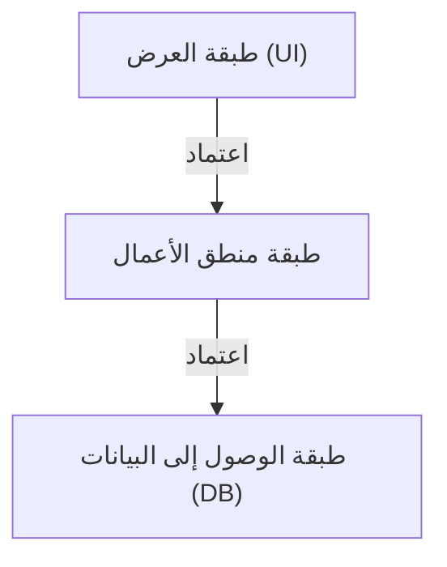
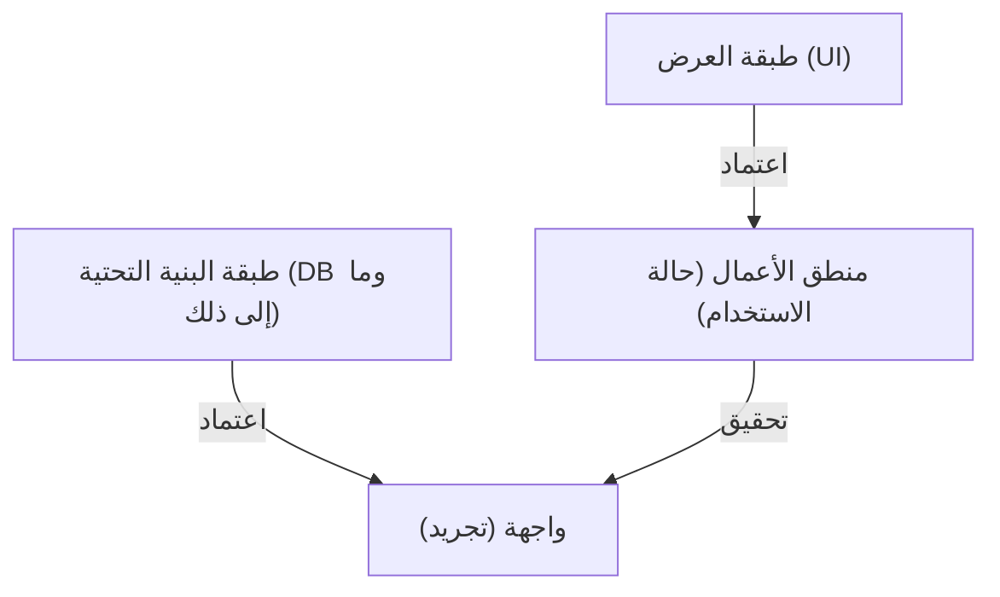

## 1. مقدمة: لماذا نحتاج إلى البنية؟

في تاريخ تطوير البرمجيات، مع زيادة حجم الأنظمة، أصبحت 'القابلية للصيانة'، 'القابلية للاختبار'، و'القدرة على تحمل التغييرات' دائماً تحديات كبيرة. كانت البنية ثلاثية الطبقات (MVC: Model-View-Controller)، التي كانت سائدة في تطوير الويب المبكر، تقنية رائدة تفصل بين طبقة العرض وطبقة الوصول إلى البيانات.

ومع ذلك، كان للبنية التقليدية ثلاثية الطبقات حدود كبيرة. وهي أنها غالباً ما تصبح 'مدفوعة بقاعدة البيانات'. كان هناك مشكلة تتمثل في أن منطق الأعمال (المجال) يعتمد على طبقة الوصول إلى البيانات، وبالتالي يقترن بشدة بتقنية قاعدة بيانات معينة أو ORM.

لحل هذه المشكلة، تم اقتراح 'البنية السداسية' (Hexagonal Architecture) بواسطة أليستير كوكبيرن (Alistair Cockburn)، و'البنية البصلية' (Onion Architecture) بواسطة جيفري باليرمو (Jeffrey Palermo)، و'البنية النظيفة' (Clean Architecture) بواسطة العم بوب (Robert C. Martin). على الرغم من التعبير عنها بأسماء ورسومات مختلفة، إلا أن الفلسفة الأساسية مشتركة بشكل مذهل.

## 2. حدود البنية ثلاثية الطبقات والاعتماد على قاعدة البيانات

في البنية التقليدية ثلاثية الطبقات، تتدفق التبعيات من أعلى إلى أسفل كما يلي:

المشكلة الأكبر في هذا الهيكل هي أن منطق الأعمال يعتمد على طبقة الوصول إلى البيانات (البنية التحتية). أي أن قواعد الأعمال تتأثر بطريقة إصدار استعلامات SQL وهيكل جداول قاعدة البيانات. عند محاولة تغيير قاعدة البيانات أو تقديم إطار عمل جديد، يتسبب ذلك في كابوس انتشار التعديلات عبر منطق الأعمال بالكامل.

## 3. سلسلة البنيات الثلاث

### 3.1 البنية السداسية (Ports and Adapters)
تهدف هذه البنية، التي اقترحها أليستير كوكبيرن وتُعرف أيضاً باسم 'المنافذ والمحولات' (Ports and Adapters)، إلى فصل جوهر التطبيق (منطق الأعمال) عن الخارج (واجهة المستخدم، قاعدة البيانات، الاختبارات، إلخ). يوفر التطبيق ويطلب واجهات تسمى 'المنافذ' (Ports)، ويتصل العالم الخارجي بهذه المنافذ من خلال 'المحولات' (Adapters).

### 3.2 البنية البصلية
تم اقتراحها من قبل جيفري باليرمو. تضع نموذج المجال في المركز، وتحيط به خدمات المجال، ثم خدمات التطبيق، وفي الطبقة الخارجية توجد البنية التحتية وواجهة المستخدم. حددت بوضوح قاعدة أن التبعيات يجب أن تتجه دائماً من 'الخارج إلى الداخل'.

### 3.3 البنية النظيفة
البنية التي أعلن عنها العم بوب. تشتهر برسمها للدوائر المتراكزة، حيث تضع الكيانات (قواعد الأعمال على مستوى المؤسسة) في المركز، وحالات الاستخدام (قواعد الأعمال الخاصة بالتطبيق) في الخارج، ثم وحدات التحكم والبوابات، وأخيراً التفاصيل مثل الويب وقواعد البيانات (البنية التحتية) في الطبقة الخارجية.

## 4. الفلسفة المشتركة في الصميم: مبدأ انعكاس التبعية (DIP)

تتخذ جميع هذه البنيات الثلاث نهج 'وضع منطق الأعمال في المركز (الداخل)، ووضع البنية التحتية وأطر العمل في الخارج'. والسلاح القوي لتحقيق هذا الهيكل هو 'مبدأ انعكاس التبعية' (Dependency Inversion Principle: DIP).

DIP هو حرف 'D' في مبادئ SOLID، ويتكون من القاعدتين التاليتين:
1. يجب ألا تعتمد وحدات المستوى الأعلى على وحدات المستوى الأدنى. يجب أن يعتمد كلاهما على 'التجريدات'.
2. يجب ألا تعتمد التجريدات على 'التفاصيل'. يجب أن تعتمد التفاصيل على 'التجريدات'.

في هذه البنيات، يتم استخدام DIP لـ 'عكس' التبعيات التقليدية.

لا يحتاج منطق الأعمال إلى معرفة مكان حفظ البيانات. بل يعتمد فقط على 'وظيفة حفظ البيانات (الواجهة)'. ثم تقوم طبقة البنية التحتية بتنفيذ تلك الواجهة. هذا يعكس التبعية لتصبح 'البنية التحتية ← منطق الأعمال'، مما يسمح لمنطق الأعمال بأن يكون مستقلاً تماماً عن جميع العناصر الخارجية.

## 5. أهمية فصل طبقة البنية التحتية

لماذا نفصل البنية التحتية إلى هذا الحد؟

1. **القابلية للاختبار (Testability):** يمكنك اختبار منطق الأعمال بمفرده بسرعة وموثوقية باستخدام كائنات وهمية (Mocks) بدون قاعدة بيانات أو واجهات برمجة تطبيقات (API) خارجية.
2. **تأجيل القرارات (Deferring Decisions):** لن تحتاج إلى تحديد قاعدة البيانات أو إطار عمل الويب في المراحل الأولى من المشروع. يمكنك بناء منطق الأعمال الأساسي أولاً وتأجيل تفاصيل البنية التحتية لوقت لاحق.
3. **التحرر من إطار العمل:** عمر قواعد الأعمال أطول بكثير من عمر إطار العمل. يمنع هذا منطق الأعمال من التأثر بترقيات وتغييرات إطار العمل.

## الخلاصة

البنية النظيفة، البنية السداسية، والبنية البصلية. على الرغم من اختلاف المصطلحات وطرق رسم المخططات، إلا أن الأهداف والوسائل متطابقة تماماً. وهي 'وضع جوهر الأعمال في المركز، وفصل الاهتمامات، وعكس التبعيات لإنشاء نظام مستدام وقوي ضد التغيرات في البيئة الخارجية'.
