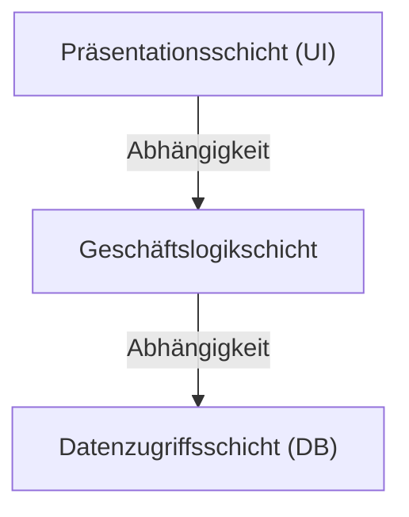
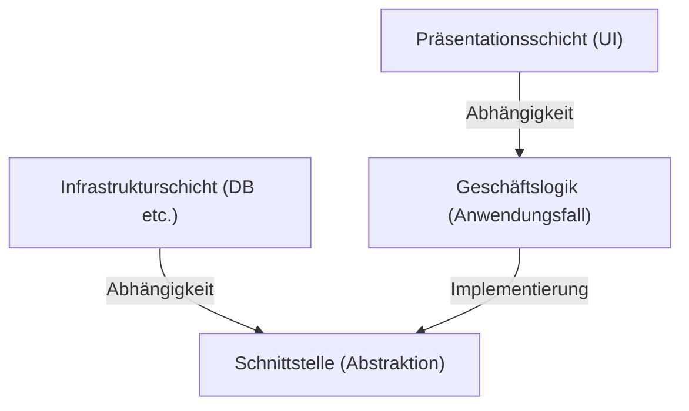

## 1. Einführung: Warum brauchen wir Architektur?

In der Geschichte der Softwareentwicklung waren „Wartbarkeit“, „Testbarkeit“ und „Widerstandsfähigkeit gegenüber Änderungen“ mit zunehmender Systemgröße schon immer Herausforderungen. Die 3-Schichten-Architektur (MVC: Model-View-Controller), die in den Anfängen der Webentwicklung vorherrschend war, war eine bahnbrechende Methode, die die Präsentationsschicht von der Datenzugriffsschicht trennte.

Allerdings hatte die traditionelle 3-Schichten-Architektur eine große Einschränkung. Sie neigte dazu, „datenbankgesteuert“ zu sein. Es gab das Problem, dass die Geschäftslogik (Domain) von der Datenzugriffsschicht abhängig war und folglich stark an bestimmte Datenbanktechnologien oder ORMs gebunden war.

Um dieses Problem zu lösen, wurden die „Hexagonale Architektur“ von Alistair Cockburn, die „Onion Architecture“ von Jeffrey Palermo und die „Clean Architecture“ von Uncle Bob (Robert C. Martin) vorgeschlagen. Obwohl sie mit unterschiedlichen Namen und Diagrammen dargestellt werden, ist die zugrunde liegende Philosophie überraschend ähnlich.

## 2. Die Grenzen der 3-Schichten-Architektur und Datenbankabhängigkeit

In der traditionellen 3-Schichten-Architektur fließen die Abhängigkeiten von oben nach unten, wie folgt:

Das größte Problem dieser Struktur ist, dass die Geschäftslogik von der Datenzugriffsschicht (Infrastruktur) abhängig ist. Das bedeutet, dass die Geschäftsregeln davon beeinflusst werden, wie SQL-Abfragen erstellt werden oder wie die Tabellenstruktur der Datenbank aussieht. Wenn Sie versuchen, die Datenbank zu ändern oder ein neues Framework einzuführen, führt dies zu einem Albtraum, bei dem sich die Änderungen auf die gesamte Geschäftslogik auswirken.

## 3. Die Abstammungslinie der drei Architekturen

### 3.1 Hexagonale Architektur (Ports and Adapters)
Diese von Alistair Cockburn vorgeschlagene Architektur wird auch als „Ports and Adapters“ bezeichnet. Ihr Zweck ist es, den Kern der Anwendung (Geschäftslogik) von der Außenwelt (UI, Datenbank, Tests usw.) zu trennen. Die Anwendung stellt Schnittstellen bereit und fordert diese an, die „Ports“ genannt werden, und die Außenwelt verbindet sich über „Adapter“ mit diesen Ports.

### 3.2 Onion Architecture
Von Jeffrey Palermo vorgeschlagen. Das Domänenmodell steht im Zentrum, umgeben von Domänendiensten, Anwendungsdiensten und am weitesten außen der Infrastruktur und UI. Er definierte klar die Regel, dass Abhängigkeiten immer von „außen nach innen“ gerichtet sein müssen.

### 3.3 Clean Architecture
Eine von Uncle Bob vorgestellte Architektur. Bekannt durch ihr konzentrisches Diagramm, platziert sie Entitäten (unternehmensweite Geschäftsregeln) im Zentrum, Anwendungsfälle (anwendungsspezifische Geschäftsregeln) auf der nächsten Ebene nach außen, gefolgt von Controllern und Gateways, und ganz außen die Details wie Web oder DB (Infrastruktur).

## 4. Die gemeinsame Kernphilosophie: Dependency Inversion Principle (DIP)

Alle diese drei Architekturen verfolgen den Ansatz, „die Geschäftslogik ins Zentrum (nach innen) zu rücken und die Infrastruktur und Frameworks nach außen zu verlagern“. Die mächtige Waffe zur Umsetzung dieser Struktur ist das „Dependency Inversion Principle (DIP)“.

DIP entspricht dem „D“ in den SOLID-Prinzipien und hat die folgenden zwei Regeln:
1. Module höherer Ebenen sollten nicht von Modulen niedrigerer Ebenen abhängen. Beide sollten von Abstraktionen abhängen.
2. Abstraktionen sollten nicht von Details abhängen. Details sollten von Abstraktionen abhängen.

In diesen Architekturen wird DIP verwendet, um traditionelle Abhängigkeiten „umzukehren“.

Die Geschäftslogik muss nicht wissen, wo die Daten gespeichert sind. Sie ist nur von der „Funktion (Schnittstelle) zum Speichern von Daten“ abhängig. Die Infrastrukturschicht implementiert dann diese Schnittstelle. Dadurch wird die Abhängigkeitsrichtung zu „Infrastruktur → Geschäftslogik“ umgekehrt, wodurch die Geschäftslogik vollständig unabhängig von allen externen Elementen wird.

## 5. Die Bedeutung der Trennung der Infrastrukturschicht

Warum so viel Aufwand betreiben, um die Infrastruktur zu trennen?

1. **Testbarkeit (Testability):** Die Geschäftslogik kann isoliert mit Mocks schnell und zuverlässig getestet werden, ohne dass eine Datenbank oder externe APIs erforderlich sind.
2. **Aufgeschobene Entscheidungen (Deferring Decisions):** Es besteht keine Notwendigkeit, sich in den frühen Phasen eines Projekts für eine Datenbank oder ein Web-Framework zu entscheiden. Sie können zuerst die Kerngeschäftslogik aufbauen und die Infrastrukturdetails auf später verschieben.
3. **Befreiung von Frameworks:** Die Lebensdauer von Geschäftsregeln ist viel länger als die von Frameworks. Es verhindert, dass die Geschäftslogik in Framework-Upgrades oder -Änderungen verwickelt wird.

## Zusammenfassung

Clean Architecture, Hexagonale Architektur und Onion Architecture. Obwohl sich ihre Zeichenstile und Terminologien unterscheiden, sind ihre Ziele und Mittel völlig gleich. Es geht darum, „den Geschäftskern ins Zentrum zu rücken, Belange zu trennen und Abhängigkeiten umzukehren, um ein nachhaltiges System zu schaffen, das widerstandsfähig gegenüber Veränderungen in der externen Umgebung ist“.
