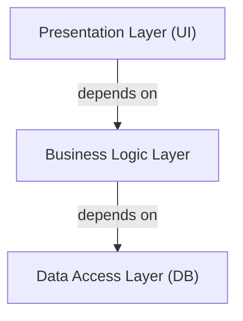
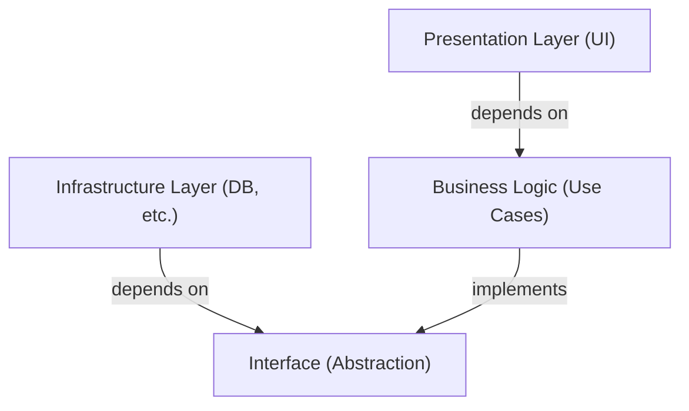

## 1. Introduction: Why do we need an architecture?

In the history of software development, as systems grow larger, "maintainability", "testability", and "resilience to change" have always been challenges. The 3-tier architecture (MVC: Model-View-Controller), which was mainstream in early web development, was an innovative approach to separating the presentation layer and the data access layer.

However, the traditional 3-tier architecture had significant limitations. It tended to become "database-driven". There was a problem where the business logic (domain) depended on the data access layer, ultimately coupling tightly with specific database technologies and ORMs.

To solve this problem, Alistair Cockburn proposed the "Hexagonal Architecture", Jeffrey Palermo proposed the "Onion Architecture", and Uncle Bob (Robert C. Martin) proposed the "Clean Architecture". Although they are represented by different names and diagrams, their underlying philosophies are surprisingly common.

## 2. Limitations of the 3-Tier Architecture and DB Dependency

The traditional 3-tier architecture has dependencies flowing from top to bottom as follows:

The biggest problem with this structure is that the business logic depends on the data access layer (infrastructure). This means that business rules are dragged down by how SQL is issued or the table structure of the database. Changing the database or introducing a new framework causes a nightmare where modifications ripple through the entire business logic.

## 3. Genealogy of the 3 Architectures

### 3.1 Hexagonal Architecture (Ports and Adapters)
Proposed by Alistair Cockburn, this architecture is also known as "Ports and Adapters". Its goal is to separate the core of the application (business logic) from the outside (UI, database, testing, etc.). The application provides and requests interfaces called "ports", and the outside world connects to these ports through "adapters".

### 3.2 Onion Architecture
Proposed by Jeffrey Palermo. It places the domain model at the center, surrounded by domain services, application services, and outermost, infrastructure and UI. It clearly defined the rule that dependencies always flow "from the outside in".

### 3.3 Clean Architecture
An architecture announced by Uncle Bob. It is famous for its concentric circle diagram, placing entities (enterprise-wide business rules) at the center, use cases (application-specific business rules) outside them, controllers and gateways further out, and details like Web and DB (infrastructure) outermost.

## 4. The Common Philosophy at the Core: Dependency Inversion Principle (DIP)

All three of these architectures take the approach of "placing business logic at the center (inside) and infrastructure and frameworks on the outside". The powerful weapon to realize this structure is the "Dependency Inversion Principle (DIP)".

DIP corresponds to the "D" in the SOLID principles and has the following two rules:
1. High-level modules should not depend on low-level modules. Both should depend on "abstractions".
2. Abstractions should not depend on "details". Details should depend on "abstractions".

In these architectures, DIP is used to "invert" traditional dependencies.

The business logic does not need to know where the data is saved. It depends only on the "function to save data (interface)". The infrastructure layer then implements that interface. This inverts the dependency to "Infrastructure -> Business Logic", making the business logic completely independent of any external elements.

## 5. Importance of Separating the Infrastructure Layer

Why go to such lengths to separate the infrastructure?

1. **Testability:** Business logic alone can be tested quickly and reliably using mocks without databases or external APIs.
2. **Deferring Decisions:** There is no need to decide on a database or web framework in the early stages of a project. Core business logic can be built first, and infrastructure details can be postponed.
3. **Liberation from Frameworks:** The lifespan of business rules is much longer than the lifespan of a framework. It prevents business logic from getting caught up in framework version upgrades or changes.

## Summary

Clean Architecture, Hexagonal Architecture, and Onion Architecture. Although their diagrams and terminology differ, their goals and means are completely identical. That is, "to create a sustainable system resilient to changes in the external environment by placing the core of the business at the center, separating concerns, and inverting dependencies."
