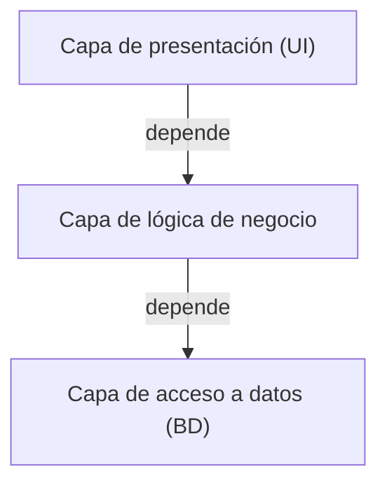
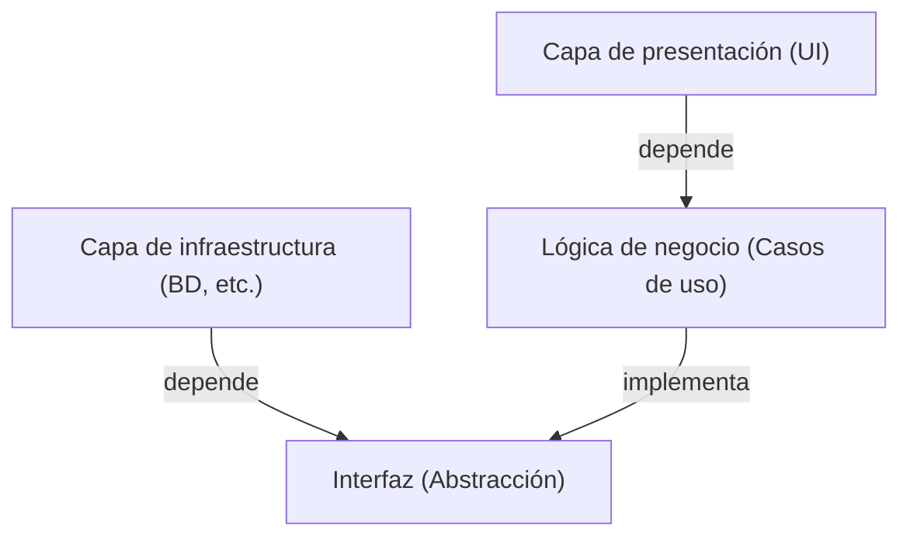

## 1. Introducción: ¿Por qué necesitamos una arquitectura?

En la historia del desarrollo de software, a medida que los sistemas crecen, la "mantenibilidad", la "facilidad de prueba" y la "resistencia al cambio" siempre han sido desafíos. La arquitectura de 3 capas (MVC: Modelo-Vista-Controlador), que fue la corriente principal en los inicios del desarrollo web, fue un enfoque revolucionario para separar la capa de presentación y la capa de acceso a datos.

Sin embargo, la arquitectura de 3 capas tradicional tenía grandes limitaciones. Tendía a estar "impulsada por la base de datos". El problema era que la lógica de negocio (dominio) dependía de la capa de acceso a datos y, a su vez, estaba fuertemente acoplada a tecnologías de bases de datos específicas o ORMs.

Para resolver este problema, se propusieron la "Arquitectura Hexagonal" de Alistair Cockburn, la "Arquitectura Cebolla" de Jeffrey Palermo y la "Arquitectura Limpia" (Clean Architecture) de Uncle Bob (Robert C. Martin). Aunque se expresan con diferentes nombres y diagramas, las filosofías subyacentes son sorprendentemente similares.

## 2. Limitaciones de la arquitectura de 3 capas y dependencia de la base de datos

En la arquitectura de 3 capas tradicional, las dependencias fluyen de arriba hacia abajo de la siguiente manera:

El mayor problema de esta estructura es que la lógica de negocio depende de la capa de acceso a datos (infraestructura). Es decir, las reglas de negocio son arrastradas por la forma en que se emite SQL o por la estructura de las tablas de la base de datos. Si se intenta cambiar la base de datos o introducir un nuevo framework, se provoca la pesadilla de que las modificaciones se propaguen a toda la lógica de negocio.

## 3. Genealogía de las 3 arquitecturas

### 3.1 Arquitectura Hexagonal (Puertos y Adaptadores)
Propuesta por Alistair Cockburn, esta arquitectura también se conoce como "Puertos y Adaptadores". Su objetivo es aislar el núcleo de la aplicación (lógica de negocio) del exterior (UI, base de datos, pruebas, etc.). La aplicación proporciona y requiere interfaces llamadas "puertos", y el mundo exterior se conecta a esos puertos a través de "adaptadores".

### 3.2 Arquitectura Cebolla
Propuesta por Jeffrey Palermo. Coloca el modelo de dominio en el centro, rodeado por los servicios de dominio, los servicios de aplicación y, en el exterior, la infraestructura y la UI. Definió claramente la regla de que las dependencias siempre apuntan "de afuera hacia adentro".

### 3.3 Arquitectura Limpia
Es la arquitectura anunciada por Uncle Bob. Es famosa por sus círculos concéntricos, ubicando las entidades (reglas de negocio de toda la empresa) en el centro, los casos de uso (reglas de negocio específicas de la aplicación) en el exterior, luego los controladores y puertas de enlace en el exterior, y los detalles (infraestructura) como la Web o BD en el extremo exterior.

## 4. Filosofía común en el núcleo: Principio de Inversión de Dependencias (DIP)

Estas tres arquitecturas adoptan el enfoque de "colocar la lógica de negocio en el centro (adentro) y la infraestructura o frameworks en el exterior". Y la poderosa arma para hacer realidad esta estructura es el "Principio de Inversión de Dependencias (Dependency Inversion Principle: DIP)".

El DIP corresponde a la "D" de los principios SOLID y tiene las siguientes dos reglas:
1. Los módulos de alto nivel no deben depender de los módulos de bajo nivel. Ambos deben depender de "abstracciones".
2. Las abstracciones no deben depender de "detalles". Los detalles deben depender de "abstracciones".

En estas arquitecturas, el DIP se utiliza para "invertir" las dependencias tradicionales.

La lógica de negocio no necesita saber dónde se guardan los datos. Solo depende de la "funcionalidad de guardar datos (interfaz)". Luego, la capa de infraestructura implementa esa interfaz. Esto invierte la dependencia de "infraestructura → lógica de negocio" y permite que la lógica de negocio sea completamente independiente de cualquier elemento externo.

## 5. Importancia de separar la capa de infraestructura

¿Por qué tomarse la molestia de separar la infraestructura?

1. **Facilidad de prueba (Testability):** Permite probar de manera rápida y confiable la lógica de negocio de forma aislada usando mocks, sin base de datos o APIs externas.
2. **Decisiones postergadas (Deferring Decisions):** No es necesario decidir sobre la base de datos o el framework web en las etapas iniciales del proyecto. Puedes construir primero la lógica de negocio central y posponer los detalles de infraestructura.
3. **Liberación de los frameworks:** La vida útil de las reglas de negocio es mucho más larga que la de los frameworks. Evita que la lógica de negocio se vea afectada por las actualizaciones o cambios del framework.

## Resumen

Arquitectura Limpia, Arquitectura Hexagonal y Arquitectura Cebolla. Aunque difieren en cómo se dibujan los diagramas o en la terminología, el objetivo y los medios son exactamente los mismos. Consiste en "colocar el núcleo del negocio en el centro, separar las responsabilidades e invertir las dependencias para crear un sistema sostenible que resista los cambios en el entorno externo".
