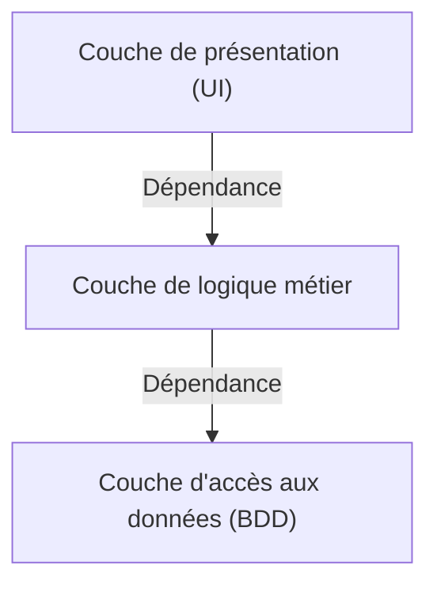
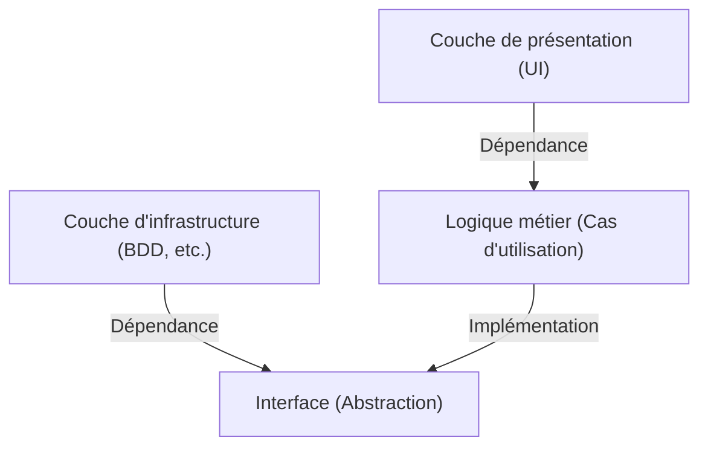

## 1. Introduction : Pourquoi l'architecture est-elle nécessaire ?

Dans l'histoire du développement logiciel, à mesure que la taille des systèmes augmente, la "maintenabilité", la "testabilité" et la "résistance aux changements" ont toujours été des défis. L'architecture à 3 tiers (MVC : Model-View-Controller), qui était dominante au début du développement web, était une approche révolutionnaire pour séparer la couche de présentation et la couche d'accès aux données.

Cependant, l'architecture à 3 tiers traditionnelle présentait des limites majeures. Elle avait tendance à être "pilotée par la base de données". La logique métier (domaine) dépendait de la couche d'accès aux données, ce qui conduisait à un fort couplage avec des technologies de base de données spécifiques ou des ORM.

Pour résoudre ce problème, l'"Architecture Hexagonale" par Alistair Cockburn, l'"Architecture Oignon" par Jeffrey Palermo, et l'"Architecture Clean" par Uncle Bob (Robert C. Martin) ont été proposées. Bien qu'elles soient exprimées sous des noms et des diagrammes différents, la philosophie sous-jacente est remarquablement similaire.

## 2. Les limites de l'architecture à 3 tiers et la dépendance à la base de données

Dans l'architecture à 3 tiers traditionnelle, les dépendances s'écoulent de haut en bas comme suit.

Le plus grand problème de cette structure est que la logique métier dépend de la couche d'accès aux données (infrastructure). En d'autres termes, les règles métier sont entravées par la méthode d'exécution des requêtes SQL et la structure des tables de la base de données. Modifier la base de données ou essayer d'introduire un nouveau framework provoque un cauchemar où les modifications se propagent à l'ensemble de la logique métier.

## 3. La généalogie des 3 architectures

### 3.1 Architecture Hexagonale (Ports and Adapters)
Proposée par Alistair Cockburn, cette architecture est également appelée "Ports et Adaptateurs". Son objectif est de séparer le cœur de l'application (logique métier) de l'extérieur (UI, base de données, tests, etc.). L'application fournit et requiert des interfaces appelées "ports", et le monde extérieur se connecte à ces ports via des "adaptateurs".

### 3.2 Architecture Oignon
Proposée par Jeffrey Palermo. Elle place le modèle de domaine au centre, entouré des services de domaine, des services d'application, et de l'infrastructure ou de l'UI à l'extérieur. Elle définit clairement la règle selon laquelle les dépendances doivent toujours aller "de l'extérieur vers l'intérieur".

### 3.3 Architecture Clean
Une architecture présentée par Uncle Bob. Célèbre pour son diagramme de cercles concentriques, elle place les entités (règles métier de l'entreprise) au centre, les cas d'utilisation (règles métier spécifiques à l'application) à l'extérieur, suivis des contrôleurs et passerelles, et enfin les détails (infrastructure) comme le Web et la BDD dans la couche la plus externe.

## 4. La philosophie commune au cœur : Le principe d'inversion des dépendances (DIP)

Ces trois architectures adoptent toutes l'approche de "placer la logique métier au centre (à l'intérieur) et l'infrastructure ou les frameworks à l'extérieur". Et l'arme puissante pour réaliser cette structure est le "Principe d'inversion des dépendances (Dependency Inversion Principle : DIP)".

Le DIP correspond au "D" des principes SOLID, et possède les deux règles suivantes :
1. Les modules de haut niveau ne doivent pas dépendre des modules de bas niveau. Les deux doivent dépendre d'"abstractions".
2. Les abstractions ne doivent pas dépendre des "détails". Les détails doivent dépendre des "abstractions".

Dans ces architectures, le DIP est utilisé pour "inverser" les dépendances traditionnelles.

La logique métier n'a pas besoin de savoir où les données sont stockées. Elle ne dépend que de la "fonction (interface) pour sauvegarder les données". Et la couche d'infrastructure implémente cette interface. Cela inverse la dépendance à "Infrastructure → Logique métier", rendant la logique métier complètement indépendante de tout élément externe.

## 5. L'importance de la séparation de la couche d'infrastructure

Pourquoi se donner tant de mal pour séparer l'infrastructure ?

1. **Testabilité (Testability) :** Il devient possible de tester la logique métier seule, rapidement et de manière fiable en utilisant des mocks, sans base de données ni API externe.
2. **Décisions différées (Deferring Decisions) :** Il n'est pas nécessaire de choisir la base de données ou le framework web au début du projet. La logique métier principale peut être construite en premier, en laissant les détails de l'infrastructure pour plus tard.
3. **Libération du framework :** La durée de vie des règles métier est beaucoup plus longue que celle des frameworks. Cela évite que la logique métier ne soit impliquée dans les mises à jour ou les changements de framework.

## Conclusion

L'Architecture Clean, l'Architecture Hexagonale et l'Architecture Oignon. Bien que la façon de dessiner les diagrammes et la terminologie diffèrent, les objectifs et les moyens visés sont parfaitement alignés. Il s'agit de "construire un système durable, résistant aux changements de l'environnement externe, en plaçant le cœur du métier au centre, en séparant les préoccupations et en inversant les dépendances".
