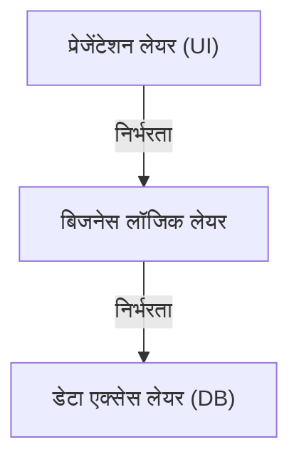
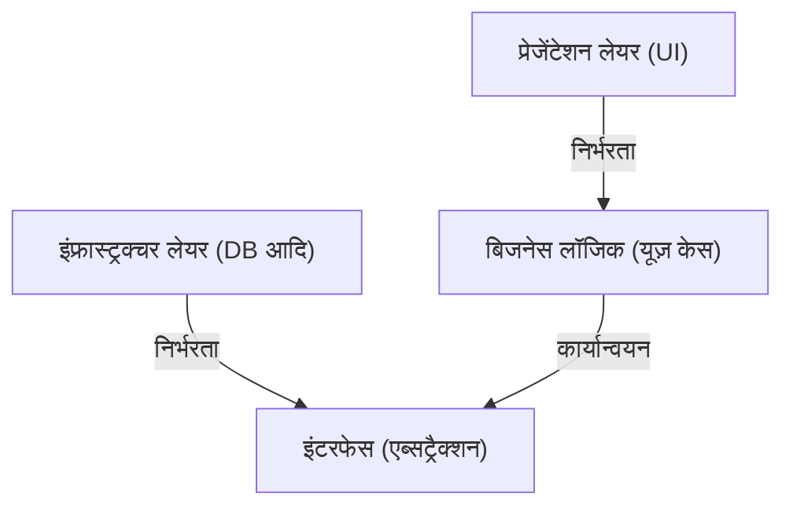

## 1. परिचय: आर्किटेक्चर की आवश्यकता क्यों है?

सॉफ्टवेयर विकास के इतिहास में, जैसे-जैसे सिस्टम का आकार बढ़ता गया, 'रखरखाव' (Maintainability), 'टेस्टिंग में आसानी' (Testability) और 'बदलाव के प्रति सहनशीलता' (Resilience to change) हमेशा चुनौतियाँ रही हैं। प्रारंभिक वेब विकास में जो 3-टियर आर्किटेक्चर (MVC: Model-View-Controller) मुख्यधारा में था, वह प्रेजेंटेशन लेयर और डेटा एक्सेस लेयर को अलग करने का एक क्रांतिकारी तरीका था।

हालाँकि, पारंपरिक 3-टियर आर्किटेक्चर की बड़ी सीमाएँ थीं। वह यह कि यह 'डेटाबेस-ड्रिवेन' (Database-driven) बनने की प्रवृत्ति रखता था। एक समस्या थी कि बिजनेस लॉजिक (डोमेन) डेटा एक्सेस लेयर पर निर्भर करता था, और इस प्रकार विशिष्ट डेटाबेस तकनीकों या ORM के साथ मजबूती से जुड़ जाता था।

इस समस्या को हल करने के लिए एलिस्टेयर कॉकबर्न (Alistair Cockburn) द्वारा 'हेक्सागोनल आर्किटेक्चर' (Hexagonal Architecture), जेफरी पालेर्मो (Jeffrey Palermo) द्वारा 'अनियन आर्किटेक्चर' (Onion Architecture), और अंकल बॉब (Robert C. Martin) द्वारा 'क्लीन आर्किटेक्चर' (Clean Architecture) प्रस्तावित किए गए थे। इन्हें अलग-अलग नामों और आरेखों के माध्यम से दर्शाया जाता है, लेकिन उनके मूल विचार आश्चर्यजनक रूप से समान हैं।

## 2. 3-टियर आर्किटेक्चर की सीमाएँ और डेटाबेस पर निर्भरता

पारंपरिक 3-टियर आर्किटेक्चर में, निर्भरताएँ ऊपर से नीचे की ओर इस प्रकार बहती हैं:

इस संरचना की सबसे बड़ी समस्या यह है कि बिजनेस लॉजिक डेटा एक्सेस लेयर (इंफ्रास्ट्रक्चर) पर निर्भर करता है। अर्थात्, बिजनेस रूल्स SQL जारी करने के तरीकों और डेटाबेस की टेबल संरचना से प्रभावित हो जाते हैं। यदि आप डेटाबेस को बदलने या नया फ्रेमवर्क पेश करने का प्रयास करते हैं, तो यह एक দুঃस्वप्न (nightmare) का कारण बनता है जहाँ पूरे बिजनेस लॉजिक में संशोधन फैल जाते हैं।

## 3. 3 आर्किटेक्चर की वंशावली

### 3.1 हेक्सागोनल आर्किटेक्चर (Ports and Adapters)
एलिस्टेयर कॉकबर्न द्वारा प्रस्तावित इस आर्किटेक्चर को 'पोर्ट्स एंड एडप्टर्स' (Ports and Adapters) भी कहा जाता है। इसका उद्देश्य एप्लिकेशन के कोर (बिजनेस लॉजिक) को बाहरी दुनिया (UI, डेटाबेस, टेस्टिंग आदि) से अलग करना है। एप्लिकेशन 'पोर्ट्स' नामक इंटरफेस प्रदान करता है और मांगता है, और बाहरी दुनिया 'एडप्टर्स' के माध्यम से उन पोर्ट्स से जुड़ती है।

### 3.2 अनियन आर्किटेक्चर
इसे जेफरी पालेर्मो द्वारा प्रस्तावित किया गया था। यह डोमेन मॉडल को केंद्र में रखता है, और इसके चारों ओर डोमेन सेवाएं, एप्लिकेशन सेवाएं, और सबसे बाहरी तरफ इंफ्रास्ट्रक्चर और UI को रखता है। इसने इस नियम को स्पष्ट रूप से परिभाषित किया कि निर्भरता हमेशा 'बाहर से अंदर की ओर' (outside to inside) होनी चाहिए।

### 3.3 क्लीन आर्किटेक्चर
यह अंकल बॉब द्वारा प्रस्तुत किया गया आर्किटेक्चर है। यह अपने गाढ़े संकेंद्रित वृत्त आरेख (concentric circles diagram) के लिए प्रसिद्ध है, जिसमें केंद्र में एंटिटीज़ (पूरे उद्यम के बिजनेस रूल्स), उसके बाहर यूज़ केसेज़ (एप्लिकेशन-विशिष्ट बिजनेस रूल्स), और भी बाहर कंट्रोलर्स और गेटवेज़, और सबसे बाहरी तरफ वेब और DB जैसे विवरण (इंफ्रास्ट्रक्चर) होते हैं।

## 4. मूल में समान विचार: डिपेंडेंसी इनवर्जन प्रिंसिपल (DIP)

ये तीनों आर्किटेक्चर 'बिजनेस लॉजिक को केंद्र (अंदर) में रखने और इंफ्रास्ट्रक्चर और फ्रेमवर्क को बाहर रखने' का दृष्टिकोण अपनाते हैं। और इस संरचना को प्राप्त करने के लिए एक शक्तिशाली उपकरण 'डिपेंडेंसी इनवर्जन प्रिंसिपल' (Dependency Inversion Principle: DIP) है।

DIP, SOLID सिद्धांतों में से 'D' है, और इसके निम्नलिखित 2 नियम हैं:
1. उच्च-स्तरीय मॉड्यूल को निम्न-स्तरीय मॉड्यूल पर निर्भर नहीं होना चाहिए। दोनों को 'एब्सट्रैक्शन' (abstractions) पर निर्भर होना चाहिए।
2. एब्सट्रैक्शन को 'विवरणों' (details) पर निर्भर नहीं होना चाहिए। विवरणों को 'एब्सट्रैक्शन' पर निर्भर होना चाहिए।

इन आर्किटेक्चर में, पारंपरिक निर्भरता को 'उलटने' (invert) के लिए DIP का उपयोग किया जाता है।

बिजनेस लॉजिक को यह जानने की आवश्यकता नहीं है कि डेटा कहाँ सहेजा गया है। यह केवल 'डेटा सहेजने के कार्य (इंटरफेस)' पर निर्भर करता है। और फिर, इंफ्रास्ट्रक्चर लेयर उस इंटरफेस को लागू (implement) करती है। इसके परिणामस्वरूप, निर्भरता 'इंफ्रास्ट्रक्चर → बिजनेस लॉजिक' में उलट जाती है, और बिजनेस लॉजिक सभी बाहरी तत्वों से पूरी तरह से स्वतंत्र हो जाता है।

## 5. इंफ्रास्ट्रक्चर लेयर को अलग करने का महत्व

इंफ्रास्ट्रक्चर को इस हद तक अलग क्यों किया जाना चाहिए?

1. **टेस्टिंग में आसानी (Testability):** डेटाबेस या बाहरी API के बिना, मॉक्स (mocks) का उपयोग करके बिजनेस लॉजिक को अकेले ही तेज़ी से और मज़बूती से टेस्ट किया जा सकता है।
2. **निर्णय टालना (Deferring Decisions):** प्रोजेक्ट के शुरुआती चरणों में डेटाबेस या वेब फ्रेमवर्क तय करने की कोई आवश्यकता नहीं है। आप मुख्य बिजनेस लॉजिक पहले बना सकते हैं और इंफ्रास्ट्रक्चर के विवरणों को बाद के लिए छोड़ सकते हैं।
3. **फ्रेमवर्क से मुक्ति:** बिजनेस रूल्स का जीवनकाल फ्रेमवर्क के जीवनकाल से बहुत लंबा होता है। यह बिजनेस लॉजिक को फ्रेमवर्क अपग्रेड या बदलावों में उलझने से रोकता है।

## निष्कर्ष

क्लीन आर्किटेक्चर, हेक्सागोनल आर्किटेक्चर और अनियन आर्किटेक्चर। यद्यपि इनके चित्र बनाने के तरीके और शब्दावली अलग हैं, लेकिन इनके लक्ष्य और साधन पूरी तरह से एक समान हैं। वह यह है कि 'बिजनेस के मूल (core) को केंद्र में रखकर, चिंताओं को अलग करके (separation of concerns), और निर्भरताओं को उलट कर, बाहरी वातावरण में बदलावों के प्रति प्रतिरोधी एक टिकाऊ सिस्टम बनाना।'
